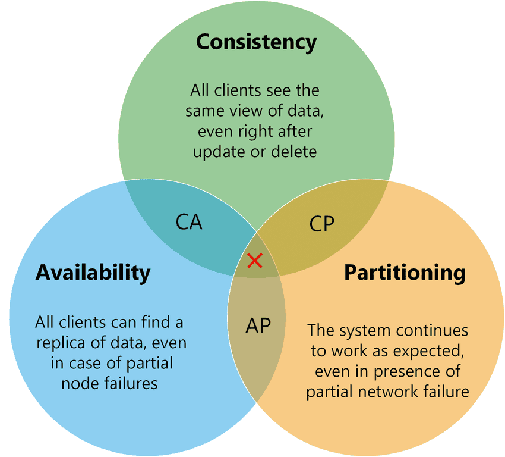
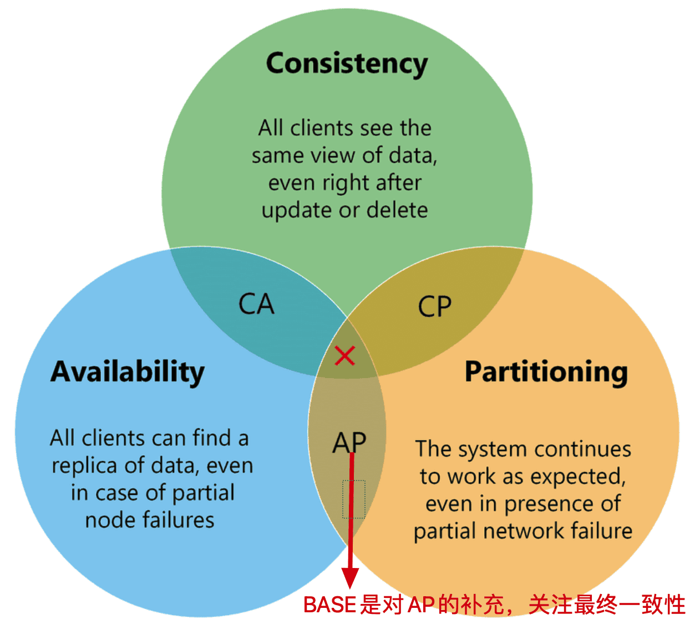
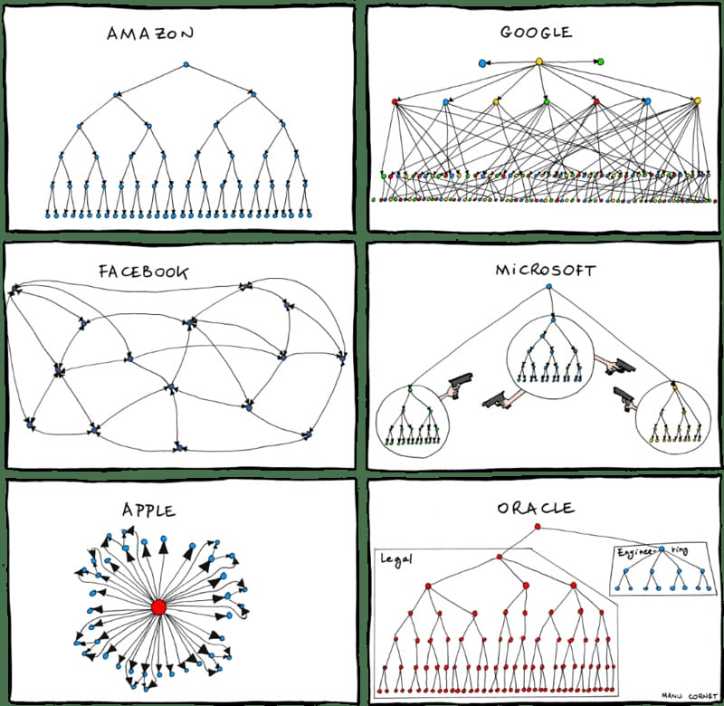

## 软件开发的原则

大家公认的是，接口设计的五大核心原则（SOLID），除此之外，还有（迪米特原则 **/** 组合聚合）。

### 单一职责原则

Single-Responsibility Principle，**一个模块只干一件事**。

Java的体现：一个对象应该只包含单一的职责，并且该职责被完整地封装在一个类中。如SpringMVC 中Entity,DAO,Service,Controller,Util等的分离。

### 开闭原则

Open - ClosedPrinciple，**对修改关闭，对扩展开放**。

意思就是，当你要加新功能时，尽量别去改已经写好的、测试过的、正在运行的旧代码（改旧代码容易出错），而是通过添加新代码来实现。

Java的体现：抽象。将系统不变的核心的操作抽象出来（抽象类和接口），一旦定义不轻易修改。当软件需求发生变更时，通过类的继承和接口的实现来扩展原有的功能。通过增加新的接口来增加新的特性。

###  里式替换原则

Liskov Substitution Principle，**子类必须能完全顶替父类的岗位，而且不会捅娄子**。

Java的体现：子类中减少重写父类的方法，保证类的扩展不会给已有的系统引入新的错误，降低了代码出错的可能性。

### 接口隔离原则

Interface Segregation Principle，**客户端不应该依赖那些它不需要的接口**。

接口隔离的原则是指使用多个专门的接口，而不去定义一个总接口。每一个接口应该承担一个相对独立的角色，不干多余的事情，只干应该做的事情。一旦一个接口太大，则需要将它分割成一些更细小的接口，使用该接口的客户端仅需知道与之相关的方法即可。

### 依赖倒置原则

Dependency-Inversion Principle，**要依赖抽象,而不要依赖具体的实现**。

抽象不应当依赖于细节；细节应当依赖于抽象；

要面向接口编程，不针对实现编程。

### 合成/聚合复用原则

Composite/Aggregate Reuse Principle，**为了软件复用，能组装就别继承**

使用继承时，需要严格遵循里氏代换原则。滥用继承，导致代码的耦合性增加，使得系统的灵活性和可维护性下降，会破坏系统的封装性，因此需要慎重使用继承复用。

合成：表示一种强的拥有关系，表示事物需要依赖于某个整体存在。如翅膀是大雁的一部分，生命周期是相同的。

聚合：表示一种弱的拥有关系，事物可以属于某个整体，也可以独立存在。如员工可以属于公司，也能脱离公司存在，加入其他公司。

Java的体现：通过将对象组合在一起形成更大的对象，来达到复用的目的。就是在一个新的对象里面使用一些已有的对象，使之成为新对象的一部分；新对象通过向这些对象的委派达到复用已有功能的目的。

### 迪米特法则

Law of Demeter，**模块不要与其他模块互相作用,减少模块之间的耦合度**。

又叫最少知识原则(Least Knowledge Principle或简写为LKP)

Java的体现：一个对象应当对其它对象有尽可能少的了解。一个类应该对自己需要耦合或调用的类知道得最少，你(被耦合或调用的类)的内部是如何复杂都和我没关系，那是你的事情，我就知道你提供的public方法，我就调用这么多，其他的一概不关心。

对于一个对象，其朋友包括以下几类:

1. 当前对象本身(this)；
2. 以参数形式传入到当前对象方法中的对象；
3. 当前对象的成员对象；
4. 如果当前对象的成员对象是一个集合，那么集合中的元素也都是朋友；
5. 当前对象所创建的对象。

### 侧重点

这7种设计原则是软件设计模式必须尽量遵循的原则，各种原则要求的侧重点不同：

- 开闭原则是总纲，它告诉我们要对扩展开放，对修改关闭。
- 依赖倒置原则告诉我们要面向接口编程。
- 单一职责原则告诉我们实现类要职责单一。
- 接口隔离原则告诉我们在设计接口的时候要精简单一。
- 迪米特法则告诉我们方法调用保持在界限内，降低耦合度。
- 里氏替换原则告诉我们不要破坏继承体系。
- 合成复用原则告诉我们要优先使用组合或者聚合关系复用，少用继承关系复用。

## 分布式理论

### CAP 理论

CAP理论是分布式系统、特别是分布式存储领域中被讨论的最多的理论。其中C代表一致性 (Consistency)，A代表可用性 (Availability)，P代表分区容错性 (Partition tolerance)。CAP理论告诉我们C、A、P三者不能同时满足，最多只能满足其中两个。 



在理论计算机科学中，CAP 定理（CAP theorem）指出对于一个分布式系统来说，当设计读写操作时，只能同时满足以下三点中的两个：

- **一致性（Consistency）** : 所有节点访问同一份最新的数据副本
- **可用性（Availability）**: 非故障的节点在合理的时间内返回合理的响应（不是错误或者超时的响应）。
- **分区容错性（Partition Tolerance）** : 分布式系统出现网络分区的时候，仍然能够对外提供服务。

**什么是网络分区？**

分布式系统中，多个节点之前的网络本来是连通的，但是因为某些故障（比如部分节点网络出了问题）某些节点之间不连通了，整个网络就分成了几块区域，这就叫 **网络分区**。

**如何选择架构？**

CA 理论上是可以成立的——**但只能在网络始终稳定、节点之间通讯永不失败的前提下**。这在实际的分布式系统中几乎不可能。

例如，若系统出现“分区”即P出现，系统中的某个节点在进行写操作。为了保证 C， 必须要禁止其他节点的读写操作，这就和 A 发生冲突了。如果为了保证 A，其他节点的读写操作正常的话，那就和 C 发生冲突了。

总之，当发生网络分区的时候，如果我们要继续服务，网络的容错性是必须要保证的，那么强一致性和可用性只能 2 选 1。也就是说分布式系统理论需要在 CP 或者 AP 架构做出抉择。

需要补充说明的一点，系统在绝大部分时候所处的状态（网络分区正常），C 和 A 能够同时保证。

ZooKeeper 保证的是 CP。 Eureka 保证的则是 AP。Nacos 不仅支持 CP 也支持 AP。

**并非三选二**

1. 分区很少发生，那么在系统不存在分区的情况下没什么理由牺牲C或A。
2. C与A之间的取舍可以在同一系统内以非常细小的粒度反复发生。
3. 这三种性质都可以在程度上衡量，并不是非黑即白的有或无。可用性显然是在0%到100%之间连续变化的，一致性分很多级别，连分区也可以细分为不同含义，如系统内的不同部分对于是否存在分区可以有不一样的认知。

**总结**

如果系统发生“分区”，我们要考虑选择 CP 还是 AP。如果系统没有发生“分区”的话，我们要思考如何保证 CA 。

### BASE 理论

BASE是“Basically Available, Soft state, Eventually consistent(基本可用、软状态、最终一致性)”的首字母缩写。其中的软状态和最终一致性这两种技巧擅于对付存在分区的场合，并因此提高了可用性。

* **基本可用（Basically Available）**分布式系统在出现不可预知故障的时候，允许损失部分可用性

* **软状态（Soft state）**称为弱状态，和硬状态相对，是指允许系统中的数据存在中间状态，并认为该中间状态的存在不会影响系统的整体可用性，即允许系统在不同节点的数据副本之间进行数据同步的过程存在延时。

* **最终一致性（Eventually consistent）**最终一致性强调的是系统中所有的数据副本，在经过一段时间的同步后，最终能够达到一个一致的状态。因此，最终一致性的本质是需要系统保证最终数据能够达到一致，而不需要实时保证系统数据的强一致性

**CAP 与 BASE 关系**

BASE是对CAP中一致性和可用性权衡的结果，其来源于对大规模互联网系统分布式实践的结论，是基于CAP定理逐步演化而来的，其核心思想是即使无法做到强一致性（Strong consistency），更具体地说，是对 CAP 中 AP 方案的一个补充，在分区故障恢复后，系统应该达到最终一致性。这一点其实就是 BASE 理论延伸的地方。



**CAP 与 ACID 关系**

ACID 是传统数据库常用的设计理念，追求强一致性模型。BASE 支持的是大型分布式系统，提出通过牺牲强一致性获得高可用性。

ACID 和 BASE 代表了两种截然相反的设计哲学，在分布式系统设计的场景中，系统组件对一致性要求是不同的，因此 ACID 和 BASE 又会结合使用。

## 事务理论 -  ACID

一个事务有四个基本特性，也就是我们常说的（ACID）：

1. **Atomicity（原子性）**：事务是一个不可分割的整体，事务内所有操作要么全做成功，要么全失败。
2. **Consistency（一致性）**：事务执行前后，数据从一个状态到另一个状态必须是一致的（A向B转账，不能出现A扣了钱，B却没收到）。
3. **Isolation（隔离性）**： 多个并发事务之间相互隔离，不能互相干扰。
4. **Durability（持久性）**：事务完成后，对数据库的更改是永久保存的，不能回滚。

MySQL的具体实现：

- 原子性：通过undolog来实现。

```
MySQL事务通常是以BEGIN TRANSACTION 开始，以 COMMIT 或 ROLLBACK 结束。
1. 事务中的每条数据变更操作都会生成一条undolog记录，在SQL执行前先于数据持久化到磁盘。
2. 事务中运行的过程中发生了某种故障，事务不能继续执行，事务将发生回滚。
3. 当事务需要回滚时，MySQL会根据回滚日志对事务中已执行的SQL做逆向操作，比如 DELETE 掉一行数据的逆向操作就是再把这行数据 INSERT回去，其他操作同理。
```

- 持久性：通过binlog、redolog来实现。

```
MySQL表数据是持久化到磁盘中的，但如果所有操作都去操作磁盘，并发量变大后将产生性能瓶颈，因此引入了缓冲池，Buffer Pool中包含了磁盘中部分数据页的映射，可以当做缓存来用。当修改表数据时，我们把操作记录先写到Buffer Pool中，并标记事务已完成，等MySQL空闲时，再把更新操作持久化到磁盘里。
但是当MySQL系统宕机，断电时Buffer Pool数据将会丢失，因此引入crash-safe落盘处理能力，将操作记录写入redolog中，待下次重启后继续将数据持久化至硬盘。

MySQL数据库的数据备份、主备、主主、住从都离不开binlog，需要依赖binlog来同步数据，保证数据一致性。

redo log（重做日志）让InnoDB存储引擎有了崩溃恢复的能力。
binlog（归档日志）保证了MySQL集群架构数据的一致性。
虽然它们都属于持久化的保证，但是侧重点不一样。
```

- 隔离性：通过(读写锁+MVCC)来实现。

原子性和持久性是为了要实现数据的正确、可用，而隔离性要管理的是多个并发读写请求（事务）过来时的执行顺序。

| 隔离级别                     | 描述                                                         | 问题                                                         |
| ---------------------------- | ------------------------------------------------------------ | ------------------------------------------------------------ |
| 读未提交（READ UNCOMMITTED） | 允许事务读取未被其他事务提交的变更。                         | 脏读，即读取到其他事务未提交的数据。还有不可重复读、幻读。   |
| 读已提交（READ COMMITED）    | 只允许事务读取已经被其它事务提交的变更。                     | 不可重复读，即一个事务里面，执行两次读命令，中途其他事务的更新命令提交导致看到的结果不同。还有幻读。 |
| 可重复读（REPEATABLE READ）  | 确保事务可以多次从一个字段中读取相同的值。在这个事务持续期间,禁止其他事物对这个字段进行更新。 | 幻读，即一个事务里面，中途其他事务的插入或删除导致查询数量或更新结果的不一致。幻读针对的是一批数据整体。 |
| 串行化（SERIALIZABLE）       | 确保事务可以从一个表中读取相同的行。                         | 为每个读的数据行上锁，会导致大量的timeout和锁竞争，性能十分低下. |

- 一致性：`MySQL通过原子性，持久性，隔离性最终实现（或者说定义）数据一致性。`

## 微服务理论 - 康威定律

康威定律是一句格言，指出组织设计系统来反映他们自己的沟通结构。它以计算机程序员**梅尔文·康威**的名字命名，他于1967年提出了这个想法。他最初的措辞是：

> organizations which design systems ... are constrained to produce designs which are copies of the communication structures of these organizations. — M. Conway
> 一个组织的系统通常被设计成这个组织通信结构的副本

这里的系统按原作者的意思并不局限于软件系统，不敢自称定律（law），只是描述了作者自己的发现和总结。后来Brooks在著名的《人月神话》中引用康威的观点，并将其称赞为我们熟知“康威定律”。

其意思通俗的讲，组织的结构是什么样子的，组织设计产生的信息系统结构也是相同样子。



**第一定律**

> Communication dictates design
>
> 组织沟通方式会通过系统设计表达出来

对于复杂的系统，聊设计就离不开聊人与人的沟通，解决好人与人的沟通问题，才能有一个好的系统设计。

**第二定律**

> There is never enough time to do something right, but there is always enough time to do it over
>
> 时间再多一件事情也不可能做得完美，但总有时间做完一件事情

没有100%的完美，只有100%的完成！任何一个设计方案都有其优点，也有其弊端。时间多就可以考虑多点，做起来就慢点。时间少就考虑少点，做起来比较快。

对于一个巨复杂的系统，我们永远无法考虑周全。敏捷开发巨头之一Erik Hollnagel （2009）在他的书中阐述了类似的观点：

> 问题太复杂？那么不妨忽略不必要的细节；
>
> 没有足够的资源？放弃无用的功能；

**第三定律**

> There is a homomorphism from the linear graph of a system to the linear graph of its design organization
>
> 线型系统和线型组织架构间潜在的异质同态特性

需要前后端分离的系统就搭建前后端分离的团队。

需要业务分离的系统就搭建按业务分离的团队。

**第四定律**

> The structures of large systems tend to disintegrate during development, qualitatively more so than with small systems
>
> 大的系统组织总是比小系统更倾向于分解

系统越复杂，越需要增加人手，人手越多，沟通成本也呈指数增长。为了降低沟通成本，解决管理问题，大组织被拆分成一个个小团队，让团队内部完成自治理，然后统一对外沟通。

**启示**

* 出现问题时只找对应分工的人沟通，不要找其他无关的人，降低沟通成本。
* 通过MVP（Minimum Viable Product）的方式来设计系统，通过不断的迭代来验证优化，系统应该是弹性设计的。

* 想要什么样的系统设计，就架构什么样的团队。最好按业务来划分团队，团队内部全栈，达成自然的自治内聚，明确的业务边界会减少和外部的沟通成本。
  * 微服务的团队间应该是 inter-operate, not integrate 。
* 做小而美的团队，降低沟通的成本，提升效率。

## 参考文章

[面向对象的七大设计原则 - 详解 - yfceshi - 博客园](https://www.cnblogs.com/yfceshi/p/19024842#一、开闭原则（The Open-Closed Principle ，OCP）)

[JAVA七大设计原则总结(详解篇)_java架构设计原则-CSDN博客](https://blog.csdn.net/little__SuperMan/article/details/104596393)

[一文看懂分布式系统的CAP和BASE理论 - 知乎](https://zhuanlan.zhihu.com/p/636768391)
