# 基础知识

## dubbo 概述

### 简介

[Apache Dubbo](https://dubbo.apache.org/zh/)

Apache Dubbo (incubating) |ˈdʌbəʊ| 是一款高性能、轻量级的开源 Java RPC 框架，它提供了三大核心能力：面向接口的远程方法调用，智能容错和负载均衡，以及服务自动注册和发现。

### 特性

* 面向接口代理的高性能 RPC 调用

提供高性能的基于代理的远程调用能力，服务以接口为粒度，为开发者屏蔽远程调用底层细节。

* 智能负载均衡

内置多种负载均衡策略，智能感知下游节点健康状况，显著减少调用延迟，提高系统吞吐量。

* 服务自动注册与发现

支持多种注册中心服务，服务实例上下线实时感知。


* 运行期流量调度

内置条件、脚本等路由策略，通过配置不同的路由规则，轻松实现灰度发布，同机房优先等功能。

* 高度可扩展能力

* 可视化的服务治理与运维

### 设计架构


* 服务提供者（Provider）：暴露服务的服务提供方，服务提供者在启动时，向注册中心注册自己提供的服务。
* 服务消费者（Consumer）: 调用远程服务的服务消费方，服务消费者在启动时，向注册中心订阅自己所需的服务，服务消费者，从提供者地址列表中，基于软负载均衡算法，选一台提供者进行调用，如果调用失败，再选另一台调用。
* 注册中心（Registry）：注册中心返回服务提供者地址列表给消费者，如果有变更，注册中心将基于长连接推送变更数据给消费者
* 监控中心（Monitor）：服务消费者和提供者，在内存中累计调用次数和调用时间，定时每分钟发送一次统计数据到监控中心

### 与 SpringCloud 的区别

- 定位：SpringCloud 定位为微服务架构下的一站式解决方案；Dubbo 是 SOA 时代的产物，它的关注点主要在于服务的调用和治理
- 生态环境：Spring 平台，具备更加完善的生态体系；而 Dubbo 一开始只是做 RPC 远程调用，生态相对匮乏，现在逐渐丰富起来。
- HTTP 调用方式不同：SpringCloud 是采用 Http 协议做远程调用，接口一般是 Rest 风格，比较灵活；Dubbo 是采用 Dubbo 协议，接口一般是 Java 的 Service 接口，格式固定。但调用时采用 Netty 的 NIO 方式，性能较好。
- 组件差异：例如 SpringCloud 注册中心一般用 Eureka，而 Dubbo 用的是 Zookeeper

## dubbo 环境搭建

### 安装注册中心【windows】-安装 zookeeper

### 安装监控中心 【windows】-安装 dubbo-admin 管理控制台

dubbo 本身并不是一个服务软件。它其实就是一个 jar 包能够帮你的 java 程序连接到 zookeeper，并利用 zookeeper 消费、提供服务。所以你不用在 Linux 上启动什么 dubbo 服务。

但是为了让用户更好的管理监控众多的 dubbo 服务，官方提供了一个可视化的监控程序，不过这个监控即使不装也不影响使用。

1. 下载 dubbo-admin

https://github.com/apache/incubator-dubbo-ops

2. 进入目录，修改 dubbo-admin 配置

修改 src\main\resources\application.properties 指定 zookeeper 地址

3. 打包 dubbo-admin

mvn clean package -Dmaven.test.skip = true 

4. 运行 dubbo-admin

java -jar dubbo-admin-0.0.1-SNAPSHOT.jar

默认使用 root/root 登陆


## dubbo 入门

### 需求

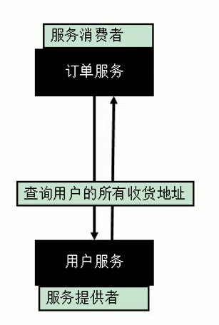

### 工程架构

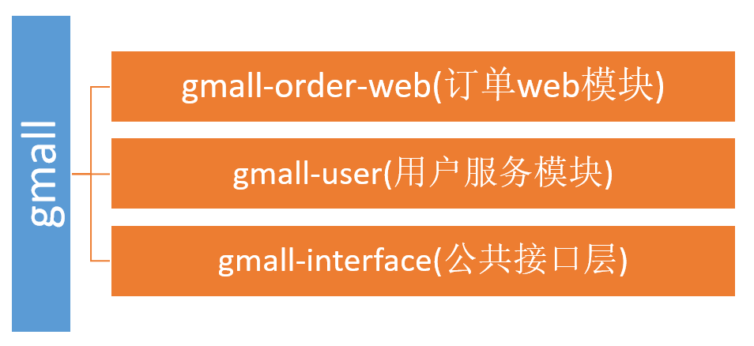

现在这样是无法进行调用的。我们 gmall-order-web 引入了 gmall-interface，但是 interface 的实现是 gmall-user，我们并没有引入，而且实际他可能还在别的服务器中。

### 使用 dubbo 改造

1. 将服务提供者注册到注册中心（暴露服务）

依赖

```xml
<!-- 引入dubbo-->
<!-- https://mvnrepository.com/artifact/com.alibaba/dubbo -->
<dependency>
    <groupId>com.alibaba</groupId>
    <artifactId>dubbo</artifactId>
    <version>2.6.2</version>
</dependency>
<!-- 由于我们使用zookeeper作为注册中心，所以需要操作zookeeper
dubbo 2.6以前的版本引入zkclient操作zookeeper
dubbo 2.6及以后的版本引入curator操作zookeeper
下面两个zk客户端根据dubbo版本2选1即可
-->

<!-- curator-framework -->
<dependency>
    <groupId>org.apache.curator</groupId>
    <artifactId>curator-framework</artifactId>
    <version>2.12.0</version>
</dependency>
```

配置服务提供者

```xml
<!--1.指定当前服务/应用的名字-->
<dubbo:application name="user-service-provider"/>

<!--2.指定注册中心的位置-->
<dubbo:registry protocol="zookeeper" address="127.0.0.1:2181"/>

<!--3.指定通信规则-->
<dubbo:protocol name="dubbo" port="20080"/>

<!--4.暴露服务-->
<dubbo:service interface="com.tintin.service.UserService" ref="userServiceImpl"/>

<!--服务的实现-->
<bean id="userServiceImpl" class="com.tintin.service.impl.UserServiceImpl"/>
```

测试

```java
public class MainApplication {
    public static void main(String args[]) throws IOException {
        ClassPathXmlApplicationContext applicationContext = new ClassPathXmlApplicationContext("provider.xml");
        applicationContext.start();
        System.in.read();
    }
}
```

2. 让服务消费者去注册中心订阅服务

订阅服务 

```xml
    <dubbo:application name="order-service-consumer"/>

    <dubbo:registry protocol="zookeeper" port="127.0.0.1:2181"/>

    <!--声明要调用的远程服务接口，生成远程服务代理-->
    <dubbo:reference interface="com.tintin.service.UserService" id="userService"/>

```

测试

```java
public class MainApplication {
    public static void main(String[] args) throws IOException {
        ClassPathXmlApplicationContext applicationContext = new ClassPathXmlApplicationContext("consumer.xml");
        OrderService orderService = applicationContext.getBean(OrderService.class);
        orderService.initOrder("1");
        System.out.println("调用完成。。。");
        System.in.read();
    }
}

//用户id：1
//北京市昌平区宏福科技园综合楼3层
//深圳市宝安区西部硅谷大厦B座3层（深圳分校）
//调用完成。。。
```


### 注解版本

服务提供方

```xml

	<dubbo:application name="gmall-user"></dubbo:application>
    <dubbo:registry address="zookeeper://118.24.44.169:2181" />
    <dubbo:protocol name="dubbo" port="20880" />
<dubbo:annotation package="com.atguigu.gmall.user.impl"/>
```

```java
import com.alibaba.dubbo.config.annotation.Service;
import com.atguigu.gmall.bean.UserAddress;
import com.atguigu.gmall.service.UserService;
import com.atguigu.gmall.user.mapper.UserAddressMapper;

@Service //使用dubbo提供的service注解，注册暴露服务
public class UserServiceImpl implements UserService {

	@Autowired
	UserAddressMapper userAddressMapper;
    
```

```xml
//服务消费方
<dubbo:application name="gmall-order-web"></dubbo:application>
<dubbo:registry address="zookeeper://118.24.44.169:2181" />
<dubbo:annotation package="com.atguigu.gmall.order.controller"/>
```

```java
@Controller
public class OrderController {
	
	@Reference  //使用dubbo提供的reference注解引用远程服务
	UserService userService;

```


## 监控中心

### dubbo-dmain

图形化的服务管理页面；安装时需要指定注册中心地址，即可从注册中心中获取到所有的提供者/消费者进行配置管理


### dubbo-monitor-simple

简单的监控中心；

1. 下载 dubbo-ops

2. 修改配置指定注册中心地址

进入 dubbo-monitor-simple\src\main\resources\conf

修改 dubbo.properties 文件

​          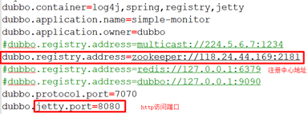

3. 打包 maven 工程

4. 解压 tar.gz 文件，并运行 start.bat

5. 启动访问 8080

   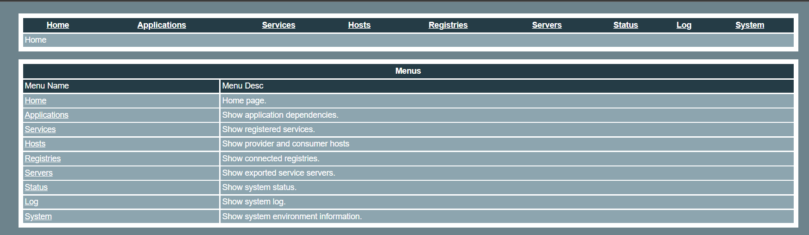

消费者和提供者配置监控中心

```xml
<!--    监控中心协议，如果为protocol=“registry”，表示从注册中心发现监控中心地址，否则直连监控中心。-->
    <dubbo:monitor protocol="registry"/>
<!--    <dubbo:monitor address="127.0.0.1:7070"/>-->
```

## 整合 springboot

1. 引入 spring-boot-starter 以及 dubbo 和 curator 的依赖

```xml
<dependency>
    <groupId>com.alibaba.boot</groupId>
    <artifactId>dubbo-spring-boot-starter</artifactId>
    <version>0.2.0</version>
</dependency>
```

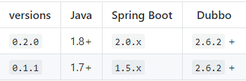

2. 配置 application.properties

   提供者配置：

   ```properties
   #服务/应用名，不能跟别的dubbo提供端重复
   dubbo.application.name=boot-user-service-provider
   
   #指定注册中心协议
   dubbo.registry.protocol=zookeeper
   #注册中心的地址加端口号
   dubbo.registry.address=127.0.0.1:2181
   
   #注解方式要扫描的包
   dubbo.scan.base-package=com.tintin.gmall
   
   #分布式固定是dubbo,不要改。
   dubbo.protocol.name=dubbo
   #通信端口
   dubbo.protocol.port=20080
   ```

   消费者配置：

   ```properties
   #服务/应用名，不能跟别的dubbo提供端重复
   dubbo.application.name=boot-order-service-consumer
   
   #指定注册中心协议
   dubbo.registry.protocol=zookeeper
   #注册中心的地址加端口号
   dubbo.registry.address=127.0.0.1:2181
   
   #注解方式要扫描的包
   dubbo.scan.base-package=com.tintin.gmall
   ```

3. dubbo 注解
   @Service、@Reference
   【如果没有在配置中写 dubbo.scan.base-package, 还需要使用@EnableDubbo 注解】

```java
@com.alibaba.dubbo.config.annotation.Service//暴露服务
@Service
public class UserServiceImpl implements UserService {
```

```java
@Service
public class OrderServiceImpl implements OrderService {
	@Reference
	UserService userService;
```

## dubbo 配置

### 配置原则

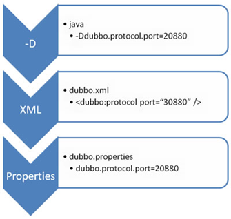

JVM 启动 -D 参数优先，这样可以使用户在部署和启动时进行参数重写，比如在启动时需改变协议的端口。

XML 次之，如果在 XML 中有配置，则 dubbo.properties 中的相应配置项无效。(与 springboot 整合是, 即为 application.properties)

Properties 最后，相当于缺省值，只有 XML 没有配置时，dubbo.properties 的相应配置项才会生效，通常用于共享公共配置，比如应用名。

dubbo 推荐在 Provider 上尽量多配置 Consumer 端属性：

1. 作服务的提供者，比服务使用方更清楚服务性能参数，如调用的超时时间，合理的重试次数，等等

2. 在 Provider 配置后，Consumer 不配置则会使用 Provider 的配置值，即 Provider 配置可以作为 Consumer 的缺省值。否则，Consumer 会使用 Consumer 端的全局设置，这对于 Provider 不可控的，并且往往是不合理的

### 配置覆盖原则

以 timeout 为例，显示了酌的查找顺序，其它 retries, loadbalance, actives 等类似：
方法级优先，接口级次之，全局配置再次之。
如果级别一样，则消费方优先，提供方次之。
其中，服务提供方配置，通过 URL 经由注册中心传递给消费方。


### 配置消费者/提供者统一规则

```xml
<!--check启动时检查提供者是否存在，true报错，false忽略-->
    <dubbo:consumer check="false"/>
```

### 重试次数

失败自动切换，当出现失败，重试其它服务器，但重试会带来更长延迟。可通过 retries = "2" 来设置重试次数(不含第一次)。


```xml
重试次数配置如下：
<dubbo:service retries="2" />
或
<dubbo:reference retries="2" />
或
<dubbo:reference>
    <dubbo:method name="findFoo" retries="2" />
</dubbo:reference>

```

### 超时时间

由于网络或服务端不可靠，会导致调用出现一种不确定的中间状态（超时）。为了避免超时导致客户端资源（线程）挂起耗尽，必须设置超时时间。

Dubbo 消费端

```xml
全局超时配置
<dubbo:consumer timeout="5000" />

指定接口以及特定方法超时配置
<dubbo:reference interface="com.foo.BarService" timeout="2000">
    <dubbo:method name="sayHello" timeout="3000" />
</dubbo:reference>
```

Dubbo 服务端

 

```xml
全局超时配置
<dubbo:provider timeout="5000" />

指定接口以及特定方法超时配置
<dubbo:provider interface="com.foo.BarService" timeout="2000">
    <dubbo:method name="sayHello" timeout="3000" />
</dubbo:provider>

```

### 版本号

当一个接口实现，出现不兼容升级时，可以用版本号过渡，版本号不同的服务相互间不引用。

可以按照以下的步骤进行版本迁移：

在低压力时间段，先升级一半提供者为新版本

再将所有消费者升级为新版本

然后将剩下的一半提供者升级为新版本

```xml
老版本服务提供者配置：
<dubbo:service interface="com.foo.BarService" version="1.0.0" />

新版本服务提供者配置：
<dubbo:service interface="com.foo.BarService" version="2.0.0" />

老版本服务消费者配置：
<dubbo:reference id="barService" interface="com.foo.BarService" version="1.0.0" />

新版本服务消费者配置：
<dubbo:reference id="barService" interface="com.foo.BarService" version="2.0.0" />

如果不需要区分版本，可以按照以下的方式配置：
<dubbo:reference id="barService" interface="com.foo.BarService" version="*" />

```

### 本地存根

在 Dubbo 中利用本地存根在客户端执行部分逻辑

远程服务后，客户端通常只剩下接口，而实现全在服务器端，但提供方有些时候想在客户端也执行部分逻辑，比如：做 ThreadLocal 缓存，提前验证参数，调用失败后伪造容错数据等等，此时就需要在 API 中带上 Stub，客户端生成 Proxy 实例，会把 Proxy 通过构造函数传给 Stub [1](https://dubbo.apache.org/zh/docs/v3.0/references/features/local-stub/#fn:1)，然后把 Stub 暴露给用户，Stub 可以决定要不要去调 Proxy。

本地存根代码

```java
public class UserServiceStub implements UserService {

    private final UserService userService;

    /**
     * 传入的是UserService远程代理对象
     */
    public UserServiceStub(UserService userService) {
        this.userService = userService;
    }


    @Override
    public List<UserAddress> getUserAddressList(String userId) {
        System.out.println("UserServicesStub....");
        if (!StringUtils.isEmpty(userId)){
            userService.getUserAddressList(userId);
        }
        return null;
    }
}

```

### 整合 springboot

导入配置文件方式

```java
//@EnableDubbo
@ImportResource(locations = "classpath:provider.xml")
@SpringBootApplication
public class BootUserServiceProviderApplication {
```

完全注解开发方式

```java
public class DubboProviderConfig {
    @Bean
    public ApplicationConfig applicationConfig() {
        ApplicationConfig applicationConfig = new ApplicationConfig();
        applicationConfig.setName("boot-user-service-provider");
        return applicationConfig;
    }

    @Bean
    public RegistryConfig registryConfig() {
        RegistryConfig registryConfig = new RegistryConfig();
        registryConfig.setProtocol("zookeeper");
        registryConfig.setAddress("127.0.0.1:2181");
        return registryConfig;
    }

    @Bean
    public ProtocolConfig protocolConfig() {
        ProtocolConfig protocolConfig = new ProtocolConfig();
        protocolConfig.setName("dubbo");
        protocolConfig.setPort(20080);
        return protocolConfig;
    }

    @Bean
    public MonitorConfig monitorConfig() {
        MonitorConfig monitorConfig = new MonitorConfig();
        monitorConfig.setProtocol("registry");
        return monitorConfig;
    }

    @Bean
    public ServiceConfig<UserService> userServiceServiceConfig(UserService userService) {
        ServiceConfig<UserService> userServiceServiceConfig = new ServiceConfig<>();
        userServiceServiceConfig.setInterface(UserService.class);
        userServiceServiceConfig.setRef(userService);

        MethodConfig methodConfig = new MethodConfig();
        methodConfig.setName("getUserAddressList");
        methodConfig.setTimeout(1000);

        userServiceServiceConfig.setMethods(Arrays.asList(methodConfig));
        
        return userServiceServiceConfig;
    }
    
    //monitorConfig
    //ProviderConfig
}
```

## dubbo 高可用

### zookeeper 宕机与 dubbo 直连

现象：zookeeper 注册中心宕机，还可以消费 dubbo 暴露的服务。

原因：健壮性

* 监控中心宕掉不影响使用，只是丢失部分采样数据
* 数据库宕掉后，注册中心仍能通过缓存提供服务列表查询，但不能注册新服务
* 注册中心对等集群，任意一台宕掉后，将自动切换到另一台
* **注册中心全部宕掉后，服务提供者和服务消费者仍能通过本地缓存通讯**
* 服务提供者无状态，任意一台宕掉后，不影响使用
* 服务提供者全部宕掉后，服务消费者应用将无法使用，并无限次重连等待服务提供者恢复

高可用：通过设计，减少系统不能提供服务的时间；

dubbo 直连

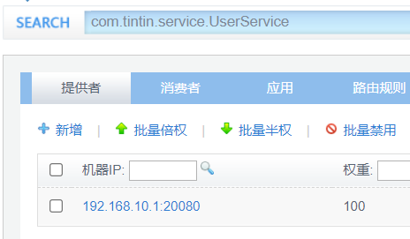

```java
@Reference(url="127.0.0.1:20080")
	UserService userService;
```

### 集群下 dubbo 负载均衡配置

在集群负载均衡时，Dubbo 提供了多种均衡策略，缺省为 random 随机调用。

负载均衡策略

* Random LoadBalance 随机，按权重设置随机概率。

在一个截面上碰撞的概率高，但调用量越大分布越均匀，而且按概率使用权重后也比较均匀，有利于动态调整提供者权重。


* RoundRobin LoadBalance 轮循，按公约后的权重设置轮循比率。

存在慢的提供者累积请求的问题，比如：第二台机器很慢，但没挂，当请求调到第二台时就卡在那，久而久之，所有请求都卡在调到第二台上。


* LeastActive LoadBalance 最少活跃调用数，相同活跃数的随机，活跃数指调用前后计数差。

使慢的提供者收到更少请求，因为越慢的提供者的调用前后计数差会越大。

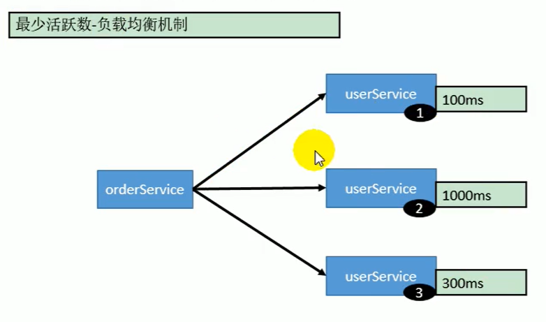

* ConsistentHash LoadBalance 一致性 Hash，相同参数的请求总是发到同一提供者。

当某一台提供者挂时，原本发往该提供者的请求，基于虚拟节点，平摊到其它提供者，不会引起剧烈变动。算法参见：http://en.wikipedia.org/wiki/Consistent_hashing
缺省只对第一个参数 Hash，如果要修改，请配置 <dubbo:parameter key="hash.arguments" value="0,1" />
缺省用 160 份虚拟节点，如果要修改，请配置 <dubbo:parameter key="hash.nodes" value="320" />

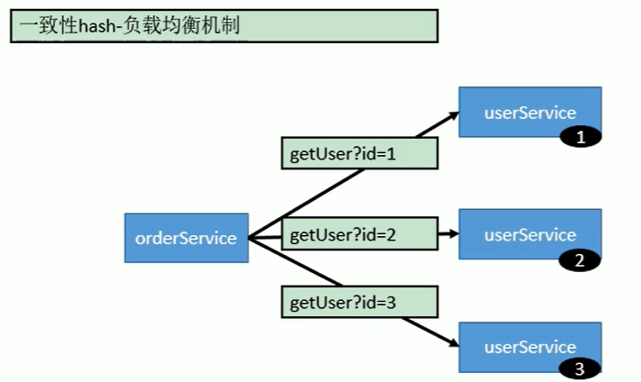

```java
@Reference(loadbalance = "roundrobin")
	UserService userService;
@Reference(loadbalance = "random")
	UserService userService;
```

### 整合 hystrix，服务熔断与降级处理

#### 服务降级

**当服务器压力剧增的情况下，根据实际业务情况及流量，对一些服务和页面有策略的不处理或换种简单的方式处理，从而释放服务器资源以保证核心交易正常运作或高效运作。**

可以通过服务降级功能临时屏蔽某个出错的非关键服务，并定义降级后的返回策略。

向注册中心写入动态配置覆盖规则：

```java
RegistryFactory registryFactory = ExtensionLoader.getExtensionLoader(RegistryFactory.class).getAdaptiveExtension();

Registry registry = registryFactory.getRegistry(URL.valueOf("zookeeper://10.20.153.10:2181"));

registry.register(URL.valueOf("override://0.0.0.0/com.foo.BarService?category=configurators&dynamic=false&application=foo&mock=force:return+null"));

```

其中：

* 屏蔽 mock = force: return+null 表示消费方对该服务的方法调用都直接返回 null 值，不发起远程调用。用来屏蔽不重要服务不可用时对调用方的影响。

*  容错 还可以改为 mock = fail: return+null 表示消费方对该服务的方法调用在失败后，再返回 null 值，不抛异常。用来容忍不重要服务不稳定时对调用方的影响。

#### 集群容错

在集群调用失败时，Dubbo 提供了多种容错方案，缺省为 failover 重试。

**Failover Cluster**

失败自动切换，当出现失败，重试其它服务器。通常用于读操作，但重试会带来更长延迟。可通过 retries = "2" 来设置重试次数(不含第一次)。

```xml
重试次数配置如下：

<dubbo:service retries="2" />

或

<dubbo:reference retries="2" />

或

<dubbo:reference>

  <dubbo:method name="findFoo" retries="2" />

</dubbo:reference
```

**Failfast Cluster**

快速失败，只发起一次调用，失败立即报错。通常用于非幂等性的写操作，比如新增记录。

**Failsafe Cluster**

失败安全，出现异常时，直接忽略。通常用于写入审计日志等操作。

**Failback Cluster**

失败自动恢复，后台记录失败请求，定时重发。通常用于消息通知操作。

**Forking Cluster**

并行调用多个服务器，只要一个成功即返回。通常用于实时性要求较高的读操作，但需要浪费更多服务资源。可通过 forks = "2" 来设置最大并行数。

**Broadcast Cluster**

广播调用所有提供者，逐个调用，任意一台报错则报错 [2]。通常用于通知所有提供者更新缓存或日志等本地资源信息。

**集群模式配置**

按照以下示例在服务提供方和消费方配置集群模式

```xml
<dubbo:service cluster="failsafe" />
或
<dubbo:reference cluster="failsafe" />
```

#### 整合 hystrix

Hystrix 旨在通过控制那些访问远程系统、服务和第三方库的节点，从而对延迟和故障提供更强大的容错能力。Hystrix 具备拥有回退机制和断路器功能的线程和信号隔离，请求缓存和请求打包，以及监控和配置等功能

1. 配置 spring-cloud-starter-netflix-hystrix
   spring boot 官方提供了对 hystrix 的集成，直接在 pom.xml 里加入依赖：

   ```xml
           <dependency>
               <groupId>org.springframework.cloud</groupId>
               <artifactId>spring-cloud-starter-netflix-hystrix</artifactId>
               <version>1.4.4.RELEASE</version>
           </dependency>
   ```

然后在 Application 类上增加@EnableHystrix 来启用 hystrix starter：

```java
@SpringBootApplication
@EnableHystrix
public class ProviderApplication {
```


2. 配置 Provider 端
   在 Dubbo 的 Provider 上增加@HystrixCommand 配置，这样子调用就会经过 Hystrix 代理。

   ```java
   @Service(version = "1.0.0")
   public class HelloServiceImpl implements HelloService {
       @HystrixCommand(commandProperties = {
        @HystrixProperty(name = "circuitBreaker.requestVolumeThreshold", value = "10"),
        @HystrixProperty(name = "execution.isolation.thread.timeoutInMilliseconds", value = "2000") })
       @Override
       public String sayHello(String name) {
           // System.out.println("async provider received: " + name);
           // return "annotation: hello, " + name;
           throw new RuntimeException("Exception to show hystrix enabled.");
       }
   }
   ```

   

3、配置 Consumer 端
对于 Consumer 端，则可以增加一层 method 调用，并在 method 上配置@HystrixCommand。当调用出错时，会走到 fallbackMethod = "reliable" 的调用里。

```java
@Reference(version = "1.0.0")
private HelloService demoService;

@HystrixCommand(fallbackMethod = "reliable")
public String doSayHello(String name) {
    return demoService.sayHello(name);
}
public String reliable(String name) {
    return "hystrix fallback value";
}
```

## dubbo 原理

### RPC 原理

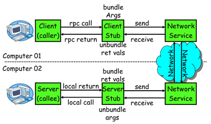

一次完整的 RPC 调用流程（同步调用，异步另说）如下： 
1）服务消费方（client）调用以本地调用方式调用服务； 
2）client stub 接收到调用后负责将方法、参数等组装成能够进行网络传输的消息体； 
3）client stub 找到服务地址，并将消息发送到服务端； 
4）server stub 收到消息后进行解码； 
5）server stub 根据解码结果调用本地的服务； 
6）本地服务执行并将结果返回给 server stub； 
7）server stub 将返回结果打包成消息并发送至消费方； 
8）client stub 接收到消息，并进行解码； 
9）服务消费方得到最终结果。
RPC 框架的目标就是要 2~8 这些步骤都封装起来，这些细节对用户来说是透明的，不可见的。

### netty 通信原理

Netty 是一个异步事件驱动的网络应用程序框架， 用于快速开发可维护的高性能协议服务器和客户端。它极大地简化并简化了 TCP 和 UDP 套接字服务器等网络编程。

BIO：(Blocking IO)

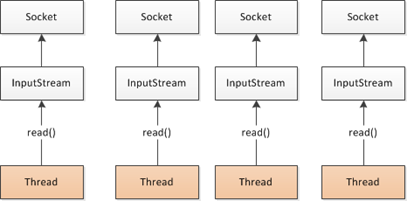

NIO (Non-Blocking IO)


Selector 一般称 为 **选择器** ，也可以翻译为 **多路复用器，**

Connect（连接就绪）、Accept（接受就绪）、Read（读就绪）、Write（写就绪）

Netty 基本原理：

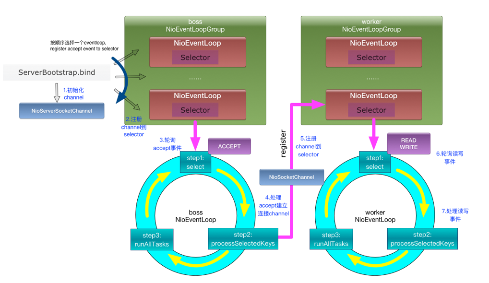

### dubbo 框架设计


* config 配置层：对外配置接口，以 ServiceConfig, ReferenceConfig 为中心，可以直接初始化配置类，也可以通过 spring 解析配置生成配置类
*  proxy 服务代理层：服务接口透明代理，生成服务的客户端 Stub 和服务器端 Skeleton, 以 ServiceProxy 为中心，扩展接口为 ProxyFactory
* registry 注册中心层：封装服务地址的注册与发现，以服务 URL 为中心，扩展接口为 RegistryFactory, Registry, RegistryService
* cluster 路由层：封装多个提供者的路由及负载均衡，并桥接注册中心，以 Invoker 为中心，扩展接口为 Cluster, Directory, Router, LoadBalance
* monitor 监控层：RPC 调用次数和调用时间监控，以 Statistics 为中心，扩展接口为 MonitorFactory, Monitor, MonitorService
*  protocol 远程调用层：封装 RPC 调用，以 Invocation, Result 为中心，扩展接口为 Protocol, Invoker, Exporter
* exchange 信息交换层：封装请求响应模式，同步转异步，以 Request, Response 为中心，扩展接口为 Exchanger, ExchangeChannel, ExchangeClient, ExchangeServer
* transport 网络传输层：抽象 mina 和 netty 为统一接口，以 Message 为中心，扩展接口为 Channel, Transporter, Client, Server, Code
* serialize 数据序列化层：可复用的一些工具，扩展接口为 Serialization, ObjectInput, ObjectOutput, ThreadPool

### dubbo 启动解析、加载配置信息

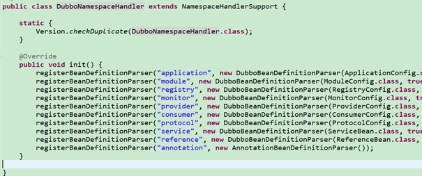

### dubbo 服务暴露

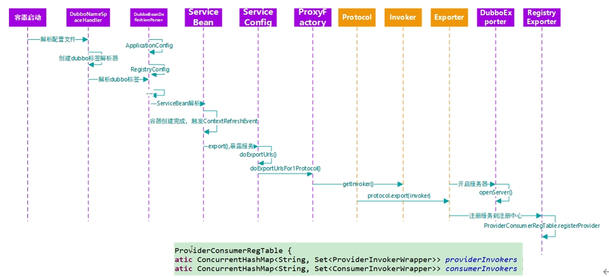

### dubbo 服务引用

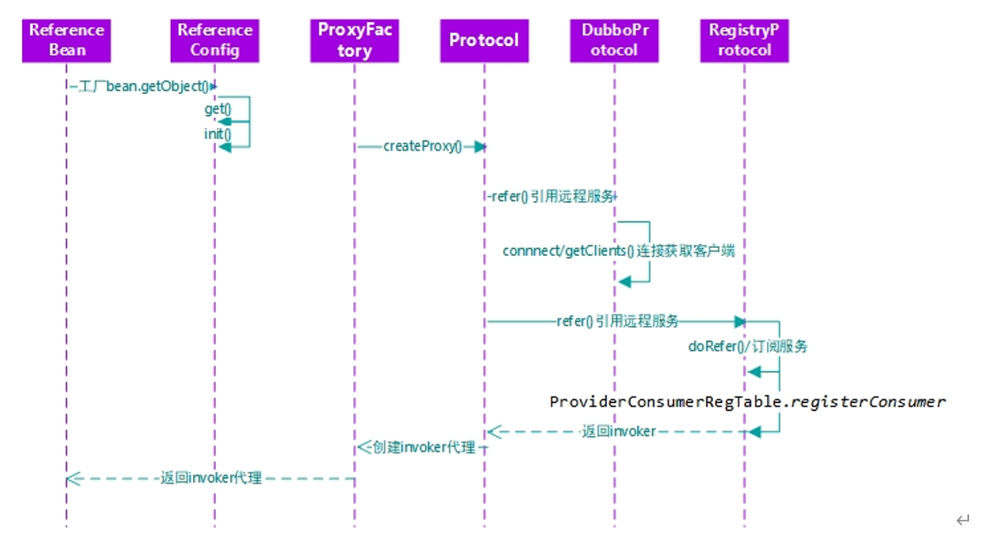

### dubbo 服务调用

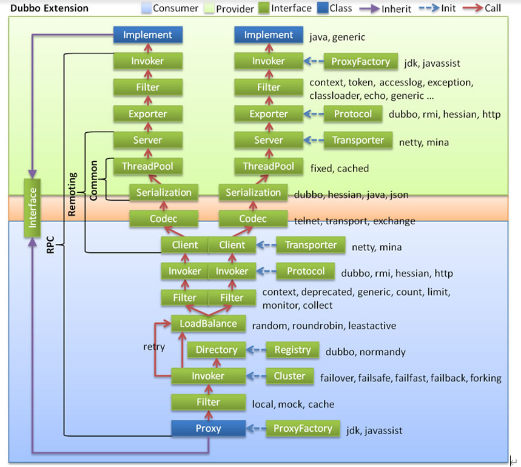

## 参考资料

[SpringCloud 与 Dubbo 的区别(全面详解)深入浅出_dubbo 和 spring cloud 区别-CSDN 博客](https://blog.csdn.net/huangtenglong/article/details/131144602)
