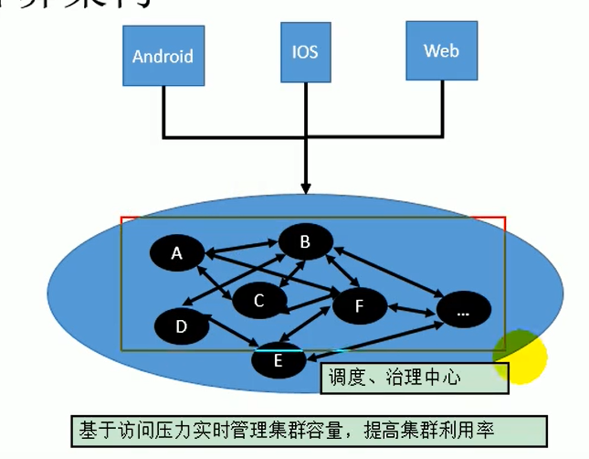

<DocsNavgation :allPages="allPages" />

## 分布式基础理论

###　分布式系统

《分布式系统原理与范型》定义：

“分布式系统是若干独立计算机的集合，这些计算机对于用户来说就像单个相关系统”

分布式系统（distributed system）是建立在网络之上的软件系统。

随着互联网的发展，网站应用的规模不断扩大，常规的垂直应用架构已无法应对，分布式服务架构以及流动计算架构势在必行，亟需**一个治理系统**确保架构有条不紊的演进。

### 应用架构演变

* 单一应用架构

  当网站流量很小时，只需一个应用，将所有功能都部署在一起，以减少部署节点和成本。此时，用于简化增删改查工作量的数据访问框架(ORM)是关键。

  优点：简单易用,小型系统

  缺点：不利于性能拓展,不利于升级维护,不利于协同开发

* 垂直应用架构

  当访问量逐渐增大，单一应用增加机器带来的加速度越来越小，将应用拆成互不相干的几个应用，以提升效率。此时，用于加速前端页面开发的Web框架(MVC)是关键。

  优点：一定程度上解决单一应用框架的缺点

  缺点：公用模块无法重复利用，开发性的浪费;界面与业务逻辑未分离;大量应用之间需要交互。

* 分布式服务架构

  当垂直应用越来越多，应用之间交互不可避免，将核心业务抽取出来，作为独立的服务，逐渐形成稳定的服务中心，使前端应用能更快速的响应多变的市场需求。此时，用于提高业务复用及整合的**分布式服务框架**(RPC）【远程过程调用】是关键。

  

* 流动计算架构

  当服务越来越多，容量的评估，小服务资源的浪费等问题逐渐显现，此时需增加一个调度中心基于访问压力实时管理集群容量，提高集群利用率。此时，用于**提高机器利用率的资源调度和治理中心**(SOA)[ Service Oriented Architecture]是

  

### RPC

RPC【Remote Procedure Call】是指远程过程调用，是一种进程间通信方式，他是一种**技术的思想**，而不是规范。它允许程序调用另一个地址空间（通常是共享网络的另一台机器上）的过程或函数，而不用程序员显式编码这个远程调用的细节。即程序员无论是调用本地的还是远程的函数，本质上编写的调用代码基本相同。

**RPC两个核心模块：通讯，序列化。**

RPC框架有很多如：
dubbo、gRPC、、Thrift、HSF（HighSpeedServiceFramework）。