# 1 数据库概述

## 1.1 为什么使用数据库

持久化：将数据保存到可掉电式存储设备以供之后使用，存储介质有磁盘文件、数据库、Xml 数据文件等

​	1.持久化数据到本地
​	2.可以实现结构化查询 SQL(structure query language)，方便管理 ，快速查找

## 1.2 数据库相关概念
​	DB(Database)：数据库，本质上是一个文件系统，保存一组有组织的数据的容器
​	DBMS(Database Manageement System)：数据库管理系统，又称为数据库软件（产品），用于建立、使用和维护数据库，对数据库进行统一管理和控制。用户通过 DBMS 访问数据库中的数据。
​	SQL(structure query language): 结构化查询语言，用于和数据库信的语言

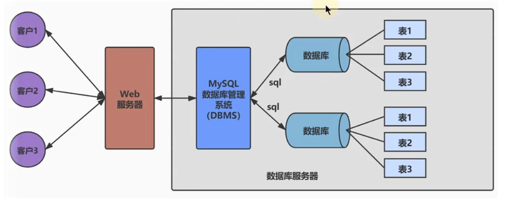

## 1.3 数据库管理系统排名

[DB-Engines Ranking - popularity ranking of database management systems](https://db-engines.com/en/ranking)、

## 1.4 MySQL vs Oracle

Oracle 更适合大型跨国企业的使用，因为他们对费用不敏感，但是对性能要求以及安全性有更高的要求。

MySQL 由于其体积小、速度快、总体拥有成本低，可处理上干万条记录的大型数据库，尤其是开放源码这一特点，使得很多互联网公司、中小型网站选择了 MySQ 作为网站数据库·(Facebook, Twitter, YouTube, 阿里巴巴/蚂蚁金服，去哪儿，美团外卖，腾讯)。

## 1.5 RDBMS vs 非 RDBMS

### 1.5.1 关系型数据库

**定义**

* 关系型数据库将复杂的数据结构归结为二元关系，即二维表格形式。
* 表与表之间的数据有关系。表示现实世界的各种实体之间的联系，用关系模型来表示。关系型数据库，就建立在关系模型基础上。
* SQL 就是关系型数据库的操作语言

**优势**

* 复杂查询
* 事务支持

### 1.5.2 非关系型数据库

**定义**

不需要经过 SQL 层解析，性能非常高，减少不常用的功能，进一步提升性能。

**分类**

也只有用 NoSQL 一词才能将这些技术囊括进来。

键值型数据库：Redis

文档型数据库：MongoDB、CouchDB

搜索引擎数据库：Solr、ElasticSearch

列式数据库：HBase

图形数据库：InnoGrid

**优势**

NoSQL 对 SQL 做出了很好的补充，比如实际开发中，有很多业务需求，其实并不需要完整的关系型数据库功能，非关系型数据库的功能就足够使用了。这种情况下，使用性能更高、成本更低的非关系型数据库当然是更明智的选择。比如：日志收集、排行榜、定时器等。

## 1.6 关系型数据库的设计规则

* 数据库中数据表的组成是结构化的，将数据放到表中，表再放到库中
* 一个数据库中可以有多个表，每个表都有一个的名字，用来标识自己。表名具有唯一性。
* 表具有一些特性，这些特性定义了数据在表中如何存储，类似 java 中 “类”的设计。

### 1.6.1 ORM 思想

* 数据库中的一个表 <---> Java 或 Python 中的一个类

* 表中的一条数据 <---> 类中的一个对象（或实体）

* 表中的一个列 <----> 类中的一个字段、属性(field)

### 1.6.2 E-R 模型

E-R（entity-relationship，实体-联系）模型中有三个主要概念是： 实体集 、 属性 、 联系集 。 

一个实体集或联系集对应于数据库中的一个表，一个实体则对应于数据库表 中的一行，也称为一条记录。一个属性对应于数据库表中的一列 ，也称为一个字段。

### 1.6.3 表的关联关系

**一对一关联**

一对一完全可以创建成一张表，例如个人用户的常用信息和非常用信息分开，防止字段冗余造成 io 性能降低

**一对多关联**

例如客户和订单，部门和员工

**多对多关联**

要表示多对多关系，必须创建第三个表，该表通常称为 **联接表** ，它将多对多关系划分为两个一对多关 系。将这两个表的主键都插入到联接表中。 例如学生和课程、用户与角色、角色与权限

**自我引用**

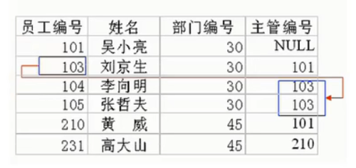


# 2 MySQL 环境搭建

## 2.1 卸载

停止服务、卸载软件、清理残余文件、清理注册表、删除环境变量

## 2.2 下载、安装、配置

[MySQL :: Download MySQL Community Server (Archived Versions)](https://downloads.mysql.com/archives/community/)

## 2.3 MySQL 服务的启动和停止

​	方式一：计算机——右击管理——服务
​	方式二：通过管理员身份运行
​	net start 服务名（启动服务）
​	net stop 服务名（停止服务）

## 2.4 MySQL 服务的登录和退出   

​	方式一：通过 mysql 自带的客户端
​	只限于 root 用户

方式二：通过 windows 自带的客户端

```
登录：
mysql 【-h主机名 -P端口号 】-u用户名 -p密码

退出：
exit或ctrl+C
​	
```

## 2.5 MySQL 的常见命令 

	1.查看当前所有的数据库
	show databases;
	2.打开指定的库
	use 库名
	3.查看当前库的所有表
	show tables;
	4.查看其它库的所有表
	show tables from 库名;
	5.创建表
	create table 表名(
	
		列名 列类型,
		列名 列类型，
		。。。
	);
	6.查看表结构
	desc 表名;


	7.查看服务器的版本
	方式一：登录到 mysql 服务端
	select version();
	方式二：没有登录到 mysql 服务端
	mysql --version
	或
	mysql --V

## 2.6 MySQL 版本问题

5.7 需要设置字符集 utf-8，以支持插入中文数据

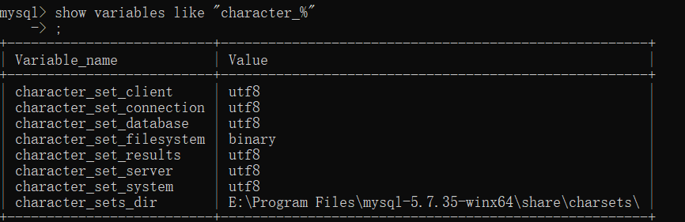

8.0 默认字符集为 utf-8

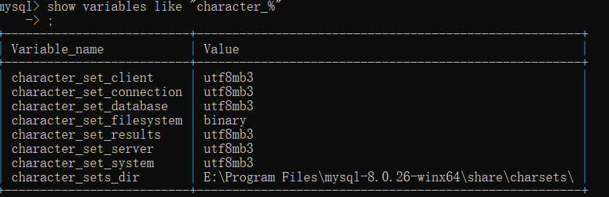

MySQL8 之前的版本中加密规则是 mysql_native_password，而在 MySQL8 之后，加密规则 是 caching_sha2_password。解决问题方法有两种，第一种是升级图形界面工具版本，第二种是把 MySQL8 用户登录密码加密规则还原成 mysql_native_password。

第二种解决方法如下：

```sql
#使用mysql数据库
USE mysql;
#修改'root'@'localhost'用户的密码规则和密码
ALTER USER 'root'@'localhost' IDENTIFIED WITH mysql_native_password BY 'abc123';
#刷新权限
FLUSH PRIVILEGES;
```

## 2.7 图形管理工具

MySQI Workhench
Navicat
SQLyog
dbeaver


# 3 SQL 概述

## 3.1 背景

* SQL（Structured Query Language，结构化查询语言）是使用关系模型的数据库应用语言， 与数据直 接打交道

* 不同的数据库生产厂商都支持 SQL 语句，但都有特有内容。
* 有 SQL-86 ， SQL-89 ， SQL-92 ， SQL-99 等标准
* SQL 有两个重要的标准，分别是 SQL92 和 SQL99，它们分别代表了 92 年和 99 年颁布的 SQL 标 准，我们今天使用的 SQL 语言依然遵循这些标准。

## 3.2 语言排行榜

[index | TIOBE - The Software Quality Company](https://www.tiobe.com/tiobe-index/)

## 3.3 SQL 的语言分类

* DDL(Data Define Languge)：数据定义语言。CREATE、ALTER、DROP、RENAME、TRUNCATE
* DML(Data Manipulate Language)：数据操作语言。INSERT、DELETE、UPDATE、SELECT
* DCT(Data  Control Language)：数据控制语言。COMIT、ROLLBACK、SAVEPOINT

>因为查询语句使用的非常的频繁，所以很多人把查询语句单拎出来一类：DQL(数据查询语言)
>
>还有单独将 COMMIT、ROLLBACK 取出来称为 TCL(Transacfion Control Language, 事务控制语言)。

## 3.4 MySQL 的语法规范

1. 每条命令最好用分号结尾

2. SQL 可以写在一行或者多行。为了提高可读性，各子句分行写，必要时使用缩进

3. 注释

   	单行注释：#注释文字
   	单行注释：-- 注释文字
   	多行注释：/* 注释文字  */

4. 引号

       字符串型和日期时间类型的数据可以使用单引号（' '）表示
       列的别名，尽量使用双引号（" "），而且不建议省略 as

5. 大小写

   	MySQL 在 Windows 环境下是大小写不敏感的
   	MySQL 在 Linux 环境下是大小写敏感的
   		数据库名、表名、表的别名、变量名是严格区分大小写的
   		关键字、函数名、列名(或字段名)、列的别名(字段的别名) 是忽略大小写的。
   	推荐采用统一的书写规范：
   	   数据库名、表名、表别名、字段名、字段别名等都小写
   	   SQL 关键字、函数名、绑定变量等都大写

## 3.5 数据库导入指令

```
mysql> source d:\mysqldb.sql
```

或基于图像界面导入

# 4 DML 之 SELECT

## 4.1 基本 SELECT 语句

**基础语句**

```sql
SELECT 1 + 1, 3 * 2; # From DUAL 伪表
SELECT * FROM employees; # *代表所有字段
SELECT employee_id, first_name FROM employees; # 字段名必须正确
```

**别名**

```sql
SELECT employee_id AS "id", first_name AS "name" 
FROM employees;  # as alias 可省略 “”可省略 不要使用 ‘’
```

**去重**

```sql
SELECT DISTINCT department_id 
FROM employees; # 包含空值

SELECT DISTINCT department_id, salary
FROM employees;  # 为两个字段同时去重
```

**空值**

```sql
# 空值不等同于0，‘’，‘null’
SELECT employee_id,
	salary AS "月工资",
	salary*( 1 + commission_pct) * 12 AS "年工资"
FROM employees;# 空值参与运算 结果为空

SELECT employee_id,
	salary AS "月工资",
	salary*( 1 + IFNULL(commission_pct,0)) * 12 AS "年工资"
FROM employees;# ifnull函数解决
```

**着重号**

```sql
SELECT * FROM ORDER; # 报错 order是关键字 
SELECT * FROM `ORDER`; # 着重号解决
```

**查询常数**

```
SELECT 'tintin', 0427, employee_id, last_name 
FROM employees; # 每一行都会匹配常数
```

**显示表结构**

```sql
DESCRIBE employees;
DESC employees;
```

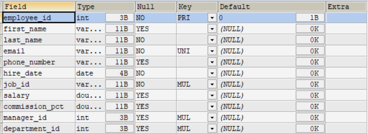

**过滤数据**

```sql
SELECT * 
FROM employees
WHERE department_id = 90; # 过滤条件

SELECT *
FROM employees
WHERE last_name = 'king'; # 根据Ansi标准 引号内内容不能忽略大小写，mysql中会出现不严谨的情况
```

## 4.2 运算符

### 4.2.1 算术运算符

```sql
# 加+ 减- 乘*  除/ div  取模求余运算% mod
SELECT 100 * 10.0 , 100 + 0.0 FROM DUAL; # 对浮点数进行加法、乘法和减法操作，结果是一个浮点数；
SELECT 100 + '120' FROM DUAL; # Java中含字符串则作连接，在sql中表示运算
SELECT 100 + 'a' FROM DUAL; # 字符串转换失败则为0 
SELECT 100 + NULL FROM DUAL; # null值运算为空
SELECT 100/2, 100 DIV 0 FROM DUAL; # 除法结果为浮点数 分母为0结果为空
SELECT 12 MOD 3, 12 % 5, 12 % 14 , -12 % 5, 12 % -5 FROM DUAL; # 模运算结果符号与被模数一样
```

### 4.2.2 比较运算符

比较运算符用来对表达式左边的操作数和右边的操作数进行比较，比较的结果为真则返回 1，比较的结果 为假则返回 0，其他情况则返回 NULL。 比较运算符经常被用来作为 SELECT 查询语句的条件来使用，返回符合条件的结果记录。

**符号类型的运算符**

```sql
# 等于=  安全等于<=>   不等于!= <>   大于>   小于<   大于等于>=   小于等于<=
SELECT 1 = 2 , 1 != 2, 1 = 'a', 1 = '1' , 0 = 'a'FROM DUAL; # 字符串存在隐式转换
SELECT 'a' = 'a' , 'a' = 'b' FROM DUAL; # 字符串比较 不隐式转换
SELECT 1 = NULL, NULL = NULL, 1 <> NULL, 'a' != NULL FROM DUAL; # null参加运算 结果为null
SELECT NULL IS NULL FROM DUAL; # 解决 使用 is null 关键字
SELECT NULL <=> NULL FROM DUAL; # 解决 使用 安全等于
```

**非符号类型的运算符**

```sql
# IS NULL  \ IS NOT NULL \ ISNULL()函数
SELECT NULL IS NULL, ISNULL(NULL), NULL IS NOT NULL FROM DUAL;
# 取最大和最小
SELECT LEAST(1,3,4,2),GREATEST(3,2,4,5) FROM DUAL;
SELECT LEAST('a','v','c'),GREATEST('s','d','w') FROM DUAL;
# BETWEEN 下限 AND 上限;
SELECT employee_id,last_name, salary 
FROM employees
WHERE salary BETWEEN 2000 AND 10000;

SELECT employee_id,last_name,salary
FROM employees
WHERE salary >= 2000 && salary<=10000;

# in运算符 空值参与运算为空，在set中参与运算不为空
SELECT 'a' IN ('a','b','c'), 1 IN (2,3), NULL IN ('a','b'), 'a' IN ('a', NULL); 

# 模糊查询
# “%”：匹配0个或多个字符。
# “_”：只能匹配一个字符。


# 转义字符
#练习：查询第2个字符是且第3个字符是'a'的员工信息
SELECT last_name
FROM employees
WHERE last_name LIKE '_\_a%';

# 表示转义 escape
#练习：查询第2个字符是且第3个字符是'a'的员工信息
SELECT last_name
FROM employees
WHERE last_name LIKE '_$_a%' ESCAPE '$';
# REGEXP  正则匹配
SELECT 'shkstart' REGEXP '^s', 'shkstart' REGEXP 't$', 'shkstart' REGEXP 'hk';

```

### 4.2.3 逻辑运算符

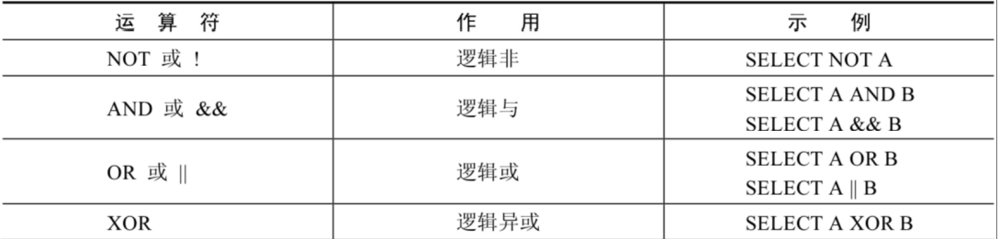

> OR 可以和 AND 一起使用，但是在使用时要注意两者的优先级，由于 AND 的优先级高于 OR，因此先 对 AND 两边的操作数进行操作，再与 OR 中的操作数结合。

### 4.2.4 位运算符

位运算符是在二进制数上进行计算的运算符。位运算符会先将操作数变成二进制数，然后进行位运算， 最后将计算结果从二进制变回十进制数。

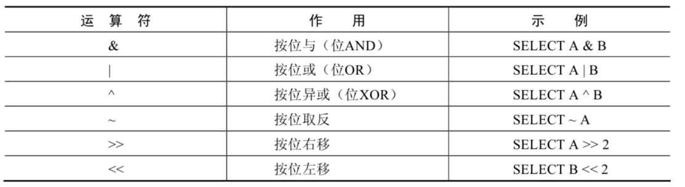

按位右移（>>）运算符将给定的值的二进制数的所有位右移指定的位数。右移指定的 位数后，右边低位的数值被移出并丢弃，左边高位空出的位置用 0 补齐。相当于除以 2

 按位左移（<<）运算符将给定的值的二进制数的所有位左移指定的位数。左移指定的 位数后，左边高位的数值被移出并丢弃，右边低位空出的位置用 0 补齐。相当于乘以 2

### 4.2.5 运算符优先级

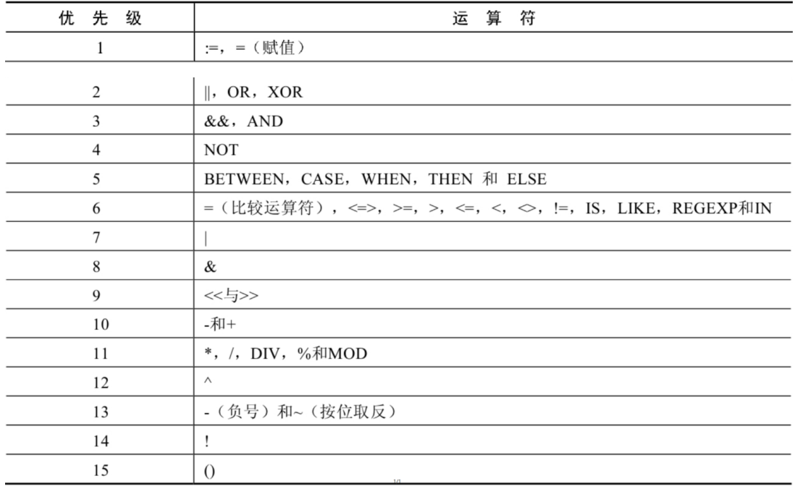

### 拓展 正则表达式

正则表达式通常被用来检索或替换那些符合某个模式的文本内容，根据指定的匹配模式匹配文本中符合 要求的特殊字符串。例如，从一个文本文件中提取电话号码，查找一篇文章中重复的单词或者替换用户 输入的某些敏感词语等，这些地方都可以使用正则表达式。正则表达式强大而且灵活，可以应用于非常 复杂的查询。

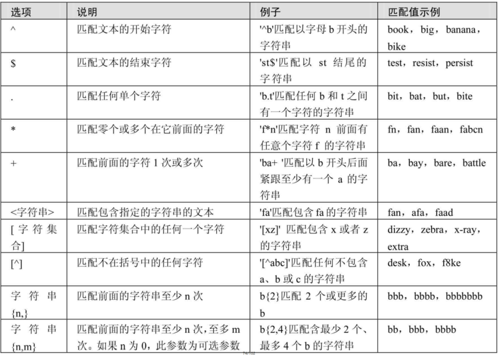

### 隐式类型转换

当操作符左右两边的数据类型不一致时，会发生隐式转换。

字符串转换为数值类型时，非数字开头的字符串会转化为 `0`，以数字开头的字符串会截取从第一个字符到第一个非数字内容为止的值为转化结果。

## 4.3 排序与分页

### 4.3.1 排序

**单列排序**

```sql
# 使用 ORDER BY 子句排序
# ASC（ascend）: 升序
# DESC（descend）:降序
# ORDER BY 子句在SELECT语句的结尾。

SELECT last_name, job_id, department_id, hire_date AS hd
FROM employees
WHERE hire_date < '2000-03-08'
ORDER BY hd DESC;
# 由于执行顺序的原因，order by 后可以使用字段别名， 而where后不可以使用字段别名
```

**多列排序**

```sql
#练习：显示员工信息，按照department id的降序排列，salary的升序排列
SELECT last_name, salary, department_id 
FROM employees
ORDER BY department_id DESC, salary ASC ;
```

### 4.3.2 分页

```sql
# 分页

SELECT employee_id, last_name 
FROM employees
LIMIT 20, 20

# 每页显示 size条记录， 此时显示第page页
# SELECT employee_id, last_name 
# FROM employees
# LIMIT (page-1)*size, size

# 综合
SELECT last_name, job_id, department_id, hire_date AS hd
FROM employees
WHERE hire_date < '2000-03-08'
ORDER BY hd DESC
LIMIT 0, 20;
```

> MySQL 8.0 中可以使用“LIMIT 3 OFFSET 4”，意思是获取从第 5 条记录开始后面的 3 条记录，和“LIMIT 4,3;”返回的结果相同。

```sql
SELECT employee_id, last_name 
FROM employees
LIMIT 0, 20

#等价于
SELECT employee_id, last_name 
FROM employees
LIMIT 20 OFFSET 0 # limit 限制记录数 offset 偏移量
```

**拓展**

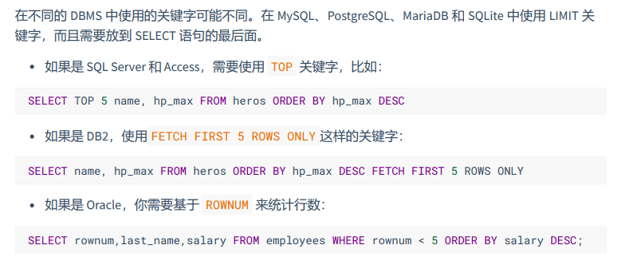

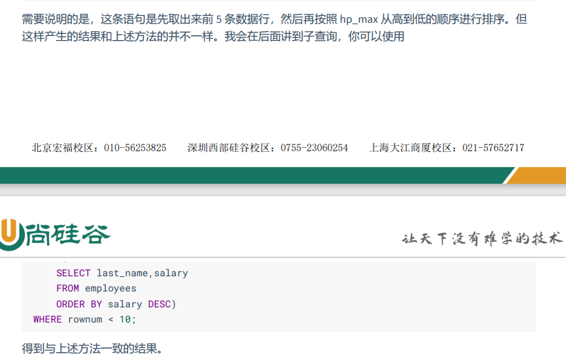

## 4.4 多表查询

多表查询，也称为关联查询，指两个或更多个表一起完成查询操作。

为什么多表不合成一个表的原因

* 字段太多，导致出现冗余
* io 效率低
* 单个表不适合高并发场景

> 我们要 控制连接表的数量 。多表连接就相当于嵌套 for 循环一样，非常消耗资源，会让 SQL 查询性能下 降得很严重，因此不要连接不必要的表。在许多 DBMS 中，也都会有最大连接表的限制。
>
> 超过三个表禁止 join。需要 join 的字段，数据类型保持绝对一致；多表关联查询时， 保 证被关联的字段需要有索引。

### 4.4.1 笛卡尔积（交叉连接）

笛卡尔乘积是一个数学运算。假设我有两个集合 X 和 Y，那么 X 和 Y 的笛卡尔积就是 X 和 Y 的所有可能 组合，也就是第一个对象来自于 X，第二个对象来自于 Y 的所有可能。组合的个数即为两个集合中元素 个数的乘积数。

```sql
SELECT employee_id, department_name
FROM employees, departments; # 每个员工与每个部门都匹配了一次
```

### 4.4.2 根据连接条件分类 等值连接 vs 非等值连接

**等值连接**

```sql
# 为了避免笛卡尔积， 可以在 WHERE 加入有效的连接条件。同时确保 连接 n个表,至少需要n-1个连接条件。

SELECT employee_id, department_name
FROM employees AS e, departments AS d
WHERE e.`department_id` = d.`department_id`;
# 多个表中有相同列时，必须在列名之前加上表名前缀。 由于执行顺序的原因
# 使用别名可以简化查询

```

>  需要注意的是，如果我们使用了表的别名，在查询字段中、过滤条件中就只能使用别名进行代替， 不能使用原有的表名，否则就会报错

**非等值连接**

```sql
# 非等值连接
SELECT last_name, salary, grade_level
FROM employees AS e, job_grades AS jg
WHERE salary BETWEEN lowest_sal AND highest_sal;
```

### 4.4.3 根据连接对象分类 自连接 vs 非自连接

```sql
# 自连接 查询员工及其经理
SELECT employee.`employee_id` , employee.`last_name` AS employee_name, manager.`employee_id` AS manager_id, manager.`last_name` AS manager_name
FROM `employees` AS employee, `employees` AS manager
WHERE employee.`manager_id` = manager.`employee_id`;

```

### 4.4.4 根据查询结果分类 内连接 vs 外连接

**内连接**

```sql
# 内连接 合并具有同一列的两个以上的表的行 ，结果集不包含一个表与另一个表不匹配的行
SELECT employee_id, department_name
FROM employees, departments; 
WHERE employees.`department_id` = departments.`department_id`
```

**外连接：左外连接 右外连接 满外连接**

```
# 外连接 合并具有同一列的两个以上的表的行 ，结果集除了包含一个表与另一个表不匹配的行还查询到左表或右表中不匹配的行
# 外连接的分类 左外连接 右外连接 满外连接
# 如果是左外连接，则连接条件中左边的表也称为 主表 ，右边的表称为 从表 。
# 如果是右外连接，则连接条件中右边的表也称为 主表 ，左边的表称为 从表 。

```

外连接的实现有不同的语法，主要出现在 SQL92 和 SQL99 的差异

SQL92 和 SQL99 是经典的 SQL 标准，也分别叫做 SQL-2 和 SQL-3 标准。也正是在这两个标准发布之 后，SQL 影响力越来越大，甚至超越了数据库领域。现如今 SQL 已经不仅仅是数据库领域的主流语言， 还是信息领域中信息处理的主流语言。在图形检索、图像检索以及语音检索中都能看到 SQL 语言的使 用。

### 4.4.5 SQL92 语法

Oracle 对 SQL92 支持较好，而 MySQL 则不支持 SQL92 的外连接。

且在 SQL92 中，只有左外连接和右外连接，没有满（或全）外连接。

**使用（+）实现外连接**

在 SQL92 中采用（+）代表从表所在的位置。即左或右外连接中，(+) 表示哪个是从表。

```sql
# 练习：查询所有的员工的last name,department name信息
# 左外连接
SELECT e.employee_id, e.last_name, d.department_id, d.department_name
FROM employees AS e , departments AS d 
WHERE e.department_id(+) = d.department_id


# 练习：查询所有的员工的last name,department name信息
# 右外连接
SELECT e.employee_id, e.last_name, d.department_id, d.department_name
FROM employees AS e , departments AS d 
WHERE e.department_id = d.department_id(+)
```

### 4.4.6 SQL99 语法

**使用 INNER JOIN ON 实现内连接**

```sql
# 内连接
SELECT e.employee_id, e.last_name, d.department_id, d.department_name
FROM employees AS e INNER JOIN departments AS d 
ON e.department_id = d.department_id

```

**使用 OUTER JOIN ON 实现外连接**

```sql

# 左外连接
SELECT e.employee_id, e.last_name, d.department_id, d.department_name
FROM employees AS e LEFT OUTER JOIN departments AS d 
ON e.department_id = d.department_id

# 右外连接
SELECT e.employee_id, e.last_name, d.department_id, d.department_name
FROM employees AS e RIGHT OUTER JOIN departments AS d 
ON e.department_id = d.department_id
```

满外连接的结果 = 左右表匹配的数据 + 左表没有匹配到的数据 + 右表没有匹配到的数据。 SQL99 是支持满外连接的。

使用 FULL JOIN 或 FULL OUTER JOIN 来实现。 

需要注意的是，MySQL 不支持 FULL JOIN，但是可以用 LEFT JOIN UNION RIGHT join 代替。

### 4.4.7 UNION 的使用

合并查询结果 利用 UNION 关键字，可以给出多条 SELECT 语句，并将它们的结果组合成单个结果集。**合并时，两个表对应的列数和数据类型必须相同，并且相互对应。** 各个 SELECT 语句之间使用 UNION 或 UNION ALL 关键字分隔。

**UNION 实现全外连接**

```sql
# UNION 会执行去重操作
SELECT e.employee_id, e.last_name, d.department_id, d.department_name
FROM employees AS e LEFT OUTER JOIN departments AS d 
ON e.department_id = d.department_id # 左外连接
UNION
SELECT e.employee_id, e.last_name, d.department_id, d.department_name
FROM employees AS e RIGHT OUTER JOIN departments AS d 
ON e.department_id = d.department_id # 右外连接
```

**UNION ALL 实现全外连接**

```sql
# 不去重 如果明确知道合并数据后的结果数据 不存在重复数据，或者不需要去除重复的数据，则尽量使用UNION ALL语句，以提高数据查询的效 率。
SELECT e.employee_id, e.last_name, d.department_id, d.department_name
FROM employees AS e LEFT OUTER JOIN departments AS d 
ON e.department_id = d.department_id
UNION ALL
SELECT e.employee_id, e.last_name, d.department_id, d.department_name
FROM employees AS e RIGHT OUTER JOIN departments AS d 
ON e.department_id = d.department_id
WHERE e.employee_id IS NULL
```

### 4.4.8 SQL99 语法 新特性

**自然连接**

```sql
# 自然连接 可以理解为 SQL92 中的等值连接。它会帮你自动查询两张连接表中 所有相同的字段 ，然后进行 等值连接
SELECT e.employee_id, e.last_name, d.department_id, d.department_name,d.manager_id
FROM employees AS e INNER JOIN departments AS d 
ON e.department_id = d.department_id 
AND e.manager_id = d.manager_id;
# 等价于 
SELECT e.employee_id, e.last_name, d.department_id, d.department_name,d.manager_id
FROM employees AS e NATURAL JOIN departments AS d 
```

**USING 连接**

```sql
# USING SQL99还支持使用 USING 指定数据表里的 同名字段 进行等值连接。但是只能配
# 合JOIN一起使用。比如：
SELECT e.employee_id, e.last_name, d.department_id, d.department_name
FROM employees AS e INNER JOIN departments AS d 
ON e.manager_id = d.manager_id;
# 等价于
SELECT e.employee_id, e.last_name, d.department_id, d.department_name
FROM employees AS e INNER JOIN departments AS d 
```

## 4.5 单行函数

DBMS 之间的差异性很大，远大于同一个语言不同版本之间的差异。实际上，只有很少的函数是 被 DBMS 同时支持的。

### 4.5.1 数值函数

**基本函数**

| 函数                | 用法                                                         |
| ------------------- | ------------------------------------------------------------ |
| ABS(x)              | 返回 x 的绝对值                                                |
| SIGN(X)             | 返回 X 的符号。正数返回 1，负数返回-1，0 返回 0                   |
| PI()                | 返回圆周率的值                                               |
| CEIL(x)，CEILING(x) | 返回大于或等于某个值的最小整数                               |
| FLOOR(x)            | 返回小于或等于某个值的最大整数                               |
| LEAST(e1, e2, e3…)    | 返回列表中的最小值                                           |
| GREATEST(e1, e2, e3…) | 返回列表中的最大值                                           |
| MOD(x, y)            | 返回 X 除以 Y 后的余数                                           |
| RAND()              | 返回 0~1 的随机值                                              |
| RAND(x)             | 返回 0~1 的随机值，其中 x 的值用作种子值，相同的 X 值会产生相同的随机 数 |
| ROUND(x)            | 返回一个对 x 的值进行四舍五入后，最接近于 X 的整数               |
| ROUND(x, y)          | 返回一个对 x 的值进行四舍五入后最接近 X 的值，并保留到小数点后面 Y 位 |
| TRUNCATE(x, y)       | 返回数字 x 截断为 y 位小数的结果                                 |
| SQRT(x)             | 返回 x 的平方根。当 X 的值为负数时，返回 NUL                      |

**角度与弧度转换**

| 函数       | 用法                                  |
| ---------- | ------------------------------------- |
| RADIANS(x) | 将角度转化为弧度，其中，参数 x 为角度值 |
| DEGREES(x) | 将弧度转化为角度，其中，参数 x 为弧度   |

**三角函数**

| 函数       | 用法                                                         |
| ---------- | ------------------------------------------------------------ |
| SIN(x)     | 返回 x 的正弦值，其中，参数 x 为弧度值                           |
| ASIN(x)    | 返回 x 的反正弦值，即获取正弦为 x 的值。如果 x 的值不在-1 到 1 之间，则返回 NULL |
| COS(x)     | 返回 x 的余弦值，其中，参数 x 为弧度值                           |
| ACOS(x)    | 返回 x 的反余弦值，即获取余弦为 x 的值。如果 x 的值不在-1 到 1 之间，则返回 NULL |
| TAN(x)     | 返回 x 的正切值，其中，参数 x 为弧度值                           |
| ATAN(x)    | 返回 x 的反正切值，即返回正切值为 x 的值                         |
| ATAN2(m, n) | 返回两个参数的反正切值                                       |
| COT(x)     | 返回 x 的余切值，其中，X 为弧度值                               |

**进制间的转换**

| 函数          | 用法                   |
| ------------- | ---------------------- |
| BIN(x)        | 返回 x 的二进制编码      |
| HEX(x)        | 返回 x 的十六进制编码    |
| OCT(x)        | 返回 x 的八进制编码      |
| CONV(x, f1, f2) | 返回 f1 进制数变成 f2 进制 |

### 4.5.2 字符串函数

| 函数                              | 用法                                                         |
| --------------------------------- | ------------------------------------------------------------ |
| ASCII(S)                          | 返回字符串 S 中的第一个字符的 ASCII 码值                         |
| CHAR_LENGTH(s)                    | 返回字符串 s 的字符数。作用与 CHARACTER_LENGTH(s)相同           |
| LENGTH(s)                         | 返回字符串 s 的字节数，和字符集有关                            |
| CONCAT(s1, s2,......, sn)           | 连接 s1, s2,......, sn 为一个字符串                              |
| CONCAT_WS(x, s1, s2,......, sn)     | 同 CONCAT(s1, s2,...)函数，但是每个字符串之间要加上 x           |
| INSERT(str, idx, len, replacestr) | 将字符串 str 从第 idx 位置开始，len 个字符长的子串替换为字符串 replacestr |
| REPLACE(str, a, b)                | 用字符串 b 替换字符串 str 中所有出现的字符串 a                    |
| UPPER(s) 或 UCASE(s)              | 将字符串 s 的所有字母转成大写字母                              |
| LOWER(s) 或 LCASE(s)               | 将字符串 s 的所有字母转成小写字母                              |
| LEFT(str, n) 位置                  | 返回字符串 str 最左边的 n 个字符                                 |
| RIGHT(str, n)                      | 返回字符串 str 最右边的 n 个字符                                 |
| LPAD(str, len, pad)               | 用字符串 pad 对 str 最左边进行填充，直到 str 的长度为 len 个字符     |
| RPAD(str , len, pad)               | 用字符串 pad 对 str 最右边进行填充，直到 str 的长度为 len 个字符     |
| LTRIM(s)                          | 去掉字符串 s 左侧的空格                                        |
| RTRIM(s)                          | 去掉字符串 s 右侧的空格                                        |
| TRIM(s)                           | 去掉字符串 s 开始与结尾的空格                                  |
| TRIM(s1 FROM s)                   | 去掉字符串 s 开始与结尾的 s1                                    |
| TRIM(LEADING s1 FROM s)           | 去掉字符串 s 开始处的 s1                                        |
| TRIM(TRAILING s1 FROM s)          | 去掉字符串 s 结尾处的 s1                                        |
| REPEAT(str, n)                    | 返回 str 重复 n 次的结果                                         |
| SPACE(n)                          | 返回 n 个空格                                                  |
| STRCMP(s1, s2)                     | 比较字符串 s1, s2 的 ASCII 码值的大小                             |
| SUBSTR(s, index, len)               | 返回从字符串 s 的 index 位置其 len 个字符，作用与 SUBSTRING(s, n, len)、 MID(s, n, len)相同 |
| LOCATE(substr, str)                | 返回字符串 substr 在字符串 str 中首次出现的位置，作用于 POSITION(substr IN str)、INSTR(str, substr)相同。未找到，返回 0 |
| ELT(m, s1, s2,…, sn)                 | 返回指定位置的字符串，如果 m = 1，则返回 s1，如果 m = 2，则返回 s2，如 果 m = n，则返回 sn |
| FIELD(s, s1, s2,…, sn)               | 返回字符串 s 在字符串列表中第一次出现的                        |
| FIND_IN_SET(s1, s2)                | 返回字符串 s1 在字符串 s2 中出现的位置。其中，字符串 s2 是一个以逗号分 隔的字符串 |
| REVERSE(s)                        | 返回 s 反转后的字符串                                          |
| NULLIF(value1, value2)             | 比较两个字符串，如果 value1 与 value2 相等，则返回 NULL，否则返回 value1 |

> 注意：MySQL 中，字符串的位置是从 1 开始的。

### 4.5.4 日期和时间函数

[第 07 章_单行函数.pdf](assets/第07章_单行函数.pdf)

### 4.5.5 流程控制函数

| 函数                                                         | 用法                                             |
| ------------------------------------------------------------ | ------------------------------------------------ |
| IF(value, value1, value2)                                      | 如果 value 的值为 TRUE，返回 value1， 否则返回 value2 |
| IFNULL(value1, value2)                                       | 如果 value1 不为 NULL，返回 value1，否 则返回 value2  |
| CASE WHEN 条件 1 THEN 结果 1 WHEN 条件 2 THEN 结果 2 .... [ELSE resultn] END | 相当于 Java 的 if...else if...else...               |
| CASE expr WHEN 常量值 1 THEN 值 1 WHEN 常量值 1 THEN 值 1 .... [ELSE 值 n] END | 相当于 Java 的 switch...case..                      |

### 4.5.6 加密与解密函数

| 函数                        | 用法                                                         |
| --------------------------- | ------------------------------------------------------------ |
| PASSWORD(str)               | 返回字符串 str 的加密版本，41 位长的字符串。加密结果 不可 逆 ，常用于用户的密码加密 |
| MD5(str)                    | 返回字符串 str 的 md5 加密后的值，也是一种加密方式。若参数为 NULL，则会返回 NULL |
| SHA(str)                    | 从原明文密码 str 计算并返回加密后的密码字符串，当参数为 NULL 时，返回 NULL。 SHA 加密算法比 MD5 更加安全 。 |
| ENCODE(value, password_seed) | 返回使用 password_seed 作为加密密码加密 value                   |
| DECODE(value, password_seed) | 返回使用 password_seed 作为加密密码解密 value                   |

### 4.5.7 MySQL 信息函数

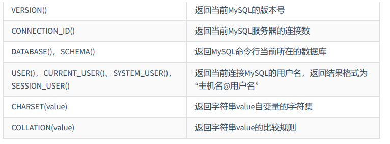

### 4.5.8 其他函数

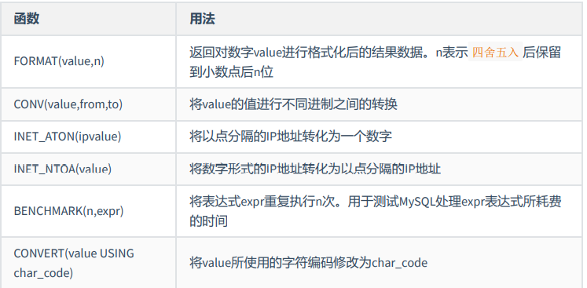

## 4.6 聚合函数（多行函数）

### 4.6.1 常见聚合函数

| 函数    | 用法                                                      |
| ------- | --------------------------------------------------------- |
| AVG()   | 求平均数 只适用于数值                                     |
| SUM()   | 求总和 只适用于数值                                       |
| MAX()   | 求最大值 适用于数值、字符串、日期时间                     |
| MIN()   | 求最小值 适用于数值、字符串、日期时间                     |
| COUNT() | 求非 null 个数<br />AVG(salary) = SUM(salary)/COUNT(salary) |
|         |                                                           |
|         |                                                           |
|         |                                                           |
|         |                                                           |

> 用 count(*)，count(1)，count(列名)谁好呢? 
>
> 其实，对于 MyISAM 引擎的表是没有区别的。这种引擎内部有一计数器在维护着行数。 Innodb 引擎的表用 count(*), count(1)直接读行数，复杂度是 O(n)，因为 innodb 真的要去数一遍。但好 于具体的 count(列名)。

### 4.6.2 GROUP BY 实现分组查询

```sql
SELECT department_id, job_id, AVG(salary)
FROM employees
GROUP BY department_id, job_id;

# 不报错但错误 ， job_id 非组函数且未声明在group by中
SELECT department_id, job_id, AVG(salary)
FROM employees
GROUP BY department_id;

# with rollip 将分组后的所有行看为一个组 计算其聚合结果 但是不能再被order by 排序
SELECT department_id, AVG(salary)
FROM employees
GROUP BY department_id WITH ROLLUP;


```

### 4.63 HAVING 实现分组后过滤数据

```sql
# Having 在group by后面
SELECT department_id, MAX(salary)
FROM employees
GROUP BY department_id
HAVING MAX(salary) > 10000;
```

**WHERE 和 HAVING 对比**

```sql
#练习：查询部门id为10,20,30,40这4个部门中最高工资比10000高的部门信息
#方式1：推荐 执行效率更高 
SELECT department_id,MAX(salary)
FROM employees
WHERE department_id IN (10,20,30,40)
GROUP BY department_id
HAVING MAX(salary)>10000;
#方式2：
SELECT department_id, MAX(salary)
FROM employees
GROUP BY department_id
HAVING MAX(salary) > 10000
AND department_id IN (10,20,30,40);
# 因此，过滤条件有聚合函数，只能声明于having中
# 而过滤条件无聚合函数，可以声明与having中，但是建议声明于where中

# having 在mysql中允许使用别名 它不是标准的SQL 大多数其他RDBMS引擎不允许在HAVING中使用别名时
# 而where 不能使用别名 
# 大多数情况下你不能在WHERE（和HAVING）中使用别名的原因是因为SELECT实际上是在大多数其他子条款之后进行评估的 详见 SELECT语句执行顺序
SELECT department_id did, MAX(salary) maxs
FROM employees
GROUP BY department_id
HAVING maxs > 10000
AND did IN (10,20,30,40);
```

**如果需要通过连接从关联表中获取需要的数据，WHERE 是先筛选后连接，而 HAVING 是先连接 后筛选。** 这一点，就决定了在关联查询中，WHERE 比 HAVING 更高效。因为 WHERE 可以先筛选，用一 个筛选后的较小数据集和关联表进行连接，这样占用的资源比较少，执行效率也比较高。HAVING 则需要 先把结果集准备好，也就是用未被筛选的数据集进行关联，然后对这个大的数据集进行筛选，这样占用 的资源就比较多，执行效率也较低。

## 4.7 SELECT 的执行过程

### 4.7.1 完整 SELECT 语句的声明结构

**SQL92 语法**

```sql
#1
select <select_list>

#2
from <table_name>
where <where_condition>
group by <group_by_list>
having <having_condition>

#3
order by <order_by_condition> ASC|DESC
limit <limt_number>
```

**SQL99 语法**

```sql
#1
select <select_list>

#2
from <table_name>
<join_type> join <join_table> on <join_condition>
where <where_condition>
group by <group_by_list>
having <having_condition>

#3
order by <order_by_condition> ASC|DESC
limit <limt_number>
```

### 4.7.2 SELECT 语句执行顺序

```sql
#2
from <table_name>
on <on_condition>
<join_type> join <join_table>
where <where_condition>
group by <group_by_list>
<sum()avg()等聚合函数>
having <having_condition>

#1 
select <select_list>

#3
order by <order_by_condition> ASC|DESC
limit <limit_number>
```

### 4.7.3 SELECT 语句执行顺序理解

第一步：加载 from 子句的前两个表计算 **笛卡尔积（交叉连接）**，生成虚拟表 vt1；若表有别名，在此之后必须使用别名

第二步：筛选关联表符合 on 表达式的数据，保留主表，生成虚拟表 vt2；

第三步：如果使用的是外连接，执行 on 的时候，会将主表中不符合 on 条件的数据也加载进来，做为外部行

第四步：如果 from 子句中的表数量大于 2，则重复第一步到第三步，直至所有的表都加载完毕，更新 vt3；

第五步：执行 where 表达式，筛选掉不符合条件的数据生成 vt4；

第六步：执行 group by 子句。group by 子句执行过后，会对子句组合成唯一值并且对每个唯一值只包含一行，生成 vt5,。**一旦执行 group by，后面的所有步骤只能得到 vt5 中的列（group by 的子句包含的列）和聚合函数。**

第七步：执行聚合函数，生成 vt6；

第八步：执行 having 表达式，筛选 vt6 中的数据。having 是唯一一个在分组后的条件筛选，生成 vt7;

第九步：从 vt7 中筛选列，生成 vt8；

第十步：执行 distinct，对 vt8 去重，生成 vt9。其实执行过 group by 后就没必要再去执行 distinct，因为分组后，每组只会有一条数据，并且每条数据都不相同。

第十一步：对 vt9 进行排序，此处返回的不是一个虚拟表，而是一个游标，记录了数据的排序顺序，此处可以使用字段的别名；

第十二步：执行 limit 语句，将结果返回给客户端

## 4.8 子查询（嵌套查询）

### 4.8.1 子查询场景

子查询指一个查询语句嵌套在另一个查询语句内部的查询，这个特性从 MySQL 4.1 开始引入。 

SQL 中子查询的使用大大增强了 SELECT 查询的能力，因为很多时候查询需要从结果集中获取数据，或者 需要从同一个表中先计算得出一个数据结果，然后与这个数据结果（可能是某个标量，也可能是某个集 合）进行比较。

```sql
# 练习：查询工资比abel多的员工
#方式一：两次查询
SELECT salary
FROM employees
WHERE last_name = 'Abel';

SELECT last_name,salary
FROM employees
WHERE salary > 11000;

#方式二：自连接
SELECT e2.last_name,e2.salary
FROM employees e1,employees e2
WHERE e1.last_name = 'Abel'
AND e1.`salary` < e2.`salary`

#方式三 嵌套查询 外查询（主查询） 和 内查询（子查询）
SELECT last_name,salary
FROM employees
WHERE salary > (
	SELECT salary
	FROM employees
	WHERE last_name = 'Abel'
	);
```

### 4.8.2 根据返回记录数分类 单行子查询 vs 多行子查询

子查询可用于 WHERE、HAVING、CASE、from 中 

在 SELECT 中，除了 GROUP BY 和 LIMTT 之外，其他位置都可以声明子查询！

单行子查询主要使用符号类型的比较运算符作为单行比较操作符

等于 =  安全等于 <=>   不等于!= <>   大于 >   小于 <   大于等于> =   小于等于 <=


多行子查询主要使用

| 操作符 | 含义                                                     |
| ------ | -------------------------------------------------------- |
| IN     | 等于列表中的任意一个                                     |
| ANY    | 需要和单行比较操作符一起使用，和子查询返回的某一个值比较 |
| ALL    | 需要和单行比较操作符一起使用，和子查询返回的所有值比较   |
| SOME   | 实际上是 ANY 的别名，作用相同，一般常使用 ANY               |

```sql
#查询平均工资最低的部门id
#方式1：
SELECT department_id
FROM employees
GROUP BY department_id
HAVING AVG(salary) = (
	SELECT MIN(avg_sal)
	FROM (
		SELECT AVG(salary) avg_sal
		FROM employees
		GROUP BY department_id
		) dept_avg_sal
	);
#方式2：
SELECT department_id
FROM employees
GROUP BY department_id
HAVING AVG(salary) <= ALL (
	SELECT AVG(salary) avg_sal
	FROM employees
	GROUP BY department_id
	);

```

非法子查询：多行子查询使用单行比较符

空值问题：

```sql
SELECT last_name
FROM employees
WHERE employee_id NOT IN (
    SELECT manager_id
    FROM employees
    );
# 若子查询返回空 null值参与运算 导致主查询也返回空
```


### 4.8.3 相关子查询 vs 非相关子查询

如果子查询的执行依赖于外部查询，通常情况下都是因为子查询中的表用到了外部的表，并进行了条件 关联，因此每执行一次外部查询，子查询都要重新计算一次，这样的子查询就称之为 关联子查询 。 

 **相关子查询按照一行接一行的顺序执行，主查询的每一行都执行一次子查询。**

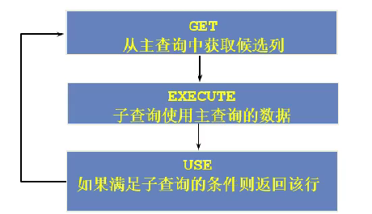

```sql
# 题目：查询员工中工资大于本部门平均工资的员工的last_name,salary和其department_id
# 方式一：相关子查询
SELECT last_name, salary, department_id
FROM employees e1
WHERE salary > (
	SELECT AVG(salary) 
	FROM employees e2
	WHERE e2.`department_id` = e1.`department_id`
	);
# 方式二：from中使用子查询 非相关子查询
SELECT e1.last_name, e1.salary, e1.department_id, e2.d_avg_sal
FROM employees e1 INNER JOIN (
	SELECT department_id, AVG(salary) d_avg_sal
	FROM employees
	GROUP BY department_id
	) e2
ON e1.`department_id` = e2.department_id
WHERE e1.`salary` > e2.d_avg_sal
```

**EXISTS 与 NOT EXISTS 关键字**

```sql
# 查询公司管理者的employee_id，last_name，job_id，department_id信息
# 方式一 自连接
SELECT DISTINCT man.`employee_id`, man.`last_name`, man.`job_id`, man.`department_id`
FROM employees emp JOIN employees man
ON emp.`manager_id` = man.`employee_id`
# 方式二 子查询
SELECT employee_id,last_name, job_id, department_id
FROM employees
WHERE employee_id IN (
	SELECT DISTINCT manager_id
	FROM employees
);
# 方式三 EXISTS+子查询 
SELECT employee_id, last_name, job_id, department_id
FROM employees e1
WHERE EXISTS ( SELECT *
	FROM employees e2
	WHERE e2.manager_id =
	e1.employee_id); # 用e1表的上司id 去e2表中 查询是否有d员工id 记录则条件成立
```

# 5 DDL 与 DCL

## 5.1 标识符命名规则

* 数据库名、表名不得超过 30 个字符，变量名限制为 29 个 
* 必须只能包含 A–Z, a–z, 0–9, _共 63 个字符 
* 数据库名、表名、字段名等对象名中间不要包含空格 
* 同一个 MySQL 软件中，数据库不能同名；同一个库中，表不能重名；同一个表中，字段不能重名 
* 必须保证你的字段没有和保留字、数据库系统或常用方法冲突。如果坚持使用，请在 SQL 语句中使 用`（着重号）引起来 
* 保持字段名和类型的一致性：在命名字段并为其指定数据类型的时候一定要保证一致性，假如数据 类型在一个表里是整数，那在另一个表里可就别变成字符型了

## 5.2 创建和管理数据库

```sql
# 创建数据库 指定字符集
CREATE DATABASE IF NOT EXISTS test CHARACTER SET 'utf8';
# 创建过程
SHOW CREATE DATABASE test

# 查看所有数据库
SHOW DATABASES;
# 查看当前数据库
SELECT DATABASE();
# 使用数据库
USE test;
# 查看表
SHOW TABLES FROM test;

# 修改数据库
ALTER DATABASE test CHARACTER SET 'utf8'; #比如：gbk、utf8等
# 删除数据库
DROP DATABASE IF EXISTS test
```

## 5.3 MySQL 的数据类型

| 数据类型          | 举例                                                         |
| ----------------- | ------------------------------------------------------------ |
| 整数类型          | TINYINT、SMALLINT、MEDIUMINT、**INT**(或 INTEGER)、BIGINT     |
| 浮点类型          | **FLOAT、DOUBLE**                                            |
| 定点数类型        | **DECIMAL**                                                  |
| 位类型 B          | BIT                                                          |
|                   |                                                              |
| 日期时间类型      | YEAR、TIME、**DATE**、DATETIME、TIMESTAMP                    |
|                   |                                                              |
| 文本字符串类型    | **CHAR、VARCHAR**、TINYTEXT、**TEXT**、MEDIUMTEXT、LONGTEXT  |
| 枚举类型          | ENUM                                                         |
| 集合类型          | SET                                                          |
| 二进制字符串类 型 | BINARY、VARBINARY、TINYBLOB、**BLOB**、MEDIUMBLOB、LONGBLOB  |
| JSON 类型          | JSON 对象、JSON 数组                                           |
|                   |                                                              |
| 空间数据类型      | 单值：GEOMETRY、POINT、LINESTRING、POLYGON； 集合：MULTIPOINT、MULTILINESTRING、MULTIPOLYGON、 GEOMETRYCOLLECTION |


## 5.4 创建和管理表

**创建**

```sql
# 创建表 表的字符集 和 库的字符集设置一样
CREATE TABLE IF NOT EXISTS myemp ( # root用户具有创建表的权限
id INT,
emp_name VARCHAR(15), # 不能超过15个字符
hire_date DATE
)
# 表信息
DESC myemp;
# 表创建工程
SHOW CREATE TABLE myemp;
# 基于现有的表创建 相当于复制表 适合于备份数据 
CREATE TABLE myemp2 
AS 
SELECT * FROM atguigudb.employees # 查询语句的别名作为新表的字段名，查询语句丰富
# 基于现有的表创建 相当于复制表 不包含数据
CREATE TABLE myemp3 
AS 
SELECT * FROM atguigudb.employees 
WHERE FALSE 
```

**管理**

```sql
# 添加字段 
ALTER TABLE myemp
ADD salary DOUBLE(10,2) FIRST
# 添加字段  
ALTER TABLE myemp
ADD email VARCHAR(20) AFTER hire_date


# 修改字段 数据类型（不建议） 长度，默认值
ALTER TABLE myemp
MODIFY emp_name VARCHAR(25)
ALTER TABLE myemp
MODIFY emp_name VARCHAR(25) DEFAULT 'hhh'

#重命名字段 同时具有modify功能
ALTER TABLE myemp
CHANGE salary monthly_salary DOUBLE(12,2)
#删除字段
ALTER TABLE myemp
DROP COLUMN email

# 重命名表
RENAME TABLE myemp 
TO myemp1;
ALTER TABLE myemp
RENAME TO myemp1;
#删除表 释放表空间
DROP TABLE IF EXISTS myemp2
#清空表 表结构保留
TRUNCATE TABLE myemp3;
```

## 5.5 DCL

 **COMMIT 和 ROLLBACK**

* COMMIT：提交数据。一旦执行 COMMIT, 则数据就被永久的保存在了数据库中，意味着数据不可以回滚。
* ROLLBACK：回滚数据。一旦执行 ROLLBACK, 则可以实现数据的回滚。回滚到最近的一次 COMMIT 之后。

**TRUNCATE TABLE 和 DELETE FROM**

相同点：都可以实现对表中所有数据的删除，同时保留表结构。
不同点：TRUNCATE 比 DELETE 速度快

* TRUNCATE TABLE: 一旦执行此操作，表数据全部清除。同时，数据是不可以回滚的。
* DELETE FROM: 一旦执行此操作，表数据可以全部清除（不带 WHERE)。同时，数据是可以实现回滚

**DDL 和 DML**

* DDL 的操作一旦执行，就不可回滚。指令 SET autocommit = FALSE 对 DDL 操作失效。
* DML 的操作默认情况，一旦执行，也是不可回滚的。但是，如果在执行 DML 之前，执行了
  SET autocommit = FALSE, 则执行的 DML 操作就可以实现回滚。

# 6 DML 之增删改

## 6.1 插入数据

```sql

# 不指明字段
INSERT INTO emp 
VALUES(1,'Tom','2000-12-31',3440);# 按声明顺序添加字段数据
# 指明字段
INSERT INTO emp(id,hire_date,`name`)
VALUES(2,'2000-04-27','tintin');
# 插入多条记录
INSERT INTO emp(id,hire_date,`name`)
VALUES
(3,'2000-04-27','gem'),
(4,'2000-04-27','kdb');

# 插入查询结果，查询出来的字段类型范围要小于当前表
INSERT INTO emp(id,`name`,salary,hire_date)
SELECT employee_id, last_name, salary, hire_date
FROM atguigudb.`employees`
WHERE department_id IN (50,60);
```


## 6.2 更新数据

```sql

#可实现批量更新
UPDATE emp 
SET hire_date = CURDATE()
WHERE id = 5;

# 外键约束等会导致更新失败
UPDATE atguigudb.`employees`
SET department_id = NULL
WHERE employee_id = 102;


```

## 6.3 删除数据

```sql
DELETE FROM emp 
WHERE id = 3;
```

## 6.4 MySQL8 新特性 计算列

某一列的值是通过别的列计算得来的

```sql
CREATE TABLE tb1(
id INT,
a INT,
b INT,
c INT GENERATED ALWAYS AS (a + b) VIRTUAL
);

```

# 7 数据类型

| 数据类型          | 举例                                                         |
| ----------------- | ------------------------------------------------------------ |
| 整数类型          | TINYINT、SMALLINT、MEDIUMINT、**INT**(或 INTEGER)、BIGINT     |
| 浮点类型          | **FLOAT、DOUBLE**                                            |
| 定点数类型        | **DECIMAL**                                                  |
| 位类型 B          | BIT                                                          |
|                   |                                                              |
| 日期时间类型      | YEAR、TIME、**DATE**、DATETIME、TIMESTAMP                    |
|                   |                                                              |
| 文本字符串类型    | **CHAR、VARCHAR**、TINYTEXT、**TEXT**、MEDIUMTEXT、LONGTEXT  |
| 枚举类型          | ENUM                                                         |
| 集合类型          | SET                                                          |
| 二进制字符串类 型 | BINARY、VARBINARY、TINYBLOB、**BLOB**、MEDIUMBLOB、LONGBLOB  |
| JSON 类型          | JSON 对象、JSON 数组                                           |
|                   |                                                              |
| 空间数据类型      | 单值：GEOMETRY、POINT、LINESTRING、POLYGON； 集合：MULTIPOINT、MULTILINESTRING、MULTIPOLYGON、 GEOMETRYCOLLECTION |

**字符集限制**

```sql
# 创建表指定表和字段字符集类型
CREATE TABLE emp2 (
id INT,
`name` VARCHAR(15) CHARACTER SET 'gbk'
) CHARACTER SET 'utf8';
```

**符号限制**

```sql
CREATE TABLE emp2 (
id INT,
age int UNSIGNED # 无符号
) 
```


## 7.1 整数类型

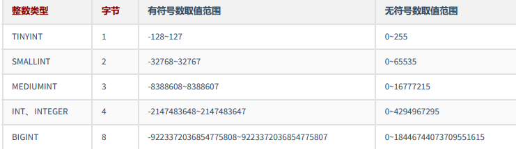

**可选属性**

```sql
#显示宽度 搭配 零填充 无符号
CREATE TABLE emp3 (
id1 INT(5) ZEROFILL, #int(M)，必须和UNSIGNED ZEROFILL一起使用才有意义。
id2 INT(5),
id3 INT UNSIGNED
);
DESC emp3;
INSERT INTO emp3
```

## 7.2 浮点类型

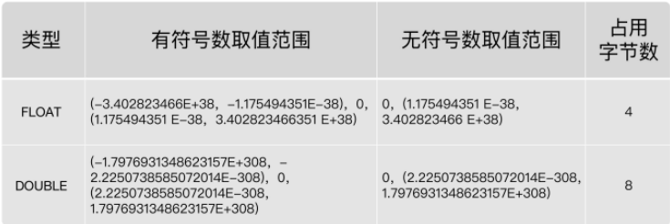


```sql
#REAL默认就是 DOUBLE。如果你把 SQL 模式设定为启用“ #REAL_AS_FLOAT ”，那 么，MySQL 就认为 REAL 是 FLOAT。
SET sql_mode = “REAL_AS_FLOAT”;

```

```
 FLOAT(M,D) 或 DOUBLE(M,D) 。这里，M称为 精度 ，D称为 标度 (M,D)中 M=整数位+小数
位，D=小数位。 D<=M<=255，0<=D<=30。
```

MySQL 用 4 个字节存储 FLOAT 类型数据，用 8 个字节来存储 DOUBLE 类型数据。无论哪个，都是采用二 进制的方式来进行存储的。比如 9.625，用二进制来表达，就是 1001.101，或者表达成 1.001101×2^3。如 果尾数不是 0 或 5（比如 9.624），你就无法用一个二进制数来精确表达。进而，就只好在取值允许的范 围内进行四舍五入。 在编程中，如果用到浮点数，要特别注意误差问题，

因为浮点数是不准确的，所以我们要避免使用“=”来 判断两个数是否相等。同时，在一些对精确度要求较高的项目中，千万不要使用浮点数，不然会导致结 果错误，甚至是造成不可挽回的损失。那么，MySQL 有没有精准的数据类型呢？当然有，这就是定点数 类型： DECIMAL 。

## 7.3 定点数类型

| 数据类型                  | 字节数  | 含义               |
| ------------------------- | ------- | ------------------ |
| DECIMAL(M, D)  DEC, NUMERIC | M+2 字节 | 有效范围由 M 和 D 决定 |

```
使用 DECIMAL(M,D) 的方式表示高精度小数。其中，M被称为精度，D被称为标度。0<=M<=65，
0<=D<=30，D<M。
```

的最大取值范围与 DOUBLE 类型一样，但是有效的数据范围是由 M 和 D 决定的。

定点数在 MySQL 内部是以 字符串 的形式进行存储，这就决定了它一定是精准的。

CPU 原生支持浮点运算，但是不支持 DECIMAl 类型的计算，因此 DECIMAL 的计算比浮点类型需要更高的代价。

## 7.4 位类型

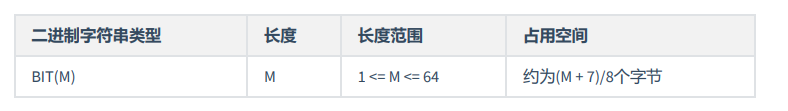

BIT 类型，如果没有指定(M)，默认是 1 位。这个 1 位，表示只能存 1 位的二进制值。这里(M)是表示二进制的 位数，位数最小值为 1，最大值为 64。

## 7.5 日期与时间类型

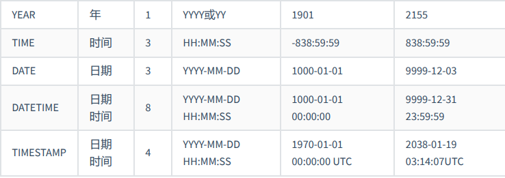

使用 CURRENT_DATE() 或者 NOW() 函数，会插入当前系统的日期。

使用函数 CURRENT_TIMESTAMP() 和 NOW() ，可以向 DATETIME 类型的字段插入系统的当前日期和时间。

**TIMESTAMP 和 DATETIME 的区别：**

* TIMESTAMP 存储空间比较小，表示的日期时间范围也比较小
* 底层存储方式不同，TIMESTAMP 底层存储的是毫秒值，距离 1970-1-1 0:0:0 0 毫秒的毫秒值。查询时，再根据当前时区转换为日期时间
* 两个日期比较大小或日期计算时，TIMESTAMP 更方便、更快。

* TIMESTAMP 和时区有关。TIMESTAMP 会根据用户的时区不同，显示不同的结果。而 DATETIME 则只能 反映出插入时当地的时区，其他时区的人查看数据必然会有误差的。

## 日期类型选择建议

* 不要用字符串存储日期。
  * 字符串通常需要占用更多的存储空间来表示相同的时间信息
  * 比较需要逐字符进行
  * 无法直接利用数据库提供的丰富日期时间函数
  * 字符串的索引处理范围查询效率低下
* 用数值来存储时间戳
  * 具有 `TIMESTAMP` 类型的所具有一些优点，性能较好
  * 数据的可读性差
* 用得最多的日期时间类型，就是 DATETIME 。时间范围足够大。
* `TIMESTAMP` 的核心优势在于其内建的时区处理能力。数据库负责 UTC 存储和基于会话时区的自动转换，简化了需要处理多时区应用的开发。如果应用需要处理多时区，或者希望数据库能自动管理时区转换，`TIMESTAMP` 是自然的选择（注意其时间范围限制，也就是 2038 年问题）。
  * 一般存注册时间、商品发布时间等，使用时间戳 ，便于跨时区计算。

## 7.6 文本字符串类型

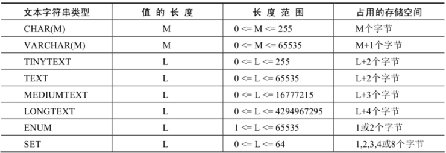

* CHAR 类型：固定长度。适用：存储很短的信息。固定长度的信息。

* VARCHAR 类型：可变长度 占用(实际长度 + 1) 个字节，必须指定 长度 M，否则报错。MySQL5.0 版本以上，varchar(20)：指的是 20 字符。适用：十分频繁改变的 column。
  * 更长的列会消耗更多的内存，因为 MySQL 通常会分配固定大小的内存块来保存内部值。尤其是使用内存临时表进行排序或其他操作时会特别糟糕。在利用磁盘临时表进行排序时也同样糟糕。所以最好的策略是只分配真正需要的空间。


* TEXT 文本类型，可以存比较大的文本段，搜索速度稍慢，因此如果不是特别大的内容，建议使用 CHAR， VARCHAR 来代替。还有 TEXT 类型不用加默认值，加了也没用。而且 text 和 blob 类型的数据删除后容易导致 “空洞”，使得文件碎片比较多，所以频繁使用的表不建议包含 TEXT 类型字段，建议单独分出去，单独用 一个表。

* ENUM 类型，ENUM 类型也叫作枚举类型，ENUM 类型的取值范围需要在定义字段时进行指定。设置字段值时，ENUM 类型只允许从成员中选取单个值，不能一次选取多个值

  ```sql
  CREATE TABLE season(
  season ENUM('春','夏','秋','冬','unknown')
  )
  
  INSERT INTO season
  VALUES ('春');
  
  #忽略大小写
  INSERT INTO season 
  VALUES('UNKNOWN');
  
  #根据索引添加
  INSERT INTO season 
  VALUES(5);
  ```

* SET 类型在存储数据时成员个数越多，其占用的存储空间越大。注意：SET 类型在选取成员时，可以一次 选择多个成员，这一点与 ENUM 类型不同。

  ```sql
  CREATE TABLE test_set(
  s SET ('A', 'B', 'C')
  );
  INSERT INTO test_set (s) VALUES ('A'), ('A,B');
  #插入重复的SET类型成员时，MySQL会自动删除重复的成员
  INSERT INTO test_set (s) VALUES ('A,B,C,A');
  #向SET类型的字段插入SET成员中不存在的值时，MySQL会抛出错误。
  INSERT INTO test_set (s) VALUES ('A,B,C,D');
  
  
  ```

## 7.7 二进制字符串类型

MySQL 中的二进制字符串类型主要存储一些二进制数据，比如可以存储图片、音频和视频等二进制数 据。 

MySQL 中支持的二进制字符串类型主要包括 BINARY、VARBINARY、TINYBLOB、BLOB、MEDIUMBLOB 和 LONGBLOB 类型。

* BINARY 与 VARBINARY 类型，类似于 CHAR 和 VARCHAR，只是它们存储的是二进制字符串。
* BLOB 是一个 二进制大对象 ，可以容纳可变数量的数据。
  MySQL 中的 BLOB 类型包括 TINYBLOB、BLOB、MEDIUMBLOB 和 LONGBLOB 4 种类型，它们可容纳值的最大 长度不同。可以存储一个二进制的大对象，比如 图片 、 音频 和 视频 等。
  需要注意的是，在实际工作中，往往不会在 MySQL 数据库中使用 BLOB 类型存储大对象数据，通常会将图 片、音频和视频文件存储到 服务器的磁盘上 ，并将图片、音频和视频的访问路径存储到 MySQL 中。

**注意事项**

1. BLOB 和 TEXT 值也会引起自己的一些问题，特别是执行了大量的删除或更新操作的时候。删除这种值会在数据表中留下很大的”空洞 "，以后填入这些" 空洞 " 的记录可能长度不同。为了提高性能，建议定期使用 OPTIMIZE TABLE 功能对这类表进行 碎片整理。
2. 如果需要对大文本字段进行模糊查询，MySQL 提供了 前缀索引。但是仍然要在不必要的时候避免检索大型的 BLOB 或 TEXT 值。例如，SELECT＊ 查询就不是很好的想法，除非你能够确定作为约束条件的 WHERE 子句只会找到所需要的数据行。否则，你可能毫无目的地在网络上传输大量的值。
3. 把 BLOB 或 TEXT 列 分离到单独的表 中。在某些环境中，如果把这些数据列移动到第二张数据表中，可以让你把原数据表中的数据列转换为固定长度的数据行格式，那么它就是有意义的。这会减少主表中的碎片，使你得到固定长度数据行的性能优势。它还使你在主数据表上运行 SELECT＊ 查询的时候不会通过网络传输大量的 BLOB 或 TEXT 值

## 7.8 JSON 类型

在 MySQL 5.7 中，就已经支持 JSON 数据类型。在 MySQL 8.x 版本中，JSON 类型提供了可以进行自动验证的 JSON 文档和优化的存储结构，使得在 MySQL 中存储和读取 JSON 类型的数据更加方便和高效。 创建数据 表，表中包含一个 JSON 类型的字段 js 。

```sql
INSERT INTO test_json (js)
VALUES ('{"name":"songhk", "age":18, "address":{"province":"beijing",
"city":"beijing"}}');

SELECT * FROM test_json

#解析提取字符串
SELECT js -> '$.name' AS NAME,js -> '$.age' AS age ,js -> '$.address.province'
AS province, js -> '$.address.city' AS city
FROM test_json;
```

## 7.9 空间类型

MySQL 空间类型扩展支持地理特征的生成、存储和分析。这里的地理特征表示世界上具有位置的任何东 西，可以是一个实体，例如一座山；可以是空间，例如一座办公楼；也可以是一个可定义的位置，例如 一个十字路口等等。MySQL 中使用 Geometry（几何） 来表示所有地理特征。Geometry 指一个点或点的 集合，代表世界上任何具有位置的事物。

## 7.10 开发经验

阿里巴巴《Java 开发手册》

* 任何字段如果为非负数，必须是 UNSIGNED
* 小数类型为 DECIMAL，禁止使用 FLOAT 和 DOUBLE。 说明：在存储的时候，FLOAT 和 DOUBLE 都存在精度损失的问题，很可能在比较值的时候，得 到不正确的结果。如果存储的数据范围超过 DECIMAL 的范围，建议将数据拆成整数和小数并 分开存储。
* 如果存储的字符串长度几乎相等，使用 CHAR 定长字符串类型。
* VARCHAR 是可变长字符串，不预先分配存储空间，长度不要超过 5000。如果存储长度大 于此值，定义字段类型为 TEXT，独立出来一张表，用主键来对应，避免影响其它字段索引效率。

# 8 约束

## 8.1 约束（constraint）概述

### 8.1.1 数据完整性

数据完整性（Data Integrity）是指数据的精确性（Accuracy）和可靠性（Reliability）。它是防止数据库中 存在不符合语义规定的数据和防止因错误信息的输入输出造成无效操作或错误信息而提出的。

为了保证数据的完整性，SQL 规范以约束的方式对表数据进行额外的条件限制。从以下四个方面考虑： 

* 实体完整性（Entity Integrity） ：例如，同一个表中，不能存在两条完全相同无法区分的记录 
* 域完整性（Domain Integrity） ：例如：年龄范围 0-120，性别范围“男/女” 
* 引用完整性（Referential Integrity） ：例如：员工所在部门，在部门表中要能找到这个部门 
* 用户自定义完整性（User-defined Integrity） ：例如：用户名唯一、密码不能为空等，本部门 经理的工资不得高于本部门职工的平均工资的 5 倍。

### 8.1.2 约束定义

为了保证数据完整性，我们使用约束。

约束是表级的强制规定。 

可以在创建表时规定约束（通过 CREATE TABLE 语句），或者在表创建之后（通过 ALTER TABLE 语句）规定 约束。

### 8.1.3 约束分类

**根据约束数据列的限制，约束可分为：** 

* 单列约束：每个约束只约束一列 
* 多列约束：每个约束可约束多列数据 

**根据约束的作用范围，约束可分为：** 

* 列级约束：只能作用在一个列上，跟在列的定义后面 

* 表级约束：可以作用在多个列上，不与列一起，而是单独定义

**根据约束起的作用，约束可分为：** 

* NOT NULL 非空约束，规定某个字段不能为空 
* UNIQUE 唯一约束，规定某个字段在整个表中是唯一的 
* PRIMARY KEY 主键(非空且唯一)约束 
* FOREIGN KEY 外键约束 
* CHECK 检查约束 
* DEFAULT 默认值约束

**通过系统表 查看某个表已有的约束**

```sql
#information_schema数据库名（系统库）
#table_constraints表名称（专门存储各个表的约束）
SELECT * FROM information_schema.table_constraints
WHERE table_name = '表名称';
```

### 8.1.4 创建约束示例

```sql
# 创建表时直接添加
CREATE TABLE users (
    id INT PRIMARY KEY,
    username VARCHAR(50),
    email VARCHAR(100),
    INDEX idx_username (username),       -- 普通索引
    UNIQUE INDEX idx_email (email),     -- 唯一索引
    PRIMARY KEY (id)                    -- 主键索引
);

# ALTER TABLE语句会修改表结构，添加索引后需重新加载数据。
-- 添加主键索引（单列）
ALTER TABLE users ADD PRIMARY KEY (id);
-- 添加主键索引（组合主键）
ALTER TABLE orders ADD PRIMARY KEY (order_id, customer_id);
-- 添加普通索引
ALTER TABLE users ADD INDEX idx_age (age);
-- 添加唯一索引
ALTER TABLE users ADD UNIQUE INDEX idx_phone (phone);
-- 添加复合索引
ALTER TABLE orders ADD INDEX idx_customer_date (customer_id, order_date);

# CREATE INDEX语句适合已有表结构需要优化查询性能，但不想修改原表定义的情况。 不能用于主键索引。
-- 创建普通索引
CREATE INDEX idx_last_name ON employees (last_name);
-- 创建唯一索引
CREATE UNIQUE INDEX idx_employee_id ON employees (employee_id);
-- 创建全文索引
CREATE FULLTEXT INDEX idx_description ON products (description);
```


## 8.2 非空约束

* 默认，所有的类型的值都可以是 NULL，包括 INT、FLOAT 等数据类型 
* 非空约束只能出现在表对象的列上，只能某个列单独限定非空，不能组合非空 
* 一个表可以有很多列都分别限定了非空 
* 空字符串''不等于 NULL，0 也不等于 NULL

## 8.3 唯一性约束

* 同一个表可以有多个唯一约束。 
* 唯一约束可以是某一个列的值唯一，也可以多个列组合的值唯一。 
* 唯一性约束允许列值为空。 
* 在创建唯一约束的时候，如果不给唯一约束命名，就默认和列名相同。 
* **MySQL 会给唯一约束的列上默认创建一个唯一索引。**

```sql
# 表级约束，可以指定多个列组合值唯一
CREATE TABLE test2(
id INT,
last_name VARCHAR(15),
email VARCHAR(25),
salary DECIMAL(10,2),
CONSTRAINT uk_email_id UNIQUE(id,email)
);

# 建表后指定唯一索引
#方式1：
alter table student_course add unique key(sid,cid);
#方式2：
MODIFY NAME VARCHAR(20) UNIQUE;


```

* 删除唯一约束 **只能通过删除唯一索引的方式** 删除。 
* 删除时需要指定唯一索引名，唯一索引名就和唯一约束名一样。
*  如果创建唯一约束时未指定名称，如果是单列，就默认和列名相同；如果是组合列，那么默认和() 中排在第一个的列名相同。也可以自定义唯一性约束名。

```sql
# 查看test2表索引
SHOW INDEX FROM test2;

ALTER TABLE USER
DROP INDEX uk_name_pwd;
```

## 8.4 主键约束

* 主键约束相当于唯一约束+非空约束的组合，主键约束列不允许重复，也不允许出现空值。
* 一个表最多只能有一个主键约束，建立主键约束可以在列级别创建，也可以在表级别上创建。 
* 主键约束对应着表中的一列或者多列（复合主键） 
* 如果是多列组合的复合主键约束，那么这些列都不允许为空值，并且组合的值不允许重复。 
* MySQL 的主键名总是 PRIMARY，就算自己命名了主键约束名也没用。 
* 当创建主键约束时，系统默认会在所在的列或列组合上 **建立对应的主键索引**（能够根据主键查询 的，就根据主键查询，效率更高）。如果删除主键约束了，**主键约束对应的索引就自动删除** 了。
*  需要注意的一点是，不要修改主键字段的值。因为主键是数据记录的唯一标识，如果修改了主键的 值，就有可能会破坏数据的完整性。

```sql
#删除主键
ALTER TABLE student DROP PRIMARY KEY;
```

## 8.5 自增列

（1）一个表最多只能有一个自增长列 

（2）当需要产生唯一标识符或顺序值时，可设置自增长 

（3）**自增长列约束的列必须是键列**（主键列，唯一键列） 

（4）自增约束的列的数据类型必须是 **整数类型** 

（5）如果自增列指定了 0 和 null，会在 **当前最大值的基础上自增**；如果自增列手动指定了具体值，直接 赋值为具体值

```sql
# 删除自增
alter table employee modify eid int
```

在 MySQL 8.0 之前，自增主键 AUTO_INCREMENT 的值如果大于 max(primary key)+1，在 MySQL 重启后，会重置 AUTO_INCREMENT = max(primary key)+1，这种现象在某些情况下会导致业务主键冲突或者其他难以发 现的问题。 

MySQL 8.0 将自增主键的计数器持久化到 重做日志 中。每次计数器发生改变，都会将其写入重做日志 中。如果数据库重启，InnoDB 会根据重做日志中的信息来初始化计数器的内存值。

## 8.6 外键约束

**作用**

限定某个表的某个字段的引用完整性。

**主表与从表**

主表（父表）：被引用的表，被参考的表 
从表（子表）：引用别人的表，参考别人的表

例如：员工表的员工所在部门这个字段的值要参考部门表：部门表是主表，员工表是从表。 
例如：学生表、课程表、选课表：选课表的学生和课程要分别参考学生表和课程表，学生表和课程表是 主表，选课表是从表。

**特点**

* 从表的外键列，**必须引用/参考主表的主键或唯一约束的列**。因为被依赖/被参考的值必须是唯一的
* 在创建外键约束时，如果不给外键约束命名，默认名不是列名，而是自动产生一个外键名（例如 student_ibfk_1;）
* 创建(CREATE)表时就指定外键约束的话，先创建主表，再创建从表。删表时，先删从表（或先删除外键约束），再删除主表
* 当主表的记录被从表参照时，主表的记录将不允许删除，如果要删除数据，需要先删除从表中依赖 该记录的数据，然后才可以删除主表的数据
* 在“从表”中指定外键约束，并且一个表可以建立多个外键约束
* 从表的外键列与主表被参照的列名字可以不相同，但是数据类型必须一样，逻辑意义一致
* 当创建外键约束时，**系统默认会在所在的列上建立对应的普通索引**。但是索引名是列名，不是外键的约束
  名。（根据外键查询效率很高）
* 删除外键约束后，必须手动删除对应的索引


```sql
# 添加
create table emp(#从表
eid int primary key, #员工编号
ename varchar(5), #员工姓名
deptid int, #员工所在的部门
foreign key (deptid) references dept(did) #在从表中指定外键约束
#emp表的deptid和和dept表的did的数据类型一致，意义都是表示部门的编号
);

# 或
alter table emp add foreign key (deptid) references dept(did);
```

**约束等级**

* Cascade 方式 ：级联，在父表上 update/delete 记录时，同步 update/delete 掉子表的匹配记录
* Set null 方式 ：在父表上 update/delete 记录时，将子表上匹配记录的列设为 null，但是要注意子 表的外键列不能为 not null 
* No action 方式 ：如果子表中有匹配的记录，则不允许对父表对应候选键进行 update/delete 操作
* Restrict 方式 ：同 no action， 都是立即检查外键约束 
* Set default 方式 （在可视化工具 SQLyog 中可能显示空白）：父表有变更时，子表将外键列设置 成一个默认的值，但 Innodb 不能识别

如果没有指定等级，就相当于 Restrict 方式。 对于外键约束，最好是采用: ON UPDATE CASCADE ON DELETE RESTRICT 的方式。

```sql
create table dept(
did int primary key, #部门编号
dname varchar(50) #部门名称
);
create table emp(
eid int primary key, #员工编号
ename varchar(5), #员工姓名
deptid int, #员工所在的部门
foreign key (deptid) references dept(did) on update cascade on delete set null
#把修改操作设置为级联修改等级，把删除操作设置为set null等级
);

```

**删除约束**

```sql
#删除约束
alter table emp drop foreign key emp_ibfk_1
#删除索引
 alter table emp drop index deptid
```

**开发经验**

>  建和不建外键约束有什么区别？
>
> 建外键约束，你的操作（创建表、删除表、添加、修改、删除）会受到限制，从语法层面受到限 制。例如：在员工表中不可能添加一个员工信息，它的部门的值在部门表中找不到。 不建外键约束，你的操作（创建表、删除表、添加、修改、删除）不受限制，要保证数据的 引用完整 性 ，只能依 靠程序员的自觉 ，或者是 在 Java 程序中进行限定 。例如：在员工表中，可以添加一个员工的 信息，它的部门指定为一个完全不存在的部门。
>
> 外键约束对查询的影响	
>
> 在 MySQL 里，外键约束是有成本的，需要消耗系统资源。对于大并发的 SQL 操作，有可能会不适 合。比如大型网站的中央数据库，可能会 因为外键约束的系统开销而变得非常慢 。所以， MySQL 允 许你不使用系统自带的外键约束，在 应用层面 完成检查数据一致性的逻辑。也就是说，即使你不 用外键约束，也要想办法通过应用层面的附加逻辑，来实现外键约束的功能，确保数据的一致性
>
> 阿里开发规范
>
> 【 强制 】不得使用外键与级联，一切外键概念必须在应用层解决。 说明：（概念解释）学生表中的 student_id 是主键，那么成绩表中的 student_id 则为外键。如果更新学 生表中的 student_id，同时触发成绩表中的 student_id 更新，即为级联更新。外键与级联更新适用于 单 机低并发 ，不适合 分布式 、 高并发集群 ；级联更新是强阻塞，存在数据库 更新风暴 的风险；外键影响 数据库的 插入速度 

## 8.7 检查约束

**作用**

检查某个字段的值是否符号 xx 要求，一般指的是值的范围

```sql
age tinyint check(age >20
sex char(2) check(sex in(‘男’,’女’))

# 删除
alter table employee modify tel char(11) default '' not null;#给tel字段增加默认值约束，并保留非空约束
```

## 8.8 默认值约束

**作用** 

给某个字段/某列指定默认值，一旦设置默认值，在插入数据时，如果此字段没有显式赋值，则赋值为默 认值。

```sql
create table employee(
eid int primary key,
ename varchar(20) not null,
gender char default '男',
tel char(11) not null default '' #默认是空字符串
);

alter table employee modify gender char default '男'; #给gender字段增加默认值约束
alter table employee modify tel char(11) default ''; #给tel字段增加默认值约束

#删除
alter table employee modify gender char; #删除gender字段默认值约束，如果有非空约束，也一并删除
```


## 8.9 经验总结

为什么不想要 null 的值？

* 不好比较。null 是一种特殊值，比较时只能用专门的 is null 和 is not null 来比较。碰到运算符，通 常返回 null。
* 效率不高。影响提高索引效果。因此，我们往往在建表时 not null default '' 或 default 0

带 AUTO_INCREMENT 约束的字段值是从 1 开始的吗？

* 在 MySQL 中，默认 AUTO_INCREMENT 的初始 值是 1，每新增一条记录，字段值自动加 1。设置自增属性（AUTO_INCREMENT）的时候，还可以指定第 一条插入记录的自增字段的值，这样新插入的记录的自增字段值从初始值开始递增，如在表中插入第一 条记录，同时指定 id 值为 5，则以后插入的记录的 id 值就会从 6 开始往上增加。添加主键约束时，往往需要 设置字段自动增加属性。

并不是每个表都可以任意选择存储引擎？

* 外键约束（FOREIGN KEY）不能跨引擎使用。 MySQL 支持多种存储引擎，每一个表都可以指定一个不同的存储引擎，需要注意的是：外键约束是用来 保证数据的参照完整性的，如果表之间需要关联外键，却指定了不同的存储引擎，那么这些表之间是不 能创建外键约束的。所以说，存储引擎的选择也不完全是随意的。

# 9 视图

## 9.1 视图概述

### 9.1.1 数据库对象

| 对象                 | 描述                                                         |
| -------------------- | ------------------------------------------------------------ |
| 表(TABLE)            | 表是存储数据的逻辑单元，以行和列的形式存在，列就是字段，行就是记录 |
| 数据字典             | 就是系统表，存放数据库相关信息的表。系统表的数据通常由数据库系统维护， 程序员通常不应该修改，只可查看 |
| 约束 (CONSTRAINT)    | 执行数据校验的规则，用于保证数据完整性的规则                 |
| 视图(VIEW)           | 一个或者多个数据表里的数据的逻辑显示，**视图并不存储数据**   |
| 索引(INDEX)          | 用于提高查询性能，相当于书的目录                             |
| 存储过程 (PROCEDURE) | 用于完成一次完整的业务处理，没有返回值，但可通过传出参数将多个值传给调 用环境 |
| 存储函数 (FUNCTION)  | 用于完成一次特定的计算，具有一个返回值                       |
| 触发器 (TRIGGER)     | 相当于一个事件监听器，当数据库发生特定事件后，触发器被触发，完成相应的 处理 |

### 9.1.2 视图

**视图作用**

视图一方面可以帮我们 **使用** 表的一部分而不是所有的表，另一方面也可以针对不同的用户制定不同的查询视图。

**使用场景**

比如，针对一个公司的销售人员，我们只想给他看部分数据，而某些特殊的数据，比如采购的 价格，则不会提供给他。再比如，人员薪酬是个敏感的字段，那么只给某个级别以上的人员开放，其他 人的查询视图中则不提供这个字段。

**特点**

* 视图是一种 虚拟表 ，**本身是 不具有数据** 的，占用很少的内存空间，它是 SQL 中的一个重要概念。

* 视图建立在已有表的基础上, 视图赖以建立的这些表称为 **基表**。
* 视图的创建和删除只影响视图本身，不影响对应的基表。但是当对视图中的数据进行增加、删除和 修改操作时，数据表中的数据会相应地发生变化，反之亦然。
* 向视图提供数据内容的语句为 SELECT 语句，可以将视图理解为存储起来的 SELECT 语句

> 视图，是向用户提供基表数据的另一种表现形式。通常情况下，小型项目的数据库可以不使用视 图，但是在 **大型项目** 中，以及数据表比较复杂的情况下，视图的价值就凸显出来了，它可以帮助我 们把经常查询的结果集放到虚拟表中，提升使用效率。理解和使用起来都非常方便。

## 9.2 创建视图

```sql
# 基于 SQL 语句的结果集形成一张虚拟表。
CREATE VIEW salvu50
AS
SELECT employee_id ID_NUMBER, last_name NAME,salary*12 ANN_SALARY # 别名为视图字段的名称
FROM employees
WHERE department_id = 50;
或
CREATE VIEW emp_year_salary (ename,year_salary) # 视图字段名
AS
SELECT ename,salary*12*(1+IFNULL(commission_pct,0))
FROM t_employee;
# 查询视图
SELECT *
FROM salvu80;
```

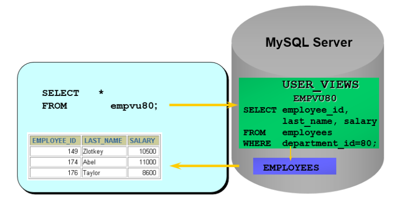


```sql
# 多表联合视图
CREATE VIEW empview
AS
SELECT employee_id emp_id,last_name NAME,department_name
FROM employees e,departments d
WHERE e.department_id = d.department_id;

# 基于视图创建视图
CREATE VIEW emp_dept_ysalary
AS
SELECT emp_dept.ename,dname,year_salary
FROM emp_dept INNER JOIN emp_year_salary
ON emp_dept.ename = emp_year_salary.ename;

```

## 9.3 查看视图

```sql
SHOW TABLES;

DESC / DESCRIBE 视图名称;

# 查看视图信息（显示数据表的存储引擎、版本、数据行数和数据大小等）
SHOW TABLE STATUS LIKE '视图名称'\G


SHOW CREATE VIEW 视图名称;
```

## 9.4 更新视图

**一般情况**

MySQL 支持使用 INSERT、UPDATE 和 DELETE 语句对视图中的数据进行插入、更新和删除操作。当视图中的数据发生变化时，数据表中的数据也会发生变化，反之亦然。

 **不可更新的视图**

要使视图可更新，视图中的行和底层基本表中的行之间必须存在 **一对一 的关系**。另外当视图定义出现如下情况时，视图不支持更新操作：

* 在定义视图的时候指定了“ALGORITHM = TEMPTABLE”，视图将不支持 INSERT 和 DELETE 操作； 
* 视图中不包含基表中所有被定义为非空又未指定默认值的列，视图将不支持 INSERT 操作； 
* 在定义视图的 SELECT 语句中使用了 **JOIN 联合查询** ，视图将不支持 INSERT 和 DELETE 操作； 
* 在定义视图的 SELECT 语句后的字段列表中使用了 数学表达式 或 子查询 ，视图将不支持 INSERT，也 不支持 UPDATE 使用了数学表达式、子查询的字段值； 
* 在定义视图的 SELECT 语句后的字段列表中使用 DISTINCT 、 聚合函数 、 GROUP BY 、 HAVING 、 UNION 等，视图将不支持 INSERT、UPDATE、DELETE； 
* 在定义视图的 SELECT 语句中包含了子查询，而子查询中引用了 FROM 后面的表，视图将不支持 INSERT、UPDATE、DELETE； 
* 视图定义基于一个 不可更新视图 ； 
* 常量视图。

> 虽然可以更新视图数据，但总的来说，视图作为 虚拟表 ，主要用于 方便查询 ，不建议更新视图的 数据。对视图数据的更改，都是通过对实际数据表里数据的操作来完成的。

## 9.5 修改和删除视图

**修改视图**

```sql
# 方式一
CREATE OR REPLACE VIEW empvu80
(id_number, name, sal, department_id)
AS
SELECT employee_id, first_name || ' ' || last_name, salary, department_id
FROM employees
WHERE department_id = 80;
# 方式二
ALTER VIEW 视图名称
AS
查询语句
```

**删除视图**

```sql
DROP VIEW empvu80;
# 基于视图a、b创建了新的视图c，如果将视图a或者视图b删除，会导致视图c的查询失败。这样的视图c需要手动删除或修改，否则影响使用。
```

## 9.6 视图优点和缺点

**优点**

* 操作简单，使开发人员不需要关心视图对应的数据表，而只需要简单地操作视图即可
* 减少数据冗余，相对存储于表，它存储的是查询语句，不占用数据存储的资源，减少了数据冗余。
*  数据安全，MySQL 将用户对数据的 访问限制 在某些数据的结果集上，这也可以理解为视图具有 隔离性 。视图相当于在用户和实际的数据表之 间加了一层虚拟表。
* 适应灵活多变的需求 当业务系统的需求发生变化后，如果需要改动数据表的结构，则工作量相对较 大，可以使用视图来减少改动的工作量。这种方式在实际工作中使用得比较多。
* 能够分解复杂的查询逻辑 数据库中如果存在复杂的查询逻辑，则可以将问题进行分解，创建多个视图 获取数据，再将创建的多个视图结合起来，完成复杂的查询逻辑。

**不足**

* 如果我们在实际数据表的基础上创建了视图，那么，如果实际数据表的结构变更了，我们就需要及时对 相关的视图进行相应的维护。

* 如果视图过多，维护会变得比较复 杂， 可读性不好 ，容易变成系统的潜在隐患。

* 对字段重命名，也可能包 含复杂的逻辑，这些都会增加维护的成本。

# 10 存储过程和存储函数

## 10.1 存储过程

### 10.1.1 含义

存储过程的英文是 Stored Procedure 。它的思想很简单，就是一组经过 预先编译 的 SQL 语句 的封装。

存储过程预先存储在 MySQL 服务器上，需要执行的时候，客户端只需要向服务器端发出调用 存储过程的命令，服务器端就可以把预先存储好的这一系列 SQL 语句全部执行。

### 10.1.2 好处

1. 简化操作，提高了 sql 语句的重用性，减少了开发程序员的压力
2. 减少操作过程中的失误，提高效率 
3. 减少网络传输量（客户端不需要把所有的 SQL 语句通过网络发给服务器）
4. 减少了 SQL 语句暴露在 网上的风险，也提高了数据查询的安全性

### 10.1.3 和视图、存储函数的对比

它和视图有着同样的优点，清晰、安全，还可以减少网络传输量。不过它和视图不同，**视图是 虚拟表** ， 通常不对底层数据表直接操作，而存储过程是 **程序化的 SQL**，可以 直接操作底层数据表 ，相比于面向集 合的操作方式，能够实现一些更复杂的数据处理。

一旦存储过程被创建出来，使用它就像使用函数一样简单，我们直接通过调用存储过程名即可。相较于 函数，存 **储过程是没有返回值 的**。

## 10.2 创建存储过程

```sql
# 需要设置新的结束标记
# 因为MySQL默认的语句结束符号为分号‘;’。为了避免与存储过程中SQL语句结束符相冲突，需要使用DELIMITER改变存储过程的结束符。
DELIMITER 新的结束标记

# IN ：当前参数为输入参数，也就是表示入参；
# 存储过程只是读取这个参数的值。如果没有定义参数种类， 默认就是 IN ，表示输入参数。
# OUT ：当前参数为输出参数，也就是表示出参；
# 执行完成之后，调用这个存储过程的客户端或者应用程序就可以读取这个参数返回的值了。
# INOUT ：当前参数既可以为输入参数，也可以为输出参数。

CREATE PROCEDURE 存储过程名(IN|OUT|INOUT 参数名 参数类型,...)
[characteristics ...]
BEGIN
存储过程体
END

# characteristics 表示创建存储过程时指定的对存储过程的约束条件，其取值信息如下：
LANGUAGE SQL
| [NOT] DETERMINISTIC
| { CONTAINS SQL | NO SQL | READS SQL DATA | MODIFIES SQL DATA }
| SQL SECURITY { DEFINER | INVOKER }
| COMMENT 'string'


# 存储过程定义完毕之后再使用“DELIMITER ;”恢复默认结束符。
DELIMITER ;

# 调用存储过程
call  存储过程名(参数列表)
```

> 关于 DELIMITER
>
> 在 MySQL 中默认的结束符 DELIMITER 是 `;`，它用于标识一段命令是否结束。在默认情况下，在命令行客户端中，如果有一行命令以 `;` 结束，那么回车后，MySQL 将会执行该命令。
>
> 而有时候我们输入的语句不希望立即执行，但是语句中却包含有分号 `;` 比如说我们在创建函数或者创建存储过程的时候，我们需要在函数中创建多条语句，此时如果用 `;` 分隔不同语句时就会导致直接执行目前所键入的命令，而创建函数或构建方法失败。因此，需要使用DELIMITER改变存储过程的结束符。
>
> 在使用习惯中，我们经常将结束符更改为 `;;` 、`//` 、 `$$` 等。

**带参数的存储过程**

```sql
# 定义存储过程
DELIMITER //
CREATE PROCEDURE show_min_salary(OUT ms DOUBLE)
BEGIN
	SELECT MIN(salary) INTO ms
	FROM emps;
END //

DELIMITER ;

# 调用存储过程
CALL show_min_salary(@ms)
# 查看变量
SELECT @ms;
```

```sql
DELIMITER //
CREATE PROCEDURE show_someone_salary(IN empname VARCHAR(20))
BEGIN 
	SELECT salary FROM emps
	WHERE last_name = empname;
END //
DELIMITER ;

#调用方式1
CALL show someone salary ('Abel')
#调用方式2
SET @empname 'Abel';
# set @empname := 'Abel'
CALL show someone salary (@empname)
```

## 10.3 存储函数

**对比存储函数和存储过程**

| 数据库对象 | 关键字    | 调用语法        | 返回值    | 应用场景                         |
| ---------- | --------- | --------------- | --------- | -------------------------------- |
| 存储过程   | PROCEDURE | CALL 存储过程() | 0 个或多个 | 一般用于更新                     |
| 存储函数   | FUNCTION  | SELECT 函数 ()  | 只能一个  | 一般用于查询结果为一个值并返回时 |

此外，存储函数可以放在查询语句中使用，存储过程不行。反之，存储过程的功能更加强大，包括能够 执行对表的操作（比如创建表，删除表等）和事务操作，这些功能是存储函数不具备的。

## 10.4 创建存储函数

```sql
# 需要设置新的结束标记
# 因为MySQL默认的语句结束符号为分号‘;’。为了避免与存储过程中SQL语句结束符相冲突，需要使用DELIMITER改变存储过程的结束符。
DELIMITER 新的结束标记

# FUNCTION中总是默认为IN参数。
# RETURNS type 语句表示函数返回数据的类型；

CREATE FUNCTION 函数名(参数名 参数类型,...)
RETURNS 返回值类型
[characteristics ...]
BEGIN
	函数体 #函数体中肯定有 RETURN 语句
END

# characteristic 创建函数时指定的对函数的约束。取值与创建存储过程时相同，这里不再赘述。

# 存储过程定义完毕之后再使用“DELIMITER ;”恢复默认结束符。
DELIMITER ;

# 调用存储函数
SELECT 函数名(实参列表)
```

> 若在创建存储函数中报错“ you might want to use the less safe log_bin_trust_function_creators variable ”，有两种处理方法： 
>
> 方式 1：加上必要的函数特性“[NOT] DETERMINISTIC”和“{CONTAINS SQL | NO SQL | READS SQL DATA | MODIFIES SQL DATA}” 方式 2： SET GLOBAL log_bin_trust_function_creators = 1;

```sql
DELIMITER //
CREATE FUNCTION email_by_name(empname VARCHAR(25))
RETURNS VARCHAR(25)
	CONTAINS SQL
	READS SQL DATA
BEGIN
	RETURN (SELECT email FROM emps WHERE last_name = empname);
END //
DELIMITER ;
```

## 10.5 存储过程和函数的查看、修改、删除

**查看**

```sql
#方式一
SHOW CREATE PROCEDURE show_someone_salary;
SHOW CREATE FUNCTION email_by_name;
#方式二
SHOW PROCEDURE STATUS LIKE '%someone%'
#方式三
SELECT * FROM information_schema.Routines
WHERE ROUTINE_NAME='show_someone_salary' AND ROUTINE_TYPE = 'PROCEDURE';
```

**修改**

修改存储过程或函数，不影响存储过程或函数功能，只是修改相关特性。使用 ALTER 语句实现。

```sql
ALTER PROCEDURE show_someone_salary MODIFIES 
SQL DATA 
SQL SECURITY INVOKER ;
```

**删除**

```sql
DROP FUNCTION IF EXISTS email_by_name
```

## 10.6 关于存储过程使用的争议

尽管存储过程有诸多优点，但是对于存储过程的使用，一直都存在着很多争议，比如有些公司对于大型 项目要求使用存储过程，而有些公司在手册中明确禁止使用存储过程，为什么这些公司对存储过程的使 用需求差别这么大呢？

**好处**

* 存储过程可以一次编译多次使用
* 可以减少开发工作量
* 存储过程的安全性强，设定存储过程的时候可以 设置对用户的使用权限 。
* 可以减少网络传输量，每次使用只需要调用存储过程即可，这样就减 少了网络传输量。
* 良好的封装性，一次存储过程，只需要 连接一次即可。

**缺点**

> 阿里开发规范 
>
> 【强制】禁止使用存储过程，存储过程难以调试和扩展，更没有移植性。

* 可移植性差，换成其他数据库时都需要重新编写
* 调试困难
* 存储过程的版本管理很困难
* 它不适合高并发的场景

# 11 变量、流程控制与游标

## 11.1 变量

### 11.1.1 定义

在 MySQL 数据库的存储过程和函数中，可以使用变量来存储查询或计算的中间结果数据，或者输出最终 的结果数据。

在 MySQL 数据库中，变量分为 系统变量 以及 用户自定义变量 。

### 11.1.2 系统变量

每一个 MySQL 客户机成功连接 MySQL 服务器后，都会产生与之对应的会话。会话期间，MySQL 服务实例 会在 MySQL 服务器内存中生成与该会话对应的会话系统变量，这些会话系统变量的初始值是全局系统变 量值的复制。

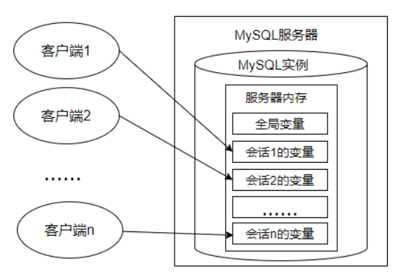

**全局系统变量**

* 静态变量（在 MySQL 服务实例运行期间它们的值不能使用 set 动态修改）属于特殊的全局系统变量。

* 全局系统变量针对于所有会话（连接）有效，**但不能跨重启**
* 会话 1 对某个全局系统变量值的修改会导致会话 2 中同一个全局系统变量值的修改。
* 在 MySQL 中有些系统变量只能是全局的
* 有些系 统变量作用域既可以是全局又可以是会话

**会话系统变量**

* 有些系 统变量的作用域只能是当前会话

**查看系统变量**

```sql
#查看所有全局变量
SHOW GLOBAL VARIABLES;
#查看所有会话变量
SHOW SESSION VARIABLES;
# 或
SHOW VARIABLES;

#查看满足条件的部分系统变量。
SHOW GLOBAL VARIABLES LIKE 'admin_%';

#查看指定的系统变量的值
SELECT @@global.变量名;
SELECT @@session.变量名;
SELECT @@变量名;
```

**修改系统变量**

方式 1：修改 MySQL 配置文件 ，继而修改 MySQL 系统变量的值（该方法需要重启 MySQL 服务） 

方式 2：在 MySQL 服务运行期间，使用“set”命令重新设置系统变量的值

```sql
#方式1：
SET @@global.变量名=变量值;
SET @@session.变量名=变量值;
#方式2：
SET GLOBAL 变量名=变量值;
SET SESSION 变量名=变量值;
```


### 11.1.3 用户自定义变量

用户变量是用户自己定义的，作为 MySQL 编码规范，MySQL 中的用户变量以 一个“@” 开头。根据作用 范围不同，又分为 会话用户变量 和 局部变量 。

**会话用户变量**

作用域和会话变量一样，只对 当前连接 会话有效。

```sql
#变量的定义
#方式1：“=”或“:=”
SET @用户变量 = 值;
SET @用户变量 := 值;
#方式2：“:=” 或 INTO关键字
SELECT @用户变量 := 表达式 [FROM 等子句];
SELECT 表达式 INTO @用户变量 [FROM 等子句];

#变量查看
SELECT @用户变量
```

**局部变量**

只在 BEGIN 和 END 语句块中有效。局部变量只能在 存储过程和函数 中使用。

定义：可以使用 DECLARE 语句定义一个局部变量 

作用域：仅仅在定义它的 BEGIN ... END 中有效 

位置：只能放在 BEGIN ... END 中，而且只能放在第一句

```sql
DELIMITER //
CREATE PROCEDURE set_value()
BEGIN
# 定义变量
DECLARE emp_name VARCHAR(25);
DECLARE sal DOUBLE(10,2);
# 初始化变量
SELECT last_name,salary INTO emp_name,sal
FROM employees
WHERE employee_id = 102;
# 使用变量
SELECT emp_name,sal;
END //
DELIMITER ;

```

## 11.2 定义条件与处理程序（错误处理机制）

### 11.2.1 含义

定义条件 是事先定义程序执行过程中可能遇到的问题

处理程序 定义了在遇到问题时应当采取的处理方 式，并且保证存储过程或函数在遇到警告或错误时能继续执行。这样可以增强存储程序处理问题的能 力，避免程序异常停止运行。

### 11.2.2 抛错语句

```sql
 SIGNAL SQLSTATE 'HY000' SET MESSAGE_TEXT = '薪资高于领导薪资错误';
```

### 11.2.3 定义条件

定义条件就是给 MySQL 中的错误码命名，这有助于存储的程序代码更清晰。它将一个 错误名字 和 指定的错误条件关联起来。这个名字可以随后被用在定义处理程序的 DECLARE HANDLER 语句中。

```sql
DECLARE 错误名称 CONDITION FOR 错误码（或错误条件）

# 错误码的说明：
# MySQL_error_code 和 sqlstate_value 都可以表示MySQL的错误。
# MySQL_error_code是数值类型错误代码。
# sqlstate_value是长度为5的字符串类型错误代码。
# 例如，在ERROR 1418 (HY000)中，1418是MySQL_error_code，'HY000'是sqlstate_value。
# 例如，在ERROR 1142（42000）中，1142是MySQL_error_code，'42000'是sqlstate_value。

#定义“Field_Not_Be_NULL”错误名与MySQL中违反非空约束的错误类型是“ERROR 1048 (23000)”对应。
#使用MySQL_error_code
DECLARE Field_Not_Be_NULL CONDITION FOR 1048;
#使用sqlstate_value
DECLARE Field_Not_Be_NULL CONDITION FOR SQLSTATE '23000';

```

### 11.2.4 处理程序

可以为 SQL 执行过程中发生的某种类型的错误定义特殊的处理程序。

```sql
DECLARE 处理方式 HANDLER FOR 错误类型 处理语句
```

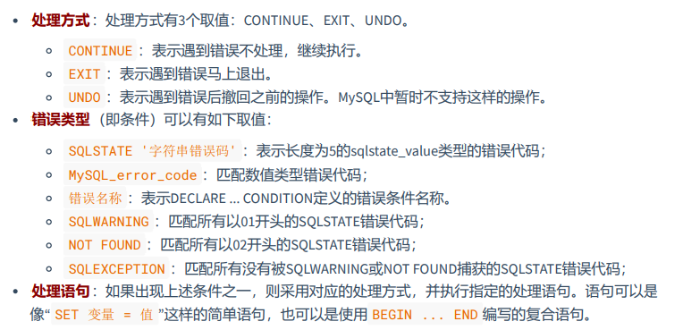

## 11.3 流程控制

### 11.3.1 分类

执行的程序，流程 就分为三大类： 

* 顺序结构 ：程序从上往下依次执行 
* 分支结构 ：程序按条件进行选择执行，从两条或多条路径中选择一条执行 
* 循环结构 ：程序满足一定条件下，重复执行一组语句

针对于 MySQL 的流程控制语句主要有 3 类。注意：**只能用于存储程序。**

* 条件判断语句 ：IF 语句和 CASE 语句 
* 循环语句 ：LOOP、WHILE 和 REPEAT 语句
* 跳转语句 ：ITERATE 和 LEAVE 语句

### 11.3.2 分支结构

**if**

```sql
IF 表达式1 THEN 操作1
[ELSEIF 表达式2 THEN 操作2]……
[ELSE 操作N]
END IF
```

**CASE**

```sql
#情况一：类似于switch
CASE 表达式
WHEN 值1 THEN 结果1或语句1(如果是语句，需要加分号)
WHEN 值2 THEN 结果2或语句2(如果是语句，需要加分号)
...
ELSE 结果n或语句n(如果是语句，需要加分号)
END [case]（如果是放在begin end中需要加上case，如果放在select后面不需要）


#情况二：类似于多重if
CASE
WHEN 条件1 THEN 结果1或语句1(如果是语句，需要加分号)
WHEN 条件2 THEN 结果2或语句2(如果是语句，需要加分号)
...
ELSE 结果n或语句n(如果是语句，需要加分号)
END [case]（如果是放在begin end中需要加上case，如果放在select后面不需要）

```

### 11.3.3 循环结构

**LOOP**

```sql
# 当市场环境变好时，公司为了奖励大家，决定给大家涨工资。声明存储过程
# “update_salary_loop()”，声明OUT参数num，输出循环次数。存储过程中实现循环给大家涨薪，薪资涨为
# 原来的1.1倍。直到全公司的平均薪资达到12000结束。并统计循环次数。
DELIMITER //
CREATE PROCEDURE update_salary_loop(OUT num INT)
BEGIN
    DECLARE avg_salary DOUBLE;
    DECLARE loop_count INT DEFAULT 0;
    SELECT AVG(salary) INTO avg_salary FROM employees;
    label_loop:LOOP
        IF avg_salary >= 12000 THEN LEAVE label_loop;
        END IF;
        
        UPDATE employees SET salary = salary * 1.1;
        SET loop_count = loop_count + 1;
        SELECT AVG(salary) INTO avg_salary FROM employees;
    END LOOP label_loop;
    SET num = loop_count;
END //
DELIMITER ;


```

**WHILE**

```sql
# 市场环境不好时，公司为了渡过难关，决定暂时降低大家的薪资。声明存储过程
#“update_salary_while()”，声明OUT参数num，输出循环次数。存储过程中实现循环给大家降薪，薪资降
# 为原来的90%。直到全公司的平均薪资达到5000结束。并统计循环次数。
DELIMITER //
CREATE PROCEDURE update_salary_while(OUT num INT)
BEGIN
    DECLARE avg_sal DOUBLE ;
    DECLARE while_count INT DEFAULT 0;
    SELECT AVG(salary) INTO avg_sal FROM employees;
    WHILE avg_sal > 5000 DO
        UPDATE employees SET salary = salary * 0.9;
        SET while_count = while_count + 1;
        SELECT AVG(salary) INTO avg_sal FROM employees;
    END WHILE;
    SET num = while_count;
END //
DELIMITER ;
```

**REPEAT**

```sql
# 当市场环境变好时，公司为了奖励大家，决定给大家涨工资。声明存储过程
#“update_salary_repeat()”，声明OUT参数num，输出循环次数。存储过程中实现循环给大家涨薪，薪资涨
#为原来的1.15倍。直到全公司的平均薪资达到13000结束。并统计循环次数。
DELIMITER //
CREATE PROCEDURE update_salary_repeat(OUT num INT)
BEGIN
    DECLARE avg_sal DOUBLE ;
    DECLARE repeat_count INT DEFAULT 0;
    SELECT AVG(salary) INTO avg_sal FROM employees;
    REPEAT
        UPDATE employees SET salary = salary * 1.15;
        SET repeat_count = repeat_count + 1;
        SELECT AVG(salary) INTO avg_sal FROM employees;
    UNTIL avg_sal >= 13000
    END REPEAT;
    SET num = repeat_count;
END //

```


### 11.3.4 跳转语句

**LEAVE**

可以用在循环语句内，或者以 BEGIN 和 END 包裹起来的程序体内，表示跳出循环或者跳出 程序体的操作。如果你有面向过程的编程语言的使用经验，你可以把 LEAVE 理解为 break。

```sql
# 创建存储过程 “leave_begin()”，声明INT类型的IN参数num。给BEGIN...END加标记名，并在
# BEGIN...END中使用IF语句判断num参数的值。
DELIMITER //
CREATE PROCEDURE leave_begin(IN num INT)
begin_label: BEGIN
    IF num<=0
    	THEN LEAVE begin_label;
    ELSEIF num=1
    	THEN SELECT AVG(salary) FROM employees;
    ELSEIF num=2
    	THEN SELECT MIN(salary) FROM employees;
    ELSE
    	SELECT MAX(salary) FROM employees;
    END IF;
    
    SELECT COUNT(*) FROM employees;
END //
DELIMITER ;
```

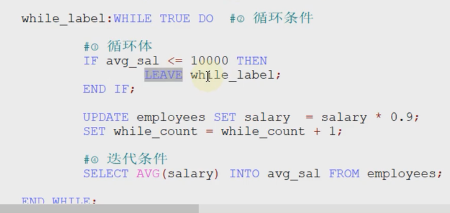

**ITERATE**

只能用在循环语句（LOOP、REPEAT 和 WHILE 语句）内，表示重新开始循环，将执行顺序 转到语句段开头处。如果你有面向过程的编程语言的使用经验，你可以把 ITERATE 理解为 continue，意 思为“再次循环”。

```sql
#定义局部变量num，初始值为0。循环结构中执行num + 1操作。
#如果num < 10，则继续执行循环；
#如果num > 15，则退出循环结构；
DELIMITER //
CREATE PROCEDURE test_iterate()
BEGIN
    DECLARE num INT DEFAULT 0;
    my_loop:LOOP
        SET num = num + 1;
        IF num < 10
        	THEN ITERATE my_loop;
        ELSEIF num > 15
        	then leave my_loop;
        end if 
        SELECT '尚硅谷：让天下没有难学的技术';
    END LOOP my_loop;
END //
DELIMITER ;
```

## 11.4 游标

### 11.4.1 含义

虽然我们也可以通过筛选条件 WHERE 和 HAVING，或者是限定返回记录的关键字 LIMIT 返回一条记录， 但是，却无法在结果集中像指针一样，向前定位一条记录、向后定位一条记录，或者是 随意定位到某一 条记录 ，并对记录的数据进行处理。

这个时候，就可以用到游标。游标，提供了一种灵活的操作方式，让我们能够对结果集中的每一条记录 进行定位，并对指向的记录中的数据进行操作的数据结构。**游标让 SQL 这种面向集合的语言有了面向过 程开发的能力。**

MySQL 中游标可以在存储过程和函数中使用。


### 11.4.2 使用游标

**声明游标**

```sql
# 游标必须在声明处理程序之前被声明，并且变量和条件还必须在声明游标或处理程序之前被声明。
#MySQL SQL Server，DB2 和 MariaDB。
DECLARE cur_emp CURSOR FOR
SELECT employee_id,salary FROM employees;
# Oracle 或者 PostgreSQL
DECLARE cur_emp CURSOR IS 
SELECT employee_id,salary FROM employees;

```

**打开游标**

```sql
# 当我们定义好游标之后，如果想要使用游标，必须先打开游标。打开游标的时候 SELECT 语句的查询结果集就会送到游标工作区，为后面游标的 逐条读取 结果集中的记录做准备。
OPEN cur_emp ;
```

**使用游标**

```sql
# 如果游标读取的数据行有多个列名，则在 INTO 关键字后面赋值给多个变量名即可。
FETCH cur_emp INTO emp_id, emp_sal ;
# 注意：游标的查询结果集中的字段数，必须跟 INTO 后面的变量数一致，否则，在存储过程执行的时候，MySQL 会提示错误。
```

**关闭游标**

```sql
#当我们使用完游标后需要关闭掉该游标。因为游标会占用系统资源 ，如果不及时关闭，游标会一直保持到存储过程结束，影响系统运行的效率。
CLOSE cur_emp

```

 **举例**

```sql
# 创建存储过程“get_count_by_limit_total_salary()”，声明IN参数 limit_total_salary，DOUBLE类型；声明OUT参数total_count，INT类型。函数的功能可以实现累加薪资最高的几个员工的薪资值，直到薪资总和 达到limit_total_salary参数的值，返回累加的人数给total_count。
DELIMITER //
CREATE PROCEDURE get_count_by_limit_total_salary(IN limit_total_salary DOUBLE,OUT
total_count INT)
BEGIN
    DECLARE sum_salary DOUBLE DEFAULT 0; #记录累加的总工资
    DECLARE cursor_salary DOUBLE DEFAULT 0; #记录某一个工资值
    DECLARE emp_count INT DEFAULT 0; #记录循环个数
    #定义游标
    DECLARE emp_cursor CURSOR FOR SELECT salary FROM employees ORDER BY salary DESC;
    #打开游标
    OPEN emp_cursor;
    REPEAT
        #使用游标（从游标中获取数据）
        FETCH emp_cursor INTO cursor_salary;
        SET sum_salary = sum_salary + cursor_salary;
        SET emp_count = emp_count + 1;
    UNTIL sum_salary >= limit_total_salary
    END REPEAT;
    SET total_count = emp_count;
    #关闭游标
    CLOSE emp_cursor;
END //
DELIMITER ;
```

### 11.4.3 好处与缺点

游标是 MySQL 的一个重要的功能，为 逐条读取 结果集中的数据，提供了完美的解决方案。跟在应用层 面实现相同的功能相比，游标可以在存储程序中使用，效率高，程序也更加简洁。

但同时也会带来一些性能问题，比如在使用游标的过程中，会对数据行进行 加锁 ，这样在业务并发量大 的时候，不仅会影响业务之间的效率，还会 消耗系统资源 ，造成内存不足，这是因为游标是在内存中进 行的处理。

# 12 触发器

### 12.1 应用场景

在实际开发中，我们经常会遇到这样的情况：有 2 个或者多个相互关联的表，如 商品信息 和 库存信息 分 别存放在 2 个不同的数据表中，我们在添加一条新商品记录的时候，为了保证数据的完整性，必须同时 在库存表中添加一条库存记录。 

这样一来，我们就必须把这两个关联的操作步骤写到程序里面，而且要用 **事务** 包裹起来，确保这两个操 作成为一个 **原子操作** ，要么全部执行，要么全部不执行。要是遇到特殊情况，可能还需要对数据进行手 动维护，这样就很 容易忘记其中的一步 ，导致数据缺失。 

这个时候，咱们可以使用触发器。你可以创建一个触发器，让 **商品信息数据的插入操作自动触发库存数 据的插入操作**。这样一来，就不用担心因为忘记添加库存数据而导致的数据缺失了。

## 12.2 概述

MySQL 的触发器和存储过程一样，都是嵌入到 MySQL 服务器的一 段程序。

触发器是由 事件来触发 某个操作，这些事件包括 INSERT 、 UPDATE 、 DELETE 事件。所谓事件就是指 用户的动作或者触发某项行为。如果定义了触发程序，当数据库执行这些语句时候，就相当于事件发生 了，就会 自动 激发触发器执行相应的操作。

## 12.3 创建触发器

```sql
CREATE TRIGGER 触发器名称
{BEFORE|AFTER} {INSERT|UPDATE|DELETE} ON 表名
FOR EACH ROW
触发器执行的语句块;
```

```sql
#创建名称为after_insert的触发器，向test_trigger数据表插入数据之后，向test_trigger_log数据表中插入after_insert的日志信息。
CREATE TRIGGER after_insert
AFTER INSERT ON test_trigger
FOR EACH ROW
BEGIN
    INSERT INTO test_trigger_log (t_log)
    VALUES('after_insert');
END //
DELIMITER ;
```

```sql
#定义触发器“salary_check_trigger”，基于员工表“employees”的INSERT事件，在INSERT之前检查将要添加的新员工薪资是否大于他领导的薪资，如果大于领导薪资，则报sqlstate_value为'HY000'的错误，从而使得添加失败。

DELIMITER //
CREATE TRIGGER salary_check_trigger
BEFORE INSERT ON employees FOR EACH ROW
BEGIN
    DECLARE mgrsalary DOUBLE;
    SELECT salary INTO mgrsalary FROM employees WHERE employee_id = NEW.manager_id;
    IF NEW.salary > mgrsalary THEN
    SIGNAL SQLSTATE 'HY000' SET MESSAGE_TEXT = '薪资高于领导薪资错误';
    END IF;
END //
DELIMITER ;

```

## 12.4 查看、删除触发器

```sql
#查看当前数据库的所有触发器的定义
SHOW TRIGGERS\G
#查看当前数据库中某个触发器的定义
SHOW CREATE TRIGGER 触发器名
#从系统库information_schema的TRIGGERS表中查询“salary_check_trigger”触发器的信息。
SELECT * FROM information_schema.TRIGGERS;
#删除触发器
DROP TRIGGER IF EXISTS 触发器名称;
```

## 12.5 优缺点

**好处**

1. 触发器可以确保数据的完整性。
2. 触发器可以帮助我们记录操作日志。
3. 触发器还可以用在操作数据前，对数据进行合法性检查。

**缺点**

1. 触发器最大的一个问题就是可读性差。
2. 相关数据的变更，可能会导致触发器出错。

> 注意，如果在子表中定义了外键约束，并且外键指定了 ON UPDATE/DELETE CASCADE/SET NULL 子句，此 时修改父表被引用的键值或删除父表被引用的记录行时，也会引起子表的修改和删除操作，此时基于子 表的 UPDATE 和 DELETE 语句定义的触发器并不会被激活。

# 13 MySQL8 新特性

## 13.1 新特性概述

[第 18 章_MySQL8 其它新特性.pdf](assets/第18章_MySQL8其它新特性.pdf)

## 13.2 窗口函数

### 13.2.1 使用窗口函数前后

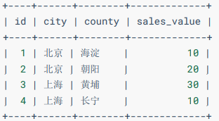

**需求**：现在计算这个网站在每个城市的销售总额、在全国的销售总额、每个区的销售额占所在城市销售 额中的比率，以及占总销售额中的比率。

如果用分组和聚合函数，就需要分好几步来计算。

```sql
#计算总销售金额，并存入临时表 a：
CREATE TEMPORARY TABLE a -- 创建临时表
SELECT SUM(sales_value) AS sales_value -- 计算总计金额
FROM sales;

#计算每个城市的销售总额并存入临时表 b：
CREATE TEMPORARY TABLE b -- 创建临时表
SELECT city,SUM(sales_value) AS sales_value -- 计算城市销售合计
FROM sales

#计算各区的销售占所在城市的总计金额的比例，和占全部销售总计金额的比例。我们可以通过下面的连接查询获得需要的结果：
SELECT s.city AS 城市,s.county AS 区,s.sales_value AS 区销售额,
b.sales_value AS 市销售额,s.sales_value/b.sales_value AS 市比率,
a.sales_value AS 总销售额,s.sales_value/a.sales_value AS 总比率
FROM sales s
JOIN b ON (s.city=b.city) -- 连接市统计结果临时表
JOIN a -- 连接总计金额临时表
ORDER BY s.city,s.county;

```

同样的查询，如果用窗口函数，就简单多了。

```sql
SELECT city AS 城市,county AS 区,sales_value AS 区销售额,
SUM(sales_value) OVER(PARTITION BY city) AS 市销售额, -- 计算市销售额
sales_value/SUM(sales_value) OVER(PARTITION BY city) AS 市比率,
SUM(sales_value) OVER() AS 总销售额, -- 计算总销售额
sales_value/SUM(sales_value) OVER() AS 总比率
FROM sales
ORDER BY city,county;

```

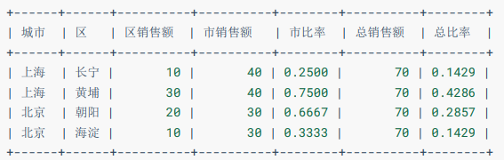

使用窗口函数，只用了一步就完成了查询。而且，由于没有用到临时表，执行的效率也更高了。很显 然，在这种需要用到 **分组统计** 的结果对每一条记录进行计算的场景下，使用窗口函数更好。

## 13.2.2 窗口函数与分组函数的对比

MySQL 从 8.0 版本开始支持窗口函数。窗口函数的作用类似于在查询中对数据进行分组，不同的是，分组 操作会把分组的结果聚合成一条记录，而窗口函数是将结果置于每一条数据记录中。 类似于单行函数和分组函数的结合

窗口函数可以分为 静态窗口函数 和 动态窗口函数 。

* 静态窗口函数的窗口大小是固定的，不会因为记录的不同而不同； 

* 动态窗口函数的窗口大小会随着记录的不同而变化。

### 13.2.3 语法结构

```sql
函数 OVER（[PARTITION BY 字段名 ORDER BY 字段名 ASC|DESC]）
或
函数 OVER 窗口名 … WINDOW 窗口名 AS （[PARTITION BY 字段名 ORDER BY 字段名 ASC|DESC]）
```

针对 goods 表进行测试

```sql
SELECT * FROM goods;
```

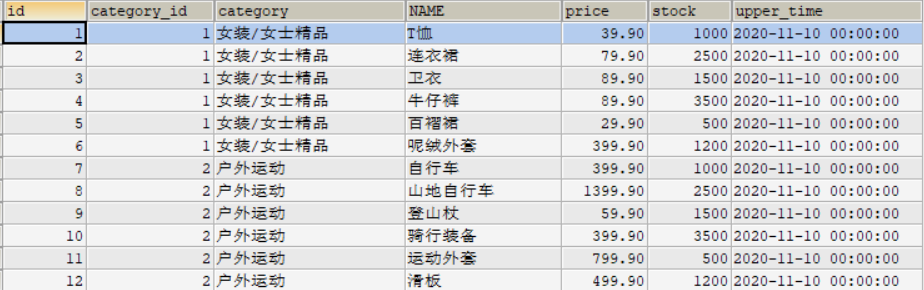

### 13.2.4 序号函数

**ROW_NUMBER()**


```sql
#对数据中的序号进行顺序显示。
SELECT row_number() over(PARTITION BY category_id ORDER BY price DESC) AS row_num,
category_id, category, `name`, price, stock,upper_time
FROM goods;
```

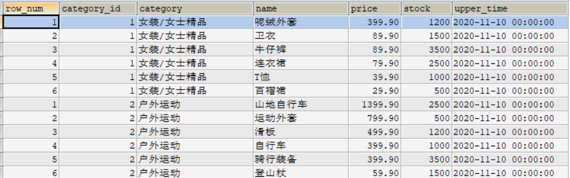

**RANK()**

```sql
#够对序号进行并列排序，并且会跳过重复的序号
SELECT rank() over(PARTITION BY category_id ORDER BY price DESC) AS row_num,
category_id, category, `name`, price, stock,upper_time
FROM goods;
```

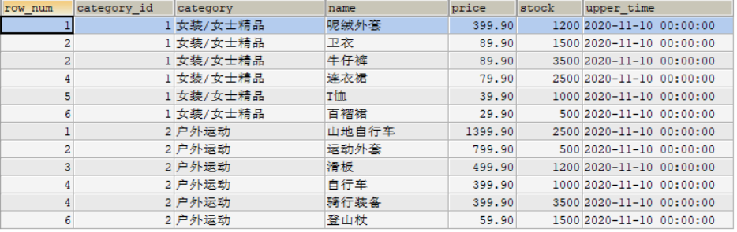

**DENSE_RANK()**

```sql
#DENSE_RANK()函数对序号进行并列排序，并且不会跳过重复的序号
#同上
```

### 13.2.5 分布函数

**PERCENT_RANK()**

```sql
#PERCENT_RANK()函数是等级值百分比函数。按照如下方式进行计算。
#(rank - 1) / (rows - 1)
SELECT rank() over w AS r, percent_rank() over w AS pr,
category_id, category, `name`, price, stock,upper_time
FROM goods
window w AS (PARTITION BY category_id ORDER BY price DESC);
```

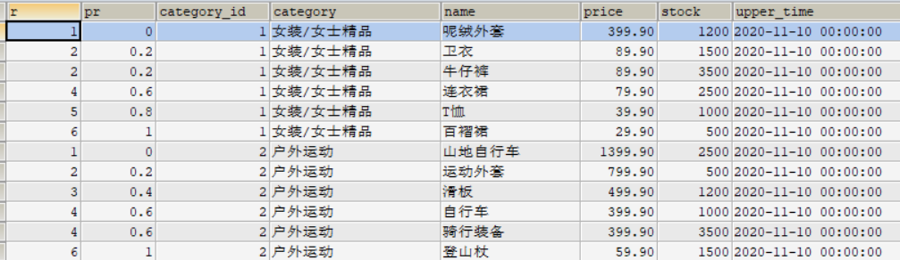

**CUME_DIST()**

```sql
#CUME_DIST()函数主要用于查询小于或等于某个值的比例。
SELECT CUME_DIST() OVER(PARTITION BY category_id ORDER BY price ASC) AS cd,
id, category, NAME, price
FROM goods;

```

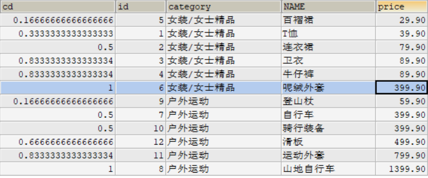


### 13.2.6 前后函数

**LAG(expr, n)**

```sql
#LAG(expr,n)函数返回当前行的前n行的expr的值。
```

**LEAD(expr, n)函数**

```sql
#LEAD(expr,n)函数返回当前行的后n行的expr的值。
```

### 13.2.7 首尾函数

**FIRST_VALUE(expr)**

```sql
#FIRST_VALUE(expr)函数返回第一个expr的值。
```

**LAST_VALUE(expr)**

```sql
#LAST_VALUE(expr)函数返回最后一个expr的值。
```

### 13.2.8 其他函数

**NTH_VALUE(expr, n)**

```sql
#NTH_VALUE(expr,n)函数返回第n个expr的值。
```

**NTILE(n)**

```sql
#NTILE(n)函数将分区中的有序数据分为n个桶，记录桶编号。
SELECT ntile(3) over(PARTITION BY category_id ORDER BY price DESC) AS n,
category_id, category, `name`, price, stock,upper_time
FROM goods;
```

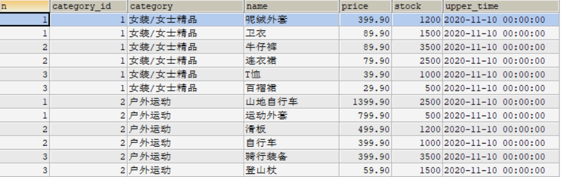

### 13.2.9 总结

窗口函数的特点是可以分组，而且可以在分组内排序。另外，窗口函数不会因为分组而减少原表中的行 数，这对我们在原表数据的基础上进行统计和排序非常有用。

## 13.3 公用表公式

### 13.3.1 含义

公用表表达式（或通用表表达式）简称为 CTE（Common Table Expressions）。CTE 是一个命名的临时结 果集，作用范围是当前语句。CTE 可以理解成一个可以复用的子查询，当然跟子查询还是有点区别的， CTE 可以引用其他 CTE，但子查询不能引用其他子查询。所以，可以考虑代替子查询。

依据语法结构和执行方式的不同，公用表表达式分为 普通公用表表达式 和 递归公用表表达式 2 种。

### 13.3.2 普通公用表表达式

普通公用表表达式类似于子查询，不过，跟子查询不同的是，它可以被多次引用，而且可以被其他的普 通公用表表达式所引用。

```sql
WITH CTE名称
AS （子查询）
SELECT|DELETE|UPDATE 语句;
```


### 13.3.3 递归公用表表达式 

递归公用表表达式也是一种公用表表达式，只不过，除了普通公用表表达式的特点以外，它还有自己的 特点，就是可以调用自己。它的语法结构是：

```sql
WITH RECURSIVE
CTE名称 AS （子查询）
SELECT|DELETE|UPDATE 语句
```

```sql
#案例：针对于我们常用的employees表，包含employee_id，last_name和manager_id三个字段。如果a是b的管理者，那么，我们可以把b叫做a的下属，如果同时b又是c的管理者，那么c就是b的下属，是a的下下属。
WITH RECURSIVE cte
AS
(
SELECT employee_id,last_name,manager_id,1 AS n FROM employees WHERE employee_id = 100
-- 种子查询，找到第一代领导
UNION ALL
SELECT a.employee_id,a.last_name,a.manager_id,n+1 FROM employees AS a JOIN cte
ON (a.manager_id = cte.employee_id) -- 递归查询，找出以递归公用表表达式的人为领导的人
)


SELECT employee_id,last_name FROM cte WHERE n >= 3;
```


### 13.3.4 与临时表区别

相对于派生表最主要的优势在于可以一次定义，多次使用。

　　CET 大部分地方可以代替临时表。CTE 最优秀的地方是在实现递归操作，和替代绝大部分游标的功能。

　　CET 后面必须直接跟使用 CTE 的 SQL 语句（如 select、insert、update 等），否则，CET 将失效。但是临时表一直存在，除非 drop 掉。


对于大数据量，由于 CET 不能建索引，所以明显比临时表差。我给开发的建议是少于 1 万数据的话，CET 和表变量就不要用于做暂存数据的功能。而改用临时表。

　　数据量大时，CET 的性能要比临时表差很多（即使临时表不建索引）

　　CET 要比表变量效率高得多！

### 13.3.5 小结

公用表表达式的作用是可以替代子查询，而且可以被多次引用。递归公用表表达式对查询有一个共同根 节点的树形结构数据非常高效，可以轻松搞定其他查询方式难以处理的查询。

# 14 常用函数

## 14.1 日期函数

```mysql

```


```
now()              |curdate() |
-------------------+----------+
2023-10-30 10:14:42|2023-10-30|
```


