## MySQL的基础架构

MySQL 逻辑架构主要分为网络连接层、 Server 层、存储引擎层和系统文件层。


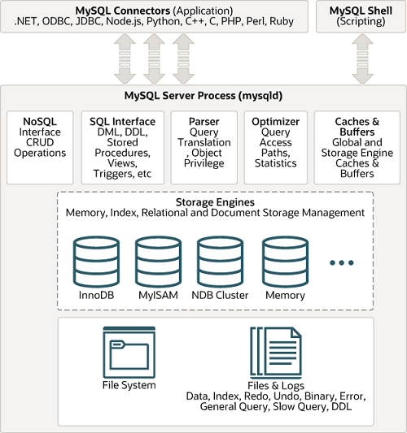

### 网络连接层

所包含的服务并不是MySQL独有的，大多数基于网络的客户端/服务器工具或服务器都有类似的服务，包括连接处理、身份验证、确保安全性的权限等。

**客户端连接器**

提供与MySQL服务器建立的支持，如命令行客户端、图形化工具、JDBC、ODBC、Native C API。

### 服务层

大多数MySQL的核心功能都在这一层，包括查询解析、分析、优化、以及所有的内置函数（例如，日期、时间、数学和加密函数），所有跨存储引擎的功能也都在这一层实现：存储过程、触发器、视图等。

**连接器**

连接器主要和身份认证和权限相关的功能相关。客户端与Server端的连接采用的是TCP协议，经过TCP握手，建立连接之后，连接器开始进行身份验证，连接器在用户登录数据库时校验账户密码，登陆后从权限表中查询该用户的所有权限等

**查询缓存**

执行查询语句的时候，会先查询缓存，被认为诟病的瓶颈，因为查询缓存失效在实际业务场景中可能会非常频繁。MySQL 5.7.2标识弃用，8.0版本中被完全移除。

**分析器**

分析器通常包括**语法解析器和预处理器**

MySQL 没有命中缓存，那么就会进入分析器，创建内部数据结构（解析树），发现SQL语句中的错误，然后对其进行各种优化，包括重写查询、决定表的读取顺序，以及选择合适的索引等。

1.   词法解析：语法解析器将输入的SQL字符串分解成一系列的词法单元（tokens），例如关键字、标识符、运算符等。     
2.   语法解析：语法解析器根据MySQL的语法规则，将这些词法单元组织成一个解析树。     
3.   预处理：预处理器检查解析树中的元素是否在数据库中有对应的实体，并验证操作的合法性。     

**优化器**

直到优化器服务层依旧不关心表使用的是什么存储引擎，但是优化器会向存储引擎询问它的一些功能、某个具体操作的成本，以及表数据的统计信息，为查询寻找优化的执行方案。执行计划（Explain）就是优化器生成的。

优化器主要有两个作用：**逻辑优化**和**物理优化**。

**执行器**

当选择了执行方案后，MySQL 就准备开始执行了，首先执行前会校验该用户有没有权限，如果没有权限，就会返回错误信息，如果有权限，就会去调用引擎的接口，返回接口执行的结果。

### 存储引擎层

存储引擎负责MySQL中数据的存储和提取。服务器通过存储引擎API进行通信。

* 存储引擎：存储引擎不会去解析SQL，而只是简单地响应服务器的请求。

MySQL 存储引擎采用的是 插件式架构 ，支持多种存储引擎

```sql
SHOW ENGINES; # 查看 MySQL 支持的所有存储引擎。
```

MySQL 5.5.5 之前，MyISAM 是 MySQL 的默认存储引擎。5.5.5 版本之后，InnoDB 是 MySQL 的默认存储引擎。每种存储引擎都有其优势和劣势。所有的存储引擎中只有 InnoDB 是事务性存储引擎，也就是说只有 InnoDB 支持事务。

### 系统文件层

负责将数据库的数据和日志存储在文件系统之上，并完成与存储引擎的交互，是文件的物理存储层。

- 日志文件

  - 错误日志 error log


  - 通用查询日志 general query log

  - 二进制日志 bin log
    记录数据修改的变更操作，用于数据恢复、主从复制
  - 重做日志 redo log
  - 回滚日志 undo log

  - 慢查询日志 slow query log
    记录耗时较久的查询语句


- 配置文件
  用于存放MySQL所有的配置信息文件，比如my.cnf、my.ini等
- 数据文件
  - db.opt 文件
    记录这个库的默认使用的字符集和校验规则。
  - frm 文件
    存储与表相关的元数据（meta）信息，包括表结构的定义信息等，每一张表都会有一个frm 文件。
  - MYD 文件
    存放 MyISAM 表的数据（data)，每张表都有一个
  - MYI 文件
    存放 MyISAM 表的索引相关信息，每张表都有一个
  - ibd文件和 IBDATA 文件
    存放 InnoDB 的数据文件（包括索引）
  - pid 文件
  - socket文件
    用户在 Unix/Linux 环境下客户端连接可以不通过TCP/IP 网络而直接使用 Unix Socket 来连接 MySQL

### MyISAM 和 InnoDB 有什么区别？

**锁支持**

MyISAM 只有表级锁，InnoDB 支持行级锁和表级锁，默认为行级锁。

**事务支持**

MyISAM 不提供事务支持。InnoDB 提供事务支持，实现了 SQL 标准定义了四个隔离级别，REPEATABLE-READ 隔离级别基于 MVCC 和 Next-Key Lock的实现下可以解决大部分幻读问题。

**MVCC支持**

InnoDB 支持 MVCC，使得行级锁不会阻塞读操作，MVCC 是对行级锁的一个升级。MyISAM连行级锁都没有，固然没有 MVCC。

**外键支持**

MyISAM 不支持，而 InnoDB 支持。一般来说不建议在实际生产项目中使用外键的，在业务代码中进行约束即可！

**Crash Safe 支持**

MyISAM 不支持，而 InnoDB 支持。数据库异常崩溃后，重新启动的安全恢复依赖于 `redo log` 。

**索引实现**

MyISAM 引擎和 InnoDB 引擎都是使用 B+Tree 作为索引结构，但是两者的实现方式不太一样。

 MyISAM 引擎的索引文件和数据文件是分离的。InnoDB 引擎中，其数据文件本身就是索引文件，表数据文件本身就是按 B+Tree 组织的一个索引结构，树的叶节点 data 域保存了完整的数据记录。

**性能**

InnoDB 的性能比 MyISAM 更强大。

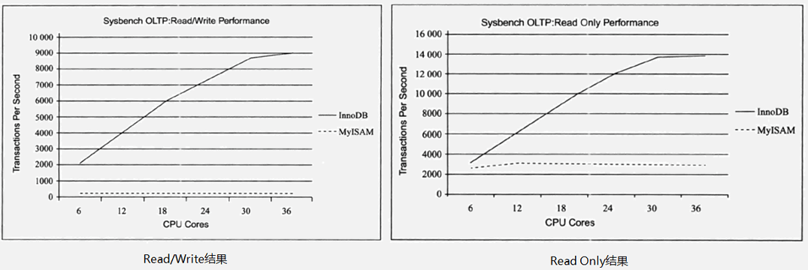


## SQL语句的执行过程

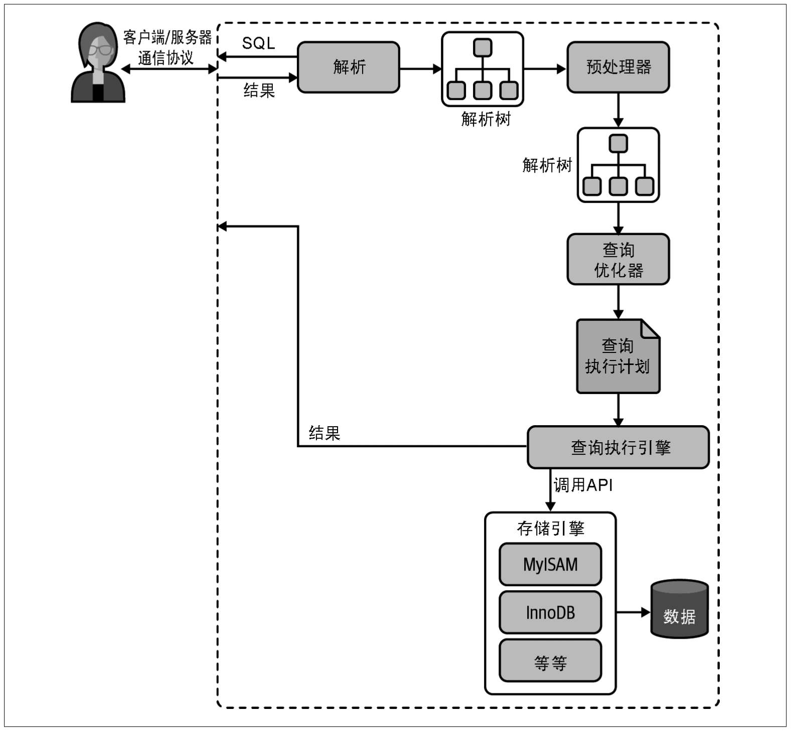

### 查询语句

在MySQL服务器拿到查询请求之前，连接器已经为用户进行身份认证并获取其权限。

1. 客户端发送如下查询一条SQL查询语句。

```sql
select * from tb_student  A where A.age='18' and A.name=' 张三 ';
```

2. 在 MySQL8.0 版本以前，会先查询缓存，以这条 SQL 语句为 key 在内存中查询是否有结果，如果有直接缓存，返回给客户端，如果没有，执行下一步。

3. MySQL服务器程序首先需要对这个字符串做分析，判断请求的语法是否正确，然后从字符串中将要查询的表、列和各种查询条件都提取出来，本质上是对一个SQL语句编译的过程，涉及**词法解析、语法分析、预处理器**等。
   1. 分析器进行词法分析，提取 SQL 语句的关键元素，分割为一个个token，并生成一棵对应的“解析树”。
   2. 分析器进行语法分析，判断这个 SQL 语句是否有语法错误，比如关键词是否正确、关键字顺序是否正确等等。
   3. 分析器（预处理器）会进一步检查“解析树”，检查语句中的实体（如表、列）是否在数据库中存在，然后还会检查用户对实体是否有操作权限。

4. 解析树被认为是合法后，优化器会将其转化成执行计划，优化器的作用就是找到这其中最好的执行方案。MySQL使用基于成本的优化器（CBO），它将尝试预测一个查询使用某种执行计划时的成本，并选择其中成本最小的一个。

   * 逻辑优化：直接对解析树进行分析，通过一些简单的代数变换对SQL语句进行等价变换。逻辑优化属于语法层级上的静态优化，不依赖于语句中特别的数值，可以看作是一种“编译时优化”。

   * 物理优化：和查询的上下文有关，需要在每次查询的时候都重新评估，因此需要获取存储引擎中提供的统计信息来评估成本，具有动态的性质，可以看作是一种“运行时优化”，物理优化很好的体现了 CBO 的哲学。

```sql
# 查看上一次查询的成本
show status like 'Last_query_cost';
```

> 基于成本的优化器（CBO），通过计算不同执行计划的预估成本（Cost），并选择成本最低的计划。
>
> 基于规则的优化器（RBO），是预先在优化器里嵌入规则（经验或被证明已经是有效的方式），判断SQL语句符合哪种规则就按照对应的规则来制定执行计划。
>
> 现代数据库（包括MySQL）的优化器都是基于成本的优化器（Cost-Based Optimizer, CBO）。

5. 根据优化器生成的执行计划，执行引擎调用存储引擎的API来执行查询。

6. 将结果返回给客户端。

### 更新语句

在MySQL服务器拿到查询请求之前，连接器已经为用户进行身份认证并获取其权限。

接着客户端发送如下更新请求。

```sql
update tb_student A set A.age='19' where A.name=' 张三 ';
```

以下结合了MySQL事务机制、复制机制和备份恢复机制一起讲解

1. 不会走查询缓存，因为查询缓存的设计规则就是只服务于查询类语句。
2. 开启事务，把 age 改为 19，然后调用引擎 API 接口，写入这一行数据，InnoDB 引擎把数据保存在内存中，同时记录 redo log，此时 redo log 进入 prepare 状态，然后告诉执行器，执行完成了，随时可以提交。
3. 执行器收到通知后记录 binlog，然后清空该表的查询缓存。此时清空能保证后续的 SELECT 不会读到旧缓存 —— 因为事务马上就要最终提交，数据即将变成最新状态，缓存失效的时机刚好匹配数据的实际更新。
4. 执行器调用引擎接口 ，提交 redo log 为 commit 状态。
5. 更新完成

> binlog 是复制机制的日志文件，复制解决的基本问题是让一台服务器的数据与其他服务器保持同步，任何数据修改和数据结构变更的事件都会被写入binlog 中，副本服务器从源服务器上的日志文件中读取这些事件并在本地重放执行，从而保证了 MySQL 集群架构的数据一致性。
>
> redo log 是 InnoDB 独有的崩溃安全机制 XtraBackup 的重做日志。XtraBackup 使得InnoDB 引擎拥有其他引擎没有的 crash-safe 的能力（即使数据库发生异常重启，之前提交的记录几乎不会丢失的崩溃恢复能力)。
>
> 由于 binlog 和 redo log 的写入时机不一样，redo log 在存储引擎层中事务中途不断写入，而binlog 在事务提交后回到服务层才写入，在这两个写入时间节点之间发生异常重启将会导致集群数据的不一致。因此 redo log 引入了 `prepare` 和 `commit` 两阶段提交，如果 redo log 只是 prepare 状态，这个时候就会去判断 binlog 是否完整，如果完整就提交 redo log, 不完整就回滚事务。

## MySQL 并发控制

无论何时，只要有多个查询需要同时修改数据，就会产生并发问题。

### 并发控制思想

并发控制一般有两种思想指导，就是常提到的“悲观锁”和"乐观锁"，但都不是一种实际的锁，而是并发控制的思想：

**悲观并发控制（Pessimistic Concurrency Control）**

悲观并发控制对于数据被修改持悲观的态度，认为数据被外界访问时，必然会产生冲突，所以在数据处理的过程中都采用加锁的方式来保证对资源的独占。

数据库应用：

* 数据库的锁机制其实都是基于悲观并发控制的观点进行实现的，而且按照实际使用情况，数据库的锁又可以分为许多种类。

* 使用锁机制阻止一个事务以影响其他用户的方式来修改数据。如果一个事务执行的操作读某行数据应用了锁，那只有当这个事务把锁释放，其他事务才能够执行与该锁冲突的操作。

优点：保守策略保证了数据获取和修改都是有序进行的。

缺点：可能面临锁冲突甚至死锁的问题；悲观并发控制增加了系统的额外开销，减低系统效率，降低系统并行性。

**乐观并发控制（Optimistic Concurrency Control）**

乐观并发控制对数据修改持乐观态度，认为即使在并发环境中，外界对数据的操作一般是不会造成冲突，所以并不会去加锁，而是在提交数据更新之前，每个事务会先检查在该事务读取数据后，有没有其他事务又修改了该数据，如果有则返回冲突信息，选择重试或回滚。乐观锁没有用到实际的锁，但是能产生加锁的效果。最常见的实现算法——CAS（比较与交换，Compare and swap）。

数据库应用：MySQL 本身没有内置像悲观锁（`SELECT ... FOR UPDATE`）那样的乐观锁机制。但开发者可以通过在应用层面利用一些特定的SQL技巧，非常方便地实现乐观锁的并发控制逻辑。

优点：没有用到锁，不会出现死锁问题，适用于读多写少的并发场景。

缺点：写多读少的并发场景下会出现很多的写冲突，因为数据写入要多次等待重试，导致开销上升；业务逻辑实现更为复杂；且无法避免第三方绕过系统逻辑对数据库进行修改；若数据库自行实现乐观锁，大量写冲突可能导致事务的连续多次失败。

**多版本并发控制（Multiversion concurrency control）**

定义：简称 MVCC。前两种并发控制思想都是为了解决**写冲突**，实现事务的可串行化，两者区别在于对写冲突的乐观程度不同。而MVCC的核心目的是为了在保证数据一致性和一定隔离级别的前提下，在锁机制以外高效地处理**读写冲突**，从而大幅提升数据库的并发性能。MVCC是通过在每个数据行上维护多个版本的数据**快照**来实现的。

数据库应用：

* MVCC是数据库管理系统常用的一种并发控制，也用于程序设计语言实现事务内存。
* 数据库的悲观锁基于提升并发性能的考虑，一般都同时实现了多版本并发控制，它在很多情况下避免了加锁操作，因此开销更低。
* MVCC工作没有统一的标准，存储引擎各自的实现机制不尽相同，基本原理是当一个事务要对数据库中的数据进行修改时，MVCC 会为该事务创建一个数据快照。

优点：读写不冲突；减少死锁；并发极大提升；

### 锁的模式

处理并发读/写访问的系统通常实现一个由两种锁类型组成的锁系统。这两种锁通常被称为共享锁（Shared Lock）和排他锁（Exclusive Lock），也叫读锁（Read Lock）和写锁（Write Lock）。

共享锁（S锁）：资源上的是共享的，或者说是相互不阻塞的。多个客户端可以同时读取同一个资源而互不干扰。

排他锁（X锁）：允许获取排它锁的事务读取和更新数据，阻止其他事务取得相同的数据集共享读锁和排它写锁，直到数据的排他锁被释放。

### 锁的粒度

大多数商业数据库系统没有提供太多的选择，一般都是在表中施加行级锁（row level lock），为了在锁比较多的情况下尽可能地提供更好的性能，锁的实现方式非常复杂。

而MySQL则提供了多种选择。每种MySQL存储引擎都可以实现自己的锁策略和锁粒度。

* 表级锁（Table Lock）：MySQL中最基本也是开销最小的锁策略。直接给整个表添加锁。
  * 锁定粒度大，锁冲突率高，并发度低。
  * 开销小，加锁快；
  * 不会出现死锁；
* 行级锁（Row Lock）：行级锁是在存储引擎而不是服务器中实现的。给指定的行添加锁。
  * 锁定粒度小，锁冲突率低，并发度高。
  * 开销大；加锁慢；
  * 会出现死锁
* 页级锁（Page Lock）：页级锁的颗粒度介于行级锁与表级锁之间。页级锁主要应用于 BDB 存储引擎。

**意向锁（Intent Lock）**

在InnoDB中，意向锁提供了多重粒度锁定的支持，它允许行锁和表锁并存。如果需要用到表锁的话，一行一行遍历记录是否有行锁肯定是不行，性能太差。

意向锁是一种特殊的表级锁，表示事务接下来要获取什么级别的锁，包括意向共享锁（IS锁）和意向排他锁（IX锁）。事务获取某些记录的S锁就要先获取该表的IS锁，获取某些记录的X锁就要先获取该表的IX锁，用于帮助其他事务快速判断表里是否有行锁，以便了解是否需要等待。

### 行锁的实现算法

* 记录锁（Record Lock）：基于索引记录对确定的记录上锁。

  * 记录锁是依附于索引而存在的，而不是锁定行。
  * 根据情况它可以是共享锁、排他锁。
  * 一般在使用主键或者唯一索引进行查找时体现。

  ```sql
  select * from table1 where id=5 for update; -- 会在 id=5 的索引记录上加 X 锁
  select * from table1 where id=5 lock in share mode; -- 会在 id=5 的索引记录上加 S 锁
  select * from table1 where id=5; -- 不会加任何锁
  update,delete ... where
  ```

* 间隙锁（Gap Lock）：对行记录之间的间隙加锁，而不是锁定记录本身。

  * 间隙锁也是依附于索引而存在的。
  * 锁定的是一个开区间，左开右闭
  * 间隙锁是Innodb 在 RR(可重复读) 隔离级别 下为了解决幻读问题时引入的锁机制。
  * 通常在不使用唯一索引进行范围查找时出现。

  ```sql
  -- 表数据有 id = 1,3,5
  select * from table1 where id>3 and id<5 for update; -- 会锁住 (3,5) 范围, 防止插入4
  ```

* 临键锁（Next-key Lock）：等于记录锁+间隙锁。

  * 锁定的是一个半开区间

  ```sql
  -- 表数据有 id = 1,3,5
  select * from table1 where id>3 and id<=5 for update; -- 会锁住 (3,5] 范围
  ```


## 数据库事务

### 含义

事务就是一组SQL语句，作为一个工作单元以原子方式进行处理，如果其中有任何一条语句因为崩溃或其他原因无法执行，那么整组语句都不执行。也就是说，作为事务的一组SQL语句，要么全部执行成功，要么全部执行失败。

### 经典例子：银行转账

```
1. 确保支票账户的余额高于200美元。
2. 从支票账户的余额中减去200美元。
3. 在储蓄账户的余额中增加200美元。
以上三步操作必须打包在一个事务中，某一步失败，可能会出现不符合银行的预期，必须回滚至原始状态。
```

### 基本原理

MySQL允许将事务统一进行管理（存储引擎innodb），将用户所做的操作，暂时保存起来（内存和事务日志），不直接放到数据表（更新），等到用户确认结果之后再进行操作（持久化到磁盘）。

### 特点

要成为事务，必须通过通过严格的ACID测试。ACID代表原子性（atomicity）、一致性（consistency）、隔离性（isolation）和持久性（durability），就是事务的四大特性。

* 原子性：要么都执行，要么都回滚
* 一致性：保证数据的状态操作前和操作后保持一致
* 隔离性：多个事务同时操作相同数据库的同一个数据时，一个事务的执行不受另外一个事务的干扰
* 持久性：一个事务一旦提交，则数据将持久化到本地，除非其他事务对其进行修改

> 商业数据库为了并发性，都对隔离性区分了隔离级别（isolation level），因此数据库的事务具有隔离性是“通常来说”。
>
> 持久性也存在着级别之分，一般不会有100%的永久保障，通常依赖于强大的持久性策略和备份恢复机制。

### 事务的分类

事务通常是自动提交，也可以手动提交

```sql
set autocommit = 1; # 开启自动提交（默认）
set autocommit = 0; # 开启手动提交
```

在`set autocommit = 1;` 的情况下，事务分为隐式事务和显式事务

隐式事务，没有明显的开启和结束事务的标志。单个语句被隐式包装在一个事务执行后立即提交。

```sql
# 比如insert、update、delete语句本身就是一个事务
```


显式事务，具有明显的开启和结束事务的标志

```sql
start transaction; # 必须
##
# 编写事务的一组逻辑操作单元（多条sql语句） insert、update、delete
##
commit;  或 rollback;
```

```sql
begin 或 start transaction; # 必须
savepoint `s0`; 
##
# 编写事务的一组逻辑操作单元（多条sql语句） insert、update、delete
##
savepoint `s1`; 
##
# 编写事务的一组逻辑操作单元（多条sql语句） insert、update、delete
##
ROLLBACK TO SAVEPOINT s1; 
COMMIT;

或 

COMMIT TO  SAVEPOINT s1
```

在`set autocommit = 0;`的情况下， 事务都是显式的，此时开启事务的标志不是必须的，但是必须要有结束事务的标志。

### 事务的并发问题

当多个事务同时操作同一个数据库的相同数据时会发生的问题

* 脏读：读取未提交的数据
* 不可重复读：同一事务中两次执行相同查询语句，另外一个事务提交了修改，可能会看到不同的数据结果。
* 幻读：一个事务读取某个范围内的记录时，另外一个事务又在该范围内插入了新的记录，该事务重新读取时，会产生幻行。

并发控制产生的问题：

* 死锁：死锁是指两个或多个事务相互持有和请求相同资源上的锁，产生了循环依赖。可能是因为真正的数据冲突，也有可能是因为存储引擎的实现方式。
  * 解决1：检测到循环依赖后会立即返回一个错误信息并将持有最少行级排他锁的事务回滚。（InnoDB的处理方式）
  * 解决2：超过锁等待超时的时间限制后直接终止查询。（不太好）

### 事务的隔离级别

ANSI SQL标准定义了4种隔离级别。较低的隔离级别通常允许更高的并发性，开销更低，但是会产生较多并发问题。

| 级别                         | 定义                                                         | 利弊                                                         |
| ---------------------------- | ------------------------------------------------------------ | ------------------------------------------------------------ |
| Read Uncommitted（读未提交） | 在事务中可以查看其他事务中还没有提交的修改                   | 会导致脏读、不可重复读和幻读等问题                           |
| Read Committed（读已提交）   | 允许读取并发事务已经提交的数据。符合隔离性的简单定义，是大多数数据库系统的默认隔离级别 | 可以阻止脏读问题，但是不可重复读和幻读仍有可能发生。         |
| Repeatable Read（可重复读）  | 事务内对同一字段的多次读取结果都是一致的。是MySQL InnoDB 存储引擎的默认隔离级别。 | 可以阻止脏读和不可重复读问题。InnoDB 在此级别下通过 MVCC（多版本并发控制） 和 Next-Key Locks（间隙锁+行锁） 机制，在很大程度上解决了幻读问题。不过在写密集型且并发冲突较高的场景下，RR 的间隙锁机制可能会比 RC 带来更多的锁等待。 |
| Serializable（可串行化）     | 强制事务按序执行，不同事务之间不可能产生冲突。最高的隔离级别，完全服从 ACID 的隔离级别。 | 可以阻止脏读、不可重复读和幻读问题。为每个读的数据行上锁，会导致大量的超时和锁竞争，实际应用中很少用。但在使用分布式事务时，InnoDB 存储引擎的事务隔离级别必须设置为 SERIALIZABLE。 |

设置隔离级别：

```sql
set session|global  transaction isolation level 隔离级别名;
```

查看隔离级别：

```sql
# MySQL 8.0 之前
SELECT @@tx_isolation;
# MySQL 8.0 之后
SELECT @@transaction_isolation;
```

### InnoDB 的 Repeatable Read 对幻读处理

标准的 SQL 隔离级别定义里，REPEATABLE READ 是无法防止幻读的。但 InnoDB 的实现通过以下两种读机制很大程度上避免了幻读：

**快照读 (Snapshot Read)**：普通的 SELECT 语句，通过 **MVCC** 机制实现。事务启动时创建一个数据快照，后续的快照读都读取这个版本的数据，从而避免了看到其他事务新插入的行（幻读）或修改的行（不可重复读）。如果是 READ COMMITTED 则事务中的每次查询（SELECT）都创建一个数据快照，就能看到其他事务最近提交的修改。

**当前读 (Current Read)**：也称为锁定读，像 `SELECT ... FOR UPDATE`, `SELECT ... LOCK IN SHARE MODE`, `INSERT`, `UPDATE`, `DELETE` 这些操作。InnoDB 使用 Next-Key Lock 来锁定扫描到的索引记录及其间的范围（间隙），防止其他事务在这个范围内插入新的记录，从而避免幻读。Next-Key Lock 是记录锁（Record Lock）和间隙锁（Gap Lock）的组合。

假如要彻底解决幻读，要么使用 Serializable 隔离级别，要么在 RR 级别中完全使用使用快照读（无锁查询），如果在高并发场景中必须加锁，应在事务开始时立即加锁，这将引入间隙锁，有效地避免幻读。

### Undo Log

undo log 属于逻辑日志，用于记录数据修改前的信息，SELECT 不需要记录。

所有Undo日志写入也都会写入Redo日志，因为Undo日志写入是服务器崩溃恢复过程的一部分。

**功能**

提供数据回滚-原子性：每一个事务对数据的修改都会被记录到 undo log ，当事务回滚时或者数据库崩溃时，MySQL 可以利用 undo log 将数据恢复到事务开始之前的状态。

多版本并发控制(MVCC)-隔离性：当用户读取一行记录时，若该记录已经被其他事务占用，当前事务可以通过Undo Log读取之前的行版本信息，以此实现非锁定读取。

## MVCC（多版本并发控制）

### 定义

[并发控制思想 - MVCC](#并发控制思想)

### 实现

MVCC 通过创建数据的多个版本和使用快照读取来实现并发控制。读操作使用旧版本数据的快照，写操作创建新版本，并确保原始版本仍然可用。这样，不同的事务可以在一定程度上并发执行，而不会相互干扰，从而提高了数据库的并发性能和数据一致性。

**读操作（SELECT）**

当一个事务执行读操作时，它会使用快照读取。快照读取是基于事务开始时数据库中的状态创建的，事务会选择不晚于其开始时间的最新版本，确保事务只读取在它开始之前已经存在的数据，因此事务不会读取其他事务尚未提交的修改。

**写操作（INSERT、UPDATE、DELETE）**

当一个事务执行写操作时，它会为修改前的数据生成一个新的数据版本，并将修改后的数据写入数据库。新版本的数据会带有当前事务的版本号。原始版本的数据仍然存在可供其他事务使用快照读取，这保证其他事务的读取不受当前事务写操作的影响

**事务提交和回滚**

- 当一个事务提交时，它所做的修改将成为数据库的最新版本，并且对其他事务可见。
- 当一个事务回滚时，它所做的修改将被撤销，对其他事务不可见。

**版本回收**

为了防止数据库中的版本无限增长，MVCC 会定期进行版本的回收。

### 对隔离级别的兼容性

MVCC仅适用于REPEATABLE READ和READ COMMITTED隔离级别。MVCC 是实现 RR 和 RC 的基石。

READ UNCOMMITTED 与 MVCC 不兼容，是因为查询不会读取适合其事务版本的行版本，而是不管怎样都读最新版本。（用不到数据版本）

SERIALIZABLE 与 MVCC也不兼容，是因为读取会锁定它们返回的每一行。（必须使用锁）

### 一致性非锁定读

Consistent Nonlocking Read，简称CNR，是指在数据库中读取数据时，不需要等待数据行上的锁释放，而是读取行的一个快照数据，也叫作**快照读** (snapshot read)。这种方式就是通过行 MVCC 来实现，确保读取到的数据是一致的。

在 RC 和 RR 两种隔离级别下 InnoDB 的 SELECT 操作（不包括 `select ... lock in share mode` ,`select ... for update`）使用的是一致性非锁定读，并且在 RR 下 MVCC 还避免了部分幻读（即 MVCC 解决了 RR 隔离级别下快照读时的幻读问题）。

### 锁定读

锁定读对读取到的记录加锁，读取的是数据的最新版本，因此也被称为**当前读**（current read）。

- `select ... lock in share mode`：对记录加 S 锁，其它事务也可以对其加 S 锁，如果加 x 锁则会被阻塞
- `select ... for update`、`insert`、`update`、`delete`：对记录加 X 锁，且其它事务不能加任何锁

由于锁定读每次读取的都是最新数据，这时如果两次查询中间有其它事务插入数据，就会产生幻读。所以， InnoDB 在实现 RR 时，如果执行的是当前读，则会对读取的记录使用 Next-key Lock ，来防止其它事务在间隙间插入数据。

> MVCC和间隙锁极大程度上解决了幻读问题，只有在某些特殊情况下可能发生幻读。例如在同一个事务中混用快照读和当前读操作时，可能导致幻读的发生。

### InnoDB 对 MVCC 的具体实现

MVCC 的实现依赖于：**隐藏字段、Read View、undo log**。

**隐藏字段**

在内部，InnoDB 存储引擎为每行数据添加了三个 隐藏字段：

* `DB_TRX_ID（6字节）`：表示最后一次插入或更新该行的操作的事务 id。此外，`delete` 操作在内部被视为更新，只不过会在记录头 `Record header` 中的 `deleted_flag` 字段将其标记为已删除

* `DB_ROLL_PTR（7字节）` 回滚指针，指向这条记录的上一个版本 （指向Undo 表空间中的精确位置） 。如果该行未被更新，则为空

* `DB_ROW_ID（6字节）`：隐含的自增ID（隐藏主键），如果没有设置主键且该表没有唯一非空索引时，`InnoDB` 会使用该 id 来生成聚簇索引

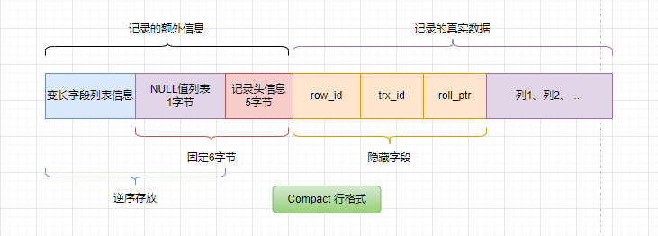

**Read View**

```c++
class ReadView {
  /* ... */
private:
  trx_id_t m_low_limit_id;      /* 创建ReadView时 出现过的最大的事务 ID+1（即待分配的事务ID）     大于等于这个 数值 的事务均不可见 */

  trx_id_t m_up_limit_id;       /* 创建ReadView时 活跃事务列表 m_ids 中最小的事务 ID    小于这个 ID 的事务均可见 */

  trx_id_t m_creator_trx_id;    /* 创建该 Read View 的事务ID */

  trx_id_t m_low_limit_no;      /* 事务 Number, 小于该 Number 的 Undo Logs 均可以被 Purge */

  ids_t m_ids;                  /* 创建ReadView时 其他未提交的活跃事务 ID 列表 */

  m_closed;                     /* 标记 Read View 是否 close */
}
```

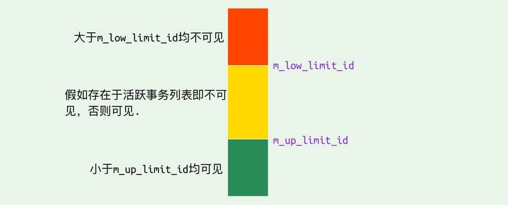

**undo log**

主要有两个作用：[功能定义](#Undo Log)

同事务或者相同事务的对同一记录的修改，会导致该记录的undo log成为一条记录版本线性表，即**版本链表**

| 当前操作 | Undo Log中记录的内容                       | 回滚时执行的操作  |
| :------- | :----------------------------------------- | :---------------- |
| `INSERT` | 本次插入的主键id和隐藏字段且回滚指针为NULL | 执行 `DELETE`     |
| `UPDATE` | 记录更新前的旧值和隐藏字段                 | 执行反向 `UPDATE` |
| `DELETE` | 被删除的整行数据和隐藏字段                 | 执行 `INSERT`     |

同事务或者相同事务的对同一记录的修改，会导致该记录的undo log 通过`DB_ROLL_PTR`回滚指针成为一条记录版本线性表，即**版本链表**。由数据记录指向最新的undo记录再指向较早的undo记录...

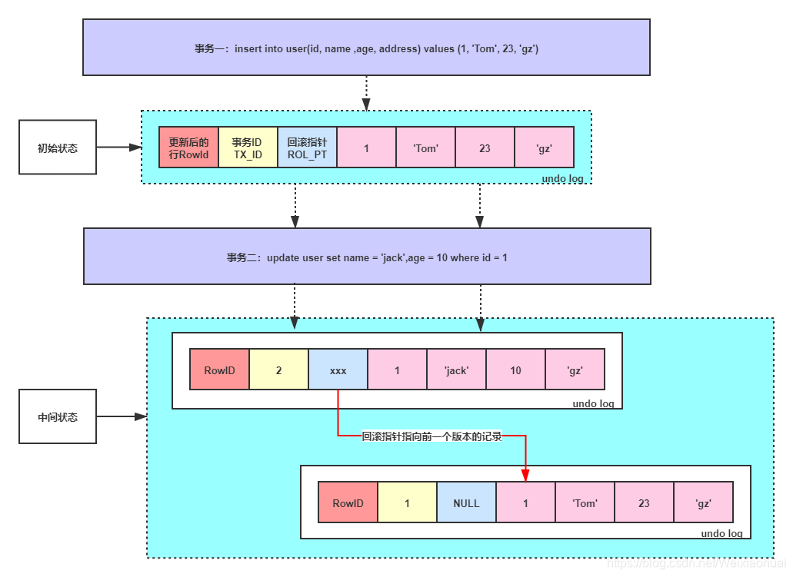

**数据可见性算法**

1. 在 RC 隔离级别下的每次 `select` 查询前都生成一个 `Read View` 快照 ；

   在 RR 隔离级别下只在事务开始第一次 `select` 数据前生成一个 `Read View` 快照。

2. 快照中保存了当前数据库系统中正处于活跃（没有 commit）的事务的 ID 号，这些事务不该被当前事务可见，即`m_ids`。

3. 事务中要读取某个记录行的时候，`InnoDB` 会将该记录行的 `DB_TRX_ID` 与 `Read View` 中的一些变量以及当前事务 ID 进行比较，判断是否满足可见性条件

   1. 如果记录 `DB_TRX_ID` =  `m_creator_trx_id`。当前事务的修改对当前事务可见。 
   2. 如果记录 `DB_TRX_ID` < `m_up_limit_id` 或 `m_ids` 为空，那么表明最新修改该行的事务在当前事务创建快照之前就提交了，所以该记录行的值对当前事务是可见的 
   3. 如果 `DB_TRX_ID` >= `m_low_limit_id`，那么表明最新修改该行的事务在当前事务创建快照之后才修改该行，所以该记录行的值对当前事务不可见。跳到步骤 5。
   4. 如果 `m_up_limit_id` <= `DB_TRX_ID` < `m_low_limit_id`，表明最新修改该行的事务在当前事务创建快照的时候可能处于“活动状态”或者“已提交状态”；所以就要对活跃事务列表 m_ids 进行查找（源码中是用的二分查找，因为是有序的）
      1. `m_ids` 中能找到 `DB_TRX_ID`，表明最新修改该行的事务修改了，但没有提交，所以该记录行的值对当前事务不可见的。跳到步骤 5
      2. `m_ids` 中找不到 `DB_TRX_ID`，表明最新修改该行的事务在“当前事务”创建快照前就已经提交了，所以该记录行的值对当前事务可见的。
   5. 在该记录行的 DB_ROLL_PTR 指针所指向的 `undo log` 取出快照记录，用快照记录的 DB_TRX_ID 跳到步骤 1 重新开始判断，直到找到满足的快照版本或返回空

### MVCC  + Next-key-Lock 防止幻读

`InnoDB`存储引擎在 RR 级别下通过 `MVCC`和 `Next-key Lock` 来解决幻读问题：

1. 执行普通 `select`，此时会以 `MVCC` 快照读的方式读取数据

在快照读的情况下，RR 隔离级别只会在事务开启后的第一次查询生成 `Read View` ，并使用至事务提交。所以在生成 `Read View` 之后其它事务所做的更新、插入记录版本对当前事务并不可见，实现了可重复读和防止快照读下的 “幻读”

2. 执行 `select...for update/lock in share mode、insert、update、delete` 等当前读

在当前读下，读取的都是最新的数据，如果其它事务有插入新的记录，并且刚好在当前事务查询范围内，就会产生幻读！InnoDB 使用 Next-key Lock 来防止这种情况。当执行当前读时，会锁定读取到的记录的同时，锁定它们的间隙，防止其它事务在查询范围内插入数据。只要我不让你插入，就不会发生幻读

## MySQL 索引数据结构

索引，在MySQL中也叫作键（key），是存储引擎用于快速找到记录的一种数据结构，**其本质可以看成是一种排序好的数据结构。**

索引在大数据量的表中，对性能的优化影响十分重要，好的索引对查询性能的提升能达到几个数量级。

常见的索引结构有：**B 树**、 **B+ 树** 、 **Hash** 和 **红黑树**。在 MySQL 中，大多数MySQL引擎都都使用了 B 树（更多的是B+树索引）作为索引结构。

### Hash 表

哈希表或称散列表，是键值对的集合，通过键(key)即可快速取出对应的值(value)，因此哈希表可以快速检索数据（接近 O(1)）。

快速取值的关键是**哈希算法**（也叫散列算法），哈希算法使得我们输入key得到散列值，由散列值快速定位元素在表中的位置。

```java
hash = hashfunc(key)
index = hash % array_size
```

**哈希冲突**问题，指不同的key定位到表中的位置相同。

* Java中的解决办法是链地址法，位置重复的元素与旧元素通过`equal()`确定唯一性后，会接到旧元素的（7前8后）面，JDK1.8 以后`HashMap`为了提高链表过长时的搜索效率，当链表过长（≥8）时，将链表转为红黑树。

* 还有一种解决方法是探测法，也叫线性寻址法，当数据经过散列函数散列之后，定位的存储位置已经被占用了，就从当前位置开始依次往后查找空闲位置来，使用这种方法一旦存满之后数组只能继续扩容，还会产生很多特殊问题需要处理。

为了减少 Hash 冲突的发生，一个好的哈希函数应该“均匀地”将数据分布在整个可能的哈希值集合中。

```java
// JDK1.8 HashMap的散列函数
static final int hash(Object key) {
        int h;
        return (key == null) ? 0 : (h = key.hashCode()) ^ (h >>> 16);
    }
```

> 散列表之所以能快速定位元素，是因为底层的数组**支持按照下标随机访问数据**的特性（或者说是依赖于一段连续的存储空间——内存（RAM）具有随机存取的特性），散列的思想就是**将任意长度的输入通过散列算法转换为固定长度的输出**，这种转换是一种压缩映射，因此会发生哈希冲突，可以说散列表就是数组的一种扩展，没有数组就没有散列表。那么，数组也可以看成一种特殊的散列表，下标就是哈希值，哈希值就是下标，其散列算法为`hash(index) = index; `，永远不会发生哈希冲突。

MySQL 没有使用哈希表作为索引的数据结构，主要是因为 Hash 索引不支持顺序和范围查询。试想，查找id小于100的数据，如果使用哈希索引，就得1-99的数据进行哈希计算来定位。

> MySQL 的 InnoDB 存储引擎虽然不直接支持常规的哈希索引，但是，InnoDB 存储引擎中存在一种特殊的“自适应哈希索引”（Adaptive Hash Index），自适应哈希索引并不是传统意义上的纯哈希索引，而是结合了 B+Tree 和哈希索引的特点，以便更好地适应实际应用中的数据访问模式和性能需求。
>
> 当InnoDB发现某些索引值被非常频繁地被访问时，它会在原有的B-tree索引之上，在内存中再构建一个哈希索引。这就让B-tree索引也具备了一些哈希索引的优势，例如，可以实现非常快速的哈希查找。

### 二叉查找树（BST）

二叉查找树（Binary Search Tree）是一种基于二叉树的数据结构

特点：

1. 左子树所有节点的值均小于根节点的值。
2. 右子树所有节点的值均大于根节点的值。
3. 左右子树也分别为二叉查找树。

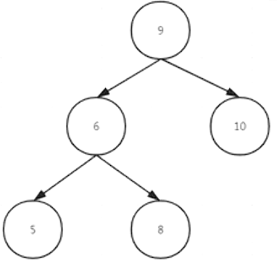

当二叉查找树是平衡的时候，也就是树的每个节点的左右子树深度相差不超过 1 的时候，查询的时间复杂度为 `O(log2(N))`，具有比较高的效率。然而，当二叉查找树不平衡时，例如在最坏情况下（有序插入节点），树会退化成线性链表（也被称为斜树），导致查询效率急剧下降，时间复杂退化为 `O(N)`。

为了避免这种情况通常使用随机化而不是有序插入建立二叉搜索树，但是在进行了多次的删除操作之后，可能会造成树向一边沉降。

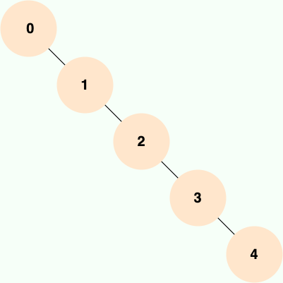

二叉查找树的性能非常依赖于它的平衡程度，这就导致其不适合作为 MySQL 底层索引的数据结构。为了解决这个问题，并提高查询效率，人们发明了多种在二叉查找树基础上的改进型数据结构，如平衡二叉树、B-Tree、B+Tree 等。

### AVL 树

AVL 树是计算机科学中最早被发明的自平衡二叉查找树，它的名称来自于发明者 G.M. Adelson-Velsky 和 E.M. Landis 的名字缩写。

AVL 树的特点是保证任何节点的左右子树高度之差不超过 1，因此也被称为高度平衡二叉树，它的查找、插入和删除在平均和最坏情况下的时间复杂度都是 O(logn)。

AVL 树采用平衡因子（Balance Factor，简写为bf）来判断树是否失衡，`结点的平衡因子 = 左子树的高度 - 右子树的高度`，所有节点的平衡因子都必须满足： `-1<=bf<=1`。

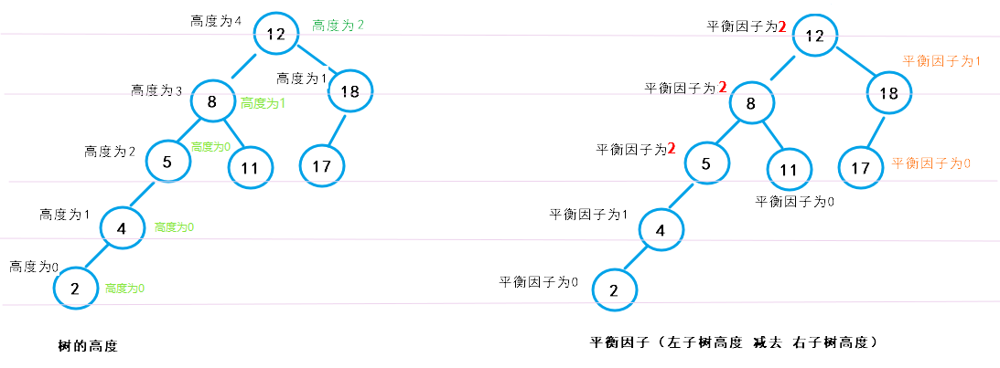

AVL 树采用了旋转操作来保持平衡。主要有四种旋转操作：LL 旋转、RR 旋转、LR 旋转和 RL 旋转。设新节点为z，父节点为p，祖父节点为g，插入节点z后有以下几种情况：

1. LL 型，g的左节点为p，p的左节点为z。以g为轴进行右单旋。
2. RR 型，g的右节点为p，p的右节点为z 。以g为轴进行左单旋。
3. LR 型，g的左节点为p，p的右节点为z。先以P为轴进行左单旋转换为 LL 型，再进行后续操作。
4. RL 型，g的右节点为p，p的左节点为z。先以P为轴进行右单旋转换为 RR 型，再进行后续操作。

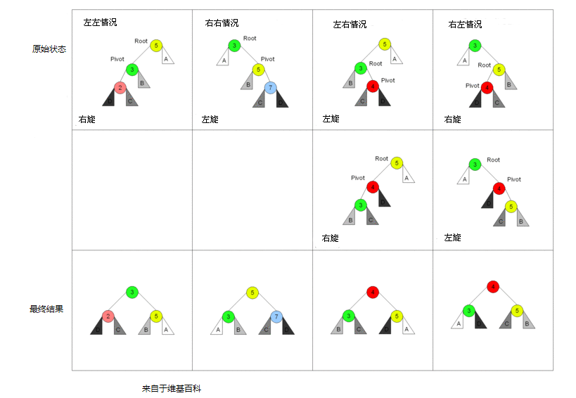

删除节点后，也可能破坏平衡。调整过程与插入类似，但可能需要在回溯路径上进行多次旋转，因为删除可能导致更高层节点不平衡。

由于 AVL 树需要频繁地进行旋转操作来保持平衡，因此会有较大的计算开销进而降低了数据库写操作的性能。并且， 在使用 AVL 树时，每个树节点仅存储一个数据，而每次进行磁盘 IO 时只能读取一个节点的数据，如果需要查询的数据分布在多个节点上，那么就需要进行多次磁盘 IO。实际应用中，AVL 树使用的并不多。

### 红黑树

红黑树是一种自平衡二叉查找树，通过在插入和删除节点时进行颜色变换和旋转操作，使得树始终保持平衡状态。

特点：

1. 每个节点非红即黑；
2. 根节点总是黑色的；
3. 每个叶子节点都是黑色的空节点（NIL 节点）；
4. 不存在两个相邻的红节点；
5. 从任意节点到它的叶子节点或空子节点的每条路径，必须包含相同数目的黑色节点（即相同的黑色高度）。

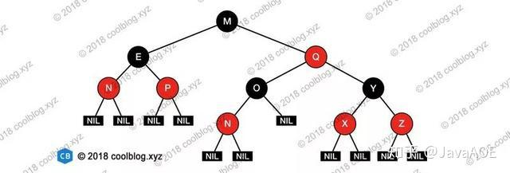

插入节点时，通常插入红色节点，如果满足不了特点4或特点2，则要进行树平衡操作——修改颜色和旋转。设新节点为z，父节点为p，祖父节点为g，叔叔节点为u，插入节点z后有以下几种情况：

1. z是根节点。不符合特点2，将其重新着色为黑色。
2. p是黑色。无需调整。
3. p是红色。不符合特点4，需要进一步看u的颜色。
   1. u是红色。将p和u变为黑色，g变为红色。（如果g的父节点也是红色，不符合特点4，需要以g为新节点继续向上调整）
   2. u不存在或是黑色。此时需要进行旋转。情况和[AVL树](#AVL 树)类似有LL 旋转、RR 旋转、LR 旋转和 RL 旋转，只是需要重新着色。

删除更复杂，因为可能破坏特点5（黑高相等）。调整中可能涉及多次旋转和变色，最终使树恢复平衡。

和 AVL 树不同的是，AVL树在平衡时，是进行一个全局的旋转变化，而红黑树在平衡时，只需进行局部的变化。同时红黑树并不追求严格的平衡，而是大致的平衡，正因如此，红黑树的查询效率稍有下降，因为红黑树的平衡性相对较弱，可能会导致树的高度较高，这可能会导致一些数据需要进行多次磁盘 IO 操作才能查询到，这也是 MySQL 没有选择红黑树的主要原因。也正因如此，红黑树的插入和删除操作效率大大提高了，因为红黑树在插入和删除节点时只需进行 O(1) 次数的旋转和变色操作，即可保持基本平衡状态，而不需要像 AVL 树一样进行 O(logn) 次数的旋转操作。

红黑树的应用还是比较广泛的，TreeMap、TreeSet 以及 JDK1.8 的 HashMap 底层都用到了红黑树。对于数据在内存中的这种情况来说，红黑树的表现是非常优异的。

### B 树 & B+ 树

上述三种以二叉树形式的数据结构如果存储在硬盘中，每一个节点只有一个数据，查找时经过一个节点就要进行一次磁盘IO，这将成为数据库系统的性能瓶颈，因此在应用中通常会把数据全部（或者分批次）加载到内存中进行使用，适合数据量不大的场景。目前大部分数据库系统及文件系统都采用 B-Tree 或其变种 B+Tree 作为索引结构。

B 树也称 B- 树，全称为 多路平衡查找树，B+ 树是 B 树的一种变体。B 树和 B+ 树中的 B 是 Balanced（平衡）的意思。B 树每一个节点存储多个数据，每个节点有多个子树，使得树的高度大大压缩，硬盘IO的次数也会减少。每次读取单个节点的多个数据，也能充分利用硬盘按扇区或块（连续多个字节）读取的特性。

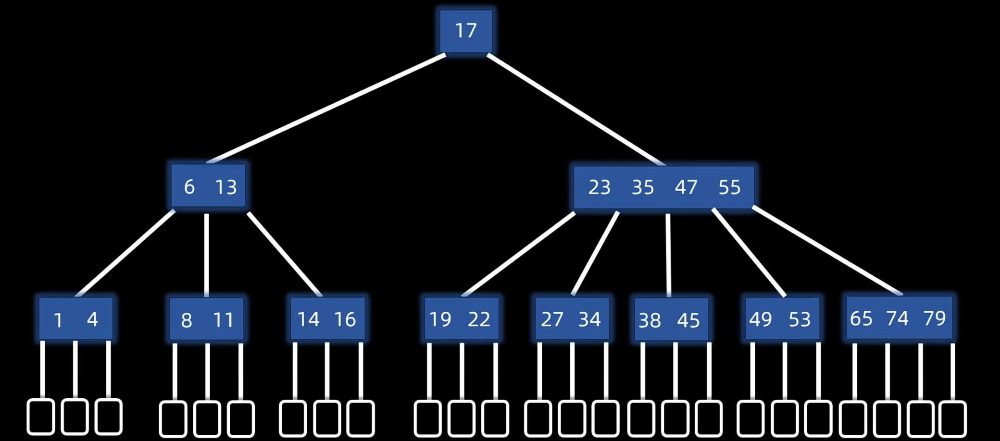

**B 树的特性**

1. 平衡。所有叶子节点（也就是内部叶子节点）都在同一层
2. 有序。任何一个节点的左子树都小于它，右子树都大于它。
3. 多路。定义一个m阶B树，表示：
   1. 一个节点最多有 `m` 个分支， `m-1` 个数据元素；
   2. 非根节点最少有 `|m/2|` 个分支，`|m/2|-1` 个数据元素；（向上取整）
   3. 根节点最少有 2 个分支，1 个数据元素；
4. 失败节点。也叫外部节点，无任何信息。当查找遍历时，无法找到该元素最终就会来到失败节点。

**B 树的查找方式**

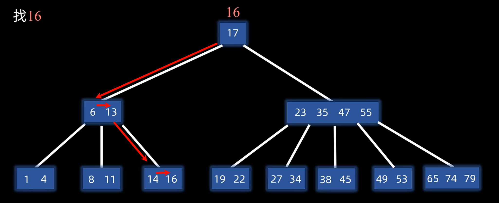

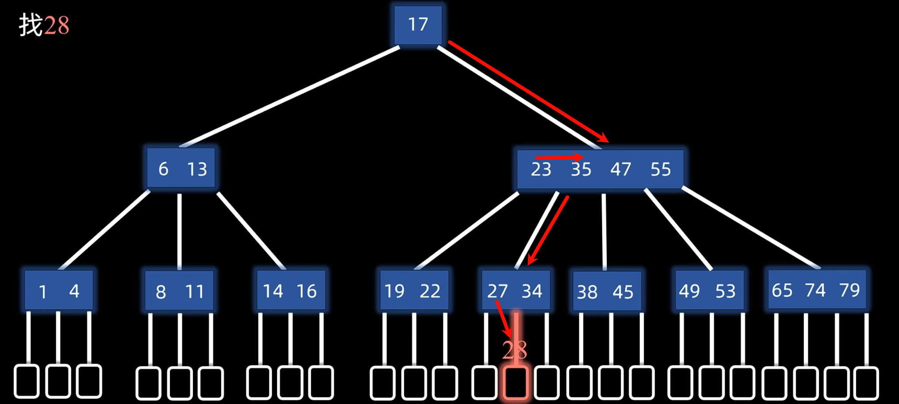

**B 树的插入方式**

1. 先查找到插入的位置。（插入位置一定在内部叶节点上）
2. 如果数据元素的个数没有上溢出，无需调整。
3. 否则中间元素`m/2`上移，两边分裂。（直到没有发生上溢为止）

**B 树的删除方式**

1. 删除非内部叶子节点的元素，就拿该元素的前继元素（小于该元素的最大元素）或后继元素（大于该元素的最小元素）替代。因此可以看成是删除内部叶子节点的元素。
2. 删除内部叶子节点的元素
3. 如果数据元素的个数没有下溢，无需调整。
4. 否则就要**向兄弟节点借取元素**或**与兄弟节点合并**。

**B 树 & B+ 树的异同**

* B 树的所有节点既存放键(key)也存放数据(data)，而 B+ 树只有叶子节点存放 key 和 data，其他内节点只存放 key。
* B 树的叶子节点都是独立的；B+ 树的叶子节点有一条引用链指向与它相邻的叶子节点。
* B 树的检索的过程相当于对范围内的每个节点的关键字做二分查找，可能还没有到达叶子节点，检索就结束了。而 B+ 树的检索效率就很稳定了，任何查找都是从根节点到叶子节点的过程，叶子节点的顺序检索很明显。
* 在 B 树中进行范围查询时，首先找到要查找的下限，然后对 B 树进行中序遍历，直到找到查找的上限；而 B+ 树的范围查询，只需要对链表进行遍历即可。

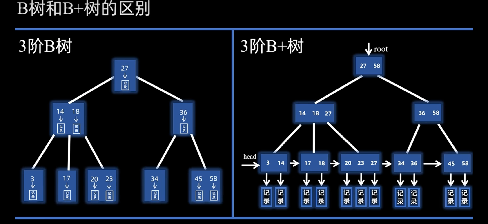


**如何理解 B+ 树**

内部的叶子节点层都是关键字，是对数据文件中记录的索引。（key -> data）其上一层，是对关键字的索引。(key2 -> key)再上一层，则是下一层索引项的索引。（key3 -> key2）如此，整个 B+ 树是一套多级索引结构。

B+tree索引能够加快数据访问的速度，这是因为有了索引，在**查询某些条件的数据**时，存储引擎不再需要进行全表扫描。从索引的根节点开始进行搜索，根节点的槽中存放了指向子节点的指针，存储引擎根据这些指针向下层查找。通过比较节点页的值和要查找的值可以找到合适的指针进入下层子节点,，这些指针实际上定义了**子节点页中值的上限和下限**。叶子节点比较特殊，它们的指针指向的是被索引的数据。（不同存储引擎的“指针”类型不同，体现为聚簇索引和非聚簇索引的区别）。

## MySQL 索引类型

### 主键索引和二级索引

#### 主键索引

数据表的主键列使用的就是主键索引（Primary Key），主键索引通过主键的值定位数据的位置。

一张数据表有只能有一个主键，并且主键不能为 null，不能重复。

**与[聚簇索引](#聚簇索引)的关系**

**InnoDB 中的主键索引属于聚簇索引。**主键索引可以看成是聚簇索引的一种实现形式。

1. 当主键随表一起定义时，InnoDB 会自动使用主键来构建聚簇索引。
2. 当没有显式定义主键时，InnoDB 会自动先检查表中是否有唯一（`UNIQUE` ）且非空（`NOT NULL`）的字段作为聚簇索引（隐式主键）。
3. 如果没有这样的列，InnoDB 将会自动创建一个 6Byte 的隐藏列`ROWID`作为聚簇索引。

#### 二级索引

二级索引（Secondary Index）的叶子节点存储的数据是主键的值，也就是说，通过二级索引可以定位主键的位置，二级索引又称为辅助索引/非主键索引。

**InnoDB 中的二级索引属于[非聚簇索引](#非聚簇索引)，**因为其存储的主键的值就是指向数据行的“快捷方式”，但反过来说“非聚簇索引就是二级索引”不成立。

* **唯一索引（Unique Key）**：唯一索引也是一种约束。唯一索引的属性列不能出现重复的数据，但是允许数据为 NULL，一张表允许创建多个唯一索引。 建立唯一索引的目的大部分时候都是为了该属性列的数据的唯一性，而不是为了查询效率。
* **普通索引（Index）**：普通索引的唯一作用就是为了快速查询数据。一张表允许创建多个普通索引，并允许数据重复和 NULL。
* **前缀索引（Prefix）**：前缀索引只适用于字符串类型的数据。前缀索引是对文本的前几个字符创建索引，相比普通索引建立的数据更小，因为只取前几个字符。
* **全文索引（Full Text）**：全文索引主要是为了检索大文本数据中的关键字的信息，是目前搜索引擎数据库使用的一种技术。Mysql5.6 之前只有 MyISAM 引擎支持全文索引，5.6 之后 InnoDB 也支持了全文索引。

### 聚簇索引和非聚簇索引

#### 聚簇索引

聚簇索引/聚集索引（Clustered Index）即索引结构和数据一起存放的索引，并不是一种单独的索引类型。数据只有一份，不能存放在两个不同的地方，所以一个表只能有一个聚簇索引。

在 MySQL 中，InnoDB 引擎，主键索引就是使用的聚簇索引，表的 `.ibd`文件就包含了该表的索引和数据，索引树（B+ 树）的每个非叶子节点存储索引项（主键），叶子节点存储**索引项（主键）和对应的行数据**。

**优点**

* 查询速度非常快：聚簇索引的查询速度非常的快，因为整个 B+ 树本身就是一颗多叉平衡树，叶子节点也都是有序的，定位到索引的节点，就相当于定位到了数据。相比于非聚簇索引， 聚簇索引少了一次读取数据的 IO 操作。
* 对排序查找和范围查找优化：聚簇索引对于主键的排序查找和范围查找速度非常快。

**缺点**

- 依赖于有序的数据：因为 B+ 树是多路平衡树，如果索引的数据不是有序的，那么就需要在插入时排序，如果数据是整型还好，否则类似于字符串或 UUID 这种又长又难比较的数据，插入或查找的速度肯定比较慢。
- 更新代价大：如果对索引列的数据被修改时，那么对应的索引也将会被修改，而且聚簇索引的叶子节点还存放着数据，修改代价肯定是较大的，所以对于主键索引来说，主键一般都是不可被修改的。

#### 非聚簇索引

非聚簇索引（Non-Clustered Index）即索引结构和数据分开存放的索引，并不是一种单独的索引类型。

在 MySQL 中，MyISAM 引擎不管主键还是非主键，使用的都是非聚簇索引，`.MYD`文件包含表的数据，`.MYI`是文件包含表的索引。索引树（B+ 树）的每个非叶子节点存储索引项，叶子节点存储了**索引项和指向行数据的指针**。

InnoDB 的非聚簇索引（二级索引） B+ 树叶子节点存储了**索引项和主键**。InnoDB 使用非聚簇索引进行查询时，数据库会先找到对应的主键值，然后再通过主键索引来定位和检索完整的行数据。这个过程被称为**“回表”**。

**优点**

更新代价比聚簇索引要小。非聚簇索引的更新代价就没有聚簇索引那么大了，非聚簇索引的叶子节点是不存放数据的。

**缺点**

* 依赖于有序的数据：跟聚簇索引一样，非聚簇索引也依赖于有序的数据。
* 可能会二次查询（回表）：这应该是非聚簇索引最大的缺点了。当查到索引对应的指针或主键后，可能还需要根据指针或主键再到数据文件或表中查询。

### 覆盖索引 

如果一个索引包含（或者说覆盖）所有需要查询的字段 (where、select、order by、group by 包含的字段) 的值，我们就称之为 **覆盖索引（Covering Index）**。

因为无法同时把数据行存放在两个不同的地方，所以一个表只能有一个聚簇索引，覆盖索引可以模拟多个聚簇索引的情况。假如需要查询的字段正好是索引的字段，那么直接根据该索引，就可以查到数据了，而无需回表查询。

```sql
ALTER TABLE `cus_order` ADD INDEX id_score(score);
EXPLAIN SELECT `score`,`name` FROM `cus_order` ORDER BY `score` DESC; -- Using filesort
EXPLAIN SELECT `score` FROM `cus_order` ORDER BY `score` DESC; -- Using index
```

### 联合索引

```sql
-- 创建 1 个联合索引相当于创建了 2 个索引 
ALTER TABLE `cus_order` ADD INDEX id_score_name(score, name); 
```

### 最左前缀匹配原则

最左前缀匹配原则指的是在使用联合索引时，MySQL 会根据索引中的字段顺序，从左到右依次匹配查询条件中的字段。如果查询条件与索引中的最左侧字段相匹配，那么 MySQL 就会使用索引来过滤数据，这样可以提高查询效率。

最左匹配原则会一直向右匹配，直到遇到范围查询（如 >、<）为止。范围列可以用到索引，但是范围列后面的列无法用到索引。

```sql
# 建立索引尽量将区分度高的字段放在最左边
# 可以命中索引
SELECT * FROM cus_order WHERE score = 9999;
SELECT * FROM cus_order WHERE score = 9999 AND name = 'user2';
SELECT * FROM cus_order WHERE name = 'user2' AND score = 9999; -- （有MySQL查询优化器）
# 无法命中索引
SELECT * FROM cus_order WHERE name = 'user2';
```

索引的最左匹配原则是基于 B+ 树的结构特性。在 B+ 树中，索引的每一层节点都按照索引列的顺序排列。当查询条件从索引的最左边的列开始时，数据库可以沿着索引树的路径快速定位到目标数据。如果查询条件不从最左边的列开始，数据库将无法利用索引树的结构特性，导致索引失效。

### 索引下推

**索引下推（Index Condition Pushdown，简称 ICP）** 是 MySQL 5.6 版本中提供的一项索引优化功能，它允许存储引擎在索引遍历过程中，执行部分 `WHERE` 字句的判断条件，直接过滤掉不满足条件的记录，从而减少回表次数，提高查询效率。

```sql
# 该user表已建立了联合索引 `idx_username_birthdate` (`zipcode`,`birthdate`) )
# 查询 zipcode 为 431200 且生日在 3 月的用户
SELECT * FROM user WHERE zipcode = '431200' AND MONTH(birthdate) = 3;
```

没有索引下推之前，即使 `zipcode` 字段利用索引可以帮助我们快速定位到 `zipcode = '431200'` 的用户，但我们仍然需要对每一个找到的用户进行回表操作，获取完整的用户数据，再去判断 `MONTH(birthdate) = 3`。

有了索引下推之后，存储引擎会在使用 `zipcode` 字段索引查找 `zipcode = '431200'` 的用户时，同时判断 `MONTH(birthdate) = 3`。这样，只有同时满足条件的记录才会被返回，减少了回表次数。

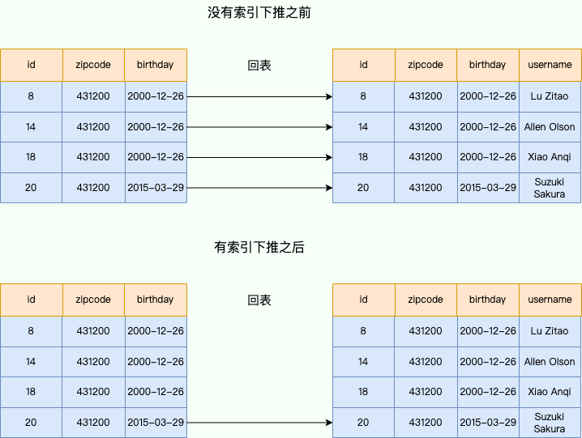

索引下推的 **下推** 其实就是指将部分上层（Server 层）负责的事情，交给了下层（存储引擎层）去处理。

1. 存储引擎层先根据 `zipcode` 索引字段找到所有 `zipcode = '431200'` 的用户的主键 ID
2. （如果开启了索引下推则省略）做回表查询，获取完整的用户数据，全部交给 Server 层。
3. 存储引擎层判断 `MONTH(birthdate) = 3`，筛选出符合条件的主键 ID
4. 做回表查询，获取完整的用户数据，全部交给 Server 层。

可以看出，除了可以**减少回表次数**之外，索引下推还可以**减少存储引擎层和 Server 层的数据传输量**。

### 索引使用建议

**不建索引**

* 索引字段的数据应该尽量不为 NULL。因为对于数据为 NULL 的字段，数据库较难优化，建议使用 0、1、true、false 这样语义较为清晰的短值或短字符作为替代。
* 被频繁更新的字段应该慎重建立索引。虽然索引能带来查询上的效率，但是维护索引的成本也是不小的。 

**建立索引**

* 被作为条件查询的字段。被作为 WHERE 条件查询的字段应考虑建立索引。
* 频繁需要排序的字段。查询可以利用索引的排序，加快排序查询时间。
* 被经常频繁用于连接的字段。考虑建立索引，提高多表连接查询的效率。

**索引失效的原因**

1. SQL 写法未体现 B+Tree 有序性
   1. 违背最左前缀原则：跳过联合索引前导列，或遇到范围查询（如 >、<、BETWEEN、LIKE "abc%"）导致后续列中断精确定位，降级为范围扫描加过滤。
   2. 对索引列进行加工：在 WHERE 左侧对索引列进行数学计算或应用函数（如 `ABS()`、`DATE()`），导致原始数据发生逻辑改变，在索引树中呈现无序状态。
   3. **隐式类型转换**（同上，但隐蔽且致命）：当“字符串类型的列”去比较“数字类型的值”时，MySQL 会默认在列上套用转换函数，直接破坏树的有序性。
   4. LIKE 模糊查询前置通配符：如 LIKE "%abc"，前缀字符的不确定性使得优化器无法锁定扫描区间的起始点。
   5. ORDER BY 排序陷阱：排序列未命中索引、排序方向与索引结构不一致等触发额外的内存或磁盘排序（`Using filesort`即表示触发了排序）。
   6. `NOT IN` 列表。通常全表扫描，因需遍历整个 B+ 树证明"不在集合中"。
2. 优化器的成本决策（基于 I/O 成本妥协）
   1. 无脑使用 `SELECT *`。即使 `where` 命中了索引，由于查询的字段不在索引树中，即不是覆盖索引，就必须拿主键回聚簇索引查找行数据（回表）。**优化器会对比“索引扫描 + 回表”与“直接全表扫描”的成本。**如果查询结果占总数据量的比例较高（通常阈值在 20%~30%），优化器会认为全表扫描的顺序 IO 效率高于回表的随机 IO，从而主动放弃索引。
   2. `OR` 条件导致全表扫描：只要 `OR` 连接的任意一侧条件没有对应索引，就会触发全表扫描。即使两侧都有索引，若 Index Merge（索引合并）的预期成本过高，依然会被放弃。优先将 `OR` 改写为 `UNION ALL`。`UNION ALL` 可以让每一段查询独立使用索引。
   3. `IN` 列表过长引发估算失真：当 `IN` 列表长度超过系统阈值（默认 200）时，优化器会从精准的深入探测（Index Dive）切换为粗略的统计估算，极易因统计信息陈旧而产生执行成本的误判。

**限制索引数量**

索引并不是越多越好，建议单张表索引不超过 5 个！因为 MySQL 优化器在选择如何优化查询时，会根据统计信息，对每一个可以用到的索引来进行评估，以生成出一个最好的执行计划，如果同时有很多个索引都可以用于查询，就会增加 MySQL 优化器生成执行计划的时间，同样会降低查询性能。

同时，要删除长期未使用的索引，不用的索引的存在会造成不必要的性能损耗。

**扩展代替创建**

在大多数情况下，都应该尽量扩展已有的索引而不是创建新索引，以避免索引冗余。如(name,city)和(name)这两个索引就是冗余索引，能够命中前者的查询肯定是能够命中后者的。

为了符合最左前缀匹配原则，建立索引时，尽量将区分度高的字段放在最左边。

**字符串类型使用前缀索引**

前缀索引仅限于字符串类型，较普通索引会占用更小的空间。

**分析查询是否命中索引**

 `EXPLAIN` 命令来分析 SQL 的 执行计划 ，从中可以得知 SQL 语句是否走索引查询。[MySQL 执行计划分析](#MySQL 执行计划分析)

## MySQL 执行计划分析

执行计划是指一条 SQL 语句在经过 **MySQL 查询优化器** 的优化后，具体的执行方式。执行计划通常用于 SQL 性能分析、优化等场景。

### 通过 EXPLAIN 查询语句的执行计划

通过 `EXPLAIN` 的结果，可以了解到如数据表的查询顺序、数据查询操作的操作类型、哪些索引可以被命中、哪些索引实际会命中、每个数据表有多少行记录被查询等信息。

官方解释：[MySQL :: MySQL 5.7 Reference Manual :: 8.8.2 EXPLAIN Output Format](https://dev.mysql.com/doc/refman/5.7/en/explain-output.html)

| 列名        | 含义                                         |
| ----------- | -------------------------------------------- |
| id          | SELECT 查询的序列标识符                      |
| select_type | SELECT 关键字对应的查询类型                  |
| table       | 用到的表名                                   |
| partitions  | 匹配的分区，对于未分区的表，值为 NULL        |
| type        | 表的访问方法                                 |
| key         | 实际用到的索引                               |
| key_len     | 所选索引的长度                               |
| ref         | 当使用索引等值查询时，与索引作比较的列或常量 |
| rows        | 预计要读取的行数                             |
| filtered    | 按表条件过滤后，留存的记录数的百分比         |
| Extra       | 附加信息                                     |

### 序列标识 id

`SELECT` 标识符，用于标识每个 `SELECT` 语句的执行顺序。

id 如果相同，从上往下依次执行。id 不同，id 值越大，执行优先级越高，如果行引用其他行的并集结果，则该值可以为 NULL。

### 查询类型 select_type

查询的类型，主要用于区分普通查询、联合查询、子查询等复杂的查询，常见的值有：

* **SIMPLE**：简单查询，不包含 UNION 或者子查询。
* **PRIMARY**：查询中如果包含子查询或其他部分，外层的 SELECT 将被标记为 PRIMARY。
* **SUBQUERY**：子查询中的第一个 SELECT。
* **UNION**：在 UNION 语句中，UNION 之后出现的 SELECT。
* **DERIVED**：在 FROM 中出现的子查询将被标记为 DERIVED。
* **UNION RESULT**：UNION 查询的结果。

### 表名 table

查询用到的表名，每行都有对应的表名，表名除了正常的表之外，也可能是以下列出的值：

- **`<unionM,N>`** : 本行引用了 id 为 M 和 N 的行的 UNION 结果；
- **`<derivedN>`** : 本行引用了 id 为 N 的表所产生的派生表结果。派生表有可能产生自 FROM 语句中的子查询。
- **`<subqueryN>`** : 本行引用了 id 为 N 的表所产生的物化子查询结果。

### 访问类型 type

所有访问类型从最优到最差排序：null > system > const > eq_ref > ref > fulltext > ref_or_null > index_merge > unique_subquery > index_subquery > range > index > ALL

* **null**：MYSQL不用访问表或者索引就直接能到结，如查询虚拟表。

```sql
select 1 from dual  where 1; -- null
```

* **system**：如果表使用的引擎对于表行数统计是精确的（如：MyISAM），且表中只有一行记录的情况下，访问方法是 system ，是 const 的一种特例。

* **const**：表中**最多只有一行匹配**的记录，一次查询就可以找到，常用于使用主键或唯一索引的所有字段作为查询条件。

```sql
select * from cus_order where id = 2; -- const 

alter table cus_order add unique unique_name(name);
select * from cus_order where name = 'user2'; -- const
```

* **eq_ref**：当连表查询时，前一张表的行在当前这张表中只有一行与之对应。是除了 system 与 const 之外最好的 join 方式，常用于使用主键或唯一索引的所有字段作为连表条件。

```sql
select * from cus_order, cus_order2 where cus_order2.cusorderid = cus_order.id; -- cus_order2 ALL  cus_order eq_ref
```

* **ref**：使用普通索引（非唯一性索引）作为查询条件进行单表查询或联表查询，查询结果可能找到多个符合条件的行。

```sql
alter table cus_order add index idx_score(score);
select * from cus_order where score = 9999; -- ref


select * from cus_order, cus_order2 where  cus_order.score = cus_order2.cusorderid; -- cus_order2 all cus_order ref
```

* **index_merge**：当查询条件使用了多个索引时，表示开启了 Index Merge 优化，此时执行计划中的 key 列列出了使用到的索引。

```sql
select * from cus_order where score = 9999 or name = 'user2'; -- index_merge
```

* **range**：对索引列进行范围查询，执行计划中的 key 列表示哪个索引被使用了。

```sql
select * from cus_order where id < 300; -- range
select * from cus_order where score < 300; -- range
select * from cus_order where age < 22; -- all 优化器成本评估后失效
select age from cus_order where age < 22; -- 覆盖索引有利于索引速度  range
```

* **index**：查询遍历了整棵索引树，与 ALL 类似，只不过扫描的是索引，而索引一般在内存中，速度更快。

```sql
select id from cus_order ; -- index
select score from cus_order ; -- index
select name from cus_order ; -- index
select age from cus_order ; -- index
```

* **ALL**：全表扫描。

```sql
select * from cus_order ;
select * from cus_order2 where bonus < 200; -- ALL 因为bonus不是索引字段
select bonus from cus_order2 ; -- ALL 因为bonus不是索引字段
```

### 解析额外信息 Extra

这列包含了 MySQL 解析查询的额外信息，通过这些信息，可以更准确的理解 MySQL 到底是如何执行查询的。常见的值如下：

- **Using filesort**：在排序时使用了外部的索引排序，没有用到表内索引进行排序。
- **Using temporary**：MySQL 需要创建临时表来存储查询的结果，常见于 ORDER BY 和 GROUP BY。
- **Using index**：表明查询使用了覆盖索引，不用回表，查询效率非常高。
- **Using index condition**：表示查询优化器选择使用了索引条件下推这个特性。
- **Using where**：表明查询使用了 WHERE 子句进行条件过滤。一般在没有使用到索引的时候会出现。
- **Using join buffer (Block Nested Loop)**：连表查询的方式，表示当被驱动表的没有使用索引的时候，MySQL 会先将驱动表读出来放到 join buffer 中，再遍历被驱动表与驱动表进行查询。

这里提醒下，当 Extra 列包含 Using filesort 或 Using temporary 时，MySQL 的性能可能会存在问题，需要尽可能避免。

### 其他

**possible_keys**：表示 MySQL 执行查询时可能用到的索引。如果这一列为 NULL ，则表示不可能用到的索引；这种情况下，需要检查 WHERE 语句中所使用的列，看是否可以通过给这些列中某个或多个添加索引的方法来提高查询性能。

**key**：key 列表示 MySQL 实际使用到的索引。如果为 NULL，则表示未用到索引。

**key_len**：key_len 列表示 MySQL 实际使用的索引的最大长度；当使用到联合索引时，有可能是多个列的长度和。在满足需求的前提下越短越好。如果 key 列显示 NULL ，则 key_len 列也显示 NULL 。

**rows**：表示根据表统计信息及选用情况，大致估算出找到所需的记录或所需读取的行数，数值越小越好。

## MySQL 高性能优化规范及建议

### 数据库命名规范

* 所有数据库对象名称必须使用**小写字母**并用**下划线**分割。
* 所有数据库对象名称禁止使用 MySQL 保留关键字（如果表名中包含关键字查询时，需要将其用单引号括起来）。
* 数据库对象的命名要能做到**见名识义**，并且最好不要超过 32 个字符。
* 临时库表必须以 `tmp_` 为前缀并以日期为后缀，备份表必须以 `bak_` 为前缀并以日期 (时间戳) 为后缀。
* 所有存储相同数据的关联列，其类型必须一致（一般作为关联列，如果查询时关联列类型不一致会自动进行数据类型隐式转换，会造成列上的索引失效，导致查询效率降低）。

### 数据库三大范式（3NF）

* 第一范式(1NF)：属性不可分割，即每个属性都是不可分割的原子项。(实体的属性即表中的列)
* 第二范式(2NF)：满足第一范式；且不存在部分依赖，即非主属性必须完全依赖于主属性。(主属性即主键；完全依赖是针对于联合主键的情况，非主键列不能只依赖于主键的一部分)
* 第三范式(3NF)：满足第二范式；且不存在传递依赖，即非主属性不能与非主属性之间有依赖关系，非主属性必须直接依赖于主属性，不能间接依赖主属性。（A -> B, B ->C, A -> C）

### 数据库开发规范

* 所有表必须使用 InnoDB 存储引擎。
* 数据库和表的字符集统一使用 UTF8 或 utf8mb4 。
  统一字符集避免乱码，避免索引失效，UTF8 兼容性更好。
* 所有表和字段都需要添加注释。
* 控制单表数据量的大小控制在 500 万以内。
* 谨慎使用 MySQL 分区表。
* 不要被数据库范式所束缚。
  设计关系数据库时需要满足第三范式，适当反范式虽然增加冗余信息，但可以降低范式的要求，提高查询效率。
* 经常一起使用的列放到一个表中。
  减少关联查询的情况，通常也会违反范式。
* 禁止在表中建立预留字段。
* 禁止在数据库中存储文件（比如图片）这类大的二进制数据。
  通常将文件存储于文件服务器，避免数据库空间消耗，影响数据库响性能。
* 禁止在线上做数据库压力测试
* 禁止从开发环境、测试环境直接连接生产环境数据库

### 表结构设计规范

* 优先选择符合存储需要的最小的数据类型
  * 字符串可以转换成数字类型存储，如将 IP 地址转换成整型数据。`INET_ATON()` 和 `INET_NTOA()`
  * 非负型的数据 (如自增 ID、整型 IP、年龄) 优先使用无符号整型来存储。
  * 小数值类型（比如年龄、状态表示如 0/1）优先使用 TINYINT 类型。
* 尽可能把所有列定义为 NOT NULL
  * 大量 NULL 值可能导致索引失效
  * NULL 值需要额外的存储空间来记录标志位。
  * 进行比较和计算时要对 NULL 值做特别的处理。
* 避免使用 TEXT、BLOB 数据类型
  * 最常见的 TEXT 类型可以存储 64k 的数据，无默认值。
  * 把 BLOB 或是 TEXT 列分离到单独的扩展表中。
  * TEXT 或 BLOB 类型只能使用前缀索引
* 避免使用 ENUM 类型
* 避免用字符串存储日期
* 同财务相关的金额类数据必须使用 decimal 类型
* 单表不要包含过多字段

### 索引设计规范

* 确保 InnoDB 表有个显式主键，建议使用自增 ID 值。
  * InnoDB 将按照主键索引来组织表，自增 ID 值可以保证数据的顺序增长和存储
* 应当建立的索引
  * WHERE 从句中的列
  * 包含在 ORDER BY、GROUP BY、DISTINCT 中的字段
  * 多表 join 的关联列
* 尽量建立联合索引
  * 虽然有合并索引的优化方式，但只要遵守最左前缀匹配原则还是联合索引的查询方式好
  * 通常将 WHERE 中多个字段一起建立联合索引效果更好。
* 联合索引的顺序
  * 索引能过滤出越少的数据，则从磁盘中读入的数据也就越少。减少随机 IO，增加查询性能。
  * 区分度最高的列放在联合索引的最左侧
  * 最频繁使用的列放在联合索引的左侧
  * 字段长度较短的列放在联合索引的左侧
* 建议单张表索引不超过 5 个
  * 索引过多会增加 MySQL 优化器生成执行计划的时间
* 避免建立冗余索引和重复索引
  * 增加了查询优化器生成执行计划的时间
* 频繁的查询，优先考虑使用覆盖索引
  * 可以避免 InnoDB 表进行索引的二次查询
  * 可以把随机 IO 变成顺序 IO 加快查询效率
* 尽量避免使用外键约束
  * 外键会影响父表和子表的写操作从而降低性能
  * 但一定要在表与表之间的关联键上建立索引。
  * 为了保证数据的参照完整性，建议在业务端实现。
* 禁止使用全文索引
  * 全文索引要占用大量的空间 
  * 在OLTP系统中使用也不广泛

### SQL 开发规范

* 复杂运算需移到业务应用里完成
* 优化对性能影响较大的 SQL 语句
  * 通过查询 MySQL 的慢查询日志来发现需要进行优化的 SQL 语句。
* 充分利用表上已经存在的索引
  * SQL 写法需要体现 B+Tree 有序性，[详见**索引失效的原因](#索引使用建议)
* 避免使用 `SELECT *` ，使用`SELECT <字段列表>` 
  * `SELECT *` 会消耗更多的 CPU，无用字段增加网络带宽资源消耗，增加数据传输时间
  * `SELECT *` 可能无法使用优化器覆盖索引的优化
  * `SELECT <字段列表>` 可减少表结构变更带来的影响。
* `insert`语句要包含字段列表 `insert into t(c1,c2,c3) values ('a','b','c');`
* 使用预编译语句，如 Java 的 `PreparedStatement`
  * 预编译只需编译一次，可以重复使用这些计划，减少 SQL 编译所需要的时间
  * 预编译使用占位符来代替参数值，可以解决动态 SQL 所带来的 SQL 注入的问题
* 避免使用子查询，建议优化为 `join` 操作
  * 子查询的结果集无法使用索引，通常子查询的结果集会被存储到临时表中，不论是内存临时表还是磁盘临时表都不会存在索引。
  * 特别是对于返回结果集比较大的子查询，其对查询性能的影响也就越大。
* 避免使用 JOIN 关联太多的表，建议不超过 5 个
  * 存在关联缓存 `join_buffer_size `。大量地使用了多表关联的操作可能造成内存溢出。
  * 关联会产生临时表操作，影响查询效率
* 减少同数据库的交互次数
  * 数据库更适合处理批量操作
* 用 `in` 代替 `or`，`in` 的值不要超过 500 个
* 禁止使用 order by rand() 进行随机排序
  * 可能会对每一行都生成一个随机值，消耗大量的 CPU 和 IO 及内存资源。
* `WHERE` 从句中禁止对列进行函数转换和计算
  * 会导致无法使用索引。
* 在确认不会有重复值时使用 `UNION ALL` 而不是 `UNION`
  * `UNION` 会把两个结果集的所有数据放到临时表中后再进行去重操作，增加查询数据。
* 拆分复杂的大 SQL 为多个小 SQL
  * 大 SQL 逻辑上比较复杂，需要占用大量 CPU 进行计算的 SQL。
* 程序连接不同的数据库使用不同的账号，禁止跨库查询
  * 为数据库迁移和分库分表留出余地。
  * 降低业务耦合度。
  * 避免权限过大而产生的安全风险。

### 数据库操作行为规范

* 超 100 万行的批量写 (UPDATE、DELETE、INSERT) 操作，要分批多次进行操作
  * 大批量操作可能会造成严重的主从延迟
  * binlog 日志为 row 格式时会产生大量的日志
  * 避免产生大事务操作，造成表中大批量数据锁定
* 对于大表使用 pt-online-schema-change 修改表结构
  * 建立一个与原表结构相同的新表，并且在新表上进行表结构的修改，然后再把原表中的数据复制到新表中，并在原表中增加一些触发器。
* 禁止为程序使用的账号赋予 super 权限
  * super 权限只能留给 DBA 处理问题的账号使用。
* 对于程序连接数据库账号，遵循权限最小原则
  * 程序使用数据库账号只能在一个 DB 下使用，不准跨库。
  * 程序使用的账号原则上不准有 drop 权限。

## 复制

MySQL 复制是一种常用的数据库同步技术，用于实现数据的高可用性、负载均衡和灾备。

### 复制概述

复制解决的基本问题是让一台服务器的数据与其他服务器保持同步。

**实现机制**

在主（master）/源（source ）服务器上，任何数据修改和数据结构变更的事件（event）都会被写入日志文件中，然后，从（slave）/副本（replica）服务器从源服务器上的日志文件中读取这些事件并在本地重放执行。这是一个异步处理的过程。

**好处**

* 读写分离。缓解频繁查询的压力，对于业务不是那么重要的数据，主库负责写、从库负责读，通过主从复制实现同步
* 数据热备、提升数据冗余。主库down机，可以切换从库延续服务的运行。
* 架构角度上，业务量过大时，I/O访问频率过高可能达到单机性能的瓶颈，分库存储可以降低磁盘I/O访问的频率，提高单机I/O性能。

**工作过程**

1. 源服务器的 binlog dump thread：源端把数据更改记录到二进制日志（binary log）中，称之为“二进制日志事件”（binary log events）。
2. 副本服务器的 I/O thread：副本将源上的日志读取并复制到自己的中继日志（relay log）中。
3. 副本服务器的 SQL thread：副本读取中继日志中的事件，将其重放到副本数据之上。

> 读取日志和重放日志异步进行，也就是说，这里的 I/O 线程和 SQL 线程都是可以独立运行的。

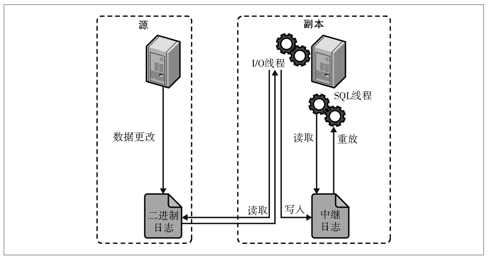

**作用**

灾备恢复：做数据的热备，作为后备数据库，主数据库服务器故障后，可切换到从数据库继续工作，避免数据丢失。

高可用性：读写分离，使数据库能支撑更大的并发。

负载均衡：多库的存储，降低磁盘I/O访问的频率，提高单个机器的I/O性能。

### 复制策略

1. 异步复制（Async Replication）：Master不用等待Slave回应就可以提交。默认。提供了最佳性能。
2. 同步复制（Sync Replication）：Master会等待所有的Slave都回应后才会提交。保证数据安全。影响性能。
3. 半同步复制（Semi-Sync Replication）：Master至少会等待一个Slave回应后提交。

增强半同步复制策略：无损半同步复制、延迟复制、并行复制

### binlog

binlog 是逻辑日志，记录内容是语句的原始逻辑。

不管用什么存储引擎，只要发生了表数据更新，都会产生 bin log ，“二进制日志事件”属于`MySQL Server` 层。

**记录格式**

* 基于语句（statement）：记录所有在源端执行的数据变更语句。简单且紧凑。性能好。可能会导致不一致。
* 基于行（row）：事件包含了该行记录发生了什么改变。高一致性。会导致二进制日志巨大增长。
* 混合模式 （mixed）：结合以上两种格式的优点

**写入机制**

1. 事务执行过程中，先把日志写到`binlog cache`
2. 事务提交的时候，再把`binlog cache`写到 binlog 文件中。
   1. write。日志写入到文件系统的 page cache，并没有把数据持久化到磁盘，速度较快。
   2. fsync。数据持久化到磁盘的操作。

> 一个事务的 binlog 不能被拆开，要确保一次性写入，所以系统会给每个线程分配一个块内存作为`binlog cache`。
>
> 为了提升对文件的读写效率，内核首先会申请一个内存页，称为页缓存（page cache）与文件中的数据块进行绑定。
>
> write和fsync的时机，可以由参数 sync_binlog 控制，默认是`sync_binlog = 1`。`sync_binlog = N (N>1)`时表示每次提交N个事务后fsync。`sync_binlog = 0`表示由系统自行判断什么时候执行fsync。

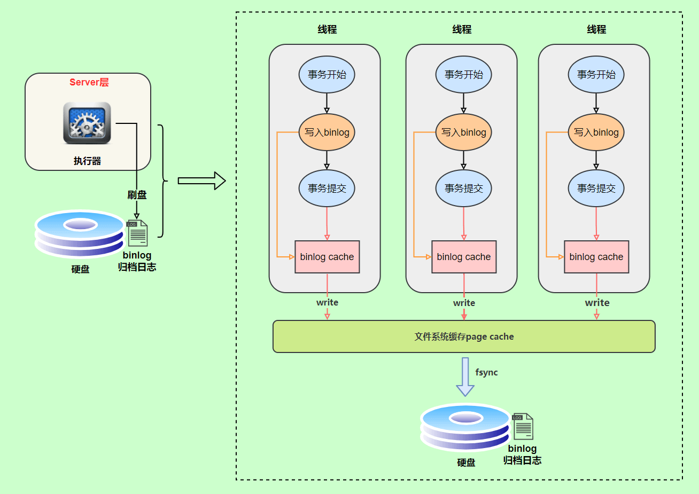

在出现 IO 瓶颈的场景里，将 sync_binlog 设置成一个比较大的值，可以提升性能。但是，如果机器宕机，会丢失最近N个事务的 binlog 日志。

### 主从延迟

1. 源服务器性能不足——并行复制、升级从库硬件
2. 主库TPS（Transaction Per Second）过高——监控报警
3. 事务过大——拆分大事务

## 崩溃恢复机制

InnoDB是一个崩溃安全的存储引擎。如果MySQL发生崩溃，它会使用基于重做日志（redo log）的崩溃恢复模式来恢复正确的数据。

### Buffer Pool

**重要性**

InnoDB 存储引擎是以数据页为单位来管理存储空间的。

InnoDB 存储引擎在处理客户端的请求时，当需要访问某个数据页的数据时，就会把完整的数据页的数据全部加载到内存中，也就是说即使我们只需要访问一个数据页的一条记录，那也需要先把整个数据页的数据加载到内存中。

将整个数据页加载到内存中后就可以进行读写访问了，在进行完读写访问之后并不着急把该数据页对应的内存空间释放掉，而是将其缓存起来，这样将来有请求再次访问该页面时，就可以省去磁盘 IO 的开销了。这个缓存就称之为**Buffer Pool**。

**概述**

Buffer Pool(缓冲池)是主内存中的一个区域，主要缓存InnoDB 的表和索引数据，缓冲池允许直接从内存中访问经常使用的数据，从而加快处理速度。

**innodb_buffer_pool_size**（单位为字节）启动项来设置自定义缓冲池大小，默认128M。

Buffer Pool对应的一片连续的内存被划分为若干个页面，默认也是16KB。该页面称为**缓冲页**。

为了更好的管理Buffer Pool中的这些缓冲页，InnoDB为每个缓冲页都创建了**控制块**。

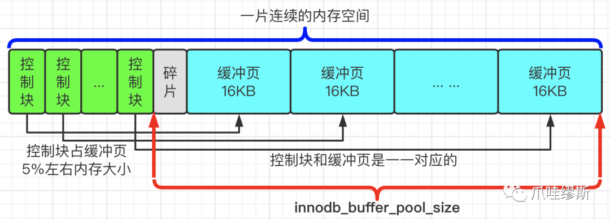

### Redo Log

redo log（重做日志）是 InnoDB 存储引擎独有的，它让 MySQL 拥有了崩溃恢复能力。

**重要性**

查询时先从  `Buffer Pool` 中找，没有命中再去硬盘加载，减少硬盘 IO 开销，提升性能。更新表数据的时候，也是如此，发现 `Buffer Pool` 里存在要更新的数据，就直接在 `Buffer Pool` 里更新。事务提交后，MySQL 实例挂了或宕机了，导致内存中数据丢失，提交事务作出的更改也会丢失。、

InnoDB的解决方法是：对任意页面进行修改的操作都会生成**redo日志**，在事务提交时，只要保证生成的redo日志成功落盘即可，这样，即使MySQL发生故障导致内存中的数据丢失，也可以根据已落盘的redo日志恢复数据，事务的四大特性的持久性就得到了保证。

**概述**

redo log是InnoDB存储引擎层的日志，又称重做日志文件，用于记录事务操作的变化，记录的是数据修改之后的值，不管事务是否提交都会记录下来。

redo log包括两部分：一个是内存中的日志缓冲(redo log buffer)，另一个是磁盘上的日志文件(redo log file)。

redo log日志的大小是固定的，即记录满了以后就从头循环写。

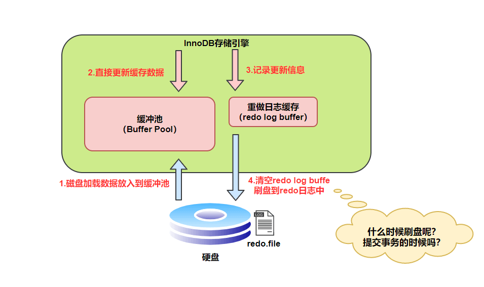

**刷盘策略**

可以通过`innodb_flush_log_at_trx_commit`参数配置

* 0：设置为 0 的时候，表示每次事务提交时不进行刷盘操作。这种方式性能最高，但是也最不安全，因为如果 MySQL 挂了或宕机了，可能会丢失最近 1 秒内的事务。
* 1：设置为 1 的时候，表示每次事务提交时都将进行刷盘操作。这种方式性能最低，但是也最安全，因为只要事务提交成功，redo log 记录就一定在磁盘里，不会有任何数据丢失。保证了事务的持久性。
* 2：设置为 2 的时候，表示每次事务提交时都只把 log buffer 里的 redo log 内容写入 page cache（文件系统缓存），然后每秒调用 `fsync()` 写入 redo log file 中。page cache 是专门用来缓存文件的，这里被缓存的文件就是 redo log 文件。这种方式的性能和安全性都介于前两者中间。如果仅仅只是 MySQL 挂了不会有任何数据丢失，但是宕机可能会有1秒数据的丢失。

> InnoDB 在多种情况下会刷新重做日志，以保证数据的持久性和一致性。
>
> * InnoDB 存储引擎有一个后台线程，每隔1 秒，就会把 redo log buffer 中的内容写到文件系统缓存（page cache），然后调用 fsync 刷盘。所以才说，发生MySQL 服务异常或宕机，丢失的是最近 1 秒内的事务。
> * 除了后台线程每秒1次的轮询操作，还有一种情况，当 redo log buffer 占用的空间即将达到 innodb_log_buffer_size 一半的时候，后台线程会主动刷盘。
> * 正常关闭服务器过程中，为了确保所有已提交事务的数据都被完整保存，InnoDB 会执行一次最终的刷盘操作，将 redo log buffer 中剩余的全部日志都清空并写入磁盘文件。
> * 等等

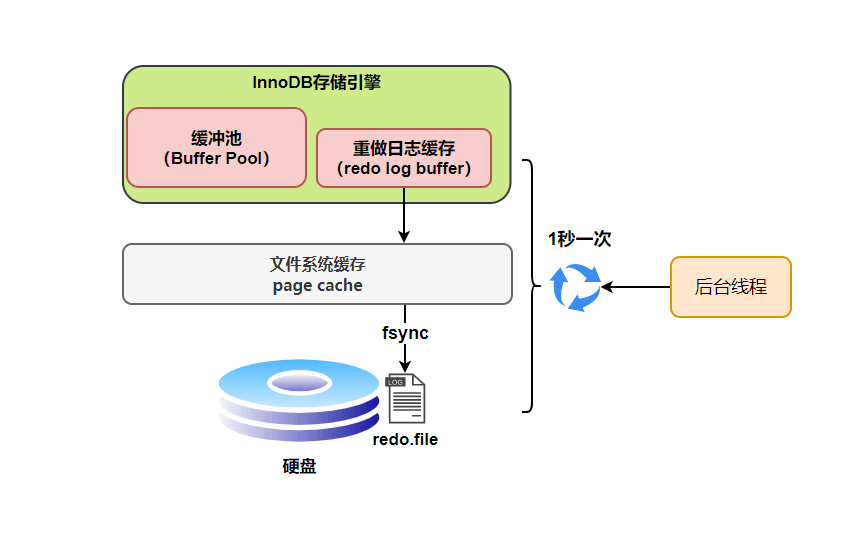

**两阶段提交**

redo log 在事务执行过程中可以不断写入，而 binlog 只有在提交事务时才写入，两者的写入时机不一样，崩溃恢复后可能会发生数据不一致的问题，例：

1. `update T set c = 1 where id=2`
2. 执行过程中写完 redo log 日志，binlog 日志写期间发生了异常。
3. 重启后，原库通过 redo log 日志恢复，`c`值是`1`。
4. binlog 少这一次更新，日志恢复数据时，从库`c`值是`0`，最终数据不一致。

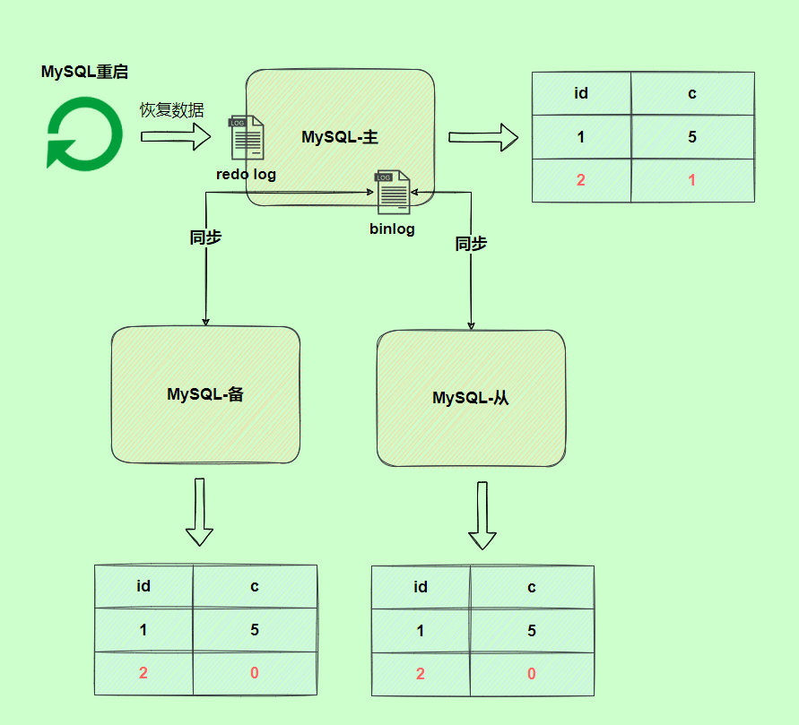

为了解决两份日志之间的逻辑不一致的问题，InnoDB 存储引擎使用**两阶段提交**方案。

将 redo log 的写入拆成了两个步骤prepare和commit，这就是两阶段提交。

1. 写入redo log 时是 prepare 状态，直到写入binlog 后，才把redo log设置为 commit 状态。
2. 当写入 binlog 时发生异常，因为 MySQL 根据 redo log 日志恢复数据时，发现 redo log 还处于 prepare 阶段，并且没有对应 binlog 日志，就会回滚该事务。
3. 当设置 commit 阶段发生异常，虽然 redo log 是处于 prepare 阶段，但是能通过事务id找到对应的 binlog 日志，提交事务。

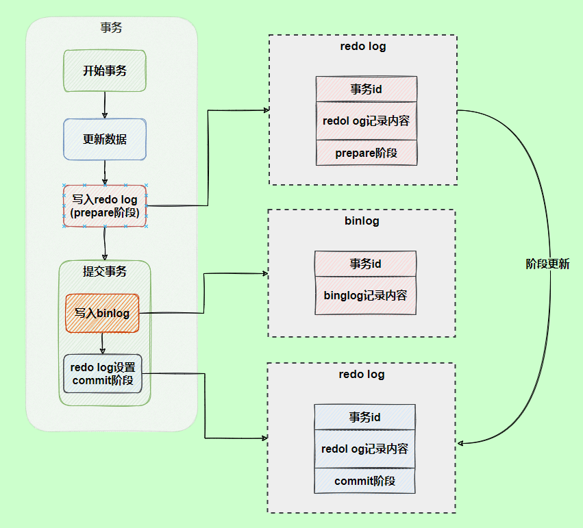

### 三大日志概述

**Redo Log & Undo Log的区别**

* 都属于 InnoDB 层面。Redo Log 让 InnoDB 存储引擎拥有了崩溃恢复能力，保证了事务的持久性； Undo Log 提供了事务回滚的功能，实现了事务的一致性隔离性，同时提供多版本并发控制下的快照读（MVCC），也即非锁定读，满足了 RR 或 RC 的隔离级别。
* Redo Log是物理日志，记录该数据页更新的内容；Undo Log是逻辑日志，主要记录了数据的逻辑变化，正好跟重做日志进行相反操作。
* Redo Log 记录了此次事务完成后的数据状态，记录的是更新之后的值；Undo Log 记录了此次事务开始前的数据状态，记录的是更新之前的值

**Redo Log & Binlog 的区别**

* redo log是属于 InnoDB 层面，让 InnoDB 存储引擎拥有了崩溃恢复能力，保证了事务的持久性；binlog属于MySQL Server层面的，保证了 MySQL 集群架构的数据一致性。
* redo log是物理日志，记录该数据页更新的内容；binlog是逻辑日志，记录的是这个更新语句的原始逻辑 
* redo log是循环写，日志空间大小固定；binlog是追加写，是指一份写到一定大小的时候会更换下一个文件，不会覆盖。
* binlog可以作为恢复数据使用，主从复制搭建，redo log作为异常宕机或者介质故障后的数据恢复使用。
* redo log 与 binlog 的写入时机不一样，为了解决两份日志之间的逻辑不一致的问题，InnoDB 存储引擎的 redo log 使用两阶段提交方案。

## 服务器配置

### 配置方法

节省时间和避免麻烦的好方法是使用默认设置，很多默认设置都是安全的。

**配置文件**

配置文件采用标准INI格式，被分为多个部分，每个部分都以一行包含在方括号中的该部分名称开头。

主配置位置：

- Linux: */etc/my.cnf* 或 */etc/mysql/my.cnf*
- macOS: */usr/local/etc/my.cnf*
- Windows: *C:\ProgramData\MySQL\MySQL Server 8.0\my.ini*

```ini
# MySQL配置文件mysqld.cnf  若某参数在多个段中重复定义，以 最后一个读取的段 为准

# 一、客户端配置
[client]
port = 3306                     # 客户端连接端口，默认3306
socket = /tmp/mysql.sock         # 本地通信使用的套接字文件路径
default-character-set = utf8mb4  # 客户端默认字符集

# 二、服务器基础配置 修改 [mysqld] 段的参数后需重启 MySQL 服务。
[mysqld]
user = mysql                     # 运行MySQL服务的系统用户
port = 3306                      # 服务监听端口，默认3306
bind-address = 0.0.0.0           # 允许连接的IP地址（0.0.0.0表示允许所有IP）
datadir = /var/lib/mysql         # 数据文件存储目录
basedir = /usr/local/mysql       # MySQL安装根目录
socket = /tmp/mysql.sock         # 服务端套接字文件路径
server-id = 1                    # 服务器唯一ID（主从复制时需唯一）
pid-file = /var/run/mysql.pid    # 进程ID文件路径

# 三、存储引擎配置（InnoDB）
[innodb]
innodb_dedicated_server=OFF  	 # ！！！！！！！！！MySQL8.0 是否会根据服务器的内存大小自动设置一些关键参数
innodb_buffer_pool_size = 1G     # ！！！！！！！！！InnoDB缓冲池大小（建议为物理内存的70%~80%）
innodb_log_file_size = 256M      # ！！！！！！！！！事务日志文件大小
innodb_flush_method=default      # ！！！！！！！！！InnoDB与文件系统的实际交互方式
innodb_flush_log_at_trx_commit = 1 # 事务提交时刷盘策略（1=强一致性，2=性能优化）
innodb_file_per_table = ON       # 每张表独立表空间文件

# 四、网络与并发连接管理
max_connections = 200            # 最大并发连接数
max_connect_errors = 1000        # 允许的最大连接错误数
wait_timeout = 600               # 非交互连接超时时间（秒）
interactive_timeout = 600        # 交互连接超时时间（秒）
back_log = 600                   # 等待连接队列长度（高并发时需增大）

# 五、查询与缓存优化
query_cache_type = 1             # 查询缓存类型（1=启用，0=禁用）
query_cache_size = 64M           # 查询缓存大小
key_buffer_size = 256M           # MyISAM索引缓存大小
tmp_table_size = 64M             # 临时表内存大小（超限转磁盘）
max_allowed_packet = 64M         # 单次传输最大数据包大小

# 六、日志与安全
log_error = /var/log/mysql.log   # 错误日志路径
slow_query_log = 1               # 启用慢查询日志
slow_query_log_file = /var/log/slow_queries.log # 慢查询日志路径
log-bin = mysql-bin              # 二进制日志路径（主从复制必需）
expire_logs_days = 7             # 自动清理过期二进制日志天数
secure-file-priv = /tmp          # 限制文件导入/导出目录

# 七、字符集与排序规则
character-set-server = utf8mb4   # 服务端默认字符集
collation-server = utf8mb4_unicode_ci # 默认排序规则

# 八、其他关键参数
skip_name_resolve = ON           # 禁止DNS解析（加速连接）
lower_case_table_names = 1       # 表名大小写不敏感（0=敏感，1=不敏感）
default-storage-engine = InnoDB  # 默认存储引擎
thread_cache_size = 8            # 线程缓存数（减少线程创建开销）
sql_mode=ONLY_FULL_GROUP_BY 	 # SQL风格
```

**动态设置**

部分变量支持

```sql
-- 查看 MySQL 系统变量
SHOW VARIABLES LIKE '%sort_buffer_size%'; 

-- 用户定义变量
SET @name = 'Tom', @count = 5;

-- 会话系统变量
SET SESSION sql_mode = 'TRADITIONAL';

-- 全局系统变量
SET GLOBAL max_connections = 1000;

-- 持久化全局变量（重启后仍生效）
SET PERSIST max_connections = 1200;

-- 仅持久化，不影响当前运行值
SET PERSIST_ONLY back_log = 200;
```

### 字符集

```sql
SHOW VARIABLES LIKE '%character_set_server%'; -- 查看系统变量
```

**存储字符集**

有以下的层次级别（优先级由上至下依次增加）： 

- `server`（MySQL 实例级别）：MySQL5.7 中，其默认值是 `latin1`；MySQL8.0 中，其默认值是 `utf8mb4` 。

```ini
[mysqld]
character-set-server=utf8
collation-server = utf8mb4_unicode_ci # 默认排序规则
```

- `database`（库级别）：如果在执行上述语句时未指定字符集，那么 MySQL 将会使用 `server` 级别的字符集。

```sql
CREATE DATABASE db_test
  CHARACTER SET utf8mb4
  COLLATE utf8mb4_general_ci; -- 排序规则
```

- `table`（表级别）：如果在创建表和修改表时未指定字符集，那么将会使用 `database` 级别的字符集。

```sql
CREATE TABLE mytable (
    id INT PRIMARY KEY,
    name VARCHAR(50)
) CHARACTER SET utf8mb4 COLLATE utf8mb4_general_ci;
```

- `column`（字段级别）：如果未指定列级别的字符集，那么将会使用 `table` 级别的字符集。

```sql
CREATE TABLE t1
(
    col1 VARCHAR(5)
      CHARACTER SET latin1
      COLLATE latin1_german1_ci
);
```

**连接字符集**

```sql
SHOW SESSION VARIABLES LIKE 'character\_set\_%';
```

与会话的客户端有关，通常为`utf8mb4`

* `character_set_client` ：客户端发送给服务器的 SQL 语句使用的字符集。
* `character_set_connection` ：服务器接收到 SQL 语句时进行翻译使用的字符集。
* `character_set_results` ：服务器返回给客户端的结果使用的字符集。

**UTF-8**

MySQL 字符编码集中有两套 UTF-8 编码实现：

`utf8`：只支持`1-3`个字节 。 在 `utf8` 编码中，中文是占 3 个字节，其他数字、英文、符号占一个字节。

`utf8mb4`：UTF-8 的完整实现，正版！最多支持使用 4 个字节表示字符。

emoji 符号和一些较复杂的文字、繁体字也是 4 个字节，需要使用utf8mb4。

## Performance Schema

Performance Schema提供了有关MySQL服务器内部运行的操作上的底层指标。

当应用程序用户连接到MySQL并执行被测量的插桩指令时，performance_schema将每个检查的调用封装到两个宏中，然后将结果记录在相应的消费者表中。

**程序插桩**

程序插桩在MySQL代码中插入探测代码，以获取我们想了解的信息。

```sql
select * from setup_instruments; # 查看插桩元件
```

**消费者表**

存储关于程序插桩代码信息的表。插桩的测量结果存储在Performance Schema数据库的多个表中；基于它们的用途，可分为以下几个类别：当前和历史数据、汇总表和摘要、实例表（Instance）、设置表（Setup）、其他表。

```sql
use performance_schema;
```

**sys Schema**

Performance Schema是一个非常好的监视工具，但是里面包含过多的表和探测项，对于普通的用户来说过于复杂，想弄清楚每一项的监测内容很困难，因此，MySQL提供了一套sys Schema，用于帮助DBA在典型的优化和诊断场景上快速使用Performance Schema。

sys Schema包含视图、存储过程和存储函数。视图中对Performance Schema的数据进行汇总，并使用易于理解的格式进行展现。

```sql
# sys Schema
use sys;
SHOW TABLES LIKE 'user%';
select * from user_summary; # 视图输出格式友好，便于人类阅读
select * from x$user_summary; # 输出原始数据，便于通过程序和工具处理
```

> 应该启用Performance Schema，按需动态地启用插桩和消费者表，通过它们提供的数据可以解决可能存在的任何问题——查询性能、锁定、磁盘I/O、错误等。充分利用sys schema是解决常见问题的捷径。这样做将为你提供一种可以直接从MySQL中测量性能的方法。——《MySQL高性能》

## 参考文献

 [JavaGuide（Java 面试 & 后端通用面试指南） | JavaGuide](https://javaguide.cn/)

《高性能MySQL（第4版）》

[数据结构 —— 图解AVL树(平衡二叉树)-CSDN博客](https://blog.csdn.net/xiaojin21cen/article/details/97602146)

[B树(B-树) - 来由, 定义, 插入, 构建_哔哩哔哩_bilibili](https://www.bilibili.com/video/BV1tJ4m1w7yR/?spm_id_from=333.337.search-card.all.click&vd_source=648539de92dcdfbe1ca5bd81d6d559d2)

[MySQL 崩溃恢复, Redo 日志修复 - 阿陶学长 - 博客园](https://www.cnblogs.com/gdjgs/p/19003960)

[【MySQL系列】- 浅入Buffer Pool-腾讯云开发者社区-腾讯云](https://cloud.tencent.com/developer/article/2114126?policyId=1003)
