<em>程序设计 = 数据结构 + 算法</em>

汉诺塔问题——所需次数为2^n - 1 分治算法

八皇后问题——回溯法

马踏棋盘——图的深度优化遍历算法、贪心算法优化

最短路径——图+弗洛伊德算法

修路问题——最小生成树+普利姆算法


# 1 数据结构绪论

## 1.1 基本概念和术语

* **数据**：描述客观事务的符号，是能在计算机中识别并输入给计算机操作的符号集合。包括数值类型和非数值类型（图片、视频、声音等）。
* **数据元素**：组成数据的、有意义的**基本单位**，被计算机作为整体处理。也成为记录。比如人。
* **数据项**：一个数据元素由若干个数据项组成。是数据不可分割的**最小单位**。比如人这样的数据元素，由眼、耳、嘴、手等数据项组成。
* **数据对象**：**性质相同的数据元素的集合，是数据的子集。**可以将数据对象简称为数据。
* **数据结构**：结构，简单理解就是关系。数据结构就是相互之间存在一种或多种特点**关系**的数据元素的集合。

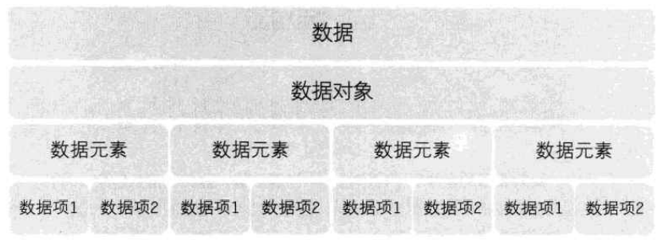

## 1.2 逻辑结构和物理结构

### 1.2.1 逻辑结构

**数据对象**中**数据元素**之间的**相互关系**。

分为以下四种：

1. 集合结构

   数据元素除同属一个集合外，它们之间无其他关系。

2. 线性结构

   数据元素之间是一对一的关系。

3. 树形结构

   数据元素之间存在一对多的**层次关系**。

4. 图形结构

   数据元素之间是多对多的关系。

> 示意图
>
> 圆圈表示数据元素的节点
>
> 连线表示元素间关系，箭头表示关系的方向

### 1.2.2 物理结构（存储结构）

数据的逻辑结构在计算机中的存储形式

实际上就是如何把数据元素存储到计算机的存储器中。**主要针对内存而言**。

> 硬盘、软盘、光盘等外部存储器的数据组织通常用文件结构来描述

分为以下两种：

1. 顺序存储结构

   把数据元素存放在**地址连续**的存储单元里，其数据间的逻辑关系和物理关系是一致的。

   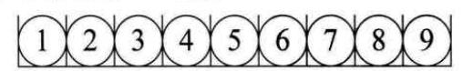

2. 链式存储结构

数据元素存放在**任意**的存储单元里，这组存储单元可以是连续的，也可以是不连续的。

数据元素的存储关系，并不能反映其逻辑关系。

需要用一个**指针**存放数据元素的地址，从而找到相关联数据元素的位置。

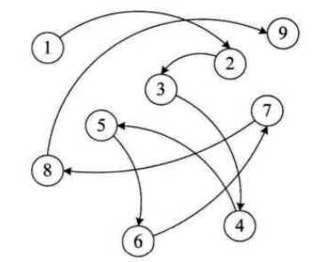

> 逻辑结构面向问题，而物理结构就是面向计算机，其基本目标就是将数据及其逻辑关系存储到计算机的内存中。

### 1.2.3 数据结构

**线性结构**

* 最常用的数据结构，数据元素之间存在一对一的线性关系
* 线性结构有两种不同的存储结构 
  * 顺序存储结构——顺序表 存储元素是连续的	
  * 链式存储结构——链表 存储元素不一定连续，元素节点存放数据元素以及相邻元素的地址信息
* 常见线性结构：一维数组、队列、链表、栈

**非线性结构**

二维数组、多维数组、广义表、树结构、图结构

## 1.3 抽象数据类型

### 1.3.1 数据类型

一组**性质相同的值**的集合及定义在集合中的一些**操作**总称

为什么考虑数据类型？

* 满足不同的功能需要
* 根据具体需要，开辟合适的内存空间

无论什么计算机以及计算机语言，都面临整数运算、实数运算等操作，可以考虑抽象出来。

> 抽象指抽取出事务具有的普遍性本质

### 1.3.2 抽象数据类型

Abstract Data Type, ADT: 一个数学模型及定义在该模型上的一组操作。

体现程序设计问题分解、抽象和信息隐藏的特性。

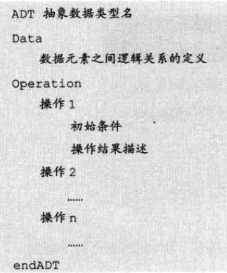

# 2 算法

## 2.1 定义

算法是解决特点问题求解步骤的描述，在计算机中表现为**指令的有限序列**，并且每条指令表示一个或多个操作。

## 2.2 特性

* 输入：零或多个。
* 输出：至少一个。
* 有穷性：有限的步骤、不出现循环、在可接受时间内完成。
* 确定性：无歧义，相同输入得到唯一输出。
* 可行性：算法每一步都可行。

## 2.3 要求

* 正确性
* 可读性
* 健壮性：应对输入数据不合法的情况，做合适处理。
* 时间效率高、存储量低

## 2.4 算法的效率度量方法

* 事后统计

* 事前分析

  高级程序语言编写的程序，运行消耗的时间取决于如下因素：

  1. **算法好坏**
  2. 编译产生的代码质量（软件）
  3. **问题的输入规模**
  4. 机器执行指令的速度（硬件）

> 所谓问题的输入规模是指输入量的多少

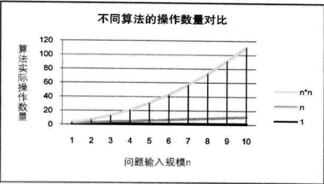

## 2.5 函数的渐近增长

举 f(n) = 2n + 3 和 f(n) = 3n+1为例

当n=1，算法1效率不如算法2。当n>2事，算法1就开始优于算法2，得出结论，算法1总体上好过算法2

**函数的渐近增长**:给定两个函数f(n)和g(n),如果存在一个整数N,使得对于所有的n>N,f(n)总是比g(n)大,那么,我们说f(n)的增长渐近快于g(n)。

判断算法的效率，关注主项（最高阶项）的阶数

## 2.6 算法时间复杂度

T(n): 语句总的执行次数，是关于问题规模n的函数

**算法的时间复杂度**，记作T(n)=O(f(n))，这种记法叫**大O记法**。表示随着问题规模n的增大，算法执行时间的增长率和**f(n)**的增长率相同，也称算法的渐近时间复杂度。

**推导时间复杂度**

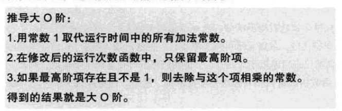

**时间复杂度大小排序**

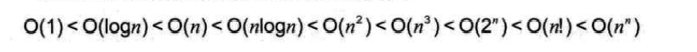

## 2.7 最坏情况和平均情况

对算法的分析,

一种方法是计算所有情况的平均值,这种时间复杂度的计算方法称为平均时间复杂度。

另一种方法是计算最坏情况下的时间复杂度,这种方法称为最坏时间复杂度。

**一般在没有特殊说明的情况下,都是指最坏时间复杂度。**

## 2.8 算法的空间复杂度

写代码时，可以通过空间来换取时间。

**算法的空间复杂度**通过计算算法所需的存储空间实现,算法空间复杂度的计算公式记作:S(m)=O(f(m)),其中,n为问题的规模,f(m)为语句关于n所占存储空间的函数。

# 3 线性表

## 3.1 线性表定义

线性表(List):零个或多个数据元素的有限序列。

表头元素拥有一个直接后驱

表尾元素拥有一个直接前驱

其余元素拥有一个直接后驱和一个直接前驱

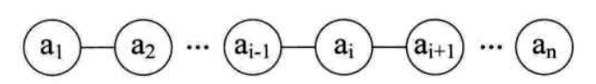

## 3.2 线性表的抽象数据结构

```
ADT线性表(Iist)
Data
    线性表的数据对象集合为{a1,a2,,an),每个元素的类型均为DataType。其中，除第一个元素a1外，每一个元素有且只有一个直接前驱元素，除了最后一个元素an外，每一个元素有且只有一个直接后继元素。数据元素之间的关系是一对一的关系。
Operation
    InitList (*L):初始化操作，建立一个空的线性表工。
    ListEmpty (L):若线性表为空，返回true,否则返回false。
    ClearList(*L):将线性表清空。
	GetElem(L,i,*e):将线性表L中的第i个位置元素值返回给e。
	LocateElem(L,e):在线性表L中查找与给定值e相等的元素，如果查找成功，返回该元素在表中序号表示成功：否则，返回0表示失败。
	ListInsert(*L,i,e):在线性表L中的第i个位置插入新元素e。
	ListDelete(*工，1，*e):删除线性表工中第i个位置元素，并用e返回其值。
	ListLength (L):返回线性表工的元素个数。
endADT
```

## 3.3 线性表的顺序存储结构（数组）

### 3.3.1 定义

线性表的顺序存储结构，指的是用**一段地址连续的存储单元**依次存储线性表的数据元素。

一般使用编程语言的**一维数组**实现顺序存储结构

数组初始化时，设定最大存储长度MaxSize，通过编程手段可以实现最大存储长度的动态变化

### 3.3.2 随机存取

数组存储了存储空间的起始位置

存储器中的每个存储单元都有自己的编号，这个编号称为地址。

假设元素占用c个存储单元，对于第i个元素的地址，可以通过第一个元素地址推出，

```
LOC(ai)=LOC(a1)+(i-1)*c
```

因此，在数组中存入或取出数据，时间复杂度都为O(1)。具有这一特点存储结构称为随机存储结构。

### 3.3.3 插入与删除

插入和删除的时间复杂度。

最好情况，插入或删除最后一个位置，时间复杂度为O(1)

最坏情况，插入或删除第一个位置，时间复杂度为O(n)

平均情况(n-1)/2,时间复杂度为O(n)

### 3.3.4 优缺点

**优点**

无须为元素之间的逻辑关系增加额外的存储空间

随机快速存取某一个元素

**缺点**

插入和删除操作需要移动大量元素

存储空间可能会浪费	

固定的存储空间容量无法确定，当线性表长度变长，可能需要扩容

## 3.4 线性表的链式存储结构（单链表）

### 3.4.1 定义

链表以节点Node的方式存储

每个节点包含**数据域**和**指针域**，指针域指向下一个节点

各个节点可以是连续，也可以不连续

**一般来说，定义一个头节点，其数据域可以不存放数据，也可以存放公共数据，其指针域为头指针，指向第一个节点；定义最后一个节点的指针域为null**

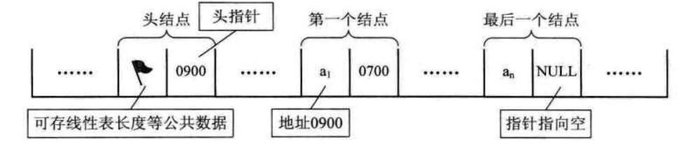

逻辑结构如下

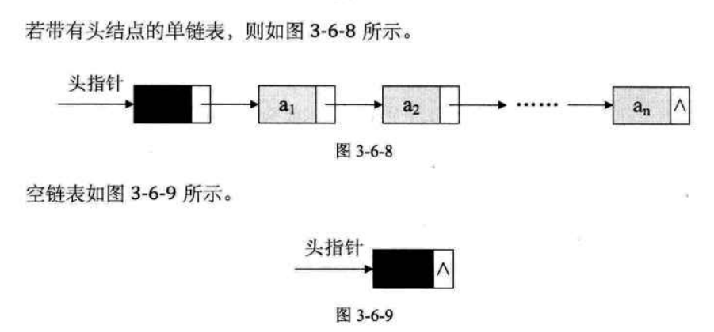

### 3.4.2 单链表的读取

​		在单链表中，由于第ⅰ个元素到底在哪？没办法一开始就知道，必须得从头开始找。因此，对于单链表实现获取第i个元素的数据的操作GetElem,在算法上，相对要麻烦一些。

最好情况，读取第一个元素，时间复杂度为O(1)

最坏情况，读取最后一个元素，时间复杂度为O(n)

平均情况，(1+n)/2，时间复杂度为O(n)

### 3.4.3 单链表的插入与删除

单链表插入和删除算法，它们其实都是由两部分组成：**第一部分就是遍历查找第i个元素；第二部分就是插入和删除元素。**

我们很容易推导出：它们的时间复杂度都是O(n)。如果在我们不知道第i个元素的指针位置，单链表数据结构在插入和删除操作上，与线性表的顺序存储结构是没有太大优势的。

但如果，我们希望从第1个位置，插入10个元素，对于顺序存储结构意味着，每一次插入都需要移动n一1个元素，每次都是0(n)。而单
链表，我们只需要在第一次时，找到第i个位置的指针，此时为O(n),接下来只是简单地通过赋值移动指针而已，时间复杂度都是O(1)。

显然，**对于插入或删除数据越频繁的操作，单链表的效率优势就越是明显。**

### 3.4.4 单链表的整表创建

头插法

尾插法

### 3.4.5 单链表的整表删除

单链表整表删除的算法思路如下：

1. 声明一结点p和q
2. 将第一个结点赋值给p;
3. 循环：
   1. 将下一结点赋值给q;
   2. 释放p;
   3. 将q赋值给P。

## 3.5 链表结构与顺序存储结构的优缺点

|              | 存储分配           | 查看                   | 插入与删除                             | 空间性能                                 |
| ------------ | ------------------ | ---------------------- | -------------------------------------- | ---------------------------------------- |
| 顺序存储结构 | 一段连续的存储空间 | 随机存取O(1)           | 平均要移动一半的元素O(n)               | 需要预先分配空间，可能出现空间浪费或溢出 |
| 链式存储结构 | 任意存储单元       | 按顺序遍历直至找到O(n) | 若找出元素位置后，插入和删除仅需要O(1) | 无需预分配空间，但需要存储指针域         |

若线性表需要频繁查找，很少进行插入和删除操作时，宜采用顺序存储结构。若需要频繁插入和删除时，宜采用单链表结构。

当线性表中的元素个数变化较大或者根本不知道有多大时，最好用单链表结构，这样可以不需要考虑存储空间的大小问题。

## 3.6 静态链表

### 3.6.1 定义

> 对于一些语言，如Basic、Fortran等早期的编程高级语言，由于没有指针，链表结构按照前面我们的讲法，它就没法实现了。怎么办呢？有人就想出来用数组来代替指针，来描述单链表。

首先我们让数组的元素都是由两个数据域组成，data和cur。也就是说，数组的每个下标都对应一个data和一个cur。数据域data,用来存放数据元素，也就是通常我们要处理的数据；而游标cur相当于单链表中的next指针，存放该元素的后继在数组中的下标。

用数组描述的链表叫做静态链表，这种实现链表的方法叫游标实现法。

为了我们方便插入数据，我们通常会把数组建立得大一些，以便有一些空闲空间可以便于插入时不至于溢出。

通常把未被使用的数组元素成为备用链表。数组第一个元素用来存放首个备用节点的下标，以供添加元素使用。

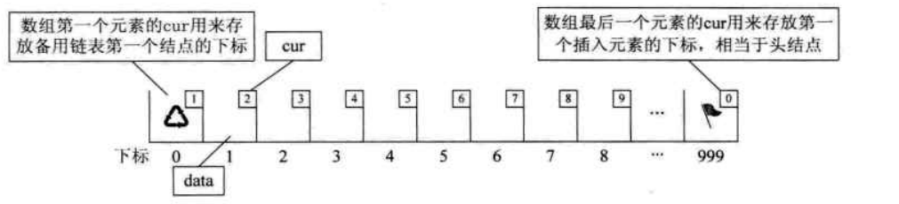

存储数据后

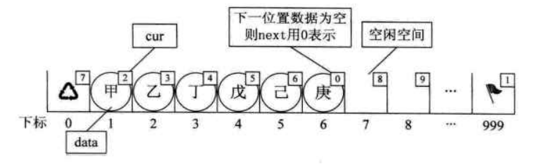

## 3.7 循环链表

## 3.8 双向链表


# 3 稀疏数组

当一个数组中大部分元素为0，或者为同一个值的数组时，可以使用稀疏数组来保存该数组。

稀疏数组的处理方法是：

* 记录数组一共有几行几列，有多少个不同的值
* 把具有不同值的元素的行列及值记录在一个小规模的数组中，从而缩小程序的规模

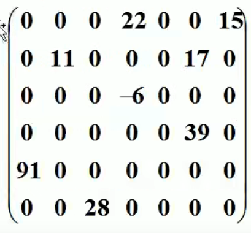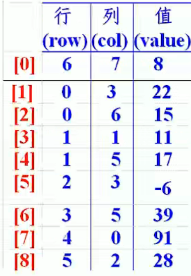

# 4 队列

## 4.1 队列的定义

队列(queue）是只允许在一端进行插入操作，而在另一端进行删除操作的线性表。

队列是一种先进先出(First In First Out)的线性表，简称FIFO。允许插入的一端称为队尾，允许删除的一端称为队头。

队列是一个有序列表，可以用数组或链表实现。

## 4.2 队列的抽象数据结构

```
ADT队列(Queue)
Data
	同线性表。元素具有相同的类型，相邻元素具有前驱和后继关系。
Operation
    InitQueue(*Q):初始化操作，建立一个空队列Q。
    DestroyQueue(*Q):若队列Q存在，则销毁它。
    ClearQueue(*Q):将队列Q清空。
    QueueEmpty(Q):若队列Q为空，返回true,否则返回false。
    GetHead(Q,*e):若队列Q存在且非空，用e返回队列Q的队头元素。
    EnQueue(*Q,e):若队列Q存在，插入新元素e到队列Q中并成为队尾元素。
    DeQueue(*Q,*e):删除队列Q中队头元素，并用e返回其值。
    QueueLength(Q):返回队列Q的元素个数
endADT
```

## 4.1 数组模拟队列

其中maxSize是该队列的最大容量。

因为队列的输出、输入是分别从前后端来处理，因此需要两个变量front及rear分别记录队列前后端的下标，front会随着数据输出而改变，而rear则是随着数据输入而改变，

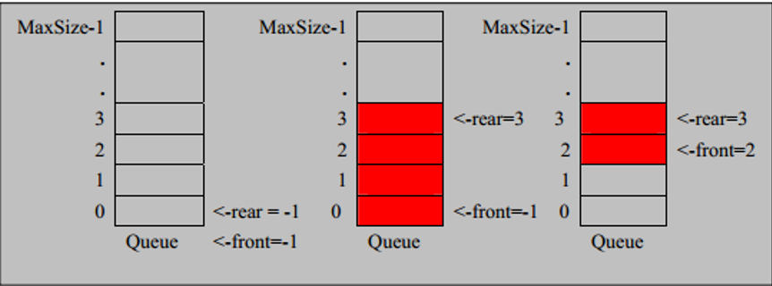

```java
class ArrayQueue {
    private int maxSize; // 数组最大容量
    private int front; // 指向队列头的指针
    private int rear; // 指向队列尾的指针
    private int[] arr; // 存放数据的数组

    // 创建队列并初始化
    public ArrayQueue(int maxSize) {
        this.maxSize = maxSize;
        arr = new int[this.maxSize];
        front = -1; // 指向队列头的前一个位置
        rear = -1; // 指向队列尾的数据
    }

    // 判断队列是否满
    public boolean isFull() {
        return rear == maxSize - 1;
    }

    // 判断队列是否为空
    public boolean isEmpty() {
        return rear == front;
    }

    // 添加数据到队列
    public void addQueue(int n) {
        // 判断队列是否满
        if (isFull()) {
            System.out.println("队列满了，无法加入数据");
            return;
        }
        arr[++rear] = n;
    }

    // 数据出队列
    public int getQueue() {
        // 判断队列是否为空
        if (isEmpty()) {
            throw new RuntimeException("队列为空，无法获取数据");
        }
        return arr[++front];
    }

    // 显示队列所有数据
    public void showQueue() {
        if (isEmpty()) {
            System.out.println("队列为空");
            return;
        }
        for (int i = front + 1; i < rear + 1; i++) {
            System.out.printf("arr[%d]=%d\t",i,arr[i]);
        }
    }

    // 显示队列头数据，非取数据
    public int headQueue() {
        // 判断队列是否为空
        if (isEmpty()) {
            throw new RuntimeException("队列为空，无法查看数据");
        }
        return arr[front+1];
    }
}

```

> 1. 数据元素无法一直添加，当rear指针超过maxSize-1则表示队列已满 ”假溢出“
>
> 解决：模拟循环队列 通过取模运算实现
>
> 2. 为了避免当只有一个元素时，队头和队尾重合使处理变得麻烦
>
> 解决：引入两个指针，front指针指向队头元素，rear指针指向队尾元素的下一个位置，这样当front等
> 于rear时，此队列不是还剩一个元素，而是空队列。
>
> 3. 当rear = front 时 可能代表队列满或队列空
>
> 解决：但队列只剩下一个预留空间时，代表队列已满即（rear + 1）% maxSize = front

## 4.2 数组模拟循环队列

思路如下：

1. front指针 指向队列的第一个元素  初始值为0

2. rear指针 指向队列最后一个元素的后一个位置 **即指向一个空间作为约定** 初始值为0

3. 当队列满的时候，（rear + 1）% maxSize = front

   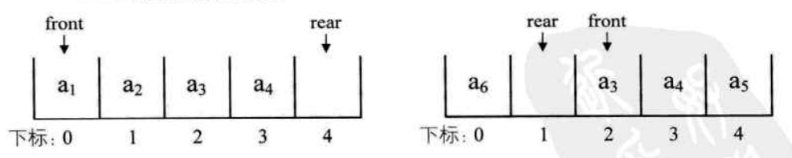

4. 但队列为空的时候，rear = front 

   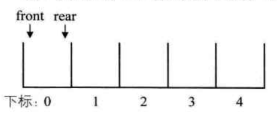

5. 有效数据个数为 （rear + maxSize - front）% maxSize

```java
class CircleArrayQueue {
    private int maxSize; // 数组最大容量
    private int front; // 指向队列的第一个元素，即arr[front] 初始值为0
    private int rear; // 指向队列尾的后一个位置， 即指向一个无元素的预留的空间 初始值为0
    private int[] arr; // 存放数据的数组

    // 创建队列并初始化
    public CircleArrayQueue(int maxSize) {
        this.maxSize = maxSize;
        arr = new int[this.maxSize];
    }

    // 判断队列是否满
    public boolean isFull() {
        return (rear + 1)  % maxSize == front; // 例front = 0, rear = maxSize - 1
    }

    // 判断队列是否为空
    public boolean isEmpty() {
        return rear == front;
    }

    // 添加数据到队列
    public void addQueue(int n) {
        // 判断队列是否满
        if (isFull()) {
            System.out.println("队列满了，无法加入数据");
            return;
        }
        arr[rear] = n;
        rear = (rear + 1) % maxSize;
    }

    // 数据出队列
    public int getQueue() {
        // 判断队列是否为空
        if (isEmpty()) {
            throw new RuntimeException("队列为空，无法获取数据");
        }
        int res = arr[front];
        front = (front + 1) % maxSize;
        return res;
    }

    // 显示队列所有数据
    public void showQueue() {
        if (isEmpty()) {
            System.out.println("队列为空");
            return;
        }
        int i = front;
        int j = rear;
        while (i != j) {
            System.out.printf("arr[%d]=%d\t",i,arr[i]);
            i = (i + 1) % maxSize;
        }
    }

    // 显示队列头数据，非取数据
    public int headQueue() {
        // 判断队列是否为空
        if (isEmpty()) {
            throw new RuntimeException("队列为空，无法查看数据");
        }
        return arr[front];
    }

    // 当前队列有效数据个数
    public int size() {
        return (rear + maxSize - front) % maxSize;
    }
}
```

