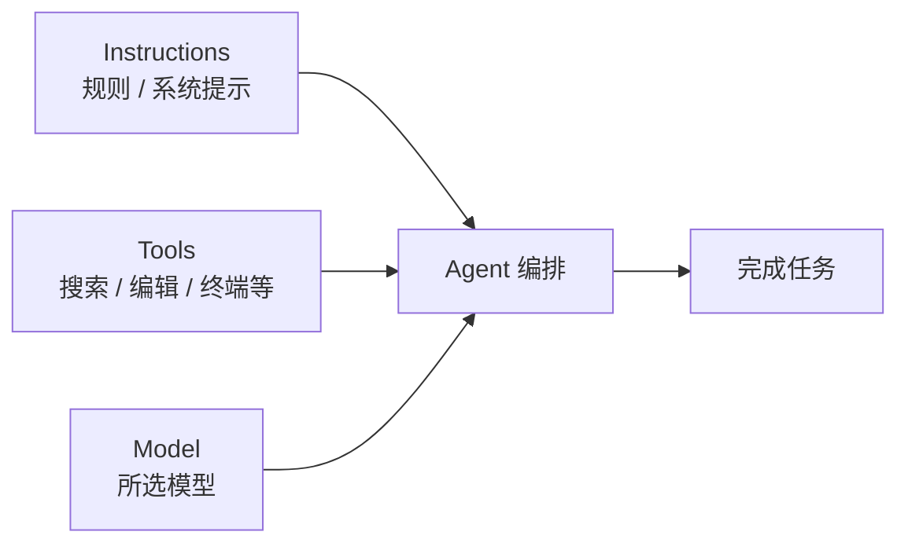

# Cursor 科学使用指南

> 面向日常开发的 Cursor 核心功能、工作流与最佳实践。  
> 参考：[Cursor 官方文档](https://cursor.com/docs) · 更新参考日期：2026-05

---

## 目录

1. [Cursor 是什么](#1-cursor-是什么)
2. [核心架构：三件事](#2-核心架构三件事)
3. [核心功能一览](#3-核心功能一览)
4. [四种 AI 模式](#4-四种-ai-模式)
5. [上下文与 @ 引用](#5-上下文与--引用)
6. [Rules：持久化 AI 指令](#6-rules持久化-ai-指令)
7. [MCP：连接外部工具与数据](#7-mcp连接外部工具与数据)
8. [代码库索引与搜索](#8-代码库索引与搜索)
9. [科学使用工作流](#9-科学使用工作流)
10. [快捷键速查](#10-快捷键速查)
11. [常见问题](#11-常见问题)
12. [延伸阅读](#12-延伸阅读)

---

## 1. Cursor 是什么

Cursor 是基于 VS Code 的 **AI 原生代码编辑器**。它在编辑、补全、对话、终端、多文件改动之间打通，让 AI 能真正参与「读代码 → 改代码 → 跑命令 → 验证」的闭环，而不只是聊天。

典型使用场景：

| 场景 | 推荐能力 |
|------|----------|
| 写下一行 / 补全多行 | **Tab** |
| 改当前选中片段 | **Inline Edit**（`Ctrl+K`） |
| 多文件功能、重构、修 bug | **Agent**（`Ctrl+I`） |
| 只问不改、理解架构 | **Ask 模式** |
| 大改动前先定方案 | **Plan 模式** |
| 难复现的 bug | **Debug 模式** |

---

## 2. 核心架构：三件事

官方将 Agent 拆解为三个组件（[Agent Overview](https://cursor.com/docs/agent/overview)）：



| 组件 | 含义 | 你可控的部分 |
|------|------|----------------|
| **Instructions** | 系统提示 + Rules + Skills | `.cursor/rules`、`AGENTS.md`、User Rules |
| **Tools** | 语义搜索、读写文件、终端、浏览器、MCP 等 | 是否批准工具、Auto-run、MCP 配置 |
| **Model** | 当前对话使用的 LLM | 设置默认模型、对话中切换 |

理解这三者有助于你判断：问题是「提示不够清楚」「上下文不够」还是「模型/模式选错了」。

---

## 3. 核心功能一览

### 3.1 Tab — AI 自动补全

- **作用**：边写边预测下一行或多行，可跨文件联动（例如改 A 文件后提示 B 文件需同步修改）。
- **接受**：`Tab` 整段接受；`Ctrl + →`（Windows）逐词接受；`Esc` 拒绝。
- **Jump**：接受建议后再按 `Tab`，可跳到预测的下一编辑位置。
- **开关**：右下角 Tab 状态栏，或 **Settings → Tab**。
- **注意**：Tab **不受** Project Rules / User Rules 影响（Rules 主要作用于 Agent 对话）。

文档：[Tab completion](https://cursor.com/docs/tab/overview)

---

### 3.2 Inline Edit — 行内快速编辑

- **快捷键**：选中代码 → `Ctrl+K`（Mac：`Cmd+K`）。
- **适用**：单处或小范围修改，不必打开侧边 Agent 面板。
- **追问模式**：`Alt+Enter` 进入问答；若同意修改可说 "do it" 再执行。
- **升级到 Agent**：选中代码 → `Ctrl+L` 带入 Agent 做多文件任务。

文档：[Inline edit](https://cursor.com/docs/inline-edit/overview)

---

### 3.3 Agent — 自主完成复杂任务

- **打开**：`Ctrl+I`（Mac：`Cmd+I`）。
- **能力**：搜索代码库、编辑多文件、运行终端、使用 MCP、生成图片、启动子代理等。
- **工具**（节选）：语义搜索、grep、读/写文件、Shell、浏览器、网页搜索、图片生成等；单次任务工具调用次数无硬性上限。
- **中断**：点击 **Stop**。
- **审查**：在 diff 视图中逐条接受/拒绝；PR 级审查可配合 [Bugbot](https://cursor.com/help/ai-features/bugbot)。

文档：[Agent mode](https://cursor.com/help/ai-features/agent)

---

### 3.4 Checkpoints — 会话内快照回滚

- Agent 在重大改动前自动创建 checkpoint。
- 在聊天时间线点击 checkpoint 可预览并 **Restore**，回滚该点之后的所有 Agent 修改。
- **与 Git 区别**：Checkpoint 是本地、会话级撤销；版本历史仍应交给 Git。

---

### 3.5 消息队列 — Agent 忙时排任务

- Agent 执行中可输入下一条指令，按 **Enter** 入队，完成后顺序执行。
- 可拖拽调整队列顺序。
- **`Ctrl+Enter`**：立即发送，插队处理当前任务（用于紧急纠正方向）。

---

### 3.6 Subagents — 并行子任务

- 主 Agent 可将探索、Shell、浏览器等委托给 **子代理**，各自独立上下文，结果汇总回主对话。
- 自定义子代理：在 `.cursor/agents/` 放置 markdown 定义。
- 适合：大范围搜代码、避免主对话被大量文件内容撑爆。

文档：[Subagents](https://cursor.com/docs/subagents.md)

---

### 3.7 Cloud Agents — 云端异步执行

- 浏览器访问 [cursor.com/agents](https://cursor.com/agents)，可在无本地 IDE 时跑 Agent。
- 适合：长任务、移动端跟进、与桌面 IDE 配合。

---

## 4. 四种 AI 模式

通过 **Shift+Tab** 或面板模式选择器切换（[Modes 说明](https://cursor.com/help/ai-features/agent)）：

| 模式 | 最适合 | 能否改文件 |
|------|--------|------------|
| **Agent** | 功能开发、重构、修 bug、写测试 | 是 |
| **Ask** | 理解代码、架构问答、方案讨论 | 否（只读） |
| **Plan** | 多文件/多方案、需求不清的大任务 | 先出计划，你批准后再写代码 |
| **Debug** | 难复现、需运行时证据的 bug | 是 |

**模式切换注意**：

- 各模式使用独立上下文；**换任务建议新开对话**。
- **Rules 在所有模式中都会生效**（含 Ask）。

### Plan 模式科学用法

1. Agent 先澄清需求 → 搜代码库 → 生成可编辑计划。
2. 你审阅/修改计划后再 **Build**。
3. 若实现偏离预期：**不要只靠追问修补**；用 checkpoint/Git 回退，**收紧计划再跑一遍**，往往比「边跑边改」更快、更干净。

文档：[Plan Mode](https://cursor.com/docs/agent/modes)

---

## 5. 上下文与 @ 引用

在聊天框输入 `@` 可精确附加上下文（[Prompting](https://cursor.com/docs/agent/prompting)）：

| @ 类型 | 用途 |
|--------|------|
| `@文件` / `@文件夹` | 指定路径，文件夹后可继续 `/` 深入 |
| `@Docs` | 索引文档（可添加自有文档源） |
| `@Terminals` | 附带终端输出 |
| `@Past Chats` | 引用历史对话 |
| `@Commit` / `@Branch` | 工作区或分支 diff |
| `@Browser` | 内置浏览器上下文 |
| `@规则名` | 手动应用某条 Rule |

**原则**：

- **已知相关文件** → 主动 `@`，减少盲目搜索。
- **不确定在哪** → 不必堆 `@`，交给 Agent 语义搜索 + grep。
- 支持 **拖入/粘贴图片**（UI 实现、报错截图等）。
- 支持 **语音输入**（麦克风图标）。

### 上下文窗口

- 对话有固定 token 上限；接近满时 Cursor 会压缩较早内容为摘要。
- 输入框旁的 **上下文环** 可查看：系统提示、工具、Rules、Skills、MCP、子代理、对话等各占多少。
- 大任务可拆多轮对话，或让子代理做探索以节省主窗口。

---

## 6. Rules：持久化 AI 指令

大模型不会跨对话「记住」你的偏好；**Rules** 在每次对话开头注入持久指令（[Rules 文档](https://cursor.com/docs/context/rules)）。

### 规则类型

| 类型 | 位置 | 作用域 |
|------|------|--------|
| **Project Rules** | `.cursor/rules/*.md(c)` | 当前仓库，可 git 共享 |
| **User Rules** | Settings → Rules | 全局，所有项目 |
| **Team Rules** | 团队 Dashboard | 组织级（Team/Enterprise） |
| **AGENTS.md** | 项目根或子目录 | 轻量 markdown 说明 |

### Project Rule 应用方式

| 类型 | 行为 |
|------|------|
| Always Apply | 每次对话都带上 |
| Apply Intelligently | Agent 根据 description 判断是否相关 |
| Apply to Specific Files | 匹配 glob 时自动附加 |
| Apply Manually | 仅 `@规则名` 时生效 |

`.mdc` 示例 frontmatter：

```markdown
---
description: 后端 RPC 服务约定
globs: src/services/**/*.ts
alwaysApply: false
---

- 每个服务单独一个文件
- 边界处校验输入，内部函数信任已校验数据
```

### 写好 Rules 的原则

- **短、具体、可执行**；单条建议 < 500 行，大规则拆分。
- **引用文件**（`@template.ts`），不要复制整份 style guide。
- **不要**重复 linter/通用工具说明；**不要**堆砌极少触发的边缘 case。
- **仅在 Agent 反复犯同一类错时**再加规则。
- User Rules **不作用于** Inline Edit（`Ctrl+K`），主要作用于 Agent 对话。

创建方式：聊天 `/create-rule`，或 **Settings → Rules, Commands → Add Rule**。

---

## 7. MCP：连接外部工具与数据

**MCP（Model Context Protocol）** 让 Agent 调用外部 API、数据库、Issue 系统、设计稿等（[MCP 文档](https://cursor.com/docs/context/mcp)）。

### 配置位置

| 范围 | 文件 |
|------|------|
| 项目 | `.cursor/mcp.json` |
| 全局 | `~/.cursor/mcp.json` |

### 传输方式

- **stdio**：本地命令行进程（最常见）
- **SSE / HTTP**：远程服务，可 OAuth

### 使用与安全

- Agent 在相关时会自动选用 MCP 工具；默认需 **批准** 后才执行。
- 可开启 **Auto-run**（类似终端自动执行策略）。
- 只安装可信来源；API Key 用环境变量，勿写进仓库。
- 排错：**Output 面板 → MCP Logs**。

市场：[Cursor Marketplace](https://cursor.com/marketplace) · 社区：[cursor.directory](https://cursor.directory/)

---

## 8. 代码库索引与搜索

打开工作区后 Cursor **自动索引**（约 80% 完成即可用语义搜索），每 5 分钟增量同步变更（[Semantic search](https://cursor.com/docs/context/codebase-indexing)）。

Agent 会按提示自动组合工具：

| 你的说法 | 典型策略 |
|----------|----------|
| 精确符号名、错误字符串 | **Grep / Instant Grep** |
| 「认证在哪处理」这类语义 | **Semantic search** |
| 复杂链路梳理 | 多轮搜索 + 读文件 + 跟引用 |

**提升搜索质量**：

- 在 `.cursorignore` / `.gitignore` 排除生成物、巨型资源。
- 先 **Ask/探索** 再 **Agent 开改**，避免重复造轮子。
- 提示里尽量给出 **函数名、路径、错误信息** 等锚点。

---

## 9. 科学使用工作流

### 9.1 任务分级：选对工具

```
小补全 / 下一行          → Tab
单文件局部修改           → Ctrl+K
多文件 / 终端 / 测试     → Agent
只要答案不改代码         → Ask
大功能 / 架构未定          → Plan → 审计划 → Build
实现跑偏                 → Checkpoint / Git 回退 → 改计划重跑
```

### 9.2 写好 Prompt 的公式

**目标 + 范围 + 约束 + 验收**

```text
在 src/auth/ 下新增邮箱+密码登录 API。
约束：沿用现有 UserService，不写新 ORM；需 zod 校验。
验收：npm test auth 通过，并给出 curl 示例。
```

避免：「优化一下」「修 bug」（不说现象与文件）。

### 9.3 推荐会话节奏

1. **Ask**：「登录流程经过哪些模块？」
2. **Plan**（若改动面大）：出步骤与文件清单。
3. **Agent**：按批准计划实现 + 跑测试。
4. **人工 Review diff**；重要逻辑自己跑一遍。
5. **Git commit**；Checkpoint 不替代版本管理。

### 9.4 团队与项目规范落地

| 层级 | 做法 |
|------|------|
| 个人 | User Rules（语言、回复风格） |
| 仓库 | `.cursor/rules` + `AGENTS.md` |
| 组织 | Team Rules（可强制） |
| 集成 | MCP 接 Linear/Figma/内部 API |

### 9.5 安全与成本

- 敏感密钥：环境变量 + `.env`（且勿提交）；Agent 执行命令前看清。
- 大上下文对话更费 token；拆任务、用子代理探索。
- 模型选择：简单改动用更快模型；复杂推理再换更强模型（对话中可切换）。

### 9.6 常见反模式

| 反模式 | 更好做法 |
|--------|----------|
| 一条超长模糊需求 | 拆步 + Plan |
| Agent 跑偏后 endless 追问 | 回滚 checkpoint，重写计划 |
| 堆 20 个 @ 文件 | 只 @ 关键 2–3 个或让 Agent 搜 |
| 复制整本规范进 Rules | 指向示例文件 + linter |
| 完全不看 diff 就合并 | 逐文件 review |
| 用 Ask 模式却期待改代码 | 切 Agent 或说明要 Agent 模式 |

---

## 10. 快捷键速查

> Windows/Linux 为主；Mac 一般为 `Cmd` 对应 `Ctrl`。

| 操作 | 快捷键 |
|------|--------|
| 打开 Agent 面板 | `Ctrl+I` |
| 选中代码送 Agent | `Ctrl+L` |
| Inline Edit | `Ctrl+K` |
| 接受 Tab 建议 | `Tab` |
| Tab 逐词接受 | `Ctrl+→` |
| 切换 Agent 模式 | `Shift+Tab` |
| Agent 忙时立即发送 | `Ctrl+Enter` |
| 命令面板 | `Ctrl+Shift+P` |
| 设置 | `Ctrl+Shift+J`（以实际绑定为准） |

可在 **Keyboard Shortcuts** 中搜索 `Cursor` 自定义。

---

## 11. 常见问题

**Q：Rules 为什么没生效？**  
检查规则类型：智能应用需写 `description`；按文件应用需 `globs` 匹配当前上下文；也可手动 `@规则名`。

**Q：Ask 和 Agent 有什么区别？**  
Ask 只读，适合学习与评审方案；要改代码用 Agent。

**Q：Checkpoint 和 Git 用哪个？**  
Checkpoint = 单次 Agent 会话内撤销；Git = 长期版本与协作。

**Q：代码会上传到 Cursor 吗？**  
索引时路径加密、内容为嵌入向量；语义搜索在客户端解密块，详见官方隐私说明。

---

## 12. 延伸阅读

| 主题 | 链接 |
|------|------|
| Agent 总览 | https://cursor.com/docs/agent/overview |
| 提示与 @ | https://cursor.com/docs/agent/prompting |
| Rules | https://cursor.com/docs/context/rules |
| MCP | https://cursor.com/docs/context/mcp |
| Tab | https://cursor.com/docs/tab/overview |
| 索引与搜索 | https://cursor.com/docs/context/codebase-indexing |
| 全站文档索引 | https://cursor.com/llms.txt |

---

*本文档为学习与团队 onboarding 用途整理，功能以 Cursor 官方文档与当前版本为准。*
