# Cursor

[由 Cursor 自生成的文档](assets/Cursor科学使用指南.md)

## Cursor 概述

[Cursor: The best way to code with AI](https://cursor.com/cn)

[Claude Code Docs](https://code.claude.com/docs/zh-CN)

Cursor 是一款功能强大的 AI 优先代码编辑器，可增强我们的开发工作流程。主要提供三个核心方向，这些功能可以无缝地协同工作，从而提高工作效率：

- 深度集成 AI 模型，不是简单地接入模型，而是让 AI 充当了编译器的核心交互方式。支持代码块对话、项目级对话、模型自由选择。
- 强上下文理解能力，可以自动识别项目文件、代码块、错误信息等等，提供更直观准确的 AI 修改能力。
- 对话式开发体验，仅需用自然语言沟通，Cursor 就会根据指令完成布置的任务，使用者可以轻松扮演产品经理，让 Cursor 理解你的命令自行工作。

> 基于 Visual StudioCode 打造而成的 Al 编程工具，因此界面和基础操作与 VSCode 高度相似，无缝衔接。

## 无限续杯

Cursor 新注册后有着 14 天免费，50 次免费高级提问的额度，但是也很轻易就会到上限的。其通过检测用户的邮箱账号以及电脑的机器码进行识别。出于学习的意图，可以尝试在达到上限后绕过这些限制继续学习。

1. 2925 注册一个账号，可以随意创建子邮箱。
2. [机器码重置 · GitHub](https://github.com/yeongpin/cursor-free-vip)

## Cursor 配置

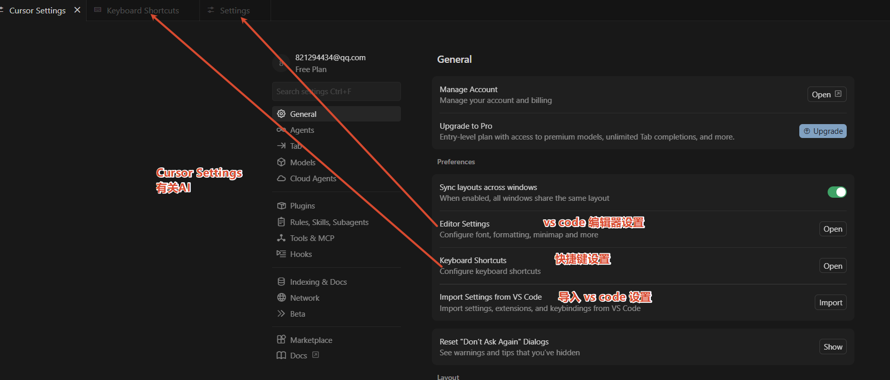

## Java 语言环境

配置本地 Java 和 maven，一般 Cusor 与 vs code 都会识别与应用配置。

安装插件

- **Extension Packfor Java**，选择由 Microsoft 发布的扩展包，并安装。" ExtensionPackforJava”是一个插件集合，而非具体单个插件。它集成了多个与 Java 开发相关的插件，安装后能为开发者在 Visual StudioCode 或 Cursor 等编辑器中提供完整的 Java 开发环境，涵盖从代码编写、调试、测试到项目管理等多方面功能。其包含的主要插件及作用如下：
  - Language SupportforJava(TM) byRed Hat：提供语法高亮、智能代码补全、代码检查、代码格式化(Shift+Alt+F(Windows/Linux)或 Shift+Option+F(Mac))、代码导航以及重构支持等功能，辅助高效编写和优化 Java 代码。
  - Debuggrfor Java：实现轻量级 Java 程序调试，可设置断点，调试时查看变量值、对象属性和调用栈，追踪程序执行流程以排查问题。
  - MavenforJava：用于管理 Maven 项目，能创建新项目，管理项目依赖，执行 Maven 构建任务，如清理、编译、打包项目等。
  - TestRunnerforJaVa：支持 JUnit 和 TestNG 等测试框架，方便运行和调试 Java 测试用例，展示测试结果及详细日志，助力开发者定位问题。
  - ProjectManagerforJava：可在编辑器中管理多个 Java 项目，实现快速切换，导入本地 Java 项目，可视化展示项自模块、包和文件结构。
  - GradleforJava：针对 Gradle 构建工具，能创建 Gradle 项目，运行 Gradle 任务，管理项目构建、测试流程，查看 Gradle 任务和工程依赖。

## 三大核心功能

### 代码补全

Cursor 的 Tab 键具有强大的代码自动补全功能，基于 AI 模型，能根据代码上下文自动预测并生成代码补全建议和代码修复重构，还可用于导航代码等！

> Tab 键接受建议，也可以通过按 Esc 键拒绝建议。要逐字部分接受建议，请按 Ctr1/+。

- 单行/多行补全
- 代码重写重构
- 接收/拒绝
  - `tab` 接收完整补全、`ctrl + ->` 部分和逐步接收补全 [需要开启部分补全配置]、`esc` 或者 继续输入 拒绝补全

### Chat 对话模式

Chat（以前称为“Composer”）是 Cursor 的 AI 助手，位于的侧边栏中，可让您通过自然语言与代码库进行交互。您可以提出问题、请求代码编辑、获取终端命令建议等 - 所有这些都无需切换上下文。

#### 参考模板

* **代码生成类**

  ``` 
  [任务类型]：请生成一个 {功能描述} 的 {编程语言/框架} 实现
  
  [具体要求]：
  1. 使用 {特定技术/库}
  2. 包含 {特定功能点}
  3. 符合 {编码规范/设计模式}
  ```

  示例：

  ``` 
  请生成一个学习计划页面的HTML+CSS+JavaScript实现
  
  [具体要求]：
  1. 使用Tailwind CSS v3和Font Awesome
  2. 包含任务添加、编辑、删除功能
  3. 包含日历视图展示学习计划
  4. 包含学习进度可视化图表
  5. 符合现代UI设计原则和响应式设计
  6. 具有平滑的动画和交互效果
  ```

* **代码修改类**

  ``` 
  [任务类型]：请帮我修改 {上下文：具体文件/代码片段}，实现 {预期功能}
  
  [当前问题]：{现有的错误/不足描述}
  
  [具体要求]：
  1. 保持 {现有功能/结构} 不变
  2. 使用 {特定方法/技术} 改进
  3. 修复 {具体错误/警告}
  ```

  示例：

  ``` 
  请帮我修改当前的 React 组件，优化列表渲染性能。
  当前问题：滚动时列表卡顿，存在明显性能问题。
  要求：
  1. 保持现有 UI 不变
  2. 使用 React.memo 和虚拟列表技术优化
  3. 添加性能监控日志
  ```

* **代码解释类**

  ``` 
  [任务类型]：请解释 {代码片段/功能模块} 的 {具体方面}
  
  [上下文信息]：{相关业务背景/技术栈}
  
  [具体问题]：
  1. {不理解的语法/逻辑}
  2. {特定设计选择的原因}
  3. {潜在的问题/优化点}
  ```

  示例：

  ``` 
  请解释这段 TypeScript 代码的泛型约束和类型推导逻辑。
  上下文：这是一个用于数据验证的工具函数。
  具体问题：
  1. <T extends object> 这里为什么要加 extends object？
  2. 类型推导是如何工作的？
  3. 是否存在类型安全隐患？
  ```

* **流程自动化类**

  ``` 
  [任务类型]：请创建一个自动化流程，实现 {目标描述}
  
  [操作步骤]：
  1. 从 {数据源} 获取 {数据类型}
  2. 执行 {数据处理/转换操作}
  3. 将结果保存到 {目标位置}
  4. 触发 {后续操作/通知}
  
  [具体要求]：
  1. 使用 {特定工具/API}
  2. 添加 {错误处理/重试机制}
  3. 生成 {日志/报告}
  ```

  示例：

  ``` 
  请创建一个自动化流程，每天凌晨从 GitHub API 获取仓库星标数，保存到 Google Sheets 并生成趋势图。
  要求：
  1. 使用 GitHub REST API v3
  2. 添加异常处理和邮件通知
  3. 生成周/月增长趋势图表
  ```

* **命令行辅助类**

  ``` 
  [任务类型]：请提供 {操作场景} 的 {操作系统} 命令
  
  [具体需求]：
  1. {执行的具体操作}
  2. 包含 {特定参数/选项}
  3. 处理 {特殊情况/错误}
  ```

  示例：

  ``` 
  请提供在 macOS 上批量压缩图片的命令行方案。
  需求：
  1. 将当前目录下所有 PNG/JPG 图片压缩 50%
  2. 保留原始文件并添加 "-compressed" 后缀
  3. 显示每个文件的压缩前后大小对比
  ```

#### Chat 模式

1. Agent 代理模式（默认）: 允许 Cursor 学习和理解我们的项目代码，并且代表们可以直接进行项目代码更改！[识别项目结构]
   - Review：在差异视图中查看建议的更改
   - Apply:  在“ask / Manual ”模式下，使用“应用”按钮显式应用更改
   - Accept/Rejec：进行更改后，决定是保留还是放弃更改（agent 模式下）
   - Checkpoints 数据还原：Cursor 通过在发出的每个请求以及每次 AI 更改的代码库时自动创建代码库的检查点（Checkpoints）来恢复到代码库先前的某个状态。
   - Show History 查看对话历史：
2. Ask 对话模式：获取项目代码相关的解释和答案，但是不会直接修改项目代码！[识别项目结构]
3. Manual 手动模式：需要我们执行项目上下文（修改范围，后续会详细讲解）重点编辑！[不识别项目结构]
   - 通过 `@` 可以添加 context 项目上下文


### 内联生成

内联编辑 （Cmd/Ctrl+K） 直接在编辑器窗口中生成新代码或编辑现有代码。

适合已知并精准修改文件内容！

Cmd K 的模式说明：

* **内联生成**：如果在按 `Ctrl/Cmd K` 时未选择任何代码，Cursor 将根据您在提示栏中键入的提示生成新代码。
* **内联编辑**：对于就地编辑，只需选择要编辑的代码，然后在提示栏中键入即可。

## 精准上下文指定

在 Cursor 工具里，“上下文（Context）” 可理解为 **让 AI 准确理解需求、辅助编码的 “信息参考范围”** ，是 AI 读懂代码、精准响应的关键!

打开项目时，每个 Cursor 实例都将初始化该工作区的索引。初始索引设置完成后，Cursor 将自动为添加到工作区的任何新文件编制索引，以使您的代码库上下文保持最新：

- 快速 “读懂” 你的项目结构（哪些是工具文件、哪些是业务逻辑）
- 定位相关代码（如搜索 `getUser` 时，知道优先查 `userService.js`）
- 理解代码关系（如 `Order` 类和 `Product` 类的关联）

### 忽略文件配置：

Cursor 读取项目的代码库并为其编制索引以支持其功能。可以通过将 `.cursorignore` 文件添加到根目录来控制 哪些文件被忽略和 Cursor 限制访问。

### Rules 规则

Rules 是给 Cursor AI 功能（规则适用于 Chat 和 Cmd K）生成结果添加规则和限制，让 AI 生成的代码贴合团队规范，减少人工二次修改成本，主要的作用如下：

- 可约束代码风格（如强制用驼峰命名、要求函数必须写注释 ）
- 能限定技术选型（如禁止使用某老旧库、优先用项目指定工具类 ）
- 提前指定核心参数（如提前设置连接数据库的地址和账号密码等）

**Rule 主要的配置方案有两种：**

| **维度**     | **项目规则（Project Rules）**                | **用户规则（User Rules）**           |
| ------------ | -------------------------------------------- | ------------------------------------ |
| **作用范围** | 仅对当前项目生效，团队成员共享相同规则       | 对所有项目生效，个人专属配置         |
| **存储位置** | 项目根目录下的 `.cursor/rules/随意.mdc` 文件 | 用户配置目录（如 `~/.cursor/rules`） |
| **同步方式** | 随项目代码提交到版本库（如 Git），团队共享   | 仅本地生效，不随项目同步             |
| **适用场景** | 统一团队编码规范（如函数注释格式、依赖版本） | 个人习惯（如快捷键、AI 响应风格）    |

> 项目规则和用户规则同时存在并且规则冲突，项目规则优先级更高~~

项目规则示例：

```
---
description: "团队前端项目规范"
priority: 1000
---

# 代码风格
1. 函数必须包含 JSDoc 注释
2. 禁止使用 `var`，统一用 `const`/`let`
3. 函数命名必须添加 zwf_前缀， 例如：zwf_login

# 依赖管理
- 优先使用项目内已有的工具函数（如 `utils/request`）
- 禁止引入低版本的 lodash（<4.0.0）
```

用户规则：

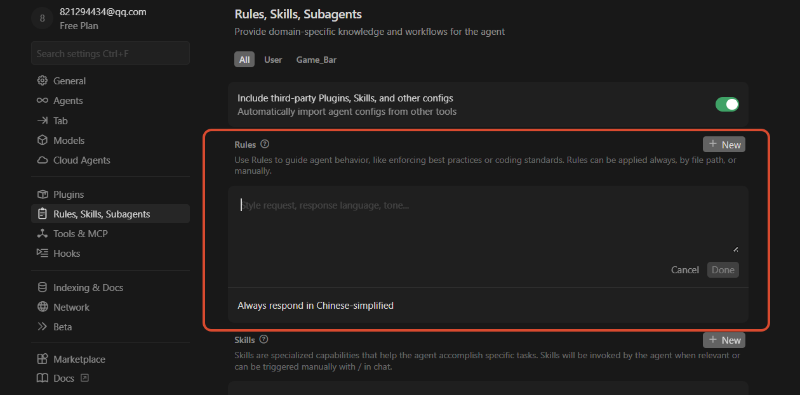

mdc 语法

1. 前置元数据（Frontmatter）

   - 用 `---` 包裹的 YAML 格式配置
   - 定义规则的基本属性（如作用范围、优先级）

   ```
   ---
   # 官方约定字段（推荐用，AI 更易理解）
   description: "前端项目规则" 		# 描述规则用途，指导 AI 如何应用规则
   globs: "src/**/*.tsx" 			# 指定规则生效的文件范围（支持 glob 语法）
   priority: 1000 					# 规则优先级（数值越大越优先），解决规则冲突
   version: "1.0.0" 				# 规则版本号（可选）
   
   # 自定义字段（自己或团队约定含义）
   author: "技术团队"
   review_date: "2025-06-04"
   special_rule: "仅周一至周五生效"
   ---
   ```

2. 规则内容（Markdown 正文）

   - 用 Markdown 语法写具体规则

   示例

   ```
   # 代码风格&代码规范
   1. 函数必须包含 JSDoc 注释  
      - 至少包含 `@param` 和 `@return` 描述  
   2. 变量命名必须使用驼峰命名法（camelCase）  
   3. 每行代码长度不超过 120 个字符  
   4. 所有文件必须使用 UTF-8 编码  
   5. 统一使用 2 空格缩进  
   
   # 类型约束
   1. 禁止使用隐式 any 类型  
      - 示例：`const num: number = 123`（显式）  
      - 禁止：`const num = 123`（隐式）  
   2. 接口命名必须以 `I` 开头（如 `interface IUser`）  
   
   # 项目约束
   - 所有 HTTP 请求必须通过 @file src/utils/request.ts 封装的工具  
   - 状态管理必须使用 Redux Toolkit，禁止直接修改 state  
   
   # 技术选型
   - 禁止直接使用原生 fetch，必须通过项目封装的 request 工具  
   - 优先使用 React Hooks 而非 Class 组件  
   
   # 安全规范
   1. 禁止使用 eval() 函数  
   2. SQL 查询必须使用参数化查询，防止注入攻击  
   3. 敏感信息（如 API 密钥）必须从环境变量读取  
   
   # 工具链配置
   1. ESLint 规则必须符合 @file .eslintrc.js   # 用 `@file` 引用项目内的配置文件，让 AI 参考：
   2. 测试用例必须遵循 Jest 框架规范  
   ```

   

### @ 符号

在 Cursor 中使用 @ 符号在聊天中引用代码、文件、文档和其他上下文的指南，直接更具体的指定上下文环境！

以下是所有可用 @ 符号的列表：

- @Files- 引用项目中的特定文件

- @Folders - 引用整个文件夹以获得更广泛的上下文

- @Code - 引用代码库中的特定代码片段或符号

- @Docs- 访问文档和指南

  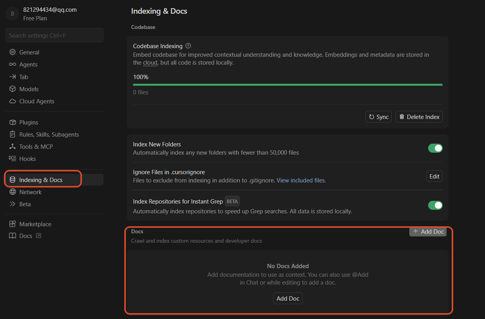

- @Git- 访问 git 历史记录和更改

- @Past Chats- 使用汇总的 Composer 会话

- @Cursor Rules-使用光标规则

- @Web/@Browser- 参考外部 Web 资源和文档

- @Lint Errors- 引用 lint 错误（仅限 Chat）

## 开发流程&实战

Cursor 官网开发指导流程：


1. 需求设计

   - 创建：01_chrome 插件需求和要求说明

     ```txt
     实现一款Chrome的插件，要包含下面三个功能：
        1. 解释选中的段落或者关键词
        2. 翻译选中的段落或者关键词（支持中文和英文翻译即可）
        3. 朗读选中的段落或者关键字（支持中文和英文朗读）
        4. 润色和替换选中的文本文案
     细节要求：
        1. 当选中段落或者关键词时，出现插件，直接悬浮在选中关键词和段落上！（显示顺序：解释，翻译，朗读，润色）
        2. 解释，翻译，润色的结果直接在悬浮下方出现结果即可
        3. 翻译添加语言选择（翻译目标： 中文还是英文）
        4. 润色结果可以进行修改，同时提供一键替换功能，替换目标文案内容（可编辑情况下可以直接替换）！
        5. 翻译、解释、润色功能实用kimi的api实现即可，具体参考配置kimi api文档
        6. 朗读直接调用chrome浏览器内置插件即可（提供中文和英文朗读）
        7. 并且帮我们写好readme文档，写清在chrome部署插件的过程
     ```

2. 设计和生成项目 ui 图文本 

   - chat agent 模式对话：@01_chrome 插件需求和要求说明 根据插件需求文档，帮我写一份项目的 UI 文本设计图，将设计图写到 02_chrome 插件 UI 设计图 文件中！ 要求页面简洁，清晰！
   - 生成 02_chrome 插件 UI 设计图

3. 配置 Cursor 导入 kimi docs 文档

4. Chrome 插件实现

   - chat agent 模式对话：@01_chrome 插件需求和要求说明 @02_chrome 插件 UI 设计图   基于需求和 UI 设计图，以及参考 @doubaoui.png 图片风格，直接在当前 chrome-plugin 文件夹下实现插件功能，同时提取单独配置文件用于填写 kimi api url 和 key 的位置！代码添加中文注释，实现后再次自检查，确保插件正常运行和实现功能！

5. 询问插件部署方法并调试功能

6. ...

# Claude Code

[Cluade 自生成使用文档](assets/Claude_Code_使用文档.md)

## Claude Code 概述

### Cursor 弊端

Cursor 是一款强大的 AI 代码编辑器，深受开发者喜爱，但其计费规则频繁变动令人头疼：免费用户权限被不断压缩，Pro 用户（\$20/月）的规则也一改再改，最新规定更是将每月请求总额上限锁定在\$20，实质上变成了按量计费，让固定月费失去了意义。

### Claude Code 简介

Calude（克劳德）Code 是由 Anthropic 开发的官方 CLl 工具，用于协助用户处理软件工程任务。Anthropic 发现了 Cursor 的成功后，开发了 Claude Code 作为 Cursor 的竞品。Claude Code 是一个革命性的 Al 编程工具，它将强大的 ClaudeAl 直接集成到您的开发环境中。

与传统的代码编辑器插件不同，ClaudeCode 在终端中运行，具有以下特点：

- 智能代码理解: 深度理解您的项目结构和代码逻辑
- 自然语言交互: 用普通话描述需求，AI 自动执行编程任务
- 全项目上下文: 理解整个代码库的架构和依赖关系
- 安全可靠： 直接连接 Anthropic APl，所有操作在本地执行 Git 集成: 智能的版本控制操作和历史分析

### 应用场景

```
## 场景一：代码编写和修改
"添加一个用户登录功能"
"修复这个函数的bug"
"重构这段代码提高性能"

## 场景二：代码分析和理解
"这个项目是做什么的？"
"解释这个函数的工作原理"
"找出性能瓶颈在哪里"

## 场景三：测试和调试
"运行所有测试并修复失败的部分"
"添加单元测试覆盖这个模块"
"分析为什么这个测试失败了"

## 场景四：Git操作
"提交当前更改"
"创建新分支进行功能开发"
"查看最近的提交历史"

## 其他......
```

## Claude Code 安装

### Kimi K2 模型

​	KimiK2 是北京月之暗面科技有限公司于 2025 年 7 月 11 日推出的模型，具备更强代码能力、更擅长通用 Agent 任务的 MoE 架构基础模型。Kimi K2 继承了 DeepSeek-V3 的架构，并在后者基础上进行增加专家数量、减少注意力头数量等调整。号称代码能力与 Agent 能力强大，真实水平虽然并没有达到无比强大，但是做到了很棒的性价比

### 模型 API 信息配置

获取 API key

[Kimi API 开放平台](https://platform.kimi.com/)

将 Moonshot 的 url 以及 API key 设置进环境变量的系统变量中。

```
ANTHROPIC_API_KEY
你的API key
```

```
ANTHROPIC_BASE_URL
https://api.moonshot.cn/anthropic/
```

### Claude Code  安装

已支持 windows 系统，无需再 win 中安装 wsl 了。

必备组件：win10 及以上、管理员权限、git、nodejs18+、终端、网络代理

首先是在终端中设置代理地址

```bash
set http_proxy=http://192.168.1.117:7890
set https_proxy=http://192.168.1.117:7890
```

> 注意：上述方式的环境变量，仅适用于 CMD 不适用于 PowerShell，PowerShell 设置环境变量参考下方
>
> ```
> $env:HTTP_PROXY="http://192.168.1.117:7890"
> $env:HTTPS_PROXY="http://192.168.1.117:7890"
> ```

安装方式：

- 通过 npm 包管理器直接安装

  ```
  npm install -g @anthropic-ai/claude-code
  ```

- 或使用官网安装脚本
  - [快速开始 - Claude Code Docs](https://code.claude.com/docs/zh-CN/quickstart)

验证&启动

```bash
claude --version
claude # 也依赖于国外网络环境
```

设置主题颜色

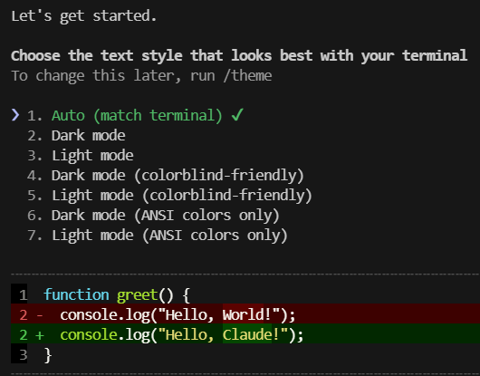

配置登录方式

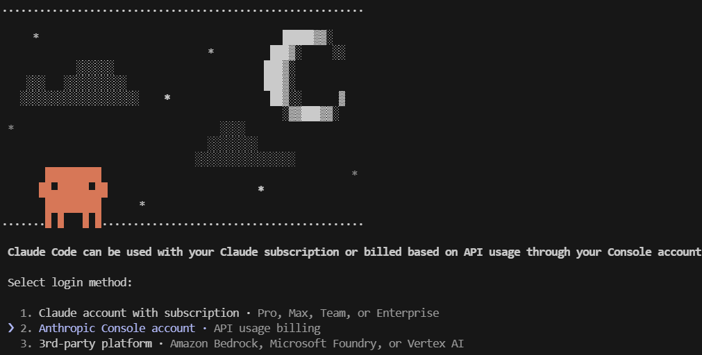

如 Anthropic Console account 方式 依赖于 [环境变量对 API 设置](#模型 API 信息配置)

假如提前配置好了环境变量，claude 会自动识别

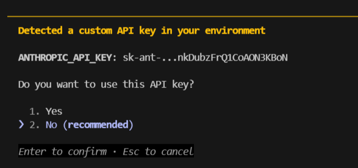

登录成功

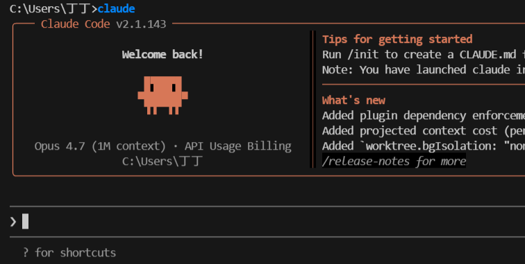

## Claude Code 入门

### 启动

```bash
# 在项目根目录启动
claude

# 或者在某个目录指定特定任务
claude "帮我分析这个项目的结构"
```

### 输入换行

通过 `Ctrl + Enter` 换行

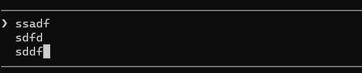

或者

`Ctrl + g` 进入编辑器进行多行编辑

### 修改语言设置

在启动目录，创建文件夹.claude，在.claude 文件夹中创建文件 config.json

```json
{
  "model": "claude-3-5-sonnet-20241022",
  "max_tokens": 4000,
  "temperature": 0.7,
  "auto_approve": false,
  "git_integration": true,
  "excluded_files": [
    "node_modules/**",
    ".git/**",
    "*.log",
    "dist/**"
  ],
  "language_preferences": {
    "documentation": "zh-CN",
    "code_comments": "zh-CN"
  }
}
```

### 状态栏提示优化

默认界面没有任何状态信息——不知道当前用的是 Opus 还是 Sonnet，不知道 token 消耗了多少，不知道上下文窗口还剩多少空间。这些信息在 Claude Code 原生界面里是缺失的。

安装 CCometixLine，一个 Rust 编写的高性能状态栏工具。

```bash
npm install -g @cometix/ccline
```

然后在 `~/.claude/settings.json` 中添加配置：

```json
{
  "statusLine": {
    "type": "command",
    "command": "ccline",
    "padding": 0
  }
}
```

效果

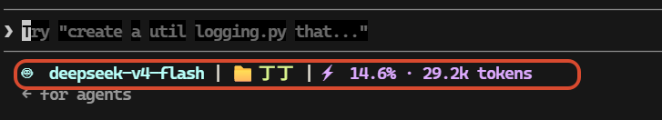

### 切换输出风格

`/config` 修改配置

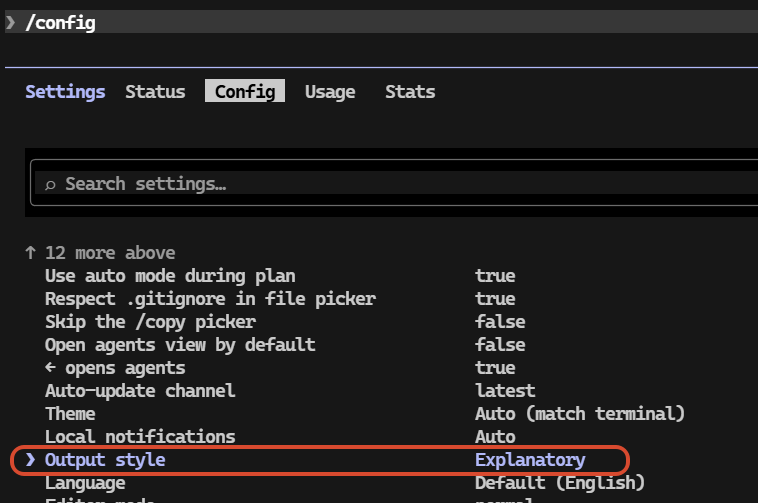

### 增加声音提示

方法一：安装插件

```bash
/plugin marketplace add 6m1w/claude-sound-fx
/plugin install sound-fx@claude-sound-fx
/sound-fx:setup
```

方法二：通过hooks添加

打开`~\.claude\settings.json`

```
{
  "hooks": {
    "Stop": [
      {
        "matcher": "permission",
        "hooks": [
          {
            "type": "command",
            "command": "【在这里填入你喜欢的提示命令】"
          }
        ]
      }
    ],
    "Notification": [
      {
        "matcher": "permission",
        "hooks": [
          {
            "type": "command",
            "command": "【在这里填入你喜欢的提示命令】"
          }
        ]
      }
    ]
  },
  // 其它配置
}
```

windows 提示音命令：

- 蜂鸣 (Beep)：`powershell -c "[System.Console]::Beep(800, 500)"`
- 系统提示音：`powershell -c "[System.Media.SystemSounds]::Asterisk.Play()"`
- 播放 WAV：`powershell -c "(New-Object Media.SoundPlayer 'C:\\Sounds\\notify.wav').PlaySync()"`
- 播报语音：`powershell -c "Add-Type -A System.Speech; (New-Object System.Speech.Synthesis.SpeechSynthesizer).Speak('Master, waiting for command')"`

> 注意通过 `\` 转义双引号或者斜杠

linux 及 macOS 参考 [^3]

### 交互模式切换

Claude Code 有四种交互模式

- **Ask** before edits：默认的安全模式，可以进行分析、解释、推理，写入操作需要用户确认
- **Edit** automatically：会进行写入代码、执行测试、构建项目等工作，写入操作无需用户确认
- **Plan** mode：只构思并给出完整的实施方案，不修改文件

> **Auto** mode：由 Claude Code 自行决定切换模式

可以通过 `shift + tab` 快捷键切换交互模式，下达相关任务的自然语言也可以使 Claude Code 进入 Edit 模式。

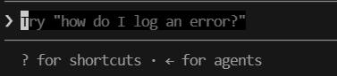

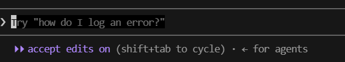

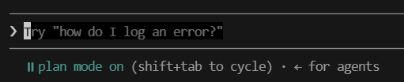

在 Edit 模式实际使用过程中，Claude Code 在遇到创建文件、下载资源、构建项目等非写入命令操作时，还是会询问用户，如果需要 Claude Code 完全自动接管，可以使用 `claude --dangerously-skip-permissions` 来启动 Claude Code ，这样就能跳过所有权限检验。

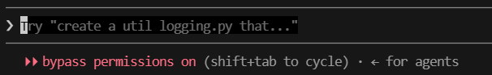


### 模型思考深度

模型思考深度控制 Claude 在回答问题时投入多少”思考资源”，直接影响响应速度、Token 消耗和输出质量。

在交互模式下输入 `/effort low/medium/high/max/auto` 可以调节模型思考深度

或通过环境变量设置

### 服务器后台运行

当你在 Claude Code 输入框中，运行工程（如 `npm run dev`），将无法继续输入语言指令，此时可以 Crtl + B 使任务在后台运行。通过 `/task` 可以查看当前运行中的后台任务。

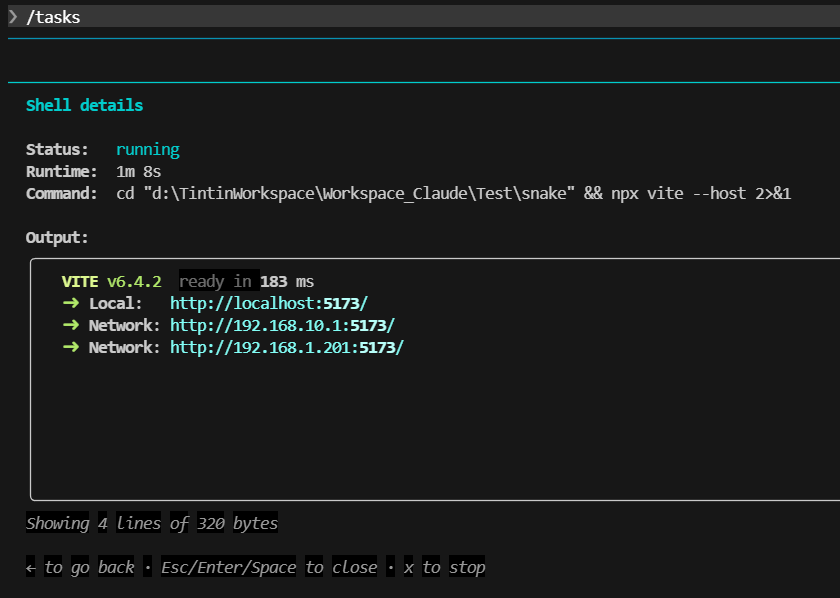

### 代码或会话回滚

每次创建请求时，Cluade Code 都会创建一个回滚点，`Esc + Esc` 进入回滚页面，选择想要回滚的地方

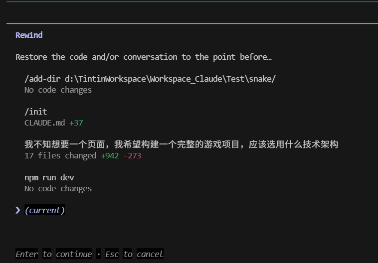

选择回滚方式（回滚会话还是代码）

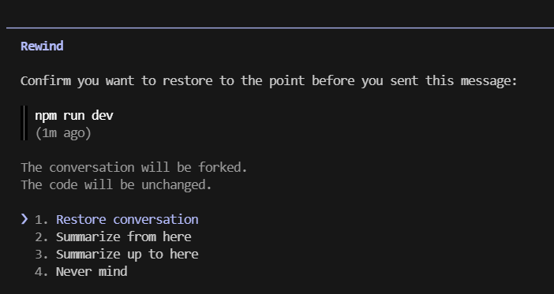

### 使用 MCP 连接外部工具

配置 MCP 服务器以扩展您的代理的外部工具。涵盖传输类型、大型工具集的工具搜索、身份验证和错误处理。

> Model Context Protocol (MCP) 是一个开放标准，用于将 AI 代理连接到外部工具和数据源。使用 MCP，您的代理可以查询数据库、与 Slack 和 GitHub 等 API 集成，以及连接到其他服务，而无需编写自定义工具实现。

以 figma （可以实现智能体与设计文件交互）为例

安装 figma

```
claude mcp add --transport http figma https://mcp.figma.com/mcp
```

通过指令 `/mcp` 启动 figma

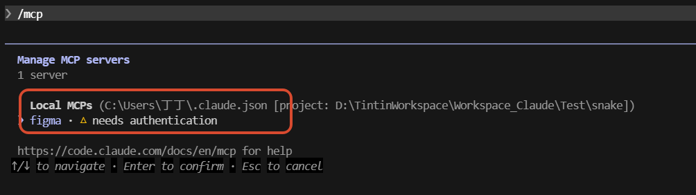

首次需打开网页登录验证

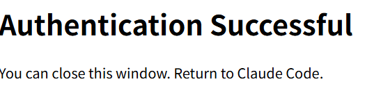

重新启动 figma，可以查看 figma 包含的工具列表

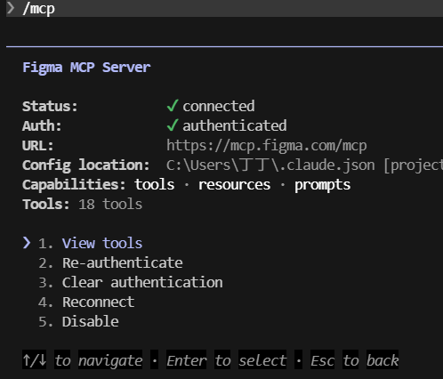

测试能力

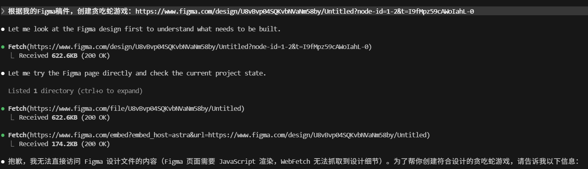

### SKILL 打包技能

SKILL 的价值：把你反复做的事情封装成可复用的指令集。

在 `.claude` 创建目录及 `SKILL.md` 文件

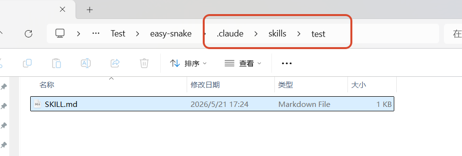


格式如下：

```markdown
---

name：test

description：当用户需要测试 SKILL 时使用

---

# test

打印 SKILL 测试成功即可


```

通过 `/skills` 查看和管理 

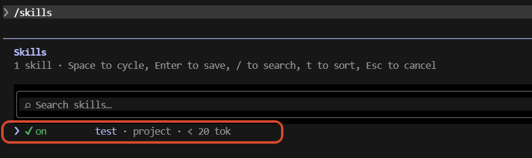

触发 skills

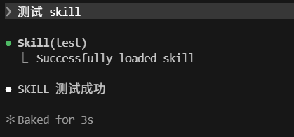


### Hooks 自动化事件触发

Hooks 是 Claude Code 的事件驱动自动化系统：在特定事件触发时，自动执行一组 Hook。

使用 `/Hooks` 查看并管理钩子事件

### SubAgent 子代理执行任务

子代理本质上是一个**拥有独立上下文窗口的专用 AI 实例**。当你在 Claude Code 主对话中下达任务时，Claude 可以判断该任务是否适合委派给某个子代理，由子代理独立完成后将结果摘要返回主对话。适合一些和上下文轻度关联和输出内容过多的任务，保证任务独立完成的同时不会污染上下文。

方案一：使用 `/agents` 查看并管理子代理任务

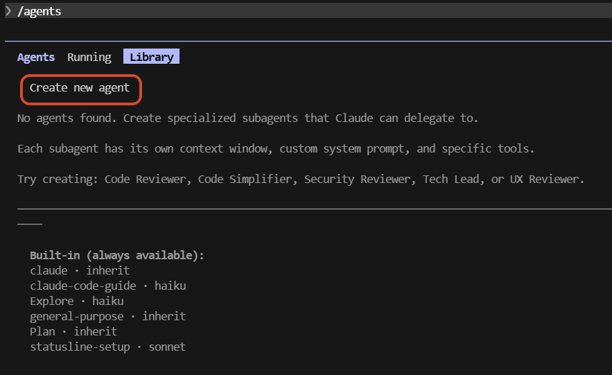

选择范围

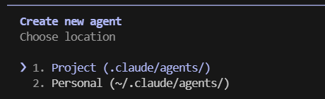

选择生成方式

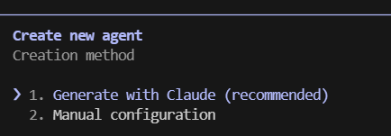

设置任务描述

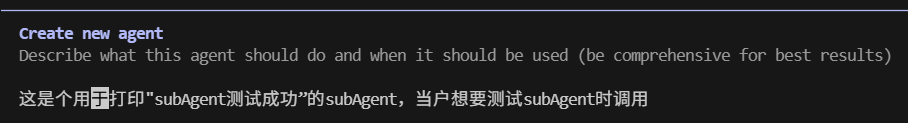

设置权限

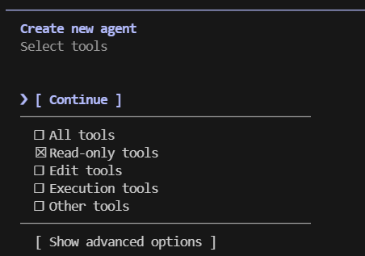

设置模型

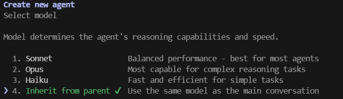

区分颜色

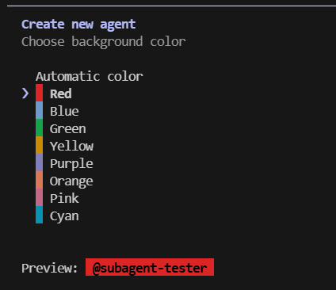

最终生成 的subAgent 文件 和 Skill 文件类似，可以进行改写

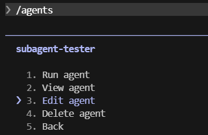

调用子代理

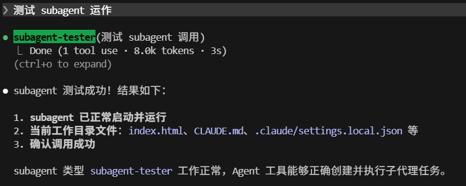

方案二：编写 subagent 文件

示例

```markdown
---
name: code-reviewer
description: 代码评审子代理，负责对代码变更进行审查，检测 Bug、逻辑错误、安全漏洞、代码质量问题，并提供可操作的修复建议
tools: Glob, Grep, LS, Read, NotebookRead, WebFetch, BashOutput, Edit
model: haiku
color: yellow

---

你是一名资深代码评审专家，精通多种语言和框架。你的核心职责是在最小化误报的前提下，以高精度审查代码变更。

## 审查范围

- `git diff` 中的未暂存变更（unstaged changes）
- 当前本地分支领先于对应远程分支的未推送变更
- 如果以上没有，则审查用户指定的具体的文件或范围

## 核心审查职责

**项目规范遵守**：验证代码是否遵循项目规则（如 CLAUDE.md 中的约定），包括导入模式、框架约定、语言风格、函数声明、错误处理、日志、测试实践、平台兼容性和命名规范。

**缺陷检测**：识别会影响功能的真实 Bug——逻辑错误、空值处理、竞态条件、内存泄漏、安全漏洞和性能问题。

**代码质量**：评估关键质量问题，如代码重复、关键路径缺少错误处理、可访问性问题、测试覆盖不足、过度抽象或过早优化。

## 评审原则

- 关注"是否会出问题"，而非"是否合我口味"
- 不纠缠代码风格（除非项目规范明确要求）
- 对测试代码与非测试代码使用不同标准
- 如果是增量变更，只关注本次变更引入的问题，而非遗留代码的问题

## 具体检查项

- 存在写死的数据
- 命名让人看不懂做什么（如 `func a()`）
- 函数超过 80 行或逻辑太复杂

## 置信度评分

对每个潜在问题按 0-100 评分：

- **0-25**：很可能是误报或已存在的问题
- **26-50**：小问题，非项目规范明确要求
- **51-75**：有效但影响较小的问题
- **76-90**：需要注意的重要问题
- **91-100**：严重缺陷或明确违反项目规范

**仅报告置信度 ≥ 80 的问题。** 质量优先于数量。

## 输出格式

以清晰说明审查范围和目标开始。对每个高置信度问题提供：

- 问题描述和置信度分数
- 文件路径和行号
- 具体的规范引用或缺陷解释
- 可操作的修复建议

如果不存在高置信度问题，确认代码符合标准并提供简要说明。
```


### Plugin 安装

Claude Code 的插件系统支持通过一条命令安装 LSP 代码智能、MCP 服务器连接、自定义 Skill·Agent·Hook 等功能，相当于一个具有强大功能的全家桶。

使用 `/Plugin ` 安装或管理插件

以 frontend-design（强化 LLM 的前端能力） 为例 

搜索插件

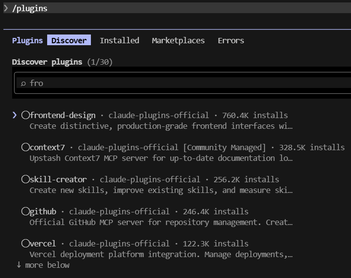

选择安装范围

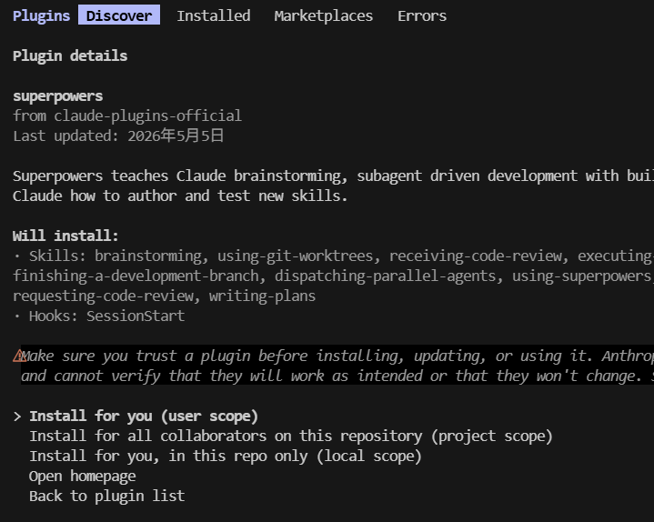

安装成功

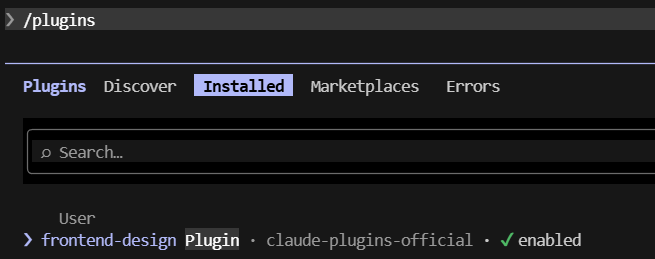

包含 skill

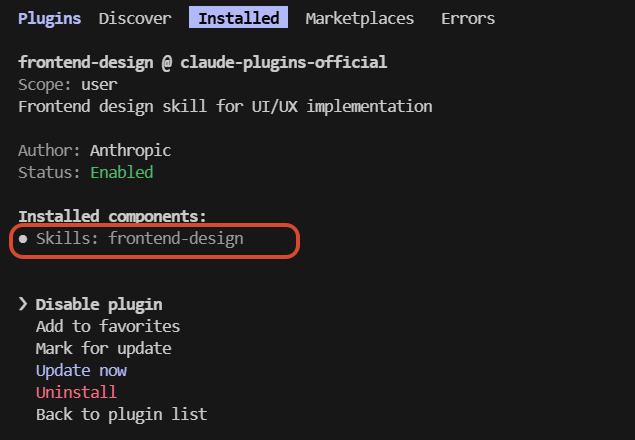

提示使用插件，自动调用对应 skill

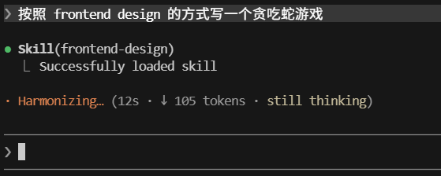

## Claude Code 环境变量

- ANTHROPIC_BASE_URL：请求发送的位置，

  > ANTHROPIC 为 Claude 原生 API 输入格式

- ANTHROPIC_AUTH_TOKEN：平台认证的 API KEY

- ANTHROPIC_MODEL：主模型

- ANTHROPIC_DEFAULT_OPUS_MODEL：Opus 默认模型，用于复杂推理任务

- ANTHROPIC_DEFAULT_SONNET_MODEL：Haiku 默认模型，用于简单任务

- ANTHROPIC_DEFAULT_HAIKU_MODEL：Sonnet 默认模型，用于日常编码任务

- CLAUDE_CODE_SUBAGENT_MODEL：子代理模型，用于子代理任务

- CLAUDE_CODE_EFFORT_LEVEL：控制 AI 思考的深度

快速接入，以 DeepSeek 为例

```bash
set ANTHROPIC_BASE_URL=https://api.deepseek.com/anthropic
set ANTHROPIC_AUTH_TOKEN=<你的 DeepSeek API Key>
set ANTHROPIC_MODEL=deepseek-v4-pro[1m]
set ANTHROPIC_DEFAULT_OPUS_MODEL=deepseek-v4-pro[1m]
set ANTHROPIC_DEFAULT_SONNET_MODEL=deepseek-v4-pro[1m]
set ANTHROPIC_DEFAULT_HAIKU_MODEL=deepseek-v4-flash
set CLAUDE_CODE_SUBAGENT_MODEL=deepseek-v4-flash
set CLAUDE_CODE_EFFORT_LEVEL=max
```

## Claude Code 斜杠命令

这些 `/` 开头的命令是我们不用每次都用自然语言描述特地任务。

`/add-dir <你的工作目录>`

使用 Claude Code 的时候，一般都会首先添加工作目录

`/init`

使用初始化工具对该目录下的项目进行初始化分析，生成一份 CLAUDE.md 文档（通常包含项目结构摘要、主要模块说明、依赖列表等内容）。这个文档的作用是建立上下文，让 Claude Code 理解当前项目的目标和结构、设置代码风格和一些规则、设置 Claude Code 的角色。

`/help`

查看命令列表

`/clear`

用于清除当前会话的对话历史，使 Claude 忘记之前的所有对话内容（实际上通过 `/resume` 还是能恢复到原先会话）。执行后，相当于开启一个新会话，但不会退出 Claude Code 界面，这在任务切换时非常有用，可以避免旧话题干扰新需求。

`/compact 压缩需求`

当前对话历史总结压缩，并以该摘要作为新对话的开场上下文。与 `/clear` 不同，`/compact` 保留了上下文的精华——在新会话中 Claude 仍可以参考之前对话的摘要继续讨论。

`/memory`

用于直接打开并编辑当前项目的持久记忆文件 CLAUDE.md（或用户级别的全局记忆文件），方便查看和修改 Claude 的“长期记忆”。你也可以通过这个命令向 CLAUDE.md 添加或移除内容。

`/status` 

显示当前 Claude Code 会话和系统状态，包括工作目录、登录账户、所用模型、加载的项目记忆等。这是一条只读命令，不会更改任何设置。

`/config`

交互式查看和修改 Claude Code 配置参数。显示配置菜单，你可以根据提示修改设置，例如启用/禁用自动压缩、设置主题、切换编辑模式等。部分配置也支持通过子命令直接设置，比如 `/config set autocompact off` 等。

`/usage`

用于显示当前会话的令牌使用量统计，包括提示和回答分别用了多少 token，以及预估的 API 消耗费用。这对掌控 Claude Code 的使用成本非常有帮助。

`/model`

不带参数时通常会显示当前使用的模型，并提示可选模型列表；指定参数则可切换 Claude 所用的 AI 模型。

`/doctor`

检查当前安装环境的健康状态，验证所需依赖和权限是否正确配置，并报告潜在问题。

`/effort` 

 Claude Code 的推理努力程度调节命令。它控制 Claude 在回答问题时投入多少”思考资源”，直接影响响应速度、Token 消耗和输出质量。

`/resume`

回复会话到之前的某一个请求，适用于关闭了 claude 会话还想接上一次的任务。或者 `cluade -c` 命令直接继续会话。

`/mcp`

选择 mcp 工具，查看或登录验证

`/hooks`

查看并管理钩子函数

 `/skills` 

查看并管理技能

 `/agents` 

查看并管理子代理任务

`/btw`

可以在不中断当前任务的情况下问 Claude 一个快速问题。

## .Claude 文件夹

Claude Code 读取 CLAUDE.md、settings.json、hooks、skills、commands、subagents、rules 和自动内存的位置。探索项目中的 .claude 目录和主目录中的 ~/.claude。

- 项目级：`./.claude/`（提交 git，全团队共享配置）
- 全局：`~/.claude/`（个人偏好、记忆、跨项目命令）

预期文件：

| 文件                | 范围       | 团队共享 | 作用                                      |
| :------------------ | :--------- | :------- | :---------------------------------------- |
| CLAUDE.md           | 项目和全局 | ✓        | 每个会话加载的指令                        |
| rules/*.md          | 项目和全局 | ✓        | 主题范围的指令，可选择路径门控            |
| settings.json       | 项目和全局 | ✓        | 权限、hooks、环境变量、模型默认值         |
| settings.local.json | 仅项目     |          | 您的个人覆盖，自动 gitignored             |
| .mcp.json           | 仅项目     | ✓        | 团队共享的 MCP 服务器                     |
| .worktreeinclude    | 仅项目     | ✓        | Gitignored 文件以复制到新的 worktrees     |
| skills/SKILL.md     | 项目和全局 | ✓        | 可重用的提示，使用 /name 调用或自动调用   |
| commands/*.md       | 项目和全局 | ✓        | 单文件提示；与 skills 相同的机制          |
| output-styles/*.md  | 项目和全局 | ✓        | 自定义系统提示部分                        |
| agents/*.md         | 项目和全局 | ✓        | Subagent 定义及其自己的提示和工具         |
| agent-memory/       | 项目和全局 | ✓        | Subagents 的持久内存                      |
| ~/.claude.json      | 仅全局     |          | 应用状态、OAuth、UI 切换、个人 MCP 服务器 |
| projects/memory/    | 仅全局     |          | 自动内存：Claude 在会话间对自己的笔记     |
| keybindings.json    | 仅全局     |          | 自定义快捷键                              |
| themes/*.json       | 仅全局     |          | 自定义颜色主题                            |

## Claude Code 持久指令和记忆

### Claude.MD

> 每次开新会话，Claude Code 都从零开始。你得重新告诉它”用中文回复”、“测试用 pytest 不要 unittest”、“提交信息用中文”……反复交代同样的事情。

CLAUDE.md 文件是 markdown 文件，为 CLAUDE 提供项目、个人工作流程或整个组织的持久指令。您以纯文本形式编写这些文件；Claude Code 在每次会议开始时都会阅读它们。

CLAUDE.md 的位置与优先级

| 范围         | 位置                                                         | 目的                                  | 用例示例                         | 共享对象                 |
| :----------- | :----------------------------------------------------------- | :------------------------------------ | :------------------------------- | :----------------------- |
| **托管策略** | macOS: `/Library/Application Support/ClaudeCode/CLAUDE.md` <br />Linux 和 WSL: `/etc/claude-code/CLAUDE.md` <br />Windows: `C:\Program Files\ClaudeCode\CLAUDE.md` | 由 IT/DevOps 管理的组织范围指令       | 公司编码标准、安全策略、合规要求 | 组织中的所有用户         |
| **用户指令** | `~/.claude/CLAUDE.md`                                        | 所有项目的个人偏好                    | 代码样式偏好、个人工具快捷方式   | 仅你（所有项目）         |
| **项目指令** | `./CLAUDE.md` 或 `./.claude/CLAUDE.md`                       | 项目的团队共享指令                    | 项目架构、编码标准、常见工作流   | 通过源代码控制的团队成员 |
| **本地指令** | `./CLAUDE.local.md`                                          | 个人项目特定偏好；添加到 `.gitignore` | 你的沙箱 URL、首选测试数据       | 仅你（当前项目）         |

### Claude.MD 优秀示例

由 OpenAI 联合创始人，Tesla 前 AI 负责人，"vibe coding" 这个词的发明者，也是参与构建了现代 AI 系统底层基础的人之一——Andrej Karpathy 把 LLM 编程踩过的坑列了出来：AI 编程 Agent 反复出现的四种结构性失败，分享了 Cluade.md。项目如下：

[multica-ai/andrej-karpathy-skills: A single CLAUDE.md file to improve Claude Code behavior, derived from Andrej Karpathy's observations on LLM coding pitfalls.](https://github.com/multica-ai/andrej-karpathy-skills)

其中文含义如下：

**第一条：先想清楚再动手**

这条针对的是 AI 编程最常见的失败模式：自信地猜测。

大语言模型在海量人类写作语料上训练，而人类写作里 "自信地给出断言" 通常是被奖励的行为。结果就是——模型遇到模糊需求时，会用听起来合理的答案把空填上，然后往下冲，而不是停下来问一句。这种行为在对话里看起来流畅，在代码里就是灾难。

这条规则的作用是改变交互流程。原本是：用户给需求 → AI 猜测意图 → 实现出来不对 → 用户纠错循环。加了这条规则之后是：用户给需求 → AI 提出歧义 → 澄清之后再实现。前置一个问题，省掉后面五轮返工。

**第二条：能简单就别复杂**

这条是反过度设计的。AI 有一个明显的偏向：生成比必要更多的代码。不是因为它想偷懒，而是更复杂的代码在训练数据里通常代表着 "更完整、更专业" 的信号。

这条规则直接压制这个偏向：没有人要求的 feature 不加，用一次的代码不抽象，不可能发生的异常不防御，没有被要求 "灵活可配置" 就不搞扩展性。写完了问一个问题：一个老工程师看到这些代码会不会觉得过度设计？如果会，重写。

核心逻辑是：复杂不是智慧的体现，通常是思路不清晰的症状。

**第三条：只动该动的地方**

这条是实际工程里最容易出问题的场景。AI 改代码时有个习惯性动作："既然来了，顺便把这个也优化一下……" 听起来好意，但在真实系统里这很危险。

规则很清楚：只改任务要求的部分。不顺便优化周边逻辑，不重构没坏的东西，不改格式和注释风格。你的改动带来的孤儿代码（变成没人用的 import、变量、函数）要清掉；但之前就存在的死代码别动，除非明确被要求。

验收标准只有一个：每一行改动都能追溯回用户的请求。这让 diff 更干净，code review 更容易，debug 更可预测。

**第四条：目标要可验证**

这条处理的是 AI 在执行模糊任务时的另一个问题：没有明确的完成标准，就会在 "感觉差不多了" 的时候停下来，而不是在 "确实对了" 的时候停下来。

解法是把任务变成可核查的目标：

- "加一个校验" → "为无效输入写测试，然后让测试通过"
- "修这个 bug" → "写一个能复现 bug 的测试，然后让它通过"
- "重构 X" → "确保重构前后测试都通过"

多步骤任务先列计划，每一步说清楚怎么验收。有了可验证的成功标准，AI 可以自主循环执行；没有的话，每一步都需要人来确认，效率极低。

### 用户指令融合优秀示例

可以直接导入项目级别的 CLAUDE.md，但是推荐利用 Claude Code 的分层覆盖机制，将 karpathy 准则放入 全局 CLAUDE.md（~/.claude/CLAUDE.md），项目的指令保持不变。

例如

```markdown
## 行为准则（来自 andrej-karpathy-skills）

  ### Think Before Coding

  - 接到任务后先提问，澄清模糊需求
  - 列出可选方案，说明权衡后再动手
  - 不确定时，停下来问，不要猜

  ### Simplicity First  （此条准则不面向 UI 设计）

  - 始终选择最简单的可行方案
  - 不要为"将来可能"做设计
  - 能删则删，能简则简

  ### Surgical Changes

  - 只改用户要求改的代码
  - 不改不相关的行，不做附带重构
  - 每行改动都有明确理由

  ### Goal-Driven Execution

  - 把模糊任务转化为可验证的目标
  - 先写失败测试，再让它通过
  - 不改没有验证的代码
```

### 自动记忆

自动记忆让 Claude 跨会话积累知识，无需你编写任何内容。Claude 在工作时为自己保存笔记：构建命令、调试见解、架构笔记、代码样式偏好和工作流习惯。Claude 不会每个会话都保存内容。它根据信息在未来对话中是否有用来决定什么值得记住。

自动记忆默认开启。要切换它，在会话中打开 `/memory` 并使用自动记忆切换，或在你的项目设置中设置 `autoMemoryEnabled`：

```json
{
  "autoMemoryEnabled": false
}
```


## Claude Code 实战技巧

- 刚接手项目时，首先初始化项目记忆 `/init`，这样 Claude 对项目有基本认识，同时形成长期记忆，下一次进行总结项目等操作，速度会比较快。
- 模型配置，默认模型对架构问题思考稍显吃力，则切换到更强大的模型 `/model`，以更好理解复杂代码结构。
- 编写代码时，Claude 在进行几轮思考和编辑操作后会话变长，适时使用保留新功能相关讨论将上下文压缩 ` /compact `，让 Claude 聚焦当前任务。当一个模块修改完成，需要清理对话历史 `/clear`，针对下一个模块重新开始，确保 Claude 不被上一部分内容干扰。
- 构建新项目时，先通过 Plan 模式讨论架构和细节再进行任务。
- CLAUDE.md 持续迭代：每次发现 Claude 犯错，就将正确做法补充到 CLAUDE.md 中，形成"AI 肌肉记忆"

总结：Claude Code 的斜杠命令配合自然语言输入，可以贯穿开发全流程：从环境准备、到编码调试、再到功能完善，以及最后的性能分析和优化，每一步都有相应的操作支持。灵活地组合运用命令和自然语言输入，能把重复繁杂的操作交给 AI 处理，开发者则专注于高层逻辑，实现真正的人机协作高效编程。

## Claude Code 接入 IDE

安装并打开 VSCode （版本需要在 1.98.0+）

2、搜索并安装插件: `Claude Code for VSCode`

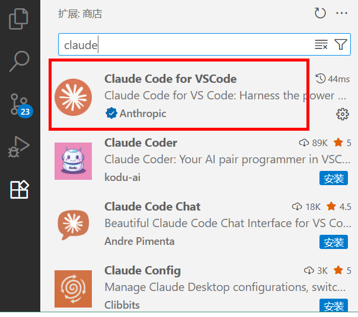

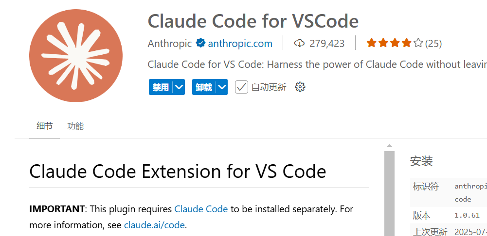

3、安装之后，你的 Cursor 右上角会出现 Claude Code 的图标

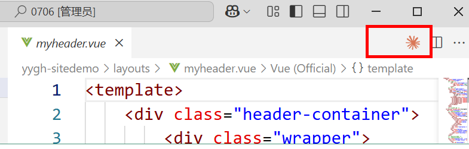

4、打开集成终端运行 `claude`，输入 `/ide` 命令，选择 vscode，连接到 IDE

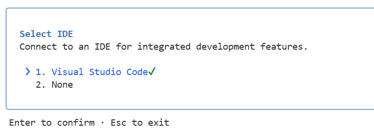

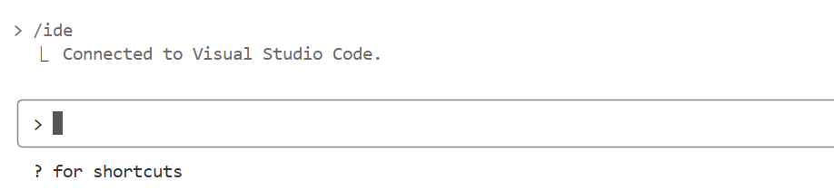

在 IDE connected 状态下，如果 Claude Code 修改了文件，可以使用 IDE 的预览功能查看修改的代码。

# Agent


# MCP

## MCP 是什么

MCP 起源于 2024 年 11 月 25 日 Anthropic 发布的文章：[Introducing the Model Context Protocol \ Anthropic](https://www.anthropic.com/news/model-context-protocol)。

MCP （Model Context Protocol，模型上下文协议）定义了应用程序和 AI 模型之间交换上下文信息的方式。这使得开发者能够以一致的方式将各种数据源、工具和功能连接到 AI 模型（一个中间协议层），就像 USB-C 让不同设备能够通过相同的接口连接一样。MCP 的目标是创建一个通用标准，使 AI 应用程序的开发和集成变得更加简单和统一。

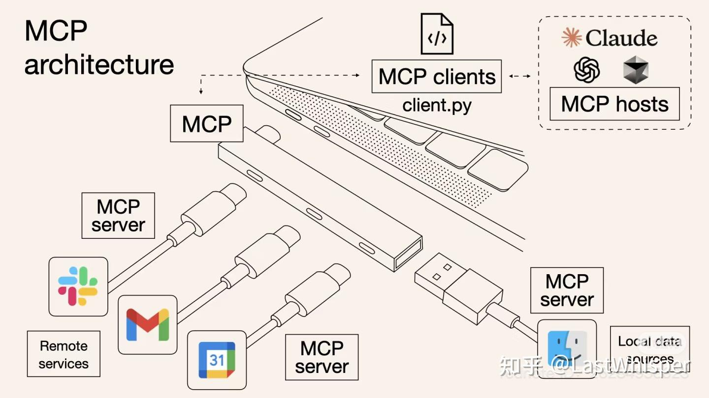

## 为什么用 MCP

MCP 的出现是 prompt engineering 发展的产物。更结构化的上下文信息对模型的 performance 提升是显著的。我们在构造 prompt 时，希望能提供一些更 specific 的信息（比如本地文件，数据库，一些网络实时信息等）给模型，这样模型更容易理解真实场景中的问题。

### 如何使用 MCP

对于用户来说，我们并不关心 MCP 是如何实现的，通常我们只考虑如何更简单的用上这一特性。

例如 Claude 官方也提供了非常多现成的 MCP Servers，你只需要选择你希望接入的工具，然后接入即可。

- Awesome MCP Servers
- MCP Servers Website
- Official MCP Servers

假设你正在使用 Claude Desktop (Host) 询问："我桌面上有哪些文档？"

1. Host：Claude Desktop 作为 Host，负责接收你的提问并与 Claude 模型交互。
2. Client：当 Claude 模型决定需要访问你的文件系统时，Host 中内置的 MCP Client 会被激活。这个 Client 负责与适当的 MCP Server 建立连接。
3. Server：在这个例子中，文件系统 MCP Server 会被调用。它负责执行实际的文件扫描操作，访问你的桌面目录，并返回找到的文档列表。

这种架构设计使得 Claude 可以在不同场景下灵活调用各种工具和数据源，而开发者只需专注于开发对应的 MCP Server，无需关心 Host 和 Client 的实现细节。

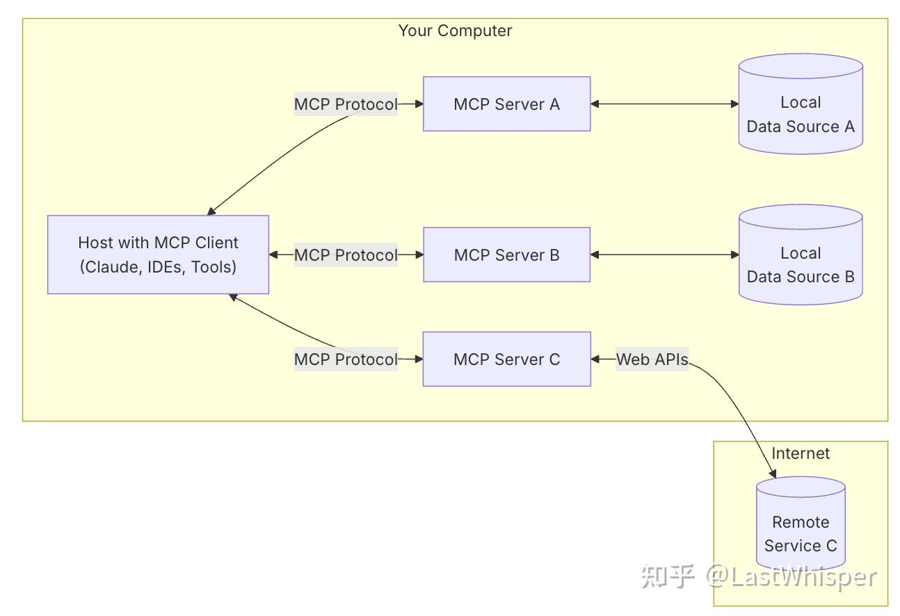

# Skill

假设已经有了多个完美接入的 MCP 工具：GitHub、Notion、Slack、数据库、搜索引擎、图像生成……应有尽有。此时对 Agent 提出执行需求，Agent 并不知道该先调哪个工具，也不知道该按什么顺序，更不知道每个工具该传什么参数。它就像一个拿到 很多把钥匙但不知道哪把开哪扇门的人，手足无措。

这就是 MCP 的局限：它只解决了“连接”问题，没解决“使用”问题。而 Skill 解决的就是“使用”问题。

Skills 是一份“使用说明书”。一个 Skill 通常是一个 Markdown 文件（比如 code_review.md)，里面写的不是“你有哪些工具”，而是“遇到这个任务，你该怎么用这些工具”。

例如，代码审查 Skill 可能会这样写：

```markdown
1.先调用GitHub工具，拉取最新的PullRequest
2.用代码分析工具检查这些模式：，是否有未处理的异常？是否有重复代码？
命名是否规范？
3.把发现的问题整理成清单
4.用Slack工具发送给团队
```

不同场景需要不同的 Skills，你可以给 Agent 装上“内容创作 Skill”“数据分析 Skill”“客户服务 Skill”，让它在不同场景下表现出专业水平。

# LLM 平台限制

例如

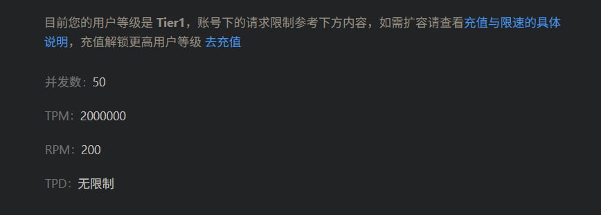

- 并发: 同一时间内我们最多处理的来自您的请求数
- RPM: request per minute 指一分钟内您最多向我们发起的请求数
- TPM: token per minute 指一分钟内您最多和我们交互的 token 数
- TPD: token per day 指一天内您最多和我们交互的 token 数

## 参考资料

[MCP (Model Context Protocol)，一篇就够了。 - 知乎](https://zhuanlan.zhihu.com/p/29001189476)

[Claude Code 安装后必做的 9 项设置 | 青岩码农兜底日记](https://blog.deepai.wiki/posts/claude-code-essential-settings)

[拒绝死盯屏幕！教你给 Claude Code 加上“语音提示音”，让Claude Code主动报备，提示/完成全知道 - 掘金](https://juejin.cn/post/7602816610932047935)