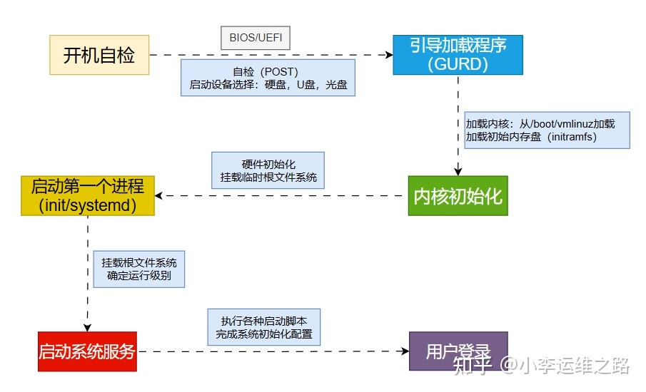
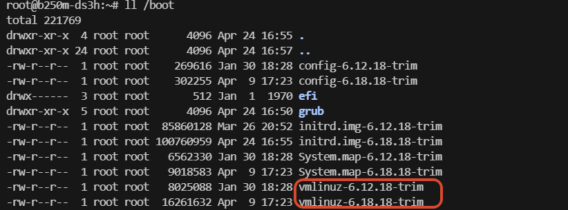
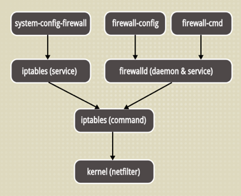
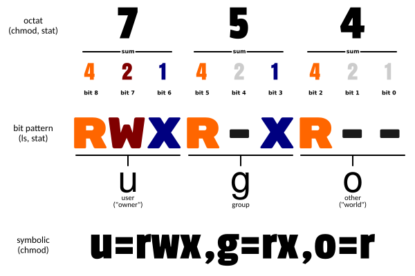
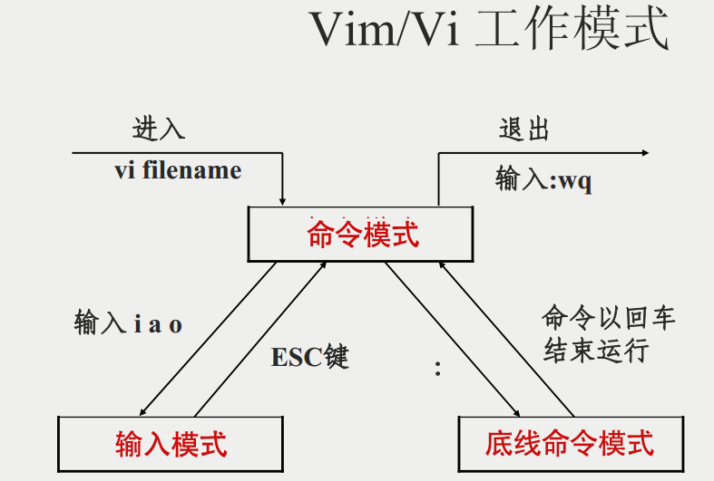
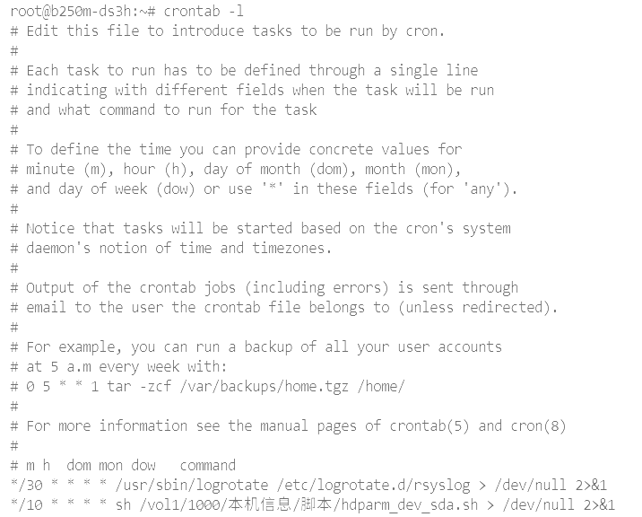

# Linux

Linux 内核最初只是由芬兰人 **林纳斯·托瓦兹（Linus Torvalds）** 在赫尔辛基大学上学时出于个人爱好而编写的。

Linux 是一套免费使用和自由传播的类 Unix 操作系统，是一个基于 POSIX 和 UNIX 的多用户、多任务、支持多线程和多 CPU 的操作系统。

Linux 能运行主要的 UNIX 工具软件、应用程序和网络协议。它支持 32 位和 64 位硬件。Linux 继承了 Unix 以网络为核心的设计思想，是一个性能稳定的多用户网络操作系统。

## Linux 发行版

### 按使用场景

**桌面**

Ubuntu、Cent OS（开源的 RedHat）、Mint、elementary OS、MX Linux、Zorin OS

**服务器**

* Ubuntu Server：基于 Debian 架构，使用 dpkg (Debian Package)管理工具/APT 包管理器。侧重于个人，注重功能与更新。
* Red Hat Enterprise Linux：基于 RHEL 架构，使用 RPM 包管理器。侧重于企业，注重稳定与轻便

### 主流发行版

* Red Hat 系：企业级的“稳定
  * RHEL：付费
  * Rocky/Alma Linux：RHEL 的免费替代品
  * CentOS Stream：RHEL 的上游开发版
* Debian/Ubuntu 系：开发者友好型
  * Debian：稳定，更新周期长
  * Ubuntu：基于 Debian，桌面和云市场
* SUSE 系：欧洲市场
  * openSUSE：社区版
  * SUSE Linux Enterprise： 企业版
* 国产系统
  * openEuler：华为开源
  * 银河麒麟：适配国产 CPU
  * 龙蜥：阿里云主导
  
  

### 查看发行版

```shell
uname -a              # 查看当前操作系统内核信息
cat /proc/version     # 正在运行的内核的信息

# 查看当前操作系统发行版信息
cat /etc/issue 
cat /etc/redhat-release
cat /etc/os-release

```


## Linux 安装

**安装 Linux**

[Download - The CentOS Project](https://www.centos.org/download/)

[Ubuntu 系统下载 | Ubuntu](https://cn.ubuntu.com/download)

**购买云服务**

云服务器(Elastic Compute Service, ECS)是一种简单高效、安全可靠、处理能力可弹性伸缩的计算服务。可迅速创建或删除发行版本可选的 Linux 实例。

**使用 WSL** 

WSL（Windows Subsystem for Linux） 是微软为 Windows 用户提供的一个子系统，它允许你在 Windows 上原生运行 Linux（不是虚拟机，不是双系统），直接使用 Bash、apt、gcc、Python、Node.js 等 Linux 工具。

## Linux 系统启动过程



### 开机自检（BIOS/UEFI）

按下开机按钮时，计算机的硬件并不会立刻开始运行操作系统，而是先进行一系列的自我检查。这一阶段由 BIOS（基本输入输出系统） 或 UEFI（统一扩展固件接口） 负责。

1. 自检（POST）：启动时，BIOS/UEFI 会对硬件进行初步检查，确保硬件设备如 CPU、内存、硬盘等能够正常工作。
2. 启动设备选择：完成硬件自检后，BIOS/UEFI 会查找引导设备（如硬盘、U 盘、光盘等）。它会根据预设的顺序选择一个设备，查找上面是否有操作系统。

> 寻找可启动设备的流程：
>
> * 传统 BIOS：以设备是硬盘/USB 为例，读取其 0 号扇区（MBR）。检查第 511、512 字节：若等于 `0x55 0xAA` 则认为“可启动”。若不是则跳过此设备。
> * 现代 UEFI：传统的 BIOS 无法识别 EFI 分区，而现代 UEFI 不依赖 MBR，而是识别 FAT 格式的 EFI 系统分区（ESP） 中的 可执行文件（通常是 .efi 文件）。

### 引导加载程序（Bootloader）

自检完成以及可启动设备找到后, 以 Legacy BIOS 为例，会去该设备的第一个扇区中读取 MBR，并跳转执行 MBR 中的引导代码，这段代码通常是加载引导加载程序（Boot loader，常用的有 GRUB 和 LILO 两种，现在常用的是 GRUB），它负责加载操作系统的内核，并将控制权交给内核。

1. 加载内核：GRUB 会从硬盘上的 /boot 分区加载 Linux 内核（通常是 vmlinuz 文件），并将其载入内存。

   

2. 加载初始内存盘：除了内核映像，GRUB 还会加载 initramfs，这是一个包含启动时所需的最小操作环境的压缩文件系统。initramfs 包含了必要的驱动程序和工具，能帮助系统在启动阶段挂载根文件系统。

### 内核初始化

内核被加载到内存后，开始接管系统

- 探测与初始化硬件、加载硬件所需驱动
- 挂载临时根文件系统：内核会使用 initramfs 作为临时根文件系统，挂载到 / 目录，这时，根文件系统中的程序和文件还没有完全加载。

### 第一个进程（init）

内核启动后，它会创建一个进程号为 1 的进程，这个进程通常是 init（在现代 Linux 系统中，init 通常是由 systemd 取代的）。init 是 Linux 系统中的第一个用户空间进程，它是所有其他用户空间进程的祖先，负责整个系统的初始化和管理。

> 如果 initramfs 被使用，它会将根文件系统切换到实际的磁盘分区。

### 启动系统服务

init 进程的一大任务，是去启动多个重要的系统服务和守护进程。init 是根据 "运行级别"，确定要运行哪些程序的。

查看运行级别

```shell
runlevel
# N 5 
# N 表示自系统启动后，运行级别尚未更改。
# 5 表示系统的当前运行级别。
```

Linux 系统有 7 个运行级别(runlevel)：

- 运行级别 0：系统停机状态，系统默认运行级别不能设为 0，否则不能正常启动
- 运行级别 1：单用户工作状态，root 权限，用于系统维护，禁止远程登录
- 运行级别 2：多用户状态(没有 NFS)
- 运行级别 3：完全的多用户状态(有 NFS)，登录后进入控制台命令行模式
- 运行级别 4：系统未使用，保留
- 运行级别 5：X11 控制台，登录后进入图形 GUI 模式
- 运行级别 6：系统正常关闭并重启，默认运行级别不能设为 6，否则不能正常启动

常见启动的服务包括：

- 网络服务：配置网络接口，分配 IP 地址，启动 DNS 等服务，确保系统可以访问网络。
- 系统日志：启动日志服务（如 rsyslog），收集并保存系统日志，方便后续查看。
- SSH 服务：如果系统允许远程访问，sshd 服务会被启动，允许用户通过 SSH 登录到系统。
- 定时任务：启动定时任务管理器（如 cron），执行预定的自动化任务。

### 登录提示符

 系统初始化完成后，init 给出用户登 录提示符（login）或者图形化登录界面

## Linux 系统目录结构

linux 目录：一切从“根”即“／”开始，“／”下面的目录是一个有层次的树状结构

树状目录结构：


### 一切皆文件

Linux 继承了 Unix "一切皆文件" 的设计理念。这意味着在 Linux 中，不仅普通文件和目录是文件，硬件设备、进程信息、网络连接等都被抽象为文件。这种统一的抽象让系统管理变得异常优雅。

例，查看 CPU 信息

```bash
cat /proc/cpuinfo
```

例，向串口设备发送数据

```bash
echo "Hello" > /dev/ttyS0
```

### FHS 标准

在 Linux 中，根目录下的目录内容都会相对固定的，而且，每个目录放置什么内容都是有规定约束的。这个标准称为 FHS（Filesystem Hierarchy Standard）。

文件系统层次化标准（FHS）就是 Linux 目录结构的行业标准。

FHS 的核心在于确定每个特定的目录下应该放什么内容的文件和数据，并希望 Linux 用户能够遵循该准则。遵循 FHS 标准来放置文件，有利于用户自己能够判断安装和存放文件的位置。

FHS 定义了两层规范：

* 第一层：规定根目录下各目录的功能。例如/etc 应该要放置设置文件，/bin 与/sbin 则应该要放置可执行文件等等。
* 第二层：规定/usr 和/var 的子目录用途。例如/var/log 放置系统登录文件、/usr/share 放置共享数据等等。

### 目录详解

**根目录**

* `/` 是根文件系统，所有挂载点与路径的起点。包含系统必须的子目录与入口结构。无具体数据文件。

**系统指令区**

* `/bin`（Binary）存放着所有用户都能使用的基本命令，如 `ls`、`cp`、`mv` 等。这些命令在系统启动和单用户模式下必须可用。
* `/sbin`（System Binary）则存放系统管理员使用的命令，如 `fdisk`、`reboot` 、`shutdown` 等。普通用户通常无法执行这些命令。

> 在现代 Linux 系统中，/bin 实际上是/usr/bin 的符号链接，/sbin 是/usr/sbin 的符号链接。这种改变简化了系统结构，但理解传统划分仍然很重要。

**配置中心**

* `/etc` 统一存放所有服务和系统配置。如 `firewalld`、`nginx`
  * `/etc/profile`：全局环境变量)
  * `/etc/hosts`：ip 与域名
  * /`etc/resolv.conf`：DNS 的配置文件，网卡配置文件优先 resolv.conf
  * `/etc/systemd`：systemd 服务配置（现代 Linux 的标配）
  * `/etc/nginx`：Nginx 配置文件
  * `/etc/ssh`：SSH 服务配置
  * `/etc/cron.d`：定时任务配置
  * `/etc/sysconfig`：系统服务的配置文件（Red Hat 系）


**用户目录**

* `/home` 内每个普通用户都有自己工作空间的目录。用户的个人文件、配置、桌面环境设置都存储在这里。
* `/root` 是 root 用户的家目录。出于安全考虑，它没有放在/home 下，而是直接位于根目录下。这里通常存放着系统管理脚本和 root 用户的配置文件。

**启动**

* `/boot` 包含 Linux 内核及系统引导程序所需的文件目录。

**设备**

* `/dev` 包含所有设备文件。在 Linux 中，硬件设备被抽象为文件，通过读写这些文件来控制硬件。
  * `/dev/sd*`：硬盘设备
  * `/dev/nvme*`：硬盘设备
  * `/dev/null`： 黑洞设备，丢弃所有写入的数据 
  * `/dev/zero`：零设备，提供无限的零字节 
  * `/dev/random` ：随机数生成器 
  * `/dev/tty*`：终端设备


**内核**

皆为虚拟文件系统，不占用磁盘空间，提供了内核和进程的运行时信息。

* `/proc`：系统与进程的实时信息。
  * `/proc/cpuinfo`：CPU 信息
  * `/proc/meminfo`：内存信息
  * `/proc/[PID]/status`：某个进程的详细信息
  * `/proc/version`：内核版本
  * `/proc/mounts`：系统挂载信息
  * `/proc/interrupts`：中断信息
* `/sys`：设备、驱动、内核子系统的状态接口。

**第三方软件**

* `/opt`（option）用于安装第三方软件包。许多商业软件倾向于安装在这里，保持与系统软件的隔离。

**临时中转**

* `/tmp` 存放临时文件，有时用户运行程序的时候，会产生临时文件。/tmp 就用来存放临时文件的，权限比较特殊。`/var/tmp` 目录和这个目录相似。

**挂载**

* `/mnt` 一般用于临时挂载存储设备的挂载目录，比如，cdrom，u 盘等目录。直接插入光驱无法使用，要先挂载后使用
* `/media` 是自动挂载外接设备的默认位置。

### FHS 第二层

**Unix 系统资源**

* `/usr` 在历史上最初是 用户家目录（user 的缩写），但随着 /home 的引入，其功能逐渐转变为 *Unix System Resource*（Unix 系统资源）存放地。是 Linux 系统中最大的目录之一，包含了大量的程序和文件。
  * `/usr/bin`：用户命令或常规用户程序
  * `/usr/sbin`：系统管理命令或系统管理工具
  * `/usr/lib`：程序所依赖的动态库与模块，如各类 `.so` 动态库
  * `/usr/local`：本地安装的软件（编译安装的默认位置）
  * `/usr/share`：架构无关的共享数据
  * `/usr/include`：C/C++ 等编译所需的头文件。
  * `/usr/src`：内核源代码及相关文件，/usr/src/linux 常用于内核编译。

**动态信息**

* `/var`（Variable）存放经常变化的文件，如日志、缓存、邮件队列等。这是运维工程师最常打交道的目录之一。
  * `/var/log`：日志文件中心
  * `/var/lib`：服务的持久化状态数据。
  * `/var/cache`：应用和包管理器缓存。

## 磁盘/目录管理

### mkdir 命令

```shell
# 建立目录
mkdir testdir
# 
mkdir -p testdir/testdir2
```

### df 命令

df（display free disk space） 命令用于显示文件系统的磁盘空间使用情况，包括总容量、已用空间、可用空间和挂载点等信息。

| 参数                          | 说明                                                     |
| :---------------------------- | :------------------------------------------------------- |
| **`-a`**, `--all`             | 显示所有文件系统，包括虚拟文件系统（如 `proc`, `sysfs`） |
| **`-B`**, `--block-size=SIZE` | 指定显示单位（如 `-BK` = KB，`-BM` = MB，`-BG` = GB）          |
| **`-h`**, `--human-readable`  | 以易读格式显示（自动转换单位：K, M, G, T，基于 1024）    |
| **`-H`**, `--si`              | 类似 `-h`，但以 1000 为换算单位（符合 SI 标准）          |
| **`-i`**, `--inodes`          | 显示 inode 使用情况（而非磁盘空间）                      |
| **`-k`**                      | 以 1KB 为单位显示（默认单位）                            |
| **`-m`**                      | 以 1MB 为单位显示（部分系统支持）                        |
| **`-l`**, `--local`           | 仅显示本地文件系统（排除网络文件系统如 NFS）             |
| **`--total`**                 | 显示总计信息                                             |

### tree 命令

Linux tree命令用于以树状图列出目录的内容。

- `-a` 显示所有文件和目录。
- `-C` 在文件和目录清单加上色彩，便于区分各种类型。
- `-L` level 限制目录显示层级。
- `-s` 列出文件或目录大小。

## 软件包管理

### apt-get 命令

`apt-get` 是 Debian 和 Ubuntu 等基于 Debian 的 Linux 发行版中用于管理软件包的核心命令行工具，用于处理 `.deb` 格式的软件包。它能够自动解决软件包之间的依赖关系，简化了 Linux 系统的软件管理。

目前还没有任何 Linux 发行版官方放出 apt-get 将被停用的消息，至少它还有比 apt 更多、更细化的操作功能。对于低级操作，仍然需要 apt-get。

```shell
# 清理缓存
apt-get clean # 删除 /var/cache/apt/archives目录中的所有内容

# 彻底卸载软件
apt-get --purge remove <package>				# 删除软件及其配置文件
apt-get autoremove <package>					# 删除没用的依赖包
dpkg -l |grep ^rc|awk '{print $2}' |sudo xargs dpkg -P		# 清理dpkg的列表中有“rc”状态的软件包
```

### apt 命令

apt（Advanced Packaging Tool）是一个在 Debian 和 Ubuntu 中的 Shell 前端软件包管理器。

apt 命令执行需要超级管理员权限(root)。

```shell
# 连接到配置的软件源，检查更新
sudo apt update
# 常与update搭配 列出可更新的软件包
apt list --upgradeable
# 升级安装包
sudo apt upgrade 
# 一键升级 -y表示当安装过程提示选择全部为"yes"
sudo apt update && sudo apt upgrade -y


# 安装  包名不完整，按下Tab 键，会列出相关的包名
sudo apt install xxx
# 仅升级，不存在不安装
sudo apt install xxx --only-upgrade
# 仅安装，存在不升级
sudo apt install xxx --no-upgrade
# 安装某版本
sudo apt install xxx=<version_number>

# 查找存在的包
apt search xxx
# 获取包的详细信息
apt show xxx

# 移除包
sudo apt remove xxx
# 清理不再使用的依赖和库文件
sudo apt autoremove

```

选项包括 `-h`（帮助），`-y`（当安装过程提示选择全部为 "yes"），`-q`（不显示安装的过程）等等。

### yum 命令

yum（ Yellow dog Updater, Modified）是一个在 Fedora 和 RedHat 以及 SUSE 中的 Shell 前端软件包管理器。

基于 RPM 包管理，能够从指定的服务器自动下载 RPM 包并且安装，可以 **自动处理依赖性关系**，并且一次安装所有依赖的软件包，无须繁琐地一次次下载、安装。

## 服务管理

### service 命令

`service` 是 Linux 系统中用于管理系统服务的命令行工具。它提供了一种标准化的方式来启动、停止、重启和检查系统服务的状态。

```
service [服务名] [操作指令]
```

**服务管理命令**

```shell
service [服务名] start # 启动服务
service [服务名] stop # 停止服务
service [服务名] restart # 重启服务
service [服务名] reload # 重新加载配置文件(不重启服务)
service [服务名] status # 查看服务状态
service --status-all # 列出所有服务状态
```

### systemctl 命令

systemctl 是 Linux 系统中用于控制 systemd 系统和服务管理器的命令行工具。作为现代 Linux 发行版的核心组件，它取代了传统的 init 系统和 service 命令。

```
systemctl [选项] [命令] [单元名称]
```

**服务管理命令**

```shell
# 启动服务
sudo systemctl start [服务名]
# 停止服务
sudo systemctl stop [服务名]
# 重启服务
sudo systemctl restart [服务名]
# 重新加载配置（不重启服务）
sudo systemctl reload [服务名]

# 查看单个服务状态
systemctl status [服务名]
# 查看所有运行中的服务
systemctl list-units --type=service --state=running
# 查看失败的服务
systemctl --failed

# 启用服务（开机自启）
sudo systemctl enable [服务名]
# 禁用服务（取消开机自启）
sudo systemctl disable [服务名]
# 查看服务是否启用
systemctl is-enabled [服务名]
```

**服务资源 Unit**

单元文件位置：

* 系统单元：`/usr/lib/systemd/system/`
* 管理员自定义单元：`/etc/systemd/system/`

主要有四种类型文件 `.mount`, `.service`, `.target`, `.wants`

* `.mount` 文件定义了一个挂载点，[Mount] 节点里配置了 What, Where, Type 三个数据项

* `.service` 文件定义了一个服务，分为 [Unit]，[Service]，[Install] 三个小节

```ini
[Unit]
Description:描述，

After：在network.target,auditd.service启动后才启动

ConditionPathExists: 执行条件

[Service]

EnvironmentFile:变量所在文件

ExecStart: 执行启动脚本

Restart: fail时重启

[Install]

Alias:服务别名

WangtedBy: 多用户模式下需要的
```

* `.target` 定义了一些基础的组件，供 `.service` 文件调用
* `.wants` 文件定义了要执行的文件集合，每次执行，`.wants` 文件夹里面的文件都会执行

**单元文件操作命令**

```shell
# 重新加载所有单元文件（修改配置后需要执行）
sudo systemctl daemon-reload

# 显示单元文件内容
systemctl cat [单元名]

# 编辑单元文件（会创建覆盖文件）
sudo systemctl edit [单元名] --full
```

主要用于创建自定义服务

**系统状态管理命令**

```shell
# 关机
systemctl poweroff
# 重启
systemctl reboot
# 挂起
systemctl suspend
# 休眠
systemctl hibernate
```

## 网络通讯

### curl 命令

curl（Client URL）是一个强大的命令行工具，用于在 Linux/Unix 系统中传输数据。它支持多种协议，包括 HTTP、HTTPS、FTP、SFTP 等，是开发者和系统管理员日常工作中不可或缺的工具。

```shell
curl [options] [URL...]
# options：各种可选参数，用于控制 curl 的行为
# URL：要访问的一个或多个网址

# 发送 POST 请求
curl -X POST -d "username=admin&password=123456" https://api.example.com/login
```

**基本参数**

1. 基本请求控制

| 选项 | 说明                              | 示例                                                       |
| :--- | :-------------------------------- | :--------------------------------------------------------- |
| `-X` | 指定 请求方法 默认为 GET           | `curl -X POST https://example.com`                         |
| `-d` | 指定 请求体参数 body               | `curl -d "name=John" https://example.com`                  |
| `-G` | 将 -d 数据作为 查询参数 query 发送 | `curl -G -d "q=keyword" https://search.com`                |
| `-H` | 添加 请求头                       | `curl -H "Content-Type: application/json" https://api.com` |

2. 输出控制

| 选项 | 说明                   | 示例                                       |
| :--- | :--------------------- | :----------------------------------------- |
| `-o` | 将输出保存到文件       | `curl https://example.com -o output.html ` |
| `-O` | 使用远程文件名保存     | `curl -O https://example.com/file.zip`     |
| `-s` | 静默模式（不显示进度） | `curl -s https://api.com/data.json`        |
| `-v` | 显示详细通信过程       | `curl -v https://example.com`              |

3. 认证与安全

| 选项       | 说明              | 示例                                        |
| :--------- | :---------------- | :------------------------------------------ |
| `-u`       | 用户名密码认证    | `curl -u user:pass https://secure.com`      |
| `-k`       | 忽略 SSL 证书验证 | `curl -k https://self-signed.com`           |
| `--cacert` | 指定 CA 证书      | `curl --cacert cert.pem https://secure.com` |

4. 其他实用选项

| 选项           | 说明                                                    | 示例                                                         |
| :------------- | :------------------------------------------------------ | :----------------------------------------------------------- |
| `-L`           | 跟随重定向                                              | `curl -L https://short.url`                                  |
| `-I`           | 只获取头部信息                                          | `curl -I https://example.com`                                |
| `--limit-rate` | 限制传输速度                                            | `curl --limit-rate 100K https://largefile.com`               |
| `-F`           | 用于 multipart/form-data 类型的表单提交，常用于文件上传 | `curl -F "file=@localfile.txt" https:**//**upload.example.com` |

## 防火墙

防火墙技术根据管理员设定的规则来控制数据包的进出。主要保护内网安全。

两大 Linux 防火墙

- firewalld：CentOS 7 及以后版本的默认防火墙管理工具
- iptables：传统的 Linux 防火墙管理工具

>  iptables 和 firewalld 不是真正的防火墙，是指用来定义防火墙规则功能的“防火墙管理工具/程序”，将定义好的规则交给内核的 netfiler 即网络过滤器来读取，从而实现防火墙的功能。
>
>  在配置防火墙时，不建议两种配置方法结合使用（建议只使用其中的一种）
>
>  

### iptables

静态防火墙

- 早期的 Linux 默认使用 iptables 防火墙，配置文件在/etc/sysconfig/iptables。主要工作在网络层
- 该防火墙只能过滤互联网的数据包，无法对内网到内网进行过滤
- iptables 只有命令模式
- **iptables 默认允许**，通过添加拒绝来限制
- iptables 修改规则后刷新才能生效。无法守护进程

基本操作

   ```bash
# 查看防火墙状态
service iptables status 
# 停止防火墙
service iptables stop 
# 启动防火墙
service iptables start 
# 重启防火墙
service iptables restart 
# 永久关闭防火墙
chkconfig iptables off 
# 永久关闭后重启
chkconfig iptables on　　
   ```

 开启 80 端口

   ```bash
vim /etc/sysconfig/iptables
# 加入如下代码
-A INPUT -m state --state NEW -m tcp -p tcp --dport 80 -j ACCEPT
保存退出后重启防火墙

service iptables restart
   ```

### Firewalld 

动态防火墙

特点：

- 取代了 iptabels 防火墙，配置文件在/usr/lib/firewalld 和/etc/firewalld 主要工作在网络层
- 不仅可以过滤互联网数据包，也可以过滤内网数据包
- firewalld 支持命令和图形化配置
- **firewalld 默认为拒绝所有**
- firewalld 可以动态更新策略，（允许更新策略而不破环现有会话）


查看 firewall 服务状态

```bash
systemctl status firewalld
# 出现 Active: active (running)切高亮显示则表示是启动状态。
# 出现 Active: inactive (dead)灰色表示停止，看单词也行。
```

查看 firewall 的状态

   ```bash
firewall-cmd --state
   ```

   3、开启、重启、关闭、firewalld.service 服务

   ```bash
# 开启
service firewalld start
# 重启
service firewalld restart
# 关闭
service firewalld stop
   ```

   4、查看防火墙规则

   ```bash
firewall-cmd --list-all
   ```

   5、查询、开放、关闭端口

   ```bash
# 查询端口是否开放
firewall-cmd --query-port=8080/tcp
# 开放80端口
firewall-cmd --zone=public --add-port=80/tcp --permanent
# 移除端口
firewall-cmd --permanent --remove-port=8080/tcp
#重启防火墙(修改配置后要重启防火墙)
firewall-cmd --reload
   ```

## 环境变量

环境变量一般指的是在操作系统中用于指定操作系统运行环境的一些参数。

### 环境变量是如何产生

在大多数 Linux 发行版 bash 环境中，用户的环境文件通常是 `~/.bashrc` 或 `~/.bash_profile`。当 bash 进程启动（登录 Shell 加载 `.bash_profile`，交互式非登录 Shell 加载 `.bashrc`），就会根据配置文件生成环境变量表。 

| 加载阶段    | 对应配置文件                  | 说明                       |
| :---------- | :---------------------------- | :------------------------- |
| 系统级      | /etc/profile                  | 系统级初始化脚本，最先执行 |
| 用户级      | ~/.bash_profile 或 ~/.profile | 用户登录时执行             |
| 交互式 Shell | ~/.bashrc                     | 每次打开终端时执行         |

#### 环境变量——PATH

PATH 环境变量可以用来帮助 shell 找到系统命令。

```shell
echo $PATH
```

例如当我们执行： ls -a -l 指令，Shell 本身不知道 ls 存放在哪个目录，会按顺序遍历 PATH 环境变量中所有以冒号分隔的目录去找对应的文件。因此，当我们执行 ls，pwd 等命令时，不再需要输入完整的程序路径，只需要输入指令即可。

```shell
# 覆盖系统默认的PATH的内容。
PATH=相关路径 
# 为PATH添加路径
PATH=$PATH:相关路径
```

### 添加和删除环境变量

**临时添加**

```shell

# 1. 添加普通环境变量（如 MY_VAR=值）
export MY_VAR="hello"
 
# 2. 添加路径到 PATH（比如把你的 test 目录加入 PATH）
export PATH=$PATH:/home/hds/code/lesson13

# 删除变量
unset name
```

**永久添加**

需编辑对应 Shell 的配置文件

```shell
# 1. 编辑 ~/.bashrc（交互式终端默认加载，最常用）
vim ~/.bashrc

# 2. 添加普通环境变量
export MY_VAR="hello"
export PATH=$PATH:/home/hds/code/lesson13
 
# 3. 使配置生效
source ~/.bashrc
```

### env 命令

env 命令主要用于显示和修改环境变量，以及在自定义环境中运行程序。

## 文件操作

### more less 命令

more 命令类似 cat ，不过会以一页一页的形式显示，更方便使用者逐页阅读，而最基本的指令就是按空白键（space）就往下一页显示，按 b 键就会往回（back）一页显示，而且还有搜寻字串的功能（与 vi 相似），使用中的说明文件，请按 h 。

- -s 当遇到有连续两行以上的空白行，就代换为一行的空白行

less 与 more 类似，less 可以随意浏览文件，支持翻页和搜索，支持向上翻页和向下翻页。

### chmod 命令

chmod（change mode）命令是控制用户对文件的权限的命令，它控制文件所有者、所属组和其他用户对文件的访问权限。

只有文件所有者和超级用户可以修改文件或目录的权限。

Linux/Unix 的文件调用权限分为三级 : 文件所有者（Owner）、用户组（Group）、其它用户（Other Users）。

文件或目录的权限位是由 9 个权限位来控制，每三位为一组，它们分别是文件所有者（User）的读、写、执行，用户组（Group）的读、写、执行以及其它用户（Other）的读、写、执行。


```
chmod [选项] 权限模式 文件...
chmod [选项] --reference=参考文件 文件...
```

权限模型的表达方式有两种：符号模式（ugoa +/-/= 权限）和绝对模式（八进制语法）



常用绝对模式组合:

* 755: rwxr-xr-x
* 644: rw-r--r--
* 700: rwx------

若用 `chmod 4755 filename` 可使此程序具有 root 的权限。

```shell
# 符号模式
chmod ug+w,o-w file1.txt file2.txt # 设置文件 file1.txt 与 file2.txt 的权限 该文件拥有者，与其所属同一个群体者可写入，但其他以外的人则不可写入 

# 绝对模式
chmod 777 file
```

### ln 命令

ln（link files）命令的功能是为某一个文件在另外一个位置建立一个同步的链接。

* 软链接：以路径的形式存在。类似于 Windows 操作系统中的快捷方式。可以跨文件系统。可以对目录进行链接。可以链接不存在的文件。
* 硬链接：以文件副本的形式存在。但不占用实际空间。不允许给目录创建硬链接。硬链接只有在同一个文件系统中才能创建

```
ln [参数][源文件或目录][目标文件或目录]
```

参数：

- --backup [= CONTROL] 备份已存在的目标文件
- -b 类似 --backup ，但不接受参数
- -d 允许超级用户制作目录的硬链接
- -f 强制执行
- -i 交互模式，文件存在则提示用户是否覆盖
- -n 把符号链接视为一般目录
- -s 软链接(符号链接)，默认是硬链接
- -v 显示详细的处理过程

## 文档编辑

### vi / vim 使用

vi  是几乎所有的 Unix Like 系统都会内建的文书编辑器，而 Vim 是从 vi 发展出来的一个文本编辑器。代码补全、编译及错误跳转等方便编程的功能特别丰富，在程序员中被广泛使用。

简单的来说， vi 是老式的字处理器，不过功能已经很齐全了，但是还是有可以进步的地方。 vim 则可以说是程序开发者的一项很好用的工具。

基本上 vi/vim 共分为三种模式，**命令模式（Command Mode）、输入模式（Insert Mode）和命令行模式（Command-Line Mode）**。



命令模式：

- `i`：切换到输入模式，在光标当前位置开始输入文本。
- `x`：删除当前光标所在处的字符。
- `:`：切换到底线命令模式，以在最底一行输入命令。
- `a`：进入插入模式，在光标下一个位置开始输入文本。
- `o`：在当前行的下方插入一个新行，并进入插入模式。
- `O` ：在当前行的上方插入一个新行，并进入插入模式。
- `dd`：剪切当前行。
- `yy`：复制当前行。
- `p`：粘贴剪贴板内容到光标下方。
- `P`：粘贴剪贴板内容到光标上方。
- `u` ：撤销上一次操作。
- `Ctrl + r` ：重做上一次撤销的操作。
- `/`：向光标之下寻找一个字符串
- `?`：向光标之上寻找一个字符串

输入模式：使用 `Esc` 键可以返回到普通模式。

底线命令模式：

- `:w`：保存文件。
- `:q`：退出 Vim 编辑器。
- `:wq`：保存文件并退出 Vim 编辑器。
- `:q!`：强制退出 Vim 编辑器，不保存修改。

键位：


### sed 命令

Linux sed 命令是利用脚本来处理文本文件。sed 可依照脚本的指令来处理、编辑文本文件。

## 定时任务

### crontab 命令

Linux crontab 是 Linux 系统中用于设置周期性被执行的指令的命令。

**crond** 命令每分钟会定期检查是否有要执行的工作，如果有要执行的工作便会自动执行该工作。

> **注意：** 新创建的 cron 任务，不会马上执行，至少要过 2 分钟后才可以，当然你可以重启 cron 来马上执行。

```shell
# 查看当前用户的 crontab 文件
crontab -l
# 编辑当前用户的 crontab 文件
crontab -e
# 删除当前用户的 crontab 文件
crontab -r
# 列出某个用户的 crontab 文件（需要有相应的权限）
crontab -u username -l
# 编辑某个用户的 crontab 文件（需要有相应的权限）
crontab -u username -e
```



**定时任务格式**

```shell
f1 f2 f3 f4 f5 program
# * 表示每个单位时间都要执行program
# */n 表示每n个时间单位都要执行program
# a-c 表示从第a时间单位到第c时间单位都要执行program
# a,b,c 表示第a时间单位,第b时间单位,第c时间单位时要执行program
```


**例子**

```
0 */2 * * * /sbin/service httpd restart  意思是每两个小时重启一次apache 

50 7 * * * /sbin/service sshd start  意思是每天7：50开启ssh服务 

50 22 * * * /sbin/service sshd stop  意思是每天22：50关闭ssh服务 

0 0 1,15 * * fsck /home  每月1号和15号检查/home 磁盘 

1 * * * * /home/bruce/backup  每小时的第一分执行 /home/bruce/backup这个文件 

00 03 * * 1-5 find /home "*.xxx" -mtime +4 -exec rm {} \;  每周一至周五3点钟，在目录/home中，查找文件名为*.xxx的文件，并删除4天前的文件。

30 6 */10 * * ls  意思是每月的1、11、21、31日是的6：30执行一次ls命令
```

> **注意：** 当程序在你所指定的时间执行后，系统会发一封邮件给当前的用户，显示该程序执行的内容，若是你不希望收到这样的邮件，请在每一行空一格之后加上 **> /dev/null 2 >&1** 即可

**脚本无法执行问题**

如果我们使用 crontab 来定时执行脚本，无法执行，但是如果直接通过命令（如：./test.sh)又可以正常执行，这主要是因为无法读取环境变量的原因。

1. 所有命令需要写成绝对路径形式，如: **/usr/local/bin/docker**。

2. 在 shell 脚本开头使用以下代码：

   ```shell
   #!/bin/sh
   
   . /etc/profile
   . ~/.bash_profile
   ```

## 系统管理与设置

### date 命令

```shell
date [OPTION]... [+FORMAT]
```

**OPTION**

- **-d, --date = STRING**：通过字符串显示时间格式，字符串不能是'now'。
- **-f, --file = DATEFILE**：类似于--date; 一次从 DATEFILE 处理一行。
- **-I [FMT], --iso-8601 [= FMT]**：按照 ISO 8601 格式输出时间，FMT 可以为'date'(默认)，'hours'，'minutes'，'seconds'，'ns'。 可用于设置日期和时间的精度，例如：2006-08-14T02:34:56-0600。
- **-R, --rfc-2822** ： 按照 RFC 5322 格式输出时间和日期，例如: Mon, 14 Aug 2006 02:34:56 -0600。
- **--rfc-3339 = FMT**：按照 RFC 3339 格式输出，FMT 可以为'date', 'seconds','ns'中的一个，可用于设置日期和时间的精度， 例如：2006-08-14 02:34:56-06:00。
- **-r, --reference = FILE**：显示文件的上次修改时间。
- **-s, --set = STRING**：根据字符串设置系统时间。
- **-u, --utc, --universal**：显示或设置协调世界时(UTC)。
- **--help**：显示帮助信息。
- **--version**：输出版本信息。

**FORMAT** 

```
%%   输出字符 %
%a   星期几的缩写 (Sun..Sat)
%A   星期的完整名称(Sunday..Saturday)。 
%b   缩写的月份名称（例如，Jan）
%B   完整的月份名称（例如，January）
%c   本地日期和时间（例如，Thu Mar  3 23:05:25 2005）
%C   世纪，和%Y类似，但是省略后两位（例如，20）
%d   日 (01..31)
%D   日期，等价于%m/%d/%y
%e   一月中的一天，格式使用空格填充，等价于%_d
%F   完整的日期；等价于 %Y-%m-%d
%g   ISO 标准计数周的年份的最后两位数字
%G   ISO 标准计数周的年份，通常只对%V有用
%h   等价于 %b
%H   小时 (00..23)
%I   小时 (01..12)
%j   一年中的第几天 (001..366)
%k   小时，使用空格填充 ( 0..23); 等价于 %_H
%l   小时, 使用空格填充 ( 1..12); 等价于 %_I
%m   月份 (01..12)
%M   分钟 (00..59)
%n   新的一行，换行符
%N   纳秒 (000000000..999999999)
%p   用于表示当地的AM或PM，如果未知则为空白
%P   类似 %p, 但是是小写的
%r   本地的 12 小时制时间(例如 11:11:04 PM)
%R   24 小时制 的小时与分钟; 等价于 %H:%M
%s   自 1970-01-01 00:00:00 UTC 到现在的秒数
%S   秒 (00..60)
%t   插入水平制表符 tab
%T   时间; 等价于 %H:%M:%S
%u   一周中的一天 (1..7); 1 表示星期一
%U   一年中的第几周，周日作为一周的起始 (00..53)
%V   ISO 标准计数周，该方法将周一作为一周的起始 (01..53)
%w   一周中的一天（0..6），0代表星期天
%W   一年中的第几周，周一作为一周的起始（00..53）
%x   本地的日期格式（例如，12/31/99）
%X   本地的日期格式（例如，23:13:48）
%y   年份后两位数字 (00..99)
%Y   年
%z   +hhmm 格式的数值化时区格式（例如，-0400）
%:z  +hh:mm 格式的数值化时区格式（例如，-04:00）
%::z  +hh:mm:ss格式的数值化时区格式（例如，-04:00:00）
%:::z  数值化时区格式，相比上一个格式增加':'以显示必要的精度（例如，-04，+05:30）
%Z  时区缩写 （如 EDT）
```

### free 命令

free 命令用于显示内存状态。

* -b 　以 Byte 为单位显示内存使用情况。
* -k 　以 KB 为单位显示内存使用情况。
* -m 　以 MB 为单位显示内存使用情况。
* -h 　以合适的单位显示内存使用情况，最大为三位数，自动计算对应的单位值。单位有：

```
B = bytes
K = kilos
M = megas
G = gigas
T = teras
```

# Linux 常用综合操作

## 查看 Linux 内核信息

```shell
cat /proc/version # 内核与发行版信息
uname -a # 内核与发行版信息
cat /etc/*-release # 查看发行版信息
```


## 安装 SSH 服务

```shell
# 更新软件包列表
sudo apt update

# 安装OpenSSH服务器
sudo apt install openssh-server

# 启动SSH服务
sudo systemctl start ssh

# 设置开机自动启动
sudo systemctl enable ssh

# 检查服务状态
sudo systemctl status ssh

# 备份原始配置文件
sudo cp /etc/ssh/sshd_config /etc/ssh/sshd_config.backup

# 编辑配置文件
sudo nano /etc/ssh/sshd_config
```

### 免密登录 SSH 连接

```shell
ssh -V # 查看版本 使用不同的命令
# openssh（SSH）： ssh-keygen   或者   ssh-keygen -t rsa
# SSH2 ： ssh-keygen2 -t rsa

# 当前主机
ssh-keygen # 创建公钥和密钥。
# 接着 把本地主机的公钥复制到远程主机的authorized_keys文件上。

# 远程主机
mv .ssh/id_rsa.pub .ssh/authorized_keys
chmod 600 .ssh/authorized_keys
chmod 700 .ssh
sudo vim /etc/ssh/sshd_config # 修改ssh配置文件
# vim↓↓↓↓
RSAAuthentication yes 
PubkeyAuthentication yes 
AuthorizedKeysFile .ssh/authorized_keys
# vim↑↑↑↑


# 重启 SSH 服务
service sshd restart
```

## 启用/禁用 root 登录

```shell
# 使用sudo权限设置root密码
sudo passwd root

# 设置root密码后，修改SSH配置允许root登录
sudo nano /etc/ssh/sshd_config

PermitRootLogin yes
# 或者
PermitRootLogin prohibit-password  # 推荐，只允许密钥登录

# 重启SSH服务
sudo systemctl restart ssh

# 推荐
如果需要长时间以root身份操作，使用sudo -i或sudo su
```

## 设置代理

```shell
# 临时设置代理
export http_proxy="http://192.168.1.117:7890"
export https_proxy="http://192.168.1.117:7890"
export ftp_proxy="http://192.168.1.117:7890"
export no_proxy="localhost,127.0.0.1,::1"
echo $http_proxy

# 永久设置代理
sudo vim /etc/profile

export http_proxy="http://192.168.1.117:7890"
export https_proxy="http://192.168.1.117:7890"
export ftp_proxy="http://192.168.1.117:7890"
export no_proxy="localhost,127.0.0.1,::1"

source /etc/profile
```

## 安装 Node.js

```shell
######### 默认仓库安装 可能版本较低
# 安装 Node.js
sudo apt install nodejs
# 安装 npm（Node.js 包管理器）
sudo apt install npm

######## 使用 Apt 使用 NodeSource PPA 安装 Node.js


######## 使用 nvm（Node Version Manager）安装 适合需要管理多个 Node.js 版本的开发者。
# Download and install nvm:
curl -o- https://raw.githubusercontent.com/nvm-sh/nvm/v0.40.3/install.sh | bash
# in lieu of restarting the shell
\. "$HOME/.nvm/nvm.sh"
# Download and install Node.js:
nvm install 24
# Verify the Node.js version:
node -v # Should print "v24.13.0".
# Verify npm version:
npm -v # Should print "11.6.2".

# 卸载 nvm
rm -rf ~/.nvm
# 删除  .~/.bash_profile, and ~/.profile. 的 nvm相关内容
export NVM_DIR="$HOME/.nvm"
[ -s "$NVM_DIR/nvm.sh" ] && \. "$NVM_DIR/nvm.sh"  # This loads nvm
[ -s "$NVM_DIR/bash_completion" ] && \. "$NVM_DIR/bash_completion"  # This loads nvm bash_completion
# 使环境文件生效
source ~/.<your_shell_profile_file>
# 重启终端后测试
nvm --version
node -v
npm -v
```

## 扫描硬盘坏道

```shell
##### 使用以下命令安装smartmontools #####
$ sudo apt-get install smartmontools
```

```shell
##### 查看它的帮助 #####
$ man smartctl
$ smartctl -h
```

```shell
##### 查看整体健康自我评估 #####
# 参数 -H 或 --health
$ smartctl -H /dev/sda
```


```shell
##### 显示你的所有磁盘或闪存的信息以及它们的分区信息 #####
$ fdisk -l
```


```shell
##### 查你的 Linux 硬盘上的坏道/坏块 #####
#### -n 指定非破坏性读写模式，意味更长时间，默认非破坏性读写模式， -s 显示进度 -v 详细模式
$ sudo badblocks -nsv /dev/sda > badsectors.txt  
```


# 参考资料

[Linux 教程 | 菜鸟教程](https://www.runoob.com/linux/linux-tutorial.html)

[Linux 系统目录结构全解析：基础到大神必读！ - 书读百遍, 奇迹自现 - 博客园](https://www.cnblogs.com/it-coder/p/19082023)

[Linux 启动过程详解：面试必备的理论知识 - 知乎](https://zhuanlan.zhihu.com/p/25628298036)

