# 网络基础

## 计算机网络

### 网络是什么

网络是一组彼此连接并能够相互发送数据的主机。

网络有大、有小，小到一个家庭里的网络，大到学校的校园网，更大到一个城市的网络

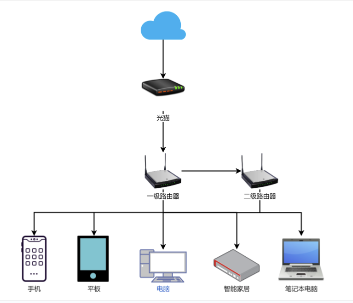

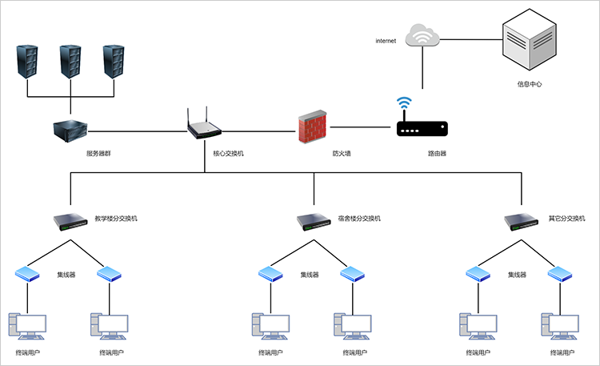

**网络的构成**

在网络中最最重要的两部分是：

- **节点（Nodes）**，也就是主机，比如常见的电脑、手机、智能设备、路由器等
- **连接（Links）**，可以理解为网线、无线网 WIFI、光纤等

计算机（节点）通过线缆、无线电波以及其他类型的网络基础设施相互连接，形成网络。在无数的节点和网线之间，最核心“软件”便是 **数据包** 和 **协议**，它们共同约束了在主机和线缆之间传输的数据格式，以及如何传输。经由网络传输的所有数据都会被转化为光或电脉冲（也被称为 **“位”**），随后被接收计算机进行解读。线缆和无线电波以光速来传输这些位。一次能够跨越这些线缆的位数越多，互联网的运行速度也就越快。

### 节点与连接

节点一般是计算机硬件设备，连接一般是指物理传输媒介，比如网线、光纤、无线 WIFI 等。

节点可以进一步分为端节点和中间路由节点：

* 端节点：日常使用的电脑、手机等网络最边缘设备。
* 中间路由节点：也叫分组交换机（packetswitch），比较常见的分组交换机包括：路由器（router）和集线器（hub）等链路层交换机（link-layer switch），它们的作用是起到中继、转发、路由数据包的作用。

### 数据包

在计算机网络中，当一台计算机要向另一台计算机传输数据时，发送方主机会将数据进行分段，并为每段添加头部信息，由此形成的数据包也被称为 **分组（packet）**。

数据包是较大消息的一个组成部分，每个数据包都由数据和与之相关的控制信息组成。其中，控制信息被称为 **标头（header）**，它位于数据包的起始位置，使接收方主机能够明确如何处理该数据包；而其余部分则是数据本身，即 **负载（payload）**。

当数据经由互联网发送时，会首先被分解为较小的数据包，然后再转换为位。数据包会通过各种网络设备（如路由器和交换机）被路由至目的地后，接收设备会按顺序将它们重新组合，并提取出其中传递的数据部分，随后计算机便可对数据进行使用或显示，这种传输的方式叫做 **分组交换**。。

### 分组交换

我们平常浏览网页、刷视频，需要传输大量的网络数据包，这些数据包会被分割为一个个更小的数据包，叫做分组或者报文。计算机会在每一个报文的头部，加上发送数据的源主机和接收数据的目的主机的地址信息（IP 地址、端口号等），这些加起来就好比是快递包裹上的贴的单子，我们把它叫做 “报文首部”。这些头部信息会在网络链路中被路由器、交换机等识别，然后不断的向目的地转发，就像快递公司根据包裹上的单子分发包裹一样。

假如有一个很大的数据，就好比是一个大包裹，我们要把它分成好几个小包裹（分组）来运输。为了知道这些小包裹分别是大包裹的哪个部分，我们就在每个小包裹上写上序号。等收到这些小包裹的时候，接收的一方就按照序号把小包裹重新组合起来，还原成原来的大包裹（原始数据）。

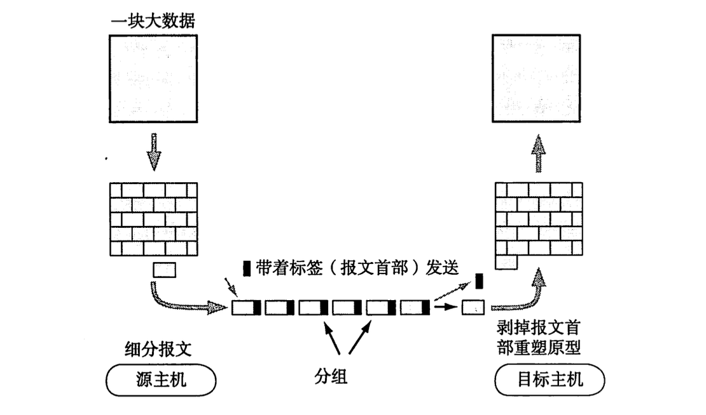

**协议** 就是规定了每台参与通信的计算机都要知道怎么去写这个 “单子”（构建报文首部），也要知道怎么去看这个 “单子”（读取首部和内容）。为了保证发送方和接收方能够顺利地交流信息，双方对于这个 “单子”（报文首部）和包裹里的东西（内容）的理解和处理方式必须是一样的。

### 协议

**网络协议（network protocol）** 定义了在两个或多个主机之间交换的数据包的格式和顺序，以及报文发送和/或接收一条报文或其他事件所采取的动作。

在 **OSI 模型** 的每一层都定义了不同的网络协议，比如：

**TCP** 负责提供可靠的数据传输服务，确保数据能够准确无误地到达目的地；

**IP（网际协议）** 负责在网络中对数据包进行寻址和路由；

UDP 提供了一种无连接的、快速的数据传输方式；

ARP（网络地址解析协议）用于将网络层的 IP 地址转换为数据链路层的 MAC 地址；

DHCP（动态主机配置协议）负责为网络中的设备动态分配 IP 地址等网络参数；

FTP（文件传输协议）则主要用于在网络上进行文件的传输。

## 互联网

### 因特网与互联网

当众多大小不一的局域网彼此相互连接，形成规模宏大且连绵不断的相互连接的网络时，**互联网** 便应运而生了。可以说互联网就是网络的网络。

在全世界范围内，最大的互联网被称为 **因特网**，我们平时所说的互联网通常也特指这个全球互联的网络。

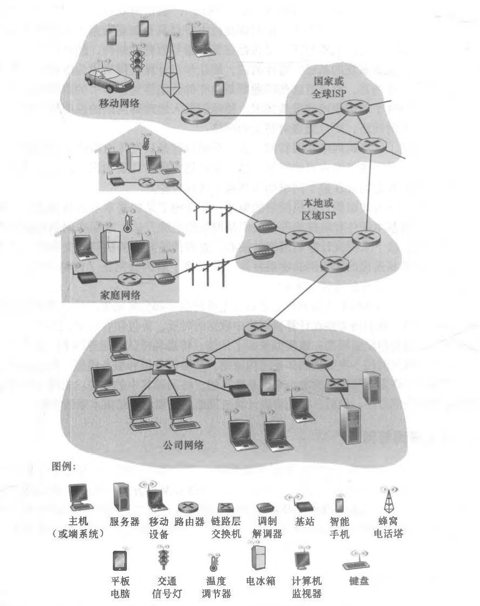

> Internet 最早来源于美国国防部高级研究计划局建立的一个名为 ARPANet 的计算机网络，ARPANet 的一项非常重要的成果就是网际协议(IP)和传输控制协议(TCP)这两个协议。

**分布式**

互联网除了互联，还有一个最大的特点便是不存在控制中心，从整体上看，它天然是分布式的系统，不依赖任何单一计算机。只要能以正确方式发送和接收数据的计算机或硬件，都可自由加入成为其一部分。

互联网的这种分布式特点使其具有弹性，计算机、服务器等网络硬件可随时连入或断开，不会影响互联网的核心功能；而计算机缺少组件可能无法运行。

### ISP

ISP（Internet Service Provider，互联网服务提供商），就是那个为你（个人或企业）提供网络接入服务、让你能够上网的运营商。

常见的 ISP：中国电信、中国联通、中国移动、教育网（CERNET）、长城宽带、广电网络等

核心工作：

* 连接末端设备
  * 有线宽带：通过光纤（FTTH，光纤到户）、铜缆（ADSL，传统电话线）等方式将网络引入你家或办公室。
  * 移动网络：通过遍布各地的手机信号塔，提供 4G/5G 网络。
  * 企业专线：为重要机构提供高速、稳定、专用的数据电路
* 分配网络资源：
  * 给每个设备分配一个临时的或固定的“网络门牌号”，即 IP 地址。
  * 提供域名解析（DNS）服务，通过域名找到 IP 地址
* 建立骨干网络：内部有着非常庞大的骨干网（由高速光缆和核心路由器组成），负责将不同城市、不同区域的数据汇聚并高速转发。
* 互联：通过多种方式与其他 ISP（比如联通和电信之间）或国际 ISP（比如通过海底光缆连接的美国运营商）建立连接，交换数据。

### 万维网

万维网（WWW，World WIde Web）是一个基于互联网构建的公共互连的分布式超媒体信息系统。

万维网根据超文本传输协议（HTTP）的特定规则，提供对文件及其他网络资源的访问，使内容得以透过互联网共享。

万维网的核心构成：链接、页面、浏览器、服务器。

发展历史：

* 起源（原型）
  * 英国计算机科学家蒂姆·伯纳斯-李在欧洲核子研究组织（CERN）工作时，为了解决 科研资料跨系统、跨地点的信息管理难题，发明实现了名为“WorldWideWeb”浏览器与 http 服务端的原型。
* Web 1.0——一个由超链接构建的大型“百科全书”
  * 静态互联网
  * 万维网主要用于向用户提供静态的信息，用户只能通过浏览器浏览网页来获取信息，但无法与网页进行交互。得益于图形浏览器的发明与普及和万维网联盟 （World Wide Web Consortium, W3C）制定和维护万维网的标准和规范。
  * 用户身份：内容阅读者（只读）
  * 控制权掌握者：门户网站（如人人网、搜狐网、开心网）
  * 服务的经济支撑：打赏
* Web 2.0
  * Web 逐渐演进为以用户参与、内容共建与交互服务为核心的形态。博客、论坛与社交媒体平台兴起，Web 不再只是静态信息展示工具，而成为承载社会交互与内容生产的基础设施。其发展深受 W3C 所维护的 HTML、CSS、DOM、JavaScript 等标准体系的持续完善影响。
  * 用户身份：内容创造者（可读可写）
  * 控制权掌握者：在平台公司（如谷歌、FB、微博）
  * 服务的经济支撑：广告/订阅/平台抽成
* Web 3.0
  * 指创建一个去中心化但安全的万维网，人们可以在其中安全地交换金钱和信息，而无需中间商或大型科技公司。Web3 旨在通过区块链技术实现 去中心化、用户控制数据、建立开放式经济系统 的新型网络形态。
  * 用户身份：内容掌控者（读写+控制+盈利）
  * 控制权掌握者：技术协议保护下的用户和 DAO 组织
  * 服务的经济支撑：DAO 来管理资金库来源包括：交易费中的一部分、协议收入、早期预留代币

## 自底向上构建网络

### 网线——连接基础

当 2 台电脑互联时，只需要一条网线建立连接。

> 标准的网线（也叫双绞线）有八根不同的颜色线，分为 4 对，当两台电脑直接相连时，需要使用 "交叉线"，就像两个人对话，一个人的嘴对应另一个人的耳朵

当 3 台电脑互联时，只需要额外添加两条网线建立连接。

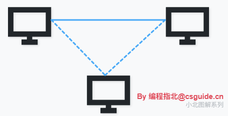

当 N 台电脑需要互联时，两两相连的方式变得不可行，每增加一台设备，都需要与现有的每台设备建立连接，网线数量呈指数级增长。不仅硬件成本高昂，布线也会变得杂乱无章。

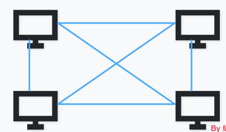

### 集线器——广播转发

如果能把所有的网线都 "揉" 在一起，让每台电脑只需要用一根网线接入这个 "公共连接点"，就能避免网线数量暴增的问题。于是，**集线器（Hub）** 的诞生了。

集线器就像一个 "复读机" ， 当收到任何一台电脑发来的数据时，它会无差别地把这些数据转发给所有连接的设备。

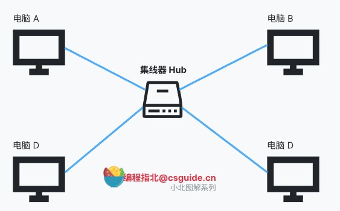

那么计算机是怎么知道这个数据是发送给自己，而不是是发给另一台计算机的呢？这就要说到网络通信中的 MAC 地址了，每个网卡都有一个全球唯一的 MAC 地址，就像每个人的身份证号一样，出厂就写到了设备里。

当电脑 A 发送数据时，会在数据包中标记：

- 发送方 MAC 地址: 电脑 A 的地址
- 接收方 MAC 地址: 电脑 B 的地址

虽然集线器把数据发给了所有人，但其他电脑（C、D）收到数据包后会检查接收方 MAC 地址。发现不是给自己的，就会自动丢弃这个数据包（如果遇到不讲规矩的，也可以不丢弃，这就是局域网窃听）。

集线器是共享型设备，在同一时刻只能有一个节点发送数据，其他节点只能处于监听状态，所以它一般只能支持 **单工通信**，这种同时传输数据时可能会产生冲突的节点的集合我们也叫做 **冲突域**。

但这种方式存在明显的安全隐患和效率问题：

1. 带宽浪费 - 不相关的电脑也会收到数据
2. 性能下降 - 所有设备共享带宽，越多设备连接，网络越拥挤
3. 安全隐患 - 所有数据对所有设备可见

### 通信方式

按照传输和接收模式区分，通信的方式可以分为单工通信、半双工通信和全双工通信，其中双工通信（半双工+全双工）里的还细分出时分双工（TDD）和频分双工（FDD）两种常见方式。

* 单工通信：数据只能从一个节点（发送方）传输到另一个节点（接收方），接收方无法反向回复。
  * “单向喊话”
  * 例子：收音机
* 半双工通信：数据可以双向传输，但同一时间只能有一个方向传输。
  * “轮流对话”
  * 例子：对讲机
* 全双工通信：数据可以双向同时传输
  * 例子：手机通话

### 交换机——定向转发

如果集线器能够聪明一点，按照目标 MAC 地址定向的转发数据包，那么就成了 **交换机（Switch）**。

交换机通过学习各个端口连接设备的 MAC 地址，构建一个 MAC 地址表，实现了数据的 "精准转发"。当数据包到达时，交换机会查找 MAC 地址表，如果找到目标 MAC 对应的端口，就只从那个端口转发，如果找不到，才会向所有端口广播（这种情况叫网络泛洪）。这种工作方式不仅提高了网络效率，还增强了通信安全性。

交换机得到 MAC 地址表的方式是 **动态学习**。

交换机工作原理：

1. 初始状态： 当交换机刚启动时，它的 MAC 地址表是空的，不知道任何设备的位置。

   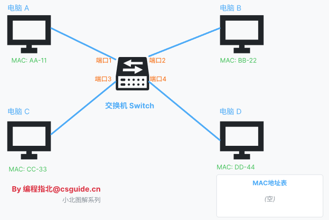

2. 假设电脑 A 通过端口 1 发送数据给电脑 B，虽然这时交换机不知道 B 在哪个端口，但它学到了 MAC 地址为 `MAC A` 的设备在端口 1 上，交换机会立即记录这条映射关系 `MAC A -> 端口1`。

3. 因为不知道电脑 B 的位置，这时交换机会向除了端口 1 以外的所有端口转发这个数据包。这种行为叫做 "泛洪"（Flooding）。

4. 当电脑 B 回复数据时，交换机又学到了新信息 MAC B 在端口 2，`MAC B -> 端口2`。

5. 下次当电脑 A 再发送数据给电脑 B 时，交换机查表就知道 B 在端口 2，于是只向端口 2 转发数据包。其他端口的设备不会收到这些数据。

> 这个 MAC 地址表中的映射关系也会老化（通常是 5 分钟）。如果在这段时间内没有收到某个 MAC 地址的数据包，对应表项就会被删除，这种工作机制使得交换机能够自动适应网络变化，高效地转发数据。

当两个交换机完全可以连接在一起形成一个更大的网络，工作流程如下：

1. 电脑 A 发出数据包，第一个交换机不认识目标 MAC 地址 BB-22，就向所有端口转发，包括连接第二个交换机的端口
2. 第二个交换机收到后，也不认识地址 BB-22，继续广播到其它端口
3. 此时电脑 B 收到数据后，处理后，再往回 AA-11 发送数据包响应。
4. 这时交换机 1 学到了：`MAC A -> 端口1` `MAC B -> 连接 switch 2 的端口`。交换机 2 学到了：`MAC B -> 端口1` `MAC A -> 连接 switch 1 的端口`

逐步学习后，两个局域网也能互联了，但是每一个广播包（比如 ARP 请求）会在整个网络传播，这样能能接收广播数据包的所有设备的集合叫做一个 **广播域**。

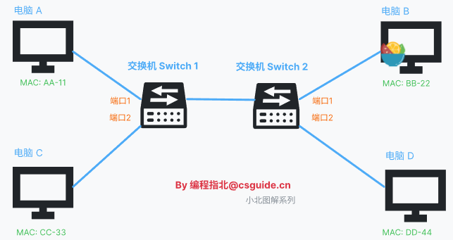

这种精准转发带来了好处：

* 节省了带宽
* 提升安全性（不会把数据包泛洪到其它人那里）

### MAC 地址

[MAC 地址详解](#MAC 地址详解)

###  MAC 地址表

- 存在于交换机中（现代路由器基本替代了交换机这部分功能），记录着 MAC 地址与交换机端口的对应关系
- 帮助交换机在同一广播域内准确转发数据包

### 路由器——路由转发

当我们不止要连接一个单位内的设备，而是连接一片区域的设备，其规模达到了万级，假如还是使用 N 个 交换机互相连接，每个交换机都需要记住数以万计的 MAC 地址，这带来两个致命问题：

* MAC 地址表爆炸，表项太多，查找、更新都受影响
* 这些设备处于一个广播域，广播包会导致整个网络瘫痪

自然的做法是，把网络分成多个小组（就像城市分区一样），每个小组内部可以广播，但小组之间要有个 "管理员" 负责转发消息。MAC 地址就像身份证号，虽然能唯一标识一个设备，但无法告诉我们这个设备在哪个组。想要一个分层级的地址系统，就需要用到 IP 地址的定位能力。同一个小组一般叫做 **子网**，而根据 IP 地址在子网之间转发消息的“管理员”就是 **路由器（Router）**。

### IP 地址

[IP 地址详解](#IP 地址详解)

### 网关

网关（Gateway）通常位于网络边界，负责数据接收、解析、协议转换和转发。

通常是路由器的 IP 地址（如家庭路由器的默认网关 `192.168.1.1`）。

作为子网对外的 "门户"，不同子网的设备通信时，数据先发给网关。

### 局域网内设备通信

> 此处省略掉交换机，实际上在局域网内，现代路由器也具备交换机的能力，也能学习 MAC 地址和 端口的映射关系。

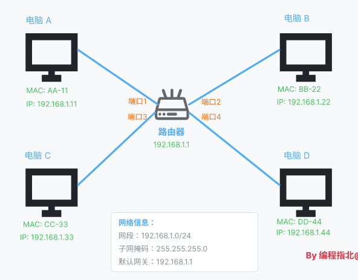

假设设备 A 知道设备 B 的 IP 地址是 192.168.1.22，想给设备 B 发送一条数据。

预处理过程：

1. 设备 A 要判断设备 B 是不是和自己在同一个子网里，它看到自己的 IP 是 `192.168.1.11`，子网掩码是 `255.255.255.0`，计算后得到都是 `192.168.1` 开头，在同一个子网内，可以直接通信。
2. 光知道 IP 地址是不够的，在同一个子网内，计算机之间要用 MAC 地址通信。于是设备 A 会向整个局域网发送 ARP 广播，请求设备 B 的 MAC 地址。
3. 同一个子网的所有设备都收到了这个广播，如果与自己无关则丢弃这个 ARP 包，只有设备 B 回应自己的 MAC 地址为 `MAC B`。
4. 设备 A 收到这个回应后，会把 `192.168.1.22 -> MAC B` 这个映射关系记在自己本机缓存中，这个就叫 ARP 缓存。

这个预处理的过程就是 **ARP 协议** 的作用——通过 IP 地址找到对应的 MAC 地址。经过上述过程，设备 A 就可以直接发送数据包了，它把数据包装成一个特殊的 "双层信封"：先在内层信封上写上 IP 地址 "192.168.1.22"（IP 头），然后把它放入外层信封，在外层信封上写上 "收件人 MAC 地址：BB-22"（MAC 头）。路由器（携带交换机功能）看到 MAC 地址，立刻就知道该从哪个端口转发出去，于是数据包就准确送达了设备 B。

MAC 数据包的数据部分其实是一个 IP 数据包（下一层的数据部分包含完整的上一层包的 header 和数据）。这样的双层结构保证了数据包既能通过 IP 地址确定目的地，又能通过 MAC 地址在本地网络中准确投递。

### ARP 

ARP（Address Resolution Protocol，地址解析协议），是一种用于将网络层的地址转换为数据链路层地址的重要网络协议。ARP 的主要作用是将 IP 地址转换为 MAC 地址，这一过程对于网络中的数据传输至关重要。

流程：

1. 设备 A 向局域网广播 ARP 请求（含目标 IP）；
2. 设备 B 响应并返回自身 MAC 地址；
3. 设备 A 缓存 IP-MAC 映射（`arp -a` 可查看）。
    动态更新​​：ARP 缓存条目会老化（默认 2-4 分钟），防止过时映射。

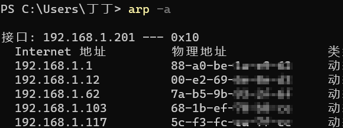

### ARP 表

- 缓存在每台网络设备中，记录 IP 地址和 MAC 地址的对应关系
- 避免重复发送 ARP 广播请求

### 不同子网设备通信

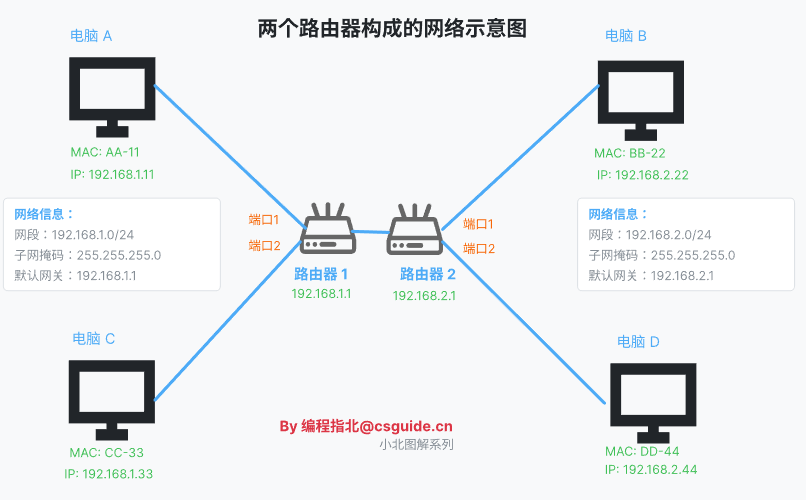

假设设备 A 知道设备 B 的 IP 地址是 192.168.2.22，想给设备 B 发送一条数据。 

1. 判断目标 IP（192.168.2.22）是否在同一子网，经过子网掩码 `255.255.255.0` 计算后发现对方网段是 `192.168.2.0`，而自己是 `192.168.1.0`，显然不在同一个子网，需要通过网关转发。

2. 默认网关 IP 地址是 192.168.1.1，但是不知道网关的 MAC 地址，于是发出 ARP 广播，路由器 1 收到后回应自己是 `192.168.1.1` MAC 地址为 `MAC S1`。

3. 设备 A 收到路由器 1 的回应后，记录 ARP 缓存 `192.168.1.1 -> MAC S1`，开始准备发送数据包：IP 头 `目的地址 192.168.2.22` 和 MAC 头 `目的地址 MAC S1`。

4. 路由器 1 收到数据包后，查看 **路由表** `192.168.2.0/24 -> 连接路由器2的端口`，转发数据包：MAC 头 `源地址 MAC S1 目的地址 MAC S2`，然后从连接路由器 2 的接口转发出去

   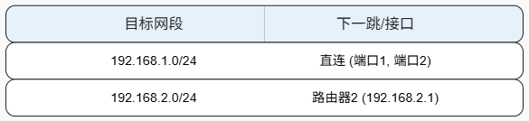

5. 路由器 2 收到数据包后，发现目的 IP（192.168.2.22）在自己所在的子网内，发出 ARP 广播询问设备 B 的 MAC 地址得到会有 `MAC B`，转发数据包：MAC 头 `源地址 MAC S2 目的地址 MAC B`，从端口 1 转发出去

在整个过程中，IP 头（目的地址）始终保持不变，而 MAC 头（相当于邮递过程中的中转单）每经过一个路由器都会被替换一次。

### 路由表

路由器 1 是如何知道 `192.168.2.0/24` 网段的包要发给路由器 2 的，答案就是路由表

路由表：

* 存在于路由器中
* 记录网段与出接口的对应关系，指导路由器如何转发跨网段的数据包

路由表是如何维护的？以下是几种形成方式：

1. 直连网段自动发现：
   - 路由器 1 知道自己的端口 1 连接着 192.168.1.0/24 网段，这是自动学习的 （同一个路由器下所有 LAN 口都是在一个子网（划分 VLAN 除外））
   - 路由器 2 知道自己的端口 1 连接着 192.168.2.0/24 网段，这也是自动学习的
2. 人工配置（静态路由）：
   - 网络管理员手动配置告诉路由器 1："要去 192.168.2.0/24 网段，需要从连接路由器 2 的接口发送"
   - 同样配置路由器 2："要去 192.168.1.0/24 网段，需要从连接路由器 1 的接口发送"
3. 动态路由协议：
   - 路由器们会定期互相交流："我这边连接着哪些网段，你那边连接着哪些网段"
   - 比如最早期的 RIP 协议，路由器们每 30 秒就会广播自己知道的路由信息
   - 现代网络更常用 OSPF、BGP 等更先进的协议，它们会计算出最佳的转发路径

在我们这个简单的两路由器网络中，用静态路由配置就足够了，但在大型网络中，通常会使用动态路由协议，让路由器们自动学习和更新网络拓扑信息。

### 传输层协议：UDP & TCP

以上我们使用路由器、交换机等设备，引入 IP 地址、MAC 地址的概念就能构成基本的网络，实现主机到主机的数据传输，双方就像一根网线直连一样，完全不需要关注中间的网络节点。但是一台设备上可能运行着多个应用程序，当数据包到达电脑后，应该交给那个进程呢？

在讨论交给那个应用程序之前，要引入端口的概念， 用 **端口号** 用来区分不同的应用程序，端口号是一个 0-65535 的整数，比如：80 端口通常用于网页服务，21 端口用于 FTP 服务，25 端口用于邮件服务。

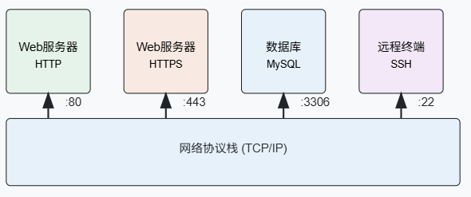

**UDP：简单但不可靠**

有了端口，最简单的传输方式就是：把数据包发给对方主机的指定端口，这就是 **UDP（User Datagram Protocol，用户数据报协议）** 的基本工作方式。

简化的完整 UDP 数据包，在原来的 IP 层数据包的基础上加上端口信息，如下图

UDP 的特点：

- 不建立连接，想发就发
- 不保证可靠送达，发出去就不管了
- 不保证按序到达，后发的包可能先到
- 速度快，开销小

**TCP ：可靠连接**

有些场合（比如文件传输、网页浏览）我们需要保证数据的可靠性，并且一个字节都不能丢，这时就要用到 **TCP （Transmission Control Protocol 传输控制协议）**。

简化的完整 TCP 数据包，加上端口号信息，除此以外 TCP 还有很多序列号、确认号这样的控制信息，如下图

TCP 的特点：

- 建立可靠连接
- 有序列号机制，保证数据按顺序到达
- 有丢包重传机制
- 有流量控制和拥塞控制功能
- 开销较大，速度较慢（只是相较 UDP）

TCP 在发送数据前会通过三次握手，确认双方都已经准备好发送和接收数据

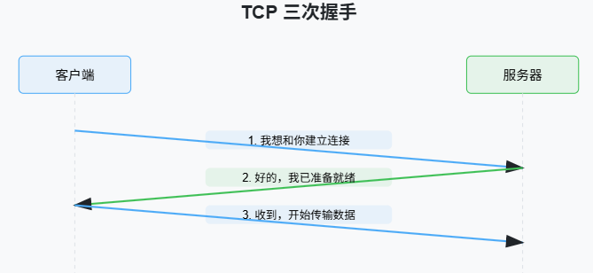

在完成所有数据传输后，双方需要协商关闭连接，这个过程叫做四次挥手。之所以需要四次挥手，是因为 TCP 的全双工特性，每个方向都需要单独关闭。

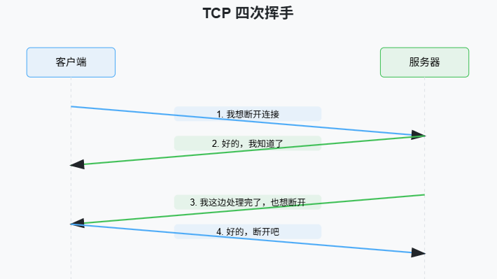

**传输层协议应用场景**

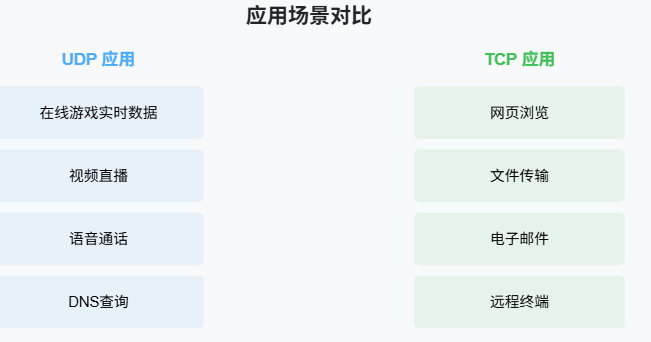

### NAT & NAT 表

至此，计算机的进程在顶层应用层中已经能够基本使用各层协议和通信设备来传输自己的数据，整个互联网世界也是基于此构建的。

前面我们讲了如何用 IP 地址在不同网段之间通信，但是还有一个问题：全球 IPv4 地址已经不够用了。在 IPv6 这个真正能解决 IP 地址短缺问题的方案出现之前，人们考虑复用 IP 地址，划分了三类 IP 地址段作为私有 IP 地址（局域网地址）。

- A 类（`10.0.0.0/8`）：提供约 1600 万个地址，适合大型企业或数据中心，方便做大规模子网划分而不必担心地址不足。
- B 类（`172.16.0.0/12`）：提供约 100 万个地址，适合中型企业、学校等。
- C 类（`192.168.0.0/16`）：提供约 6.5 万个地址，也是最常见的小型网络（如家庭路由器默认使用 `192.168.1.1`）。

正是因为大家可以随便使用，所以没有办法根据这些私有 IP 地址定位，他们只能在各自的局域网内保持唯一，无法在全球唯一，所以这些地址只能在局域网内使用，不能在互联网上直接访问，这恰好提供了一个安全上的好处——一道天然的防火墙。

那么当这些设备想要访问的外网的时候，可以通过配置代理，还可以通过 **NAT（Network Address Translation，网络地址转换）技术**。NAT 允许多台设备共用一个公网 IP，就像一个大院子只有一个门牌号，但里面却住着很多家庭。

NAT 的工作过程：

1. 小北的电脑发送数据包到路由器：`源IP: 192.168.1.11，源端口: 4567`，`目标IP: 淘宝服务器 203.0.113.1，目标端口: 80`
2. 路由器收到数据包后，对它进行 NAT 转换再发送出去：
   - 把源 IP 改成路由器的公网 IP（比如：`101.202.33.44`），路由器可以绑定多个 IP 地址，不同出口对应不同的 IP 地址。
   - 修改源端口为一个新端口（比如：`6789`），在 NAT 表中记录这个映射关系：`192.168.1.11:4567 ←→ 101.202.33.44:6789`
   - 发送数据包到淘宝服务器：`源IP: 101.202.33.44，源端口: 6789`，`目标IP: 淘宝服务器 203.0.113.1，目标端口: 80`
3. 淘宝服务器收到请求后回复数据包：`源IP: 203.0.113.1，源端口: 80`，`目标IP: 101.202.33.44，目标端口: 6789`
4. 路由器查 NAT 表，找到对应的私网 IP 和端口：`192.168.1.11:4567`，把数据包转发给小北的电脑

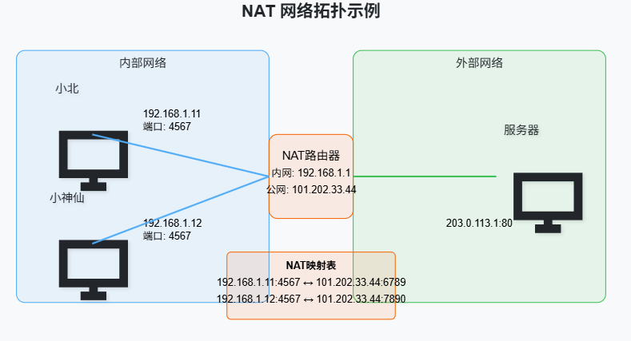

NAT 的实现方式有很多种，上述的也是通常接触到的、家用路由器里使用的 NAT，全称其实是 **NAPT（Network Address Port Translation，网络地址端口转换）**。当多个局域网设备向一个公网设备发起访问，公网路由器会改动源 IP 为路由器的公网 IP，当公网服务器回复后，路由器拿到回复的数据包，它将不知道这个数据包属于哪个局域网设备，因此就需要将源端口也做改动，通过路由器的端口来区分不同的局域网设备，同时建立 NAT 映射表。NAPT 之所以能用一个公网 IP（比如你家路由器 WAN 口获得的 IP）支持内网所有设备同时上网，靠的就是 **端口号**，它同时转换 IP 和端口，实现多对一映射，大幅提升公网地址利用率。

当然，如果你想反过来从外网（比如在公司）主动访问家里的 NAS 服务器时，NAT 原本是不允许的（因为路由器的映射表里没有记录）。这时就需要端口映射（也叫端口转发）。只需要在路由器上写一条死规则（例，外网用户访问路由器的 `1.2.3.4:5000` ，路由器直接转给内网 `192.168.1.200:5000` ）。

NAT 技术极大地缓解了 IPv4 地址短缺的问题；就像一个大型小区的安保系统，NAT 既是门卫（控制进出），又是接待处（管理访客），让内部人员能够安全便捷地与外界交流。虽然这个系统不是完美的，但在当前阶段，它仍是互联网得以正常运转的重要基石。	

## 网络分层模型

网络分层的作用，通过分层，我们可以只了解最上层，也能使用好整个网络。不懂底层的网络通信，不妨碍我们直接使用网络，也不妨碍用 Socket 进行网络编程。

### OSI 七层网络模型

常听说七层负载均衡、四层负载均衡，以及三层路由器、三层交换机这些名字。实际上这里这里所说的七层、三层、四层指的就是 OSI 网络模型的分层。所谓四层负载均衡就是基于 IP + 端口的负载均衡，七层负载均衡就是基于 URL 等应用层信息的负载均衡，同样的还有基于二层 MAC 地址，三层 IP 地址的负载均衡

 **OSI（Open System Interconnection，开放式通信互联）** 是由 ISO(International Organization for Standardization，国际标准化组织) 制定的标准模型。制定这种网络模型的目的在于制定一种将世界各地的各种计算机互联的标准。

一张经典的 OSI 网络模型图：

一张带对应网络设备的图

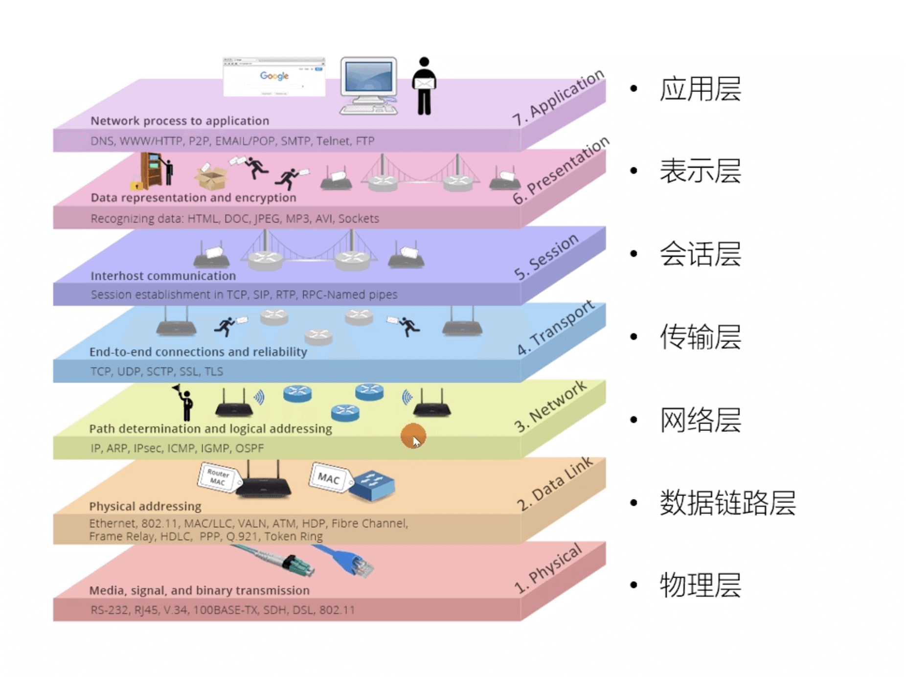

通过 AI 找到的 ProcessOn 的图，作者：菜鸟也有梦想 [^2].

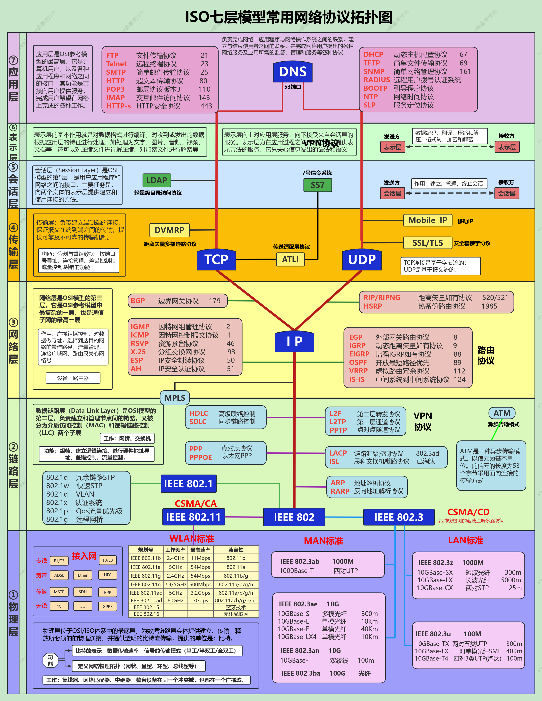

从上到下分别是：

- 应用层，就是指特定的应用层协议，比如 HTTP、远程文件协议 FTP、邮件协议 POP3、远程登录协议 SSH 等
- 表示层，负责数据处理转换：包含数据格式、编码解码、加密解密等
- 会话层，负责建立和维护不同主机之间的通信连接
- 传输层，主机进程之间的数据传输服务，注意，这里的进程间实际就是指传输层需要端口号来识别进程
- 网络层， 主机端到端的路由和寻址（这一层寻址是依靠 IP 地址）
- 数据链路层，负责管理相邻节点之间的数据通信：包括 数据封装成帧、MAC 寻址、流量控制、差错控制
- 物理层，数据通信的光电物理特性、时钟同步、传输比特流等

### TCP/IP 四层模型

> OSI 模型过于庞大、复杂，且部分层的功能重复、划分不清，导致最终并未成为广泛使用的标准模型，反倒是 TCP/IP 四层网络模型成为了事实上的标准网络模型。

TCP/IP 四层协议栈是一个包含多种网络通信协议的集合，主要包括两个核心协议：TCP（传输控制协议）和 IP（网际协议）。

TCP/IP 将网络通信抽象为四个层次，每个层次实现不同的通信协议，根据功能的不同，这些协议被分配到这四个层次中，可以视为是简化的七层 OSI 模型。

虽然 TCP/IP 协议和 OSI 模型并不能完全对应，但我们可以在 OSI 模型中找到 TCP/IP 的大致位置。

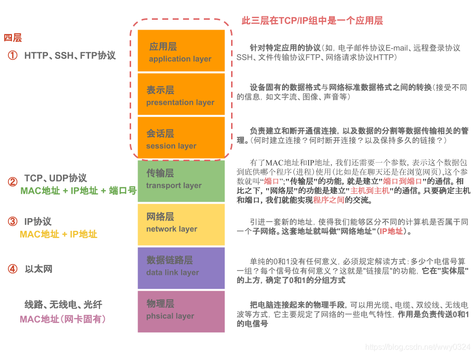

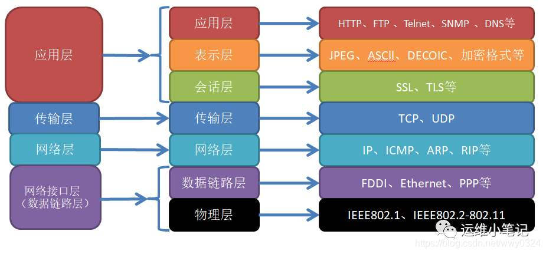

从上图可以看出，OSI 模型的最上面三层（应用层、表示层和会话层）在 TCP/IP 中归为一个应用层；而数据链路层和物理层被归类为网络接口层（Network Interface）。

### 网络协议封装与解包

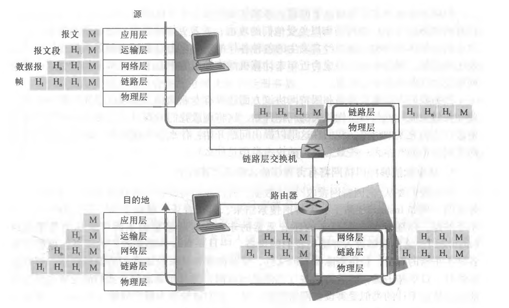

进行网络传输时，数据包会按照 TCP/IP 协议栈，对上一层发来的数据进行逐层处理；然后加上该层的协议头，再发送给下一层。这个过程就叫做 **封装（encapsulation）**。

计算机/服务器实现了 TCP/IP 协议栈所有层，而中间的交换机、路由器只需要实现到网络层、链路层即可。我们常说的三层路由器、三层交换机、二层交换机，指的就是他们各自能识别到哪一层的协议（头部信息），工作在这一层，即根据协议头的 IP、端口、MAC 地址等进行相应的转发、广播。于是整个网络的复杂性都放在了网络边缘中实现。

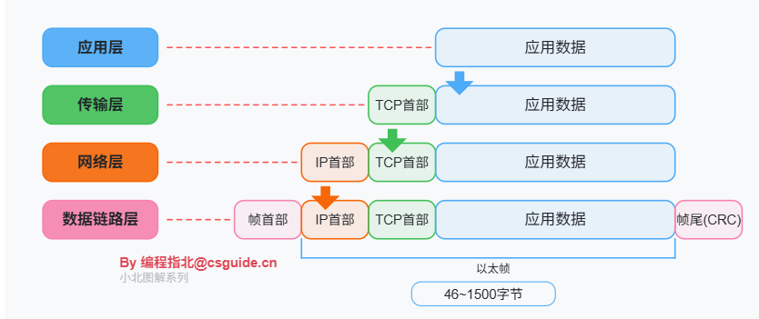

### 应用层

应用层位于网络模型顶端，直接与用户交互，提供网络应用服务。

这一层包含了我们日常使用的各种协议，如用于网页浏览的 HTTP、文件传输的 FTP、邮件服务的 SMTP、域名解析的 DNS 以及远程登录的 Telnet 和 SSH 等，以及支付宝、微信等各种 APP 自定义的私有协议都属于这一层。

应用层协议三巨头：

- HTTP/HTTPS：网页浏览的基石（80/443 端口）
- DNS：互联网的“电话簿”（53 端口）
- SMTP/POP3：电子邮件的发件箱和收件箱（25/110 端口）

应用层的主要职责是 **格式化信息**，比如 HTTP 协议的报文结构（请求头/响应头 + Body），并确保通过传输层把数据发送出去。

应用层的数据包我们一般叫做 **报文（Message）**。

### 传输层

传输层负责端到端的通信控制，主要包括两种传输协议：面向连接的 TCP（传输控制协议）和无连接的 UDP（用户数据报协议）。TCP 提供可靠的数据传输，通过建立连接、序列号、重传、拥塞控制等机制确保数据的完整性和正确顺序；而 UDP 则提供更快但不保证可靠性的数据传输方式（无序、无连接）。为应用层提供了关键的服务质量保证。

传输层会在应用程序数据前面增加了 TCP/UDP **头部**（源端口，目的端口），以及其它 **控制信息**。

传输层的数据包我们一般叫做 **段（Segment）**。

**分段**

TCP 通信的双方，会在通信开始互相协商一个最大分段大小（Maximum Segment Size），即 MSS。MSS 值通常为 MTU（链路层限制的单个数据包最大传输字节） 减去 IP 和 TCP 头部空间（各 20 字节），标准 MSS 值约为 536 字节。UDP 则不会对上层数据包进行分段。

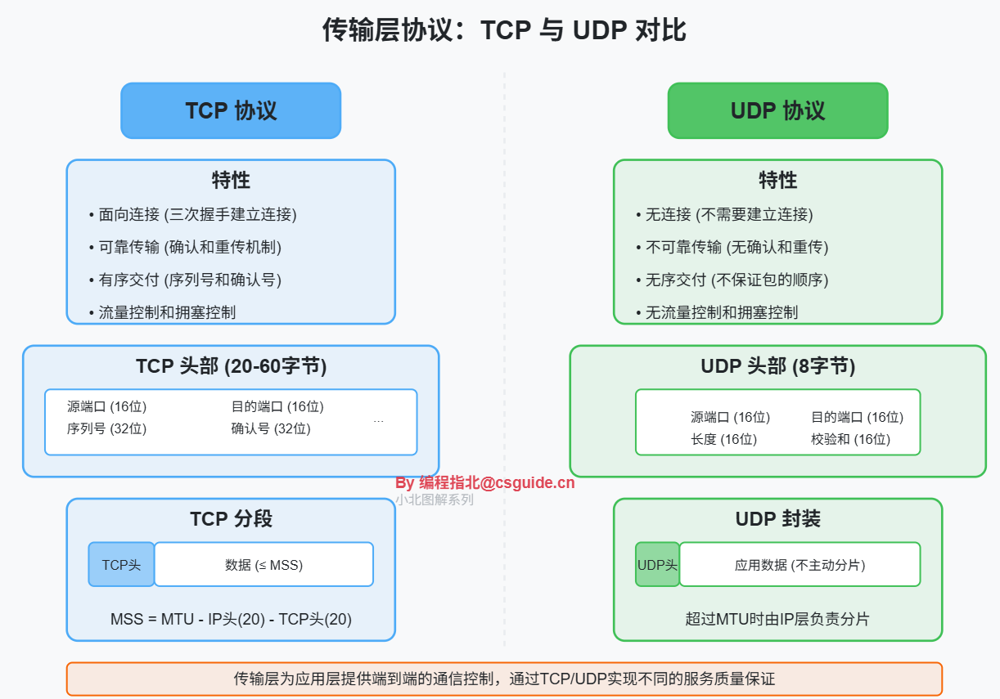

### 网络层

实际上传输层并不真的负责数据“传输”，真正负责数据传送的是网络层 IP 协议。网络层处理数据包的路由和转发，确定数据从源到目的地的最佳路径。

其核心协议是 IP（网际协议），负责为传输层数据包添加源 IP 地址和目标 IP 地址信息。此外，还包括 ICMP（互联网控制消息协议）用于网络诊断，我们常见的 ping 就是使用 ICMP。ARP（地址解析协议）和 RARP（反向地址解析协议）用于 IP 地址与物理 MAC 地址之间的转换。

IP 层的数据包叫做 **包（Packet）**。

**分片**

当传输层的数据包，再加上网络层的头部超过 MTU 时，IP 层就会把一个传输层数据包分片，分成几个数据包进行传输。

- 标识（Identification）：发送方在进行 IP 分片时，会给所有来自同一原始 IP 数据包的分片分配相同的 "标识" 值

- 分片偏移量（Fragment Offset）：表示该分片在原始数据包中的位置
- 更多分片（More Fragments）标志：除了最后一个分片外，所有分片的 MF 标志都设为 1
- 分片本身的数据长度

依靠这些信息，接收方就能按正确的顺序还原原始的传输层数据包了。

分片之后，可能部分包会丢掉，IP 层不会对丢包做任何的重传和保证，仅仅是尽力而为的交付，丢失的分片需由更高层（如 TCP）负责重传。

TCP 会主动根据 MSS 大小分片，所以大部分 TCP 数据包是不需要 IP 层分片的，主要是 UDP 的数据包需要 IP 层进行分片。简而言之，TCP 在传输层根据 MSS 分段，UDP 则依赖网络层根据 MTU 进行 IP 分片，两者处理方式不同但都确保数据能够在网络中正确传输。

### 网络接口层

作为最底层，网络接口层负责实际的物理连接和数据传输。它定义了如何通过物理介质（如以太网、Wi-Fi、PPP 或 FDDI 等）发送和接收数据 **帧（frame）**。

这一层处理硬件相关的通信细节，如信号调制、比特流传输和物理寻址等。然后又在 IP 数据包前后分别增加了以太网头部和尾部控制信息（源 MAC 地址，目的 MAC 地址）。

**MAC 地址** 是网络设备的唯一标识符，由网络设备厂商分配，全球唯一（排除虚拟 MAC 地址外）。在局域网内，定位设备就靠 MAC 地址，而网络层是 IP 地址，在网络层和网络接口层之间，通过 ARP 协议来实现 IP 地址查找 MAC 地址。

**MTU**

数据链路层配置的最大传输单元（MTU，Maximum Transmission Unit）规定了最大的 IP 包大小。在我们最常用的以太网中，MTU 默认值是 1500 字节（这也是 Linux 的默认值）。网络层协议比如 IP 协议会根据这个值来决定是否把上层传下来的数据进行分片，如果单个 IP 报文长度大于 MTU，则会在发送出接口前被分片，被切割为小于或等于 MTU 长度的 IP 包。显然，MTU 越大，需要的分包也就越少，自然，网络吞吐能力就越好。

### 分层的好处

> “All problems in computer science can be solved by another level of indirection”
>
> 计算机科学领域的任何问题都可以通过增加一个间接的中间层得以解决。
>
> David Wheeler

**模块化设计**

- 物理层 只需关注如何用光信号/电信号传递 0 和 1
- 网络层 专注设计 IP 地址和路由算法
- 传输层 负责可靠传输和拥塞控制
- 应用层 咱们程序员可以基于 Socket、HTTP 等快速开发网站、构建微信、支付宝这样的国民级应用

**加速技术迭代**

- 电信运营商推行 5G 网络也只需更新物理层，上层协议无需改动。
- 当以太网升级到万兆速率时，上层 TCP/IP 协议栈无需任何修改
- IPv4 向 IPv6 迁移过程中，传输层的 TCP/UDP 协议也保持稳定
- 物理层从双绞线到光纤再到 Wi-Fi 6，应用程序毫无感知

**标准接口**

标准化接口协议构建了互联互通的基石，这些接口规范让不同厂商的设备、不同程序员开发的软件能无缝协作，使得 Windows 电脑能够通过 TCP/IP 协议访问 Linux 服务器。

- 链路层的 MAC 地址格式（如 00:1A: 3F: FE: 2C: 1B）
- 网络层的 IP 报文结构（20 字节头部+负载数据）
- 传输层的端口号机制（0-65535 端口分配）

### 分层的代价

* 性能损耗：多层封装/解封装增加时延（HTTP over TLS over TCP over IP...）
* 设计陷阱：过度分层导致系统臃肿（如 OSI 七层模型实际被 TCP/IP 四层取代）
* 调试难度：跨层排查网络问题需要全栈知识（比如 MTU 引发的 TCP 分片问题）

### 各层典型网络设备

| 工作层级             | 典型设备             | 核心功能                      | 工作特点                        |
| -------------------- | -------------------- | ----------------------------- | ------------------------------- |
| 应用层/表示层/会话层 | 网关（应用层网关）   | 协议转换、内容过滤、防火墙    | 处理高层协议(如 HTTP 代理)        |
| 传输层               | 四层交换机           | 基于端口号进行流量转发        | 识别 TCP/UDP 端口(如负载均衡场景) |
| 网络层               | 路由器、三层交换机   | IP 寻址、路由选择、跨网络通信  | 基于 IP 地址进行转发, 支持 NAT      |
| 数据链路层           | 交换机(二层)、网桥   | MAC 地址学习、局域网数据帧转发 | 通过 MAC 地址表实现快速转发       |
| 物理层               | 集线器、中继器、网卡 | 信号放大、比特流传输          | 无寻址能力, 广播式传输           |

| 工作层级             | 负载均衡                                               | 核心功能                                                     | 工作特点                                                     |
| -------------------- | ------------------------------------------------------ | ------------------------------------------------------------ | ------------------------------------------------------------ |
| 应用层/表示层/会话层 | 七层负载均衡（Nginx、HAProxy）                         | 它能根据 URI 路径（如 /api/ 转发到 Java 集群，/static/ 转发到 CDN）、HTTP 头部（如浏览器类型、语言）甚至请求内容（如 JSON 字段）做决策。 | 支持灰度发布、SSL 卸载、防爬虫等高级功能，但性能损耗较大      |
| 传输层               | 四层负载均衡（LVS（Linux Virtual Server）和 F5 BIG-IP） | 它基于 IP 地址和端口号进行流量转发，不解析具体应用内容。       | 性能极高（硬件方案可达百万级并发），但无法实现基于 URL、Cookie 的精细化路由。 |

### 各层数据包

**报文（Message）、段（Segment）、包（Packet）、帧（Frame）是数据在不同网络分层中的不同“包装形式”**，对应不同层级的协议处理逻辑，区别在于所属层级、封装信息、传输范围三方面。

| 网络分层   | 数据包名称                                   | 典型协议       | 核心任务                     |
| ---------- | -------------------------------------------- | -------------- | ---------------------------- |
| 应用层     | 报文 (Message)                               | HTTP, FTP      | 用户可理解的完整数据块       |
| 传输层     | 段 (Segment) (TCP) 或数据报 (Datagram) (UDP) | TCP, UDP       | 端到端传输控制（端口号）     |
| 网络层     | 包 (Packet)                                  | IP             | 全局寻址 (IP 地址)            |
| 数据链路层 | 帧 (Frame)                                   | Ethernet, WiFi | 本地设备间物理传输 (MAC 地址) |

> 实际开发中 "包" 可能泛指所有数据单元，需结合上下文判断

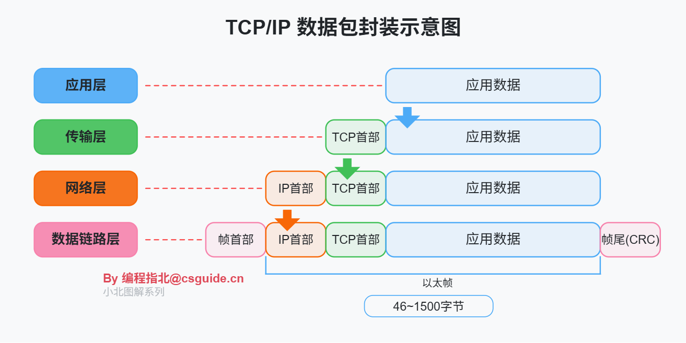

1. 应用层：生成原始数据（如 `HTTP请求报文`）
2. 传输层：添加 TCP 头部（端口号、序列号）→ 变成 `TCP段`
3. 网络层：添加 IP 头部（源/目标 IP 地址）→ 变成 `IP包`
4. 链路层：添加帧头帧尾（源/目标 MAC 地址、CRC 校验）→ 变成 `以太网帧`

## 网络通信概念

### MAC 地址详解

MAC 地址（Media Access Control Address）是网卡的物理地址，48 位二进制数，通常用 12 个十六进制数表示。也称为物理地址、硬件地址或以太网地址。

MAC 地址具有全球唯一性，前 24 位为 IEEE 分配的组织唯一标识符（OUI），分配制造商负责确保后 24 位不重复，每个网卡出厂时将 MAC 地址烧录到 ROM 中。理论上全球唯一，不可更改。

> 虽然是硬件地址，但可通过软件临时修改，Windows/Linux 都支持 MAC 地址修改，部分网络安全工具可随机生成 MAC 地址

Linux 查看 `ifconfig`，windows 查看 `ipconfig /all`。例如: 00:1A: 2B: 3C: 4D: 5E

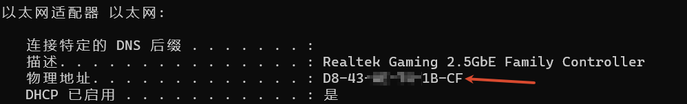

**MAC 地址的作用**

MAC 地址与网络拓扑无关，不提供位置信息，它更像是“身份证号”起到唯一标识的作用。

MAC 地址作用于 OSI 模型的第二层（数据链路层），负责局域网内设备的直接通信，与网络层的 IP 地址形成互补。

发送方在数据帧头部写入目标设备的 MAC 地址，交换机根据 MAC 地址表精准转发到目标端口。在此之前，为了知道目标设备的 MAC 地址，需要用到 [ARP 协议](#ARP)，将目标 MAC 填为 FF: FF: FF: FF: FF: FF，交换机将数据帧 **广播** 至所有端口。

### IP 地址详解

#### IP 地址

IP 地址是分配给网络上每台计算机和设备的唯一标识符，是 IP 协议的地址。它标识的是 **网络接口** 在特定网络拓扑中的位置和角色，而非网络设备本身。

IPv4 地址由（如 `192.168.1.11`）是 32 位二进制数，用四段三位十进制数表示，每段 0-255，称为 "点分十进制"

特殊 IP 地址：

* `127.0.0.1`：用于回环地址，即指向本机地址，常用于测试网络应用是否能够在本地正常运行。
* `0.0.0.0`：用于指定一个无效的或未知的源 IP 地址。
* `255.255.255.255`：广播地址，用于将数据包发送到本地网络上的所有设备。

#### 子网掩码

IP 地址分为两部分，一个是用来标识属于哪一个网络，叫做 **网络号**，一个是标识属于网络中哪一个主机，叫做主机号。

要判断两个 IP 地址是不是在一个子网中，需要用到子网掩码。子网掩码也是由 32 位二进制数组成，连续的 1 表示网络部分，连续的 0 表示主机部分。将 IP 地址和子网掩码做 "与" 运算，得到的结果就是网络号，结果相同的 IP 就代表在同一网段。

如 `255.255.255.0` 转为二进制就是 24 个 1 和 8 个 0，简写为 /24，表示前面 24 位都是网络部分。`192.168.1.11` 和 `192.168.1.22` 与 `255.255.255.0` 运算后结果都是 `192.168.1.0`，因此他们在同一个子网中

#### 传统 IP 地址分类

| 地 址 类 别 | 首位 比特 | 网 络 位 | 主 机 位 | 子网掩码            | 地址范围                    | 适用场景                                   |
| ----------- | --------- | -------- | -------- | ------------------- | --------------------------- | ------------------------------------------ |
| A 类        | 0         | 8        | 24       | 255.0.0.0 (/8)      | 1.0.0.0 - 126.255.255.255   | 超大型网络, 每个网络可容纳 16777216 台主机 |
| B 类        | 10        | 16       | 16       | 255.255.0.0 (/16)   | 128.0.0.0 - 191.255.255.255 | 大型网络, 每个网络可容纳 65536 台主机      |
| C 类        | 110       | 24       | 8        | 255.255.255.0 (/24) | 192.0.0.0 - 223.255.255.255 | 小型网络, 每个网络可容纳 254 台 主机       |
| D 类        | 1110      |          |          |                     | 224.0.0.1 - 239.255.255.254 | 多播地址                                   |
| E 类        | 11110     |          |          |                     | 240.0.0.0 - 255.255.255.254 | 保留地址                                   |

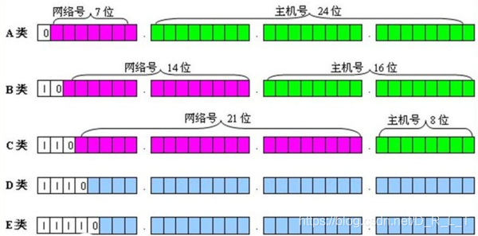

RFC 1918 定义了三个主要的私有 IP 地址块：不可路由、可重用、[需要 NAT 转换](#NAT & NAT 表)、无需注册

| 地 址 类 别    | 地址范围                                       | 适用场景                                                     |
| -------------- | ---------------------------------------------- | ------------------------------------------------------------ |
| A 类私有地址块 | 10.0.0.0/8 (10.0.0.0 - 10.255.255.255)         | 提供 16777216 个 IP 地址，适合大型企业或数据中心，方便做大规模子网划分而不必担心地址不足。 |
| B 类私有地址块 | 172.16.0.0/12 (172.16.0.0 - 172.31.255.255)    | 提供 1048576 个 IP 地址，适合中型企业、学校等。              |
| C 类私有地址块 | 192.168.0.0/16 (192.168.0.0 - 192.168.255.255) | 提供 65536 个 IP 地址，也是最常见的小型网络（如家庭路由器默认使用 `192.168.1.1`）。 |

#### IP 地址的分配

IP 地址的分配是一个分层体系，由国际组织(IANA)、区域机构(RIR)和本地 ISP(电信联通这类)共同管理：

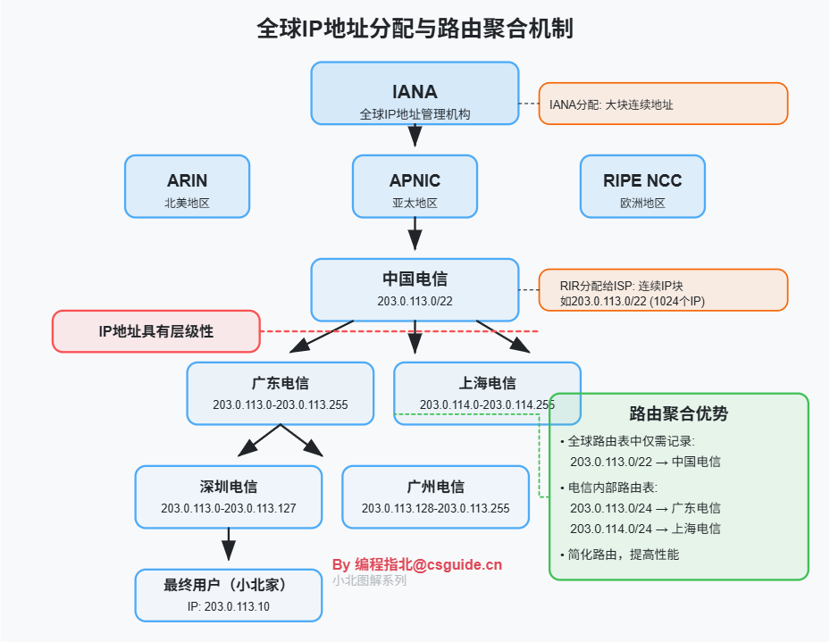

#### IPv6

目前，互联网上并行使用着两个版本的 IP 协议：IPv4 和 IPv6 。IPv4 是第一个被广泛部署的版本，它由 32 位二进制数组成，约能提供 43 亿个地址，该地址池已于 2019 年 11 月正式耗尽 。为了解决地址短缺问题，128 位的 IPv6 应运而生，它提供了海量的地址空间，能够满足未来互联网发展的需求。

IPv6 地址由用八段四位十六进制数表示

- IP 地址（如 `2001:0db8:85a3:0000:0000:8a2e:0370:7334`）是 128 位二进制数，分 8 段显示
- 每段 `0x0-0xffff`

特殊 IPv6 地址：

* `::1`：用于回环地址，即指向本机地址，常用于测试网络应用是否能够在本地正常运行。
* `::`：用于指定一个无效的或未知的源 IP 地址。
* `255.255.255.255`：广播地址，用于将数据包发送到本地网络上的所有设备。

### 带宽&吞吐量&时延

**带宽**

带宽指的是网络的传输能力，表示单位时间内能够传输的最大数据量。通常使用比特/秒（b/s）作为单位，常见的还有 Kb/s、Mb/s、Gb/s 等。

> 注意这与 WiFI 技术中信道带宽的电磁波的概念相似但不等同。通过 WiFi 的信道、信道带宽、也能算出最大理论速度。

如果你的网络带宽是 100 Mbps，理论上每秒最多可以传输 100 兆比特的数据。但是要注意，带宽是一个理论上的最大值，实际中很难达到这个值。实际速度可能会受到网络拥塞、路由器性能等大打折扣。

**协商带宽**

协商速率是指在当前网络环境中，（无线）路由器与终端支持的理论最快发送与接收速率。早期的网络设备比较简单，速率固定。后来出现了 10Mbps、100Mbps、1000Mbps 等多种速率的设备，为了让不同速率的设备能互相通信，并且能自动适应（短板效应）对方的速度（无需手动设置），就产生了自动协商技术。

协商带宽受设备硬件性能（Wi-FI 信道带宽或频率，路由器交换机规格、网线质量）、客户端设备（网卡规格/电脑老化/省电节能）、手动设置错误等影响。

> 协商带宽通常才是我们所讨论的带宽，而不是运营商承诺的带宽或某个网卡或路由器标注的带宽。

**吞吐量**

吞吐量是指实际单位时间内成功传输的数据量。单位和带宽意义。

吞吐量 ≤ 带宽，在理想情况下，吞吐量可以接近带宽，但实际中通常会小于带宽。

**时延（Delay/Latency）**

时延是指数据从源主机传输到目标主机所需的时间，通常以毫秒（ms）为单位。

在《计算机网络: 自顶向下》 这本书中，提到时延由以下几部分组成：

1. 发送时延：主机将数据包的所有比特推向传输介质所需的时间

   > 计算公式：发送时延 = 数据帧长度(bit) / 发送速率(bit/s)

2. 传播时延：电磁信号在链路上传播所需的时间

   > 计算公式：传播时延 = 链路长度 / 信号传播速度电磁波在真空中的传播速度约为 3×10^8 m/s，在铜线或光纤中会略慢

3. 处理时延：路由器或交换机等设备处理数据包所需的时间，包括检查头部、查找路由表等

4.  排队时延：数据包在网络设备缓冲区中等待被处理的时间

总时延 = 发送时延 + 传播时延 + 处理时延 + 排队时延

简单理解：

* 发送时延——从家里出发的准备时间（路由器把数据包“推”到网线上，受带宽影响）；
* 传播时延——受两个点之间路程（跨海 or 市区 or 家庭）、交通方式（移动网络、WiFi、光纤、铜缆）的交通时间；
* 处理时延——收费站（路由器、交换机、信号塔）查看证件、决定放行的时间；
* 排队时延——瞬间涌入的车辆堵车堵在收费站（网络拥堵是时延变化的主要来源，受使用流量影响）。

**往返时延 （RTT）**：是指数据包从源主机发送到目标主机，再返回到源主机所需的总时间。因为日常生成中打开网页、视频通话等应用都是给对方发送请求，然后服务器处理后返回响应，所以 RTT 在实际中应用更加广泛。比如我们经常用 ping 命令测试的就是 RTT。

**延迟带宽积（BDP）**：顾名思义，是指链路的传播时延与带宽的乘积。BDP = 带宽 × RTT，也就是这条光缆能同时容纳多少 “在途中的数据”。

# 物理层

# 数据链路层

# 网络层

# 传输层

# 应用层

## HTTP

### HTTP 简介

**超文本传输协议（HTTP，HyperText Transfer Protocol)** 是一个属于应用层的，用于传输超文本和多媒体内容的协议。主要是为 Web 浏览器与 Web 服务器之间的通信而设计的，是分式体超媒体信息系统（万维网，WWW）的基础。万维网的文档就是通过 HTTP 协议进行传输。

发展历程：	

* HTTP/0.9：1989 年，蒂姆伯纳斯李发明万维网，创建了 HTTP/0.9，仅能返回一个网页。
* HTTP/1.0：1996 年发布，规范显著扩大，能传输 HTHL 以外的文档。
* HTTP/1.1：1997 年发布，第一个标准化版本，是 1.0 的增强。支持持久连接。支持缓存。在此期间出现了使用 SSL/TLS 进行安全加密通信的 HTTPS（安全文本传输协议）。
* HTTP/2.0：2015 年发布，旨在提高 Web 性能，减少延迟，增加安全性，使 Web 应用更加快速、高效和可靠。
* HTTP/3.0：2021 年发布，提高 Web 性能和安全性。

### HTTP 会话方式

HTTP 使用客户端-服务器模型，客户端向服务器发送 HTTP Request（请求），服务器响应请求并返回 HTTP Response（响应）。

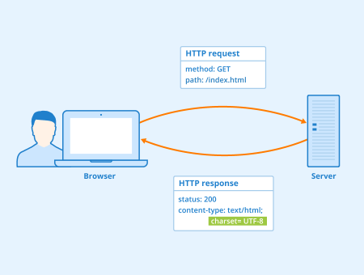

HTTP 协议基于 TCP 协议，发送 HTTP 请求之前首先要建立 TCP 连接。

浏览器与 WEB 服务器的连接过程是短暂的，每次连接只处理一个请求和响应。对每一个页面的访问，浏览器与 WEB 服务器都要建立一次单独的连接。

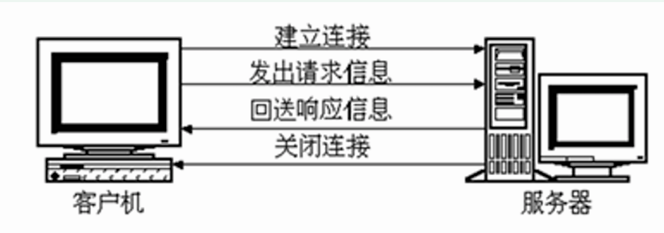

### HTTP/1.1

**支持长连接**

在 HTTP1.0 版本中，浏览器请求一个带有图片的网页，会由于下载图片而与服务器之间开启一个新的连接；但在 HTTP1.1 版本中，允许浏览器在拿到当前请求对应的全部资源后再断开连接，提高了效率。

这种连接称为持久连接，每个持久连接可以处理多个请求-响应事务。

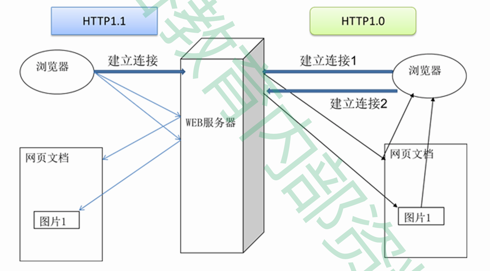

**支持缓存**

HTTP 1.1 版本还支持缓存，节省了带宽使响应速度更快。

### HTTP 报文的格式

主体上分为报文首部和报文主体

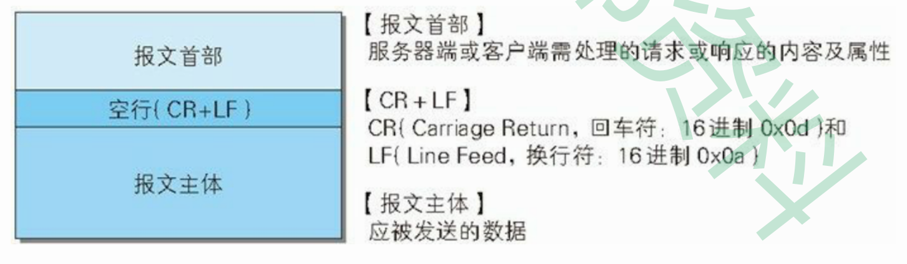

报文首部可细分“行”和”“头”

* 报文首部
  * 请求行/响应行
  * 请求头/响应头
* 报文主体
  * 请求体/响应体

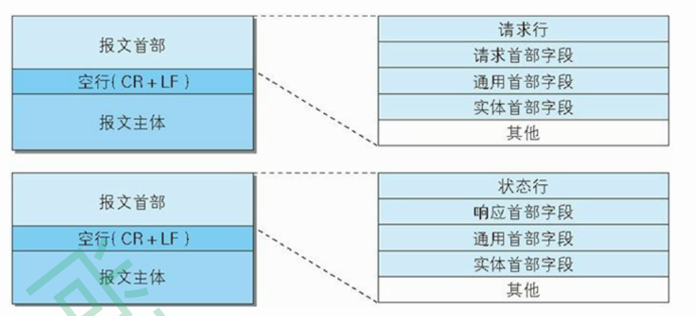

### HTTP 请求报文

HTTP 请求报文由 3 部分组成（请求行，请求头，请求体）

> POST 请求才有请求体

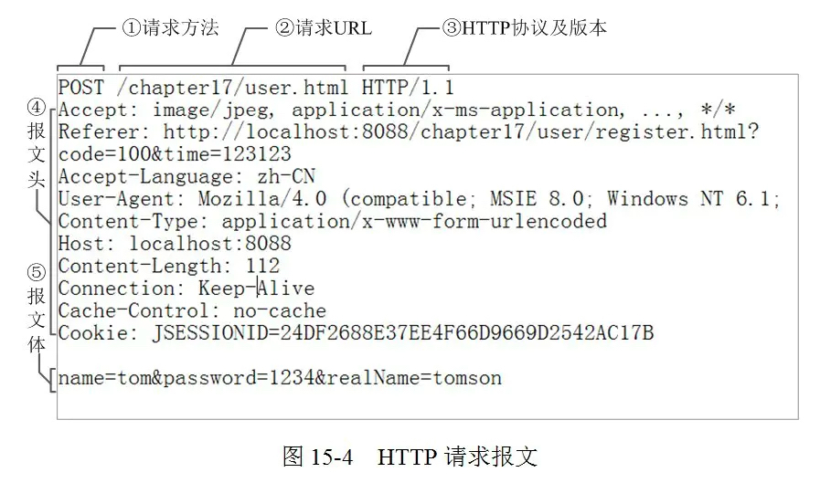

**常见的 HTTP 请求头属性**

- Accpet：浏览器支持接收的响应类型（主要通过 MIME 类型表示，其通用结构为 `type/subtype` ）
- Referer：表示当前页面的上一个页面的路径, 可以通过此路径跳转回上一个页面。
- Cache-Control：对缓存进行控制，如一个请求希望响应的内容在客户端缓存一年，或不被缓可以通过这个报文头设置
- Host：指定要请求的资源所在的主机和端口
- User-Agent：浏览器使用的操作系统、浏览器版本和名称
- Connection：keep-alive 表示持久连接，事务完成后不关闭网络连接  `close` 表示非持久连接，事务完成后关闭网络连接：
- Upgrade-Insecure-Requests：请求协议的自动升级 https
- User-Agent：用户系统信息
- Accept-Encoding：浏览器支持接收的编码格式或压缩形式（一般都是压缩形式），例如: `Accept-Encoding:gzip, deflate`（这两种都是压缩格式）
- Accept-Language：浏览器支持的语言
- Content-Type：请求体数据的类型（主要通过 MIME 类型表示，其通用结构为 `type/subtype` ）
- Content-Length：请求体内容的字节数

### HTTP 响应报文

响应报文与请求报文一样，由三个部分组成(响应行，响应头，响应体)

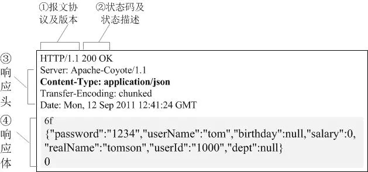

**常见的 HTTP 响应头属性**

- Content-Type：响应体数据的类型（告诉客户端根据什么类型解析该响应体内容，主要通过 MIME 类型表示，其通用结构为 `type/subtype` ）
- Content-Length：响应体内容的字节数
- Date：响应的时间点（可能有时区差）
- Cache-Control：告诉客户端该怎么控制响应体内容的缓存
- Keep-Alive：`timeout=20` 告诉客户端持久连接应该维持多久
- ETag：表示你请求资源的版本，如果该资源发生啦变化，那么这个属性也会跟着变
- Location：在重定向中或者创建新资源时使用
- Set-Cookie：服务端可以设置客户端的 cookie

**响应状态码**

| 状态码  | 状态码英文名称                  | 中文描述                                                     |
| :------ | :------------------------------ | :----------------------------------------------------------- |
| 100     | Continue                        | 继续。客户端应继续其请求                                     |
| 101     | Switching Protocols             | 切换协议。服务器根据客户端的请求切换协议。只能切换到更高级的协议，例如，切换到 HTTP 的新版本协议 |
|         |                                 |                                                              |
| **200** | **OK**                          | **请求成功。一般用于 GET 与 POST 请求**                          |
| 201     | Created                         | 已创建。成功请求并创建了新的资源                             |
| 202     | Accepted                        | 已接受。已经接受请求，但未处理完成                           |
| 203     | Non-Authoritative Information   | 非授权信息。请求成功。但返回的 meta 信息不在原始的服务器，而是一个副本 |
| 204     | No Content                      | 无内容。服务器成功处理，但未返回内容。在未更新网页的情况下，可确保浏览器继续显示当前文档 |
| 205     | Reset Content                   | 重置内容。服务器处理成功，用户终端（例如：浏览器）应重置文档视图。可通过此返回码清除浏览器的表单域 |
| 206     | Partial Content                 | 部分内容。服务器成功处理了部分 GET 请求                        |
|         |                                 |                                                              |
| 300     | Multiple Choices                | 多种选择。请求的资源可包括多个位置，相应可返回一个资源特征与地址的列表用于用户终端（例如：浏览器）选择 |
| 301     | Moved Permanently               | 永久移动。请求的资源已被永久的移动到新 URI，返回信息会包括新的 URI，浏览器会自动定向到新 URI。今后任何新的请求都应使用新的 URI 代替 |
| **302** | **Found**                       | **临时移动。与 301 类似。但资源只是临时被移动。客户端应继续使用原有 URI** |
| 303     | See Other                       | 查看其它地址。与 301 类似。使用 GET 和 POST 请求查看               |
| **304** | **Not Modified**                | **未修改。所请求的资源未修改，服务器返回此状态码时，不会返回任何资源。客户端通常会缓存访问过的资源，通过提供一个头信息指出客户端希望只返回在指定日期之后修改的资源** |
| 305     | Use Proxy                       | 使用代理。所请求的资源必须通过代理访问                       |
| 306     | Unused                          | 已经被废弃的 HTTP 状态码                                       |
| 307     | Temporary Redirect              | 临时重定向。与 302 类似。使用 GET 请求重定向                     |
|         |                                 |                                                              |
| 400     | Bad Request                     | 客户端请求的语法错误，服务器无法理解                         |
| 401     | Unauthorized                    | 请求要求用户的身份认证                                       |
| 402     | Payment Required                | 保留，将来使用                                               |
| 403     | Forbidden                       | 服务器理解请求客户端的请求，但是拒绝执行此请求               |
| **404** | **Not Found**                   | **服务器无法根据客户端的请求找到资源（网页）。通过此代码，网站设计人员可设置 "您所请求的资源无法找到" 的个性页面** |
| **405** | **Method Not Allowed**          | **客户端请求中的方法被禁止**                                 |
| 406     | Not Acceptable                  | 服务器无法根据客户端请求的内容特性完成请求                   |
| 407     | Proxy Authentication Required   | 请求要求代理的身份认证，与 401 类似，但请求者应当使用代理进行授权 |
| 408     | Request Time-out                | 服务器等待客户端发送的请求时间过长，超时                     |
| 409     | Conflict                        | 服务器完成客户端的 PUT 请求时可能返回此代码，服务器处理请求时发生了冲突 |
| 410     | Gone                            | 客户端请求的资源已经不存在。410 不同于 404，如果资源以前有现在被永久删除了可使用 410 代码，网站设计人员可通过 301 代码指定资源的新位置 |
| 411     | Length Required                 | 服务器无法处理客户端发送的不带 Content-Length 的请求信息       |
| 412     | Precondition Failed             | 客户端请求信息的先决条件错误                                 |
| 413     | Request Entity Too Large        | 由于请求的实体过大，服务器无法处理，因此拒绝请求。为防止客户端的连续请求，服务器可能会关闭连接。如果只是服务器暂时无法处理，则会包含一个 Retry-After 的响应信息 |
| 414     | Request-URI Too Large           | 请求的 URI 过长（URI 通常为网址），服务器无法处理               |
| 415     | Unsupported Media Type          | 服务器无法处理请求附带的媒体格式                             |
| 416     | Requested range not satisfiable | 客户端请求的范围无效                                         |
| 417     | Expectation Failed（预期失败）  | 服务器无法满足请求头中 Expect 字段指定的预期行为。           |
| 418     | I'm a teapot                    | 状态码 418 实际上是一个愚人节玩笑。它在 RFC 2324 中定义，该 RFC 是一个关于超文本咖啡壶控制协议（HTCPCP）的笑话文件。在这个笑话中，418 状态码是作为一个玩笑加入到 HTTP 协议中的。 |
|         |                                 |                                                              |
| **500** | **Internal Server Error**       | **服务器内部错误，无法完成请求**                             |
| 501     | Not Implemented                 | 服务器不支持请求的功能，无法完成请求                         |
| 502     | Bad Gateway                     | 作为网关或者代理工作的服务器尝试执行请求时，从远程服务器接收到了一个无效的响应 |
| 503     | Service Unavailable             | 由于超载或系统维护，服务器暂时的无法处理客户端的请求。延时的长度可包含在服务器的 Retry-After 头信息中 |
| 504     | Gateway Time-out                | 充当网关或代理的服务器，未及时从远端服务器获取请求           |
| 505     | HTTP Version not supported      | 服务器不支持请求的 HTTP 协议的版本，无法完成处理               |

### MIME 类型

MIME (Multipurpose Internet Mail Extensions) 是描述消息内容类型的标准，用来表示文档、文件或字节流的性质和格式。

MIME 的组成结构非常简单，由类型与子类型两个字符串中间用 `/` 分隔而组成，不允许有空格。`type` 表示可以被分多个子类的独立类别，`subtype` 表示细分后的每个类型。

常见的 MIME 类型：

- **text/html** ： HTML 格式
- text/plain ：纯文本格式
- text/xml ： XML 格式
- image/gif ：gif 图片格式
- image/jpeg ：jpg 图片格式
- **image/png**：png 图片格式
- application/xhtml+xml ：XHTML 格式
- application/xml： XML 数据格式
- application/atom+xml ：Atom XML 聚合格式
- **application/json**： JSON 数据格式
- application/pdf：pdf 格式
- application/msword ： Word 文档格式
- application/octet-stream ： 二进制流数据（如常见的文件下载）
- **application/x-www-form-urlencoded** ： `<form encType="">` 中默认的 encType，form 表单数据被编码为 key/value 格式发送到服务器（表单默认的提交数据的格式）
- **multipart/form-data** ： 需要在表单中进行文件上传时，就需要使用该格式

MIME 对照表：

[MIME 类型 | 菜鸟教程](https://www.runoob.com/http/mime-types.html)

## HTTPS

# 参考资料

[网络指北介绍(图解版， 正在陆续发布中) | 编程指北-计算机学习指南](https://csguide.cn/network/)

[【职造便利店】ISO七层模型常用网络协议拓扑图 流程图模板_ProcessOn思维导图、流程图](https://www.processon.com/view/62ea08ad0e3e740772bdbd37)

[计算机网络核心知识点 | 二哥的Java进阶之路](https://javabetter.cn/cs/wangluo.html)
