# 企业级系统

企业级系统（Enterprise System）是专门为大型企业或组织开发的软件，旨在满足复杂业务需求，整合和管理企业内部的各类业务流程，包括财务、人力资源、供应链、客户关系管理等。

## OA

OA 系统（Office Automation System，办公自动化系统）是一种用于协调、管理和优化办公流程的软件系统，包括电子邮件、日程安排、文档管理、公文管理、工作流程管理、通知公告等功能模块，帮助企业提高工作效率、增加协同办公能力、强化决策的一致性和提高管理水平。

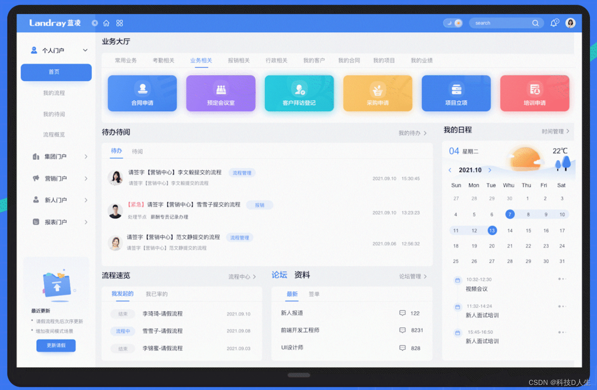

典型厂家：微软、IBM、飞书、钉钉。

## CRM

CRM 系统（Customer Relationship Management，客户关系管理系统））是一种用于管理客户关系的软件系统，包括线索管理、客户信息管理、客户服务管理、商机管理、销售管理、客户公海、客户画像、交易管理、营销管理等功能模块，帮助企业提高客户满意度和市场竞争力。

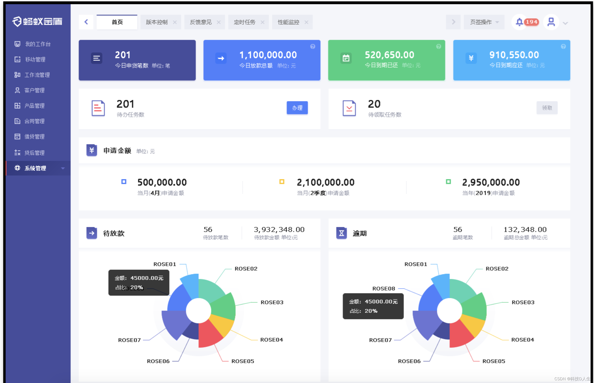

典型厂家：纷享销客、销售易、神州云动、销帮帮、红圈、Salesforce、hubspot、zoho等。

## ERP

ERP 系统（Enterprise Resource Planning，企业资源计划系统）是一种用于管理企业各类资源的软件系统，包括供应链管理、采购管理、生产管理、质量管理、库存管理、人力资源管理、财务管理等功能模块，帮助企业实现资源的优化配置和管理。

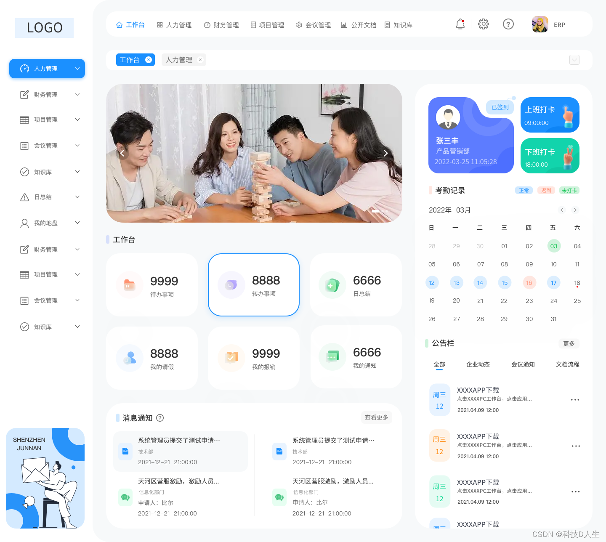

典型厂家：用友、金蝶、鼎捷、管家婆、聚水潭、oracle、SAP。

## MES

MES 系统（Manufacturing Execution System，制造执行系统）是一种用于面向制造企业车间执行层的管理制造过程的软件系统，包括生产计划管理、生产调度管理、设备管理、成本管理、项目看板、工艺管理、质量管理等功能模块，帮助企业提高生产效率和质量水平。

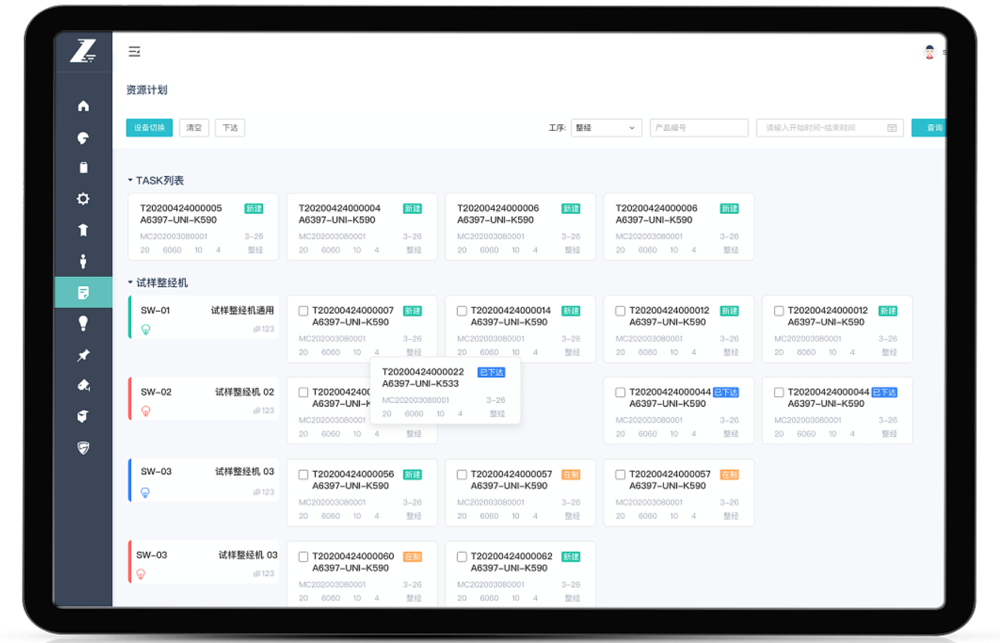

典型厂家：鼎捷、宝信、柏楚、赛意、西门子、霍尼韦尔。

## QMS

QMS 系统（Quality Management System，质量管理系统）是指在质量方面指挥和控制组织的管理体系。质量管理体系是组织内部建立的、为实现质量目标所必需的、系统的质量管理模式，是组织的一项战略决策，包括样品管理、仪器设备管理、检测配置、客户质量管理、质量分析、变更管理、标签管理等模块。

典型厂家：海克斯康、华会、万物、安必兴、云质、西门子、库得克。

## HRM

HRM 系统（Human Resource Management，人力资源管理系统）是一种用于管理人力资源的软件系统，包括招聘管理、培训管理、绩效管理、薪酬管理等功能模块，帮助企业提高员工满意度和管理效率。

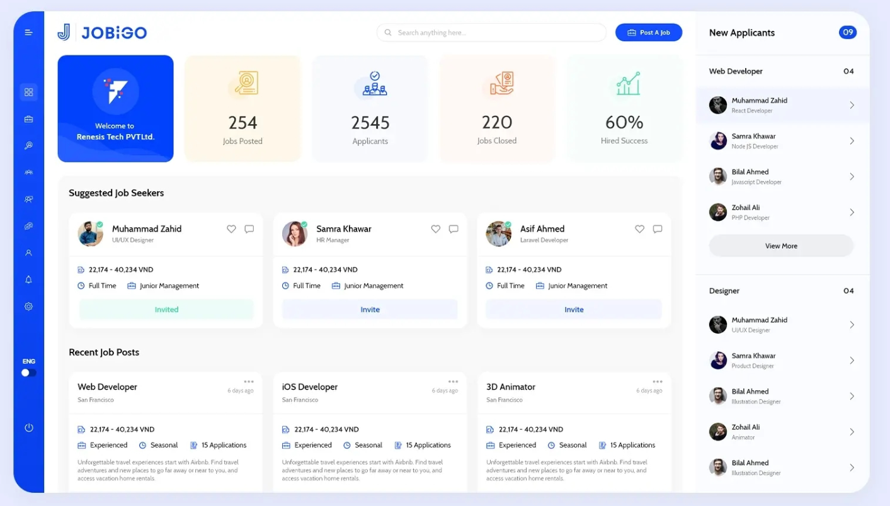

## SCM

SCM 系统（Supply Chain Management，供应链管理系统）是一种用于管理供应链的软件系统，包括采购管理、供应商管理、物流管理、库存管理等功能模块，帮助企业实现供应链的协同和优化。

## WMS

WMS 系统（Warehouse Management System，仓库管理系统）是一种用于管理仓库的软件系统，包括入库管理、出库管理、库存管理、配送管理等功能模块，帮助企业提高仓库管理效率和准确性。

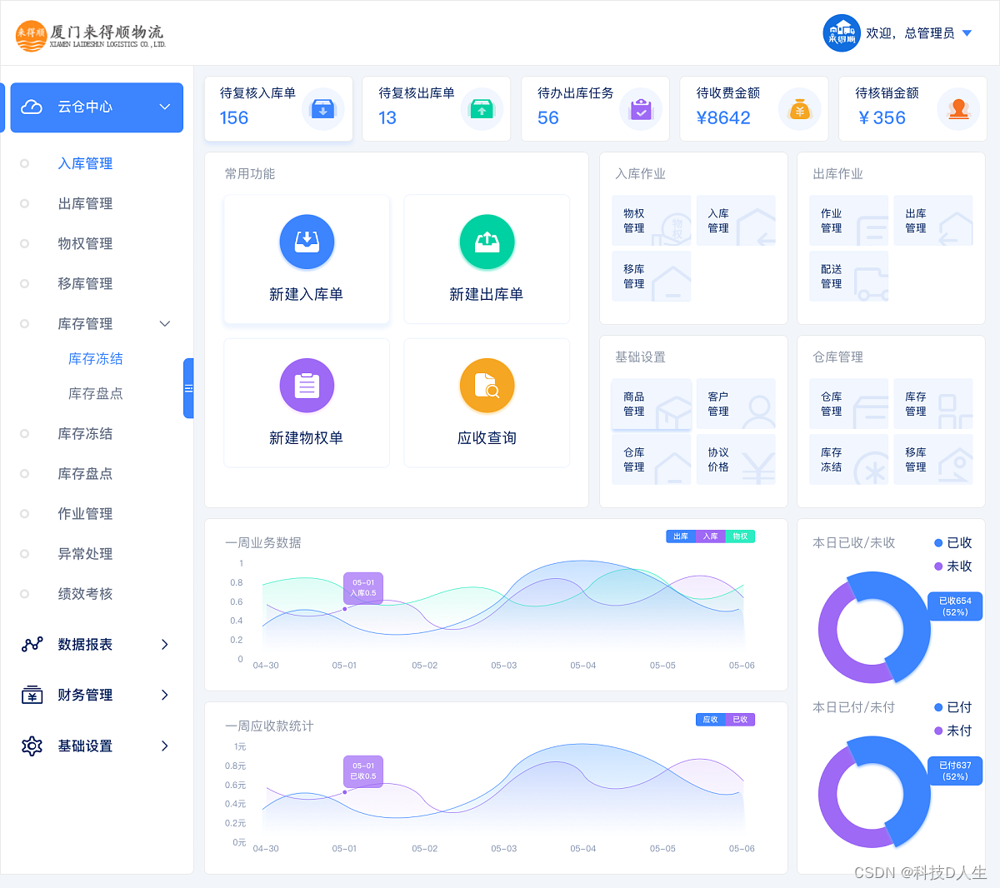

典型厂家：富勒、巨沃、科箭、普罗格、Infor。

## KMS

KMS 系统（Knowledge Management System，知识管理系统）是一种用于管理知识资源的软件系统，包括知识库管理、知识分类和标签、搜索引擎、协作与分享等功能模块，帮助企业提高知识管理和利用效率。

## OMS

OMS 系统（Order Management System，订单管理系统）是一种电子商务系统，主要用于管理订单、库存、物流和客户服务等方面的业务流程。OMS 系统可以帮助企业实现订单的自动化处理、库存管理、物流跟踪和客户服务等功能，提高订单处理效率和准确度，降低企业的运营成本，提高客户满意度。

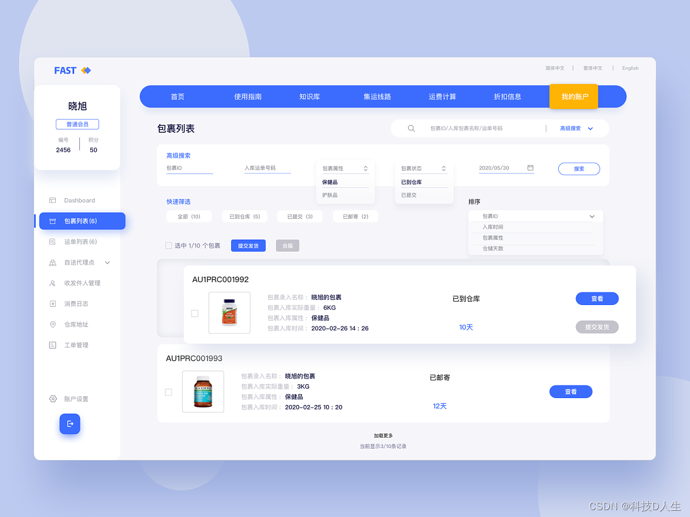

典型厂家：商派、巨益、百胜。

## CMS

CMS 系统（Content Management System，内容管理系统）是一种用于管理网站内容的软件系统，可以帮助网站管理员快速、方便地创建、编辑、发布和管理网站内容，如文章、图片、视频等。

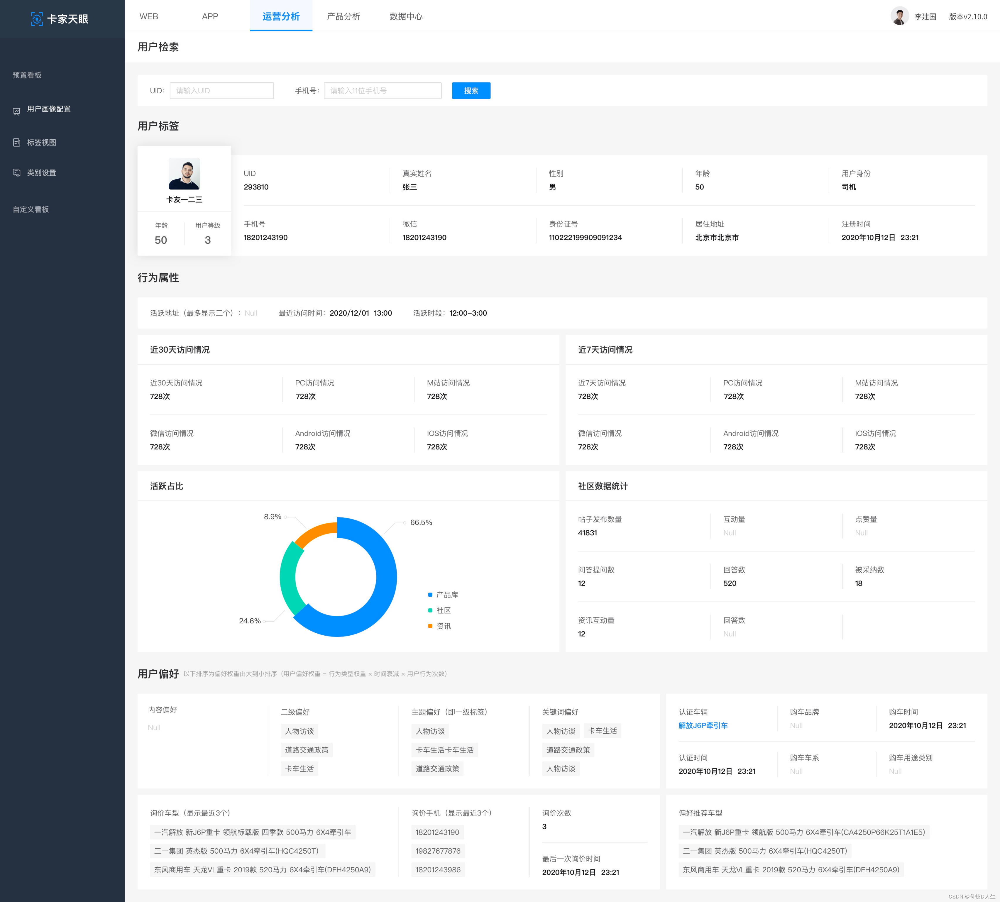

典型厂家：织梦、凡科、帝国、WordPress、Drupal、Sitecore。

## PMS

PMS 系统（Project Management System，项目管理系统）是一种用于项目管理的软件系统，可以帮助项目经理和团队成员实现项目计划、进度管理、任务分配、团队协作等方面的业务流程自动化，提高项目管理效率和质量。

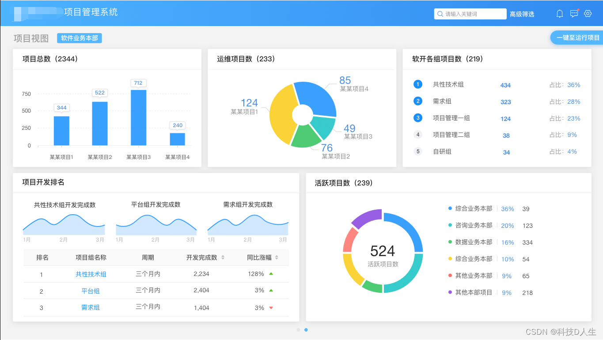

## TMS

TMS 系统（Transportation Management System，运输管理系统）是一种用于运输管理的软件系统，可以帮助企业实现运输计划制定、运输调度、运输跟踪、运输成本控制等方面的业务流程自动化，提高运输管理效率和质量。

## BI

BI系统（Business Intelligence System，商业智能系统）是一种用于数据分析和决策支持的软件系统，包括自助分析、可视化大屏、中国式报表、可视化ETL等功能模块，可以帮助企业从海量数据中提取有价值的信息，并进行分析、展示和预测，为企业决策提供支持和指导。

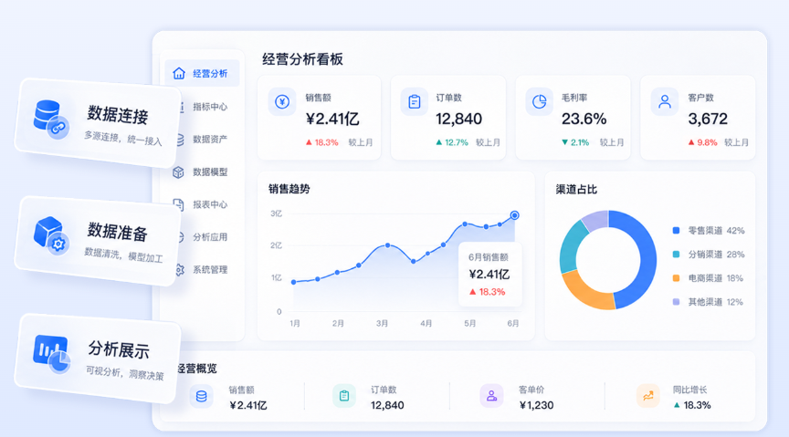

典型厂家：帆软、Smart Bl、Power Bl。

## BPMN

BPMS系统是（Business Process Management System，业务流程管理系统）是一种基于软件的业务流程管理工具，可以帮助企业对业务流程进行建模、优化、执行和监控，提高企业的业务效率和管理水平。BPMS系统的主要功能包括业务流程建模、流程优化、流程执行和流程监控等。

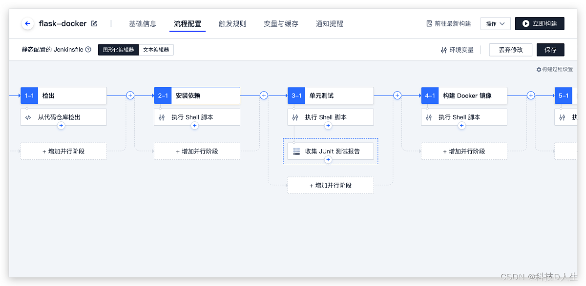

## SCRM
SCRM（Social Customer Relationship Management System，社交客户关系管理系统）是一种基于社交媒体的客户关系管理工具，可以帮助企业通过社交媒体与客户进行互动和交流，提高客户满意度和忠诚度。SCRM系统的主要功能包括社交媒体监测、社交媒体管理、客户服务和客户分析等。

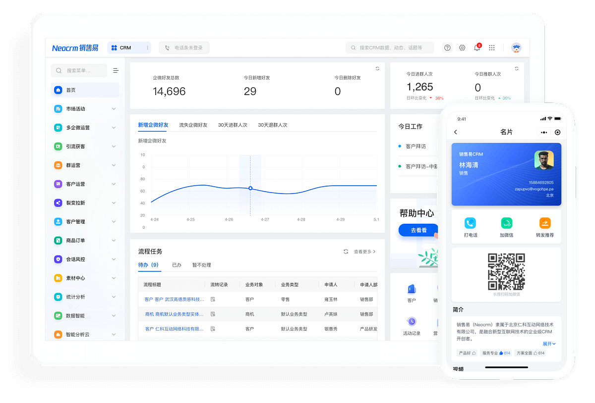

典型厂家：尘锋SCRM、探马SCRM、快鲸SCRM、微伴助手、卫瓴SCRM。

## DSS

DSS系统（Decision Support System，决策支持系统）是一种基于计算机技术和数据分析的决策支持工具，可以帮助企业进行决策分析和决策制定，提高企业的决策效率和决策质量。DSS系统的主要功能包括数据收集、数据分析、决策模型和决策支持等。

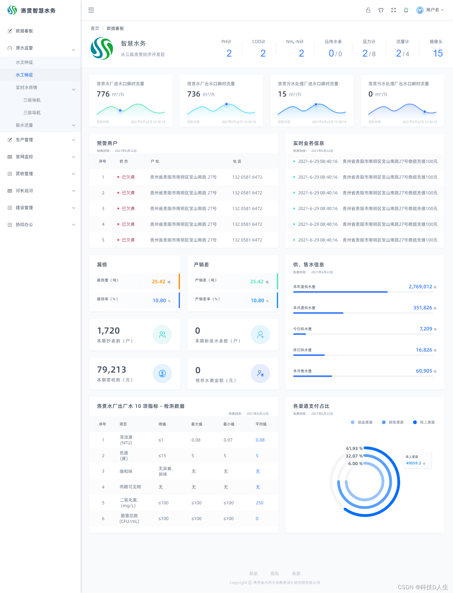

## LIMS

LIMS系统（Laboratory Information Management System，实验室信息管理系统）是指通过计算机网络技术对实验的各种信息进行管理的计算机软、硬件系统，包括委托管理、收样管理、任务管理、样品流转、报告管理、自动采集、财务和工资管理、标签管理、设备管理、实验室数据管理等模块。

典型厂家：元宇、松虎、赛印、博什兰、白码、牵翼云。

# 参考链接

- [一文扫盲 OA、CRM、ERP、MES、HRM、SCM、WMS、KMS 等 B 端系统_erp oa crm saas cms-CSDN 博客](https://blog.csdn.net/u012562943/article/details/131234732)
- [ERP、CRM、SRM、PLM、HRM、OA……都是啥意思？ - 知乎](https://zhuanlan.zhihu.com/p/664031108)