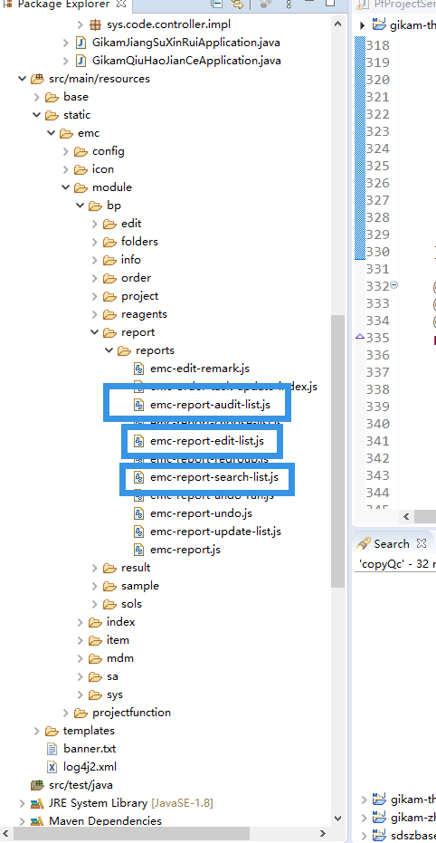
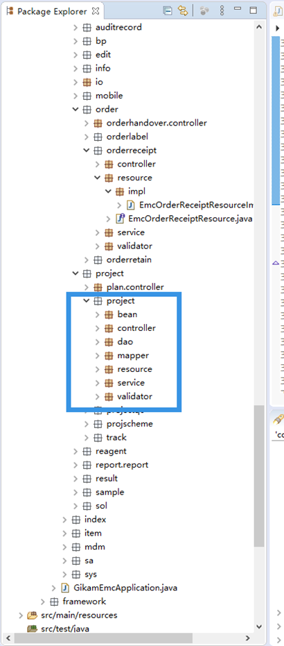
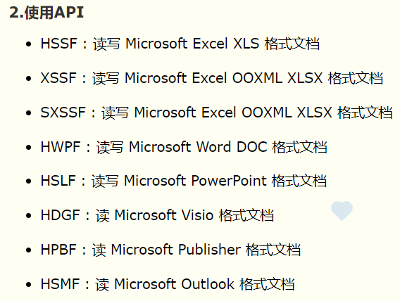
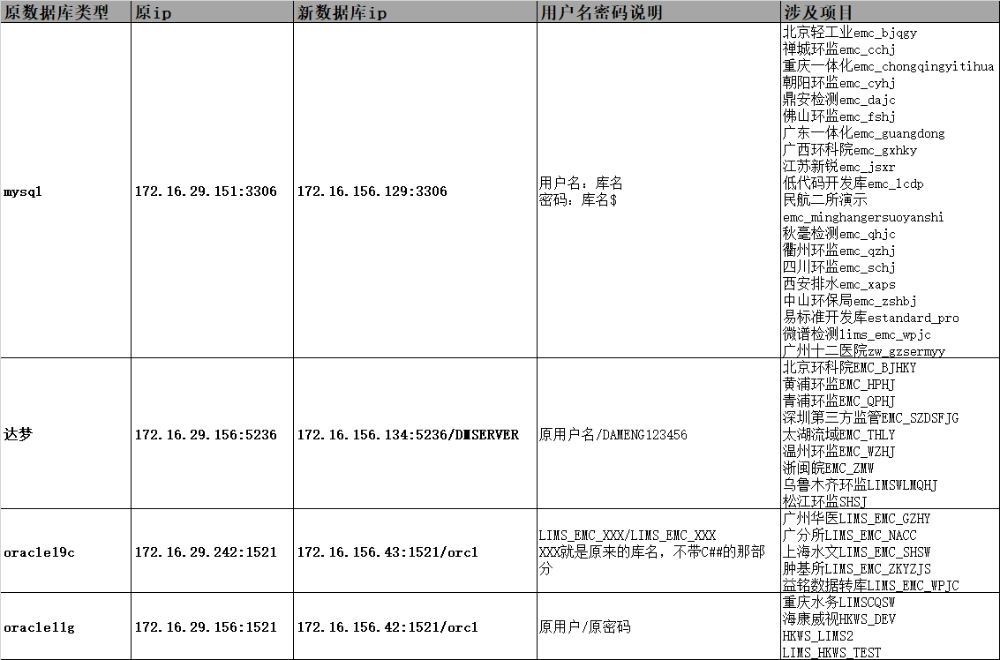

# 导航

# 工作账号
| 名称                                                         | 账号                                                  | 密码                       | 备注                                                         |
| ------------------------------------------------------------ | ----------------------------------------------------- | -------------------------- | ------------------------------------------------------------ |
| Foxmail                                                      | [liuye@sunwayworld.com](mailto:liuye@sunwayworld.com) | @Tintin0427                |                                                              |
| [iTalent 一体化人才管理云平台](https://www.italent.cn)       | liuye@sunwayworld.com                                 | @Tintin0427                |                                                              |
| [北京三维天地综合业务系统 ](https://pmc.sunwayworld.com/pm/) |                                                       |                            |                                                              |
| [神州普云报工系统](https://pmc.sunwayworld.com/project/)     | liuye                                                 | @Tintin0427                | 每周一报工，或节假日结束后的第一天报工                       |
| [禅道 ](https://pmc.sunwayworld.com/zentao)                  | liuy                                                  | @Tintin0427                | 项目问题指派                                                 |
| [智乾 LICENSE 管理平台 ](https://license.sunwayworld.com/)     | liuye                                                 | tintin0427                 | 申请项目的本机 license<br />Mylt9tf9wsd/c4m3r1LAWWCaRN3zA6vqeSWHWkZpXj8YgP4oSFgG6oHDo9z1QXl0JTd8jOAT+36LhLl9cd6I7g ==<br/>Mylt9tf9wsd/c4m3r1LAWV0jHZRVrNEuXLtdwlNZTfmmI7I89lPEUy5ANgk6ck0D4ppXIWy07J1LJQbRNsG9XWlECwYK0VNF<br/>Mylt9tf9wsd/c4m3r1LAWUA5sElrG2szh+2QqlffWpPLEbXYRbAAn1u5yCuk0FBvShugjmW08rJ/S0esDul/h2lECwYK0VNF<br />Mylt9tf9wsd/c4m3r1LAWVLA3mOI+8FrfJVDIudLpuqFvXNDFUaP4mfcm+Mx8r6uSyDUy6nvxsdlaFIhGNIFkmlECwYK0VNF<br />Mylt9tf9wsd/c4m3r1LAWZ15dyohcOIk7aE4TF0BMsvqW27GSrL8kTH7UzYvk3TC5KeAZoUNAwJRSicrUEpcBGlECwYK0VNF |
| [Projects · Dashboard · GitLab (sunwayworld.com)](https://gitlab.sunwayworld.com/) | liuye                                                 | @Tintin0427                | 三维 gitlab                                                   |
| [实验室基础框架 (sunwayworld.com)](https://pubwiki.sunwayworld.com/) | changsp                                               | changsp                    | 代码生成器                                                   |
| svn                                                          | liuye                                                 | TkhbyImEfSuvOozp           | 资源与项目检出 https://svndev.sunwayworld.com/svn/...         |
| maven                                                        | liuye                                                 | Q0QWewKUP82Q               | 依赖仓库                                                     |
| vpn                                                          | liuye                                                 | yN3Y7h2V @Tintin0427       | 连接项目数据库                                               |
| [ONLYOFFICE Docs Community Edition](http://localhost:8111/welcome/) |                                                       |                            | onlyOffice 欢迎页                                             |
| [公司测试 mysql 数据库](jdbc:mysql://172.16.29.152:3306)       |                                                       |                            | ?serverTimezone = GMT%2B8&useUnicode = true&characterEncoding = utf-8&useSSL = false |
| [公司测试 mysql 数据库](jdbc:mysql://172.16.156.131:3306)      | root                                                  | sunway612                  | 172.16.112.21<br/>administrator/m63Wti4gxy#T                 |
| [公司测试 mysql 数据库 8.0.33](jdbc:mysql://172.16.156.131:3306) | lims2                                                 | lims2$                     | ?serverTimezone = GMT%2B8&useUnicode = true&characterEncoding = utf-8&useSSL = false |
| [公司测试 dm 数据库](jdbc:dm://172.16.29.156:5236)             | EMC_XXXX                                              | sunway_emc                 | ?schema = EMC_XXXX                                             |
| [公司测试 sqserver 数据库](jdbc:sqlserver://;serverName=172.16.156.136:1433) | lims2                                                 | lims2$                     | ; DatabaseName = emc_XXXX                                       |
| [帆软 11.0 决策系统](http://localhost:8080/webroot/decision)   | admin                                                 | admin                      | 集成部署                                                     |
| [广西环科院公网](https://202.103.233.154:8089/)<br />        | raoguibin                                             | ASDasd@123123              | 本地地址：http://localhost: 8089<br />vpn 地址：202.103.233.158:6666<br />vpn 账号密码：vpn_谭磊   QWEqwe@9876543210 <br />堡垒机：bl_tanlei QWEqwe@123456789<br />远程服务器账号：Administrator  ic_gxhky@126.com<br />平板激活码：limsgxhky |
| [秋毫检测公网](http://58.215.200.126:8090/)<br />            | qhadmin                                               | qh123                      | 本地地址：http://localhost: 8088<br />vpn 地址：58.215.200.126<br/>vpn 账号密码：admin     qh123<br />应用服务器地址：192.168.98.184<br />应用服务器账号密码：administrator  Qh@123123<br />数据库服务器地址：192.168.98.3<br />数据服务器账号密码：administrator  Qh@123123<br />Mysql 用户密码 : root<br />签章系统：用户名：admin 密码：hnca111111 |
| [盐城环监公网](http://180.100.202.217:8081/)<br />           | ycadmin                                               | Ycjc@123                   | [三维天地工作记录盐城环监正式环境.txt](assets\盐城环监正式环境.txt) |
| [苏州苏水正式内网](http://192.168.10.174:10002/)<br/>[苏州苏水测试内网](http://192.168.10.35:10002/) | admin                                                 | Sshj1207                   | 苏水<br/>--vpn<br/>深信服 easyconnect<br/>https://222.92.12.42:12343/<br/><br/>vpn 账号：yongy  密码：sslims@12345<br/><br/>--堡垒机<br/>堡垒机地址：https://192.168.10.170 (浏览器打开)<br/>堡垒机账号：LIMS  密码：sslims00!<br/><br/>系统地址：http://192.168.10.174:10002/<br/>系统账号：hutc  LootTable#3<br/><br/>admin Sshj1207<br/>liuaq<br/>sshj123456+<br/>数据库服务器：172.168.1.94 密码 xxzxJNSW2022<br/>数据库用户名和密码： sa/Sshj1207<br/>192.168.10.35 测试服务器  sa/Sshj1207 |
| 广西一体化                                                   |                                                       |                            | vpn 网址：https://124.227.192.93:63412/<br/>vpn：账号密码：吴怀梁 ! QAZ2wsx123<br/>                         许园园  kWwmG94! Tc<br/>堡垒机：https://59.211.220.8/ 账号：sxhjt-hjsw-user02 密码：QWEqwe@12345678900<br/>            服务器        10.14.2.152 账号密码：administrator Lc12345678ab?              <br/>		10.14.2.169 账号密码：administrator GXlims@12345 |
| 深圳地方监管                                                 |                                                       |                            |                                                              |
| 昆山水务                                                     | admin                                                 | 111111                     | 本地地址：http://localhost: 8288<br />vpn 地址：[实验室信息管理系统](http://webagent.sangfor.net.cn/ssl/ksszlsjt.php)<br/>VPN 账户：guanli02     Lims1234!<br />数据库地址：172.16.255.12:4306<br />数据库密码：root    Lims123!<br />数据库驱动属性 allowpubicKeyretrieve 设置为 true<br /> |
| 中山社会监管                                                 |                                                       |                            | 本地地址：http://localhost: 8180<br />                        |
| 中山环监                                                     | admin<br />panjin                                     | Admin@12<br />zs090709PJ** | todesk : admin@1                                             |
| 四川辐射站监管                                               |                                                       |                            |                                                              |
| 南通环监                                                     | admin                                                 | Lims123456!                | [南通云服务正式环境信息_调整.txt](assets\南通云服务正式环境信息_调整.txt) |
| 江苏益民                                                     |                                                       |                            | VPN 地址：https://vpn.jsti.com<br/>VPN 账户/密码: jxlims02 /Jxlims#2021 |
| 广分所                                                       |                                                       |                            | vpn 地址：https://14.23.100.146:4043<br />vpn 账号：sunwayE/Fenxi2024<br />环境服务器					<br/>测试服务器	192.168.101.33			用户名：Administrator	密码：Fenxi2021<br/>LIMS 环境线报表服务器	192.168.101.34			用户名：administrator	密码：Fenxi2021<br/>LIMS 环境线应用服务器	192.168.101.35			用户名：administrator	密码：Fenxi2021<br />环境帆软数据库连接名称：192.168.101.35	<br/>环境库：c##gfs/Gkamlims2021@orcl       表空间: DANTE_DATA 	<br />环境 lims 管理员账号密码应该都是 ym |
| [微谱正式内网](http://111.229.153.157:5657)                  |                                                       |                            |                                                              |
| 深圳希诺能源                                                 | liuy                                                  | hz147258                   | [1.Motionpro 安装说明 (1).doc](assets\1.Motionpro安装说明 (1).doc)<br />[堡垒机常见问题及解决方案汇总_V2.0_20230428 (1).docx](assets\堡垒机常见问题及解决方案汇总_V2.0_20230428 (1).docx)<br />VPN 用户名/密码: 姓名拼音/手机号<br />堡垒机用户名/密码：姓名拼音/^YHN7ujm123<br/>mysql  10.7.201.11:3306  用户/密码：root/Sunway_emc |
| [广东省生态环境监测实验室信息管理系统 (gdeei.cn)](https://m.gdeei.cn/molims/) | shenzhenzhan                                          | sz100101$                  | 古添发账号：gutianfa  密码：Gtf441424?<br />liangqilin Hehe？151125 |
| [福建中孚检测-环境监测业务管理系统](http://47.120.13.240:8089/) |                                                       |                            | 公网 ip：47.120.13.240:1688<br/>    用户名：sanweiLIMS<br/>密码：z44r9vNnLduVeBsD |

# 话术

* 审批 license

> @研发中心_张京日 张总，麻烦帮忙审批一下 license 申请 

* 忘记打卡的不能走系统申请，忘记打卡通过发邮件


# 工作日报

收件人:

songyh <songyh@sunwayworld.com>
 tiang <tiang@sunwayworld.com>

 抄送人:
 zhangy <zhangy@sunwayworld.com>
 zhangyl <zhangyl@sunwayworld.com>

 # 近期 license

试用期的 license

Mylt9tf9wsd/c4m3r1LAWWCaRN3zA6vqeSWHWkZpXj8YgP4oSFgG6oHDo9z1QXl0JTd8jOAT+36LhLl9cd6I7g ==

## 部门人员配置

开发：宋宇航（导师）、常胜朋

实施：黄涛、方想

直接领导：田果

部门经理：张勇

# 记录     

项目的文件基本上都放在 module 文件夹下，framework 文件包放的是一些工具类，bp 包下放的是主业务流程相关文件，index 放的是项目项目首页配置和一些其他功能的配置，只要体现在 js 上，item 包下放的是除主业务流程和静态数据相关的其他功能的文件，mdm 放的是静态数据相关的文件，剩下的放的比较乱

 

 

 这个是五个静态数据


 这个是五个主业务流程
 你可以结合昨天我发你的培训资料里的东西先看看，配合页面更直观

 

 

给你个需求，需要编制审核查询三个页面，这三个页面的字段都一样只有按钮功能不一样，审核页只有审核按钮，查询页没有按钮

 命名规则，编制页是 edit，审核页是 audit，查询页是 search

 


 一个功能模块的结构，resource 这一层是接收页面的请求并将请求传给 service

 

 写到这个项目下，一般情况下存在继承的项目中从父项目上继承下来的都写到 projectfunction 下面，新增的写在 module

 这个是项目原型也就是父项目, emc-third-qiuhaojiance 是子项目

 咱们部门里面一般都是把父项目叫做原型，子项目叫做项目，统一叫法方便理解


icon 就不用说了，i18n 是字段国际化，config 里面是配置下拉框或者弹出选择框的


这种的是配置页面列表的，field 对应的是实体类里面的字段，title 对应的是 i18n 里面的内容，type 可以配置表格中这一列的输入规则比如时间、下拉框、弹出选择框、数字等等


formatter 的作用是比如这个值原本要显示的值是 1 你可以通过这个方法让他显示成任何内容包括增加图片啥的


也可以搞成超链接


下拉选择框大部分是系统编码配置的对应的数据库表是 T_CORE_CODE_CATEGORY 和 T_CORE_CODE


这种是下拉框的写法


onBeforeChoose 可以给弹出框传递参数，onAfterChoose 是接收弹出框的返回值并复制给需要这个返回值的数据，onClean 是监测单元格是否情况的，这种带弹出框的单元格会有一个 x 的图标，点了之后会触发这个方法


这个地方有两个和 emc 平级的 gikam 文件夹和 module 文件夹，不用管就行，用不到


有新增的 sql 的话就这个文件夹里面就行，里面有格式，你照着格式写就 ok


还有就是 mapper 的格式，where 的 include 这个是必须加的因为这个是工作流附带的条件语句，when 的 include 的作用是前端配置的排序规则可以直接自动拼接 sql


这个方法是获取提交工作流的

核心是这么写的


通过这个应该是可以直接获取到 common 的，如果这个不行的话就直接从 wrapper 里面截取审核意见就行

一般没人这么存，都是链接的表查的，但是链接表的话又会把 sql 搞的很慢


这个是获取通过的工作流的


直接用 wrapper.getParamValue("bpmn_comment")可以获取到审核意见


这块是 excel 模板导入导出的代码


StringUtils.isEmpty()也可以用，我一般用 ObjectUtils，StringUtils.isNumber 是判断字符串是不是数字型的

ObjectUtils.isEmpty 这玩意可以判断一切是否为空，包括对象、集合、字段或者是 map 啥的都能判断

# 经验

## 前端

* 箭头函数

`=>` 是 es6 语法中的 arrow function

```javascript
(x) => x + 6
//等价于
function(x){
    return x + 6;
};
```

* Map 方法用于处理 js 中 [数组] 的数据

```javascript
//方法创建一个新数组，这个新数组由原数组中的每个元素都调用一次提供的函数后的返回值组成。
const array1 = [1, 4, 9, 16];
// pass a function to map
const map1 = array1.map(x => x * 2);
console.log(map1);
// expected output: Array [2, 8, 18, 32]


```

* 某个组件点击未响应，一般为前端问题，例如下面问题表示，ids 变量在前端文件中未定义


* 前端长度必须校验 与数据库限制的字节数一致

其中中文字符：校验长度为字节长度除以 3

* 常用业务方法

```javascript
Gikam.getElParam(页面参数 p)// 初始化html页面时使用 参数为map类型
Gikam.getComp(String 组件id) // 缓存组件的dom对象，可以获取组件的属性或者调用组件方法。
Gikam.cleanCompData(String 组件id) // 清空组件数据方法，主要针对Form和Grid
Gikam.getLastModal()//获取最新创建出来的modal对象
```

* 常见 ajax 方法

```js
Gikam.post(url, jsonData)//json数据类型(通常使用Gikam.getJsonWrapper()包装的数据)
Gikam.getJsonWrapper(p, [b0,bn[]], ...)
```

* 常见其他方法

```
Gikam.extend(是否深度拷贝, 被拷贝对象， 拷贝对象...)
Gikam.each（data || array, callback）对象或数组 进行循环 callback有两个参数 一个index一个item
```

* 常见组件属性

```javascript
preInsert// 显示提前插入数据面板
service//实时修改数据保存用的
dbTable
```

* 常用组件

```js
modal//模态框
layout//布局
form// refresh动态刷新form表单，可不传参数。
```

* 常见字段类型

```js
select
choose // 当字段在grid中时，选择时须指定index  当字段在form时，选择无须指定index
dateTime 
richText
```

* 常见事件

```js
onAfterChoose//选择框选中后的事件 如为grid表单中的字段设置数值
```

* grid 方法、form 方法

```
showColumns() hideColumns()
showFields() hideFields()
```


* 拼接字符串的方法

```js
Gikam.param() //GET方法URL上需要拼接参数的时候使用
Gikam.printf(str, data) // 为字符串中的{参数} 替换值
```

* 验证条件格式

```js
validators: [ 'strLength[0,100]' ]
```

* js 中 ==和== = 区别
  简单来说： == 代表相同， == = 代表严格相同, 为啥这么说呢， 

  这么理解： 当进行双等号比较时候： 先检查两个操作数数据类型，如果相同， 则进行 === 比较， 如果不同， 则愿意为你进行一次类型转换， 转换成相同类型后再进行比较， 而== = 比较时， 如果类型不同，直接就是 false.

* choose 选项框 由 choose-config.js 指定跳转的 choose-list.js 页面


* select 下拉框 由 select-config.js 指定查询的接口


* 字段限制数字类型

```js
            validators : [ 'integer' ],
            type: number,
            hasArrow: true
```

* 获取审核流状态

```js
var status = emcInternalAuditPlan.auditPage.param.bpmn_statusCode;
```

* 打开选择页面


* 下拉框和 onChange 有的核心版本不能同时用，你记一下，真坑这玩意

form 表单中， 下拉框必须判断 value 非空 否则影响表单更新

```js
   onChange: function (field, value) {}
```


* 同一页面 初始化时通过传入不同的参数创建组件 从而实现不同功能


* 页面刷新

```js
workspace.window.showMask(true);
workspace.window.closeMask();
Gikam.getLastModal().window.showMask(true);
Gikam.getLastModal().window.closeMask();
```

* 修改拥有下拉框字段的 下拉框内容

```js
_this.form.setSelectOptions('maintId', items.map(function(item) {
    return {
        value : item.id,
        text : item.maintEvent
    };
}), true);
```

* 前端处理数据

```js
JSON 通常用于与服务端交换数据。
在接收服务器数据时一般是字符串。
我们可以使用 JSON.parse() 方法将数据转换为 JavaScript 对象。
```

* IFM_CONTEXT  = http://ip: port

* 确认框

```js
Gikam.create('confirm', {
    message : msg,
    title : '数据存在以下冲突，是否继续提交！',
    yesText : '确认',
    noText : '取消',
    height : 245,
    onYesClick : function() {
	}
});
```

* 验证表格是否填写完整

```js
//搭配validator
Gikam.getComp('emc-sample-edit-list-data-input-order-task-grid').validate()
```

* js 常用方法

```
splice() 方法用于添加或删除数组中的元素。
unshift() 方法可向数组的开头添加一个或更多元素，并返回新的长度。
shift() 方法用于把数组的第一个元素从其中删除，并返回第一个元素的值
```

* 确认框的蓝色按钮

```js
{
       type: 'button',
       text: 'EMC.MODULE.MDM.BASEMDM.ITEM.TASK_CONSULTING.MODAL.BTN.CONFIRM',
       class: 'blue',
}
```

* 单元格转换为超链接按钮

```js
{
    field : 'id',
    title : 'GIKAM.BUTTON.APPENDIX_INFO',
    formatter : function (i, v) {
         	return '<a href="javascript:;" onclick="emcJudicialArchive.uploadArchiveFile(\'' + v + '\')">上传附件</a>';
    }
}
```

* tab 页签组件

```
可以通过showIndex序列号来跳转指定的的页签组件
而show 可以指定该页签是否显示出来
```

* js 的数值运算 精度问题

```js
// 精度问题 浮点数变成整数来计算,然后再确定小数点的位置

// 1、 四舍五入 保留几位数
number.toFixed(n)
// 2. 不四舍五入 向下取整
num = Math.floor(num * 100) / 100;
console.log(num);            //1.73
console.log(typeof num);     // number
```

* 使用字符串作为索引值

```js
// 更像是对象，且无法map遍历元素	
// 遍历方式
Object.keys(itemArr).forEach(function (key) {
    itemArr.push({
        itemName : key,
        itemId : itemArr[key].join(','),
    })
})
```

* 过滤与 过滤方法的去重

```js
userArr = userArr.filter((item, index)=>userArr.indexOf(item) === index)
// indexOf 只返回第一个相同元素的下标
```

* 去重

```js
userArr = Array.from(new Set(userArr));
```

* 部分检查

```
Array some()；
some() 方法用于检测数组中的元素是否满足指定条件（函数提供）。

some() 方法会依次执行数组的每个元素：

如果有一个元素满足条件，则表达式返回true , 剩余的元素不会再执行检测。
如果没有满足条件的元素，则返回false。
```

* 列数组为空导致错误


* 加载于模态框的页面

```js
            renderTo: Gikam.getLastModal().window.$dom,
```

* 过滤 filter

```

```

* 穿梭框 存在问题

* ajax 请求返回函数

```
done、always、fail
```

* 附件

```
formatterGridColumns  定义附件字段 事件
formatterGridToolbar  定义附件按钮 事件


{
            field : 'name',
            title : 'T_CORE_FILE.NAME',
            width : 300,
            formatter : function(i, v, r) {
                // 如果是word文档则打开编辑否则为下载文件
                var typeArray = [
                    'doc', 'docm', 'docx', 'dot', 'dotm', 'dotx',
                    'epub', 'fodt', 'htm', 'html', 'mht', 'odt',
                    'ott', 'pdf', 'rtf', 'txt', 'djvu', 'xps',
                    'csv', 'fods', 'ods', 'ots', 'xls', 'xlsm',
                    'xlsx', 'xlt', 'xltm', 'xltx','fodp', 'odp',
                    'otp', 'pot', 'potm', 'potx','pps', 'ppsm',
                    'ppsx', 'ppt', 'pptm', 'pptx'
                ];
                if (typeArray.includes(r.fileExt)) {
                	var mode = true;
                	if(Gikam.getComp('emc-report-edit-list-grid')){
                		mode = false;
                	}
                    return `<a href="javascript:;" onclick="Gikam.openFile(${r.id},${mode}, {viewType: 'blank'})">${r.name}</a>`;
                } else {
                    return `<a href="javascript:;" onclick="Gikam.printFile('${r.id}', true, null, false, true)">${r.name}</a>`;
                }
            }
        }
        // 预览
```

* 复制对象

```js
Object.assign(target, source);
```

* 关联过滤

```js
// 筛选点位 存在 关联的 logged状态 和anlysis分析类型  的样品测试因子
target_filter : JSON.stringify({
                    type : 'assigned',
                    targetTable : "T_EMC_ORDER_TASK",
                    targetMatchColumn : "FOLDERID",
                    thisMatchColumn : "ID",
                    filter : [ {
                        targetFilterColumn : 'STATUS',
                        targetFilterValue : 'logged'
                    }, {
                        targetFilterColumn : 'ANALYSISTYPE',
                        targetFilterValue : 'analysis'
                    } ]
                }),
```

* 快捷选择


* 检测数组

```js
Array.every()

Array.some()
```

* 下拉框字段 自定义 数据

```
{
            field: 'type',
            title: 'T_EMC_CONSUME.TYPE',
            type: 'select',
            items : [{
                text : '试剂',
                value : 'reagent',
            }, {
                text : '耗材',
                value : 'consume',
            }],
}
```

* 

```java
public enum MatchPattern {
    SB(String.class), // 字符串左对齐
    SC(String.class), // 字符串居中对齐
    SE(String.class), // 字符串右对齐
    SEQ(String.class), // 字符串相等

    CISB(String.class), // 字符串不区分大小写左对齐
    CISC(String.class), // 字符串不区分大小写居中对齐
    CISE(String.class), // 字符串不区分大小写右对齐
    CISEQ(String.class), // 字符串不区分大小写相等

    DG(LocalDate.class), // 日期大于
    DGOE(LocalDate.class), // 日期大于等于
    DL(LocalDate.class), // 日期小于
    DLOE(LocalDate.class), // 日期小于等于
    DEQ(LocalDate.class), // 日期相等
    DR(LocalDate.class), // 日期区间查询（(d1,d2]-不含左、含右 [d1,d2)-含左、不含右等等）
    TG(LocalDateTime.class), // 时间大于
    TGOE(LocalDateTime.class), // 时间大于等于
    TL(LocalDateTime.class), // 时间小于
    TLOE(LocalDateTime.class), // 时间小于等于
    TEQ(LocalDateTime.class), // 时间相等
    TR(LocalDateTime.class), // 时间区间查询（(d1,d2]-不含左、含右 [d1,d2)-含左、不含右等等）

    NG(Double.class), // 数字大于
    NGOE(Double.class), // 数字大于等于
    NL(Double.class), // 数字小于
    NLOE(Double.class), // 数字小于等于
    NEQ(Double.class), // 数字相等
    NR(Double.class), // 数字区间查询（(n1,n2]-不含左、含右 [n1,n2)-含左、不含右等等）

    EQ(Void.class), // 相等

    DIFFER(Void.class), // 不相等

    SPECIAL(String.class), // 特殊条件

    MULTIPLE(String.class), // 多字段比对

    NOR(Double.class), // 数字并集
    DOR(LocalDate.class), // 日期并集
    TOR(LocalDateTime.class), // 时间并集
    OR(String.class), // 多字段并集

    /**
     * 比方CheckBox的ID的TESTCB，可以选A,B,C三个值，这时候存在数据库中时TESTCB的值为A,B,C，这时可以通过多个值查询，<br>
     * 比方查询条件为A,B，那么SQL要解析成 AND (TESTCB LIKE '%A%' AND TESTCB LIKE '%B')
     */
    CBM(String.class), // CheckBox的多值匹配
    
    @Deprecated
    IN(String.class); // IN语句
}
```


## 后端

* 为什么使用 LocalDateTime，时间类型属性上方为什么有注解

```java
    @JSONField(format = "yyyy-MM-dd")
    @DateTimeFormat(pattern = "yyyy-MM-dd HH:mm:ss")
    private LocalDateTime auditDate;// 审核时间
```

* 时间日期格式化

```java
LocalDateTime.now().format(DateTimeFormatter.ofPattern("yyyy-MM-dd HH:mm:ss"))//字符串格式
LocalDateTime.parse(LocalDateTime.now().format(DateTimeFormatter.ofPattern("yyyy-MM-dd HH:mm:ss")),DateTimeFormatter.ofPattern("yyyy-MM-dd HH:mm:ss"))//ldt格式
```

```java
/**
	入参格式化
    传入的参数是 String 类型的 后台接收的参数类型日期类型
    就可以使用 Spring 的 @DateTimeFormat 注解 格式化参数，来解决上述问题。
    
    pattern表示传入参数的格式 接受后的日期格式为默认
**/
@DateTimeFormat(pattern = "yyyy-MM-dd HH:mm:ss")


/**
	出参格式化
   若返回fJson中时间字符串不是我们想要的格式， 则使用阿里的jackson 的 @JsonFormat 注解。
   jackson在序列化时间时是按照国际标准时间GMT进行格式化的，而在国内默认时区使用的是CST时区，两者相差8小时。所以，@JsonFormat 注解还要再加一个属性：timezone = "GMT+8"

    因为 @JsonFormat 注解不是 Spring 自带的注解，所以使用该注解前需要添加 jackson 相关的依赖包
    
    pattern表示传入参数的格式 接受后的日期格式为默认
**/
@JSONField(format = "yyyy-MM-dd")

```

* 修改 i18n 编码需重新启动项目
* 常用操作 Excel 方式：JXL（旧版本）和 POI（新旧兼容）



示例

```java
/**
 * 下载用户新增表
 * @param inputDate 格式为:2019-01
 */
@RequestMapping(value = "/printExcel",name = "下载用户新增表")
public void printExcel(String inputDate) throws Exception {
    //1.用servletContext对象获取excel模板的真实路径
    String templatePath = session.getServletContext().getRealPath("/dintalk/xlsprint/dtUSER.xlsx");
    //2.读取excel模板,创建excel对象
    XSSFWorkbook wb = new XSSFWorkbook(templatePath);
    //3.读取sheet对象
    Sheet sheet = wb.getSheetAt(0);
    //4.定义一些可复用的对象
    int rowIndex = 0; //行的索引
    int cellIndex = 1; //单元格的索引
    Row nRow = null;
    Cell nCell = null;
    //5.读取大标题行
    nRow = sheet.getRow(rowIndex++); // 使用后 +1
    //6.读取大标题的单元格
    nCell = nRow.getCell(cellIndex);
    //7.设置大标题的内容
    String bigTitle = inputDate.replace("-0","-").replace("-","年")+"月份新增用户表";
    nCell.setCellValue(bigTitle);
    //8.跳过第二行(模板的小标题,我们要用)
    rowIndex++;
    //9.读取第三行,获取它的样式
    nRow = sheet.getRow(rowIndex);
    //读取行高
    float lineHeight = nRow.getHeightInPoints();
    //10.获取第三行的5个单元格中的样式
    CellStyle cs1 = nRow.getCell(cellIndex++).getCellStyle();
    CellStyle cs2 = nRow.getCell(cellIndex++).getCellStyle();
    CellStyle cs3 = nRow.getCell(cellIndex++).getCellStyle();
    CellStyle cs4 = nRow.getCell(cellIndex++).getCellStyle();
    CellStyle cs5 = nRow.getCell(cellIndex++).getCellStyle();
    //11.通过月份查询新增用户列表
    List<User> newUserList =
            UserService.findByAddTime(inputDate);
    //12.遍历数据
    for(User user : newUserList){
        //13.创建数据行
        nRow = sheet.createRow(rowIndex++);
        //16.设置数据行高
        nRow.setHeightInPoints(lineHeight);
        //17.重置cellIndex,从第一列开始写数据
        cellIndex = 1;
        //18.创建数据单元格，设置单元格内容和样式
        //用户名
        nCell = nRow.createCell(cellIndex++);
        nCell.setCellStyle(cs1);
        nCell.setCellValue(user.getUserName());
        //性别
        nCell = nRow.createCell(cellIndex++);
        nCell.setCellStyle(cs2);
        nCell.setCellValue(user.getSex());
        //年龄
        nCell = nRow.createCell(cellIndex++);
        nCell.setCellStyle(cs3);
        nCell.setCellValue(user.getAge());
        //手机号
        nCell = nRow.createCell(cellIndex++);
        nCell.setCellStyle(cs4);
        nCell.setCellValue(user.getPhone());
        //邮箱
        nCell = nRow.createCell(cellIndex++);
        nCell.setCellStyle(cs5);
        nCell.setCellValue(user.getEmail());
    }

    //最后，下载新增用户表，字节数组的输出流，它可存可取，带缓冲区
    ByteArrayOutputStream bos = new ByteArrayOutputStream();
    wb.write(bos); //将工作簿写到输出流中
    new DownloadUtil().download(bos,response,bigTitle+".xlsx");
    bos.close();
    wb.close();
}

```

* 树形组件后端

逻辑方法

```java
    public List<CoreOrgDTO> selectTree(MapperParameter parameter) {
        List<CoreOrgBean> orgList = this.getDao().selectTreeNodeList(parameter);
        TreeDescriptor<CoreOrgBean> descriptor = new TreeDescriptor("id", "parentId", "orgName", "orderNo");
        descriptor.setParseTreeNodeParentIdFunc((t) -> {
            String id = t.getId();
            return id.length() > 2 ? id.substring(0, id.length() - 2) : null;
        });
        return TreeHelper.parseTreeNode(orgList, descriptor, CoreOrgDTO.class);
    }
```

继承 树节点

```java
public class EmcRepositoryCategoryDTO extends AbstractTreeNode {

    private String id; // ID
    private String name; // 分类名称

    public String getId() {
        return id;
    }
    public void setId(String id) {
        this.id = id;
    }
    public String getName() {
        return name;
    }
    public void setName(String orgName) {
        this.name = name;
    }
}

```

* 判断数组存在数值 使用 ArrayUtils

```java
idList.stream().filter(p -> !ArrayUtils.contains(new Long[]{201824045522688L, 20182469262515L, 201824958709504L}, p)).collect(Collectors.toList());
```

* stream 流处理数据

```java
list.stream().max(Long::compareTo).get(); 获取最大值
```

* 后台限制字段内容

```
@ValidateDataWith(EmcSampleSubmitValidator.class)
```

* 若 requestMapping 同路径，会导致 jvm 断连错误


* 自定义修约规则 T_CORE_ROUNDING_RULE


* 数字转换 位数补齐

```java
   // 0 代表前面补充0    只能补0 不能补别的数字,否则会出现前面补空格,
        // 4 代表长度为4
        // d 代表参数为正数型
        String str = String.format("%04d", youNumber);
```

* 文件上传功能

```properties
sunway.config.cloud.file-server.url
sunway.config.file.server.url=https://cn-gz-yd-1.natfrp.cloud:45965
```

* Stream 流 分组

```
Map<String, List<Student>> collect = students.stream().collect(Collectors.groupingBy(Student::getClassNumber));
System.out.println(JSON.toJSONString(collect));
//{"700":[{"age":17,"chainessScores":90,"classNumber":"700","mathScores":78,"name":"李四"},{"age":18,"chainessScores":90,"classNumber":"700","mathScores":78,"name":"钱七"}],
//"701":[{"age":16,"chainessScores":90,"classNumber":"701","mathScores":78,"name":"张三"},{"age":16,"chainessScores":90,"classNumber":"701","mathScores":78,"name":"赵六"},{"age":17,"chainessScores":90,"classNumber":"701","mathScores":78,"name":"老八"}],
//"703":[{"age":16,"chainessScores":90,"classNumber":"703","mathScores":78,"name":"王五"}]}

Map<String, List<String>> collect = students.stream().collect(Collectors.groupingBy(Student::getClassNumber, Collectors.mapping(Student::getName, Collectors.toList())));
System.out.println(JSON.toJSONString(collect));
//{"700":["李四","钱七"],"701":["张三","赵六","老八"],"703":["王五"]}

```

* 后端获取数据

```js
 Gikam.getJsonWrapper({
            	projId : activedReport.projId
            }, [ '', selections ])
```

```java
       List<EmcArchiveCategoryBean> archiveCategoryList = wrapper.parse(EmcArchiveCategoryBean.class);
        Long projectId = Long.valueOf(wrapper.getParamValue("projId"));
```

* 重定向

```java

/**
 * http重定向到https 配置文件类
 * 
 */

@Configuration
public class HttpsConfiguration {

    @Bean
    public Connector connector() {
        Connector connector = new Connector("org.apache.coyote.http11.Http11NioProtocol");
        connector.setScheme("http");
        connector.setPort(80);
        connector.setSecure(false);
        connector.setRedirectPort(8081);
        return connector;
    }

    @Bean
    public TomcatServletWebServerFactory tomcatServletWebServerFactory(Connector connector) {
        TomcatServletWebServerFactory tomcat = new TomcatServletWebServerFactory() {
            @Override
            protected void postProcessContext(Context context) {
                SecurityConstraint securityConstraint = new SecurityConstraint();
                securityConstraint.setUserConstraint("CONFIDENTIAL");
                SecurityCollection collection = new SecurityCollection();
                collection.addPattern("/*");
                securityConstraint.addCollection(collection);
                context.addConstraint(securityConstraint);
            }
        };
        tomcat.addAdditionalTomcatConnectors(connector);
        return tomcat;
    }

}
```

* 抛出异常通知


* stream 去重

```java
   //去重
            mtlList = mtlList.stream().collect(
                    Collectors.collectingAndThen(Collectors.toCollection(() -> new TreeSet<>(Comparator.comparing(o -> o.getMtlName() + "#" + o.getExt$Item("useorgname")))), ArrayList<EmcMtlBean>::new));
          
```

* 文件通用方法

```java
        // 根据默认系统目录 生成路径
        Path path = FileSystems.getDefault().getPath(outPath);
//创建临时文件
createTempFile( prefix,  suffix)；
        File file = FileUtils.createTempFile(fileName);

```


## 数据库

* 开发库



* sql 脚本执行 

```sql
	use '数据库'
source 'sql文件路径'
```

* mysql 提交模板

```sql
-- ----------------------------- 2022-07-08 add by liuye--------------begin
-- 建表语句
CREATE TABLE IF NOT EXISTS `T_EMC_INTERNAL_AUDIT_NOTICE`(
     `ID` BIGINT NOT NULL COMMENT '主键',
     `PLANNO` VARCHAR(20)  DEFAULT NULL COMMENT '内审计划编号',
     `STARTDATE` DATETIME DEFAULT NULL COMMENT '内审开始日期',
     `ENDDATE` DATETIME DEFAULT NULL COMMENT '内审结束日期',
     `NOTIFIED` VARCHAR(60)  DEFAULT NULL COMMENT '被通知人',
     `AUDITGROUPMEMBERS` VARCHAR(120)  DEFAULT NULL COMMENT '内审小组成员',
     `QUALITYDIRECTOR` VARCHAR(60)  DEFAULT NULL COMMENT '质量负责人',
     `CREATEDBYID` VARCHAR(36)  DEFAULT NULL COMMENT '制单人编码',
     `CREATEDBYNAME` VARCHAR(60)  DEFAULT NULL COMMENT '制单人名称',
     `CREATEDTIME` DATETIME DEFAULT NULL COMMENT '制单时间',
     `CREATEDBYORGID` VARCHAR(36)  DEFAULT NULL COMMENT '制单人单位编码',
     `CREATEDBYORGNAME` VARCHAR(270)  DEFAULT NULL COMMENT '制单人单位名称',
     `REMARK` VARCHAR(270)  DEFAULT NULL COMMENT '备注',
      PRIMARY KEY (`ID`)
) ENGINE=InnoDB DEFAULT CHARSET=utf8 COMMENT='内部审核通知';

-- 创建菜单
INSERT INTO T_CORE_MENU (ID, MENUNAME, HREF, PARENTID, ORDERNO, ICON, MENUINITNAME)
VALUES ('500108', '内部审核通知', '/secure/emc/module/item/internal-audit-notices/page/edit-list', '5001', '500100', '067.svg', '内部审核通知');

INSERT INTO T_CORE_TABLE (ID, AUDITABLE, ATTACHMENT)
VALUES ('T_EMC_FILE_BORROW', '1', '0');

-- 插入工作流
INSERT INTO T_CORE_MENU_EXT (ID, SERVICENAME, TABLENAME, TYPE, ENABLE, EXT)
VALUES  ('202210281722', '试剂耗材领用', 'T_EMC_CONSUME_APPLY', 'audit_def', '1', NULL);

UPDATE T_CORE_TABlE SET AUDITABLE = 1 WHERE ID = 'T_EMC_EQUIPT_REPAIR';

-- 待办
INSERT INTO T_CORE_TODO_CONFIG(ID, NAME, MENUID, CATEGORY, ICON, INHERITPARAM, JSONPARAM, SERVICEMETHOD, ACTIVATEDFLAG, ACTIVATEDBYID, ACTIVATEDBYNAME, ACTIVATEDTIME, DESCEXPRESSION, ORDERNO, I18NCODE)
VALUES(913209077030976, '资质超期提醒', '6013', 'overdue', '012.png', '1', NULL, 'com.sunwayworld.emc.module.mdm.detecqualifica.service.EmcDetecQualificaService.selectDetecQualificaOverdue', '1', 'tanl', '谭磊', '2022-07-13 14:05:39', NULL, NULL, NULL);

-- 删除
DELETE FROM t_core_menu WHERE ID='20211026011';

-- 添加字段
ALTER TABLE T_EMC_EQUIPT_RECORD ADD COLUMN ACCURACY VARCHAR(36) DEFAULT NULL COMMENT '准确度';
ALTER TABLE T_EMC_MANAGEMENT_REVIEW_PLAN ADD COLUMN MEETINGTIME DATETIME DEFAULT NULL COMMENT '会议时间';


-- 修改字段
ALTER  TABLE t_emc_biz_time_control CHANGE column REPOTAUDIT REPORTAUDIT VARCHAR(36) DEFAULT NULL COMMENT '报告审核';    
ALTER TABLE  T_EMC_ORDER MODIFY COLUMN ADDFIXATIVETIME VARCHAR(12) DEFAULT NULL COMMENT '添加固定剂时间';

-- 删除字段
ALTER TABLE T_EMC_CSM_STOCK_LOG DROP COLUMN CHECKERCODE;

-- 添加编码
INSERT INTO T_CORE_CODE_CATEGORY (ID,CODECATEGORYNAME,CODECLASSID,ORDERNO) VALUES ('certType','证件类型','biz','1');
INSERT INTO T_CORE_CODE (ID,CODE,CODECATEGORYID,CODENAME,LASTSUSPENDEDFLAG) VALUES (F_GET_SEQ_CORE(),'shenfenzheng','certType','身份证','0');

-- 添加序列
INSERT INTO T_CORE_SEQUENCE (ID,PATTERN,JSONPARAM) VALUES ('T_EMC_INFO_IMPDATA','[key][yyyy][mm][nnnnn]','[{"key":"IMPD","mm":"01","n":1,"yyyy":"2023"}]');

-- 添加报表组和报表
INSERT INTO T_CORE_REPORT_CONFIG(ID, NAME,CATEGORY, REMARK, VERSION) VALUES ('pollutionAnalysis', '污染源分析报表','report', '污染源分析报表', 1);
INSERT INTO T_CORE_REPORT_CONFIG_LINE (ID, REPORTCONFIGID, REPORTCONFIGLINENO, REPORTNAME, PARAM, VERSION, REPORTCATEGORY, ORDERNO, ACTIVATEDFLAG) VALUES(F_GET_SEQ_CORE(), 'pollutionAnalysis','0001','污染源分析', null, '1','reportlet',1,'0');


-- 添加待办
INSERT INTO T_CORE_TODO_CONFIG (ID,NAME,MENUID,CATEGORY,ICON,INHERITPARAM,JSONPARAM,SERVICEMETHOD,ACTIVATEDFLAG,ACTIVATEDBYID,ACTIVATEDBYNAME,ACTIVATEDTIME,DESCEXPRESSION,ORDERNO,I18NCODE) VALUES
(996674113626176,'试剂管理员审核(试剂耗材领用)','431602','business','008.png','1','{bpmn_statusCode:''audit'',orgId_filter: ''1''}','com.sunwayworld.emc.module.item.consumereceive.service.EmcConsumeReceiveService.selectAuditablePagination','1','wuhl','吴怀梁','2022-11-08 14:10:12.0',NULL,NULL,NULL);

-- 添加国际化
CREATE DEFINER=`root`@`%` PROCEDURE `INSERTI18N`(
    CODEPARAM VARCHAR ( 128 ),
    DESCRIPTION VARCHAR ( 192 ),
    DEFAULTMESSAGE VARCHAR ( 192 ),
    LANG VARCHAR ( 32 ),
    MESSAGE VARCHAR ( 192 ) 
    )
BEGIN
    SET @V_ID = NULL;
    SELECT
        ID INTO @V_ID 
    FROM
        T_CORE_I18N 
    WHERE
        CODE = CODEPARAM;
    IF
        ( @V_ID IS NULL ) THEN
        SELECT
            F_GET_SEQ_CORE ( ) INTO @V_ID;
        INSERT INTO T_CORE_I18N ( ID, CODE, DESCRIPTION, DEFAULTMESSAGE )
        VALUES
            ( @V_ID, CODEPARAM, DESCRIPTION, DEFAULTMESSAGE );
        
    END IF;
    INSERT INTO T_CORE_I18N_MESSAGE ( ID, I18NID, I18NCONFIGID, MESSAGE )
    VALUES
        ( F_GET_SEQ_CORE ( ), @V_ID, LANG, MESSAGE );
    COMMIT;
END

-- 添加面板
INSERT INTO T_CORE_WK_PANEL (ID, TITLE, URL, LASTSUSPENDEDFLAG, AUTHORITYCONTROL, TITLEDISPLAY) 
VALUES ('SAMPLE_ACCOMPLISHMENT_PANEL','采样任务完成情况统计','/module/index/workspaces/sample-accomplishment-panel','0','0','1');

-- 添加定时任务
INSERT INTO T_CORE_SCHEDULE_TASK (ID, TASKNAME, SERVICENAME, METHODNAME, REMARK, TYPE)
VALUES ('T_SZSS_EXECUTE_PLAN_CATEGORY', '执行计划定时任务', 'com.sunwayworld.emc.szss.module.mdm.contract.service.SzssExecutePlanCategoryService', 'addProjectBySchedule', NULL,'service');


-- 添加静态变量
INSERT INTO T_CORE_CONSTANT(`ID`, `CONSTANTVALUE`, `CONSTANTDESC`, `CLASSFICATION`, `SHOW`) 
VALUES ('CONTINUOUS_LEARNING_URL', 'https://gdrst.gdhrss.gov.cn/publicfiles/business/htmlfiles/jxjyglxt/index.html', '继续教育系统地址', '系统', '1');

-- 联表更新语句
update t1, t2  set t1.col1 = t2.col2 where condition
update t1 set t1.col1 = (select col2 from t2 where col3 = t1.col3) 

-- 添加索引
ALTER TABLE t_emc_sample DROP INDEX t_emc_sample_PROJID_IDX;
CREATE INDEX t_emc_sample_PROJID_IDX USING BTREE ON t_emc_sample (PROJID);

-- ----------------------------- 2022-07-08 add by liuye------------end
```

* sqlserver 提交模板

```sql
-- ----------------------------- 2022-07-08 add by liuye------------begin

-- 修改字段名
EXEC sp_rename 'dbo.T_EMC_EQUIPT.VERICATIONITEM', 'VERIFYITEM';

-- 修改字段类型
ALTER TABLE users ALTER COLUMN age float;

-- 添加字段
ALTER TABLE dbo.T_EMC_EQUIPT_RECORD ADD VERICATIONITEM DATETIME NULL;
GO
EXEC sp_addextendedproperty
'MS_Description', N'校准日期',
'SCHEMA', N'dbo',
'TABLE', N'T_EMC_EQUIPT',
'COLUMN', N'VERICATIONITEM'
GO

-- lian'biao
update A
set A.name=B.name,A.age=B.age
from A
inner join B
on A.id=B.id and 条件…
-- ----------------------------- 2022-07-08 add by liuye------------end
```


SQL 脚本提交

SQL 脚本提交必须按顺序提交，禁止在原上传脚本处修改

* 分类表业务代码一般放于 base 包或 biz 包中


* [MySQL 中 in('5,6,7')只取第一个 id 为 5 对应的数据的思考](https://www.cnblogs.com/liaowenhui/p/12217400.html)

* 常用方法

```sql
CONCAT_WS(separator,str1,str2,...) 置顶字符串拼接
FIND_IN_SEt(str1,str2) 查找字符串1存在与字符串2(逗号分隔)中 类似于str1 IN （str2,Str3）
GROUP_CONCAT(field) 分组拼接某一字段的值
```

* #{}与${}区别

```
数据 smallIdentificationAreasId: "919467163762752,919466434502720"

${} 数据是什么 解析得到就是上面 
例如 FIND_IN_SET(J.ID, CONCAT_WS(',',${smallIdentificationAreasId})) > 0
转换后 FIND_IN_SET(J.ID, CONCAT_WS(',',919467163762752,919466434502720))  > 0
而 #{}会将数据转换成字符串 加上“”
例如 FIND_IN_SET(J.ID, #{smallIdentificationAreasId}) > 0
转换后 FIND_IN_SET(J.ID, ?) > 0
Parameters: 919467163762752,919466434502720(String)
```

* Long 类型的 ID，用底层的雪花算法来生成，现在底层雪花算法生成的数据是 15 位的，16 位时，前端显示有问题，除非用字符串的 ID 才没问题，切记切记！！！

* 原型项目类 缺少@GikamBean 注解 ，会导致子项目继承失效

* 测试 SQL 时效

```sql
SET STATISTICS PROFILE ON
SET STATISTICS IO ON
SET STATISTICS TIME ON
GO

–你的SQL脚本开始
SELECT [TestCase] FROM [TestCaseSelect]
–你的SQL脚本结束

GO
SET STATISTICS PROFILE OFF
SET STATISTICS IO OFF
SET STATISTICS TIME OFF
------------------------------------------------------------------ -- 或

declare @d datetime set @d=getdate()

–你的SQL脚本开始
SELECT [TestCase] FROM [TestCaseSelect]
–你的SQL脚本结束

select [语句执行花费时间(毫秒)]=datediff(ms,@d,getdate())
```

```mysql
show profiles;

set profiling=1;

 show variables like 'profiling';
 -- 开启时效测试
```

```mysql
-- 查看日志功能设置状态
show variables like 'general_log';
-- 打开日志记录功能
set global general_log=on;
-- 关闭日志记录功能
set global general_log=off;

```


* 分组函数 无法 null 置底排序 与核心排序 sql 片段冲突


```sql
SELECT
	GROUP_CONCAT(T.CHECKSTATUS) AS TCHECKSTATUS,
	MIN(NOTPRETRIALTIME) AS MINNOTPRETRIALTIME,
	T.checkTime,
	T.NOTPRETRIALTIME,
	T.*
FROM
	() T
WHERE
    T.RUNID IS NOT NULL
GROUP BY
	T.ID
ORDER BY
MINNOTPRETRIALTIME IS NULL ,
	MINNOTPRETRIALTIME ASC  ;  -- 错误

-- ---------------------------------------------------------------------

select B.* 
from (
    SELECT
        GROUP_CONCAT(T.CHECKSTATUS) AS TCHECKSTATUS,
        MIN(NOTPRETRIALTIME) AS MINNOTPRETRIALTIME,
        T.checkTime,
        T.NOTPRETRIALTIME,
        T.*
    FROM
        () T
    WHERE
        T.RUNID IS NOT NULL
    GROUP BY
        T.ID
) B
ORDER BY
B.MINNOTPRETRIALTIME IS NULL ,
	B.MINNOTPRETRIALTIME ASC  ;  -- 嵌套后可解决
```

* 获取请求参数 

```java
        MapperParameter parameter = wrapper.extractMapFilter();
        PageRowBounds rowBounds = wrapper.extractPageRowBounds();
```


## 其他

* redis win 版使用

```
卸载服务：redis-server --service-uninstall
 开启服务：redis-server --service-start
 停止服务：redis-server --service-stop
```

* 【推荐】 类内方法定义的顺序依次是：公有方法 > 保护方法 > 私有方法 > getter/setter 方法

* 【强制】实体类中@DateFormat 注解时，当为时间类型时精确到时分秒、日期精确到年月日

* idea 查看类信息

alt + 7   ctrl + F12

* redis 复制不同端口 redis

```
redis-server.exe --service-install --service-name redis6382 redis.windows-service-6380.conf # 安装服务
redis-server.exe -–service-start --service-name redis6382 # 启动服务 
redis-server.exe --service-stop --service-name redis6382 # 停止服务 
redis-server.exe --service-uninstall --service-name redis6382 # 卸载服务 
```

* 高版本 mysql 修改数据库名称

```
mysqldump -uroot -p123456 --set-gtid-purged=OFF old_db > /tmp/old_db.sql # 导出备份
mysql -uroot -p123456 new_db < /tmp/old_db.sql # 导入新库

```


## 业务

* 工作流需配置好 审核人员 审核角色 使用部门


* 文件（报表附件）上传相关表 T_CORE_FILE

* 前端 service 属性：用于实时修改 

* 项目启动命令行过长错误


* 连接公司数据库需要 vpn

* 指定下一审核人


* 优化配置

```java
1.mysql数据库优化（mysql配置文件my.ini中找到参数调整）
	innodb_buffer_pool_size=2048M
	innodb_log_file_size=1024M
	read_buffer_size=200M
	max_allowed_packet=800M

2.项目配置文件优化（application.properties配置文件中增加或调整）
	数据源连接池调整
	spring.datasource.hikari.minimumldle=10
	spring.datasource.hikari.maximumPoolSize=800（并发用户数）
	spring.datasource.hikari.max-lifetime=28000

3.系统启动参数配置（jvm参数调整，调整Xms和Xmx两个参数值，大小可以按服务器内存的一半写，如果服务器没别的东西可以再稍微加大）
	java -jar -Xms16384m -Xmx16384m -XX:MetaspaceSize=512m -XX:MaxMetaspaceSize=1G gikam-emc-0.10.0-run.jar
```

* 获取当前登陆信息 LocalContextHelper


* 分析结果维护的函数类 ResultFormulaRepository


```
//更新平行样的相对偏差和绝对偏差
  updatePRAError2(); 
      updatePRAError(); 
```


* 科室权限过滤 sql 片段

```sql
       <if test='authority_org == "1"'>
            AND <include refid="com.sunwayworld.framework.mybatis.mapper.GlobalMapper.orgAuthorityWhereClause">
                <property name="tableAlias" value="T"/>
                <property name="permissionColumnName" value="ANALYSISORGID"/> 用来过滤的字段
            </include>
        </if>
```

* 后端的所有状态码 所在类定义 EmcBizConstant

* 登陆超时时间 

```properties
sunway.security.login-timeout=3600
```

* 规约规则表

T_CORE_ROUNDING_RULE


* 代码内也有写科室权限的情况

```
当不同用户出现不同的操作情况时 格外注意
表格 t_core_user_permission 为角色权限表 分为科室权限或角色权限
```

* 仪器采集脚本

文件加获取采集文件    设置定时任务执行采集脚本

* 审核流程定制

```java
    default List<CoreBpmnRuntimeSource<T, ID>> parseAuditableRuntimeSource(List<ID> itemIdList, CoreBpmnParameterDTO parameter, Map<ID, Map<String, Object>> replacementMap) {}


        List<CoreBpmnRuntimeSource<EmcOfficialDocBean, Long>> runtimeSourceList = this.parseAuditableRuntimeSource(itemIdList, CoreBpmnParameterDTO.of(wrapper), this.getBpmnVars(wrapper, selectItemList));

```

* 由附件记录中生成 文件存储路径

```java
// 附件类
 	CoreFileBean file = new CoreFileBean();
 	CoreFileBean newFile = new CoreFileBean();

// 获取文件路径
	FilePathDTO filePath = FilePathDTO.of(file.getScope(), DateTimeUtils.getDateSerialNumber(file.getCreatedTime()), file.getMd5Name(), file.getName())

// 获取文件
        File inputFile = FilePathManager.getLocalPath(filePath).toFile();

// 上传文件
    upload(newFile, inputFile, inputFile.getName());
```

* 首页

```sql
-- 首页相关
SELECT * FROM t_core_wk_scheme tcws ;
SELECT * FROM t_core_wk_panel tcwp ;
SELECT * FROM t_core_wksp_conf tcwc ;

```

```html
# template index workspace编写首页时


```


## 流程理解

### 任务登记

### 采样管理

* 现场采样   

设置采样人员 可退回 

* 采样数据录入  

采样人员进行数据录入 可以提交

# 参考功能/模块

## 广西环科院 

* 分析提交 可以前端验证数据 不强制报错

```js
   Gikam.post(emcRun.baseUrl + "/action/validateTestNumber", Gikam.getJsonWrapper({}, ['', grid.getSelections()])).done(function (data) {
                if (!data.valid) {
                    Gikam.confirm('EMC.MODULE.BP.RESULT.RUNS.TIP.TITLE', 'EMC.MODULE.BP.RESULT.RUNS.TIP.VALIDATE', function () {
                        Gikam.create('workflow').submit({
                            data : grid.getSelections(),
                            pageObject : emcRun
                        }).done(function () {
                            grid.refresh();
                        });
                    });
                } else {
                    Gikam.create('workflow').submit({
                        data : grid.getSelections(),
                        pageObject : emcRun
                    }).done(function () {
                        grid.refresh();
                    });
                }
            });
```


# 未明确

秋毫：

合同管理

容器维护   与样品测试编号有关

因子价格

仪器管理

斜率 曲线 截距

监测方案 和 测试方法的分析组  不一致问题

采样仪器

样品测试 和 样品 数量关系 


问题记录：

现场采样数据 工况录入

大气稳定度适宜度

  

# 易错

* grid onRowActive 方法 传入参数有 index 和 row， 易漏写


order

[a]: 
