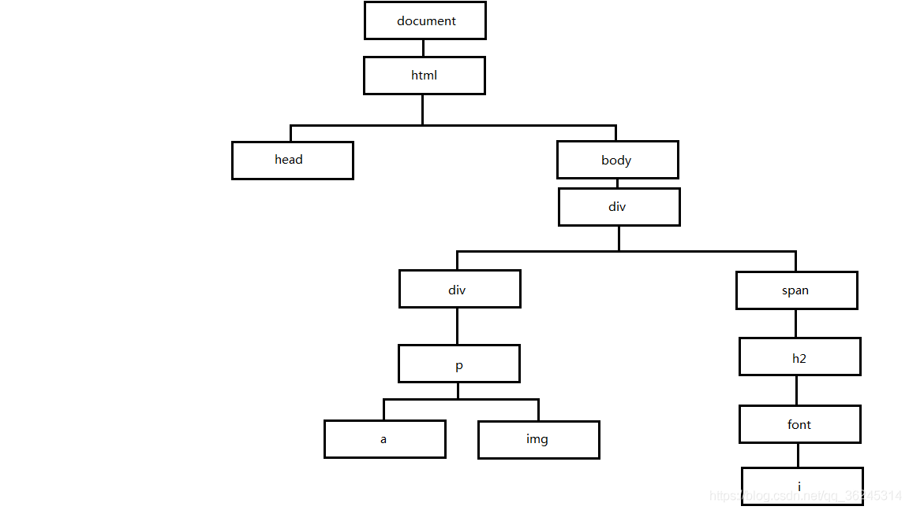
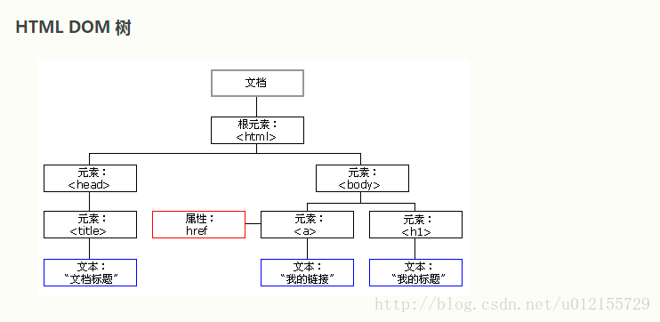

## DOM概念

DOM是Document Object Model（文档对象模型）的缩写，是专门操作HTML的API。

DOM包含核心DOM、XML DOM和HTML DOM，核心DOM能够直接操作所有的结构化文档（html，xml），是中立与平台和语言的接口，它允许程序或脚本动态地访问更新文档的内容、样式以及结构。

DOM定义了一系列对象、方法和属性，用于访问、操作和创建文档中的内容、结构、样式以及行为。

### DOM节点与DOM树





### 基本功能

① 查询某个元素
② 查询某个元素的祖先、兄弟以及后代元素
③ 获取、修改元素的属性
④ 获取、修改元素的内容
⑤ 创建、插入和删除元素


## HTML5

```html
<!DOCTYPE> 声明必须位于 HTML5 文档中的第一行，也就是位于 <html> 标签之前。该标签告知浏览器文档所使用的 HTML 规范。
<html>根元素 可省略
    <meta charset="UTF-8">元数据元素
    <head>
    	<title>文档的标题，显示在浏览器的标题栏或标签页上</title>
    </head>

    <body>
    	文档的内容
    </body>

</html>
```

### js css html 执行顺序

加载的顺序不一样,可以吧html看成是从上往下加载的,在网速较慢的情况下把js代码放在body的底部用户会先看到网页的结构,等js加载完成后才能出现特效.

* head中的js会预先进行加载，可以将预先不执行的代码放在head中，但不可以使用body中的参数，因为此时页面的DOM树还未生成。

* body部分中的js会在页面加载的时候被执行，由于脚本会阻塞其他资源的下载，如图片下载和页面渲染，因此最好将`<script>`置于底部


## CSS

* 样式表

外联样式表 `<link> `标签的 href 属性来引用的层叠样式表(css文件)

内联样式表：`<head> `标签中，使用 `<style> `标签 通过 选择器 + 样式文件 编写的

内部样式表：在标签 中style 属性中添加的 css 样式声明。

* 选择器

【 ID 选择器】 > 【类选择器】 > 【元素类型选择器】


### 使用变量

```html

<style scoped>
.test {
  --color: pink;
  width: 200px;
  background-color: var(--color);

}
</style>
```

### 响应式布局

* 媒体查询

媒体查询是css的技巧之一，它是用@media来实现的

```css
	/* 小屏幕手机端 */
	@media (min-width: 0px) and (max-width:768px) {
		.div1{
			width: 100px;
			height: 100px;
			background-color: red;
		}
	}
	
	/* 中等屏幕（桌面显示器，大于等于 992px） */
	@media (min-width: 768px) and (max-width:992px){
		.div1{
			width: 300px;
			height: 300px;
			background-color: blue;
		}
	}
	
	/* 大屏幕（大桌面显示器，大于等于 1200px） */
	@media (min-width: 992px) {
		.div1{
			width: 500px;
			height: 500px;
			background-color: aqua;
		}
	}

```


## JS

### 结构赋值

```js
const [a, b] = array;

const { a, b } = obj;
const { a: a1, b: b1 } = obj;
const { a: a1 = aDefault, b = bDefault } = obj;
```


### 获取html元素

```
通过class： document.getElement**s**ByClassName('class名');返回数组
通过name： document.getElement**s**ByName('name名');返回数组
通过id： document.getElementById('id名')；返回一个对象
通过标签名： document.getElement**s**ByTagName(‘标签名’);返回数组
通过通用选择器：document.querrySelector('可以写任何选择器 只能选择一个');返回数组
通过通用选择器：document.querrySelector**All**('可以写任何选择器，可以选择多个');返回数组
```


### 创建html元素

```js
element.innerHTML 属性设置或获取 HTML 语法表示的元素的后代。
element.insertAdjacentHTML(position, text);方法将指定的文本解析为 Element 元素，并将结果节点插入到 DOM 树中的指定位置。它不会重新解析它正在使用的元素，因此它不会破坏元素内的现有元素。这避免了额外的序列化步骤，使其比直接使用 innerHTML 操作更快。
```

### 常见api

window.onload：等待页面中的所有内容加载完毕之后才会执行。 与`<body>`中的onload属性 会互相覆盖 即谁在下面谁执行

$(document).ready()：页面中所有 DOM 结构绘制完毕之后就能够执行。
`window.onload 与 $(document).ready() / $(function(){})相当于下载 body 内最靠后的<script>代码`
