#  投递公司

| 公司       | 投递  | 笔试  | 一面  | 二面  | HR面 |
| ---------- | ----- | ----- | ----- | ----- | ---- |
| 高新兴科技 | 11/1  | 11/07 | 11/15 |       |      |
| 卓动科技   | 11/1  | 11/08 |       |       |      |
| 萨摩耶云   | 11/1  | 11/13 |       |       |      |
| 紫为云     | 11/13 |       |       |       |      |
| 创必承     | 11/13 |       |       |       |      |
| 4399       | 04/08 | 04/13 | 05/06 |       |      |
| 中数通     | 04/12 |       | 04/14 |       |      |
| 多益网络   | 04/13 | 04/16 |       |       |      |
| CET中电    | 04/14 | 04/17 |       |       |      |
| 思特奇     | 04/15 |       | 04/20 | 04/24 |      |
| 联奕科技   |       |       | 04/21 |       |      |
| 中国银行   |       | 04/21 |       |       |      |
| 中国电信   |       | 05/06 |       |       |      |
|            |       |       |       |       |      |

# 欠缺

熟悉数据结构和算法

熟悉多线程 了解分布式、缓存、消息等机制；

熟悉Javajvm

熟悉设计模式

熟悉SpringMvc，Springboot、mybatis等开源框架

了解数据库相关优化；面试高频
Mysq擎
InnoDB底层原理
索引！
索引优化!
mysql高级查询

前端：bootstrap

恶补 数据结构 算法 计算机网络

**补缺计划**

5.6~5.21

一天13集数据结构与算法  

一天14集MySQL高级

一天14集面试题

5.22~6.7

一天3集JUC并发编程

一天10集设计模式

一天23集JVM


# 自我介绍

HR面：

技术面：⾯试官，您好！我叫刘烨，来自广东工业大学，专业是数据科学与大数据技术。⼤学时间我主要利⽤课余时间学习 Java 相关的知识，经过主要的学习后，我认为精通Java基础，熟悉MySQL数据库，SpringMVC和SpringBoot框架，在此基础上懂得基本的SSM整合。最近做过关于在线教育的网站系统，是一个基于springboot的前后端分离，微服务架构的web项目。在学习过程中，我会记录自己所学的知识，进行系统的整理，对于完善的知识会发布到个人博客，方便日后回顾总结。

# 项目介绍

## SSM-CRUD整合

员工管理系统是一个基于Spring+SpringMVC+Mybatis三大框架的demo项目。 前端采用Bootstrap设计生成，数据库使用MySQL进行管理。 该系统能实现对员工和部门信息的增删查改。 

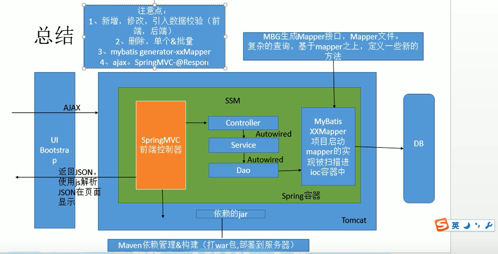

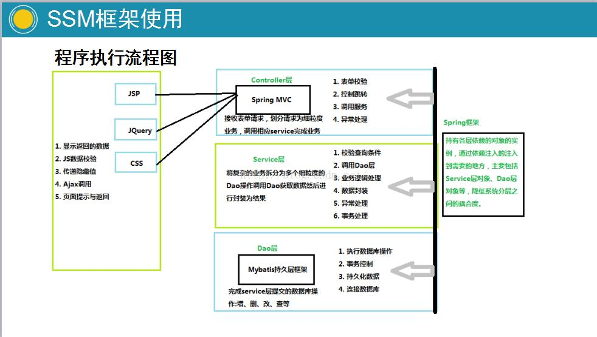

SpringMVC：web层，相当于controller（等价于struts的action）主要进行页面的 请求接受与响应。

组件包括：前端控制器，处理器映射器，处理器适配器，视图解析器，处理器Handler，视图View。其中，只有处理器Handler和视图View需要程序员开发。

Spring：IOC容器、DI、AOP

MyBatis：自动映射结果集


也写过比较古早的没用到框架的web项目。主要使用javaBean+servlet+jsp实现

该系统对用户开放图书商城业务，包括流量商品、购物车和结算等功能，也支持取消和修改购物车业务。 对管理员图书信息管理和用户管理，包括对商城图书信息的增删查改。

## 在线教育系统

### 项目描述

在线教育网站是一个基于SpringBoot后端框架和SpringCloud微服务架构的Web项目。前端采用Vue框架 +ElementUI搭建而成，数据库使用MySQL+MybatisPlus进行管理。 该系统对管理员提供权限管理、信息管理，包括对课程、讲师信息的增删改查，支持分时间、名称、状态的多条件处理 结果汇总。 对用户开放视频学习业务，包括课程购买、视频在线播放，其中完善了注册、单点登录、微信登录、微信支 付等功能。

在线教育系统，分为前台网站系统和后台运营平台，B2C模式。使用了微服务技术架构，前后端分离开发。

 前台用户系统包括课程、讲师、问答、文章几大大部分.包括是视频点播、微信登录、微信支付等

后台管理系统包括：讲师管理、课程分类管理、课程管理、统计分析、Banner管理、订单管理、权限管 理等功能 

后端的主要技术架构是：SpringBoot + SpringCloud + MyBatis-Plus + HttpClient + MySQL + Maven+EasyExcel+ nginx ,使用Swagger生成接口文档，使用EasyExcel完成分类批量添加、

前端的架构是：Node.js + Vue.js +element-ui+NUXT其他涉及到的中间件包括Redis、阿里云OSS、阿里云视频点播 业务中使用了，、注册分布式单点登录使用了JWT、ECharts做图表展示

我在这个项目中，主要负责 前台微信登录，后台课程讲师信息管理，和统计分析

### 测试要求 

首页和视频详情页qps单机qps要求 2000+ 

经常用每秒查询率来衡量域名系统服务器的机器的性能，

其即为QPS QPS = 并发量 / 平均响应时间

### 项目（产品）开发流程 

一个中大型项目的开发流程

1. 需求调研（产品经理） 
2. 需求评审（产品/设计/前端/后端/测试/运营） 
3. 立项（项目经理、品管） 
4. UI设计
5. 开发 
   * 架构、数据库设计、API文档、MOCK数据、开发、单元测试 
   * 前端 
   * 后端 
6. 前端后端联调 
7. 项目提测：黑盒白盒、压力测试（qps） loadrunner 
8. bug修改 
9. 回归测试 
10. 运维和部署上线 
11. 灰度发布 
12. 全量发布 
13. 维护和运营

###  系统中都有那些角色？数据库是怎么设计的

前台：会员（学员） 

后台：系统管理员、运营人员 

后台分库，每个微服务一个独立的数据库，使用了分布式id生成器，通过Seata处理分布式事务

### 视频点播是怎么实现的

我们直接接入了阿里云的云视频点播。感觉阿里云提供的sdk在云平台实现包括视频上传、转码、加密、智能审核、监控统 计等功能。 还包括视频播放功能，阿里云还提供了一个视频播放器。

### 前后端联调经常遇到的问题

请求方式错误 post、get

实体类属性名与前端渲染的字段名不一致

数据类型不匹配

后台必要的参数，前端省略了

空指针异常

分布式系统中分布式id生成器生成的id 长度过大（19个字符长度的整数），js无法解析（js智能解 析16个长度：2的53次幂）

 id策略改成 ID_WORKER_STR 而不是 ID_WORKER

### 前后端分离项目中的跨域问题

后端服务器配置：我们的项目中是通过Spring注解解决跨域的 @CrossOrigin 

也可以使用nginx反向代理、httpClient、网关

### 分布式CAP原理

Zookeeper：CP设计，保证了一致性，集群搭建的时候，某个节点失效，则会进行选举行的leader，或 者半数以上节点不可用，则无法提供服务，因此可用性没法满足 

Eureka：AP原则，无主从节点，一个节点挂了，自动切换其他节点可以使用，去中心化

分布式系统中P,肯定要满足，所以我们只能在一致性和可用性之间进行权衡 

如果要求一致性，则选择zookeeper，如金融行业 

如果要求可用性，则Eureka，如教育、电商系统 没有最好的选择，最好的选择是根据业务场景来进行架构设计

### 前端渲染和后端渲染有什么区别 

前端渲染是返回json给前端，通过javascript将数据绑定到页面上 

后端渲染是在服务器端将页面生成直接发送给服务器，有利于SEO的优化

**项目架构图**

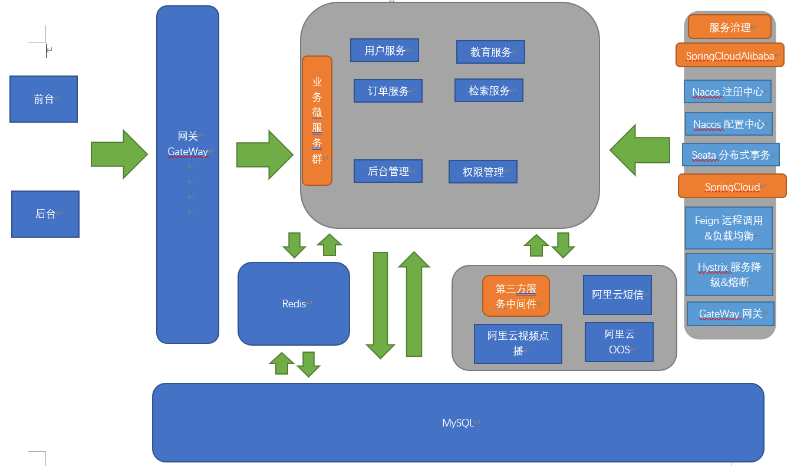

## 业务问题

### 单点登录

**single sign on 模式**

分布式， 单点登录，多点访问

* sesion广播机制实现 session复制

* cookie + redis实现

  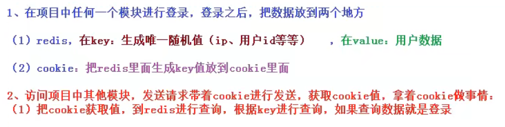

* 使用token实现

  

## 你在项目过程中遇到过哪些棘手的问题？

* 通过es6语法写前端代码时，时常报错，究其原因是node版本过低。而es6规范虽然简洁，但是兼容性太低。低版本的node无法识别es6语法规范。除了更换高版本的node或浏览器 ，还可以通过babel对es6语法的js文件进行转码，转换成es5语法。
* 不同的前端项目，常常需要不同的node版本，这个时候可通过nvm对node进行版本管理，实现随时切换nodejs版本，灵活转换开发环境
* 尝试注册或登录验证码服务时，由于阿里云腾讯云等大厂需要企业认证才能使用其短信服务。我直接去阿里云市场购买其他公司的短信服务api。由于购买的短信服务往往有测试次数，因此转换思路，改用邮件服务发送对应的验证码。

# 笔试、面试回顾

## Java基础

### Java基本数据类型

| 数据类型 | 取值范围                                 | 占用空间                  |
| -------- | ---------------------------------------- | ------------------------- |
| byte     | -128~127                                 | 1个字节                   |
| short    | -32768~32767                             | 2个字节                   |
| int      | -2147483648~2147483647                   | 4个字节                   |
| long     | -9223372036854774808~9223372036854774807 | 8个字节                   |
| float    | 3.402823e+38 ~ 1.401298e-45              | 4个字节                   |
| double   | 1.797693e+308~ 4.9000000e-324            | 8个字节                   |
| boolean  |                                          | 1个字节                   |
| char     |                                          | 2个字节（C语言中是1字节） |

自动（隐式）转换的顺序

double > float > long > int > short > byte

### Java变量类型

java变量定义：type variablename,[variable name = value]=value

-  局部变量：方法中的变量

   局部变量声明在方法中

   访问修饰符不能用于局部变量

   局部变量在栈上分配

   局部变量没有默认值，所以被声明后，必须经过初始化

-  实例变量：独立于方法之外的变量，没有static修饰
  ​ 实例变量声明在一个类中，方法体之外

   实例变量与对象共存亡

   访问修饰符可以修饰实例变量

   实例变量设为私有，通过使用访问修饰符可以使实例变量对子类可见

   实例变量可以直接通过变量名访问，但在静态方法以及其他类中，使用实例对象名.变量名

- 类变量：独立于方法之外的变量，用static修饰

   类变量又被称为静态变量，以static关键字声明，在方法体之外声明

   静态变量除了声明为常量外很少使用，常量是指声明为public/private+final/static的变量

   静态变量可以通过：ClassName.var方式访问

   无论一个类创建了多少个对象，**类只拥有类变量的一份拷贝**

```java
public class Variable{
    static int Class_var = 0;//类变量
    String instance_str = 'this is';//实例 变量
	public void method(){
        int i=0; //局部变量
    }
}
    //salary是静态的私有变量
    private static double salary;
    // DEPARTMENT是一个常量
    public static final String DEPARTMENT = "开发人员";
```

### Java修饰符

**访问修饰符**

 修饰符用来定义类，方法或变量，通常放在最前面

-  default：即默认，什么也不写，在同一包内可见，使用对象：类、接口、变量、方法

  **接口里的变量都隐式声明为public static final,接口里的方法默认情况下访问权限为Public**

  ```java
  实例：
  String version = "1.5.1";
  boolean processOrder() {
     return true;
  }
  ```

-  private：在同一类内可见。使用对象：类、变量、接口、方法

  **被声明为private的方法，变量只能被所属类访问，类和接口不能声明为private**

  声明为私有访问类型的变量只能通过类中公共的getter方法被外部类访问

  ```java
  public class Logger {
     private String format;
     public String getFormat() {
        return this.format;
     }
     public void setFormat(String format) {
        this.format = format;
     }
  }
  //format为私有变量，可以通过共有的getFormat()和setFormat()进行操作
  ```

-  public：对所有类可见，使用对象：类、接口、变量、方法

  被声明为public的类，变量、方法，构造方法和接口能够被任何其他类访问

  在不同的包，需要将类导入包内

-  protected：对统一包内的类和所有子类可见，使用对象：变量，对象，方法。不能修饰类（内部类除外），不可修饰接口

   protected需要在以下俩个点来分析

  -  **子类与基类在同一包中：被声明为protected的变量，方法和构造器被同一个包中的任何其他类访问**

- **子类与基类不在同一个包中：在子类中，字类实例可以访问其从基类继承而来的protected方法，而不能访问基类实例的protected方法**

**访问修饰符的访问权限**

| 修饰符    | 当前类 | 子孙类（同包内） | 同一包内 | 子孙类（不同包） | 其他包 |
| --------- | ------ | ---------------- | -------- | ---------------- | ------ |
| public    | Y      | Y                | Y        | Y                | Y      |
| protected | Y      | Y                | Y        | Y/N              | Y/N    |
| default   | Y      | Y                | Y        | N                | N      |
| private   | Y      | N                | N        | N                | N      |

**问题：不是同一个包中的子类访问父类的变量不可访问**

**非访问修饰符**

- **static修饰符**：用来修饰类方法和类变量，

  **静态变量：**

   static关键字用来声明独立于对象的静态变量，无论一个类实例化多少对象，他的静态变量只有一份拷贝，**静态变量也被称为类变量**

  **静态方法**：

   static关键字用来声明独立于对象的静态方法。**静态方法不能使用类的非静态变量。**

  **访问方式**：

   对类变量和方法的访问可以直接使用 **class/obj.variablename** 和 **class/obj.methodname** 的方式访问。

  ```java
     private static int numInstances = 0;
     protected static int getCount() {
        return numInstances;
    }
  ```

- **final修饰符**

  **final变量**：

   **被final修饰的实例变量必须显示指定初始值，切不可更改，通过和static一起来创建类常量**

  ```java
    final int value = 10;
    // 下面是声明常量的实例
    public static final int BOXWIDTH = 6;
    static final String TITLE = "Manager";
  //final类的声明
    public final class Test {
     // 类体
  }
  ```

  **final方法**：

   父类中的final方法可以被重写，但不可被覆盖，final方法的主要目的是防止该方法的内容被修改

  **final类：**

   final类不可被子类继承

- **abstract修饰符**

  **抽象类**：

   **抽象类不能用来实例化对象，声明抽象类的唯一目的是为了将来对该类进行扩充**

   **一个类不能同时被abstract和final修饰，如果一个类包含抽象方法，该类必须为抽象类**

  抽象类可以包含抽象方法和非抽象方法

  ```java
  abstract class Caravan{
     private double price;
     private String model;
     private String year;
     public abstract void goFast(); //抽象方法
     public abstract void changeColor();
  }
  ```

  **抽象方法**

   **抽象方法没有方法体，抽象方法必需要在子类中实现**

   **抽象类可以不包含抽象方法，类有抽象方法必须为抽象类**

   **抽象方法不能声明成final和static**

   **继承抽象类的子类必须实现父类的所有所有方法，除非该子类也是抽象类**

  ```java
  public abstract class SuperClass{
      abstract void m(); //抽象方法
  }
   
  class SubClass extends SuperClass{
       //实现抽象方法
        void m(){
            .........
        }
  }
  ```

  **synchronized修饰符**

   synchronized关键字声明的方法同一时间只能被一个线程访问，可用于四个访问修饰符

  ```java
  public synchronized void showDetails(){
  .......
  }
  ```

  **transient修饰符**

   序列化对象包含被transient修饰的实例变量时，java虚拟机会跳过该变量

   该修饰符包含在定义变量的语句中，用来预处理类和变量的数据类型

```java
public transient int limit = 55;   // 不会持久化
public int b; // 持久化
```

 **volatile修饰符**

volatile修饰的成员变量在每次被线程访问时，都强制从共享内存中重新读取该成员变量的值，而且当成员变量发生变化时，会强制线程将变化的值回写到共享内存，**这样在任何时可，俩个不同的线程总是看到某个成员变量的同一个值**

使⽤ volatile 可以禁⽌ JVM 的指令重排，保证在多线程环境下也能正常运⾏。

```java
public class MyRunnable implements Runnable
{
    private volatile boolean active;
    public void run()
    {
        active = true;
        while (active) // 第一行
        {
            // 代码
        }
    }
    public void stop()
    {
        active = false; // 第二行
    }
}
```

通常情况下，在一个线程调用run()方法（在runnable开启的线程），在另一个线程调用stop()方法。如果第一行缓冲区的active值被使用，在第二行的active值为false时循环停止

### 基本函数

* Math.round()

  round() 方法返回一个最接近的 int、long 型值，四舍五入。

  **round** 表示"**四舍五入**"，算法为**Math.floor(x+0.5)** ，即将原来的数字加上 0.5 后再向下取整，所以 **Math.round(11.5)** 的结果为 12，Math.round(-11.5) 的结果为 -11。

### 面向对象编程思想的个人理解

**现实业务的抽象化**

对象是对现实业务的抽象概念，就是把一类具有相同属性和动作的实体抽象成为计算机里面的类, 也就是对象的模板, 可能是属性集（具备容器的特性）也可能是方法集（具备行为特性），或者是两者都有。所有的业务操作转变成对象的行为和对象之间的消息传递。

**面向对象的三大特性**

抽象、封装、继承和多态是面向对象的基础

**面向对象的优点与坏处**

⾯向对象编程更加模块化,模块之间解耦，易维护、易复⽤、易扩展。 因为⾯向对象有封装、继承、多态性的特 性，所以可以设计出低耦合的系统，使系统更加灵活、更加易于维护。但是，因为类调⽤时需要实例化，开销⽐较⼤，⽐较消耗资源，所以⾯向对象性能⽐⾯向过程低。（但这不是java性能较差低的主要原因）

**java性能较低的主要原因**

面向过程也需要分配内存，计算内存偏移量，Java性能差的主要原因并不是因为它是面向对象语言，而是Java是半编译语言，最终的执行代码并不是可以直接被CPU执行的二进制机械码。而面向过程语言大多都是直接编译成机械码在电脑上执行，并且其它一些面向过程的脚本语言性能也并不一定比Java好。

实际上，java是**半编译半解释**语言。

对于Java代码来说，是将源文件（.java文件）先**编译**成字节码文件（.class文件），然后再在Java虚拟机（JVM）中**解释**执行。

**采用字节码的好处**

字节码：Java源代码经过虚拟机编译器编译后产生的文件（即扩展为.class的文件），它不面向任何特定的处理器，只面向虚拟机。

Java语言通过字节码和虚拟机，解决了传统解释型语言的执行效率低问题，同时保留了解释性语言的可移植性

**如何更好提升Java效率**

在Hotspot（Java虚拟机中的一种）中存在JIT即时编译器，能够捕获程序中的热点代码，编译成机器码缓存起来存入方法区中，当遇到相同的代码时，不必再去使用解释器翻译，直接去找对应的机器码执行。避免解释器重复多次的解释执行，导致效率低下。

### 怎么理解多态性

面向对象的多态特性有两种实现方式：即向上转型（自动完成）

1. 父类的引用指向了子类对象，子类重写了父类方法，父类引用此时可以调用子类重写后的方法
2. 接口的引用指向了实现类对象，实现类重写了接口方法，接口引用此时可以调用实现类的重写方法

## 多线程

### synchronized

synchronized 关键字解决的是多个线程之间访问资源的同步性， synchronized 关键字可以保证 被它修饰的⽅法或者代码块在任意时刻只能有⼀个线程执⾏。

#### Java其他锁方式

**互斥锁**

 对共享数据进行锁定，保证同一时刻只能有一个线程去操作。

**条件锁、**

**自旋锁**

只要没有锁上，就不断重试。显然，如果别的线程长期持有该锁，那么你这个线程就一直在 while while while 地检查是否能够加锁，浪费 CPU 做无用功。

**读写锁**

在执行加锁操作时需要额外表明读写意图，复数读者之间并不互斥，而写者则要求与任何人互斥。

**递归锁。**


#### 悲观锁

#### 乐观锁

#### CAS机制

### CAS

**CAS是什么**

CAS 全称是 compare and swap，是一种用于在多线程环境下实现同步功能的机制。CAS 操作包含三个操作数 -- 内存位置、预期数值和新值。CAS 的实现逻辑是将内存位置处的数值与预期数值想比较，若相等，则将内存位置处的值替换为新值。若不相等，则不做任何操作。

在 Java 中，Java 并没有直接实现 CAS，CAS 相关的实现是通过 C++ 内联汇编的形式实现的。Java 代码需通过 JNI 才能调用。

CAS 是一条 CPU 的原子指令（cmpxchg指令），不会造成所谓的数据不一致问题，Unsafe 提供的 CAS 方法（如compareAndSwapXXX）底层实现即为 CPU 指令 cmpxchg

比较与交换

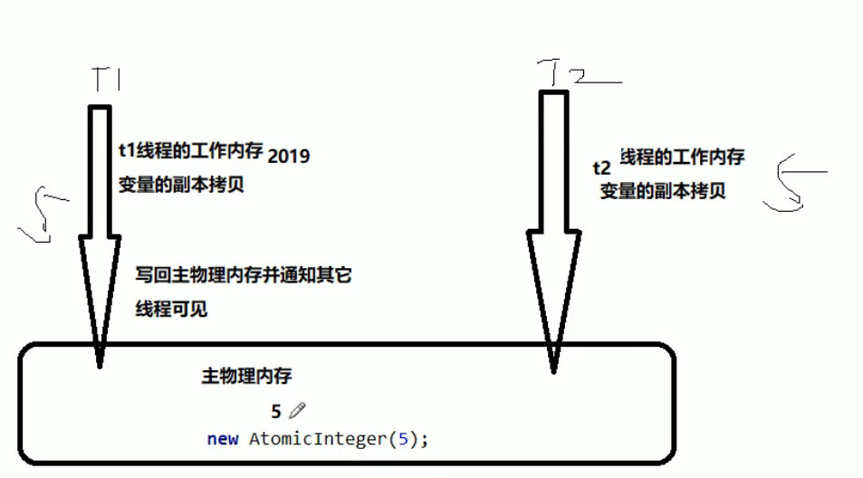


**CAS底层原理**

自旋锁：是指尝试获取锁的线程不会立即堵塞，而是采用循环的方式尝试获取锁，这样的好处是减少线程上下文切换的消耗，缺点是循环会消耗cpu。

Unsafe

**CAS（CompareAndSwap）**
比较当前工作内存中的值和主内存中的值，如果相同则执行规定操作，否则继续比较直到主内存和工作内存中的值一致为止.

**CAS应用**
CAS有3个操作数，内存值V，旧的预期值A，要修改的更新值B。当且仅当预期值A和内存值V相同时，将内存值V修改为B，否则什么都不做。

**AtomicInteger.getAndIncrement是如何解决整型自增在多线程环境下的线程安全问题**

```java
//Unsafe.class
	public final int getAndAddInt(Object var1, long var2, int var4) {
        int var5;
        do {
            var5 = this.getIntVolatile(var1, var2);
        } while(!this.compareAndSwapInt(var1, var2, var5, var5 + var4));//CAS方法 实现原子操作 系统原语

        return var5;
    }
```

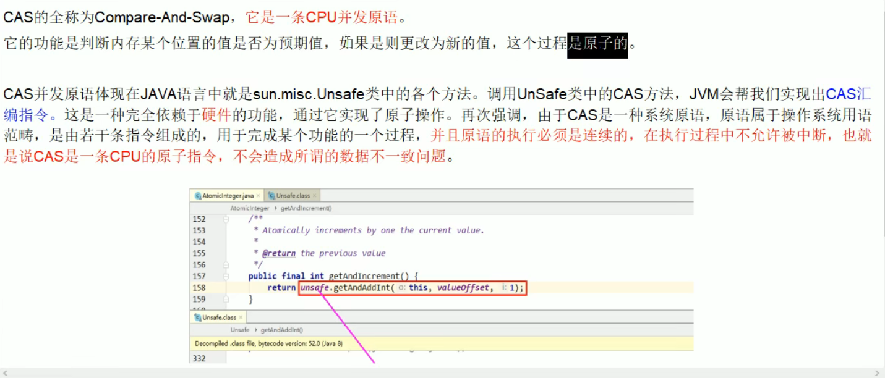

**为什么使用CAS不使用synchronized**

首先清楚一点，使用Synchronized的话，是多个线程抢一份资源，相对来说Semaphore就好比是多个线程抢多个资源，信号增Semaphore这个概念后续文章会给大家讲到。回归正题，Synchronized是只允许一个线程运行，虽然一致性保证了，但是降低并发性，而cas底层是unsafe，并且不加锁，保证一致性，允许多个线程同时操作，并发量得到保障，但是循环比较。

**CAS缺点**

循环时间长，若CAS长时间不成功，可能会给CPU带来大开销

只能保证一个共享变量的的原子操作

ABA问题

### 并发编程三个问题

* 原子性：即一个操作或者多个操作 要么全部执行并且执行的过程不会被任何因素打断，要么就都不执行。

* 可见性是指当多个线程访问同一个变量时，一个线程修改了这个变量的值，其他线程能够立即看得到修改的值。

* 有序性：即程序执行的顺序按照代码的先后顺序执行。

  处理器为了提高程序运行效率，可能会对输入代码进行优化（令重排序）。处理器在进行重排序时是会考虑指令之间的数据依赖性，因此它会保证程序最终结果会和代码顺序执行结果相同。但是在多线程情况下，无数据依赖的代码重排后，其他线程将会判断不正确，将导致程序出错。

### Java内存模型保证并发编程正确性

* 原子性：Java内存模型只保证了基本读取和赋值是原子性操作，如果要实现更大范围操作的原子性，可以通过synchronized和Lock来实现。由于synchronized和Lock能够保证任一时刻只有一个线程执行该代码块，那么自然就不存在原子性问题了，从而保证了原子性。
* 可见性：Java提供了volatile关键字来保证可见性。另外，通过synchronized和Lock也能够保证可见性，synchronized和Lock能保证同一时刻只有一个线程获取锁然后执行同步代码，并且在释放锁之前会将对变量的修改刷新到主存当中。因此可以保证可见性。
* 可以通过volatile关键字来保证一定的“有序性”，另外可以通过synchronized和Lock来保证有序性，很显然，synchronized和Lock保证每个时刻是有一个线程执行同步代码，相当于是让线程顺序执行同步代码，自然就保证了有序性。

### volatile关键字

**一旦一个共享变量（类的成员变量、类的静态成员变量）被volatile修饰之后，那么就具备了两层语义：**

1. 保证了不同线程对这个变量进行操作时的可见性，即一个线程修改了某个变量的值，这新值对其他线程来说是立即可见的。（可见性）
2. 禁止进行指令重排序。

**被volatile修饰的变量自增流程：**

1. 使用volatile关键字会强制将修改的值立即写入主存；
2. 使用volatile关键字的话，当线程2进行修改时，会导致线程1的工作内存中缓存变量stop的缓存行无效（反映到硬件层的话，就是CPU的L1或者L2缓存中对应的缓存行无效）；
3. 由于线程1的工作内存中缓存变量stop的缓存行无效，所以线程1再次读取变量stop的值时会去主存读取。

**无法解决原子性**

以自增操作为例，自增操作是不具备原子性的，它包括读取变量的原始值、进行加1操作、写入工作内存。volatile也无法保证对变量的任何操作都是原子性的

1. 线程1读取了主存的变量值后，被阻塞。
2. 线程2也读取主存的变量，由于线程1还未对变量进行加1操作，不会导致线程2的缓存变量的缓存行失效
3. 线程2对变量进行加1操作并写入工作内存
4. 线程1已读取了变量原始值，仍进行加1操作，写入各种内存。
5. 最终变量只加1

**volatile能在一定程度上保证有序性**

操作被volatile修饰的变量时，在其之前的操作代码在其之前执行，在其之后的代码一定在其之后执行。

### 自旋锁

是指尝试获取锁的线程不会立即阻塞，而是采循环的方式去尝试获取锁，这样的好处是减少线程上下文切换的消耗，缺
点是循环会消耗CPU

**手写自旋锁**

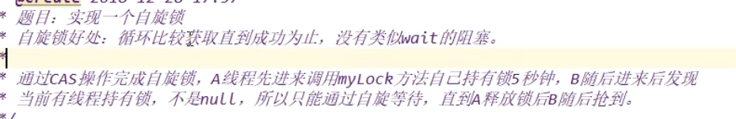

## JVM

### 回收器

### 回收算法

### 对强引用、软引用、弱引用、幻象引用的理解。

这四种引用主要的区别体现在对象不同的可达性状态和对垃圾收集的影响。

可达性状态

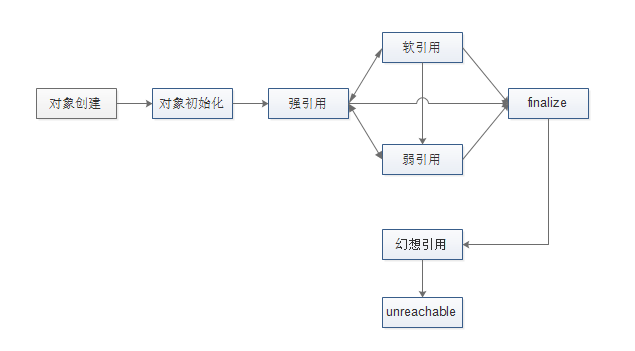

1. **强引用**就是我们最常见的普通对象引用（如new 一个对象），只要还有强引用指向一个对象，就表明此对象还“活着”。

   * JVM内存空间不足时，不会回收强引用，抛出OOM错误。
   * 对于一个普通的对象，如果没有其他的引用关系，只要超过了引用的作用域或者显式地将相应（强）引用赋值为null，就意味着此对象可以被垃圾收集了。

2. **软引用**相对强引用要弱化一些

   * JVM内存空间不足时,在确保在抛出OOM前，会去回收清理软引用指向的对象。会尽可能优先回收长时间闲置不用的软引用指向的对象，对那些刚构建的或刚使用过的软引用指向的对象尽可能的保留。

   * 软引用可用来实现内存敏感的高速缓存。如果内存还有空闲，可以暂时用软引用缓存一些业务场景所需的数据，当内存不足时就可以清理掉，等后面再需要时，可以重新获取并再次缓存。

   * 软引用通常可以和一个引用队列（ReferenceQueue）联合使用，如果弱引用所引用的对象被垃圾回收，java虚拟机就会把这个软引用加入到与之关联的引用队列中。

     ```java
     //内存敏感点示例
     SoftReference<List<Foo>> ref = new SoftReference<List<Foo>>(new LinkedList<Foo>());
     // somewhere else in your code, you create a Foo that you want to add to the list
     List<Foo> list = ref.get();
     if (list != null)
     {
         list.add(foo);
     }
     else
     {
         // list is gone; do whatever is appropriate
     }　
     ```

3. **弱引用**指向的对象是一种十分临近finalize状态的情况

   * 垃圾回收器扫描它所管辖的内存区域的过程中，只要发现弱引用的对象，就会立刻回收它。生命周期更短，就是弱引用与软引用最大的区别。

4. **幻象引用**，也有被说成是虚引用或幽灵引用。

   * 如果一个对象仅持有虚引用，就相当于没有任何引用一样，在任何时候都可能被垃圾回收器回收。
   * 不能通过它访问对象，幻象引用仅仅是提供了一种确保对象被finalize以后，做某些事情的机制（如做所谓的Post-Mortem清理机制），也有人利用幻象引用监控对象的创建和销毁。

### 创建对象的过程

一个Java对象的创建过程往往包括 类初始化 和 类实例化 两个阶段。

## 数据结构

### 二叉树

## 算法

### 排序算法


## 计算机网络

### HTTP状态码

1. 信息代码：1xx

2. 成功代码：2xx
   * **200 正常；请求已完成。** 
   * 201 正常；紧接 POST 命令。 
   * 202 正常；已接受用于处理，但处理尚未完成。 
   * 203 正常；部分信息 — 返回的信息只是一部分。 
   * 204 正常；无响应 — 已接收请求，但不存在要回送的信息。 

3. 重定向：3xx
   * 301 已移动 — 请求的数据具有新的位置且更改是永久的。 
   * 302 已找到 — 请求的数据临时具有不同 URI。 
   * 303 请参阅其它 — 可在另一 URI 下找到对请求的响应，且应使用 GET 方法检索此响应。 
   * 304 未修改 — 未按预期修改文档。 
   * 305 使用代理 — 必须通过位置字段中提供的代理来访问请求的资源。 
   * 306 未使用 — 不再使用；保留此代码以便将来使用。 

4. 客户端错误：4xx
   * **400 错误请求 — 请求中有语法问题，或不能满足请求。** 
   * 401 未授权 — 未授权客户机访问数据。 
   * 402 需要付款 — 表示计费系统已有效。 
   * **403 禁止 — 即使有授权也不需要访问。** 
   * **404 找不到 — 服务器找不到给定的资源；文档不存在。** 
   * 407 代理认证请求 — 客户机首先必须使用代理认证自身。 
   * 415 介质类型不受支持 — 服务器拒绝服务请求，因为不支持请求实体的格式。 

5. 服务器错误：5xx
   * **500 内部错误 — 因为意外情况，服务器不能完成请求。** 
   * 501 未执行 — 服务器不支持请求的工具。 
   * **502 错误网关 — 服务器接收到来自上游服务器的无效响应。** 
   * 503 无法获得服务 — 由于临时过载或维护，服务器无法处理请求。

### Cookie的作⽤是什么?和Session有什么区别？

Cookie 和 Session都是⽤来跟**踪浏览器⽤户身份**的会话⽅式，但是两者的**应⽤场景**不太⼀样

* 保存位置：Cookie 数据保存在客户端(浏览器端)，Session 数据保存在服务器端。
* 安全性：由于保存位置的不同，相对来说 Session 安全性更⾼。如果要在 Cookie 中存储⼀些敏感信息，不要直接写⼊ Cookie 中，最好能将 Cookie 信息**加密**然后使⽤到 的时候**再去服务器端解密**。
* 作用：
  * Cookie 是服务器通知**客户端保存键值对**的一种技术。客户端有了 Cookie 后，每次请求都发送给服务器。有大小限制（4kb）。具有生命控制，若不设置有效时间，浏览器关闭Cookie就会删除。而设置了有效时间，cookie将会被保存到机器的硬盘当中。
    * 可以用来保存用户名等非敏感信息实现免输入功能。
    * 存放⼀个 Token 在 Cookie 中，实现第一次登陆后保持登录状态
  * Session 就是会话。它是用来维护一个客户端和服务器之间关联的一种技术。**当用户首次与Web服务器建立连接的时候，服务器会给用户分发一个 SessionID作为标识。此后每次提交url请求，浏览器都会提交SessionID到服务器，Web服务器就能区分当前请求页面的是哪一个客户端。**事实上是直到某server端程序(如Servlet)调用HttpServletRequest.getSession(true)这样的语句时HttpSession接口的实现类才会被创建。
    * 经常用来保存用户登录之后的信息，如购物车功能，添加商品到购物⻋的时候，系统通过session标识是哪个⽤户操作的
* 关联：Session 技术，底层其实是基于 Cookie 技术来实现。客户端SessionID**默认是以cookie的形式来存储的**（tomcat生成的sessionid叫做jsessionid），因此也具有生命控制。

> **Token**
>
> 当讨论基于token的身份验证时，一般都是说的JSON Web Tokens（JWT）。虽然有着很多不同的方式实现token，但是JWT已经成为了事实上的标准，所以后面会将JWT和token混用。
>
> 基于token的验证是无状态的。**服务器不记录哪些用户已登陆或者已经发布了哪些JWT**。对服务器的每个请求都需要带上验证请求的token。该标记既可以加在header中，可以在POST请求的主体中发送，也可以作为查询参数发送。
>
> 工作流程如下：
>
> 1. 用户输入登陆凭据；
> 2. 服务器验证凭据是否正确，然后返回一个经过签名的token；
> 3. 客户端负责存储token，可以存在local storage，或者**cookie**中；
> 4. 对服务器的请求带上这个token；
> 5. 服务器对JWT进行解码，如果token有效，则处理该请求；
> 6. 一旦用户登出，客户端销毁token。

### HTTPS使用的加密算法

HTTPS是运⾏在SSL/TLS之上的HTTP协议，SSL/TLS 运⾏在 TCP之上。

所有传输的内容都经过加密，加密采⽤对称加密，但对称加密的密钥⽤服务器⽅ 的证书进⾏了⾮对称加密。

* 对称加密：密钥只有⼀个，加密解密为同⼀个密码，且加解密速度快，典型的对称加密 算法有**DES、AES**等； 
* ⾮对称加密：密钥成对出现（且根据公钥⽆法推知私钥，根据私钥也⽆法推知公钥）， 加密解密使⽤不同密钥（公钥加密需要私钥解密，私钥加密需要公钥解密），相对对称 加密速度较慢，典型的⾮对称加密算法有**RSA、DSA**等。

### Token

**定义**

Token**是服务端生成的一串字符串**，以作客户端进行请求的一个令牌，当第一次登录后，服务器生成一个Token便将此Token返回给客户端，以后客户端只需带上这个Token前来请求数据即可，无需再次带上用户名和密码。

**目的**

Token的目的是为了减轻服务器的压力，减少频繁的查询数据库，使服务器更加健壮。

**设置有效期**

一个例子是登录密码，一般要求定期改变密码，以防止泄漏，所以密码是有有效期的；另一个例子是安全证书。SSL 安全证书都有有效期

1. 服务器端保存 Token 状态，用户每次操作都会自动刷新（推迟） Token 的过期时间。每次都去刷新过期时间会产生非常大的代价。

2. 使用 Refresh Token，它可以避免频繁的读写操作。这种方案中，当客户端发送业务请求时，服务端不需要刷新 Token 的过期时间，一旦 Token 过期，就反馈给前端，前端转而使用 Refresh Token 申请一个全新 Token 继续使用。这种方案中，服务端只需要在客户端请求更新 Token 的时候对 Refresh Token 的有效性进行一次检查，大大减少了更新有效期的操作，也就避免了频繁读写。

   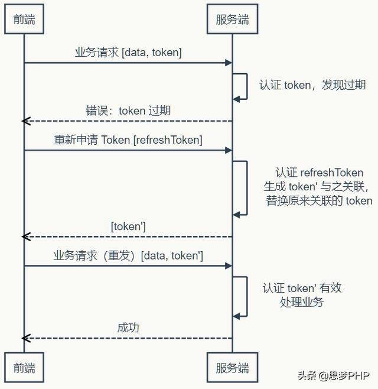

3. 到目前为止，Token 都是**有状态的**，即在服务端需要保存并记录相关属性。

**无状态 Token**

如果我们把所有状态信息（如有效期）都附加在 Token 上，服务器就可以不保存。

当服务器收到Token时，签发（第一次）和验证都是同一方，所以对称加密算法就能达到要求，而对称算法比非对称算法要快得多（可达数十倍差距）。

注销用户时，有状态Token将直接将数据库中对应的有效期置为0；无状态Token却需要保存未到期却已注销的 Token，以便下次收到使用这个仍在有效期内的 Token 时判其无效。解决方法考虑如下情况：

1. 在前端可控的情况下（比如前端和服务端在同一个项目组内），可以协商：前端一但注销成功，就丢掉本地保存（比如保存在内存、LocalStorage 等）的 Token 和 Refresh Token。基于这样的约定，服务器就可以假设收到的 Token 一定是没注销的（因为注销之后前端就不会再使用了）。
2. 如果前端不可控的情况，仍然可以进行上面的假设，但是这种情况下，需要尽量缩短 Token 的有效期，而且必须在用户主动注销的情况下让 Refresh Token 无效。这个操作存在一定的安全漏洞，因为用户会认为已经注销了，实际上在较短的一段时间内并没有注销。如果应用设计中，这点漏洞并不会造成什么损失，那采用这种策略就是可行的。

**分离认证服务和业务服务**

当 Token 无状态之后，单点登录就变得容易了。第一次登录，前端会去**认证服务器**中拿到一个有效的 Token，它就可以在任何同一体系的**业务服务**上认证通过——只要它们使用同样的密钥和算法来认证 Token 的有效性。当然，如果 Token 过期了，服务器将发出通知，前端需要去认证服务更新 Token。

## 数据库

### sql语句的执行顺序

1. from 子句组装来自不同数据源的数据； 
2. where 子句基于指定的条件对记录行进行筛选；  
3. group by 子句将数据划分为多个分组；  
4. 使用聚集函数进行计算；  
5. 使用 having 子句筛选分组；  
6. 计算所有的表达式； 
7. select 的字段；  
8. 使用 order by 对结果集进行排序。

### 行列转换

原表

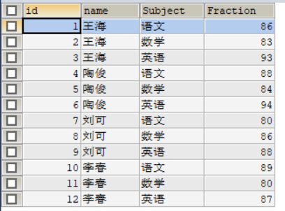

目标

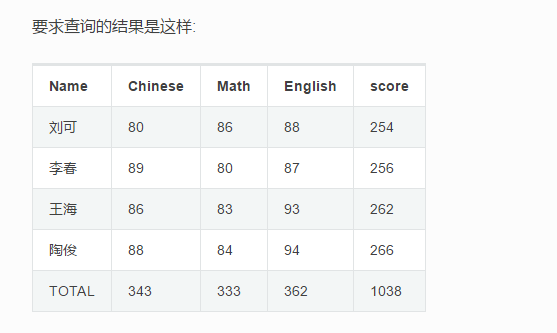

使用if

```sql

SELECT NAME '姓名', 
SUM(IF(SUBJECT = '语文',Fraction,0)) '语文', 
SUM(IF(SUBJECT = '数学',Fraction,0)) '数学', 
SUM(IF(SUBJECT = '英语',Fraction,0)) '英语',
SUM(Fraction) '总分'
FROM t_score 
GROUP BY NAME
UNION
SELECT 'Total' AS '姓名', 
SUM(IF(SUBJECT = '语文',Fraction,0)) '语文', 
SUM(IF(SUBJECT = '数学',Fraction,0)) '数学', 
SUM(IF(SUBJECT = '英语',Fraction,0)) '英语',
SUM(Fraction) '总分'
FROM t_score;

```

### 存储引擎

myIsm和innodb的区别 尤其在索引上

### 索引

#### 索引的类型


#### 对索引的理解

索引在MySQL中也叫做“**键**”，是存储引擎用于快速找到记录的一种数据结构。

索引对于良好的性能非常关键，尤其是当表中的数据量越来越大时，索引对于性能的影响愈发重要。

索引优化应该是对**查询性能优化最有效的手段**了。索引能够轻易将查询性能提高好几个数量级。

索引相当于字典的音序表，如果要查某个字，如果不使用音序表，则需要从几百页中逐页去查。

#### 索引分类

1. 普通索引index :加速查找
2. 唯一索引
       主键索引：primary key ：加速查找+约束（不为空且唯一）
       唯一索引：unique：加速查找+约束 （唯一）
3. 联合索引
       -primary key(id,name):联合主键索引
       -unique(id,name):联合唯一索引
       -index(id,name):联合普通索引
4. 全文索引fulltext :用于搜索很长一篇文章的时候，效果最好。
5. 空间索引spatial :了解就好，几乎不用

#### 索引的数据结构

* hash类型的索引：查询单条快，范围查询慢
* btree类型的索引：b+树，层数越多，数据量指数级增长（我们就用它，因为innodb默认支持它）

不同的存储引擎支持的索引类型也不一样
InnoDB 支持事务，支持行级别锁定，支持 B-tree、Full-text 等索引，不支持 Hash 索引；

#### 数据库在哪些场景下导致索引失效？

* 列与列对比

  ```sql
  select * from test where id=c_id;
  ```

* 存在NULL值条件

  ```sql
  select * from test where id is not null;
  ```

* NOT条件

  ```sql
  select * from test where id<>500;
  select * from test where id in (1,2,3,4,5);
  select * from test where not in (6,7,8,9,0);
  select * from test where not exists (select 1 from test_02 where test_02.id=test.id);
  ```

* LIKE通配符

  ```sql
  select * from test where name like 张||'%';
  ```

* 条件上包括函数

  ```sql
  select * from test where name=upper('sunyang');
  --INDEX RANGE SCAN
  ```

* 数据类型的转换、

  ```sql
  select * from sunyang where id='123';
  ```

  等


## Spring5

### springbean单例

### spring的两大特性

### 创建 Spring配置文件，在配置文件配置创建的对象

```java
@Test
public void testAdd() {
//1 加载 spring配置文件
ApplicationContext context =
new ClassPathXmlApplicationContext("bean1.xml");
//2 获取配置创建的对象
User user = context.getBean("user", User.class);
System.out.println(user);
user.add();
}
```

## SpringMVC

### spring的DispatcherServlet配置能有多个吗？

可以。
`<load-on-startup>1</load-on-startup>` 这个要设置成不同的优先级。

以及

`<servlet-mapping>
<servlet-name>weixin</servlet-name>
<url-pattern>/</url-pattern>
</servlet-mapping>`
应该不同。

## Mybatis

### MyBatis和JPA?

## Redis

### 五大数据类型

* Key-value 
* String 
* List
* Set
* Hash
* Zset

### 持久化

RDB和AOF

### 三大问题

缓存穿透

缓存击穿

缓存雪崩


