# SWLIMS V12 项目

## LIMS 概述

实验室信息管理系统(Laboratory Information Management System, LIMS)，就是指通过计算机网络技术对实验的各种信息进行管理的计算机软、硬件系统。

也就是将计算机网络技术与现代的管理思想有机结合，利用数据处理技术、海量数据存储技术、宽带传输网络技术、自动化仪器分析技术，来对实验室的信息管理和质量控制等进行全方位管理的计算机软、硬件系统，以满足实验室管理上的各种目标(计划、控制、执行)。

功能模块：委托管理、收样管理、任务管理、样品流转、报告管理、自动采集、财务和工资管理、标签管理、设备管理、实验室数据管理等

## LIMS 分类

- 数据管理型：这类的 LIMS 软件主要功能一般包括：数据采集、传输、存贮、处理、数理统计分析、数据合格与否的自动判定、输出与发布、报表管理、网络管理等模块。但其功能单一，容易实现。
- 实验室全面管理型：除了具有第一类的功能外，还增加了以下管理职能：样品管理、资源(材料、设备、备品备件、固定资产管理等)管理、事务(如工作量统计与工资奖金管理、文件资料和档案管理)管理等模块，组成了一套完整的实验室综合管理体系和检验工作质量监控体系。

## LIMS 与其他管理系统

LIMS 作为一个信息管理系统，它有着和 ERP、MIS 之类管理软件的共性，如它是通过现代管理模式与计算机管理信息系统支持企业或单位合理、系统地管理经营与生产，最大限度地发挥现有设备、资源、人、技术的作用，最大限度地产生经济效益。

但 LIMS 作为实验室的管理软件，它是有标准可以遵循的。它的系统方案设计必须严格遵循国际和国家关于实验室的要求。

## 开发规范

[开发规范.docx](assets\开发规范.docx)

## 技术架构

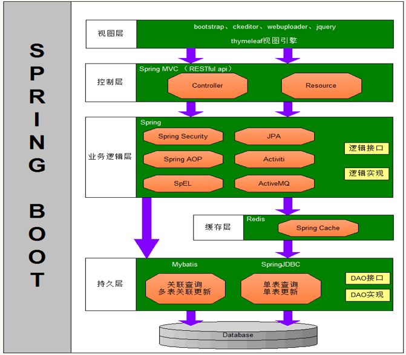

Thymeleaf：一个服务器端 Java 模板引擎，通过在 html 标签中嵌入特殊的语法糖实现在浏览器预览页面效果，又可以在服务端解析处理后渲染出动态页面。在此之前，

Bootstrap：一个免费的开源 CSS 框架，用于创建响应式网络和移动应用程序。提供了 HTML 元素的基本样式，提供现成的主题和模板，提高了开发的速度。使开发者可以通过 Java、PHP 等服务器端技术创建基于 Web 和移动的应用程序。划分响应式网格系统提供移动应用兼容性。类似于最新的 Tailwind CSS，但是 Tailwind CSS 划分更小的原子类，如果项目包含更多的后台工作，需要普通的布局，那么 Bootstrap 会更好。


## 程序结构

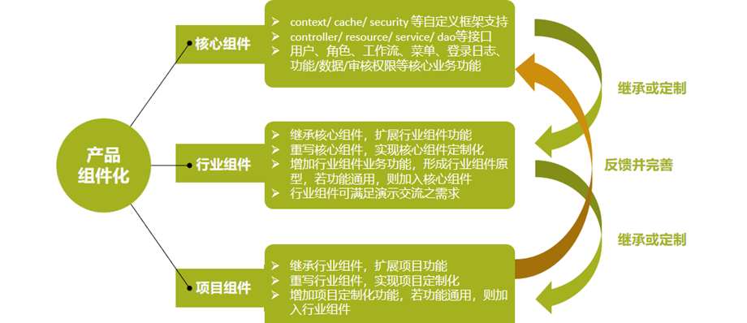

* 核心

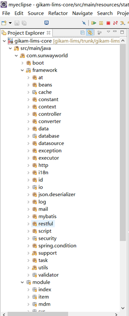

* 行业

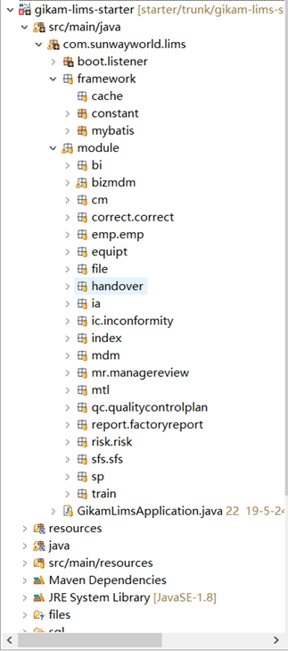

* 项目

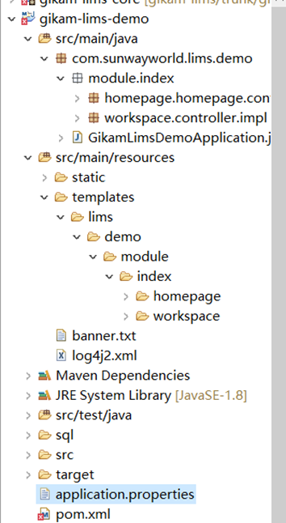

## 代码讲解

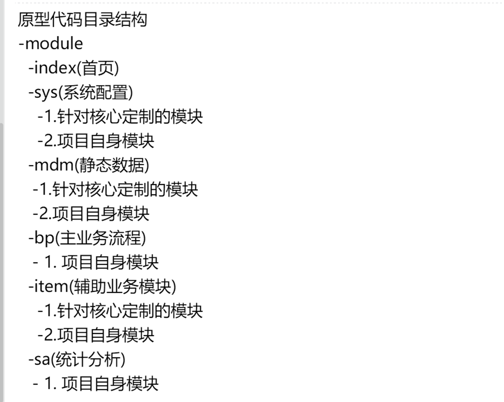

module 下的各级包结构对应于前端的各级目录

### 前端目录

src/main/resource

templates/项目/module/模块/子模块/子子模块（复数）/模板.html

static/项目/module/模块/子模块/子子模块（复数）/.js

### 后端目录

src/main/java

com.sunwayworld.项目.

module.

模块.子模块.子子模块

controller、resource、service、dao、mapper、bean（conf 下有 sql 映射文件）

### 前后端交互

```java
Rest客户端传过来的Json格式的字符串对应的Bean<br>
/**
 * Rest客户端传过来的Json格式的字符串对应的Bean<br>
 * Json格式如下：<br>
 * {<br>
 *   "p" : {<br>
 *      "n"     : 当前页,<br>
 *      "s"     : 每页数量,<br>
 *      "tf"    : 要合计的列名,用逗号隔开,<br>
 *      "cp"    : 要不相同值数量的列名,用逗号隔开,<br>
 *      "op"    : 要所有不相同值列表（前端下拉框）的一个列名,<br>
 *      "f"     : 默认过滤条件的json（前端requestData传入）,例如：<br>
 *                {<br>
 *                    "a":"xxx",<br>
 *                    "target_filter": 特殊关联过滤条件json:<br>
 *                    {<br>
 *                        type : 'unassigned' or 'assigned', 当前业务有相关的数据或不相关的数据<br>
 *                        targetTable : "关联的表",<br>
 *                        targetMatchColumn : "关联表和当前业务表匹配的关联表的字段名称，默认为ID",<br>
 *                        thisMatchColumn : "关联表和当前业务表匹配的当前表的字段名称，默认为ID",<br>
 *                        filter : [{targetFilterColumn:'xxx',targetFilterValue:'yyy'},...] 关联表中要过滤的数据<br>
 *                    },<br>
 *                    ...<br>
 *                }<br>
 *      "mf"    : 多字段过滤条件json,列如：<br>
 *                {<br>
 *                      name: 'a,b,c', // 字段<br>
 *                      value: 'value', // 值<br>
 *                      caseSensitive: true // 是否区分大小写<br>
 *                }<br>
 *      "af"    : 高级查询过滤条件的json,例如：<br>
 *                [<br>
 *                    { 第一组<br>
 *                        children: [<br>
 *                            {<br>
 *                                name: 'name11', // 字段<br>
 *                                match: 'SEQ', // 匹配方式<br>
 *                                value: 'value1' // 值<br>
 *                            },<br>
 *                            {<br>
 *                                name: 'name12', // 字段<br>
 *                                match: 'SC', // 匹配方式<br>
 *                                value: 'value2', // 值<br>
 *                                link: 'or' // 字段连接方式<br>
 *                            },<br>
 *                            ...<br>
 *                        ],<br>
 *                    },<br>
 *                    { 第二组<br>
 *                        children: [<br>
 *                            {<br>
 *                                name: 'name21', // 字段<br>
 *                                match: 'SEQ', // 匹配方式<br>
 *                                value: 'value1', // 值<br>
 *                            },<br>
 *                            {<br>
 *                                name: 'name22', // 字段<br>
 *                                match: 'SC', // 匹配方式<br>
 *                                value: 'value2', // 值<br>
 *                                link: 'or' // 字段连接方式<br>
 *                            },<br>
 *                            ...<br>
 *                        ],<br>
 *                        link: 'and' // 组的连接方式<br>
 *                    },<br>
 *                ]<br>
 *      "qf"    : 快捷查询过滤条件的json,例如：<br>
 *                {<br>
 *                    "a":"xxx",<br>
 *                    "target_filter": 特殊关联过滤条件json:<br>
 *                    {<br>
 *                        type : 'unassigned' or 'assigned', 当前业务有相关的数据或不相关的数据<br>
 *                        targetTable : "关联的表",<br>
 *                        targetMatchColumn : "关联表和当前业务表匹配的关联表的字段名称，默认为ID",<br>
 *                        thisMatchColumn : "关联表和当前业务表匹配的当前表的字段名称，默认为ID",<br>
 *                        filter : [{targetFilterColumn:'xxx',targetFilterValue:'yyy'},...] 关联表中要过滤的数据<br>
 *                    },<br>
 *                    ...<br>
 *                }<br>
 *      "vu"    : 校验数据记录是否唯一的字段，格式为待校验字段名称和值的集合，例如：{'name' : '张三', 'code' : 'zhangsan'}<br>
 *      "t"     : 字段的名称类型和对应的值和显示的内容，例如：{字段的名称:{type:'select',items:[{text:'',value:''},...]},字段的名称:{type:'checkbox'}, ...}<br>
 *      "o"     : [<br>
 *         {<br>
 *            "排序字段的名称" : "asc或desc"<br>
 *         },<br>
 *         ... ... ...<br>
 *         {<br>
 *            "排序字段的名称" : "asc或desc"<br>
 *         }<br>
 *      ],<br>
 *      "dt"    : 下载文件的标题,<br>
 *      "dr"    : {<br>
 *         "选择项对应的列表ID（表中列名）的值" : {<br>
 *            "ID" : "值",<br>
 *            ... ... ...,<br>
 *            "ID" : "值"<br>
 *         },<br>
 *         ... ... ...,<br>
 *         "选择项对应的列表ID（表中列名）的值" : {<br>
 *            "ID" : "值",<br>
 *            ... ... ...,<br>
 *            "ID" : "值"<br>
 *         }<br>
 *      },<br>
 *      "参数1" : "参数的值",<br>
 *      ... ... ...<br>
 *      "参数n" : "参数的值"<br>
 *   },<br>
 *   "b": [
 *      0 : 对应Service的Bean名称<br>
 *      1 : [ {<br>
 *              "成员变量1的名称" : "成员变量1的值",<br>
 *              ... ... ...<br>
 *              "成员变量n的名称" : "成员变量n的值"<br>
 *            },<br>
 *            ... ... ...<br>
 *            {<br>
 *              "成员变量1的名称" : "成员变量1的值",<br>
 *              ... ... ...<br>
 *              "成员变量n的名称" : "成员变量n的值"<br>
 *            } ]<br>
 *   ],<br>
 *   ... ... ...<br>
 *   "bn": [
 *      0 : 对应Service的Bean名称<br>
 *      1 : [ {<br>
 *              "成员变量1的名称" : "成员变量1的值",<br>
 *              ... ... ...<br>
 *              "成员变量n的名称" : "成员变量n的值"<br>
 *            },<br>
 *            ... ... ...<br>
 *            {<br>
 *              "成员变量1的名称" : "成员变量1的值",<br>
 *              ... ... ...<br>
 *              "成员变量n的名称" : "成员变量n的值"<br>
 *            } ]<br>
 *   ]<br>
 * }<br>
 *
 * 其中<br>
 * "p"-参数<br>
 * "bx"-body，x值为<code>空, 1, 2, ...</code><br>
 *
 * @author zhangjr@sunwayworld.com 2017年7月24日
 */
public class RestJsonWrapperBean {
```

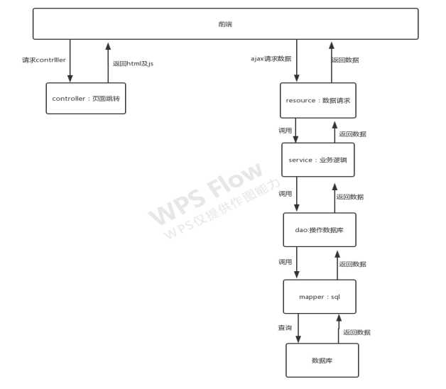

T_CORE_MENU 表 存储了各级菜单的路由，由 controller 进行接收处理

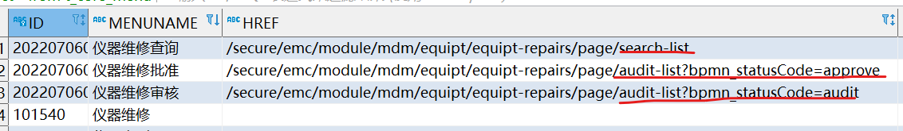

控制器接口继承不同的抽象控制器接口 对应不同的页面类型

如下包含编制页面的控制器 

```java
@RequestMapping("/secure/emc/module/mdm/equipt/equipt-repairs/page")
public interface EmcEquiptRepairController extends GenericEditListPageController, GenericDetailPageController, GenericAuditListPageController, GenericSearchListPageController, GenericChoosePageController {
}

@Controller
public interface GenericEditListPageController {
    @RequestMapping({"/edit-list"})
    String editListPage();
}
```

控制器实现类重写了方法，使用模板引擎跳转到了对应的 html 页面

```java
public class EmcEquiptRepairControllerImpl implements EmcEquiptRepairController {

    @Log(value = "仪器维修编制列表页", type = LogType.CONTROLLER)
    @Override
    public String editListPage() {
        return "emc/module/mdm/equipt/equipt-repairs/emc-equipt-repair-edit-list";
    }
```

html 引入 js 文件，调用 js 对象的 init 方法

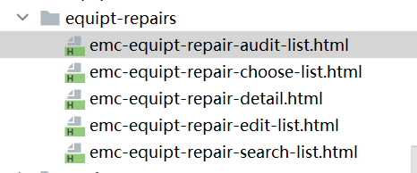

```html
<script th:inline="javascript">
/*<![CDATA[*/
    Gikam.requirejs([ '/static/emc/module/mdm/equipt/equipt-repairs/emc-equipt-repair.js',
                      '/static/emc/module/mdm/equipt/equipt-repairs/emc-equipt-repair-edit-list.js'
                    ]);
    emcEquiptRepair.editPage.init();
/*]]>*/
</script>
```

js 中定义一个总的 js 文件，用于存储业务模块所有的列（表单字段）、配置工作流、配置请求数据的 url；

其他 js 文件为具体的页面，如编制页面、详情页面、选择页面、审核页面等

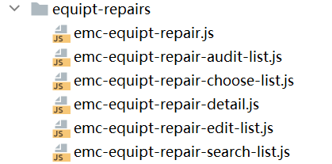

init() 

create()定义一个布局，指定渲染位置，渲染元素等

```javascript
emcEquiptRepair.editPage = {

    getGridParam : function() {
	}

    create : function() {
        var _this = this;
        Gikam.create('layout', {
            id : 'emc-equipt-repair-edit-list-layout',
            renderTo : workspace.window.$dom,
            center : {
                items : [ this.getGridParam() ]
            }
        });
    },

    init : function() {
        this.create();
    }
};
```

组件的 url 属性规定了请求数据时对应 resource 的路径

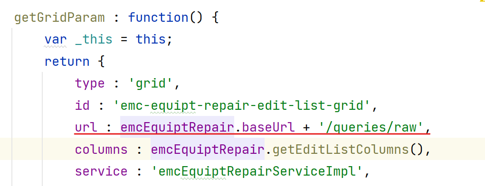

resource 请求数据

```java
@RequestMapping("/secure/emc/module/mdm/equipt/equipt-repairs")
public interface EmcEquiptRepairResource extends GenericResource<EmcEquiptRepairService, EmcEquiptRepairBean, Long>, GenericAuditableResource<EmcEquiptRepairService, EmcEquiptRepairBean, Long>, GenericChoosableResource<EmcEquiptRepairService, EmcEquiptRepairBean, Long> {
}
```

resource 实现类重写了 getService 方法

Service 实现类重写了 getDao 方法

DAO 实现类重写了 getMapper 方法

mapper 的 sql 映射文件，实现查询

```java
略
```


### Controller

```java
@RequestMapping("/secure/emc/module/mdm/equipt/equipt-repairs/page")
//page表示跳转页面
public interface EmcEquiptRepairController extends GenericEditListPageController, GenericDetailPageController, GenericAuditListPageController, GenericSearchListPageController, GenericChoosePageController {
    //如编制页面、审核页面、详情页面、选择页面
}
//控制器接口继承不同的抽象控制器接口 对应不同的页面类型
```

### Service

* 拓展关联查询

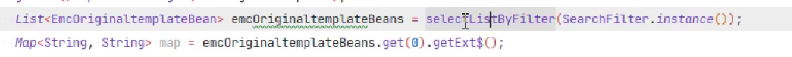

* 【强制】Service 层涉及数据增删改的操作必须加审计跟踪注解，如果有数据一致性需求必须加事务注解。

* 事务注解
* 审计跟踪注解

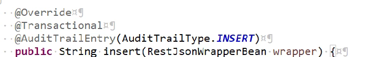

### Bean

与工作流绑定的业务实体类要继承 AbstractInsertable 实现 Auditable

不与工作流绑定的业务实体类要继承 AbstractInsertable 实现 Insertable

```java
@Table("T_EMC_EQUIPT_REPAIR")
public class EmcEquiptRepairBean extends AbstractInsertable<Long> implements Auditable<Long>, Insertable<Long> {

```

* 不能重复的序列化 id

```java
@Transient
private static final long serialVersionUID = -7422517020218944851L;
```

* 表字段

* 制单字段

```java
 	private String createdById;// 制单人编码
    private String createdByName;// 制单人名称
    @JSONField(format = "yyyy-MM-dd")
    @DateTimeFormat(pattern = "yyyy-MM-dd HH:mm:ss")
    private LocalDateTime createdTime;// 制单时间
    private String createdByOrgId;// 制单人单位编码
    private String createdByOrgName;// 制单人单位名称
```

* 审核字段

```java
    @NotNull(defaultValue = "draft")
    private String processStatus;// 流程状态
```

```java
public abstract class AbstractAuditable<ID extends Serializable> extends AbstractPersistable<ID> implements Auditable<ID> {
    private static final long serialVersionUID = 7292228337884516484L;
    @NotNull(
        defaultValue = "draft"
    )
    private String processStatus;
```

### Mapper

封装公共 sql 片段

```xml
        <where>
            <!--快捷查询-->
            <include refid="com.sunwayworld.framework.mybatis.mapper.GlobalMapper.appendWhereClausesIfPresent" />
            <!--工作流-->
            <if test='authority_audit == "1"'>
                AND <include refid="com.sunwayworld.framework.mybatis.mapper.GlobalMapper.auditAuthorityWhereClause" />
            </if>
        </where>


        <choose>
            <when test="orderParams != null and orderParams.size > 0">
                <!--列排序-->
                <include refid="com.sunwayworld.framework.mybatis.mapper.GlobalMapper.appendOrderClause" />
            </when>
            <otherwise>
                T.ID DESC
            </otherwise>
        </choose>

```

查询详情页面

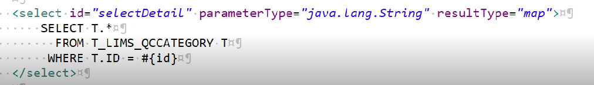

## 常用工具类

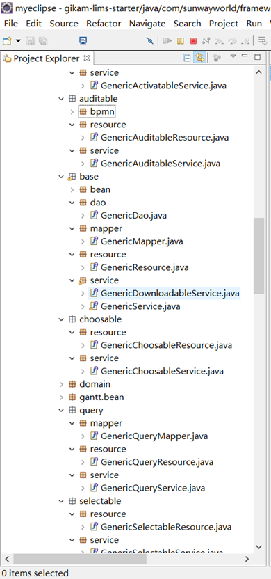

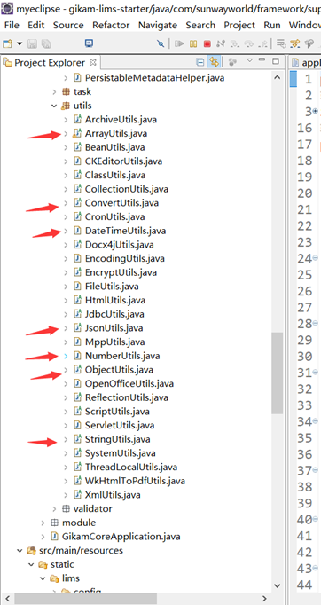

登录信息的工具类

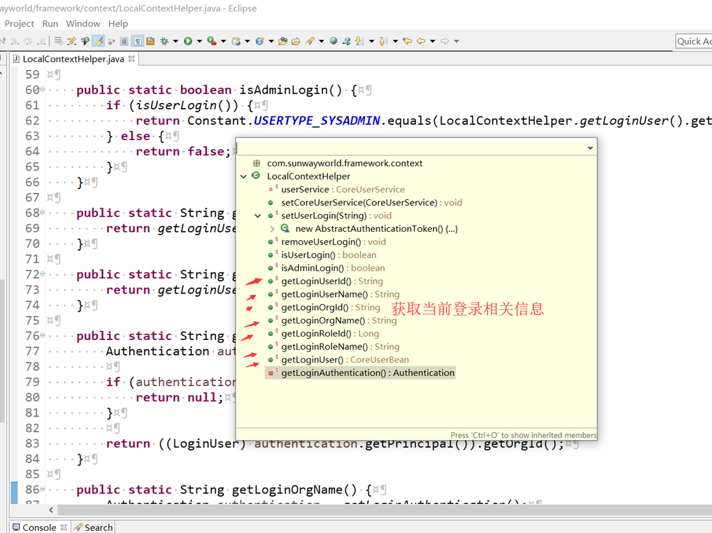

获取序列化的工具类

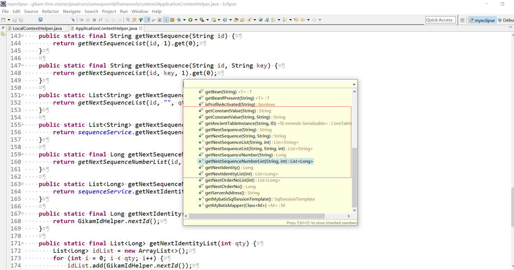

```java
 /**
     * Map中的数据赋值到指定的Bean中，如果没有对应的成员变量，赋值到Bean的ext$成员变量中
     */
PersistableHelper.mapToPersistable(map, XxxBean.class)
```

## 工作流

编制 

编制提交 GenericAuditableResource 接口中 bpmn-task-status（检查工作流任务节点的状态）  start-process（开始工作流）

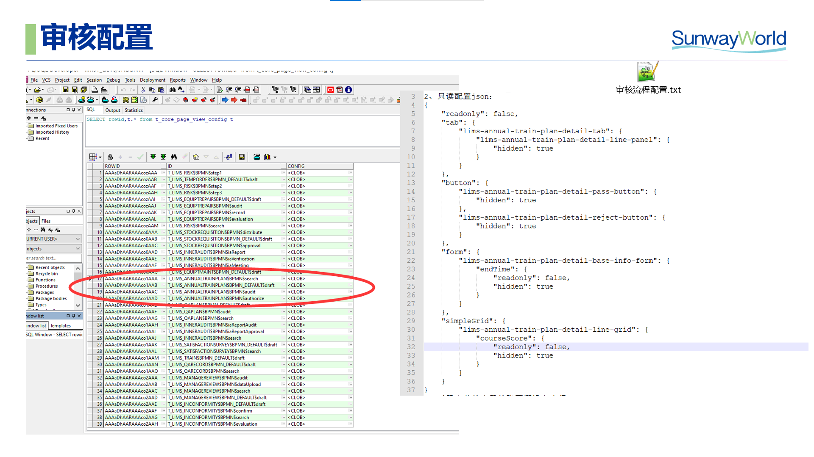


下列 mapper 配置 用于查询不同状态码 bpmn_statusCode 记录

```xml
<if test='authority_audit == "1"'>
    AND <include refid="com.sunwayworld.framework.mybatis.mapper.GlobalMapper.auditAuthorityWhereClause" />
</if>
```

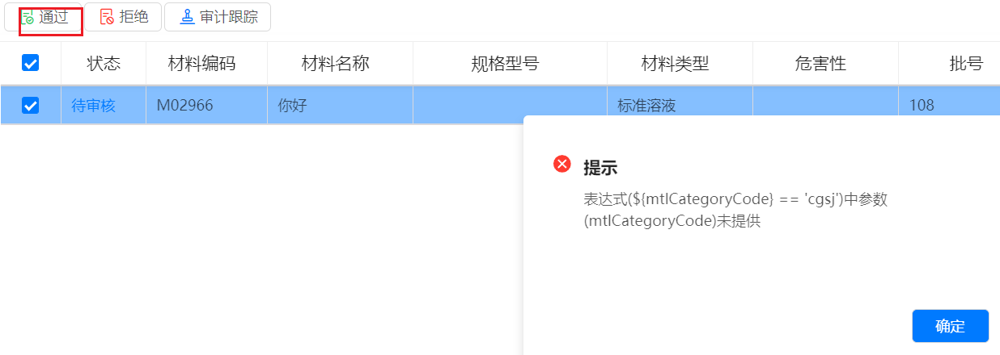

排他网关获取的值必须在实体类有对应字段

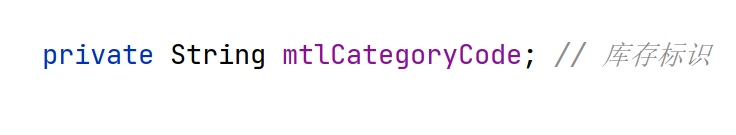

## 代码生成器

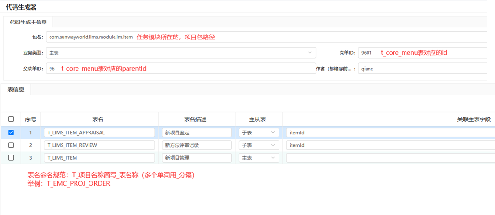

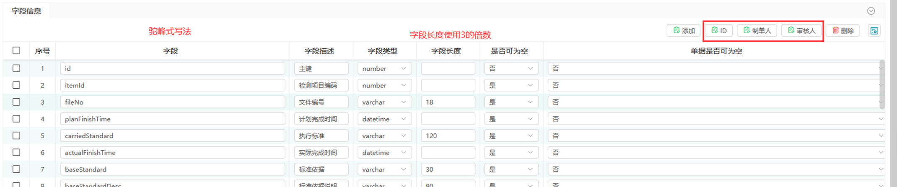

## IO

* io 功能 excel 导入导出（采用 poi）

前端访问核心的 resource 路径，service 对应导入导出实体类，id 对应记录 id

```javascript
        Gikam.getText(Gikam.printf('/core/module/item/files/{templateCode}/action/download-template/{service}/{id}', {
            templateCode : 'emcEquipExport',
            service : 'emcEquipExport',
            id : ids
        })).done(function(fileUri) {
            var fileUrl = IFM_CONTEXT + fileUri;
            Gikam.download(fileUrl);
        });
```

核心已封装好，前端按钮组件对应了

```java
@Component(value = "emcEquipExport")
public class EmcEquipExport implements GenericExportTemplate<String> {
     /**
     * XX业务 下载模板编码 和 导出 模板名称 的PairList Pair：first=下载的模板编码； second=导出的模板名称
     */
    List<Pair<String, String>> getTemplatePairList();
    
    /**
    设置模板名称和返回给浏览器下载的url 的模板方法
    **/
    default String getDownLoadTemplateUrl(String templateCode, ID id) {
       ...
    }
    
    /**
     * 需对模板进行数据初始化的业务，需实现该方法
     * ID为路径尾部传入的id字符串
     */
    default void initTemplateData(Path path, ID id) {
    }
```

* 信息导入

```js
		{
                type : 'button',
                text : 'GIKAM.BUTTON.EXCEL_IMPORT',
                icon : 'edit',
                onClick : function() {
                    Gikam.importExcel({
                        url : IFM_CONTEXT + '/core/module/item/files/{id}/action/import/' + 'emcInternalAuditClauseRegistrationImportFileFunction',
                        dbTable : 'T_EMC_INTERNAL_AUDIT_CLAUSE_REGISTRATION',
                        onImportSuccess : function(files) {
                            Gikam.getComp('emc-internal-audit-clause-registration-edit-list-grid').refresh();
                        }
                    });
                }
            }
```

**原理**

```java
    @Override
    public <ID extends Serializable> String downLoadTemplate(String templateCode, String service, ID id) {
        GenericExportTemplate<ID> exportTemplate = ApplicationContextHelper.getBean(service);
        return exportTemplate.getDownLoadTemplateUrl(templateCode, id);
    }
//service 查找对应的导出模板的service
//templateCode 查找文件所在路径文件夹
        
```


## 待办

```sql
# 待办配置表 可配置菜单在工作区（首页）展示的待办位置 
SELECT * FROM t_core_todo_config tctc ;
```

若不是标准的 编辑页或审核页 菜单格式，则需配置好查询方法 才不会影响待办显示

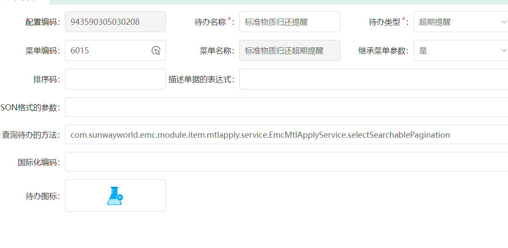

## 报表预览

报表组 t_core_report_config

报表 t_core_report_config_line

## 编码

分类编码 t_core_code 

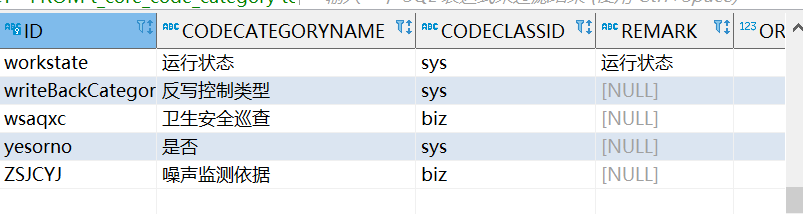

系统编码 t_core_code_category

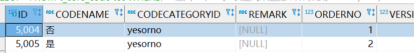

字段选择演示

```javascript
{
    field: 'controlledStamp',
    title: 'T_EMC_FILE_AUDIT.CONTROLLEDSTAMP',
    type: 'select',
    category: 'sys',
    param: {
    	codeCategoryId: yesorno
    }
}
```

## i18n

* 配置位置在项目相应 properties 文件


或数据库 T_CORE_I18N 表中

* 命名规范

列名：（大写）表名.字段名

组件名：后端包名.组件类型名.组件名

* 公共变量

```properties
# 公共变量
##################################################################
GIKAM.WORKFLOW.BUTTON.PASS=通过
GIKAM.WORKFLOW.BUTTON.REJECT=拒绝
GIKAM.BUTTON.SEARCH=查询
GIKAM.BUTTON.REMOVE=移除
GIKAM.BUTTON.MORE=更多
GIKAM.BUTTON.REPORT=报表
GIKAM.BUTTON.PREVIEW=预览
GIKAM.BUTTON.LOOK_ATLAS=查看图谱
GIKAM.BUTTON.MORE_OPERATE=更多操作
GIKAM.BUTTON.CLEAN_CONDITION=清空条件
GIKAM.TAB.LOOK_ATLAS=查看图谱
GIKAM.ACTIVE.TITLE.STATUS=状态
GIKAM.FILE.BIZCATEGORY=附件类型
GIKAM.EXCEPTION.DEADLOCK.TESTNAME=测试名称为
GIKAM.EXCEPTION.DEADLOCK.METHODNAME=方法名称为
GIKAM.EXCEPTION.DEADLOCK.ITEMNAME=分析项名称为

GIKAM.TIP.CONFIRMSUBMIT=确认提交
GIKAM.TIP.CHOOSE_ONE_ITEM.BACK=请选择一条数据退回
GIKAM.BUTTON.EXCEL_IMPORT=导入
GIKAM.BUTTON.EXCEL_EXPORT=模板导出

GIKAM.TIP.IF_FILE_DELETE=是否删除附件
GIKAM.TIP.FILE_OVERRIDE=存在附件，请确认是否覆盖
GIKAM.TIP.FILE_DELETE=删除附件
等
```

## 定时任务

秋毫自动下任务 

仪器采集脚本


## 业务理解

### 报表

报表组 reportconfigline 报表 reportconfigline 根据报告模板组可以选择报告模板进行预览

报表类型： reportingService                     reportlet 帆软报表

```js
// 报表请求路径 前端拼接好 

// reportlet类型
// http://localhost:8089/decision/view/report
// formlet类型
// http://localhost:8089/decision/view/form

// viewlet = reportPath 
// 报表编码+ '/' + 附件的文件名
// 例如 02/大气污染源废气监测原始记录.cpt
var reportPath = reportConfigLine.reportConfigLineNo + '/' + encodeURIComponent(reportConfigLine.ext$.filename);

// reportParam = reportParam 多个参数

```

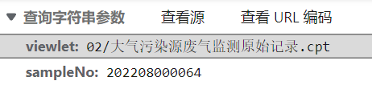

报表路径即预览模态框的 src 加载到 iframe 中的路径

### 测试方法

测试  t_emc_test 记录测试名称

方法 t_emc_method 启用与废用 记录方法名称

测试方法 t_emc_test_method 连接测试与方法

### 分析项

测试方法


### 监测点

客户 t_emc_client  具有客户类型 customerCategory（分类编码 水、大气、土壤...）

不同客户类型 有对应的若干监测点 t_emc_monitor_point 记录了各种点位信息

监测点具有监测点类型 t_emc_monitor_point_category   和监测点类别 monitoringPointCategory（分类编码）

其相关信息 在 模板方法为监测点类型的属性设置 t_emc_property_tmpl 中

监测点类型 确切对应一个监测点模板 由 t_emc_mpc_tmpl 连接

监测点模板组 t_emc_monitor_tmpl_group 包含监测点模板 t_emc_monitor_tmpl

检查点模板含有多个监测方案 t_emc_monitor_scheme 可按照模板方案名 schemeName（字段）分组

监测方案 确切对应一个测试方法

### 项目

项目 t_emc_project 具有 业务类型 t_emc_biz_category  各个字段将在后续多个环节补充 项目节点 proJectNode 显示项目所在流程

业务类型由 bizType（分类编码）分类 具有有是否采样 sample（字段） 质量控制 委托性监测都不是采样任务

### 项目方案

下达任务时， 为项目添加监测方案 t_emc_monitor_scheme 后生成项目方案 t_emc_proj_scheme

项目方案下方，含有监测方案对应的样品 t_emc_proj_order，

将项目提交后，通过 insertBpData()生成各种主业务流程数据

### 点位


### 样品

样品值、次均值、日均值、总均值

生成报告数据时，会根据 ordertaskresult 分组计算结果，分别插入这些 datatype 的报告数据


送样 、 采样


点位 folder 在项目登记时，会添加多个监测点  每个点位下有很多不同样品类型样品 

每个采样单 对应 某种样品类型相同的若干样品


任务下达时， 添加监测点、测试、方法

样品 order 任务审核后 监测方案 采样时可修改样品信息 容器

样品测试 ordertask   任务审核后 监测项目

### 样品测试

* 送样任务

项目审核生成 样品测试

样品接收

任务指派  ： 修改录入人     状态：assign

领取样品： 设置领样人员 状态： receive 

 分析录入：结果录入 状态： logged

### 样品测试结果 


ordertaskresult 采样任务审核后 ，根据项目和测试方法 查找对应的分析项 ，其中分析项必须在分析项组中维护， 样品结果用于后续分析录入

```
// 若样品结果 qc类型为 N/A
// 分析项有对应的 标准
// 只有分析项的计算质控结果为是的才执行计算公式2
```

分析 run 分析录入时，由若干个待处理的样品测试  生成一个测试批 

样品分析项组 OrderItemGroup


采样信息 sample 现场采样时添加采样单时生成 每个项目对应多个采样单 一个采样单有一个报告模板，


客户 具有水环境、土壤、大气环节、生态等客户类别


监测点  监测点类型对应一个监测点模板组   为监测点添加监测点模板时，只能选取对应模板组内的模板


含对比字样的测试   一般就是 需要标准实验室样品的   才会用到标准物质 


公式计算 各分析项的各个结果

```java
GikamComputingEngine计算
compute() {
            this.setDependencyCheck(false);
            this.initData();//初始化计算公式所需的数据  选中的样品结果  selectScriptByCondition 获取其公式 一般两条公式 
            BshExecutor bsh = this.getBshExecutor();
            this.setDependencyCheck(true);
            this.run(bsh);
            this.setDependencyCheck(false);
            this.testDeadlock();
            this.sortData();
            this.run(bsh);
            this.processData();
}
 
公式在标准设置 即质控公式中
    
批有斜率信息 记录某些公式需要的值
    
sql管理可以维护 某些常用sql  用  findAndExecuteSQL 替换 executeSQL
    
    
 
```

* 修约规则 

```
质控公式（标准设置）里的修约字段中设置
分析项的分段修约规则t_emc_item_revision表中设置
分析项字段limitrevision是否根据检出限修约  根据结果的检出底限修约  

you'xian'ji
```

* 现场直读因子  是没有分析批的 

```
SELECT terr.RUNID , terr.* FROM t_emc_report_result terr     
LEFT JOIN t_emc_test_method tetm 
ON terr.TESTMETHODID = tetm.ID 
WHERE tetm.ANALYSISORGID  = 'XCS';
```


### 报告

* 生成报告流程

以秋毫检测为例

```java
viewDocument

documentData

viewDocument

setDataToWord
//生成综合报表
setDataToReportComprehensive();
//按样品类型
createTableXXXXType();
```
