# 1 项目介绍

**前置知识**

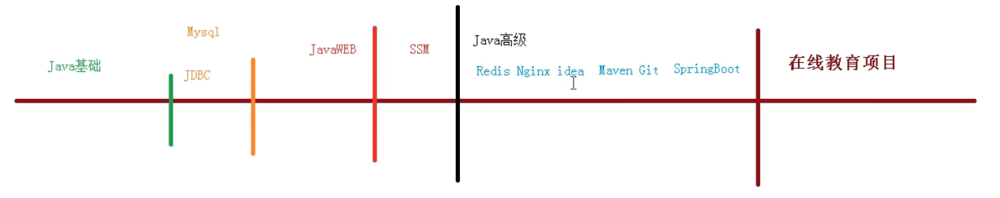

**项目背景**

**商业模式**

B2C 


B2B2C

**项目功能模块**

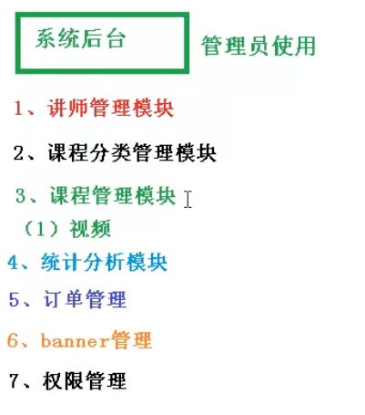

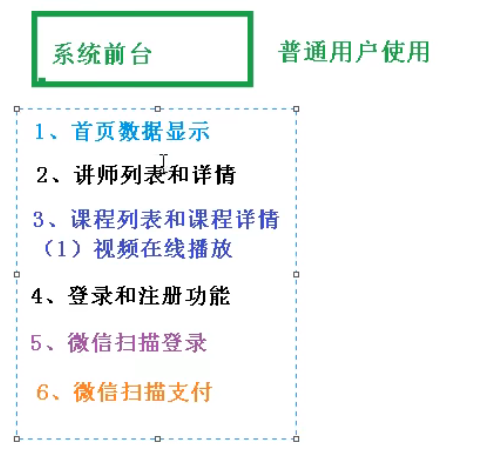

**前后端开发分离**

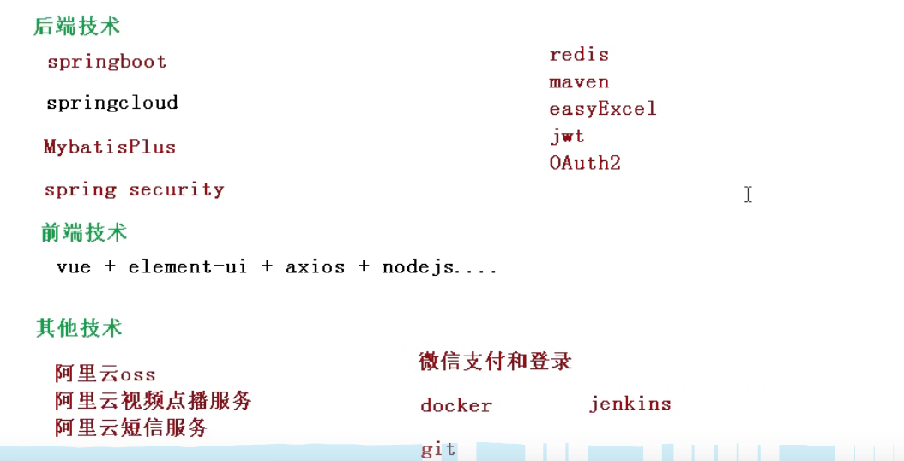

**mybatis-plus学习**


# 2 环境搭建

## 2.1 前后端分离概念

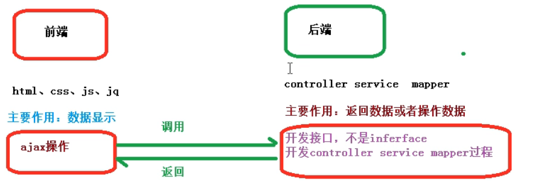

## 2.2 搭建项目环境

**数据库设计规约**

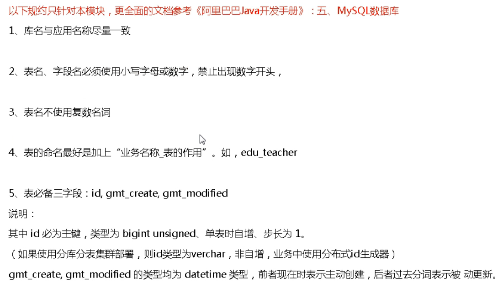

**创建项目结构**

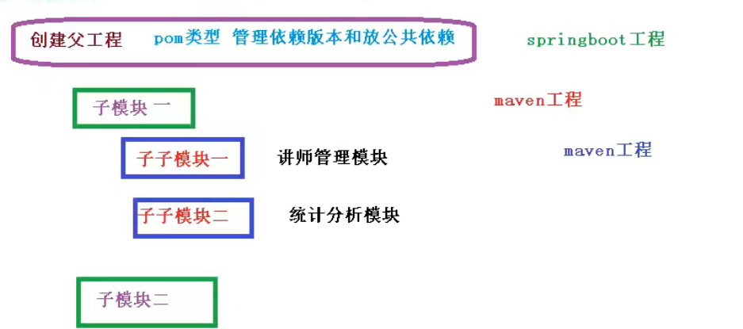

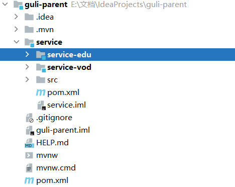

# 3 讲师管理后台开发（CRUD）

## 3.1 构建

```yml
server:
  port: 8001 #服务端口

spring:
  application:
    name: service-edu # 服务名称
  profiles:
    active: dev # 环境设置：dev test prod
  datasource: # 数据源 mysql连接
    driver-class-name: com.mysql.cj.jdbc.Driver
    url: jdbc:mysql://localhost:3306/nacos_config?useUnicode=true&useJDBCCompliantTimezoneShift=true&useLegacyDatetimeCode=false&serverTimezone=UTC
    username: root
    password: root


mybatis-plus:
  configuration:
    log-impl: org.apache.ibatis.logging.stdout.StdOutImpl # mybatis日志
```

代码生成器

```xml
<!-- velocity 模板引擎, Mybatis Plus 代码生成器需要 -->
<dependency>
    <groupId>org.apache.velocity</groupId>
    <artifactId>velocity-engine-core</artifactId>
</dependency>
```

```java
public class CodeGenerator {
    @Test
    public void test() {
        String projectPath = System.getProperty("user.dir");
        System.out.println(projectPath);
    }

    @Test
    public void run() {

        // 1、创建代码生成器
        AutoGenerator mpg = new AutoGenerator();

        // 2、全局配置
        GlobalConfig gc = new GlobalConfig();
        String projectPath = System.getProperty("user.dir");
        gc.setOutputDir(projectPath + "/src/main/java");
        gc.setAuthor("testjava");
        gc.setOpen(false); //生成后是否打开资源管理器
        gc.setFileOverride(false); //重新生成时文件是否覆盖
        gc.setServiceName("%sService");	//去掉Service接口的首字母I
        gc.setIdType(IdType.ID_WORKER_STR); //主键策略
        gc.setDateType(DateType.ONLY_DATE);//定义生成的实体类中日期类型
        gc.setSwagger2(true);//开启Swagger2模式

        mpg.setGlobalConfig(gc);

        // 3、数据源配置
        DataSourceConfig dsc = new DataSourceConfig();
        dsc.setUrl("jdbc:mysql://localhost:3306/guli?serverTimezone=UTC&useUnicode=true&characterEncoding=utf8&useSSL=false");
        dsc.setDriverName("com.mysql.cj.jdbc.Driver");
        dsc.setUsername("root");
        dsc.setPassword("root");
        dsc.setDbType(DbType.MYSQL);
        mpg.setDataSource(dsc);

        // 4、包配置
        PackageConfig pc = new PackageConfig();
        pc.setParent("com.tintin");
        pc.setModuleName("edu"); //模块名
        pc.setController("controller"); //com.tintin.edu.controller
        pc.setEntity("entity");
        pc.setService("service");
        pc.setMapper("mapper");
        mpg.setPackageInfo(pc);

        // 5、策略配置
        StrategyConfig strategy = new StrategyConfig();
        strategy.setInclude("edu_teacher"); // 表名
        strategy.setNaming(NamingStrategy.underline_to_camel);//数据库表名映射到实体的命名策略 驼峰命名
        strategy.setTablePrefix(pc.getModuleName() + "_"); //生成实体时去掉表前缀

        strategy.setColumnNaming(NamingStrategy.underline_to_camel);//数据库表字段映射到实体的命名策略
        strategy.setEntityLombokModel(true); // lombok 模型 @Accessors(chain = true) setter链式操作

        strategy.setRestControllerStyle(true); //restful api风格控制器
        strategy.setControllerMappingHyphenStyle(true); //url中驼峰转连字符

        mpg.setStrategy(strategy);


        // 6、执行
        mpg.execute();
    }
}

```

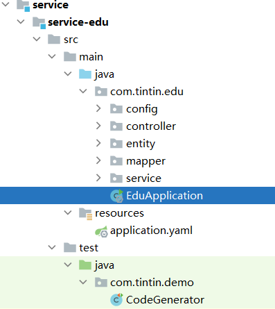

## 3.2 Swagger2测试delete请求

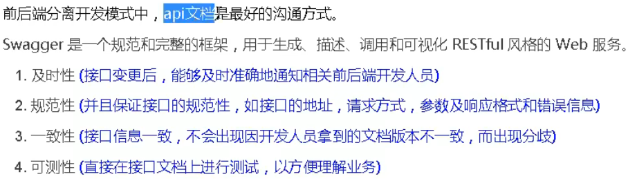

**配置**

放入公共模块中

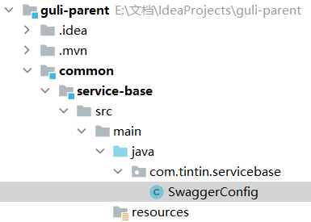

```java
@Configuration//配置类  需要被微服务扫描到
@EnableSwagger2//Swagger注解
public class SwaggerConfig {
    @Bean
    public Docket webApiConfig(){
        return new Docket(DocumentationType.SWAGGER_2)
                .groupName("webApi")
                .apiInfo(webApiInfo())
                .select()
                .paths(Predicates.not(PathSelectors.regex("/admin/.*")))
                .paths(Predicates.not(PathSelectors.regex("/error.*")))
                .build();

    }

    private ApiInfo webApiInfo(){

        return new ApiInfoBuilder()
                .title("网站-课程中心API文档")
                .description("本文档描述了课程中心微服务接口定义")
                .version("1.0")
                .contact(new Contact("java", "http://atguigu.com", "1123@qq.com"))
                .build();
    }
}
```

访问swagger[Swagger UI](http://localhost:8001/swagger-ui.html) 发生delete请求等

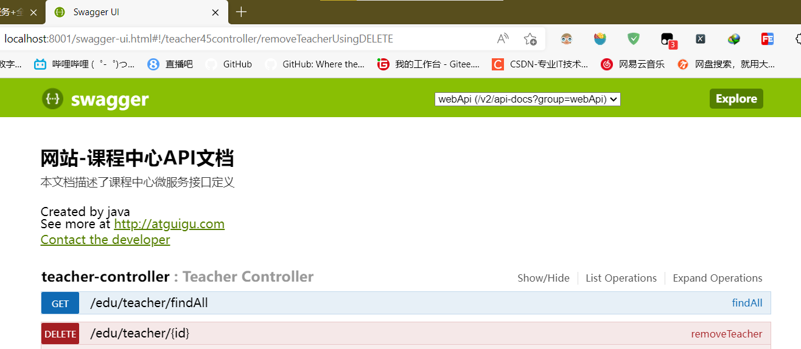

加上文档注解的controller

```java
@Api(tags = "讲师管理")
@RestController
@RequestMapping("/edu/teacher")
public class TeacherController {
    @Autowired
    private TeacherService teacherService;

    //rest风格


    // 查询讲师表中的所有数据
    @ApiOperation("查询讲师表中的所有数据")
    @GetMapping("/findAll")
    public List<Teacher> findAll() {
        List<Teacher> list = teacherService.list(null);
        return list;
    }

    @ApiOperation("逻辑删除讲师")
    @DeleteMapping("{id}")
    public boolean removeTeacher(@ApiParam(name = "id", value = "讲师id",required = true) @PathVariable("id") String id) {
        return teacherService.removeById(id);
    }
}


```

## 3.3 统一返回数据格式

在common模块创建子模块common-utils

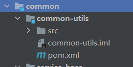

创建数据状态返回码

```java
public interface ResultCode {
    public static Integer SUCCESS = 20000;// 成功

    public static Integer ERROR = 20001; // 失败
}

```

定义数据返回格式+ 链式编程

```java
@Data
public class CommonResult {
    @ApiModelProperty("是否成功")
    private Boolean success;

    @ApiModelProperty("返回码")
    private Integer code;

    @ApiModelProperty("返回消息")
    private String message;

    @ApiModelProperty("返回数据")
    private Map<String, Object> data = new HashMap<>();
	//私有化构造方法
    private CommonResult() {

    };
	//开放成功和失败方法
    public static CommonResult ok() {
        CommonResult commonResult = new CommonResult();
        commonResult.setSuccess(true);
        commonResult.setCode(ResultCode.SUCCESS);
        commonResult.setMessage("成功");
        return commonResult;
    }

    public static CommonResult error() {
        CommonResult commonResult = new CommonResult();
        commonResult.setSuccess(false);
        commonResult.setCode(ResultCode.ERROR);
        commonResult.setMessage("失败");
        return commonResult;
    }

    //链式编程
    public CommonResult success(Boolean success){
        this.setSuccess(success);
        return this;
    }

    public CommonResult message(String message){
        this.setMessage(message);
        return this;
    }

    public CommonResult code(Integer code){
        this.setCode(code);
        return this;
    }

    public CommonResult data(String key, Object value){
        this.data.put(key, value);
        return this;
    }

    public CommonResult data(Map<String, Object> map){
        this.setData(map);
        return this;
  
```

## 3.4 分页功能

```java
//分页查询
//current 当前页码
//size 每页记录数
@GetMapping("page/{current}/{size}")
public R page(@PathVariable("current") Long current, @PathVariable("size") Long size) {
    Page<Teacher> pageTeacher = new Page<>(current,size);
    IPage<Teacher> page = teacherService.page(pageTeacher, null);
    long total = page.getTotal();
    List<Teacher> records = page.getRecords();
    return R.ok().data("total",total).data("rows",records);
}
```

## 3.5 多条件组合分页查询

1. 把条件值封装到对象里面，把对象传递到接口中
2. 根据条件值 拼接sql

```java
//多条件组合分页查询
    //current 当前页码
    //size 每页记录数
    @PostMapping("pageCondition/{current}/{size}")
    public R pageCondition(@ApiParam(value = "当前页码",required = true) @PathVariable("current") Long current,
                           @ApiParam(value = "每页记录数",required = true) @PathVariable("size") Long size,
                           //传递过来的条件
                           @RequestBody(required = false) TeacherQuery teacherQuery) {
        //构建分页
        Page<Teacher> pageTeacher = new Page<>(current,size);
        //构建条件
        //动态拼接sql
        QueryWrapper<Teacher> queryWrapper = new QueryWrapper<>();
        String name = teacherQuery.getName();
        Integer level = teacherQuery.getLevel();
        String begin = teacherQuery.getBegin();
        String end = teacherQuery.getEnd();

        if (StringUtils.hasLength(name)) {
            queryWrapper.like("name",name);
        }
        if (level != null) {
            queryWrapper.eq("level",level);
        } if (StringUtils.hasLength(begin)) {
            queryWrapper.gt("gmt_create",begin);
        } if (StringUtils.hasLength(end)) {
            queryWrapper.lt("gme_create",end);
        }
        //调用方法分页查询
        IPage<Teacher> page = teacherService.page(pageTeacher, queryWrapper);
        long total = page.getTotal();
        List<Teacher> records = page.getRecords();
        return R.ok().data("total",total).data("rows",records);
    }
```

## 3.6 异常处理

**统一异常处理**

创建统一异常处理器

```java
@ControllerAdvice
public class GlobalExceptionHandler {
    //指定什么异常出现时 执行这个方法
    @ExceptionHandler(Exception.class)
    @ResponseBody
    public R error(Exception e) {
        e.printStackTrace();
        return R.error().message("全局异常处理");
    }
}
```

**特定异常处理**

```java
   @ExceptionHandler(ArithmeticException.class)
    @ResponseBody
    public R error2(Exception e) {
        e.printStackTrace();
        return R.error().message("ArithmeticException异常处理");
    }
```

**自定义异常处理**

```java
@Data
@NoArgsConstructor
@AllArgsConstructor
public class GuliException extends RuntimeException{
    static final long serialVersionUID = -7034897190745766939L;

    @ApiModelProperty(value = "状态码")
    private Integer code;

    private String msg;
}

```

```java
    @ExceptionHandler(GuliException.class)
    @ResponseBody
    public R error3(GuliException e) {
        e.printStackTrace();
        return R.error().code(e.getCode()).message(e.getMsg());
    }
```

```java
        try {
            int a = 10/0    ;//测试全局异常
        } catch (Exception e) {
            throw new GuliException(20001,"谷粒商城异常");
        }
```


## 3.7 日志处理

**配置日志级别**

Logger日志记录器是分级别的：OFF、FATAL、ERROR、INFO、DEBUG、All

springboot默认INFO以上

```yml
logging:
  level:
    root: INFO
```

**Logback日志**

springboot内部日志实现框架 类似log4j

**Logback日志 实现输出控制台且输出到文件中**

删除原有日志配置信息

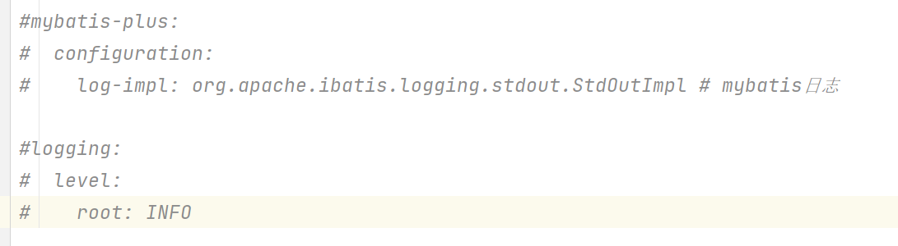

创建资源文件logback-spring.xml

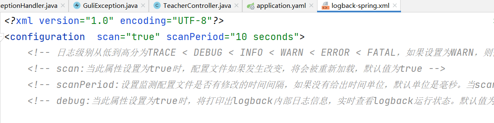

**将异常信息输出到文件中**

在类上面加上注解@Slf4j

```java
log.error(e.getMessage());
```

# 4 前端技术

## 4.1 准备工作

**安装插件**

**创建工作区**

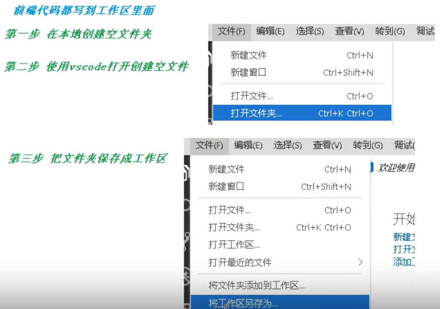

## 4.2 ES6入门

### 4.2.1 ECMAScript 6 简介

ECMAScript 6.0（以下简称 ES6）是 IavaScript 语言的下一代标准，已经在 2015 年 6 月止E式发布了。它的目标，是使得JavaScript语言可以用来编写复杂的大型应用程序，成为企业级开发语言。

**ES6与JavaScript的关系**

一个常见的问题是，ECMAScript和JavaScript到底是什么关系？
要讲清楚这个问题，需要回顾历史。1996 年 11 月，JavaScript 的创造者 Netscape 公司，决定将 JavaScript 提交给标准化组织ECMA，希望这种语言能够成为国际标准。次年，ECMA 发布 262 号标准文件（ECMA-262）的第一版，规定了浏览器脚本语言的标准，并将这种语言称为 ECMAScript，这个版本就是1.0版。**因此，ECMAScript 和 JavaScript 的关系是，前者是后者的规格，后者是前者的一种实现**（另外的 ECMAScript 方言还有 Jscript 和ActionScript）

**ES6 与 ECMAScript 2015 的关系**

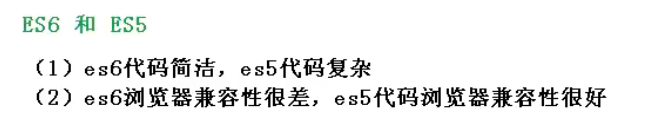

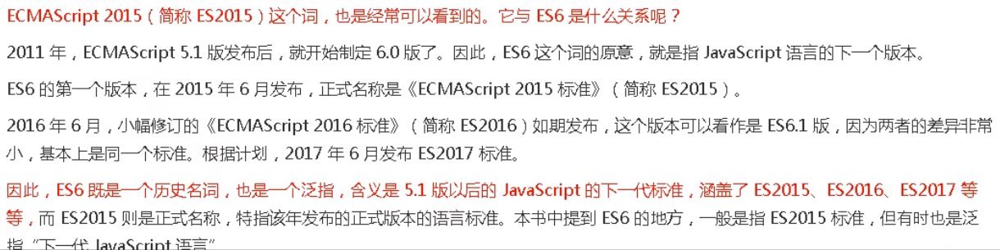

### 4.2.2 基本语法

```javascript
作用范围
var a = 1;//无作用范围 可声明多次
let b = 2;//有作用范围 只能声明一次

常量
//const pI 定义常量必须初始化
const PI = "3.1415" //定义常量后 
//PI = 3 不能再改变

数组解构
//传统
let a = 1, b = 2, c = 3
console.log(a,b,c)
//ES6
let [a,b,c] = [1, 2, 3]
console.log(a,b,c)

对象解构
//定义对线
let user = {"name":"lucy","age":20}
//传统
let name1 = user.name
let age1 = user.age
console.log(name1, age1)
//ES6
let {name, age} = user//结构变量中必须是user的属性
console.log(name,age)

模板字符串
//加强版字符串，用`反引号
//多行字符串
let str1 = `hey,
how are you?`
//字符串中插入变量
let name = "Mike"
let age = 18
let str2 = `My name is ${name}, i am ${age + 1} year old next year.`
//字符串中调用方法
function f1() {
    return "hello f1"
}
let str3 = `using ${f1()}`

声明对象简写
//变量名与属性名相同时才可以简写
const name = "Amy"
const age = 12
//传统
const person1 = {age:age, name:name}
//ES6
const person2 = {age, name}

定义方法简写
//传统
const person1 = {
    sayHi:function() {
        console.log("Hi")
    }
}
person1.sayHi()
//ES6
const person2 = {
    sayHi() {
        console.log("Hi")
    }
}
person2.sayHi()

对象拓展运算符
//拷贝对象
let person1 = {name:"Amy", age:15}
let someone = {... person1}
//合并对象
let age = {age:15}
let name = {name:"Amy"}
let person2 = {...age,...name}

箭头函数
//传统
var f1 = function(a) {
    return a
}
//ES6
var f2 = a => a
consule.log(f1(2))
//多参数 多行语句情况
var f3 = (a,b) => {
    let result = a + b
    return result 
}
或
var f4 = (a,b) => a + b
```

## 4.3 Vue入门

### 4.3.1 Vue简介

Vue（读音 /vju:/，类似于 view）是**一套用于构建用户界面的渐进式框架**。Vue的核心库只关注视图层，不仅易于上手，还便于与第三方库或既有项目整合。另一方面，当与现代化的工具链以及各种支持类库结合使用时，Vue也完全能够为复杂的单页应用提供驱动。

### 4.3.2 Vue初始化

创建html头

引入Vue脚本

在html添加div标签，添加id属性

编写Vue代码

```html
<!DOCTYPE html>
<html lang="en">
<head>
    <meta charset="UTF-8">
    <meta http-equiv="X-UA-Compatible" content="IE=edge">
    <meta name="viewport" content="width=device-width, initial-scale=1.0">
    <title>Document</title>
</head>
<body>
    <div id="app">
          <!-- {{}} 插值表达式，绑定vue中的data数据 -->
          {{message}}
    </div>
	<script src="vue.min.js"></script>
    <script>
        // 创建一个vue对象
        new Vue({
            el: '#app',//绑定vue作用的范围
            data: {//定义页面中显示的模型数据
                message: 'Hello Vue!'
            }
        })
    </script>
</body>
</html>
```

### 4.3.3 抽取代码片段

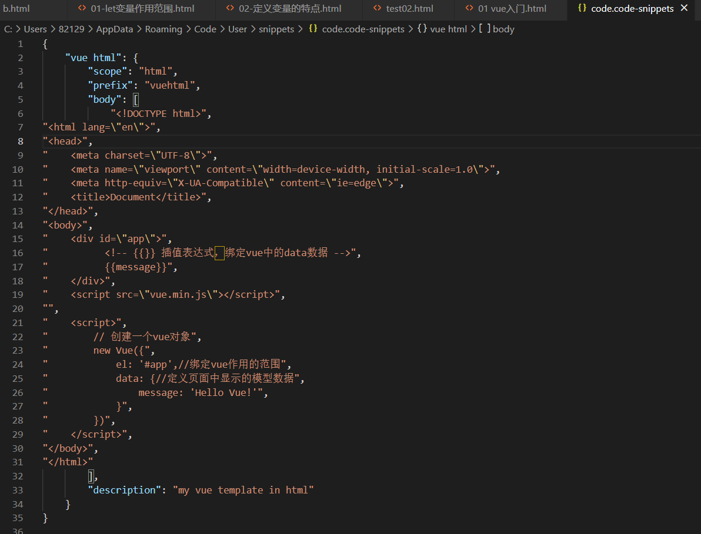

### 4.3.4 基本语法

**v-bind单向数据绑定**

```html
	<div id="app">
        <!-- v-bind指令
            单向数据绑定
            这个指令一般用在标签属性里面，获取值
        -->
        <h1 v-bind:title="message">
            {{content}}
        </h1>

        <!--简写方式-->
        <h2 :title="message">
                {{content}}
            </h2>

    </div>
```

**v-model双向数据绑定**

```html
	<div id="app">
        <input type="text" v-bind:value="searchMap.keyWord"/>
        <!--双向绑定-->
        <input type="text" v-model="searchMap.keyWord"/>

        <p>{{searchMap.keyWord}}</p>

    </div>
```


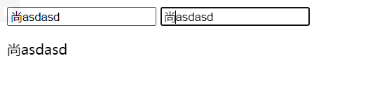

**v-on事件绑定**

定义方法

```vue
<script src="vue.min.js"></script>
    <script>
        new Vue({
            el: '#app',
            data: {
                searchMap:{
                    keyWord: '尚硅谷'
                },
                //查询结果
                result: {}
            },
            methods:{//定义多个方法
                search() {
                    console.log('search....')
                },
                f1() {
                    console.log('f1...')
                }
            }
        })
    </script>
```

绑定事件

```html
<div id="app">
        <!--vue绑定事件-->
        <button v-on:click="search()">查询</button>

        <!--vue绑定事件简写-->
        <button @click="search()">查询1</button>
    </div>
```

**修饰符**

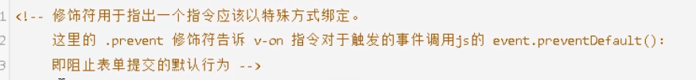

```html
<div id="app">
        <form action="save" v-on:submit.prevent="onSubmit">
            <input type="text" id="name" v-model="user.username"/>
            <button type="submit">保存</button>
        </form>
    </div>
```

**v-if和v-show条件渲染**

```html
    <div id="app">
        <input type="checkbox" v-model="ok"/>是否同意
        <!--条件指令 v-if  v-else -->
        <h1 v-if="ok">尚硅谷</h1>
        <h1 v-else>谷粒学院</h1>
    </div>
    <script src="vue.min.js"></script>
    <script>
        new Vue({
            el: '#app',
            data: {
                ok:false
            }
        })
    </script>
```

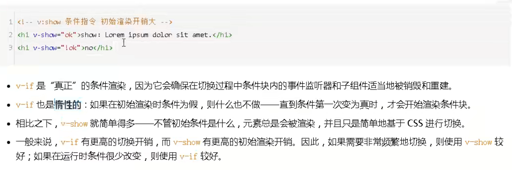

**v-for列表渲染**

index获取索引

```html
 <div id="app">
        <ul>
            <li v-for="n in 10"> {{n}} </li>
        </ul>
        <ol>
            <li v-for="(n,index) in 10">{{n}} -- {{index}}</li>
        </ol>

        <hr/>
        <table border="1">
            <tr v-for="user in userList">
                <!-- <td>{{user.id}}</td>
                <td>{{user.username}}</td>
                <td>{{user.age}}</td> -->
                <td v-for="field in user">{{field}}</td>
            </tr>
        </table>

    </div>
```

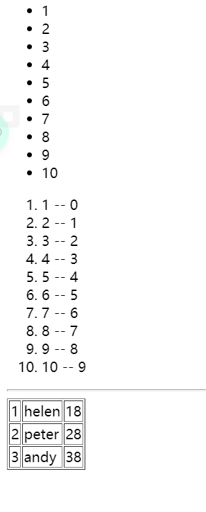


## 4.4 Vue进阶

**组件**

组件（Component）是Vue.js最强大的功能之一。
组件可以扩展 HTML 元素，封装可重用的代码。
组件系统让我们可以用独立可复用的小组件来构建大型应用，几乎任意类型的应用的界面都可以抽象为一个组件树：

```html
    <div id="app">
        <Navbar></Navbar>
    </div>
    <script src="vue.min.js"></script>
    <script>
        new Vue({
            el: '#app',
            //定义vue使用的组件
            components: {
                //组件的名字
                'Navbar': {
                    //组件的内容
                    template: '<ul><li>首页</li><li>学员管理</li></ul>'
                }
            }
        })
    </script>
```

全局组件

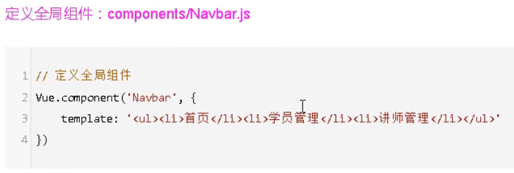

在其他文件中引入该脚本 并插入标签

**实例的生命周期**

beforeCreate

created

数据渲染

beforeMount

mounted

beforeUpdate

updated

beforeDestroy

destroyed

```html
<script>
        new Vue({
            el: '#app',
            data: {
            },
            created() {
                debugger//加入断点测试
                //在页面渲染之前执行
                console.log('created....')
            },
            mounted() {
                debugger//加入断点测试
                //在页面渲染之后执行
                console.log('mounted....')
            }
        })
    </script>
```

**路由**

在引入vue.min.js后引入vue-router.min.js


```html
<div id="app">
            <h1>Hello App!</h1>
            <p>
                <!-- 使用 router-link 组件来导航. -->
                <!-- 通过传入 `to` 属性指定链接. -->
                <!-- <router-link> 默认会被渲染成一个 `<a>` 标签 -->
                <router-link to="/">首页</router-link>
                <router-link to="/student">会员管理</router-link>
                <router-link to="/teacher">讲师管理</router-link>
            </p>
            <!-- 路由出口 -->
            <!-- 路由匹配到的组件将渲染在这里 -->
            <router-view></router-view>
    </div>

    <script src="vue.min.js"></script>
    <script src="vue-router.min.js"></script>

    <script>
            // 1. 定义（路由）组件。
    // 可以从其他文件 import 进来
    // const Welcome = { template: '<div>欢迎</div>' }
    // const Student = { template: '<div>student list</div>' }
    // const Teacher = { template: '<div>teacher list</div>' }

    // // 2. 定义路由
    // // 每个路由应该映射一个组件。
    // const routes = [
    //     { path: '/', redirect: '/welcome' }, //设置默认指向的路径
    //     { path: '/welcome', component: Welcome },
    //     { path: '/student', component: Student },
    //     { path: '/teacher', component: Teacher }
    // ]

    // // 3. 创建 router 实例，然后传 `routes` 配置
    // const router = new VueRouter({
    //     routes // （缩写）相当于 routes: routes
    // })

    // // 4. 创建和挂载根实例。
    // // 从而让整个应用都有路由功能
    // const app = new Vue({
    //     el: '#app',
    //     router// （缩写）相当于 routes: routes
    // })

    const router = new VueRouter({
        routes : [
            { path: '/', redirect: '/welcome' }, //设置默认指向的路径
            { path: '/welcome', component: { template: '<div>欢迎</div>' } },
            { path: '/student', component: { template: '<div>student list</div>' } },
            { path: '/teacher', component: { template: '<div>teacher list</div>' } }
        ]
    })

    const app = new Vue({
        el: "#app",
        router: router
    })
    </script>
```

## 4.5 Axios

axios是一个独立的项目，经常将axios与vue一起使用实现ajax操作

**应用场景**

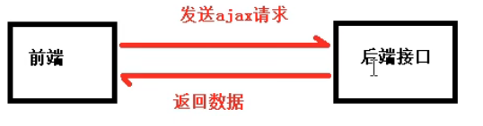

**axios使用**

```html
<script src="vue.min.js"></script>
    <script src="axios.min.js"></script>
```

创建json文件，用于返回数据

```json
{
    "success": true,
    "code": 20000,
    "message": "成功",
    "data": {
        "items":[
            {"name":"lucy","age":10},
            {"name":"mary","age":11},
            {"name":"jack","age":12}
        ]
    }
}
```

发生ajax请求

```html
<div id="app">
        <table border="1"> 
            <tr v-for="user in userList">
                <td v-for="field in user">{{field}}</td>
            </tr>
        </table>
        
    </div>
    <script src="vue.min.js"></script>
    <script src="axios.min.js"></script>
    <script>
        // 创建一个vue对象
        new Vue({
            el: '#app',//绑定vue作用的范围
            data: {//定义页面中显示的模型数据
                userList: []
            },
            created() {
                //调用定义的方法
                this.getList()
            },
            methods: {
                //创建方法 查询所有数据
                getList(id) {
                    axios.get("data.json")
                        .then(response => {
                            // console.log(response)
                            this.userList = response.data.data.items
                        })//请求成功后 执行then方法
                        .catch(error =>{

                        })//请求失败执行clean方法
                }
            }
        })
    </script>
```

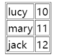

## 4.6 Element-UI

饿了么前端出品的基于Vue.js的后台组件库，发布程序员快速布局和构建

[Element - 网站快速成型工具](https://element.eleme.cn/#/zh-CN)

## 4.7 Node.js

简单的说 Node.js 就是运行在服务端的 JavaScript。
Node.js是一个事件驱动I/O服务端JavaScript环境，基于Google的V8引擎，V8引擎执行Javascript的速度非常快，性能非常好。

是JavaScript的运行环境，

不需要浏览器，直接使用node.js运行JavaScript代码

模拟服务器效果，比如tomcat


## 4.8 npm

NPM全称Node Package Manager，是Node.js包管理工具，是全球最大的模块生态系统，里面所有的模块都是开源免费的；也
是Node.js的包管理工具，相当于前端的Maven。

我们通过npm可以很方便地下载js库，管理前端工程。
Node.js默认安装的npm包和工具的位置：Node.js目录\node_modules
· 在这个目录下你可以看见 npm目录，npm本身就是被NPM包管理器管理的一个工具，说明 Node.js已经集成了npm工具

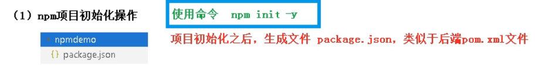

NPM官方的管理的包都是从 http://npmjs.com下载的，这个网站在国内速度很慢。
这里推荐使用淘宝NPM镜像http://npm.taobao.org/，淘宝NPM 镜像是一个完整npmjs.com镜像，同步频率目前为10分钟
次，以保证尽量与官方服务同步。

```bash
$ npm config set registry hhtps://registry.npm.taobao.org
$ npm config list
```

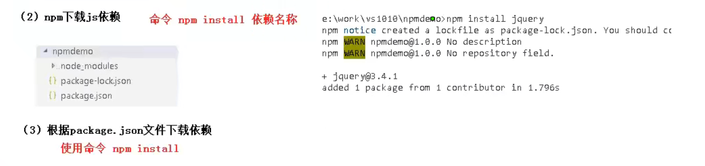

## 4.9 Babel

转码器 把es6转化成es5

**安装**

```bash
npm install --global babel-cli
babel --version
```

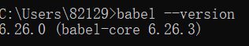

**使用**

编写es6代码

```js
let input = [1,2,3]
input = input.map(item => item + + 1)
console.log(input)
```

创建babel配置文件

```json
{
    "presets": ["es2015"],
    "plugins": []
}
```

安装es2015转码器

```bash
npm install --save-dev babel-preset-es2015
```

使用命令进行转码

```bash
babel es6/01.js -o dist/001.js # 根据文件转码
babel es6 -d es5 # 根据文件夹进行转换
```


## 4.10 模块化

（1）开发后端接口时候，开发controller service mapper，controller注入service，service注入mapper
在后端中，类与类之间的调用成为后端模块化操作
（2）前端模块化，在前端中，js与js之间调用成为前端模块化操作

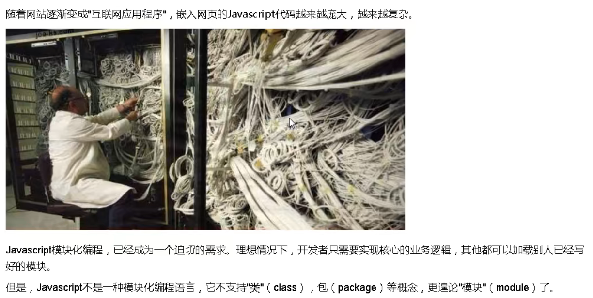

**传统非模块化开发有如下的缺点：** 

命名冲突 
文件依赖 

**模块化规范**：

 CommonJS模块化规范 ES6模块化规范

**CommonJS模块规范**

定义成员

```js
//1 创建js方法
const sum = function(a,b){
    return parseInt(a) + parseInt(b)
}
const subtract = function(a,b){
    return parseInt(a) - parseInt(b)
}
```

导出模块

```js
//2 设置哪些方法可以被其他js调用
module.exports = {
    sum,
    subtract
}
```

导入模块

```js
//调用01.js里面的方法
//1 引入01.js文件
const m = require('./01.js')

//2 调用
console.log(m.sum(1,2))
console.log(m.subtract(10,3))
```

**ES6模块规范**

写法一

导出模块

```js
export function getList() {
 console.log('获取数据列表')
}
```

导入模块

```js
//只取需要的方法即可，多个方法用逗号分隔
import { getList, save } from "./userApi.js"
getList()
save()
```

> 这时的程序无法运行的，因为ES6的模块化无法在Node.js中执行，需要用Babel编辑成ES5后再 执行、

写法二

导出模块

```js
export default {
 getList() {
 console.log('获取数据列表2')
 },
 save() {
 console.log('保存数据2')
 }
```

导入模块

```js
import m from "./userApi2.js" 
m.getList()
m.save()
```


## 4.11 webpack

Webpack 是一个前端资源加载/打包工具。它将根据模块的依赖关系进行静态分析，然后将这些模块按 照指定的规则生成对应的静态资源

Webpack 可以将多种静态资源 js、css、less 转换成一个静态文件，减少了页面的 请求。

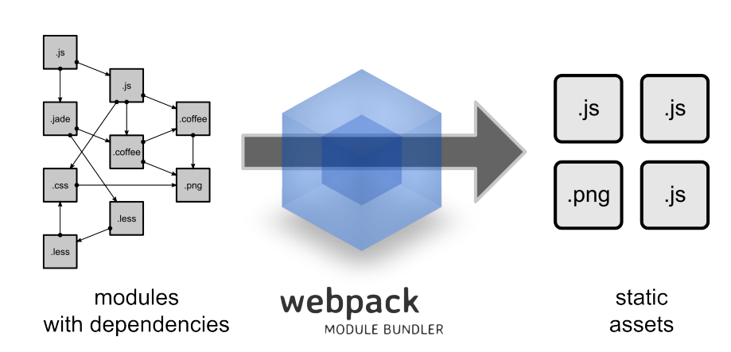

**安装**

```bash
npm install -g webpack webpack-cli
webpack -v
```

**初始化项目**

src下创建common.js 

```js
exports.info = function (str) {
 document.write(str);
}
```

src下创建utils.js 

```js
exports.add = function (a, b) {
 return a + b;
}
```

src下创建main.js

```js
const common = require('./common');
const utils = require('./utils');
common.info('Hello world!' + utils.add(100, 200));
```

**JS打包**

webpack目录下创建配置文件webpack.config.js 

以下配置的意思是：读取当前项目目录下src文件夹中的main.js（入口文件）内容，分析资源依赖，把相 关的js文件打包，打包后的文件放入当前目录的dist文件夹下，打包后的js文件名为bundle.js

```js
const path = require("path"); //Node.js内置模块
module.exports = {
 entry: './src/main.js', //配置入口文件
 output: {
 path: path.resolve(__dirname, './dist'), //输出路径，__dirname：当前文件所在路
径
 filename: 'bundle.js' //输出文件
 }
}
```

命令行执行编译命令

```bash
webpack #有黄色警告
webpack --mode=development #没有警告
#执行后查看bundle.js 里面包含了上面两个js文件的内容并惊醒了代码压缩
```

也可以配置项目的npm运行命令，修改package.json文件

```json
"scripts": {
 //...,
 "dev": "webpack --mode=development"
 }
```

```bash
npm run dev
```

引入html 运行查看


**CSS打包**

安装style-loader和 css-loader

Webpack 本身只能处理 JavaScript 模块，如果要处理其他类型的文件，就需要使用 loader 进行转换。 Loader 可以理解为是模块和资源的转换器。 首先我们需要安装相关Loader插件，css-loader 是将 css 装载到 javascript；style-loader 是让 javascript 认识css

```bash
npm install --save-dev style-loader css-loader
```

修改webpack.config.js

```js
const path = require("path"); //Node.js内置模块
module.exports = {
 //...,
 output:{},
 module: {
 rules: [ 
 { 
 test: /\.css$/, //打包规则应用到以css结尾的文件上
 use: ['style-loader', 'css-loader']
 } 
] 
}
}
```

在src文件夹创建style.cs

```css
body{
 background:pink;
}
```

# 5 讲师管理前端开发

## 5.1 搭建项目前端环境

vue-admin-template

GitHub地址：https://github.com/PanJiaChen/vue-admin-template

你可以在 vue-admin-template 的基础上进行二次开发，把 vue-element-admin当做工具箱，想要什么 功能或者组件就去 vue-element-admin 那里复制过来。

```bash
# 解压压缩包
# 进入目录
cd vue-admin-template-master
# 安装依赖
npm install
# 启动。执行后，浏览器自动弹出并访问http://localhost:9528/
npm run dev
```

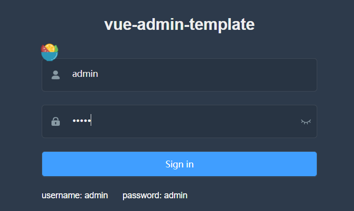

## 5.2 项目的创建和基本配置

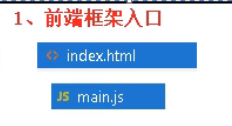

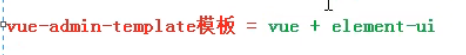

**修改端口号** 

config/index.js中修改

```js
host: 'localhost', // can be overwritten by process.env.HOST
port: 9528, // can be overwritten by process.env.PORT, if port is in use, a free one will be determined
useEslint: false, //eslint检查
```

**修改项目信息** 

package.json

```json
{
"name": "guli-admin",
......
"description": "谷粒学院后台管理系统",
"author": "Helen <55317332@qq.com>",
......
}
```

**项目目录结构**

```
.
├── build // 构建脚本
├── config // 全局配置
├── node_modules // 项目依赖模块
├── src //项目源代码
├── static // 静态资源
└── package.jspon // 项目信息和依赖配置
```

```
src
├── api // 各种接口
├── assets // 图片等资源
├── components // 各种公共组件，非公共组件在各自view下维护
├── icons //svg icon
├── router // 路由表
├── store // 存储
├── styles // 各种样式
├── utils // 公共工具，非公共工具，在各自view下维护
├── views // 各种layout
├── App.vue //***项目顶层组件***
├── main.js //***项目入口文件***
└── permission.js //认证入口
```

**登录页修改**

src/views/login/index.vue（登录组件）

**标题** 

index.html（项目的html入口）

**国际化设置** 

打开 src/main.js（项目的js入口），第7行，修改语言为 zh-CN，使用中文语言环境，例如：日期时间组

**icon** 

复制 favicon.ico 到根目录

**导航栏文字**

 src/views/layout/components（当前项目的布局组件） src/views/layout/components/Navbar.vue

## 5.3 系统登录功能改造本地

https://localhost:8001/vue-admin/user/login

**修改配置的请求地址**

config/dev_env.js

```
 BASE_API: '"http://localhost:8001"'
```

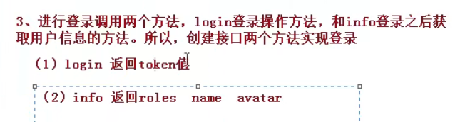

**开发登录接口**


```java
@RestController
@RequestMapping("/edu/user/")
public class EduLoginController {
    //login
    @PostMapping("/login")
    public R login() {
        return R.ok().data("token","admin");
    }

    //info
    @GMapping("/info")
    public R info() {
        return R.ok().data("roles","[admin]").data("name","admin").data("avatar","https://tse2-mm.cn.bing.net/th/id/OIP-C.x09r5tGxTyGiAchyk-KCjQAAAA?pid=ImgDet&rs=1");
    }
}
```

**跨域问题 **

前后端分离开发最常见问题

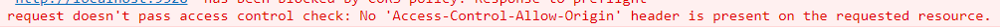

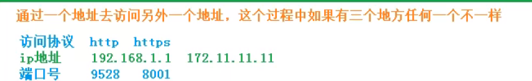


解决：

1. 后端接口添加注解@CrossOrigin//解决跨域
2. 使用网关

## 5.4 前端框架开发过程

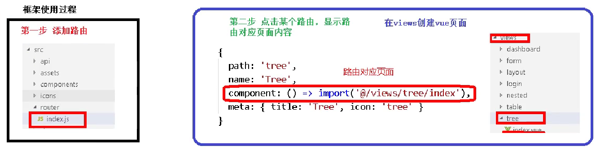

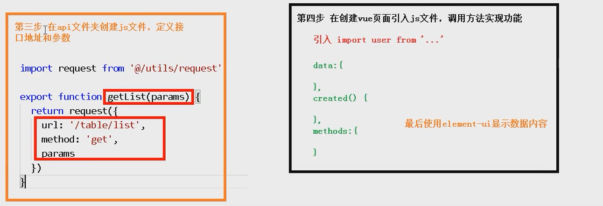

## 5.5 讲师列表

```html
<el-table
      :data="list"
      border
      fit
      highlight-current-row>
      <el-table-column
        label="序号"
        width="70"
        align="center">
        <template slot-scope="scope">
          {{ (page - 1) * limit + scope.$index + 1 }}
        </template>
      </el-table-column>

      <el-table-column prop="name" label="名称" width="80" />

      <el-table-column label="头衔" width="80">
        <template slot-scope="scope">
          {{ scope.row.level===1?'高级讲师':'首席讲师' }}
        </template>
      </el-table-column>

      <el-table-column prop="intro" label="资历" />

      <el-table-column prop="gmtCreate" label="添加时间" width="160"/>

      <el-table-column prop="sort" label="排序" width="60" />

      <el-table-column label="操作" width="200" align="center">
        <template slot-scope="scope">
          <router-link :to="'/teacher/edit/'+scope.row.id">
            <el-button type="primary" size="mini" icon="el-icon-edit">修改</el-button>
          </router-link>
          <el-button type="danger" size="mini" icon="el-icon-delete" @click="removeDataById(scope.row.id)">删除</el-button>
        </template>
      </el-table-column>
    </el-table>
```

## 5.6 分页

```html
<!-- 分页 -->
    <el-pagination
      :current-page="page"
      :page-size="limit"
      :total="total"
      style="padding: 30px 0; text-align: center;"
      layout="total, prev, pager, next, jumper"
      @current-change="getList"
    />
```

## 5.7 条件查询

## 5.8 讲师删除

## 5.9 讲师添加

## 5.9 讲师修改

## 5.10 讲师头像上传

**阿里云对象存储OOS**

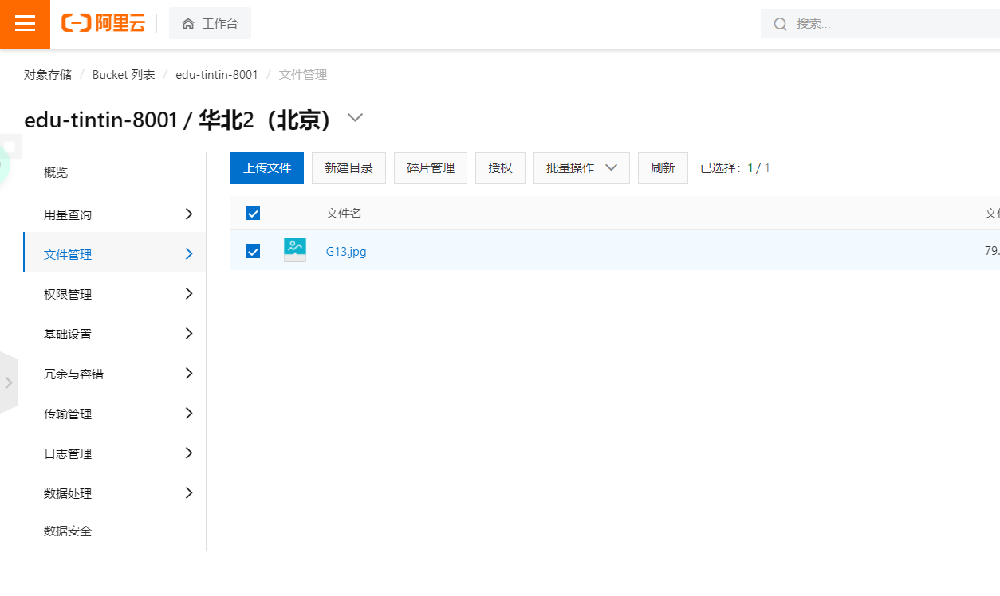

**使用SDK操作阿里云OSS**

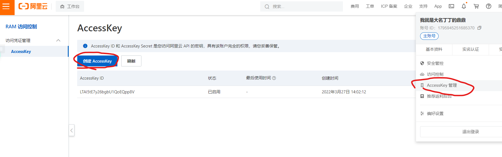

学习文档[OSS阿里云_ OSS是什么意思_对象储存OSS_阿里云OSS学习路径图_OSS Learning Path - 阿里云 (aliyun.com)](https://help.aliyun.com/learn/learningpath/oss.html?spm=5176.8465980.guide.1.76281450f8RIW4)

创建service-oos模块

```xml
<dependencies>
        <!--aliyunOSS-->
        <dependency>
            <groupId>com.aliyun.oss</groupId>
            <artifactId>aliyun-sdk-oss</artifactId>
        </dependency>
        <dependency>
            <groupId>junit</groupId>
            <artifactId>junit</artifactId>
        </dependency>
        <dependency>
            <groupId>joda-time</groupId>
            <artifactId>joda-time</artifactId>
        </dependency>
    </dependencies>
```

```properties
#服务端口
server.port=8002
#服务名
spring.application.name=service-oss
#环境设置：dev、test、prod
spring.profiles.active=dev

#阿里云 OSS
#不同的服务器，地址不同
aliyun.oss.file.endpoint=oss-cn-beijing.aliyuncs.com
aliyun.oss.file.keyid=********
aliyun.oss.file.keysecret=********
#bucket可以在控制台创建，也可以使用java代码创建
aliyun.oss.file.bucketname=edu-tintin-8001


```


```java
@SpringBootApplication(exclude = DataSourceAutoConfiguration.class)//忽略datasource相关配置
public class OssApplication {
    public static void main(String[] args) {
        SpringApplication.run(OssApplication.class, args);
    }
}
```

创建常量类，读取配置内容

```java
@Component
public class ConstantPropertiesUtils implements InitializingBean {
    //读取配置文件内容
    @Value("${aliyun.oss.file.endpoint}") //只能注入非静态属性或方法
    private String endPoint;
    @Value("${aliyun.oss.file.keyid}")
    private String keyId;
    @Value("${aliyun.oss.file.keysecret}")
    private String keySecret;
    @Value("${aliyun.oss.file.bucketname}")
    private String bucketName;

    //定义公开的静态常量
    public static String END_POINT;
    public static String KEY_ID;
    public static String KEY_SECRET;
    public static String BUCKET_NAME;

    @Override
    public void afterPropertiesSet() throws Exception {
        END_POINT = endPoint;
        KEY_ID = keyId;
        KEY_SECRET = keySecret;
        BUCKET_NAME = bucketName;
    }

}
```

上传服务方法

```java

@Service
public class OssServiceImpl implements OssService {

    @Override
    public String uploadFileAvatar(MultipartFile file) {
        //上传文件
        //        以下代码用于通过流式上传的方式将文件上传到OSS。

        // Endpoint以华东1（杭州）为例，其它Region请按实际情况填写。
        String endpoint = ConstantPropertiesUtils.END_POINT;
        // 阿里云账号AccessKey拥有所有API的访问权限，风险很高。强烈建议您创建并使用RAM用户进行API访问或日常运维，请登录RAM控制台创建RAM用户。
        String accessKeyId = ConstantPropertiesUtils.KEY_ID;
        String accessKeySecret = ConstantPropertiesUtils.KEY_SECRET;
        // 填写Bucket名称，例如examplebucket。
        String bucketName = ConstantPropertiesUtils.BUCKET_NAME;
        // 填写Object完整路径，例如exampledir/exampleobject.txt。Object完整路径中不能包含Bucket名称。
//        String objectName = "exampledir/exampleobject.txt";
        //获取文件名称
        String fileName = file.getOriginalFilename();

        // 创建OSSClient实例。
        OSS ossClient = new OSSClientBuilder().build(endpoint, accessKeyId, accessKeySecret);

        try {

            InputStream inputStream = file.getInputStream();
            ossClient.putObject(bucketName, fileName, inputStream);
        } catch (OSSException | ClientException | IOException oe) {
            oe.printStackTrace();
        } finally {
            if (ossClient != null) {
                ossClient.shutdown();
            }
        }
        //把上传文件后的路径返回
        //猜测url规则 手动拼接oss路径
        //https://edu-tintin-8001.oss-cn-beijing.aliyuncs.com/G13.jpg
        String url = "https://" + bucketName + "." + endpoint + "/" + fileName;
        return url;
    }
}


```

```java
@RestController
@RequestMapping("/oss/file")
@CrossOrigin
public class OssController {
    @Autowired
    private OssService ossService;

    //上传头像的方法
    @PostMapping("")
    public R uploadOssFile(MultipartFile file) {
        //获取上传的文件
        //返回上传到OSS的文件路径
        String url = ossService.uploadFileAvatar(file);

        return R.ok().data("url", url);
    }
}
```

解决同名覆盖文件问题

```java
        //获取文件名称
        String fileName = file.getOriginalFilename();
        //文件名称添加随机唯一值
        String uuid = UUID.randomUUID().toString().replaceAll("-","");
        fileName = uuid + fileName;
        //文件按照日期进行分类
        String datePath = new DateTime().toString("yyyy/MM/dd");
        fileName = datePath + "/" +fileName;
```

 **使用nginx配置项目请求转发**

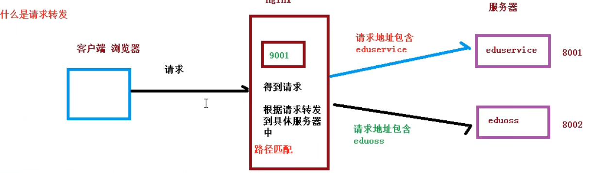

配置转发规则

```conf
    server {
       listen       9001;
       server_name  localhost;

       location ~ /edu/ {
           proxy_pass http://localhost:8001;
       }
        location ~ /oss/ {
           proxy_pass http://localhost:8002;
       }
       
    }
```

前端修改地址

```
  BASE_API: '"http://localhost:9001"'
```

**上传头像前端**

找到组件

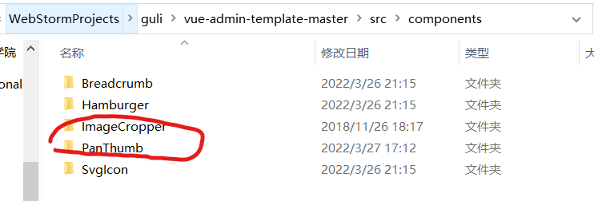

# 6 课程分类管理开发

## 6.1 Excel导入导出

**EasyExcel**

Java领域解析、生成Excel比较有名的框架有Apache poi、jxl等。但他们都存在一个严重的问题就是 非常的耗内存。如果你的系统并发量不大的话可能还行，但是一旦并发上来后一定会OOM或 者JVM频繁的full gc。 

EasyExcel是阿里巴巴开源的一个excel处理框架，以使用简单、节省内存著称。EasyExcel能大大减 少占用内存的主要原因是在解析Excel时没有将文件数据一次性全部加载到内存中，而是从磁盘上一 行行读取数据，逐个解析。 

EasyExcel采用一行一行的解析模式，并将一行的解析结果以观察者的模式通知处理 （AnalysisEventListener）


## 6.2 对Excel写操作

```xml
<dependencies>
    <!--xls-->
        <dependency>
            <groupId>org.apache.poi</groupId>
            <artifactId>poi</artifactId>
        </dependency>

        <dependency>
            <groupId>org.apache.poi</groupId>
            <artifactId>poi-ooxml</artifactId>
        </dependency>
    <!-- https://mvnrepository.com/artifact/com.alibaba/easyexcel -->
    <dependency>
    <groupId>com.alibaba</groupId>
    <artifactId>easyexcel</artifactId>
    <version>2.1.1</version>
    </dependency>
</dependencies>
```

```java
@Data
public class ExcelData {

    //设置excel表头名称
    @ExcelProperty("学生编号")
    private Integer sno;

    @ExcelProperty("学生姓名")
    private String sname;
}
```

```java
public class WriteExcel {
    public static void main(String[] args) {
        //设置写入文件夹地址和文件名称
        String fileName = "D:/桌面/write.xlsx";
        //构建list集合
        List<ExcelData> list = new ArrayList<>();
        for (int i = 0; i < 10; i++) {
            ExcelData excelData = new ExcelData();
            excelData.setSname("name" + i);
            excelData.setSno(i);
            list.add(excelData);
        }
        //调用easyxcel方法实现写操作
        EasyExcel.write(fileName,ExcelData.class).sheet("学生列表").doWrite(list);
    }
}
```

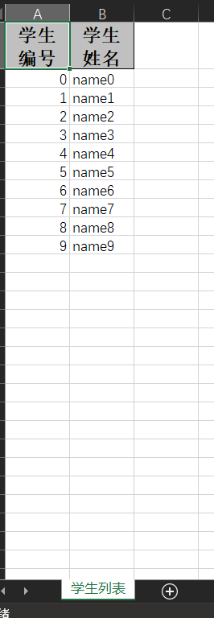

## 6.3 对Excel读操作

```java
/
public class ExcelListener extends AnalysisEventListener<ExcelData> {
    //一行一行读取excel的数据
    @Override
    public void invoke(ExcelData excelData, AnalysisContext analysisContext) {
        System.out.println("*****" + excelData);
    }

    //读取表头内润
    @Override
    public void invokeHeadMap(Map<Integer, String> headMap, AnalysisContext context) {
        System.out.println("表头："+ headMap);
    }
    //读取完成后
    @Override
    public void doAfterAllAnalysed(AnalysisContext analysisContext) {

    }
}

```


```java
public class ReadExcel {
    public static void main(String[] args) {
        //实现excel读操作
        String fileName = "D:/桌面/read.xlsx";

        EasyExcel.read(fileName,ExcelData.class,new ExcelListener()).sheet().doRead();
    }
}
```

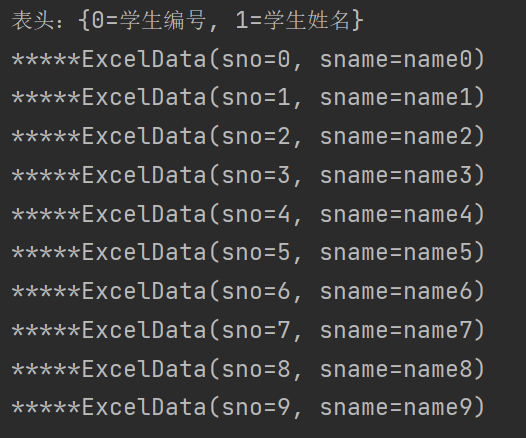

## 6.4 添加课程分类后端实现

```java
@Service
public class SubjectServiceImpl extends ServiceImpl<SubjectMapper, Subject> implements SubjectService {

    @Override
    public void saveSubject(MultipartFile file, SubjectService subjectService) {
        try {
            InputStream inputStream = file.getInputStream();
            EasyExcel.read(inputStream, SubjectData.class,new SubjectExcelListener(subjectService)).sheet().doRead();
        } catch (IOException e) {
            e.printStackTrace();
        }
    }
}
```

```java
public class SubjectExcelListener extends AnalysisEventListener<SubjectData> {
    //由于无法交给spring管理，只能手动管理，数据库操作变复杂 因此通过构造器引入subjectservice
    //spring的注入是在filter和listener之后的，（顺序是这样的listener >> filter >> servlet >> spring ）
    public SubjectService subjectService;

    public SubjectExcelListener() {
    }
    public SubjectExcelListener(SubjectService subjectService) {
        this.subjectService = subjectService;
    }

    @Override
    public void invoke(SubjectData subjectData, AnalysisContext analysisContext) {
        if (subjectData == null) {
            throw new GuliException(20001,"文件数据为空");
        }
        System.out.println(subjectData);
        //判断一级分类是否重复
        Subject existsOneSubject = existsOneSubject(subjectService, subjectData.getT1());
        if (existsOneSubject == null) { //没有相同的一级分类， 进行添加
            existsOneSubject = new Subject();
            existsOneSubject.setParentId("0");
            existsOneSubject.setTitle(subjectData.getT1());
            subjectService.save(existsOneSubject);
        }
        //判断二级分类是否重复
        String parentId = existsOneSubject.getId();
        Subject existsTwoSubject = existsTwoSubject(subjectService, subjectData.getT2(), parentId);
        if (existsTwoSubject == null) {
            existsTwoSubject = new Subject();
            existsTwoSubject.setParentId(parentId);
            existsTwoSubject.setTitle(subjectData.getT2());
            subjectService.save(existsTwoSubject);
        }


    }
```

## 6.5 添加课程分类前端实现

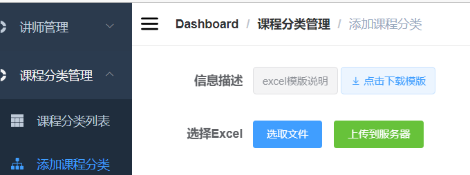

## 6.6 课程分类列表前端实现

## 6.7 课程分类列表后端实现

封装树形数据

```java
@Data
public class SubjectOne {
    private String id;
    private String label;

    //一个一级分类里有多个二级分类
    private List<SubjectTwo> children = new ArrayList<>();
}

@Data
public class SubjectTwo {
    private String id;
    private String label;
}

```

```java
@Override
public List<SubjectOne> getAllOneTwoSubject() {
    ArrayList<SubjectOne> list = new ArrayList<>();
    List<Subject> subjects = list(null);
    for (Subject subject : subjects) {
        //找出一级分类
        if (subject.getParentId().equals("0")) {
            SubjectOne subjectOne = new SubjectOne();
            subjectOne.setId(subject.getId());
            subjectOne.setLabel(subject.getTitle());
            //找出一级分类的所有二级分类
            QueryWrapper<Subject> subjectQueryWrapper = new QueryWrapper<>();
            subjectQueryWrapper.eq("parent_id",subject.getId());
            List<Subject> childrenSubjects = list(subjectQueryWrapper);
            //封装二级分类
            for (Subject childrenSubject : childrenSubjects) {
                SubjectTwo subjectTwo = new SubjectTwo();
                subjectTwo.setId(childrenSubject.getId());
                subjectTwo.setLabel(childrenSubject.getTitle());
                subjectOne.getChildren().add(subjectTwo);//二级分类放入一级分类
            }
            list.add(subjectOne);//将一级分类装入集合
        }
    }
    return list;
}
```

# 7 课程管理开发

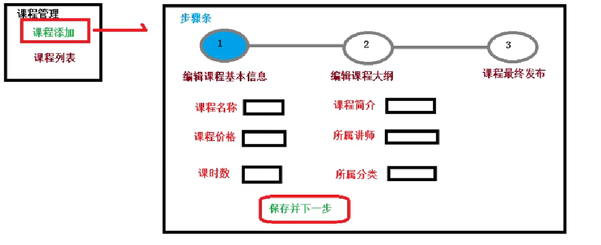

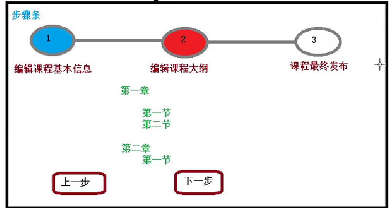

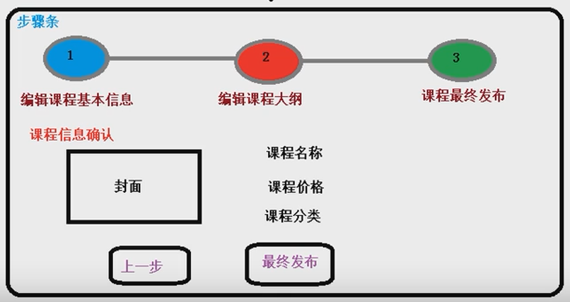

## 7.1 所需数据库表

`edu_course`课程基本信息 

`edu_chapter` 课程章节信息

`edu_video` 课程章节里的小结信息

 ``edu_course_description `课程简介描述信息

`edu_subject`课程分类

``edu_teacher`讲师

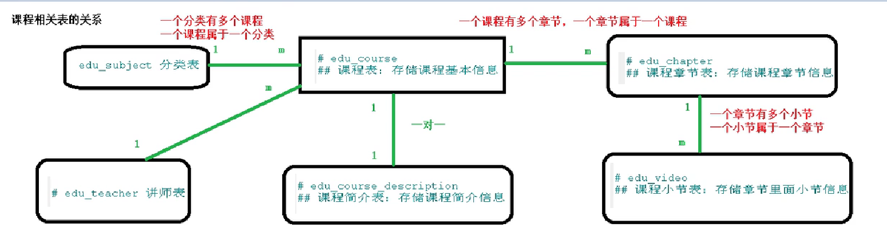

## 7.2 添加课程信息

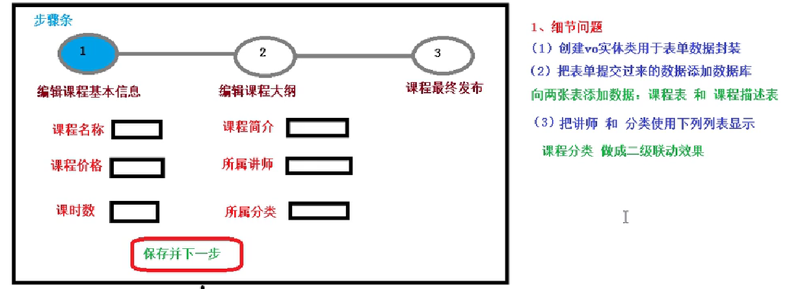

富文本编辑组件

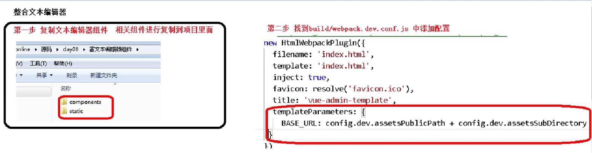

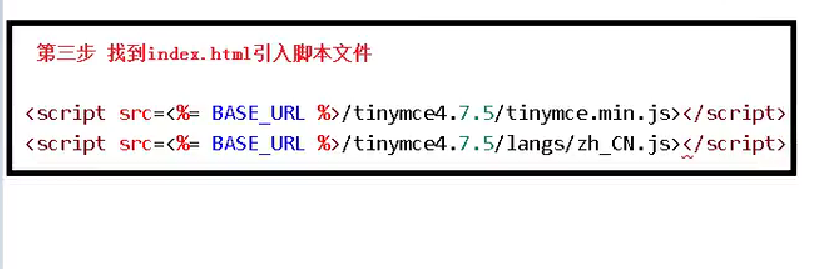

图片以文本形式存储

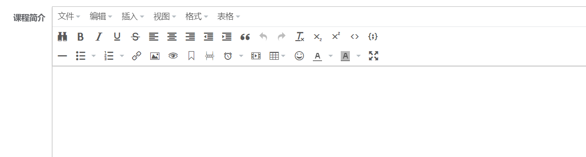

## 7.4 课程大纲

## 7.5 课程信息确认

多表查询 sql语句

```sql
SELECT ec.id, ec.`title`, ec.`price`, ec.`lesson_num`, ec.cover,
	ecd.`description`,
	et.`name` AS teacher_name,
	es1.`title` AS onesubject , 
	es2.`title` AS twosubject
FROM edu_course ec 
LEFT OUTER JOIN edu_course_description ecd ON ec.id = ecd.id
LEFT OUTER JOIN edu_teacher et ON ec.teacher_id = et.id
LEFT OUTER JOIN edu_subject es1 ON ec.`subject_parent_id` = es1.`id`
LEFT OUTER JOIN edu_subject es2 ON ec.`subject_id` = es2.`id`
WHERE ec.id = 1509024257008705538
```


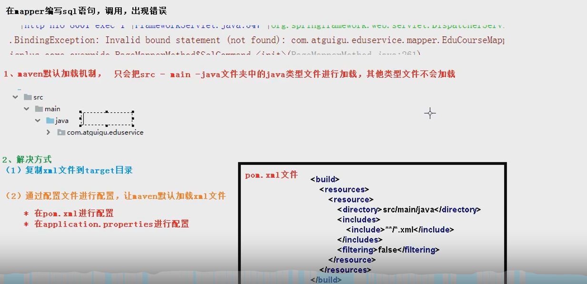


## 7.6 课程列表

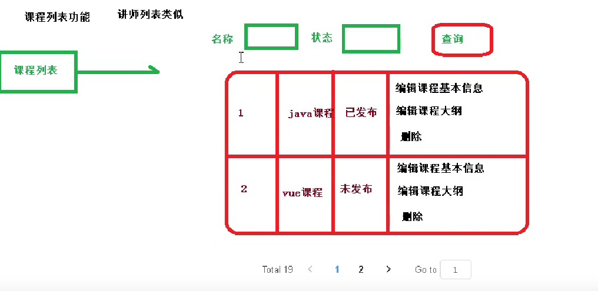

## 7.7 阿里云视频点播

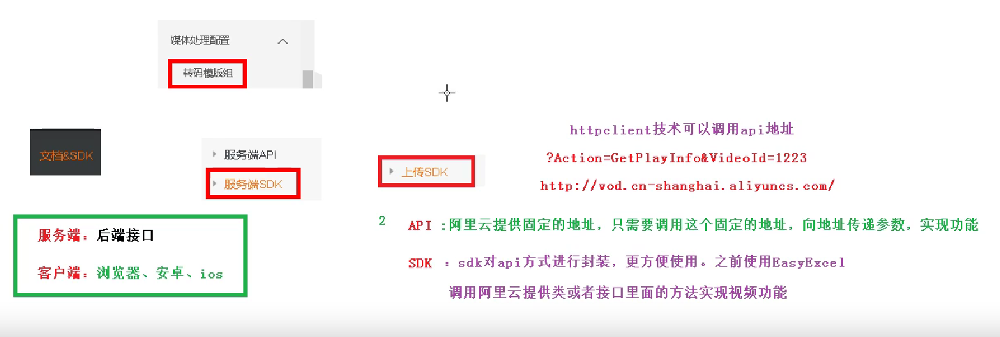

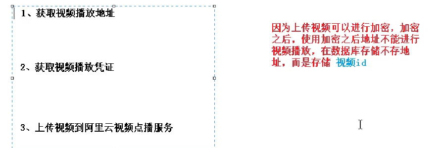

# 8 前台环境搭建

nuxt.js 服务端渲染技术

项目目录结构

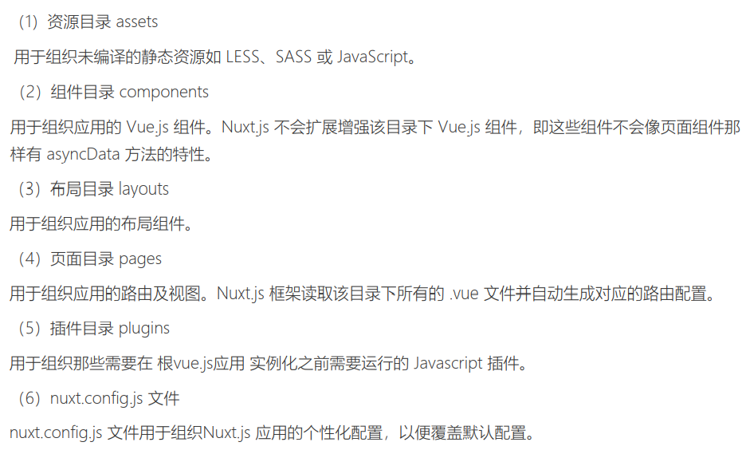

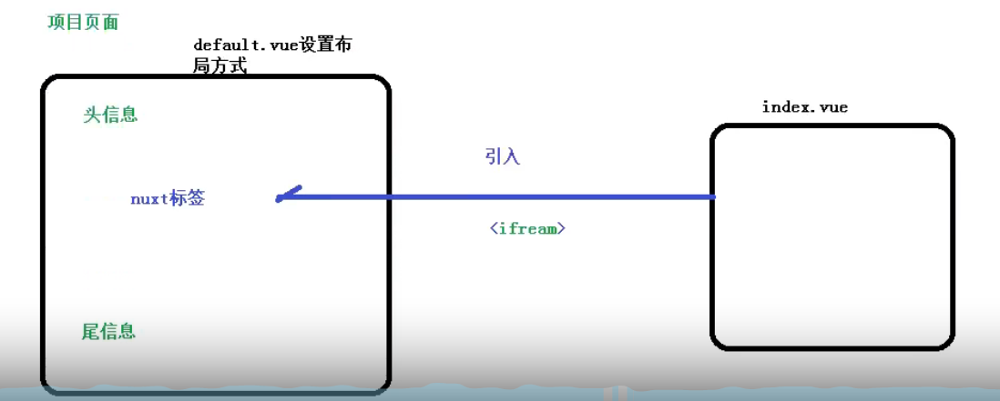


# 9 redis

```java
package com.tintin.servicebase;

import com.fasterxml.jackson.annotation.JsonAutoDetect;
import com.fasterxml.jackson.annotation.PropertyAccessor;
import com.fasterxml.jackson.databind.ObjectMapper;
import org.springframework.cache.CacheManager;
import org.springframework.cache.annotation.CachingConfigurerSupport;
import org.springframework.cache.annotation.EnableCaching;
import org.springframework.context.annotation.Bean;
import org.springframework.context.annotation.Configuration;
import org.springframework.data.redis.cache.RedisCacheConfiguration;
import org.springframework.data.redis.cache.RedisCacheManager;
import org.springframework.data.redis.connection.RedisConnectionFactory;
import org.springframework.data.redis.core.RedisTemplate;
import org.springframework.data.redis.serializer.Jackson2JsonRedisSerializer;
import org.springframework.data.redis.serializer.RedisSerializationContext;
import org.springframework.data.redis.serializer.RedisSerializer;
import org.springframework.data.redis.serializer.StringRedisSerializer;

import java.time.Duration;

@EnableCaching
@Configuration
public class RedisConfig extends CachingConfigurerSupport {
    @Bean
    public RedisTemplate<String, Object> redisTemplate(RedisConnectionFactory factory) {
        RedisTemplate<String, Object> template = new RedisTemplate<>();
        RedisSerializer<String> redisSerializer = new StringRedisSerializer();
        Jackson2JsonRedisSerializer jackson2JsonRedisSerializer = new
                Jackson2JsonRedisSerializer(Object.class);
        ObjectMapper om = new ObjectMapper();
        om.setVisibility(PropertyAccessor.ALL, JsonAutoDetect.Visibility.ANY);
        om.enableDefaultTyping(ObjectMapper.DefaultTyping.NON_FINAL);
        jackson2JsonRedisSerializer.setObjectMapper(om);
        template.setConnectionFactory(factory);
//key序列化方式
        template.setKeySerializer(redisSerializer);
//value序列化
        template.setValueSerializer(jackson2JsonRedisSerializer);
//value hashmap序列化
        template.setHashValueSerializer(jackson2JsonRedisSerializer);
        return template;
    }
    @Bean
    public CacheManager cacheManager(RedisConnectionFactory factory) {
        RedisSerializer<String> redisSerializer = new StringRedisSerializer();
        Jackson2JsonRedisSerializer jackson2JsonRedisSerializer = new
                Jackson2JsonRedisSerializer(Object.class);
//解决查询缓存转换异常的问题
        ObjectMapper om = new ObjectMapper();
        om.setVisibility(PropertyAccessor.ALL, JsonAutoDetect.Visibility.ANY);
        om.enableDefaultTyping(ObjectMapper.DefaultTyping.NON_FINAL);
        jackson2JsonRedisSerializer.setObjectMapper(om);
// 配置序列化（解决乱码的问题）,过期时间600秒
        RedisCacheConfiguration config =
                RedisCacheConfiguration.defaultCacheConfig()
                        .entryTtl(Duration.ofSeconds(600))
                        .serializeKeysWith(RedisSerializationContext.SerializationPair.fromSerializer(redisSerializer))
                        .serializeValuesWith(RedisSerializationContext.SerializationPair.fromSerializer(jackson2JsonRedisSerializer))
                        .disableCachingNullValues();
        RedisCacheManager cacheManager = RedisCacheManager.builder(factory)
                .cacheDefaults(config)
                .build();
        return cacheManager;
    }
}
```

 Spring Boot缓存注解 

@Cacheabl

根据方法对其返回结果进行缓存，下次请求时，如果缓存存在，则直接读取缓存数据返回；如果缓存不 存在，则执行方法，并把返回的结果存入缓存中。一般用在查询方法上

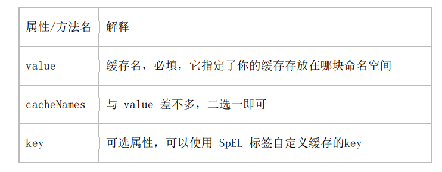

@CachePut 

使用该注解标志的方法，每次都会执行，并将结果存入指定的缓存中。其他方法可以直接从响应的缓存 中读取缓存数据，而不需要再去查询数据库。一般用在新增方法上。

@CacheEvict 

使用该注解标志的方法，会清空指定的缓存。一般用在更新或者删除方法上

```java
@Cacheable(value = "banner", key = "'getAllBanner'")
```


```yml
 # redis配置
  redis:
    host: 192.168.10.102
    port: 6379
    database: 0
    timeout: 1800000
    lettuce:
      pool:
        max-active: 20
        max-wait: -1
        #最大阻塞等待时间
        max-idle: 5
        min-idle: 0
```

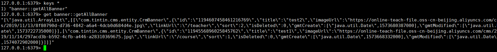

# 10 用户登录

## 10.1 登录模式

**单一服务器模式**

session对象实现，登陆成功，用户数据放到session，判断是否登录，从session获取数据进行登录

**single sign on 模式**

分布式， 单点登录，多点访问

* sesion广播机制实现 session复制

* cookie + redis实现

  

* 使用token实现

  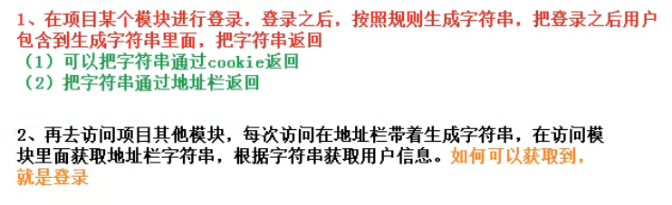

  

## 10.2 JWT工具

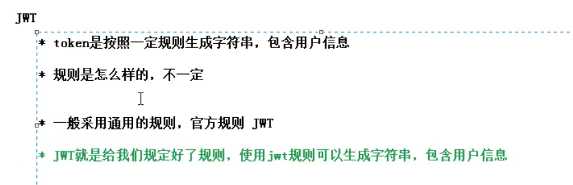

```xml
<dependencies>
    <!-- JWT-->
    <dependency>
        <groupId>io.jsonwebtoken</groupId>
        <artifactId>jjwt</artifactId>
    </dependency>
</dependencies>
```

```java
public class JwtUtils {
    // token过期时间
    public static final long EXPIRE = 1000 * 60 * 60 * 24;
    // token密钥 存在于服务器
    public static final String APP_SECRET = "ukc8BDbRigUDaY6pZFfWus2jZWLPHO";

    // token 生成方法 可存放账户id和用户名等非保密信息
    public static String getJwtToken(String id, String nickname){
        String JwtToken = Jwts.builder()
                //JWT头
                .setHeaderParam("typ", "JWT")
                .setHeaderParam("alg", "HS256")
                // 有效载荷
                .setSubject("guli-user")
                .setIssuedAt(new Date())
                .setExpiration(new Date(System.currentTimeMillis() + EXPIRE))
                //自定义私有字段
                .claim("id", id)
                .claim("nickname", nickname)
                // 签名哈希
                .signWith(SignatureAlgorithm.HS256, APP_SECRET)
                .compact();
        return JwtToken;
    }

    /**
     * 判断token是否存在与有效  token放于http url中
     * @param jwtToken
     * @return
     */
    public static boolean checkToken(String jwtToken) {
        if (StringUtils.isEmpty(jwtToken)) return false;
        try {
            Jwts.parser().setSigningKey(APP_SECRET).parseClaimsJws(jwtToken);
        } catch (Exception e) {
            e.printStackTrace();
            return false;
        }
        return true;
    }

    /**
     * 判断token是否存在与有效   token放于请求头中
     * @param request
     * @return
     */
    public static boolean checkToken(HttpServletRequest request) {
        try {
            String jwtToken = request.getHeader("token");
            if(StringUtils.isEmpty(jwtToken)) return false;
            Jwts.parser().setSigningKey(APP_SECRET).parseClaimsJws(jwtToken);
        } catch (Exception e) {
            e.printStackTrace();
            return false;
        }
        return true;
    }

    /**
     * 根据token获取会员id
     * @param request
     * @return
     */
    public static String getMemberIdByJwtToken(HttpServletRequest request) {
        String jwtToken = request.getHeader("token");
        if(StringUtils.isEmpty(jwtToken)) return "";
        Jws<Claims> claimsJws =
                Jwts.parser().setSigningKey(APP_SECRET).parseClaimsJws(jwtToken);
        Claims claims = claimsJws.getBody();
        return (String)claims.get("id");
    }
}

```


## 10.3 阿里云短信服务 

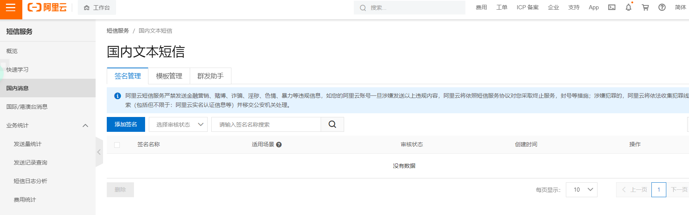

或在阿里云市场购买其他公司的接口

## 10.4 短信微服务

service-msm

```java
@Autowired
private MsmService msmService;

@Autowired
private RedisTemplate redisTemplate;
// 发送短信
@ApiOperation("发送验证码短信")
@GetMapping("send/{phone}")
public R sendMsm(@PathVariable("phone") String phone) {
    //取验证码 如果取到直接返回
    String code = (String) redisTemplate.opsForValue().get(phone);
    if (!StringUtils.isEmpty(code)) {
        return R.ok();
    }
    //取不到 阿里云发送
    // 生成4位随机数
    code = RandomUtil.getFourBitRandom();
    // 定义验证码过时时间
    int expireAt = 3;
    Map<String,Object> params = new HashMap<>();
    params.put("code", code);
    params.put("expire_at", expireAt);
    boolean isSend = msmService.sendCode2(params,phone);
    if (isSend) {
        // 发送成功 则把发送成功的验证码放到redis中
        // 设置有效时间
        redisTemplate.opsForValue().set(phone,code,expireAt, TimeUnit.MINUTES);
        return R.ok();
    } else {
        R.error().message("验证码短信发送失败");
    }
    return R.ok();
}
```

阿里云市场购买api

```java
 @Override
    public boolean sendCode(Map<String, Object> params, String phone) {
        String host = "https://dfsns.market.alicloudapi.com";
        String path = "/data/send_sms";
        String method = "POST";
        String appcode = "979650d3e44a4ad2a2ebb772ba2ba175";
        Map<String, String> headers = new HashMap<String, String>();
        //最后在header中的格式(中间是英文空格)为Authorization:APPCODE 83359fd73fe94948385f570e3c139105
        headers.put("Authorization", "APPCODE " + appcode);
        //根据API的要求，定义相对应的Content-Type
        headers.put("Content-Type", "application/x-www-form-urlencoded; charset=UTF-8");
        Map<String, String> querys = new HashMap<String, String>();
        Map<String, String> bodys = new HashMap<String, String>();
//        String content = "code:" + params.get("code") + ",expire_at:" + params.get("expire_at");
        String content2 = JSONObject.toJSONString(params);
        bodys.put("content", content2);
        bodys.put("phone_number", phone);
        bodys.put("template_id", "TPL_0001");


        try {
            /**
             * 重要提示如下:
             * HttpUtils请从
             * https://github.com/aliyun/api-gateway-demo-sign-java/blob/master/src/main/java/com/aliyun/api/gateway/demo/util/HttpUtils.java
             * 下载
             *
             * 相应的依赖请参照
             * https://github.com/aliyun/api-gateway-demo-sign-java/blob/master/pom.xml
             */
            HttpResponse response = HttpUtils.doPost(host, path, method, headers, querys, bodys);
            System.out.println(response.toString());
            //获取response的body
            //System.out.println(EntityUtils.toString(response.getEntity()));
            System.out.println(response.getStatusLine());
        } catch (Exception e) {
            e.printStackTrace();
        }
        return true;
    }

    @Override
    public boolean sendCode2(Map<String, Object> params, String email) {
        SimpleMailMessage message = new SimpleMailMessage();
        // 发件人
        message.setFrom("821294434@qq.com");
        // 收件人
        message.setTo("tintinliuye@mail2.gdut.edu.cn");
        // 邮件标题
        message.setSubject("注册验证码");
        // 邮件内容
        message.setText("【谷粒学院】您的验证码是" + params.get("code") + ",有效期" +params.get("expire_at") + "分钟");
        // 抄送人
        message.setCc("821294434@qq.com");
        mailSender.send(message);
        return true;
    }
```

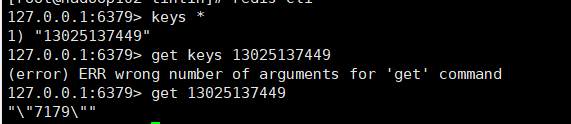

## 10.5 登录微服务

service-ucenter

## 10.6 注册前端

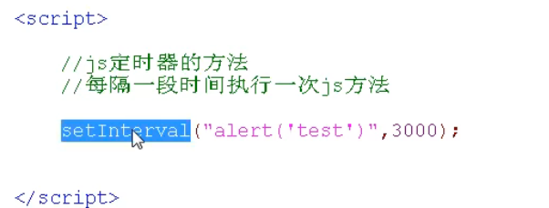

## 10.7 第三方登录 （微信）

### 10.7.1 OAuth

**OAuth2解决什么问题**

例：照片拥有者想要在云冲印服务上打印照片，云冲印服务需要访问云存储服务上的资源

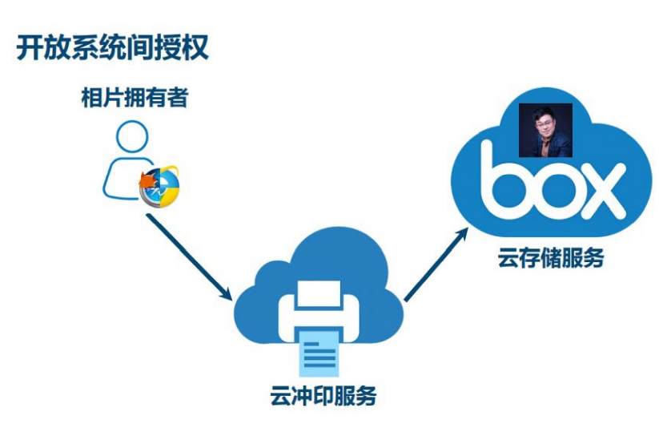

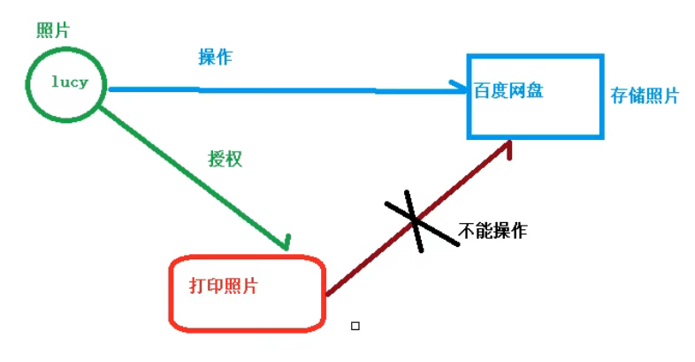

**授权方式**

方式一：用户名密码复制

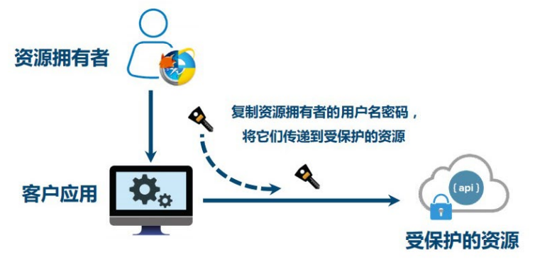

方式二：通用开发者key

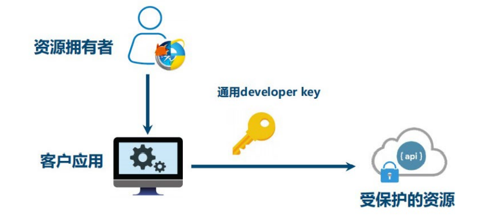

方式三：办法令牌

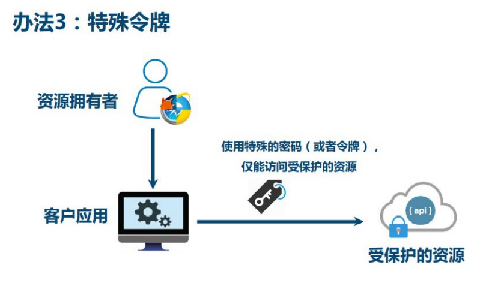

  接近OAuth2方式，需要考虑如何管理令牌、颁发令牌、吊销令牌，需要统一的协议，因此就有 了OAuth2协议

### 10.7.2 微信登录

[微信开放文档 (qq.com)](https://developers.weixin.qq.com/doc/oplatform/Mobile_App/WeChat_Login/Development_Guide.html)

```java
 @ApiOperation("生成微信二维码")
    @GetMapping("/login")
    public String getWxQrCode() {
        // 微信开放平台授权baseUrl %s相当于占位符
        String baseUrl = "https://open.weixin.qq.com/connect/qrconnect" +
                "?appid=%s" +
                "&redirect_uri=%s" +
                "&response_type=code" +
                "&scope=snsapi_login" +
                "&state=%s" +
                "#wechat_redirect";
        //对redirectUrl 进行URLEncoder编码处理
        String redirectUrl = ConstantUtils.REDIRECT_URL;
        try {
            URLEncoder.encode(redirectUrl,"utf-8");
        } catch (UnsupportedEncodingException e) {
            e.printStackTrace();
        }
        // 拼接url
        String qrCodeUrl = String.format(baseUrl, ConstantUtils.APP_ID, redirectUrl, "tintin");

        // 重定向到请求的微信地址
        return "redirect:"+ qrCodeUrl;
    }
```

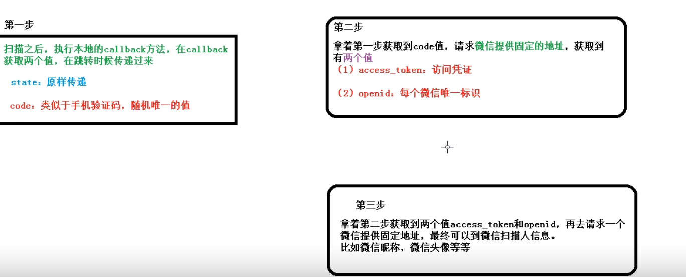

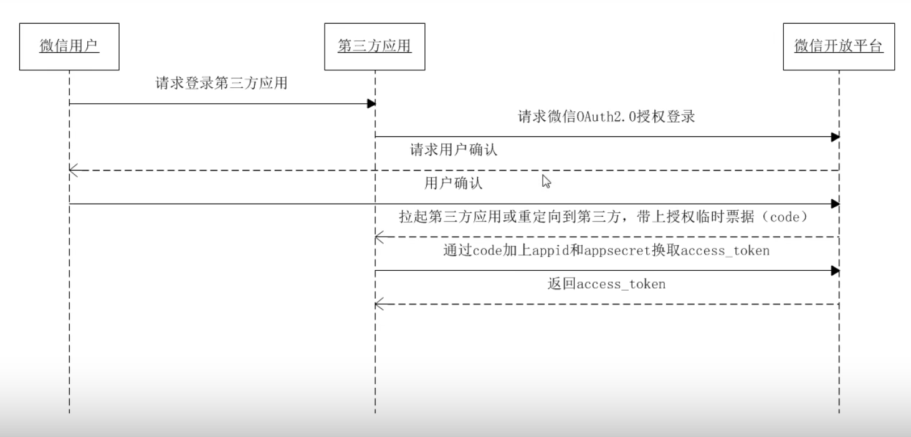

# 11 视频点播

```html
<!DOCTYPE html>
<html lang="en">
<head>
  <meta charset="UTF-8">
  <title>Title</title>
  <link rel="stylesheet"
        href="https://g.alicdn.com/de/prismplayer/2.8.1/skins/default/aliplayer-min.css" />
  <script charset="utf-8" type="text/javascript"
          src="https://g.alicdn.com/de/prismplayer/2.8.1/aliplayer-min.js"></script>
</head>
<body>
<div class="prism-player" id="J_prismPlayer"></div>
<script>
  var player = new Aliplayer({
    id: 'J_prismPlayer',
    width: '100%',
    autoplay: false,
    cover: 'http://liveroom-img.oss-cn-qingdao.aliyuncs.com/logo.png',
    // // 播放方式一：支持播放地址播放,此播放优先级最高，此种方式不能播放加密视频
    // source: 'https://outin-0533f2deb02d11ec8bae00163e1c7426.oss-cn-shanghai.aliyuncs.com/sv/aca043d-17fe05c56df/aca043d-17fe05c56df.mp4?Expires=1649257137&OSSAccessKeyId=LTAI8bKSZ6dKjf44&Signature=%2BHcWlyRUENJJGrkpiWuDH9qk%2Fik%3D'
    // 播放方式二：视频凭证
    encryptType:'1',//如果播放加密视频，则需设置encryptType=1，非加密视频无需设置此项
    vid : '视频id',
    playauth : '视频授权码',
  },function(player){
    console.log('播放器创建好了。')
  });
</script>
</body>
</html>

```

# 12 评论功能

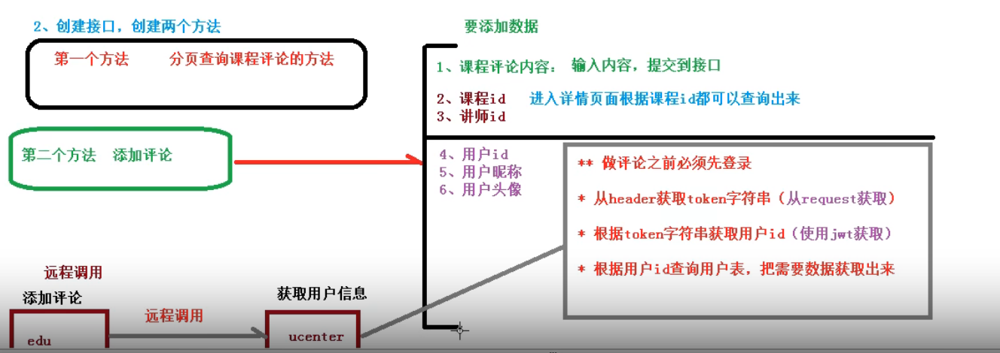

# 13 支付功能

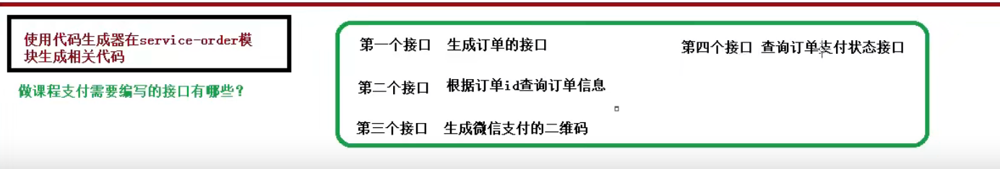

## 13.1 微信支付

点击立即购买  跳转订单页面 生成订单接口 返回订单信息

点击立即支付 跳转二维码页面 生成二维码接口 返回二维码信息

二维码页面每三秒查询支付状态  mounted{} 计时器方法  查询支付状态接口 若支付了则添加支付记录且修改订单为已完成


支付成功 回到课程详情页面

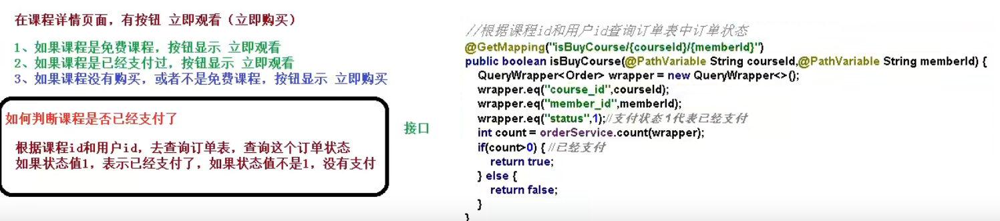

# 14 系统后台-统计分析

## 14.1 生成统计数据

注册人数

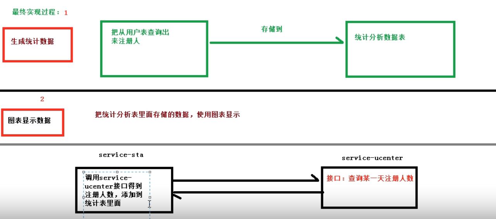

**定时任务**

```java
@EnableScheduling
public class StatisticsApplication {
```

```java
@Component
public class ScheduledTask {
    @Autowired
    StatisticsDailyService statisticsDailyService;
    // 每隔五秒钟执行一次任务
//    @Scheduled(cron = "0/5 * * * * ?")
//    public void task() {
//        System.out.println("每隔五秒 定时任务执行了");
//    }

    // 每天7点执行
    @Scheduled( cron = "0 0 7 * * ? ")
    public void task() {
        String date = DateUtil.formatDate(DateUtil.addDays(new Date(), -1));
        statisticsDailyService.createStatisticsByDay(date);
    }

}
```

## 14.2 图表显示统计数据

**Echarts**

[Apache ECharts](https://echarts.apache.org/zh/index.html)

## 14.3 数据同步工具Canal

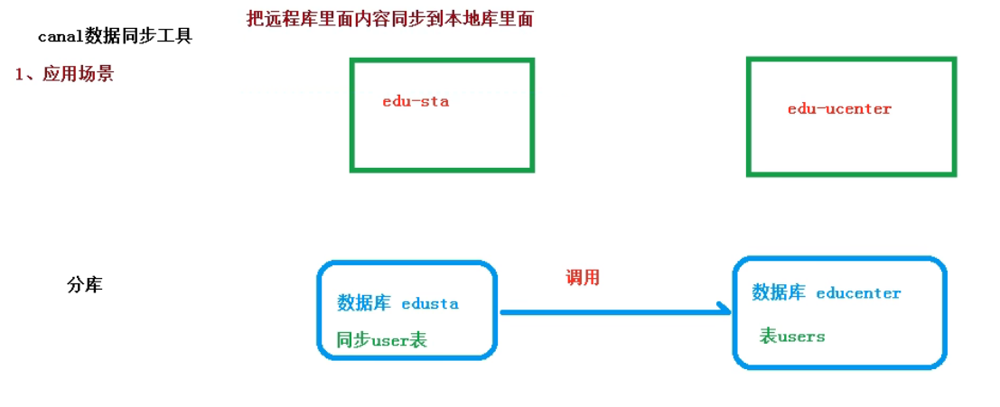

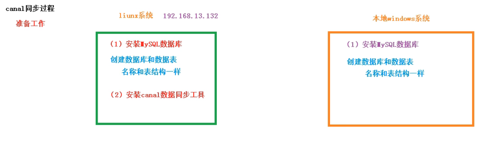

（1）检查binlog功能是否有开启 （2）如果显示状态为OFF表示该功能未开启，开启binlog功能

```
 mysql> show variables like 'log_bin';
 //如果显示状态为ON表示该功能已开启
```

（2）如果显示状态为OFF表示该功能未开启，开启binlog功能

```
1，修改 mysql 的配置文件 my.cnf
vi /etc/my.cnf
追加内容：
log-bin=mysql-bin #binlog文件名
binlog_format=ROW #选择row模式
server_id=1 #mysql实例id,不能和canal的slaveId重复
2，重启 mysql：
service mysql restart 
```

（3）在mysql里面添加以下的相关用户和权限

```
CREATE USER 'canal'@'%' IDENTIFIED BY 'canal';
GRANT SHOW VIEW, SELECT, REPLICATION SLAVE, REPLICATION CLIENT ON *.* TO
'canal'@'%';
FLUSH PRIVILEGES;
```

**下载安装Canal服务**

(1 )下载地址： https://github.com/alibaba/canal/releases （1）下载之后，放到目录中，解压文件 cd /usr/local/canal canal.deployer-1.1.4.tar.gz tar zxvf canal.deployer-1.1.4.tar.gz

（2）修改配置文件 vi conf/example/instance.properties

```
#需要改成自己的数据库信息
canal.instance.master.address=192.168.44.132:3306
#需要改成自己的数据库用户名与密码
#需要改成自己的数据库信息
canal.instance.master.address=192.168.44.132:3306
#需要改成自己的数据库用户名与密码
```

（3）进入bin目录下启动 sh bin/startup.sh

# 15 SpringCloud-Gateway

**API 网关**出现的原因是微服务架构的出现，不同的微服务一般会有不同的网络地址，而外部客户端可能 需要调用多个服务的接口才能完成一个业务需求，如果让客户端直接与各个微服务通信，会有以下的问 题： （1）客户端会多次请求不同的微服务，增加了客户端的复杂性。 （2）存在跨域请求，在一定场景下处理相对复杂。 （3）认证复杂，每个服务都需要独立认证。 （4）难以重构，随着项目的迭代，可能需要重新划分微服务。例如，可能将多个服务合并成一个或者将 一个服务拆分成多个。如果客户端直接与微服务通信，那么重构将会很难实施。 （5）某些微服务可能使用了防火墙 / 浏览器不友好的协议，直接访问会有一定的困难。 以上这些问题可以借助 API 网关解决。API 网关是介于客户端和服务器端之间的中间层，所有的外部请 求都会先经过 API 网关这一层。也就是说，API 的实现方面更多的考虑业务逻辑，而安全、性能、监控 可以交由 API 网关来做，这样既提高业务灵活性又不缺安全性

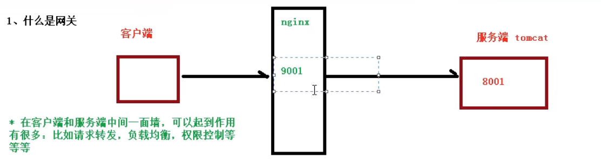

**Spring Cloud Gateway**

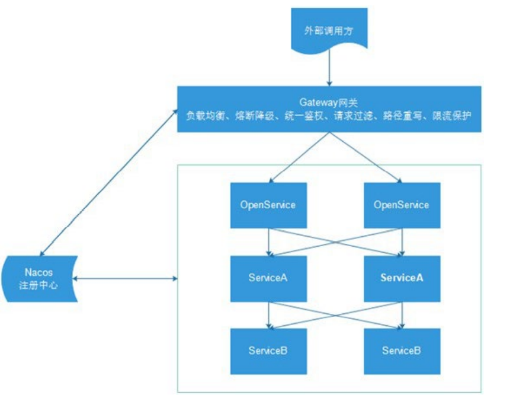

（1）路由。路由是网关最基础的部分，路由信息有一个ID、一个目的URL、一组断言和一组Filter组 成。如果断言路由为真，则说明请求的URL和配置匹配 

（2）断言。Java8中的断言函数。Spring Cloud Gateway中的断言函数输入类型是Spring5.0框架中 的ServerWebExchange。Spring Cloud Gateway中的断言函数允许开发者去定义匹配来自于http request中的任何信息，比如请求头和参数等。

（3）过滤器。一个标准的Spring webFilter。Spring cloud gateway中的filter分为两种类型 的Filter，分别是Gateway Filter和Global Filter。过滤器Filter将会对请求和响应进行修改处理

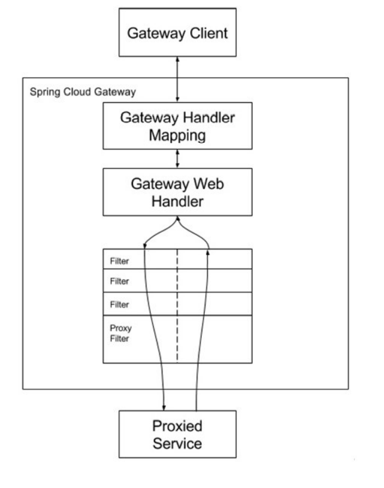

```yaml
server:
  port: 8222

spring:
  application:
    name: service-gateway
  cloud:
    #服务注册
    nacos:
      discovery:
        server-addr: localhost:8848
    # 网关 使用服务发现路由 整合nacos
    gateway:
      discovery:
        locator:
          enabled: true
      routes[0]:
        id: service-acl # 路由id
        uri: lb:service-acl # 路由uri nacos注册的名称 使用负载均衡
        predicates: Path=/*/acl/** # 断言 类似nginx的路由配置
      routes[1]:
        id: service-edu
        uri: lb:service-edu
        predicates: Path=/edu/**
      routes[2]:
        id: service-msm
        uri: lb:service-msm
        predicates: Path=/msm/**
```

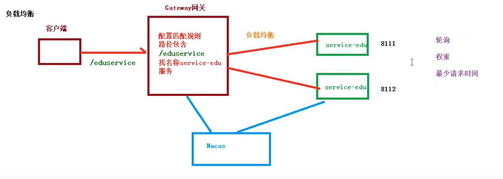

**跨域问题解决**

```java
@Configuration
public class CorsConfig {
    @Bean
    public CorsWebFilter corsFilter() {
        CorsConfiguration config = new CorsConfiguration();
        config.addAllowedMethod("*");
        config.addAllowedOrigin("*");
        config.addAllowedHeader("*");

        UrlBasedCorsConfigurationSource source = new UrlBasedCorsConfigurationSource(new PathPatternParser());
        source.registerCorsConfiguration("/**", config);

        return new CorsWebFilter(source);
    }
}
```

# 16 权限管理

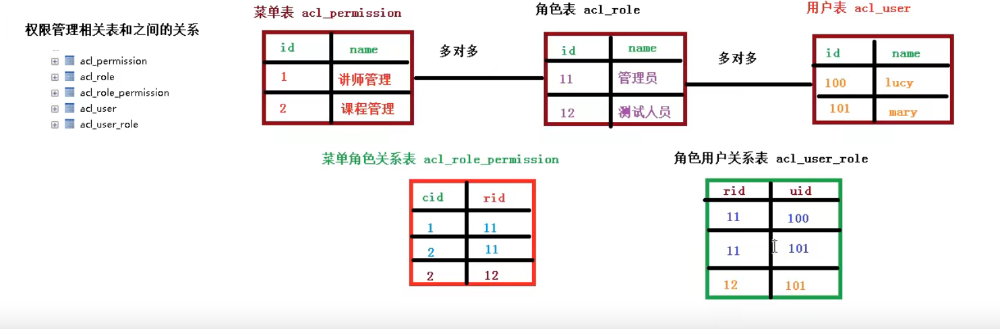

 ## 16.1 菜单管理

**菜单列表**

递归实现

```
// permissionNode 菜单 首次传入一级菜单
// permissionList 所有菜单的集合 未树形化
selectChildren(permissionNode,permissionList)
// 为传入的菜单递归封装子菜单 
```

**菜单添加修改**

**菜单删除**

```
// id 根据该id查询该id菜单所有子菜单的id  首次传入想删除的菜单id
// idList 准备删除的菜单的id集合
selectPermissionChildById(String id, List<String> idList)
//  根据id递归查询准备菜单其下子菜单的id集合
```

## 16.2 角色管理

 添加 修改 删除 查询

为角色分配菜单


## 16.3 用户管理

列表 添加 修改 删除 查询

为用户分配角色


## 16.4 SpringSecurity

Spring 是一个非常流行和成功的 Java 应用开发框架。

**Spring Security** 基于 Spring 框架，提供了一套 Web 应用安全性的完整解决方案。一般来说，Web 应用的安全性包括用户认证（Authentication）和用 户授权（Authorization）两个部分。 

1. 用户认证指的是：验证某个用户是否为系统中的合法主体，也就是说用户能否访问该系统。用户认 证一般要求用户提供用户名和密码。系统通过校验用户名和密码来完成认证过程。 

2. 用户授权指的是验证某个用户是否有权限执行某个操作。在一个系统中，不同用户所具有的权限是 不同的。比如对一个文件来说，有的用户只能进行读取，而有的用户可以进行修改。一般来说，系统会 为不同的用户分配不同的角色，而每个角色则对应一系列的权限。

 **Spring Security其实就是用filter，多请求的路径进行过滤。** 

1. 如果是基于Session，那么Spring-security会对cookie里的sessionid进行解析，找到服务器存储 的sesion信息，然后判断当前用户是否符合请求的要求。 

2. 如果是token，则是解析出token，然后将当前请求加入到Spring-security管理的权限信息中去

**认证和授权的思路**

如果系统的模块众多，每个模块都需要就行授权与认证，所以我们选择基于token的形式进行授权与认 证，用户根据用户名密码认证成功，然后获取当前用户角色的一系列权限值，并以用户名为key，权限列 表为value的形式存入redis缓存中，根据用户名相关信息生成token返回，浏览器将token记录到cookie中， 每次调用api接口都默认将token携带到header请求头中，Spring-security解析header头获取token信息，解析token获取当前用户名，根据用户名就可以从redis中获取权限列表，这样Spring-security就能够判断当前 请求是否有权限访问

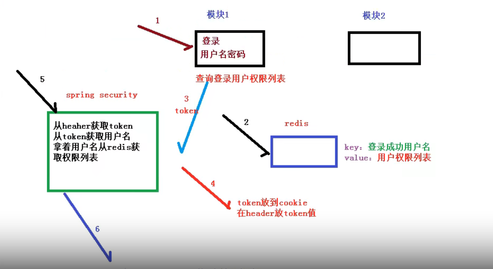

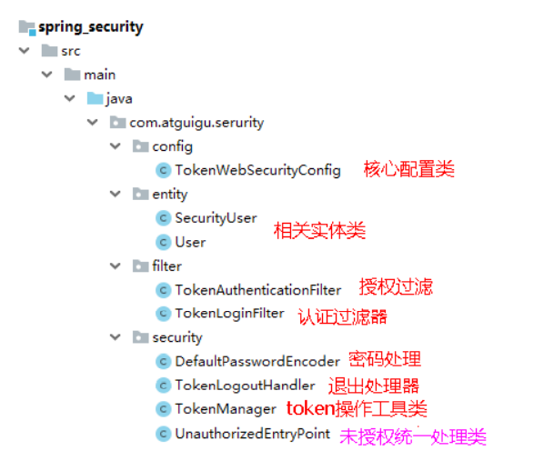


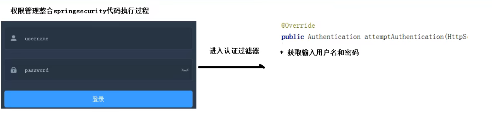

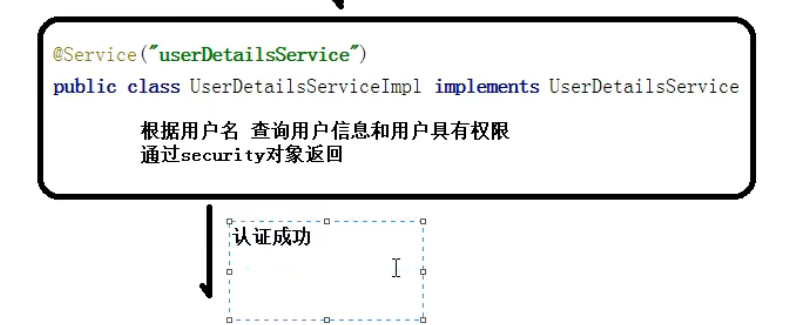

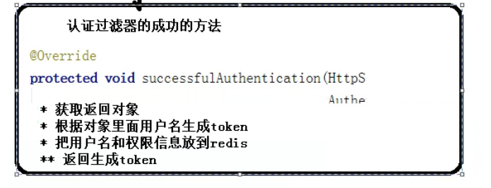

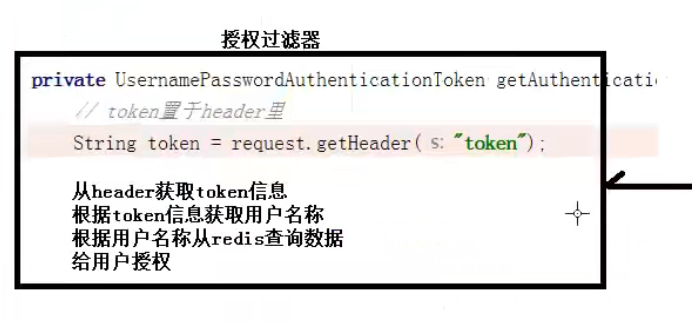

# 17 配置中心

在系统开发过程中，开发者通常会将一些需要变更的参数、变量等从代码中分离出来独立管理，以独立 的配置文件的形式存在。目的是让静态的系统工件或者交付物（如 WAR，JAR 包等）更好地和实际的物 理运行环境进行适配。

配置管理一般包含在系统部署的过程中，由系统管理员或者运维人员完成。配置 变更是调整系统运行时的行为的有效手段。

 如果微服务架构中没有使用统一配置中心时，所存在的问题： - 配置文件分散在各个项目里，不方便维护 - 配置内容安全与权限 - 更新配置后，项目需要重启 nacos配置中心：系统配置的集中管理（编辑、存储、分发）、动态更新不重启、回滚配置（变更管理、 历史版本管理、变更审计）等所有与配置相关的活动。

Nacos 可以与 Spring, Spring Boot, Spring Cloud 集成，并能代替 Spring Cloud Eureka, Spring Cloud Config。通过 Nacos Server 和 spring-cloud-starter-alibaba-nacos-config 实现配置的动态 变更。


**Data ID** 的完整规则格式如下 ${prefix}-${spring.profile.active}.${file-extension}

* prefix 默认为所属工程配置spring.application.name 的值（即：nacos-provider），也可以通过配 置项 spring.cloud.nacos.config.prefix来配置。

- spring.profiles.active=dev 即为当前环境对应的 profile。 注意：当 spring.profiles.active 为空时，对应的连接符 - 也将不存在，dataId 的拼接格式变成 ${prefix}.${file-extension} 
- file-exetension 为配置内容的数据格式，可以通过配置项 spring.cloud.nacos.config.fileextension 来配置。目前只支持 properties 和 yaml 类型。


**springboot配置文件加载顺序** 

其实yml和properties文件是一样的原理，且一个项目上要么yml或者properties，二选一的存在。推荐 使用yml，更简洁。

bootstrap与application

 （1）加载顺序 这里主要是说明application和bootstrap的加载顺序。 bootstrap.yml（bootstrap.properties）先加载 application.yml（application.properties）后加载 bootstrap.yml 用于应用程序上下文的引导阶段。 bootstrap.yml 由父Spring ApplicationContext加载。 父ApplicationContext 被加载到使用 application.yml 的之前。 

（2）配置区别 bootstrap.yml 和application.yml 都可以用来配置参数。 bootstrap.yml 可以理解成**系统级别的一些参数配置**，这些参数一般是不会变动的。 application.yml 可以用来定义**应用级别的**


在实际开发中，通常有多套不同的环境（默认只有public），那么这个时候可以根据指定的环境来创建不 同的 **namespce**，例如，开发、测试和生产三个不同的环境，那么使用一套 nacos 集群可以分别建以下 三个不同的 namespace。以此来实现多环境的隔离

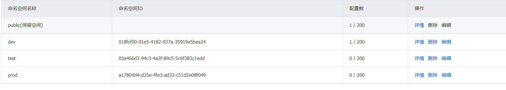

```yml
#配置中心地址
spring:
  cloud:
    nacos:
      config:
        server-addr: 127.0.0.1:8848
        file-extension: yaml
        group: DEFAULT_GROUP
        # 该配置影响统一配置中心中的dataId
#        namespace: 13b5c197-de5b-47e7-9903-ec0538c9db01
  profiles:
    active: dev
  application:
    name: service-statistics


```


**多配置文件加载**

 在一些情况下需要加载多个配置文件。

# 18 Jenkins 持久化部署

**打包**

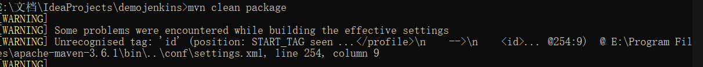

**运行**

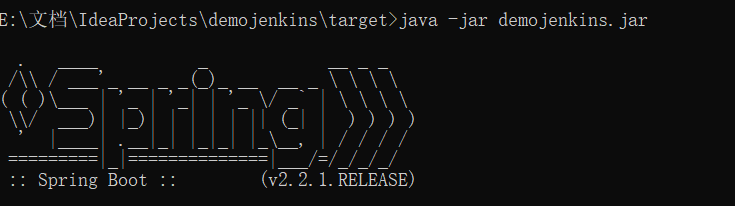

**安装java maven git docker**

**安装Jenkins** 

第一步：上传或下载安装包 cd/usr/local/jenkins jenkins.war 

第二步：启动 nohup java -jar /usr/local/jenkins/jenkins.war >/usr/local/jenkins/jenkins.out & 

第三步：访问 http://ip:8080


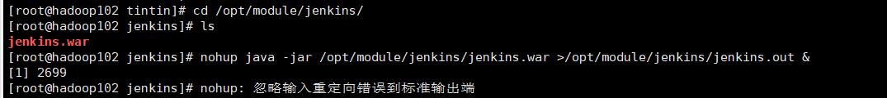

**解锁**

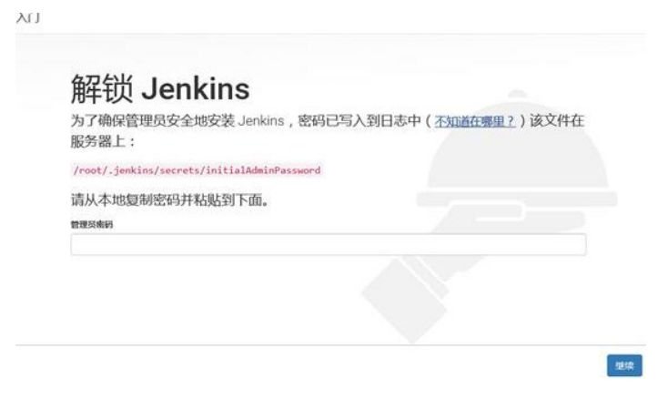


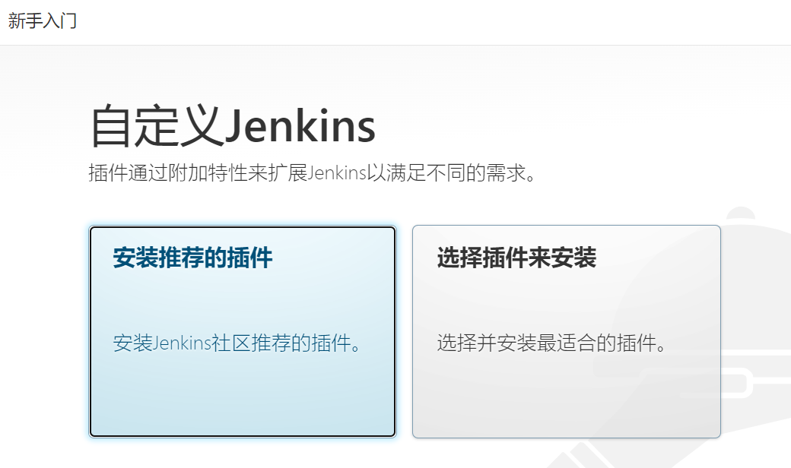

> 注意：配置国内的镜像 官方下载插件慢 更新下载地址 cd {你的Jenkins工作目录}/updates #进入更新配置位置 sed -i 's/http:\/\/updates.jenkins-ci.org\/download/https:\/\/mirrors.tuna.tsinghua.edu.cn\/jenkins/g' default.json && sed -i 's/http:\/\/www.google.com/https:\/\/www.baidu.com/g' default.json 这是直接修改的配置文件，如果前边Jenkins用sudo启动的话，那么这里的两个sed前均需要加上sudo 重启Jenkins，安装插件

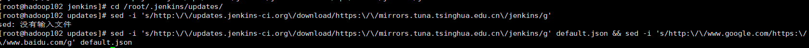

**重启 安装插件**

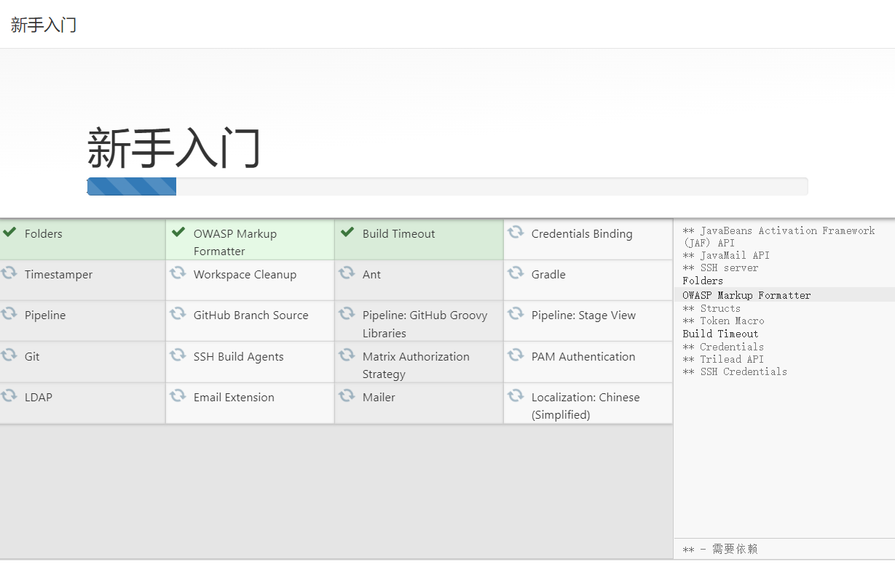

**创建账户 登录**

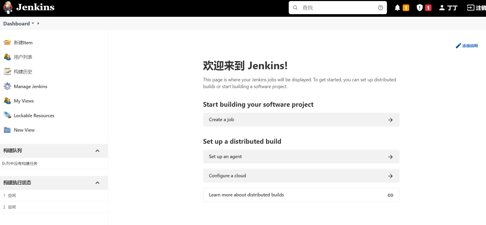

**配置**

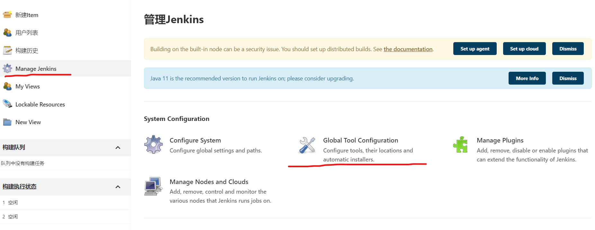

jdk maven git

**jenkins自动化过程**

Doclerfile

```

FROM openjdk:8-jdk-alpine
VOLUME /tmp
COPY ./target/demojenkins.jar demojenkins.jar
ENTRYPOINT ["java","-jar","/demojenkins.jar", "&"]
```

pom.xml

```
    <packaging>jar</packaging>
    
    
    <build>
        <finalName>demojenkins</finalName>
        <plugins>
            <plugin>
                <groupId>org.springframework.boot</groupId>
                <artifactId>spring-boot-maven-plugin</artifactId>
            </plugin>
        </plugins>
    </build>
```

**新建任务**

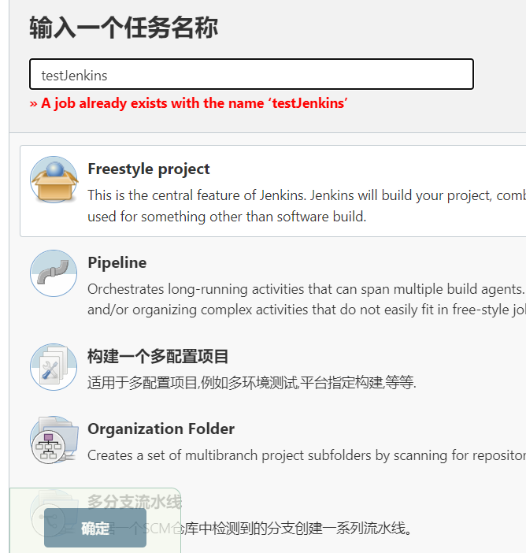

**构建任务**

git管理源码

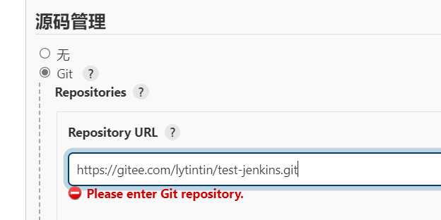

执行脚本

```shell
#!/bin/bash
#maven打包
mvn clean package
echo 'package ok!'
echo 'build start!'
cd ./
service_name="demojenkins"
service_port=8111
#查看镜像id
IID=$(docker images | grep "$service_name" | awk '{print $3}')
echo "IID $IID"
if [ -n "$IID" ]
then
    echo "exist $service_name image,IID=$IID"
    #删除镜像
    docker rmi -f $service_name
    echo "delete $service_name image"
    #构建
    docker build -t $service_name .
    echo "build $service_name image"
else
    echo "no exist $service_name image,build docker"
    #构建
    docker build -t $service_name .
    echo "build $service_name image"
fi
#查看容器id
CID=$(docker ps | grep "$service_name" | awk '{print $1}')
echo "CID $CID"
if [ -n "$CID" ]
then
    echo "exist $service_name container,CID=$CID"
    #停止
    docker stop $service_name
    #删除容器
    docker rm $service_name
else
    echo "no exist $service_name container"
fi
#启动
docker run -d --name $service_name --net=host -p $service_port:$service_port $service_name
#查看启动日志
docker logs -f  $service_name
```

**执行任务**

启动docker

控制台输出

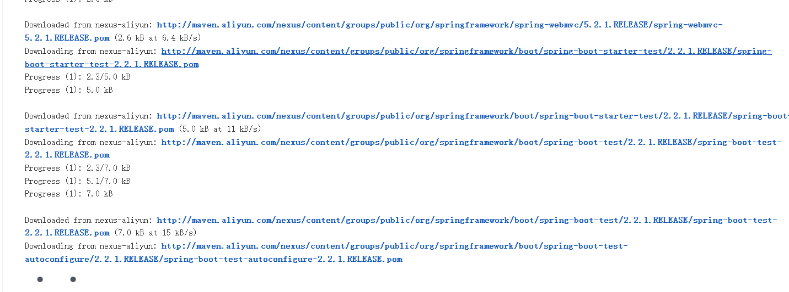

# 19 项目总结


## 19.1 后台业务

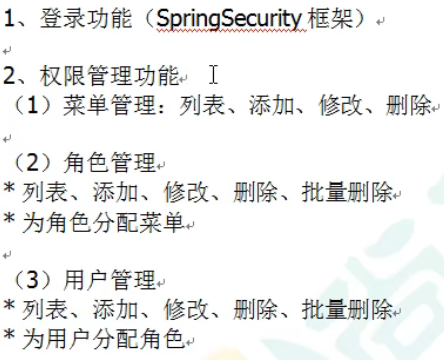

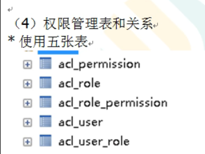

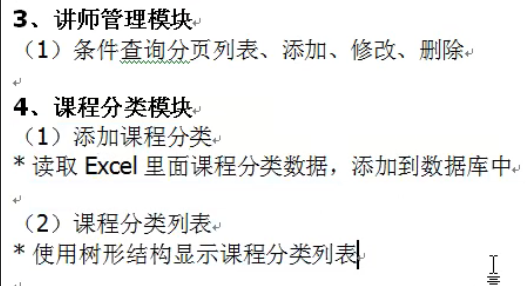

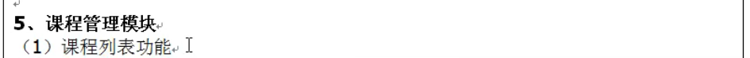


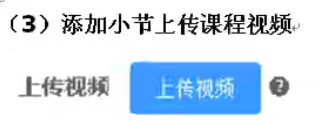

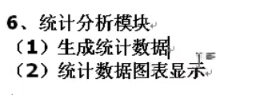

## 19.2 前台业务

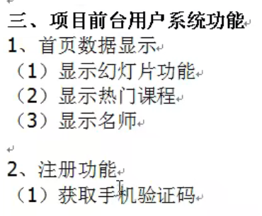

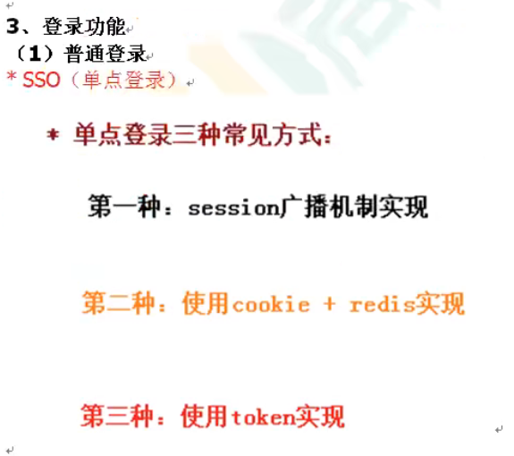

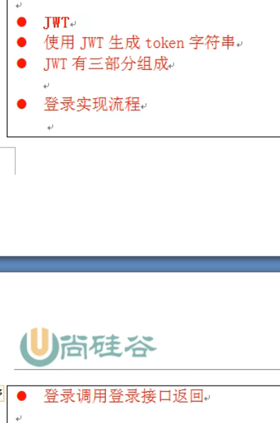

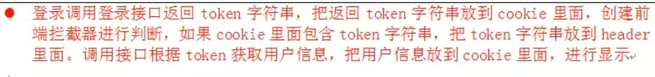

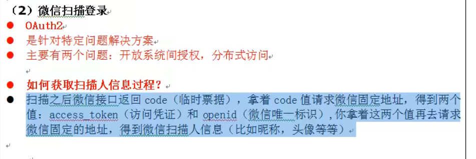

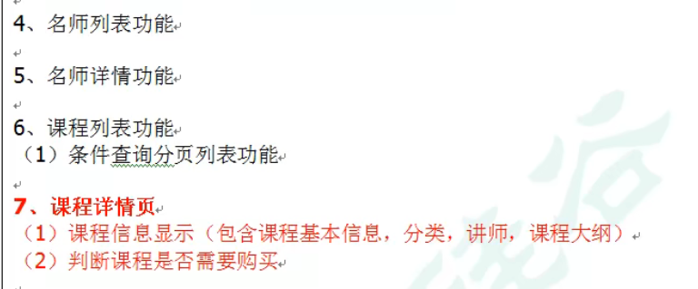

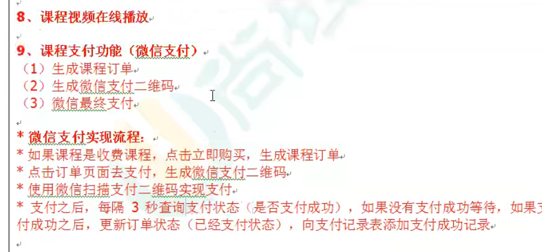

## 19.3 前后端分离

### 19.3.1 前端技术

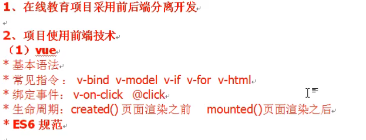


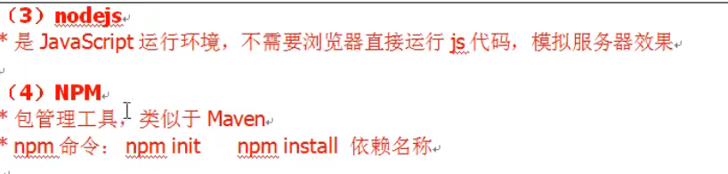

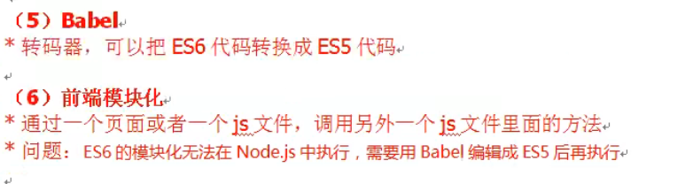


### 19.3.2 后端技术

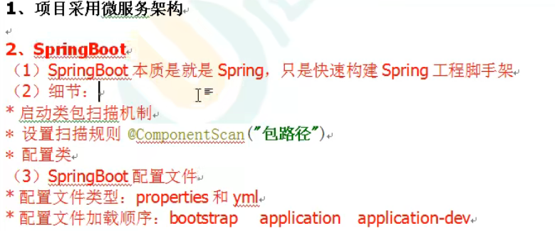

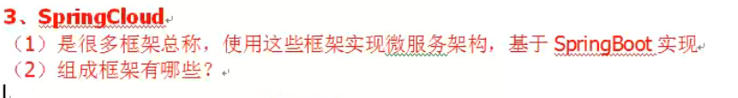

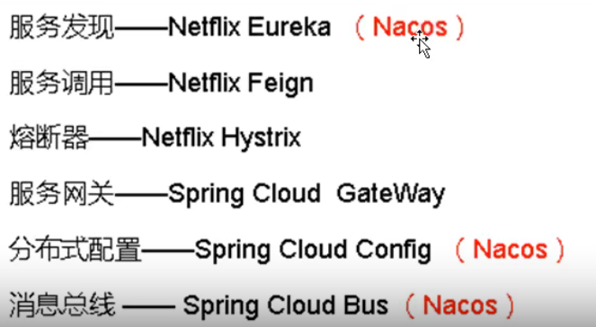

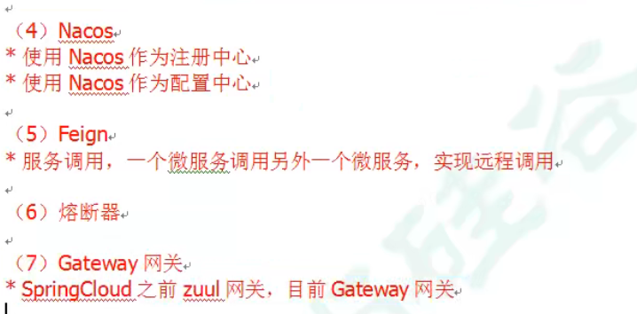

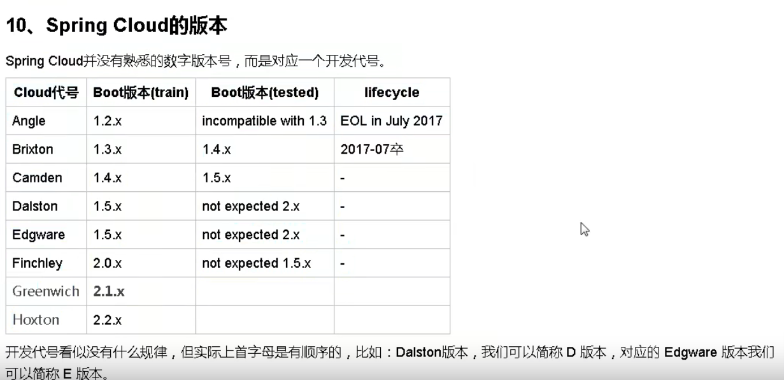

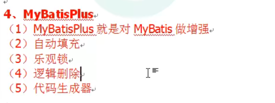

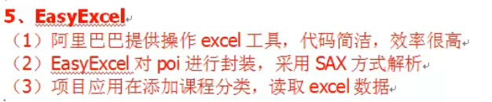

第三方技术

阿里云OOS存储 阿里云视频点播整合视频播放器 阿里云短信服务

微信支付 微信登录

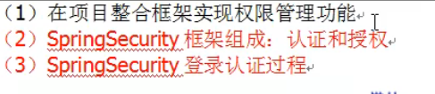

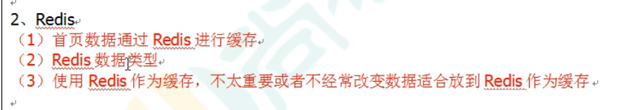

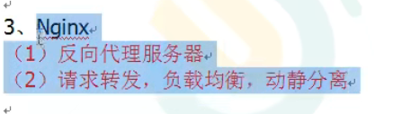

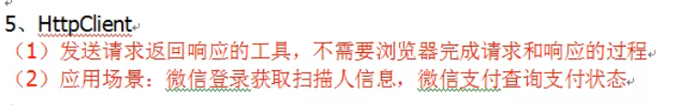

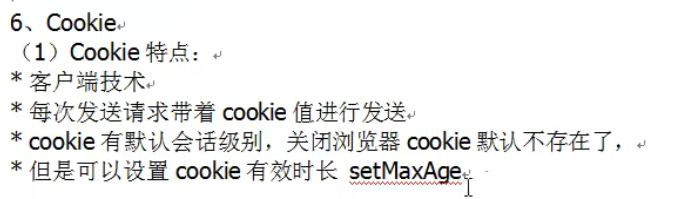

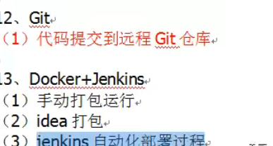

## 19.4 问题

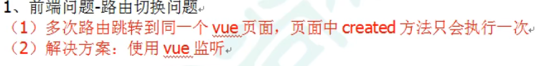

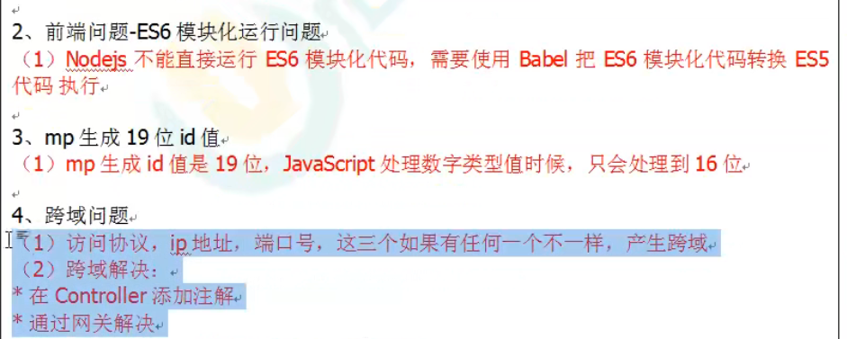

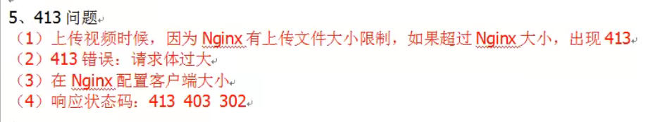

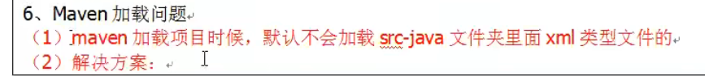

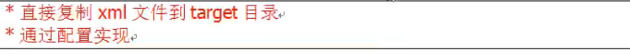
