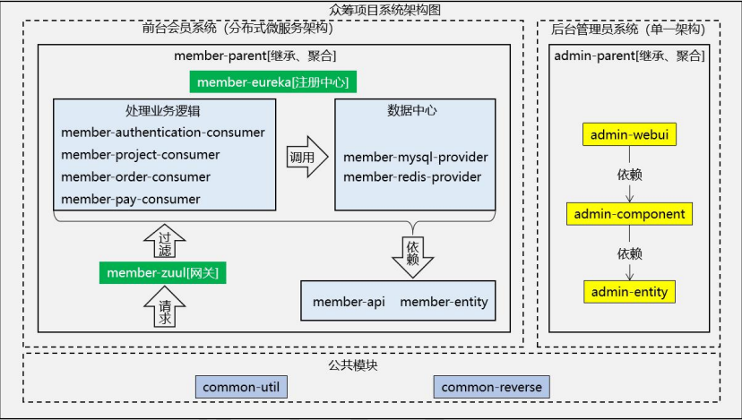
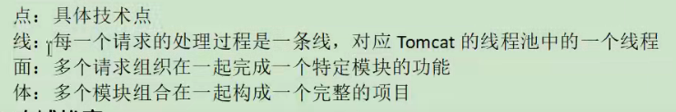
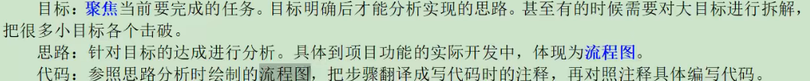
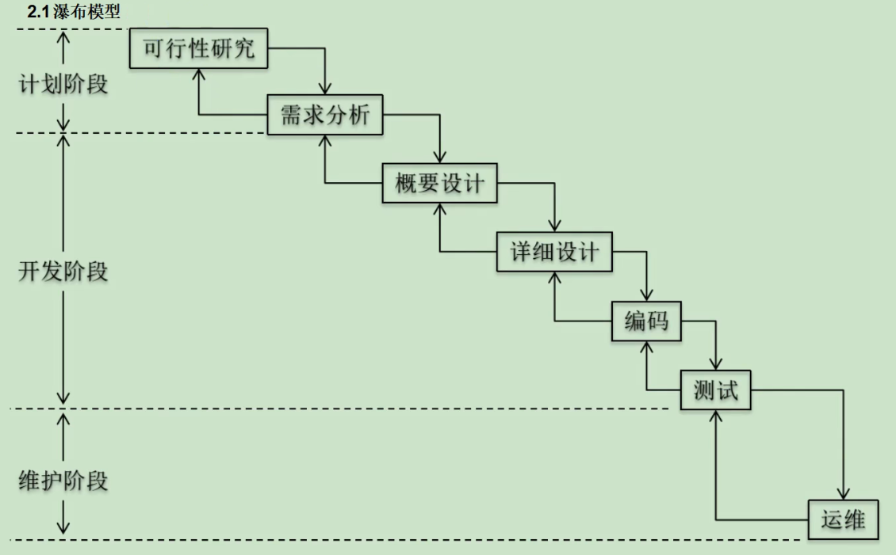
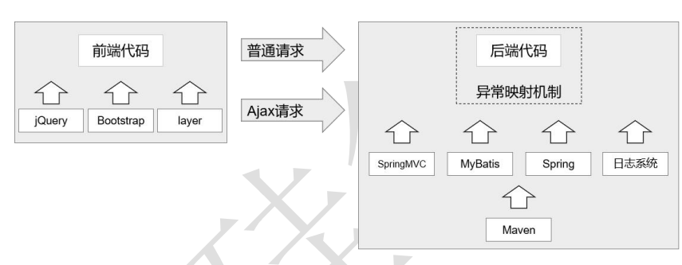
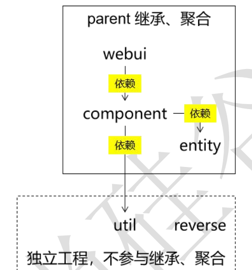

# 1 简介

从单一架构阶段到分布式架构阶段的过渡。后台管理员系统使用单一架构开发。前台会 员系统使用分布式架构开发

## 2 项目背景

## 2.1 商业背景

众筹系统，这个在网络上不断被搜索的热门词汇，从最初的陌生到熟悉，到现 在不断被更新，出现各种不同的众筹模式，不得不承认众筹系统的出现，是对传统 行业的一种冲击，对传统金融模式的一种冲击，同时对于年轻的一代而言，这也是 一个契机、一个机遇、一个开创自己事业的平台，正是因为这些利好，让更多的人 愿意去运用众筹系统，作为其项目发展孵化的平台。、

## 2.2 软件开发

**敏捷开发** 

敏捷开发是把一个软件产品看成是一个生物，每一个小功能的细微的迭代就好像是 生物逐渐在进化一样。

* 技术角度 加速了根据需求开发出来可以运行的代码这个过程。 需求→原型→编码 

* 商业角度 加速了用户体验新功能的这个过程。“小步快跑”，让每一个功能都做尽量小 的修改，但是加大更新的频率

# 3 后台-环境搭建

## 3.1 搭建目标

## 3.2 创建工程

z