# 1 项目简介

## 1.1 项目背景

### 1.1.1 电商模式

B2B B2C C2B C2C O2O

### 1.1.2 谷粒商城

B2C

### 1.1.3 项目架构图

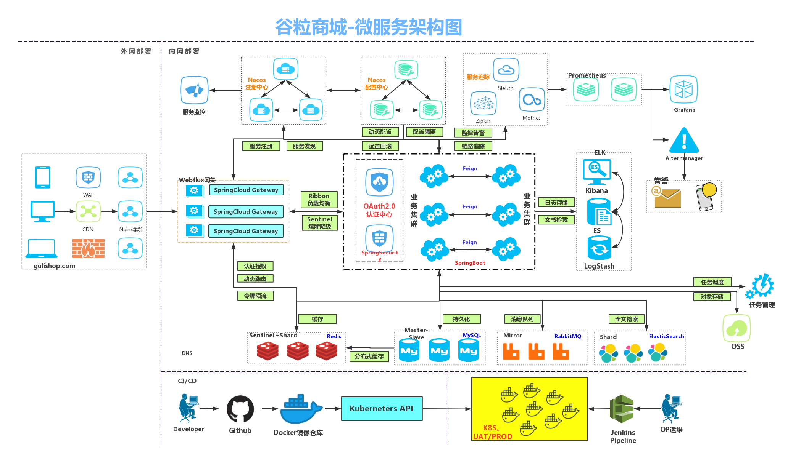

微服务划分图

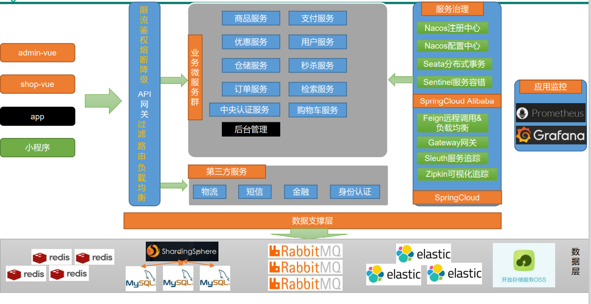

# 2 分布式基础

## 2.1 微服务

微服务架构风格，就像是把一个单独的应用程序开发为一套小服务，每个小服务运行在自己的进程中，并使用轻量级机制通信，通常是 HTTP API。这些服务围绕业务能力来构建，并通过完全自动化部署机制来独立部署。这些服务使用不同的编程语言书写，以及不同数据
存储技术，并保持最低限度的集中式管理。

简面言之：拒绝大型单体应用，基于业务边界进行服务微分 ，各个服务等价独立部署运行。

## 2.2 集群&分布式&节点 

**集群**是个物理形态，**分布式**是个工作方式。
只要是一堆机器，就可以叫集群，他们是不是一起协作着干活，这个谁也不知道；

> 《分布式系统原理与范型》定义：
> “分布式系统是若干独立计算机的集合，这些计算机对于用户来说就像单个相关系统”
> 分布式系统（distributed system）是建立在网络之上的软件系统。

分布式是指将不同的业务分布在不同的地方
集群指的是将几台服务器集中在一起，实现同一业务。

例如：京东是一个分布式系统，众多业务运行在不同的机器，所有业务构成一个大型的业务集群。每一个小的业务，比如用户系统，访问压力大的时候一台服务器是不够的。我们就应该将用户系统部署到多个服务器，也就是每一个业务系统也可以做集群化；

分布式中的每一个节点，都可以做集群。而集群并不一定就是分布式的。]

**节点**：集群中的一个服务器

## 2.3 远程调用

在分布式系统中，各个服务可能处于不同主机，但是服务之间不可避免的需要互相调用，我们称为远程调用。

SpringCloud 中使用 HTTP+JSON 的方式完成远程调用

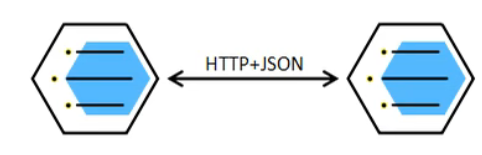

## 2.4 负载均衡

分布式系统中，A 服务需要调用 B 服务，B 服务在多台机器中都存在，A 调用任意一个服务器均可完成功能。

为了使每一个服务器都不要太忙或者太闲，我们可以负载均衡的调用每一个服务器，提升网站的健壮性。

常见的负载均衡算法：

* 轮询：为第一个请求选择健康池中的第一个后端服务器，然后按顺序往后依次选择，直到最后一个，然后循环。
* 最小连接：优先选择连接数最少，也就是压力最小的后端服务器，在会话较长的情况下可以考虑采取这种方式。
* 散列：根据请球员的IP和散列来选择要转发的服务器。这种方式一定程度上保证特定用户能连接相同的服务器。


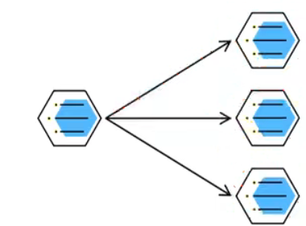

## 2.5 服务注册/发现&注册中心

A 服务调用 B 服务，A 服务并不知道 B 服务当前在哪几台服务器有，哪些正常的，哪些服务已经下线。解决这个问题可以引入注册中心；

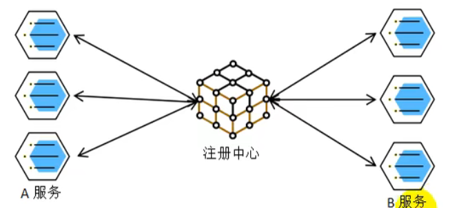

如果某些服务下线，我们其他人可以实时的感知到其他服务的状态，从而避免调用不可用的服务

## 2.6 配置中心

每一个服务最终都有大量的配置，并且每个服务都可能部署在多台机器上。我们:经常需要变更配置，我们可以让每个服务在配置中心获取自己的配置。

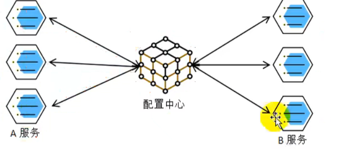

配置中心用来集中管理微服务的配置信息

## 2.7 服务熔断&服务降级

在微服务架构中，微服务之间通过网络进行通信，存在相互依赖，当其中一个服务不可用时，有可能会造成雪崩效应。要防止这样的情况，必须要有容错机制来保护服务。

1. 服务熔断
   设置服务的超时，当被调用的服务经常失败到达某个阈值，我们可以开启断路保护机制，后来的请求不再去调用这个服务。本地直接返回默认的数据
2. 服务降级
   在运维期间，当系统处于高峰期，系统资源紧张，我们可以让非核心业务降级运行。降级：某些服务不处理，或者简单处理【抛异常、返回NULL、调用Mock数据、调用Fallback处理逻辑】。

## 2.8 API网关

在微服务架构中，API Gateway 作为整体架构的重要组件，它抽象了微服务中都需要的公共功能，同时提供了客户端负载均衡，服务自动熔断，灰度发布，统一认证，限流流控，日志统计等丰富的功能，帮助我们解决很多 API 管理难题。

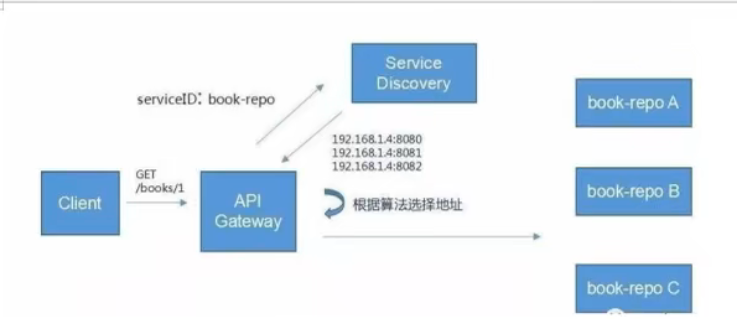

# 3 环境搭建

## 3.1 Linux虚拟机 

CestOS7 1804

**虚拟机设置**

网络地址转换-端口转发

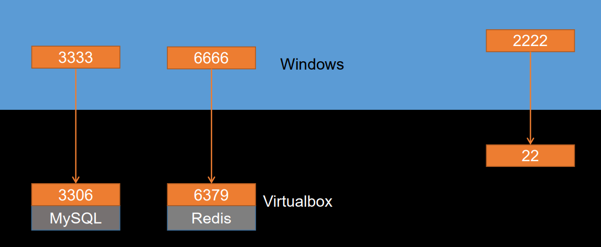

访问主机的一个端口可以访问到虚拟机的某个端口 每一个服务都要设置 麻烦

解决：给虚拟机一个IP地址，使其与主机ping通，每次调用虚拟机的服务只需访问其ip地址和端口

## 3.2 docker


## 3.3 mysql：5.7

mysql容器目录

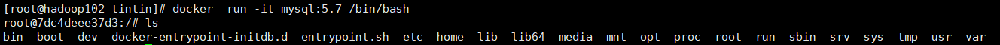


下载mysql5.7镜像

```bash
$ docker pull mysql:5.7
```

修改配置文件

```
$ vi/dockerdata/mysql/conf/my.cnf

[client]
default-character-set=utf8

[mysql]
default-character-set=utf8

[mysqld]
init_connect='SET collation_connection = utf8_unicode_ci'
init_connect='SET NAMES utf8'
character-set-server=utf8
collation-server=utf8_unicode_ci
skip-character-set-client-handshake
skip-name-resolve
```

新建mysql实例

```bash
$ docker run -itd -p 3306:3306 --privileged=true -v /dockerdata/mysql/log:/var/log/mysql -v /dockerdata/mysql/data:/var/lib/mysql -v /dockerdata/mysql/conf:/etc/mysql -e MYSQL_ROOT_PASSWORD=123456 --name mysql mysql:5.7 /bin/bash
# -it 保证有一个一直在跑的进程 防止容器直接退出了 
# -d 后台守护进程运行mysql
# -p 将容器3306端口映射到主机3306端口 
# -v 将配置、日志、数据文件挂载到主机 目的:便于修改配置文件 持久化数据 
# -e 初始化root用户的密码
```

主机目录

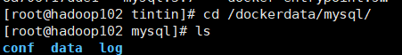

解决容器以及mysql终端无法输入中文问题

无论是在mysql终端，还是容器内终端都不能输入中文，这个时候初步判断是镜像的locale问题了。

只需要启动或者进入容器的时候添加个参数env LANG=C.UTF-8即可。

```bash
$ docker exec -it mysql env LANG=C.UTF-8 /bin/bash
```


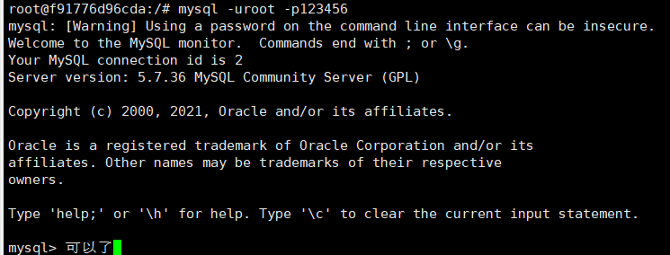


连接mysql

```bash
$ mysql -uroot -p
```

数据库可以 处理中文数据 并且数据持久化

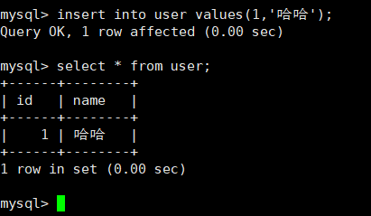

## 3.4 redis：latest

下载镜像

```bash
$ docker pull redis
```

配置文件

```
/app/redis目录下修改redis.conf文件
  3.1 开启redis验证    可选
    requirepass 123

  3.2 允许redis外地连接  必须
     注释掉 # bind 127.0.0.1

  3.3   daemonize no
     将daemonize yes注释起来或者 daemonize no设置，因为该配置和docker run中-d参数冲突，会导致容器一直启动失败

  3.4 开启redis数据持久化  appendonly yes  可选
```

新建实例

```bash
$ docker run  -p 6379:6379 --name redis --privileged=true -v /dockerdata/redis/redis.conf:/etc/redis/redis.conf -v /dockerdata/redis/data:/data -d redis redis-server /etc/redis/redis.conf
```

进入容器

```bash
$ docker exec -it redis /bin/bash
```

连接redis

```bash
$ redi-cli
```

## 3.5 开发环境

### 3.5.1 Java8

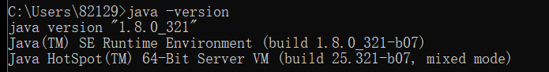

### 3.5.2 maven：3.6.1

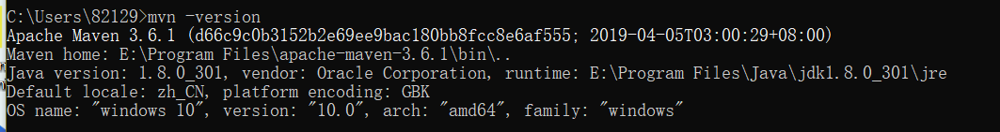

配置

```xml
  镜像
  <mirrors>
    <mirror>
      <id>nexus-aliyun</id>
      <mirrorOf>central</mirrorOf>
      <name>Nexus aliyun</name>
      <url>http://maven.aliyun.com/nexus/content/groups/public</url>
    </mirror>
  </mirrors>


jdk1.8项目
       <profile>
          <id>jdk-1.8</id>

          <activation>
            <activeByDefault>true</activeByDefault>
            <jdk>1.8</jdk>
          </activation>

          <properties>
            <maven.compiler.source>1.8</maven.compiler.source>
            <maven.compiler.target>1.8</maven.compiler.target>
            <maven.compiler.compilerVersion>1.8</maven.compiler.compilerVersion>
          </properties>
        </profile>


```

### 3.5.3 IDEA整合

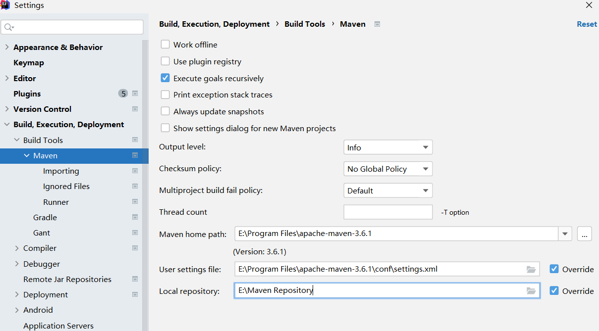


### 3.5.4 VSCODE

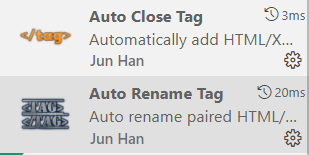

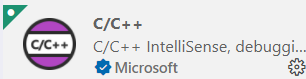

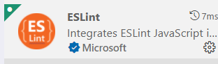

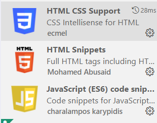


### 3.5.5 GIT

初始化名称、邮箱

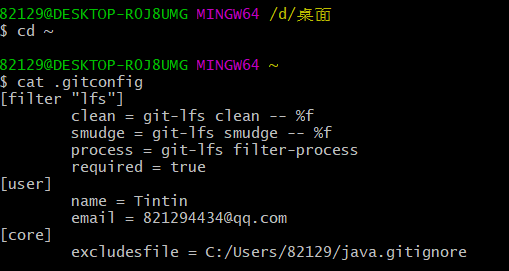

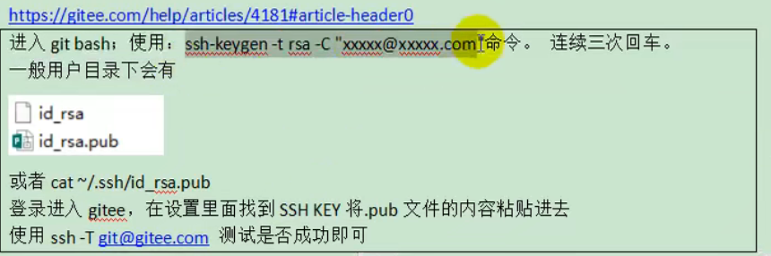

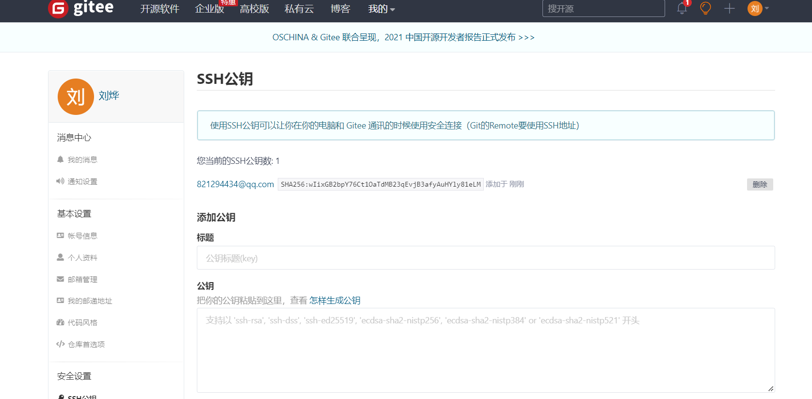

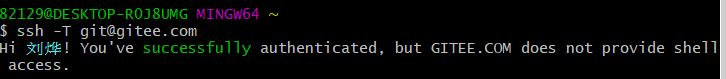

### 3.5.6 逆向工程


## 3.6 创建项目微服务

### 3.6.1 gitee初始化一个项目

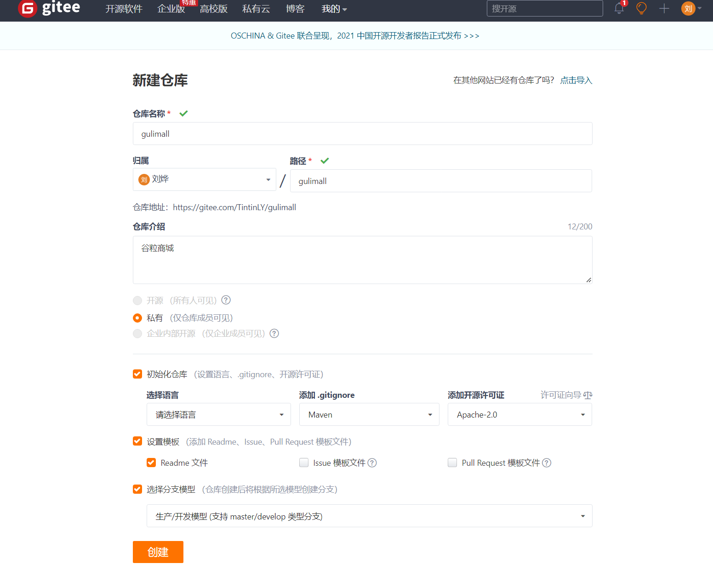

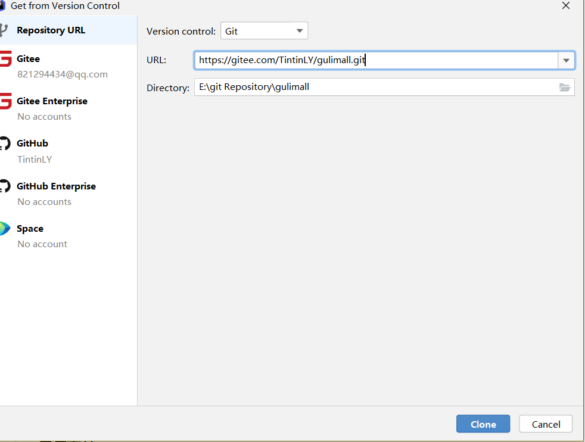

### 3.6.2 创建微服务项目

商品服务product、仓储服务ware、订单服务order、优惠券服务coupon、用户服务member

共同：

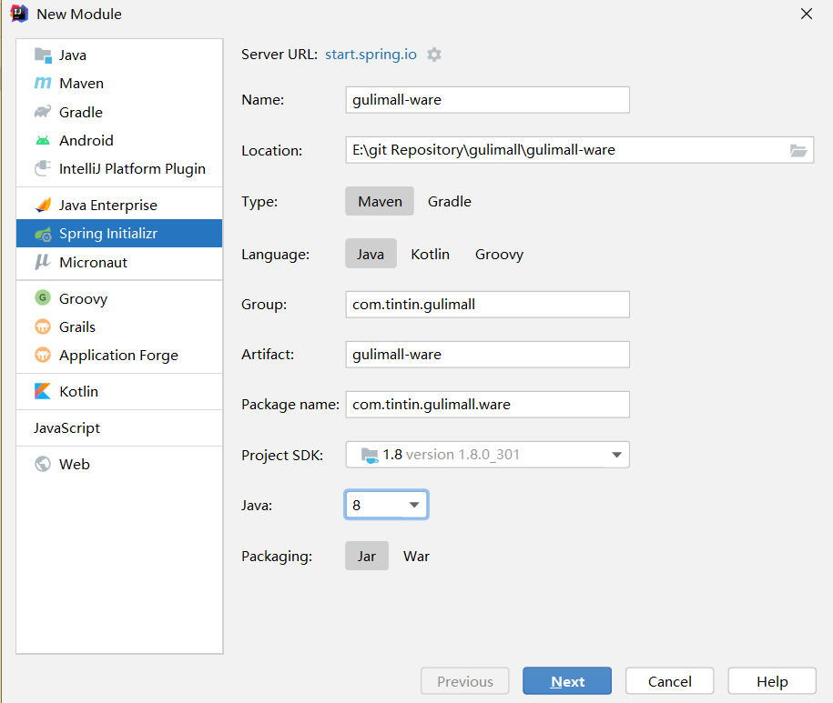

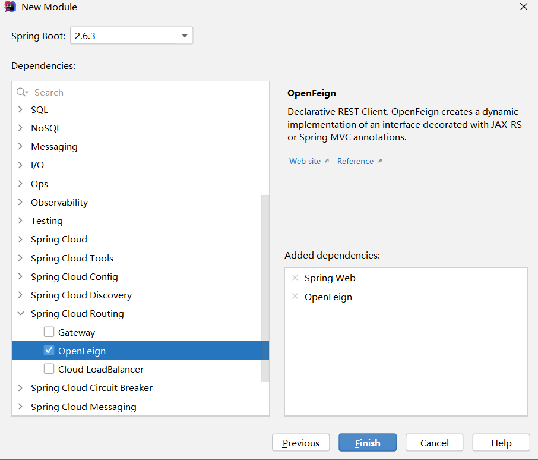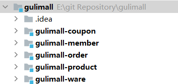

### 3.6.3 项目构建管理

gulimall根项目配置

```xml
<?xml version="1.0" encoding="UTF-8"?>
<project xmlns="http://maven.apache.org/POM/4.0.0" xmlns:xsi="http://www.w3.org/2001/XMLSchema-instance"
         xsi:schemaLocation="http://maven.apache.org/POM/4.0.0 https://maven.apache.org/xsd/maven-4.0.0.xsd">
    <modelVersion>4.0.0</modelVersion>
    <groupId>com.tintin.gulimall</groupId>
    <artifactId>gulimall</artifactId>
    <version>0.0.1-SNAPSHOT</version>
    <name>gulimall</name>
    <description>聚合服务</description>
    <packaging>pom</packaging>

    <modules>
        <module>gulimall-ware</module>
        <module>gulimall-coupon</module>
        <module>gulimall-member</module>
        <module>gulimall-order</module>
        <module>gulimall-product</module>
    </modules>


</project>

```


### 3.6.4 配置git忽略

与顼目的实际功能无关,不参与服务器上部署运行。把它们忽略掉能够屏蔽IDE工具之间的差异。

```
target/
pom.xml.tag
pom.xml.releaseBackup
pom.xml.versionsBackup
pom.xml.next
release.properties
dependency-reduced-pom.xml
buildNumber.properties
.mvn/timing.properties
# https://github.com/takari/maven-wrapper#usage-without-binary-jar
.mvn/wrapper/maven-wrapper.jar

**/mvnw
**/mvnw.cmd
**/.mvn
**/target

.idea

**/.gitignore
```

其他文件全部纳入版本控制

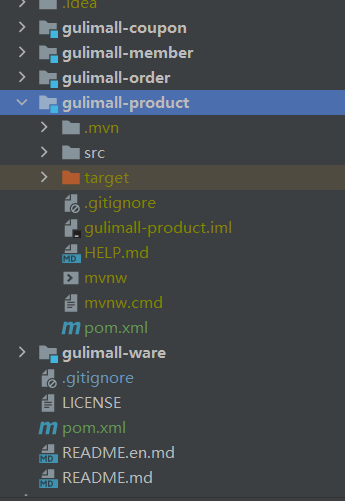

提交到本地库并推送到码云

## 3.7 数据库

订单

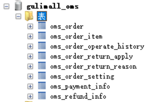

商品

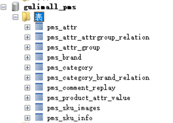

优惠

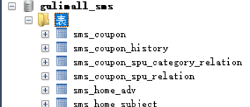

用户

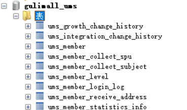

库存

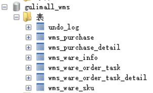

## 3.8 依赖管理

每个微服务通过引入gulimall-common项目 从而引入共需的依赖 

```xml
<?xml version="1.0" encoding="UTF-8"?>
<project xmlns="http://maven.apache.org/POM/4.0.0"
         xmlns:xsi="http://www.w3.org/2001/XMLSchema-instance"
         xsi:schemaLocation="http://maven.apache.org/POM/4.0.0 http://maven.apache.org/xsd/maven-4.0.0.xsd">
    <parent>
        <artifactId>gulimall</artifactId>
        <groupId>com.tintin.gulimall</groupId>
        <version>0.0.1-SNAPSHOT</version>
    </parent>
    <modelVersion>4.0.0</modelVersion>

    <artifactId>gulimall-common</artifactId>
    <description>每个微服务公共的依赖，bean，工具类等</description>

    <properties>
        <maven.compiler.source>11</maven.compiler.source>
        <maven.compiler.target>11</maven.compiler.target>
    </properties>

    <dependencies>
<!--        mybatis-plus-->
        <dependency>
            <groupId>com.baomidou</groupId>
            <artifactId>mybatis-plus-boot-starter</artifactId>
            <version>3.2.0</version>
        </dependency>
<!--        lombok-->
        <dependency>
            <groupId>org.projectlombok</groupId>
            <artifactId>lombok</artifactId>
            <version>1.18.8</version>
        </dependency>
        <!-- httpcomponets -->
        <dependency>
            <groupId>org.apache.httpcomponents</groupId>
            <artifactId>httpcore</artifactId>
            <version>4.4.13</version>
        </dependency>

        <dependency>
            <groupId>commons-lang</groupId>
            <artifactId>commons-lang</artifactId>
            <version>2.6</version>
        </dependency>

    </dependencies>
</project>
```


# 4 快速开发

## 4.1 后台管理系统

**现成后台项目**

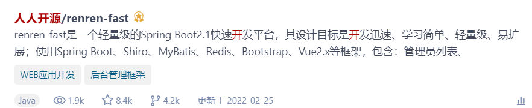

**建立后台数据库**

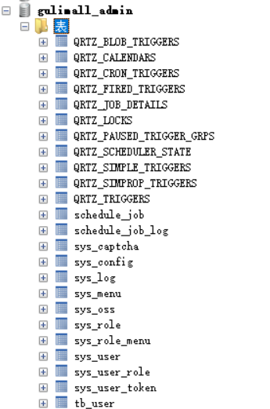

**修改项目数据源url**

在开发环境配置文件中 application-dev.yml

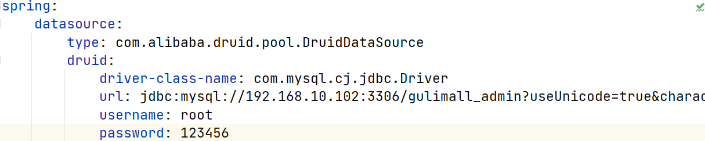

**启动（无前端页面启动）**

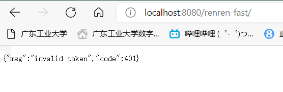

## 4.2 前端页面

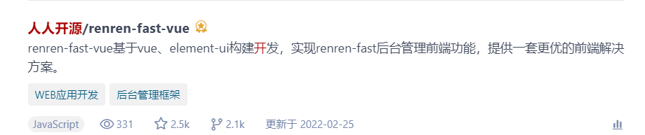

**node环境**

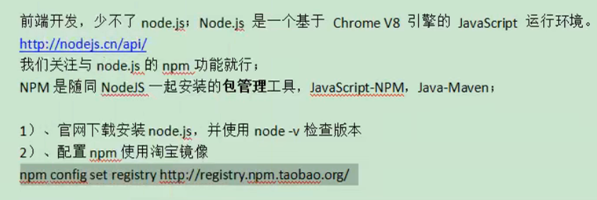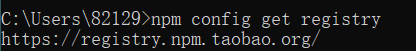

人人前台工程package.json描述了项目依赖及其版本

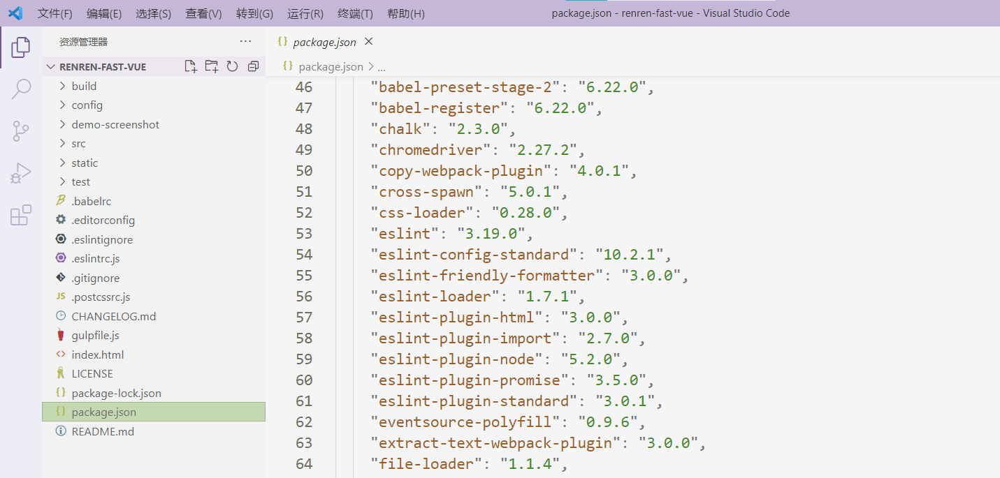

**下载组件**

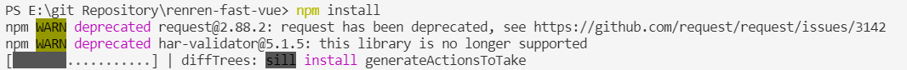

**运行前端项目**

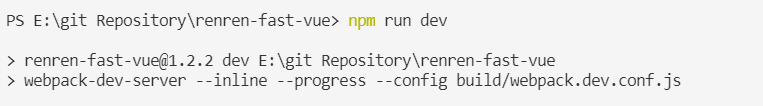

**前后端交互测试**

前端交互将会向后台发送请求

## 4.3 代码生成器

**以产品微服务为例**

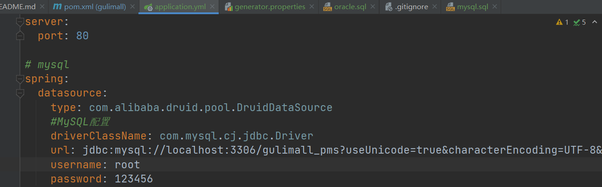

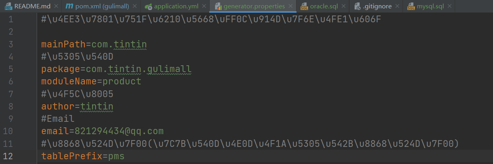

生成代码

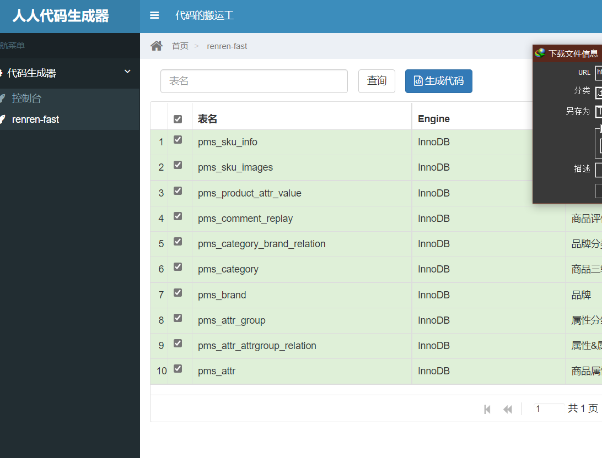

## 4.4 测试代码-CRUD功能

导入mybatis-plus mysql依赖

```xml
<!--        mybatis-plus-->
        <dependency>
            <groupId>com.baomidou</groupId>
            <artifactId>mybatis-plus-boot-starter</artifactId>
            <version>3.2.0</version>
        </dependency>
       <!-- mysql驱动 -->
        <dependency>
            <groupId>mysql</groupId>
            <artifactId>mysql-connector-java</artifactId>
            <version>8.0.18</version>
        </dependency>
```

配置数据源

```yml
spring:
  datasource:
    username: root
    password: tintin
    url: jdbc:mysql://192.168.10.102:3306/gulimall_pms?useUnicode=true&characterEncoding=UTF-8&useSSL=false&serverTimezone=Asia/Shanghai
    driver-class-name: com.mysql.cj.jdbc.Driver
```

使用@MapperScan告知Mapper接口所在包

```java
@SpringBootApplication
@MapperScan("com.tintin.gulimall.product.dao")
public class GulimallProductApplication {

```

sql映射文件位置 

全局配置主键自增

```yml
mybatis-plus:
  mapper-locations: classpath*:/mapper/**/*.xml
  global-config:
    db-config:
      id-type: auto
     
```

测试

```java
    @Test
    void contextLoads() {
        BrandEntity brandEntity = new BrandEntity();
        brandEntity.setDescript("内裤匹配");
        brandEntity.setName("丁丁牌");
        brandService.save(brandEntity);
        System.out.println("保存品牌成功");
    }
```


## 4.5 生成所有微服务代码

# 5 分布式组件

## 5.1 Spring Cloud 与 Spring Cloud Alibaba

### 5.1.1 Spring官方

**Spring Cloud Config**

  Spring Cloud Config是由git存储库支持的**集中式外部配置管理**，配置资源直接映射到Spring环境，如果需要的话，也可以由非Spring程序使用。

**Spring Cloud Netflix**

  各种Netflix OSS组件集成，包括**Eureka(服务注册与发现)**、Hystrix(容错管理，实现断路器模式)、Ribbon(客户端负载均衡)、Feign(声明式服务调用组件)、Zuul(网关，提供智能路由、访问过滤等功能)等。

**SpringCloud 的几大痛点**
SpringCloud 部分组件停止维护和更新，给开发带来不便；
SpringCloud部分环境搭建复杂，没有完善的可视化界面，我们需要大量的二次开发和定制
SpringCloud配置复杂，难以上手，部分配置差别难以区分和合理应用

### 5.1.2 Spring Cloud Alibaba

[Spring Cloud Alibaba](https://spring.io/projects/spring-cloud-alibaba)

Spring Cloud Alibaba 致力于提供分布式应用服务开发的一站式解决方案。项目包含开发分布式应用服务的必需组件，方便开发者通过 Spring Cloud 编程模型轻松使用这些组件来开发分布式应用服务。

阿里巴巴提供的方案跟Spring官方提供的方案有一些对应关系：

Nacos = Eureka/Consule + Config + Admin

Sentinel = Hystrix + Dashboard + Turbine

Dubbo = Ribbon + Feign

RocketMQ = RabbitMQ

Schedulerx = Quartz

**SpringCloud Alibaba 的优势：**
阿里使用过的组件经历了考验，性能强悍，设计合理，现在开源出来大家用
成套的产品搭配完善的可视化界面给开发运维带来极大的便利
搭建简单，学习曲线低。

### 5.1.3 最终的技术搭配方案

*SpringCloud Alibaba - Nacos：注册中心（服务发现/注册）*
*SpringCloud Alibaba-Nacos：配置中心（动态配置管理）*
SpringCloud - Ribbon：负载均衡
SpringCloud-Feign:声明式HTTP客户端(调用远程服务）
*SpringCloud Alibaba - Sentinel：服务容错（限流、降级、熔断）*
SpringCloud-Gateway：API网关（webflux编程模式）
SpringCloud-Sleuth：调用链监控
*SpringCloud Alibaba-Seata：原 Fescar，即分布式事务解决方案*

**版本选择**

```xml
<parent>
        <groupId>org.springframework.boot</groupId>
        <artifactId>spring-boot-starter-parent</artifactId>
        <version>2.1.8.RELEASE</version>
        <relativePath/> <!-- lookup parent from repository -->
    </parent>

 <properties>
        <java.version>1.8</java.version>
        <spring-cloud.version>Greenwich.SR3</spring-cloud.version>
    </properties>
```

## 5.2 Spring Cloud Alibaba-Nacos 作为注册中心

## 5.3 Spring Cloud Alibaba-Nacos 作为配置中心

## 5.4 Spring Cloud Alibaba-Sentinel

## 5.5 Spring Cloud Alibaba-Seata

## 5.6 Spring Cloud Alibaba-Seata-OSS

## 5.7 Spring Cloud-Feign

## 5.8 Spring Cloud-Gateway

## 5.7 Spring Cloud-Sleuth+Zipkin 服务链路追踪

