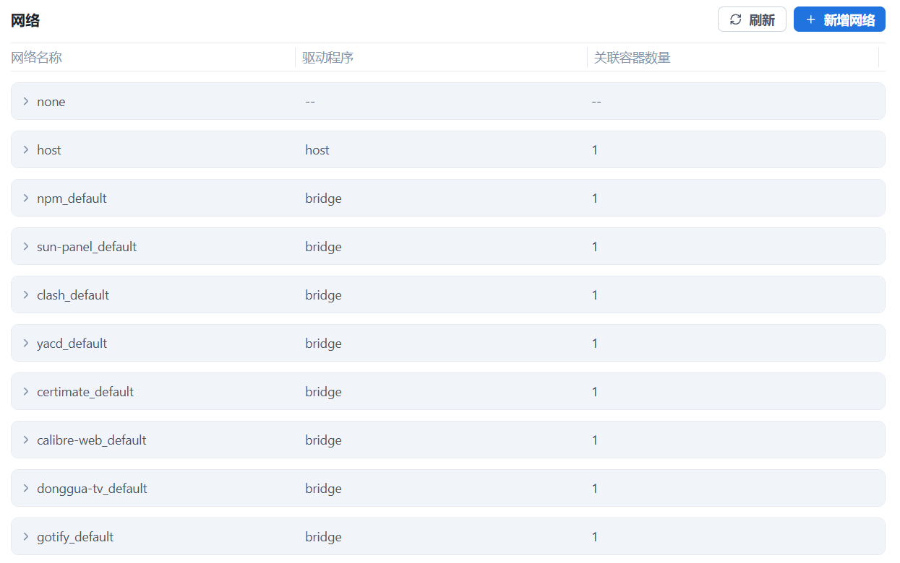

## Docker-Compose常见配置参数

### 同步容器与宿主机时区

```yaml
version: '3.8'
services:
    app:
        image: your_image_name
        environment:
            - TZ=Asia/Shanghai # 方法一：添加 TZ 环境变量
        volumes:
            - /etc/localtime:/etc/localtime:ro # 方法二：挂载 /etc/localtime和/etc/timezone 文件以确保时间同步
            - /etc/timezone:/etc/timezone:ro
```

### 解决卷权限问题

```yaml
version: '3'
services:
    app:
        image: your_image_name
        user: "1000:1000" # 方法一：指定 user 选项来设置容器内运行进程的用户
        volumes:
            - ./data:/data:rw # volumes 选项中添加 :ro（只读）或 :rw（读写）来设置挂载卷的权限
```

### 网络驱动类型

不同的网络驱动适用于不同场景，常见类型包括：

| 驱动类型 | 适用场景                     | 特点                           |
| :------- | :--------------------------- | :----------------------------- |
| bridge   | 单主机多容器通信             | 默认驱动，隔离性好             |
| host     | 高性能、低延迟需求           | 共享主机网络栈，端口冲突风险高 |
| none     | 完全隔离环境                 | 禁用所有网络接口               |
| xxx      | 第三方或自定义的网络驱动程序 | 第三方或自定义的网络驱动程序   |

相应的Docker 安装后会自动创建名为 `bridge` `host` `none`的默认网络

### 容器的默认网络

默认情况下，Compose 会创建一个独立的 bridge 网络环境，网络的名称通常是 `<项目名>_default`，项目内的所有服务都会被自动连接到这个默认网络。Docker Compose 利用内嵌的 DNS 服务器实现服务发现，使得在同一个网络内，服务之间可以通过**服务名**作为主机名（hostname）来相互访问。



```yaml
services:
  web:
    image: nginx
  backend:
    image: myapp

# 创建composename_default网络，web和backend服务连接进该网络。web 服务将可以访问 http://backend:8080，DNS 自动解析为 backend 容器的 IP 地址。
```

### 容器自定义网络

一个前端网络 `proxy-net` 和一个后端网络 `app-net`，和一个外部网络`app2-net`（可能是其他compose创建的网络或docker network create创建的网络）

```yaml
version: '3.8'

services:
  proxy:
    image: proxy
    ports:
      - "80:80"
    networks:
      - proxy-net
      
  app:
    image: postgres:13-alpine
    networks:
      app-net:
      	aliases: # 使用网络别名，同一个网络中的其他服务可以使用这个别名来访问该服务
      	  - app.net
          - app.com
   	  app2-net:
   	  
# 在这里定义网络
networks:
  proxy-net:
    driver: bridge  # bridge 是最常用的驱动
  app-net:
    driver: bridge
  app2-net:
    external: true
```

