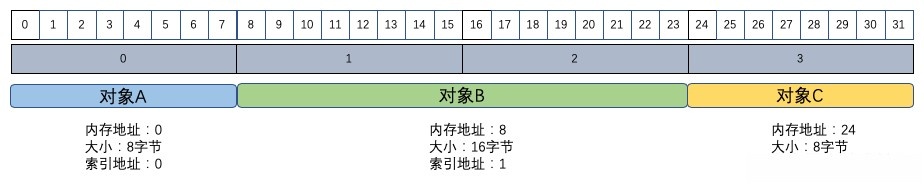
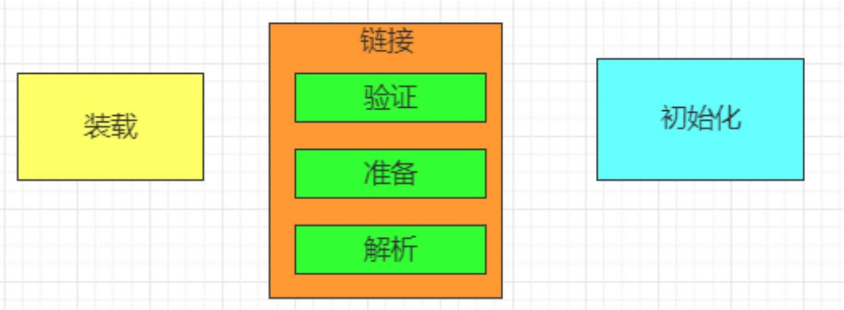
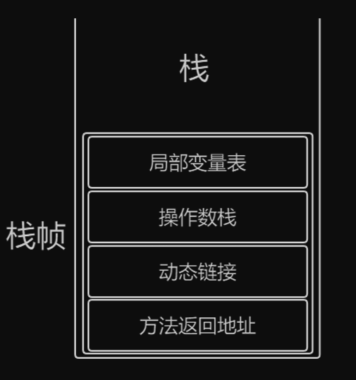

## 指针膨胀是什么？

32位JVM的寻址空间只有4G（2^32）。只能使用4G内存（因为有其他开销，实际远小于4G）。64位JVM的寻址空间更大了，几乎可以理解为无限大。但是会带来0~20%的性能损耗。64位指针的开销就意味着有更多的浪费空间，这仅仅是因为指针更大。比浪费空间更糟糕的是，64位指针在主内存和多级缓存之间移动数据的时候，还会消费更多的带宽。

## 如何解决指针膨胀？

指针压缩（compressed oops）使指针不再是指向堆内存中精确位置，而是对象的偏移量。

如下图，32位的指针

|          | 指针压缩前                          | 指针压缩后                                                   |
| -------- | ----------------------------------- | ------------------------------------------------------------ |
| 指针含义 | 指向内存中精确位置                  | 代表对象的（8字节一个单位）偏移量                            |
| 对象A    | 00000000 00000000 00000000 00000000 | 00000000 00000000 00000000 00000000                          |
| 对象B    | 00000000 00000000 00000000 00001000 | 00000000 00000000 00000000 00000001                          |
| 对象C    | 00000000 00000000 00000000 00011000 | 00000000 00000000 00000000 00000011                          |
| 存储空间 | 约4G（2^32）B的内存地址             | 能引用2^32个对象。假设都是空对象，2^32 * 8 = 32G总计32GB内存 |



对于32位系统，指针压缩使Java虚拟机可以在32位的限制下表示更多的内存地址。对于64位系统，指针压缩可以减少空间浪费，提高缓存性能。

Java虚拟机有一个建议："Don’t Cross 32 GB!"。即不建议堆大小超过32G(准确的说是31.998G)

* 超过32G压缩指针失效。堆大小直到32G左右还能保持32位指针。一旦越过32G，指针将切回到普通的对象指针，导致更多的CPU，内存和带宽性能损耗。
* 堆越大，GC表现越差
* DUMP分析将是灾难

## Java对象的大小为什么必须是8字节的整数倍？

大多数计算机都是高效的64位处理器，一次能处理64位的指令，即8个字节的数据。Java虚拟机规范就遵循了这个要求，Java对象的大小就必须是8字节的整数倍，这样子性能更高，处理更快。HotSpot VM也遵循了这个规范。保证Java对象的大小都是8字节是通过对齐填充（Padding）来实现的。Java对象的内存布局分为：对象头（Object Header）、实例数据（Instance Data）和对齐填充（Padding）。

## 请解释一下对象的创建过程？ (半初始化)

```java
Object o = new Object();
```

等价于

```assembly
0 new #2 <java/lang/Object>
3 dup
4 invokespecial #1 <java/lang/Object.<init> : ()V>
7 astore_1
```

* new 。申请空间，设置默认值。（多线程发生问题时，有可能访问到当前半初始化的对象）
* dup
* invokespecial。调构造方法，设置初始值。
* astore_1。将对象与引用建立关联。

## DCL单例要不要加volatile问题？(指令重排)

* 指令重排

为了提高执行效率，程序不一定是按照顺序来执行的。程序的指令重排，最终会保持结果一致性（指在单一线程下的一致性）。

单线程环境下，指令重排，不会对程序产生负面影响；在多线程环境下，指令重排会给程序带来意想不到的错误。

* volatile关键字

volatile关键字的作用：1、保持线程可见性。2、禁止指令重排

* DCL（Double Check Lock）

下图以   懒汉式单例模式，多线程获取单例为例。


* 初始化对象的指令重排序

```asm
0 new #2 <java/lang/Object>
3 dup
4 invokespecial #1 <java/lang/Object.<init> : ()V>
7 astore_1
```

重排为

```asm
0 new #2 <java/lang/Object>
3 dup
7 astore_1
4 invokespecial #1 <java/lang/Object.<init> : ()V>
```

不会影响最终结果。即让对象与引用建立链接，再调用构造器进行初始化。

因此，当某个线程已经创建了对象，另一个线程很有可能获取到一个未调用构造器（半初始化）的对象。上图代码必须加volatile以避免线程安全问题。

## 对象在内存中的存储布局？

一个Java对象是在堆内存中，由对象头（Header），实例数据（Instance Data）和对齐填充（Padding）三部分组成，


```xml
		<!--查看对象头工具-->
        <dependency>
            <groupId>org.openjdk.jol</groupId>
            <artifactId>jol-core</artifactId>
            <version>0.9</version>
        </dependency>
```

通过jol类库可以打印对象的存储布局。

* 对象头：标记字markword，占8字节。
* 对象头：类型指针class pointer。对象头中的类型指针指向对象所属类的元数据，占4字节。
* 实例数据instance data。对象的成员变量。
* 对齐padding。为了补齐被8整除的内存大小。


## 对象头具体包括什么？

* 标记字markword
  * 锁信息。synchronized对该对象上锁后markword发生变化，释放锁后markword恢复。当锁的竞争比较激烈，会发生锁升级。
  * hashcode。调用hashcode方法后markword发生变化。
  * gc信息。垃圾回收算法的三次标记记录在markword中。
* 类型指针class pointer 
* 用于记录数组长度的数据（若为数组）

## 对象怎么定位？

两种方式

* 句柄（间接）。引用指向了句柄池。句柄池保存了实例对象地址，进而找到实例对象。句柄池还保存了对象类型数据指针。优点：句柄池已经保存了对象类型数据指针，对象无需在存储，节省空间。垃圾回收时，挪动对象位置，栈中的引用无需改变，改变的是句柄池所保存的内存地址。
* 指针（直接）。引用直接指向堆内存的对象内存区域。对象实例保存了对象类型指针。优点：定位对象快。垃圾回收时，挪动对象位置稍麻烦。


> HotspotVM使用的是方式2直接指针的定位方式

## 对象怎么分配？ (栈上-线程本地-Eden-0ld)

* JDK8的Hot-Spot虚拟机经典内存分区模型

新生代回收多，采用复制算法，将存活的对象从当前使用的区域（eden或survivor）复制到另一块区域（survivor），并清空原区域的所有对象。当复制年龄超过限制（通过参数-XX:MaxTenuringThreshold配置）时，就会进入老年代。

老年代回收较少，对大对象进行标记整理（MC）或者标记压缩（MS）。

复制算法比较占空间。

标记整理算法节省空间。

还有一种算法叫标记清除算法。


* 对象分配过程

对象如果分配在栈上，方法执行完后栈帧弹出，对象的生命周期就结束了。假如对象被引用的范围不局限于该方法，则不应该在栈上分配对象。栈上分配对象的标准：1、逃逸分析。2、标量替换

对象如果在堆上分配，对象大小过大（通过参数-XX:PretenureSizeThreshold配置）则直接进入老年代，而后被全量回收。对象不大则进入新生代eden区，但TLAB（Thread Local Allocation Buffer）会使对象优先进入线程独享专用的分配缓冲区。新生代会多次进行垃圾回收，进入新生代survior区（s1区和s2区在复制算法控制下交替存在），幸存年龄够了则进入老年代。


## Object o = new Object()在内存中占用多少字节?

空对象占用16个字节

* 对象头：标记字markword，占8字节。
* 对象头：类型指针class pointer。占4字节。
* 无实例数据
* 对齐8的倍数，占4字节

## 类加载机制是什么



虚拟机把Class文件加载到内存，并对数据进行校验、解析和初始化，形成虚拟机可以使用的Java类型，即java.lang.class

### 转载

查找和导入class文件

1. ”类加载器“可以通过类全名来获取定义此类Class文件的二进制字节流
2. 将这个字节流代表的静态的存储结构转化为方法区的运行时数据结构
3. 在堆中生成一个代表这个类的java.lang.class对象，作为对方法区这些数据的入口

### 链接

* 验证。文件格式、元数据、字节码、符号引用
* 准备。为类的静态（加了static）变量分配内存，并将其初始化为默认值。
* 解析。把类中符号引用转换为直接引用。直接引用可以表示数据指向的内存位置，但不同虚拟机内存布局实现不同，直接引用也不同。

### 初始化

初始化阶段是执行类构造器Clinit()方法的过程。准备阶段，类变量已赋过一次系统要求的默认值，而在初始化阶段，则是根据程序员通过程序制定的主观计划去初始化类变量和其他资源，比如赋值。

初始化两种方式：直接申明、静态代码块

## 栈帧结构和动态链接



附加信息：栈帧的高度、虚拟机版本信息

栈帧信息：附加信息+动态链接+方法返回地址

局部变量表：存放方法中定义的局部变量以及方法的参数的表

操作数栈：以压栈出栈的方式存储操作数

方法返回地址：

* 遇到返回的字节码指令（return）
* 出现异常交给异常处理器或者抛出异常

动态链接：为了支持方法的动态调用过程，每一个栈帧内部都包含一个指向**运行时常量池**中该栈帧所属方法的引用。动态链接实际上就是符号引用转为直接引用，如方法的入口地址或字段的偏移量。以下是发生"链接"的两种不同时机。

* 非虚方法（如静态方法、私有方法、构造方法、父类的方法），类加载的解析阶段完成。直接绑定到目标方法，无需运行时动态分派。
* 虚方法（由于Java特性多态的存在，编译器确定不了调用版本的方法），直到运行时才将这些符号引用转换为直接引用称为惰性解析。

## 为什么堆空间要分代管理

* 弱分代假说：大多数对象都是“朝生夕死”的。98%的对象在第一次Minor GC前死亡。——>适合高频率回收、为了避免空间碎片化而适合标记-复制算法
  * ——>新生代也可以划分一块较大的Eden空间和两块较小的Survivor空间，只需要保持一块小的Suervivor空间空出来用于接收少量的存活对象。
* 强分代假说：熬过多次垃圾收集过程的对象就越难以消亡——>适合低频率回收、为了避免复制对象的性能损耗而适合标记-清除算法或者标记整理算法
* 跨代引用假说：跨代引用相对于同代引用来说仅占极少数——>分代的垃圾收集不至于太难实现
* 分代后，JVM可以针对不同区域采用不同的GC策略，提高回收效率，避免全堆扫描的开销。

## 方法区、持久代和元空间的关系

方法区是 《Java虚拟机规范 》中的规范，而持久代（PermGen）是方法区JDK7之前的实现、元空间（Meta Space）是方法区JDK8以后的实现。

《Java虚拟机规范》把方法区描述为堆的逻辑部分，但它却有一个名字 Non-Heap 非堆，方法区和堆物理上并无联系。

1. 1.6 及以前永久代是方法区的实现，其中包括：已加载的类型信息，常量，静态变量，即时编译器编译过后的代码缓存等。
2. 1.7 将字符串常量池，静态变量移出到堆中。
3. 1.8 将老年代剩余内容（主要是类型信息）全部移到元空间中。元空间占用的是直接内存，由于不再占用

永久代替换成元空间的好处

* JVM参数配置永久代的固定大小导致了内存管理的刚性。应用启动时加载大量的类可能会导致Full GC或OOM异常。而本地内存（Native Memory），默认情况下可以根据需要动态扩展，减少了内存不足的风险。
* 久代的垃圾收集会导致较长的停顿时间和过多的内存碎片。元空间使用本地内存，减少了 JVM 堆内存的压力。

## init和clinit的异同

在前端编译器（javac）生成字节码时添加到语法树之中

`<init>()`是对象构造器方法。创建一个对象调用该对象类的 constructor 方法时才会执行init方法

`<clinit>()`是所有类变量的赋值动作和静态语句块合并生成的。在类加载的初始化阶段会执行clinit方法
