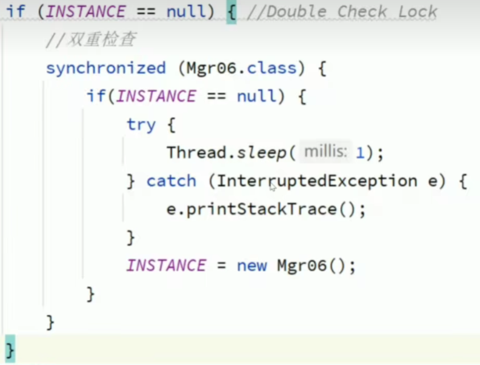
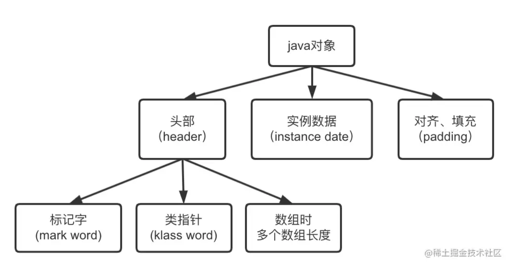
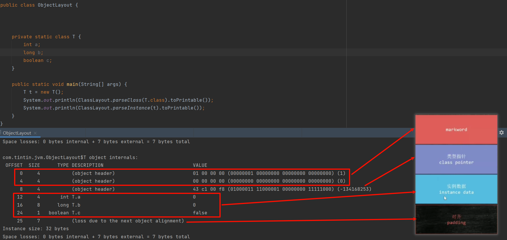
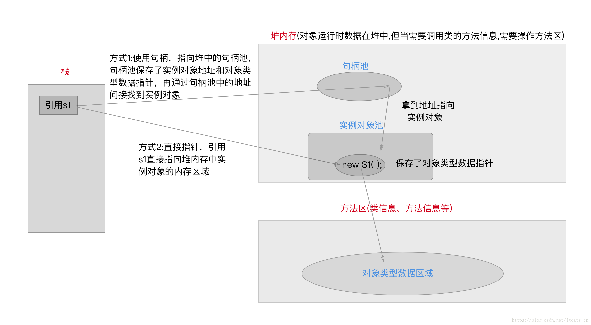
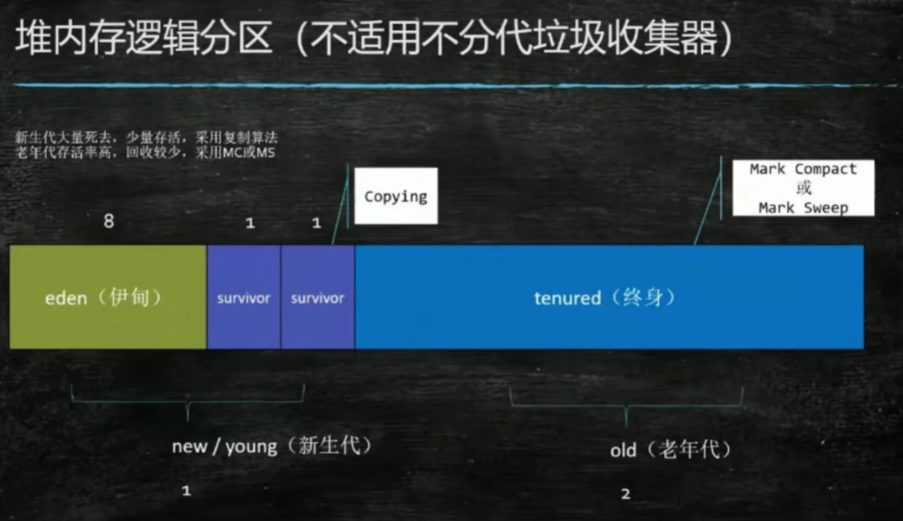
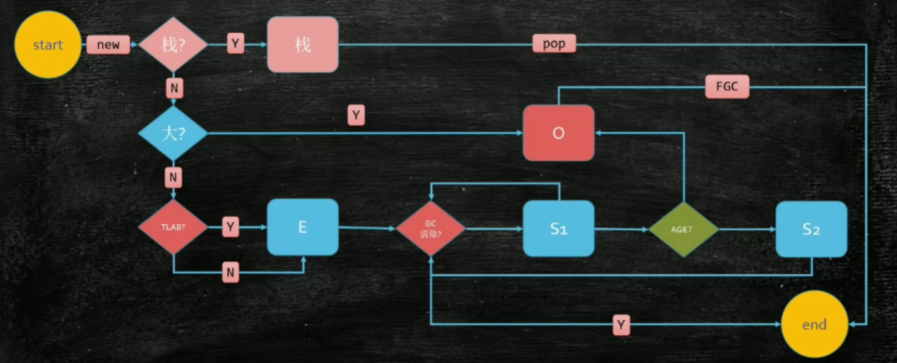

## 请解释一下对象的创建过程？ (半初始化)

```java
Object o = new Object();
```

等价于

```assembly
0 new #2 <java/lang/Object>
3 dup
4 invokespecial #1 <java/lang/Object.<init> : ()V>
7 astore_1
```

* new 。申请空间，设置默认值。（多线程发生问题时，有可能访问到当前半初始化的对象）
* dup
* invokespecial。调构造方法，设置初始值。
* astore_1。将对象与引用建立关联。

## DCL单例要不要加volatile问题？(指令重排)

* 指令重排

为了提高执行效率，程序不一定是按照顺序来执行的。程序的指令重排，最终会保持结果一致性（指在单一线程下的一致性）。

单线程环境下，指令重排，不会对程序产生负面影响；在多线程环境下，指令重排会给程序带来意想不到的错误。

* volatile关键字

volatile关键字的作用：1、保持线程可见性。2、禁止指令重排

* DCL（Double Check Lock）

下图以   懒汉式单例模式，多线程获取单例为例。



* 初始化对象的指令重排序

```asm
0 new #2 <java/lang/Object>
3 dup
4 invokespecial #1 <java/lang/Object.<init> : ()V>
7 astore_1
```

重排为

```asm
0 new #2 <java/lang/Object>
3 dup
7 astore_1
4 invokespecial #1 <java/lang/Object.<init> : ()V>
```

不会影响最终结果。即让对象与引用建立链接，再调用构造器进行初始化。

因此，当某个线程已经创建了对象，另一个线程很有可能获取到一个未调用构造器（半初始化）的对象。上图代码必须加volatile以避免线程安全问题。

## 对象在内存中的存储布局？

一个Java对象是在堆内存中，由对象头（Header），实例数据（Instance Data）和对齐填充（Padding）三部分组成，



```xml
		<!--查看对象头工具-->
        <dependency>
            <groupId>org.openjdk.jol</groupId>
            <artifactId>jol-core</artifactId>
            <version>0.9</version>
        </dependency>
```

通过jol类库可以打印对象的存储布局。

* 对象头：标记字markword，占8字节。
* 对象头：类型指针class pointer。对象头中的类型指针指向对象所属类的元数据，占4字节。
* 实例数据instance data。对象的成员变量。
* 对齐padding。为了补齐被8整除的内存大小。



## 对象头具体包括什么？

* 标记字markword
  * 锁信息。synchronized对该对象上锁后markword发生变化，释放锁后markword恢复。当锁的竞争比较激烈，会发生锁升级。
  * hashcode。调用hashcode方法后markword发生变化。
  * gc信息。垃圾回收算法的三次标记记录在markword中。
* 类型指针class pointer 

## 对象怎么定位？

两种方式

* 句柄（间接）。引用指向了句柄池。句柄池保存了实例对象地址，进而找到实例对象。句柄池还保存了对象类型数据指针。优点：句柄池已经保存了对象类型数据指针，对象无需在存储，节省空间。垃圾回收时，挪动对象位置，栈中的引用无需改变，改变的是句柄池所保存的内存地址。
* 指针（直接）。引用直接指向堆内存的对象内存区域。对象实例保存了对象类型指针。优点：定位对象快。垃圾回收时，挪动对象位置稍麻烦。



> HotspotVM使用的是方式2直接指针的定位方式

## 对象怎么分配？ (栈上-线程本地-Eden-0ld)

* JDK8的Hot-Spot虚拟机经典内存分区模型

新生代回收多，采用复制算法，将存活的对象从当前使用的区域（eden或survivor）复制到另一块区域（survivor），并清空原区域的所有对象。当复制年龄超过限制（通过参数-XX:MaxTenuringThreshold配置）时，就会进入老年代。

老年代回收较少，对大对象进行标记整理（MC）或者标记压缩（MS）。

复制算法比较占空间。

标记整理算法节省空间。

还有一种算法叫标记清除算法。



* 对象分配过程

对象如果分配在栈上，方法执行完后栈帧弹出，对象的生命周期就结束了。假如对象被引用的范围不局限于该方法，则不应该在栈上分配对象。栈上分配对象的标准：1、逃逸分析。2、标量替换

对象如果在堆上分配，对象大小过大（通过参数-XX:PretenureSizeThreshold配置）则直接进入老年代，而后被全量回收。对象不大则进入新生代eden区，但TLAB（Thread Local Allocation Buffer）会使对象优先进入线程独享专用的分配缓冲区。新生代会多次进行垃圾回收，进入新生代survior区（s1区和s2区在复制算法控制下交替存在），幸存年龄够了则进入老年代。



## Object o = new Object()在内存中占用多少字节?

空对象占用16个字节

* 对象头：标记字markword，占8字节。
* 对象头：类型指针class pointer。占4字节。
* 无实例数据
* 对齐8的倍数，占4字节
