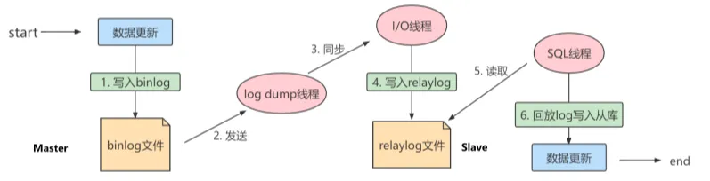
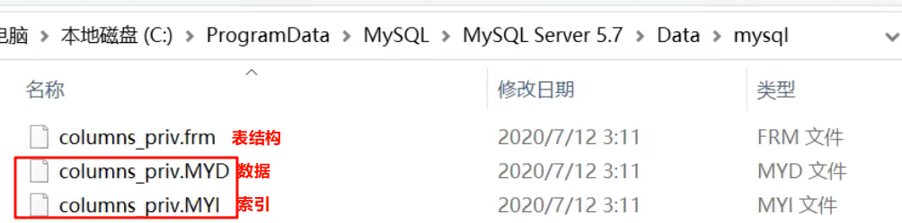

## MySQL有哪些隔离级别

* Read Uncommitted 读未提交。会导致脏读问题，即读取到其他事务未提交的数据。
* Read Committed 读已提交。解决脏读问题。存在不可重复读问题，即一个事务里面，执行两次读命令，中途其他事务的更新命令提交导致看到的结果不同。
* Repeatable Read 可重复读。解决不可重复读问题。存在幻读问题或更新丢失，即一个事务里面，中途其他事务的插入或删除导致查询数量或更新结果的不一致。幻读针对的是一批数据整体。在InnoDB和Falcon等存储引擎中通过mvcc（多版本并发控制）机制解决了幻读问题。
* Serializable 可串行化。最高隔离级别，强制事务排序，使之无法相互冲突。为每个读的数据行上锁，会导致大量的timeout和锁竞争。

## MySQL主从复制原理是什么



1. 当主服务器将所有的数据更改操作，会记录在二进制日志（binary log）中。
2. Slave服务器请求binlog，并创建一个I/O线程获取二进制数据，写入中继日志relaylog中
3. 同时Master服务器为每个请求启动一个log dump二进制日志转储线程来传输binlog。
4. Slave服务器启动SQL线程会读取relay log文件的日志，并解析成sql文件逐一执行。

## MySQL聚簇和非聚簇索引的区别

明显区分：数据和索引是否在一起存储。

Myisam存储引擎，数据文件和索引文件分开存储



Innodb存储引擎，数据和索引存储在同一个文件


跟数据绑定在一起的索引就叫聚簇索引。要么是主键，要么是唯一键，要么是自动生成的6字节rowid。

而为了避免冗余存储，Innodb也使用了非聚簇索引，非聚簇索引不绑定数据，每个叶子节点存储的就是聚簇索引的key值。

## MySQL索引的基本原理

### 为什么要索引

一般的应用系统，读写比例在10:1左右。插入、更新等操作很少有性能问题，加速查询性能很重要。增加索引和索引优化是查询性能优化的最有效的手段，对查询效率的提升可以达到几个数量级。

### 什么是索引

索引在MySQL也叫“键”，是存储引擎中由于快速找到记录的一种数据结构。查询字典中的某个字时，通过字的拼音和音序表可以得到该字在字典中的页码位置。数据库类似于字典，而索引就相当于字典的音序表。

### 索引的原理

在索引的数据结构中，我们可以不断地缩小数据的范围来筛选出最终想要的结果，随机事件也可以变成顺序事件。

### MySQL索引的常见数据结构

Innodb、Myisam存储引擎默认使用B+Tree索引。虽然两个引擎底层都使用了B+Tree的索引结构，但对索引的实现方式不大一样。

Memory存储引擎默认使用Hash索引

Memory表一般用于临时表，存在于内存中，同时支持Hash索引和B+Tree索引。Hash形式的组织设计，查询单条记录很块，但是由于每个键只对应一个值，而且是散列的分布，因此无法利用索引完成范围查询和排序等功能。

B+Tree索引是最MySQL最频繁使用的索引。查询效率相对较慢，但是更适合排序和范围查询等操作。

### B+树如何实现索引的以及其优势

## MySQL索引结构有哪些，各自的优劣

哈希索引就是将键值通过某种算法得到新的哈希值，直接定位到数据存储的位置，定位的速度基本等于计算的速度。哪怕键值重复或者算出来的位置是重复的，也就是出现哈希冲突，也能通过链接法（重复位置的元素用链表存储，定位时往后扫描）等解决冲突。

优势：等值查询（where column = value）快。

劣势：无法利用索引完成排序、模糊查询、范围查询等功能。如果有大量重复键值的情况下，哈希冲突频繁导致效率低下。

B+树索引是一个平衡的多叉树。从根节点到每个叶子节点的高度差值不超过1，使得根节点定位到叶子节点的层级最少，提升定位效率。同层级的两个节点间有双向指针相连接，使得其具有快速的顺序扫描。

优势：检索效率平均。可以利用索引完成出色的范围顺序查询。

劣势： 等值查询相对man

## MySQL锁的类型

基于锁的属性分类：共享锁、排他锁

基于锁的粒度分类：表级锁（Innodb、Myisam）、行级锁（Innodb）、页级锁（Innodb）、记录锁、间隙锁、临键锁

基于锁的状态分类：意向锁

## MySQL为什么需要主从同步

* 读写分离。缓解频繁查询的压力，对于业务不是那么重要的数据，主库负责写、从库复杂读，通过主从复制实现同步
* 数据热备、提升数据冗余。主库down机，可以切换从库延续服务的运行。
* 架构角度上，业务量过大时，I/O访问频率过高可能达到单机性能的瓶颈，分库存储可以降低磁盘I/O访问的频率，提高单机I/O性能。

## 如何查看MySQL的执行计划

```sql
# 模拟优化器执行SQL查询语句
exlplain + SQL语句	 
```

官方解释

[MySQL :: MySQL 5.7 Reference Manual :: 8.8.2 EXPLAIN Output Format](https://dev.mysql.com/doc/refman/5.7/en/explain-output.html)

执行计划包含的信息

| Column        | Meaning                                        | Description                                          |
| :------------ | :--------------------------------------------- | ---------------------------------------------------- |
| id            | The `SELECT` identifier                        | select子句的执行顺序：位置从上到下、id值从大到小     |
| select_type   | The `SELECT` type                              | 用来分辨查询的类型，是普通查询还是联合查询还是子查询 |
| table         | The table for the output row                   | 当前select子句查询的表名                             |
| partitions    | The matching partitions                        |                                                      |
| type          | The join type                                  | 当前select子句执行时的访问类型。                     |
| possible_keys | The possible indexes to choose                 | 这张表中的索引                                       |
| key           | The index actually chosen                      | 当前select子句执行时用到的索引。                     |
| key_len       | The length of the chosen key                   | 索引中使用的字节数                                   |
| ref           | The columns compared to the index              | 显示索引的哪一列被使用                               |
| rows          | Estimate of rows to be examined                | 检索时读取数据的预估值                               |
| filtered      | Percentage of rows filtered by table condition |                                                      |
| Extra         | Additional information                         | 查询是否用到了额外的技术点                           |

以下访问类型，访问效率从低到高排序。一般情况下，得保证查询至少达到range级别，最好能达到ref

```sql
-- all:全表扫描，一般情况下出现这样的sql语句而且数据量比较大的话那么就需要进行优化。
explain select * from emp;
-- index：全索引扫描这个比all的效率要好，主要有两种情况，一种是当前的查询时覆盖索引，即我们需要的数据在索引中就可以索取，或者是使用了索引进行排序，这样就避免数据的重排序
explain  select empno from emp;
-- range：表示利用索引查询的时候限制了范围，在指定范围内进行查询，这样避免了index的全索引扫描，适用的操作符： =, <>, >, >=, <, <=, IS NULL, BETWEEN, LIKE, or IN() 
explain select * from emp where empno between 7000 and 7500;
-- index_subquery：利用索引来关联子查询，不再扫描全表
explain select * from emp where emp.job in (select job from t_job);
-- unique_subquery:该连接类型类似与index_subquery,使用的是唯一索引
explain select * from emp e where e.deptno in (select distinct deptno from dept);
-- index_merge：在查询过程中需要多个索引组合使用，没有模拟出来
explain select * from rental where rental_date like '2005-05-26 07:12:2%' and inventory_id=3926 and customer_id=321\G
-- ref_or_null：对于某个字段即需要关联条件，也需要null值的情况下，查询优化器会选择这种访问方式
explain select * from emp e where  e.mgr is null or e.mgr=7369;
-- ref：使用了非唯一性索引进行数据的查找
create index idx_3 on emp(deptno);
explain select * from emp e,dept d where e.deptno =d.deptno;
 -- eq_ref ：使用唯一性索引进行数据查找
explain select * from emp,emp2 where emp.empno = emp2.empno;
-- const：这个表至多有一个匹配行，
explain select * from emp where empno = 7369;
-- system：表只有一行记录（等于系统表），这是const类型的特例，平时不会出现
```


## 关于DELIMITER

在MySQL中默认的结束符DELIMITER是;，它用于标识一段命令是否结束。在默认情况下，在命令行客户端中，如果有一行命令以;结束，那么回车后，MySQL将会执行该命令。

> #### 为什么要修改
>
> 有时候我们输入的语句不希望立即执行，但是语句中包含有分号`;`需要输入时，比如说我们在创建函数或者创建存储过程的时候，我们需要在函数中创建多条语句，此时如果用`;`分隔不同语句时就会导致直接执行目前所键入的命令，而创建函数或构建方法失败。
>
> 在使用习惯中，我们经常将结束符更改为 `;;` 、`//` 、 `$$` 等。

## MySQL授予远程连接的权限

在我们使用mysql数据库时，有时我们的程序与数据库不在同一机器上，这时我们需要远程访问数据库。缺省状态下，mysql的用户没有远程访问的权限。

* 改表法

  ```sql
  USE mysql;
  SELECT HOST,USER FROM USER;
  UPDATE USER SET HOST = '%' WHERE USER = 'root';
  FLUSH PRIVILEGES; # 刷新权限
  ```

* 授权法

```shell
C:\Users\82129>mysql -u root -ptintin
mysql>GRANT ALL PRIVILEGES ON *.* TO 'root'@'%'WITH GRANT OPTION
mysql>FLUSH PRIVILEGES
mysql>EXIT
```

场景，mysql8.0.17修改mysql用户权限，开启所有ip可访问
使用：`GRANT ALL PRIVILEGES ON *.* TO 'root'@'%' IDENTIFIED BY '密码' WITH GRANT OPTION;`
报错，原因是要先创建用户再进行赋权，不能同时进行，

解决：修正后的语句：分开三次执行

```sql
#创建账户
create user 'root'@'localhost' identified by  'password'

#赋予权限，with grant option这个选项表示该用户可以将自己拥有的权限授权给别人
grant all privileges on *.* to 'root'@'1ocalhost' with grant option

#改密码&授权超用户，flush privileges 命令本质上的作用是将当前user和privilige表中的用户信息/权限设置从mysql库(MySQL数据库的内置库)中提取到内存里
flush privileges;
```

## 修改密码

第一次修改密码

```
 ALTER USER USER() IDENTIFIED BY 'root';
```

5.7版本

```
set password for username @localhost = password(newpwd);
```