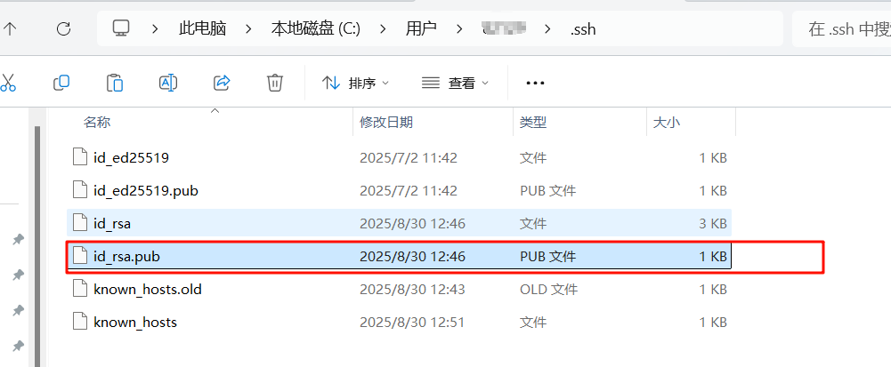
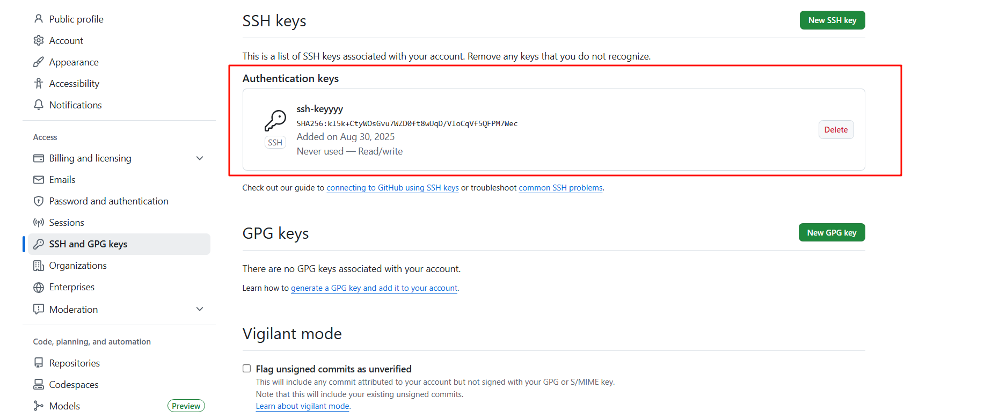

## 设置代理

```shell
# 设置 HTTP 代理
git config --global http.proxy http://127.0.0.1:你的代理端口号

# 设置 HTTPS 代理
git config --global https://127.0.0.1:你的代理端口号
```

## git的ssh

```shell
Please make sure you have the correct access rights and the repository exists 
```

全局设置邮箱、用户名

```sh
git config --global user.name "想要设置的name"
git config --global user.email "你的邮箱"
```

查看Git的全局配置，确保正确

```sh
git config --list
```

生成本地.ssh

```sh
ssh-keygen -t rsa -C "邮箱"
```

打开GitHub或码云上的设置，创建ssh公钥，将C:\Users\你的用户名\.ssh\id_rsa.pub粘贴



