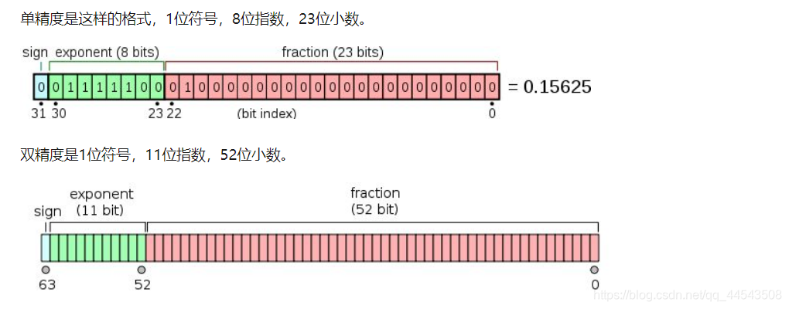
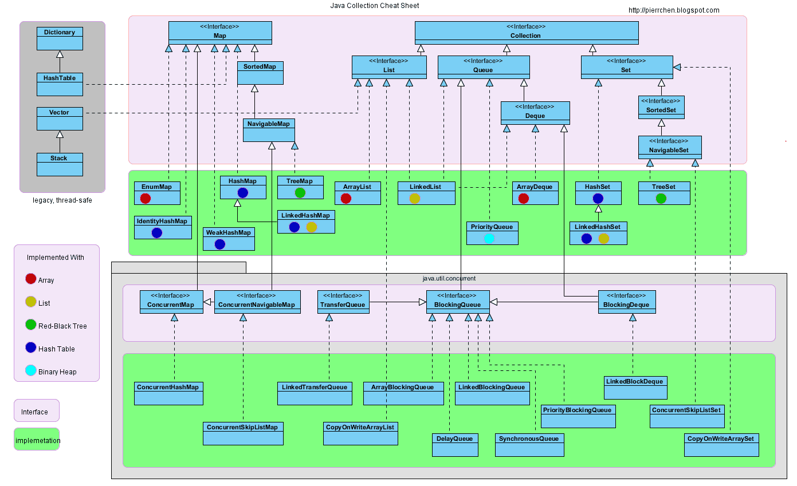
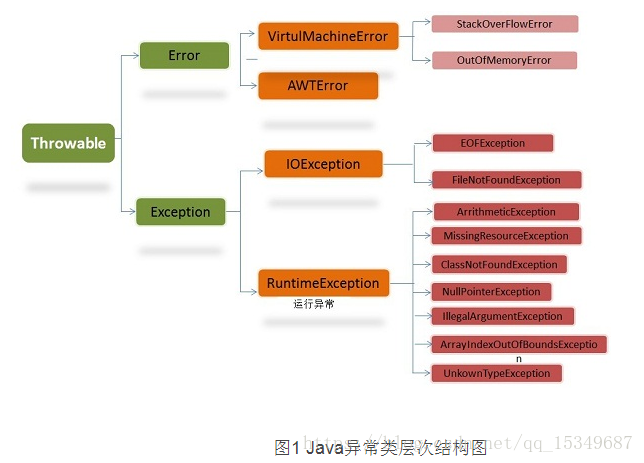

## Java面向对象编程的思想

程序员会把数据和过程分别作为独立的部分来考虑，数据代表问题空间中的客体，程序代码则用于处理这些数据，这种思维方式直接站在计算机的角度去抽象问题和解决问题，被称为面向过程的编程思想。

面向对象的编程思想则站在现实世界的角度去抽象和解决问题，它把数据和行为都看作对象的一部分，这样可以让程序员能以 符合现实世界的思维方式来编写和组织程序。


利用了类和对象的编程思想。万物皆可归类，类即世界上某种事物的抽象，不同事物之间有不同的关系。对象是具体的事物个体。

面向对象的三大特征

* 封装，定义一个类的属性和方法（行为），只对外提供必要的接口。提高代码的安全性、可维护性。
* 继承，从已封装的类中派生出新的类，形成父类子类的关系。沿用已有的属性和行为，并拓展新的特性。有利于代码的复用。
* 多态，指父类定义的同一个方法，由于继承扩展的方式的不同，不同的子类对象表现出不同的行为。因此多态的体现有三个前提：继承、重写、父类引用指向子类对象。多态的存在增加了代码的可移植性、健壮性。

## Java中的浮点型，为什么不建议精密计算领域使用浮点数

浮点型为Java中的数据类型，主要有：单精度`float`、双精度`double`

浮点型常量 Java的实常数有两种表示形式：

* 十进制数形式：由数字和小数点组成,且必须有小数点,如`0.123` , `123.0`

* 科学计数法形式：如:`123e3`或`123E3`,其中`e`或`E`之前必须有数字,且e或E后面的指数必须为**整数**（当然也包括负整数）。

> `E`是指数的意思，`E`代表的英文是`exponent`**，`E`表示10的多少次方的意思**。

### 单精度浮点数（float）

单精度浮点数在机内占`4`个字节、有效数字`8`位、表示范围：`-3.40E+38 ~ +3.40E+38

> 在Java语言当中，所有的浮点型字面值都默认当做`double`类型来处理，要想该字面值当做`float`类型来处理，需要在字面值后面添加`F/f`,或者强制装换为`float`。

### 双精度浮点数（double）

双精度浮点数在机内占`8`个字节、有效数字`16`位、表示范围：`-1.79E+308 ~ +1.79E+308`

### 浮点数的格式

浮点数在计算机中遵循 **IEEE 754 标准**。它们以二进制形式存储，具体包括：

- **符号位（sign bit）**：表示正负号。
- **指数（exponent）**：决定数值的规模。
- **尾数（mantissa 或 significand）**：表示精确的有效数字。

因此很多十进制的小数无法用有限的二进制精确表示，会产生近似值。

> 例如，`0.1` 在浮点数中会被表示为一个近似值：`0.10000000000000000555`。



### BigDecimal

通常不建议使用 浮点数（`float` 和 `double`） 来表示金钱或其他需要精确计算的数值，因为浮点数在存储和运算中存在 **精度问题** 和 **舍入误差**，这可能导致计算结果不准确。

`BigDecimal` 是 Java 提供的高精度数字处理类，适用于需要精确计算的场景（如金钱）。

> `BigDecimal` 的构造推荐使用字符串参数而不是 `double`，否则会带入浮点数的精度问题。

## String、StringBuffer 和 StringBuilder 的区别是什么？

String是只读字符串，它并不是基本数据类型，而是引用类型。底层源码来看是一个fifinal类型的字符数组。每一次+操作，都是在堆上new了一个跟原字符串相同的StringBuilder对象，再调用append方法拼接新的字符串。

StringBuffer与StringBuilder都继承了AbstractStringBulder类，AbstractStringBulder继承了CharSequence类，字符串操作效率比String更高。

StringBuffer的方法大多都加了 synchronized关键字，因此StringBuffer是线程安全的，Stringbuilder是非线程安全的，Stringbuilder比StringBuffer效率更高。

## ArrayList和LinkedList有什么区别

都实现了List接口

|          | ArrayList                                                    | LinkedList                                                   |
| -------- | ------------------------------------------------------------ | ------------------------------------------------------------ |
| 底层     | 数组                                                         | 链表                                                         |
| 随机访问 | 元素随机访问的时间复杂度为O(1)                               | 元素随机访问的时间复杂度为O(n)                               |
| 操作速度 | 删除数据后需要重排数组中的所有数据。<br />插入数据需要更新索引。<br />数组满的情况下添加数据需要重新创建新数组。最坏O(n) | 插入、添加、删除操作速度快。O(1)                             |
| 内存占用 | 每个索引存储实际的数据                                       | 占用更多的内存。<br />每个节点存储实际的数据和前后节点的位置<br />链表还需存储首节点和末节点的位置 |
| 适用场景 | 经常性查找元素                                               | 更频繁的增删元素操作                                         |

ArrayList底层是个数组。它可以以O(1)的时间复杂度对元素随机访问。

LinkedList以元素列表的形式存储数据。查找某个元素的时间复杂的是O(n)。插入、添加、删除操作速度比ArrayList快。每一个就节点存储两个引用，一个指向前一个元素，一个指向下一个元素，因此比ArrayList更占用内存。

## 高并发的Java容器框架中有什么问题



第一代，Vector和HashTable。线程安全，效率低。

第二代，使用ArrayList代替vector，HashMap代替HashTable。线程不安全，性能高。synchronizedList和synchronizedMap采用synchronized代码块锁，比起concurent包不够灵活

第三代，java.util.concurrent.*底层大都采用了Lock锁，保证线程安全的同时，性能也高。

## JDK1.8的新特性有哪些

* 接口的默认方法

  允许使用default关键字，扩展接口的方法。继承了这种接口的子类，可以直接使用该接口的默认方法无须实现。

* Lambda表达式

  简化与增加可读性

  ```java
  		List<Long> aList = new ArrayList<>();
          Collections.sort(aList, new Comparator<Long>() {
  
              @Override
              public int compare(Long o1, Long o2) {
                  return o2.compareTo(o1);
              }
          });
  		//简化后
          Collections.sort(aList, (o1, o2)->o2.compareTo(o1));
  ```

* 函数式接口

  指仅有一个抽象方法的接口。接口的其他方法可以由默认方法提前定义。一般搭配Lambda表达式使用。

  给接口加上@FunctionalInterface注解后，多于一个抽象方法时就会自动报错。

  内建的函数式接口：

  |                      | 输入     | 输出         |
  | -------------------- | -------- | ------------ |
  | Predicate判断接口    | 一个参数 | 返回boolean  |
  | Function转换数据接口 | 一个参数 | 返回一个结果 |
  | Supplier生产者接口   | 无       | 返回一个结果 |
  | Consumer消费者接口   | 一个参数 | 无           |

* Stream

  Stream操作分为中间操作和最终操作。最终操作返回特定类型的计算结果。

* Optional

  防止空指针异常的辅助类型

* LocalDate等时间类型

## Java接口和抽象类的区别

* 共同点

无法被实例化

都可以作为引用类型

* 语法上不同

抽象类的方法中存在抽象方法，其他都与类差不多。一个类只能继承一个类。

接口无构造器，所有方法都是public的抽象方法（JDK8中有默认方法），成员变量也只能是常量。一个类可以继承多个接口。

* 语义上不同

抽象类，更多描述现实世界中能理解的具体概念，如人、账单、牛、老师、公司等

接口，更多描述某一种行为特征，如会飞的、可汇总的、可抛出的等等

## hashcode和equals如何使用

### equal()

equal()源于java.lang.object，用于验证两个对象的逻辑相等性。若不重写则等同于`==`，比较对象引用是否相同；若重写，则看方法具体的逻辑。

### hashCode()

hashCode()源于java.lang.object，用于获取对象的唯一整数（散列码）。Object中的hashcode方法是本地方法，其他类可以重写hashcode方法。

### 散列表

散列表（哈希表），是一种根据关键码值（key value）进行直接访问的数据结构。通过码值映射，以加快查询速度。关键码值的映射函数称为散列函数（哈希函数）。在Java中hashCode()一般就是用来搭配与HashTable、HashMap、HashSet等散列表类一起使用的。

> 在java中，散列函数实际上是返回一个int整数。这个哈希码的作用就是用来确定该对象在哈希表中的索引位置。假如散列表是一个长度有限的数组，可能会出现哈希冲突（两个不同对象计算出来的哈希表索引位置相同）。链地址法就是一种解决哈希冲突的方法，位置重复的元素与旧元素通过equal()确定唯一性后，会接到旧元素的（前7后8）面。

散列函数的好处：

1. 去重插入快。只需通过哈希函数计算出对象的哈希值，然后找到散列表对应的位置存入即可，时间复杂度位O(1)，相同位置出现多个元素（冲突）才需要用到对比。无需逐个对比equals()，时间复杂度O(n)。
2. 查找快。通过哈希函数计算出对象的哈希值，快速定位。时间复杂度位O(1)。

### `hashCode()`和`equals()`之间的关系

`hashCode()`和`equals()`之间有一个必须遵守的重要契约或规范：

1. 一致性：如果两个对象通过`equals()`比较相等，那么它们的`hashCode()`必须返回相同的值。
2. 非必要性：如果两个对象的`hashCode()`相同，它们不一定通过`equals()`比较相等（哈希碰撞是允许的）。

在Java中，重写equals()时有必要重写hashcode()方法，但并不强制。

* 如果一个对象不往与hash有关的集合中放那么hashcode()方法写不写无所谓，相等的对象也可以有不一样的hashcode。
* 当哈希表需要查找或存储对象时：首先计算对象的`hashCode()`确定桶(bucket)位置。如果桶中有多个对象，再使用`equals()`进行精确匹配

总而言之，为了支持基于哈希的集合（如HashMap、HashSet）的高效工作。请按照上诉规范重写equals()和hashCode()。

## Java代理的几种实现方式

代理(Proxy)是一种设计模式。通过代理对象访问目标对象，同时可以扩展目标对象的功能。

### 静态代理

目标类（xxx）实现某个接口或继承某个类。代理类（xxxProxy）中也实现相同接口或继承相同父类。代理对象（xxxProxyBean）通过调用相同的方法来调用目标对象（xxxBean）的方法

```java
public static void main(String[] args){
	PersonDao p = new PersonDao();
    // p.update();
	PersonDaoProxy pProxy = new PersonDaoProxy(p);
	pProxy.update();// 代理对象的方法已在内部调用了被代理对象的方法
}
```

好处：在不修改被代理对象的功能前提下，完成对目标功能的扩展

缺点：需要代理的目标对象多，代理类也就写得多。

### 动态代理

* JDK-Proxy代理

所谓动态代理，是和静态相对应的。通过JDK提供的一个`Proxy.newProxyInstance()`运行期动态创建创建了一个"接口对象"，称为动态代理。

代理类所在包:`java.lang.reflect.Proxy`。JDK实现代理只需要使用一个关键的方法newProxyInstance，该方法需要接收三个参数。

```java
static Object newProxyInstance(ClassLoader loader, Class<?>[] interfaces,InvocationHandler h );
//注意该方法是在Proxy类中是静态方法,且接收的三个参数依次为:
//ClassLoader loader,:指定当前目标对象使用类加载器,获取加载器的方法是固定的
//Class<?>[] interfaces,:目标对象实现的接口的类型,使用泛型方式确认类型
//InvocationHandler h:事件处理,执行目标对象的方法时,会触发事件处理器的方法,会把当前执行目标对象的方法作为参数传入
```

简单的JDK动态代理例子：

```java
import java.lang.reflect.InvocationHandler;
import java.lang.reflect.Method;
import java.lang.reflect.Proxy;

public class Main {
    public static void main(String[] args) {
        InvocationHandler handler = new InvocationHandler() {
            @Override
            public Object invoke(Object proxy, Method method, Object[] args) throws Throwable {
                System.out.println(method);
                if (method.getName().equals("morning")) {
                    System.out.println("Good morning, " + args[0]);
                }
                return null;
            }
        };
        
        Hello hello = (Hello) Proxy.newProxyInstance(
            Hello.class.getClassLoader(), // 传入ClassLoader
            new Class[] { Hello.class }, // 传入要实现的接口
            handler); // 传入处理调用方法的InvocationHandler
        
        hello.morning("Bob");
    }
}

interface Hello {
    void morning(String name);
}

```

其实就是JVM帮我们自动编写了一个上述类（不需要源码，可以直接生成字节码），并不存在可以直接实例化接口的黑魔法。

* CGLIB动态代理

## Java中==和equals()有哪些区别

`==`：如果比较的是基本数据类型，则比较数值是否相等。如果比较的是引用数据类型，则比较引用的地址值是否相等。

`equals()`：属于Object类的方法，无法比较基本数据类型。用来确定两个对象是否具有逻辑一致性。如果不重写则等同于`==`，比较引用的地址值是否相等。

## Java的异常处理机制

### 异常

异常是一个中断程序正常指令流的事件。

Error和RuntimeException属于**不可查异常**，编译器无法预计或察觉，语法上也允许忽略。

其余异常为**可查异常**，编译器会进行检查，并强制程序设计者进行捕获或声明。



### 异常处理机制

这个机制简单地说，异常总是先被抛出，后被捕捉的。      

* 抛出异常。
  * 当一个方法出现错误引发异常时，方法会创建异常对象并交付运行时系统。
  * 用`throw`关键字，也可以手动抛出一个异常对象。
  * `throws`关键字，接在方法声明末尾用于声明该方法可能抛出的异常，当异常出现将异常抛给上一级。因此语法上方法里面的可查异常可以不需要捕捉。
* 捕捉异常。在方法抛出异常之后，运行时系统将转为寻找合适的异常处理器（exception handler）。
  * `try`关键字，用于监听try语句块内可能会抛出异常的代码。抛出异常后控制流将转移到相应的`catch`块
  * `catch` 关键字用于捕获特定异常作特定处理，常用于访问异常对象并获取详细信息`e.getMessage()`或者`e.printStackTrace()`。
  * `finally`关键字用于确保无论是否发生异常，某些代码总会被执行，常用于资源释放。


## 重载和重写的区别

重载：在同一个类中，声明了方法名相同，而参数个数或参数类型不同的新方法。重载后的方法与原方法可能有语义上的同源性，但程序中无实质关联。

重写：基于继承，子类对父类的方法进行新的实现。重写时，可以提升不能降低修饰符的权限，可以缩小不能扩大甚至改变返回值类型和抛出异常类型。

## String、StringBuffer、StringBuilder的区别及使用场景

String：只读字符串。String引用类型引用的字符串对象时无法修改的。

StringBuffer和StringBuilder：引用的字符串对象能够被修改，是因为其底层原理都是数组的扩充。其特性都继承于AbstractStringBuilder。

```java
abstract class AbstractStringBuilder implements Appendable, CharSequence {
    
    char value[];
   
    int count;
}
```

StringBuffer：每个方法都加了Synchronized锁，线程安全，效率低。

StringBuilder：在jdk1.5中引进，线程不安全，效率高。

## 如何声明一个类无法继承

`final`关键字修饰类，类将无法拥有子类，无法被其他类继承。

假如这个类有些方法无需重写，可以用`final`修饰这些方法。

假如这个类的所有方法都无需重写，无需子类继承，可以用`final`修饰类。例如有关数学计算的Math类。

通常情况，既然类的方法已然确定，可以将构造器私有，不允许外界创建对象，直接通过`static`关键字修饰所有方法，通过类来调用方法或获取属性。

## 自定义异常在生产中如何应用

* 系统中有些错误是符合Java的语法，但不符合业务逻辑。
* 通常在表现层统一对系统的持久层和中间逻辑层的异常进行捕获处理

## stream API

### flatMap

```java
List<Klass> result3 = groupList.stream()
        .flatMap(it -> it.getKlassList().stream())
        .collect(Collectors.toList());

stream api 的 flatMap方法接受一个lambda表达式函数， 函数的返回值必须也是一个stream类型，flatMap方法最终会把所有返回的stream合并，map方法做不到这一点，如果用map去实现，会变成这样一个东西

List<Stream<Klass>> result3 = groupList.stream()
        .map(it -> it.getKlassList().stream())
        .collect(Collectors.toList());
```

## 常用工具方法

### 合并数组

```java
    private String[] insertArr(String[] arr, int index, List<String> list) {
        String[] newArr = new String[arr.length + list.size()];
        for (int j = 0; j < newArr.length; j++) {
            if (j < index ) {
                newArr[j] = arr[j];
            } else if (j < list.size() + index) {
                newArr[j] = list.get(j - index);
            } else {
                newArr[j] = arr[j - list.size()];
            }
        }
        return newArr;
    }
```

### 数组分页

```java
    /**
    * 按指定大小，分隔集合，将集合按规定个数分为n个部分
    */
    public static <T> List<List<T>> splitList(List<T> list, int len) {
        if (list == null || list.isEmpty() || len < 1) {
            return Collections.emptyList();
        }
        List<List<T>> result = new ArrayList<>();
        int size = list.size();
        int count = (size + len - 1) / len;
        for (int i = 0; i < count; i++) {
            List<T> subList = list.subList(i * len, ((i + 1) * len > size ? size : len * (i + 1)));
            result.add(subList);
        }
        return result;
    }
```

### 下划线<->驼峰

```java
	/** 下划线转驼峰 */
	public static String lineToHump(String str) {
		str = str.toLowerCase();
		Matcher matcher = linePattern.matcher(str);
		StringBuffer sb = new StringBuffer();
		while (matcher.find()) {
			matcher.appendReplacement(sb, matcher.group(1).toUpperCase());
		}
		matcher.appendTail(sb);
		return sb.toString();
	}
	
	/** 驼峰转下划线,效率比上面高 */
	public static String humpToLine2(String str) {
		Matcher matcher = humpPattern.matcher(str);
		StringBuffer sb = new StringBuffer();
		while (matcher.find()) {
			matcher.appendReplacement(sb, "_" + matcher.group(0).toLowerCase());
		}
		matcher.appendTail(sb);
		return sb.toString();
	}
```


## SSL证书验证

在Java中进行网络请求时出现"sun.security.validator.ValidatorException: PKIX path building failed"错误通常是由于[SSL证书](https://so.csdn.net/so/search?q=SSL证书&spm=1001.2101.3001.7020)验证失败引起的。一般原因是：证书链不完整或证书不受信任

> Java对SSL证书的信任链有严格的要求。即使URL在浏览器中可访问，但如果SSL证书不在Java的信任库中，Java程序仍然可能会出现证书验证错误，导致无法建立安全连接。

解决：证书添加Java信任库

```shell
keytool -import -alias aliDatahub -file "C:\Users\12822\Desktop\sny.crt" -keystore "%JAVA_HOME%\jre\lib\security\cacerts" -storepass changeit
```

# 多线程

## ThreadLocal

```java
public static void main(String[] args) {

    Thread thread1 = new Thread(() -  {
        ThreadLocal<Object  threadLocal = new ThreadLocal< ();
        threadLocal.set("localValue thread1");
        System.out.println(threadLocal.get());
        threadLocal.remove();
    });

    ThreadLocal threadLocal = new ThreadLocal();
    threadLocal.set("localValue main");
    System.out.println(threadLocal.get());
    threadLocal.remove();

    thread1.start();
}
```

ThreadLocal.set()方法

```java
public void set(T value) {
    Thread t = Thread.currentThread();
    ThreadLocalMap map = getMap(t); //获取当前线程的 ThreadLocalMap变量
    if (map != null) {
        map.set(this, value);
    } else {
        createMap(t, value);
    }
}
```

Thread类的ThreadLocal.ThreadLocalMap成员变量

```java
/* ThreadLocal values pertaining to this thread. This map is maintained
 * by the ThreadLocal class. */
ThreadLocal.ThreadLocalMap threadLocals = null;

/*
 * InheritableThreadLocal values pertaining to this thread. This map is
 * maintained by the InheritableThreadLocal class.
 */
ThreadLocal.ThreadLocalMap inheritableThreadLocals = null;
```

ThreadLocalMap是类似于Map 的数据结构 。key 为当前对象 的 Thread 对象，值为 Object 对象。


# Spring

## 组件扫描时 use-default-filters="false"的正确理解

在spring配置中

```xml
<!--开启组件扫描-- 
    <!--此处可以不设置use-default-filters 默认为true
    即使用默认的 Filter 进行包扫描，而默认的 Filter 对标有 @Component、@Repository、@Service和@Controller 的注解的类进行扫描-- 
    <context:component-scan base-package="com.tintin" use-default-filters="true" 
        <context:exclude-filter type="annotation" expression="org.springframework.stereotype.Controller"/ 
    </context:component-scan 
```

在springMVC配置中

```xml
<!--开启组件扫描 只扫描带有Controller注释的类-- 
	<!--此处设置use-default-filters="false" 搭配 include-filter 可以实现更加自由地指定哪些注解由扫描器扫描-- 
    <!--springmvc容器中的类可以引用spring ioc中的类反过来则不行-- 
    <context:component-scan base-package="com.tintin" use-default-filters="false" 
        <context:include-filter type="annotation" expression="org.springframework.stereotype.Controller"/ 
    </context:component-scan 
```

# SpringCloud

[Spring](https://so.csdn.net/so/search?q=Spring&spm=1001.2101.3001.7020) Cloud Alibaba 致力于提供分布式应用服务开发的一站式解决方案。项目包含开发分布式应用服务的必需组件，方便开发者通过 Spring Cloud 编程模型轻松使用这些组件来开发分布式应用服务。

Sentinel：把流量作为切入点，从流量控制、熔断降级、系统负载保护等多个维度保护服务的稳定性。

**Nacos：一个更易于构建云原生应用的动态服务发现、配置管理和服务管理平台。**

RocketMQ：一款开源的分布式消息系统，基于高可用分布式集群技术，提供低延时的、高可靠的消息发布与订阅服务。

Dubbo：Apache Dubbo™ 是一款高性能 Java RPC 框架。

Seata：阿里巴巴开源产品，一个易于使用的高性能微服务分布式事务解决方案。

Alibaba Cloud ACM：一款在分布式架构环境中对应用配置进行集中管理和推送的应用配置中心产品。

Alibaba Cloud OSS: 阿里云对象存储服务（Object Storage Service，简称 OSS），是阿里云提供的海量、安全、低成本、高可靠的云存储服务。您可以在任何应用、任何时间、任何地点存储和访问任意类型的数据。

Alibaba Cloud SchedulerX: 阿里中间件团队开发的一款分布式任务调度产品，提供秒级、精准、高可靠、高可用的定时（基于 Cron 表达式）任务调度服务。

Alibaba Cloud SMS: 覆盖全球的短信服务，友好、高效、智能的互联化通讯能力，帮助企业迅速搭建客户触达通道。

阿里巴巴提供的方案跟Spring官方提供的方案有一些对应关系：

Nacos = Eureka/Consule + Config + Admin

Sentinel = Hystrix + Dashboard + Turbine

Dubbo = Ribbon + Feign

RocketMQ = RabbitMQ

Schedulerx = Quartz

## Nacos

**nacos支持MySQL8吗_nacos mysql8.0修改**

提示无法连接数据库，检查配置的数据库连接确认无误。

conf/application.proporties

spring.datasource.platform=mysql

db.num=1

db.url.0=jdbc:mysql://localhost:3306/nacos_config?useUnicode=true&useJDBCCompliantTimezoneShift=true&useLegacyDatetimeCode=false&serverTimezone=UTC

db.user=root

db.password=123456

在nacos安装目录下新建plugins/mysql文件夹，并放入8.0+版本的mysql-connector-java-8.0.xx.jar，重启nacos即可。

启动时会提示更换了mysql的driver-class类。

nacos mysql8.0修改

**nacos Unable to start web server; nested exception is org.springframework.boot.web.server.WebServerE      解决  ：set MODE="cluster" 改为 set MODE="standalone"  或 startup.cmd -m standalone 启动**


# SpringBoot

## springboot项目找不到对应控制器错误

对于springboot项目，新增的包文件需要放在启动类的同级包下。

