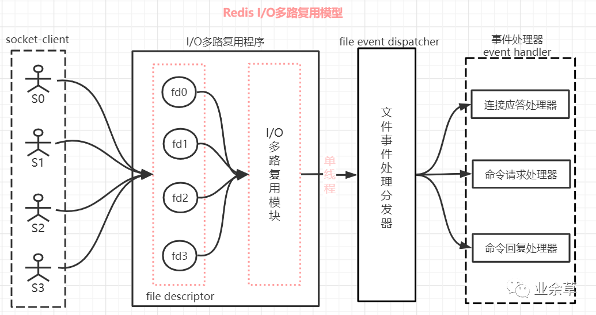
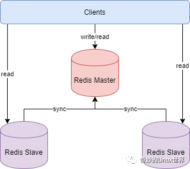
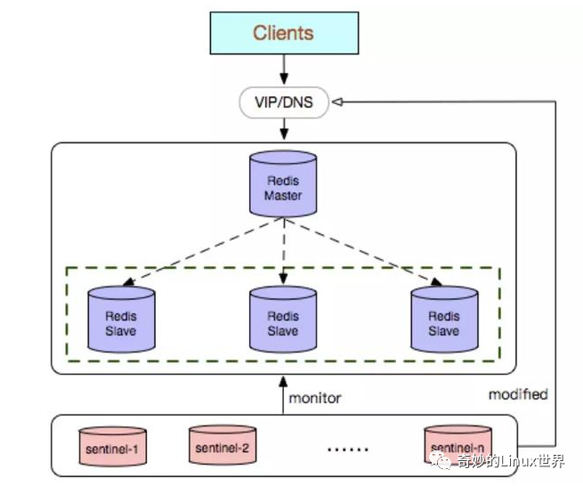
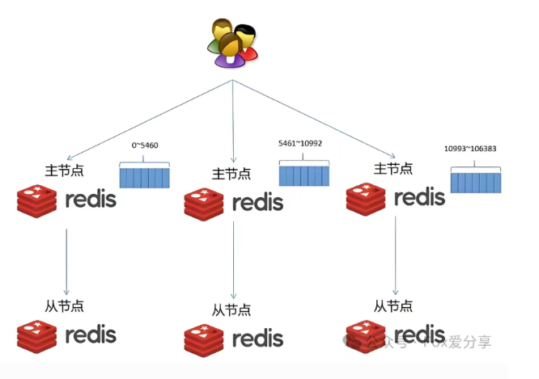
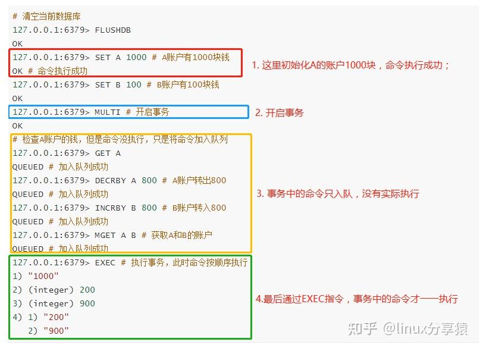
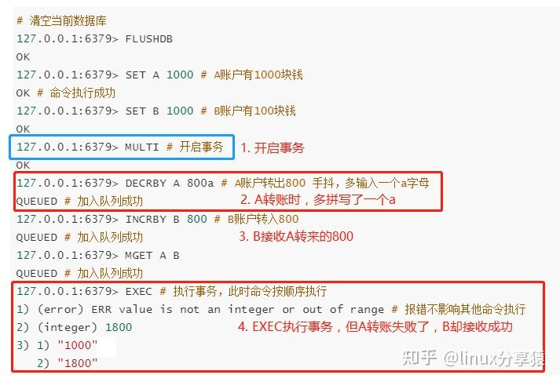
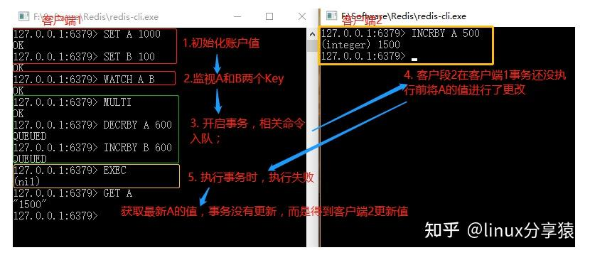

## Redis是多线程还是单线程

4版本之前是单线程。Redis 的核心逻辑（网络IO、命令处理、数据操作）由单个主线程完成。

从4开始慢慢支持多线程。启动少量后台线程处理非核心任务，如RDB持久化、AOF重写、异步删除。

直到redis6/7开始全面支持多线程。多个线程处理网络IO，解决Redis网络IO上的性能瓶颈。但命令处理、数据操作仍由主线程专属负责。

## Redis为什么一开始选用单线程

主要是指Redis的网络IO和键值对读写是由一个线程来完成的。

* 开发维护简单，无需设计复杂的同步机制
* 避免了多线程模型中的上下文切换和锁竞争问题导致的性能消耗
* 对于redis系统，主要的性能瓶颈是内存/网络带宽，而非CPU。
* 虽然是单线程，但也可以并发处理多客户端的请求（IO多路复用和非阻塞IO）

## Redis为什么快

Redis 单线程时代快的原因：

- **基于内存操作**：Redis的所有数据都存在内存中，因此所有的运算都是内存级别的，读写不涉及磁盘IO，所以他的性能比较高。
- **数据结构简单**：Redis专门设计多种高效的数据结构，而这些简单的数据结构的查找和操作的时间大部分复杂度都是O(1)，因此性能比较高。
- **IO 多路复用**：Redis使用多路复用功能（Linux中的epoll）来监听多个非阻塞式socket连接客户端，这样就可以使用一个线程连接来处理多个请求。
- **避免上下文切换**：因为是单线程模型，因此就避免了不必要的上下文切换和多线程锁竞争，这就省去了多线程切换和考虑锁问题带来的时间和性能上的消耗。

## 什么是I/O多路复用技术

- **阻塞 I/O (BIO)** : 一个连接一个线程，线程在等待数据的网络传输时被挂起 (`block`)。
- **非阻塞 I/O (NIO)** : 主线程不断地轮询 (polling) 所有连接。虽然不会被阻塞，但大量的轮询会消耗巨量 CPU，做了很多无用功。
- **I/O 多路复用**：这里“多路”指的是多个网络连接客户端，“复用”指的是复用同一个线程(主线程)。只有当连接真正有数据时，才会通知主线程去处理。从而就不会出现 I/O 堵塞的问题，提高了网络通信的性能。

实现原理：

1. 客户端与Redis服务端建立连接时，会生成套接字描述符(文件描述符的一种)。
2. Redis将所有的套接字描述符全部注册在**I/O 多路复用程序**的监听队列中。将客户端的命令（read、write 等操作）封装成一个个事件，并绑定到对应的套接字描述符上。此步骤可以在多线程下进行。
3. **文件事件处理器**是在单线程上运行的，但可以通过I/O 多路复用程序模块可以同时对多个套接字描述符进行监控，当其中一个 client 端达到写或读的状态，文件事件处理器就马上执行。



## Redis持久化机制有哪些

RDB持久化：指定时间间隔对数据进行快照。

优点：

* 文件紧凑，易于传输。
* 可以恢复各个时间点的数据，适合备份。
* 使用多进程COW(Copy On Write)机制。fork()产生一个子进程进行持久化，父进程继续处理读写请求，且子进程与父进程共享大部分的内存空间，只有写入被标记的数据才会复制，以此尽量不影响redis性能。
* 存储的使二进制数据，恢复速度快。

缺点：

* 无法实时保存，数据丢失率高。
* 数据集过大时，fork子进程的过程非常耗时。

AOF持久化：记录每次服务器的写操作，重启服务器时重写执行这些命令来恢复原始数据。可以进行后台重写，减少AOF文件体积。

优点：

* 故障的数据丢失率很低。丢失率与fsync（类似于UNIX传统操作系统磁盘I/O的缓冲延迟写）的策略有关，丢失率：no>everysec >always
* 可以AOF重写，使日志文件变小。
* 有序的保存了所有写入操作。

缺点：

* AOF文件大于RDB文件的体积，记录的文本形式的命令操作，恢复时间比较长。
* Redis开启AOF持久化的，由于频繁的I/O操作，Redis读写性能通常情况下会慢于RDB。fsync策略对应读写性能：no>everysec >always

4.x版本的混合策略

同时开启RDB和AOF后，AOF重写文件时，以 RDB 格式保存当前数据状态，然后继续AOF格式记录新的写操作。恢复时，先RDB恢复再执行增量的命令。

## Redi的过期键有哪些删除策略

过期时间设置类型：

* 设置经过指定时间段后移除

```shell
#设置 key 秒级精度的过期时间
EXPIRE key seconds
# 设置 key 毫秒级精度的过期时间
PEXPIRE key milliseconds
```

* 设置指定Unix时间戳来临后移除

```shell
#设置 key 秒级精度的过期时间戳(unix timestamp)
EXPIREAT key seconds_timestamp
# 设置 key 毫秒级精度的过期时间戳(unix timestamp) 以毫秒计
PEXPIREAT key milliseconds_timestamp
```

如何淘汰过期的keys：

* 定期主动式。提取样本判断，若多于25%的keys过期，则删除所有已过期的keys
* 惰性被动式。当客户端尝试访问keys时，keys过期则删除。

## Redis的内存回收机制有哪些

当内存不足执行写入操作时：

1. allkeys-lru：在所有键中移除最近最少使用的键。（最常用的）
2. volatile-lru：在有过期时间的键中移除最近最少使用的键。前提：回收足已容纳新添加数据的空间
3. allkeys-random：从所有键中随机回收。
4. volatile-random：从有过期时间的键中随机回收。
5. allkeys-lfu：在所有键中移除最不常使用的键。
6. volatile-lfu：在有过期时间的键中移除最不常使用的键。
7. volatile-ttl：在有过期时间的键中移除最早过期的键。
8. noeviction：返回一个错误。（默认选项，一般不选用）

> 回收范围：allkeys所有键 volatile有过期时间的键
>
> 回收策略：lru最近最少使用  lfu最不常使用 random随机 ttl最早过期
>
> 对于volatile-xx的回收机制，若没有足够键回收来容纳新添加的数据，则和noeviction差不多。

## Redis的集群方案有哪些

**主从复制集群**

架构：一主（Master）多从（Slave）。主节点处理写操作，从节点异步复制主节点数据，并承担读请求。

好处：提高数据冗余、防止数据丢失。适合读多写少的场景。

同步原理：	

1. Slave启动（首次连接）后向Master发送sync/psync命令
2. Master执行BGSAVE生成RDB快照并发送给Slave（全量同步）
3. 同步期间及之后，Master 将收到的写命令缓冲并异步发送给 Slave 执行（增量同步）
4. 当连接断开重新连接，Redis2.8之前sync命令直接全量同步，Redis2.8之后psync命令会尝试部分重同步，当无法部分重同步时再进行全量同步。



哨兵式基于主从复制模式，只是引入了哨兵来监控与自动处理故障，Master 宕机后，无需手动干预，自动切换 Slave 为新的 Master，大大降低服务中断时间。



**分片集群**

客户端实现路由索引的分片集群

使用中间件代理层的分片集群

redis的cluster的分片集群

架构：采用去中心化设计，数据分片存储在多个主节点上，每个主节点又有对应的从节点。主节点故障时，从节点自动接替。

好处：高存储量（分片存储）、高性能（多主节点同时处理读写）、高可用（自动故障转移）



## Redis事务如何实现

### 事务

事务的本质是一组命令的集合，同时满足具有四个特性。

### 事务的四个基本特性

* **原子性**。事务是最小的执行单位，不允许分割。事务的所有操作要么一起成功，要么一起失败（回滚）。
* **一致性**。事务执行前后的状态一致，数据的完整性约束不会被破坏
* **持久性**。事务一旦提交，数据就已经永久保存无法回滚。
* **隔离性**。多个并发事务之间的操作互不干扰。实际生产上采取不同程度的隔离级别来解决数据脏读、不可重复读、幻读问题。

### 事务的四大隔离级别

- **READ UNCOMMITTED（未提交读）**：允许一个事务读取另一个事务未提交的数据，可能会导致脏读。
- **READ COMMITTED（已提交读）**：只能读取已提交的数据，避免了脏读，但可能会出现不可重复读。
- **REPEATABLE READ（可重复读）**：确保在同一个事务中多次读取同一数据的结果是一致的，避免了不可重复读，但可能会出现幻读。
- **SERIALIZABLE（序列化）**：最高级别的隔离，事务完全串行化执行，避免了脏读、不可重复读和幻读，但性能开销最大。

### Redis事务

相关命令：

- MULTI ：开启事务，redis会将后续的命令逐个放入队列中，然后使用EXEC命令来原子化执行这个命令系列。
- EXEC：执行事务中的所有操作命令。
- DISCARD：取消事务，放弃执行事务块中的所有命令。
- WATCH：监视一个或多个key,如果事务在执行前，这个key(或多个key)被其他命令修改，则事务被中断，不会执行事务中的任何命令。
- UNWATCH：取消WATCH对所有key的监视。

Redis事务没有隔离级别，事务期间的命令没有执行，而是加入队列，当执行EXEC命令时，所有命令才会序列化、按顺序的执行，不会有其他事务打扰。



Redis事务不保证原子性，当执行EXEC命令时，所有命令一定会被执行，当某个命令报错失败不会影响其他命令执行，也不支持回滚。因为Redis认为命令的失败大部分是错误的语法引起的，应该在开发过程中被发现，不应该出现在生产环境。同时Redis内部可以保持简单且快速。



些许原子性的体现：

1. 执行EXEC命令之前出现语法错误或者用DISCARD放弃事务，事务会被取消。
2. 使用WATCH命令实现乐观锁。如果监视的Key的值改变，事务最终会执行失败。



## 缓存带来的问题以及解决方法

### 缓存穿透

缓存和数据库都不存在数据。用户每次请求都会去查询数据库，由于没有数据也不会产生缓存，高并发的情况下，数据库可能因为访问压力而挂掉。

解决方法： 

1. 接口检验参数。例如，用户编号不可能是小于1或极大的数字，应该限制无法请求。杜绝一切非法请求。
2. 布隆过滤器。底层是一个bit数组。为数据库中所有的key根据hash算法计算出其在数组的位置，设为1。当请求过来时，通过相同的hash算法找到对应元素值，1则继续，0则拒绝。
3. 直接缓存空值。查询时数据库不管有无数据，都要存入缓存。

### 缓存击穿

缓存中没有但数据库中有的数据（一般是缓存时间到期），这时由于并发用户特别多，同时读缓存没读到数据，又同时去数据库去取数据，引起数据库压力瞬间增大。

解决方法： 

1. 设置热点数据永远不过期。
2. 接口限流与熔断，降级。
3. 加互斥锁。第一个尝试获取缓存的线程，加锁并从数据库中获取数据，存入缓存。其他线程在锁没释放前进行等待一定时间后重试获取数据。

### 缓存雪崩

缓存中数据大批量到过期时间，查询数据量巨大，引起数据库压力过大甚至down机。

解决方法： 

1. 设置热点数据永远不过期。
2. 缓存数据过期时间设置随机
3. 分布式部署的redis，将热点数据均匀分布至不同缓存数据库中。

