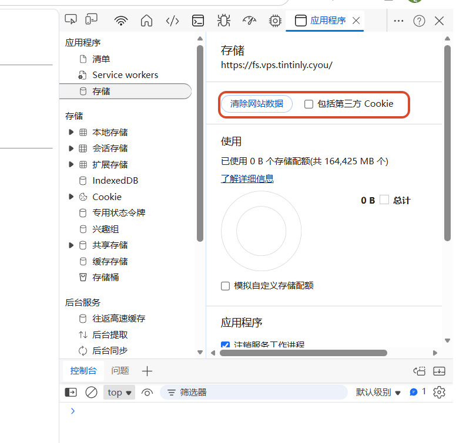
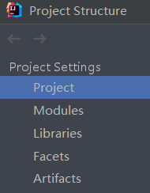
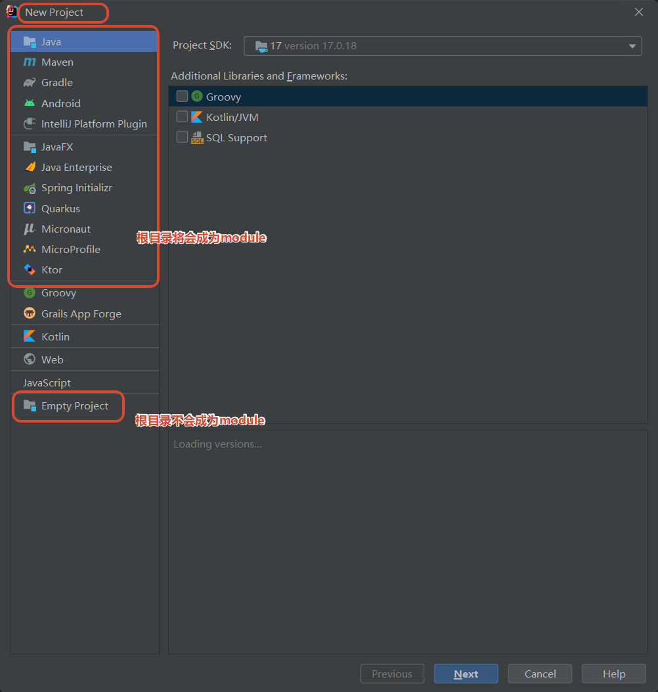
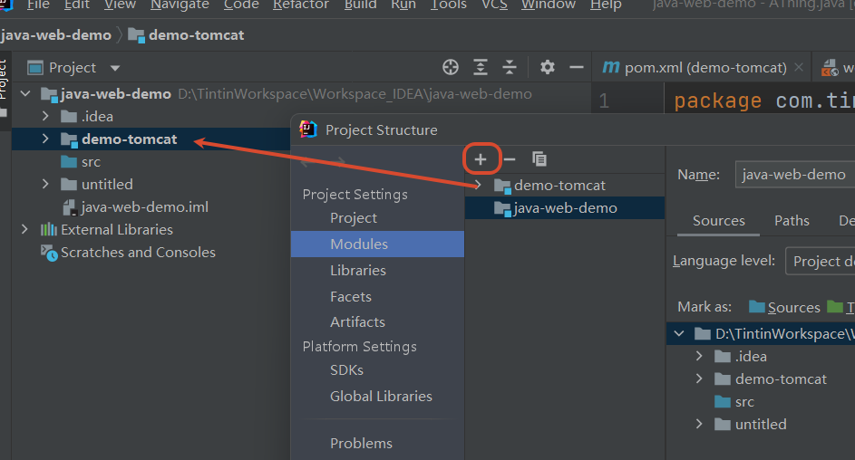
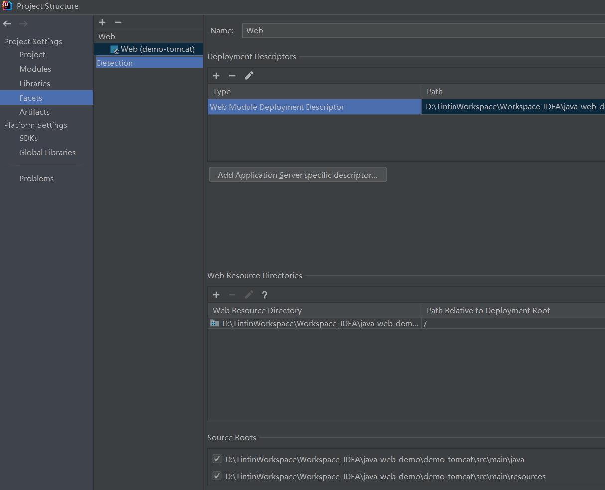
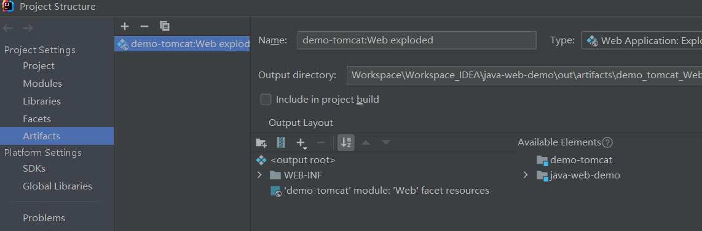

# Microsoft Edge

## 清理某网站页面缓存

> 打开 浏览器 **开发者工具** → 选择 **存储** 标签页 → 在侧栏应用程序分类下 点击 **清除站点数据**

同样适用 Chorme



# Chrome

## Chrome 139+无法安装老旧扩展问题

2025 年 6 月起，Chrome 139 版分支将彻底移除对 Manifest V2 扩展的支持。由于 Chrome 强制推行 Manifest V3，会导致 139 版本会显示 这些扩展程序不再受支持的报错；那么如何解决这个问题呢？ 受影响的插件有 Tampermonkey 、 uBlock Origin 等。


解决方法 1：

```
chrome://flags/*#extension-manifest-v2-deprecation-warning*  设置为[Disabled] 

chrome://flags/*#extension-manifest-v2-deprecation-disabled*  设置为[Disabled] 

chrome://flags/*#extension-manifest-v2-deprecation-unsupported*  设置为[Disabled] 

chrome://flags/*#allow-legacy-mv2-extensions*  设置为[Enabled]
```

解决方法 2：更换 edge

## Chrome 142+无法安装老旧扩展问题

软件属性添加启动参数 --disable-features = ExtensionManifestV2Unsupported, ExtensionManifestV2Disabled


# Windows

## Windows 本地用户空白密码不允许远程登陆问题


解决：win+r 运行 secpol.msc 本地安全策略，依次选择 **安全设置**-> **本地策略 -> 安全选项**，在右侧选中 **帐户: 使用空白密码的本地帐户只允许进行控制台登录** 双击进行编辑禁用


## Windows11 切换应用时，输入法自动变为中文的问题


如果不行那就打开 win10 输入兼容


## Windows11 无法下载并启用实时字幕

先要以下两个下载依赖项


# Intellij IDEA

## idea 中 artifacts、facets、modules



Module 是模块概念。

首先是最外层的文件夹可能只是一个普通文件夹，但如果希望它（最外层文件夹）也包含代码，就必须将其添加为Module，这通常在一开始new -> project时就完成了，除非你创建的是一个 empty project。



此外创建新的 module，需要为他指定文件夹，通常是会在目录下新建一个文件夹，并有模块标识，在这可以包含新的代码。



Facets 表述了在 Module 中使用的各种各样的框架、技术和语言，这些 Facets 让 Intellij IDEA 知道怎么对待 module 内容，并保证与相应的框架和语言保持一致。Facets  的作用就是配置项目框架类支持，如果在新建项目时使用模板来创建，Idea将会自动完成这些配置。

例如，我们现在要开发的是一个 web 项目，那就需要 web 相关的 Facet，如果没有这个配置支持，编译器也不知道这个项目是个 web 项目，也就不会去读取 web.xml 的配置，更无法被 tomcat 这种容器支持，这时我们就需要手动为他指定 web.xml的位置。



Artifacts 是 maven 中的一个概念，表示某个 module 要如何打包。它的作用是整合编译后的 java 文件，资源文件等，有不同的整合方式，比如war、jar、war exploded 等，对于 Module 而言，有了 Artifact 就可以部署到 web 容器中了。其中 war 和 war exploded 区别就是后者不压缩，开发时选后者便于看到修改文件后的效果。

