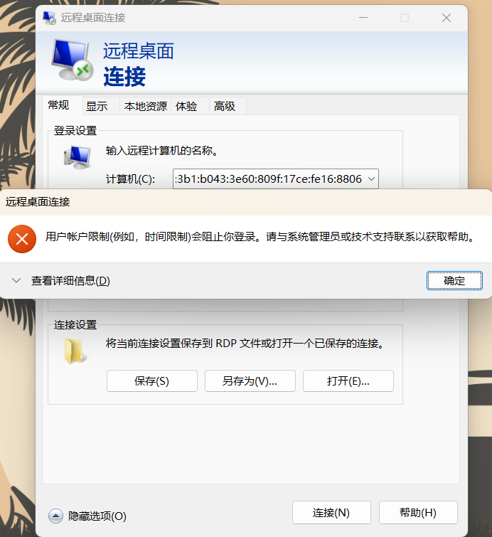
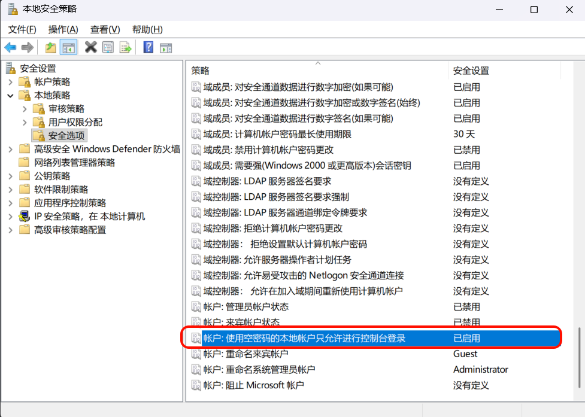
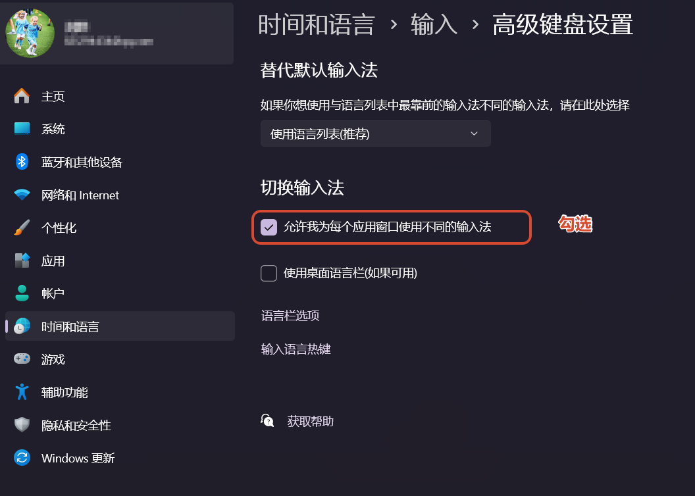
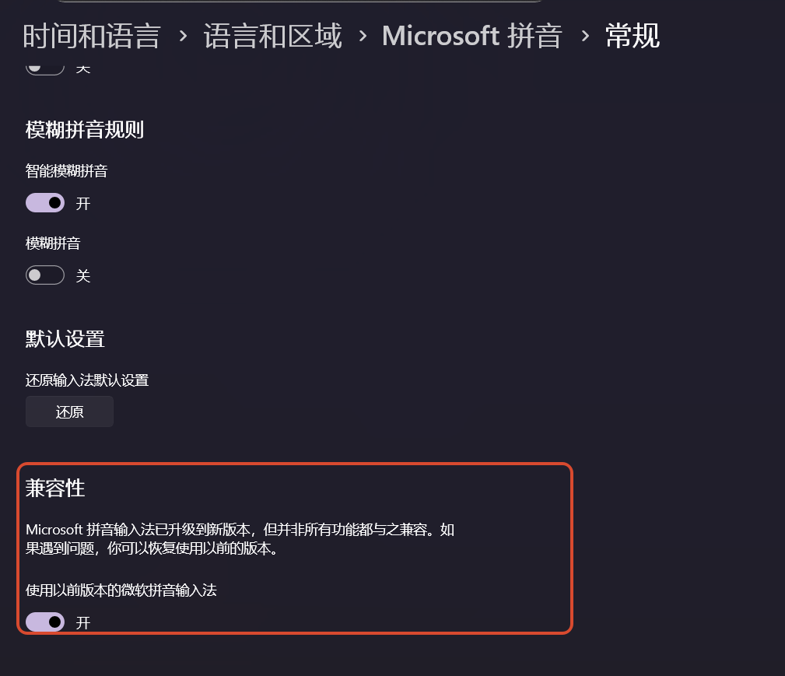
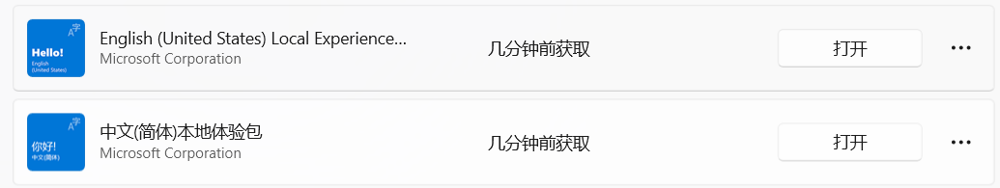

# Chrome


## Chrome 139+无法安装老旧扩展问题

2025 年 6 月起，Chrome 139 版分支将彻底移除对 Manifest V2 扩展的支持。由于Chrome强制推行 Manifest V3，会导致139版本会显示 这些扩展程序不再受支持的报错；那么如何解决这个问题呢？ 受影响的插件有 Tampermonkey 、 uBlock Origin 等。


解决方法1：

```
chrome://flags/*#extension-manifest-v2-deprecation-warning*  设置为[Disabled] 

chrome://flags/*#extension-manifest-v2-deprecation-disabled*  设置为[Disabled] 

chrome://flags/*#extension-manifest-v2-deprecation-unsupported*  设置为[Disabled] 

chrome://flags/*#allow-legacy-mv2-extensions*  设置为[Enabled]
```

解决方法2：更换edge

## Chrome 142+无法安装老旧扩展问题

软件属性添加启动参数 --disable-features=ExtensionManifestV2Unsupported,ExtensionManifestV2Disabled


# Windows

## Windows本地用户空白密码不允许远程登陆问题



解决：win+r运行secpol.msc本地安全策略，依次选择**安全设置**->**本地策略 -> 安全选项**，在右侧选中**帐户: 使用空白密码的本地帐户只允许进行控制台登录**双击进行编辑禁用



## Windows11切换应用时，输入法自动变为中文的问题



如果不行那就打开win10输入兼容



## Windows11 无法下载并启用实时字幕

先要以下两个下载依赖项

