# 随身wifi刷机移植去控

## 影腾卡 移植 纽曼4g电源机

一、切换自己的手机流量卡

1、电脑或手机连接随身WIFI的网络。


2、浏览器中输入纽曼随身WIFI的管理IP：http://192.168.0.1/，输入密码admin登陆管理后台。


3、点击高级设置--其他--SIM卡选择--启动卡--外插卡--应用--SIM卡解锁--输入解锁码：az952#

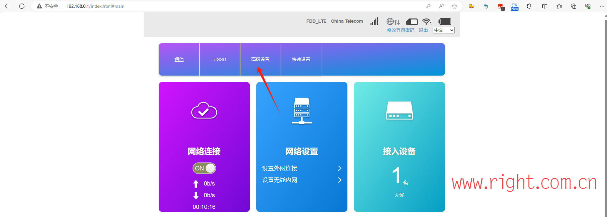 

4、我完成切卡之后，装入自己的电信卡就可以使用了。

二、去后门

1、下载、安装随身WIFI助手软件

2、随身WIFI用数据线连接电脑

3、开启adb


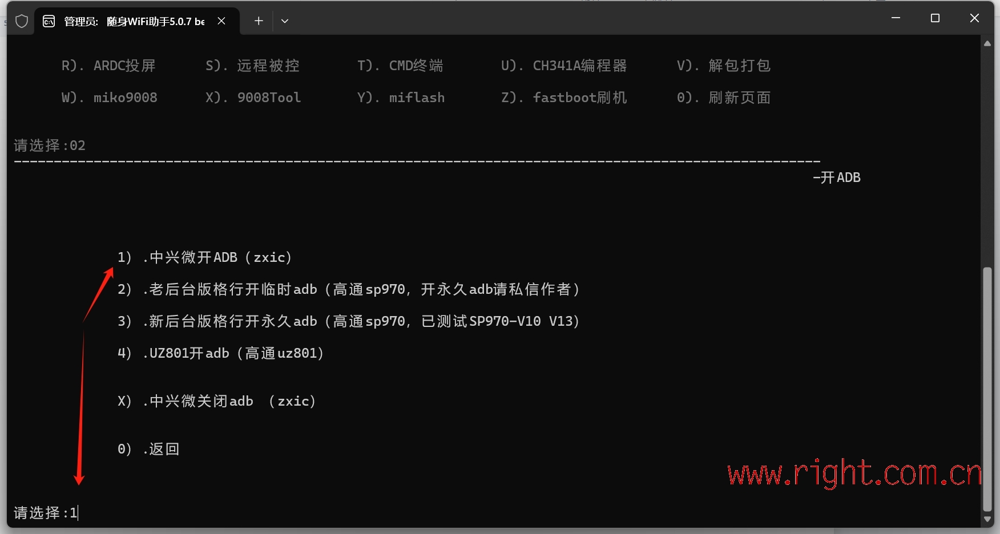

4、根据提示完成ADB开启

5、选择中兴微入口


6、选择中兴微去后门


7、成功后会有大功告成的提示

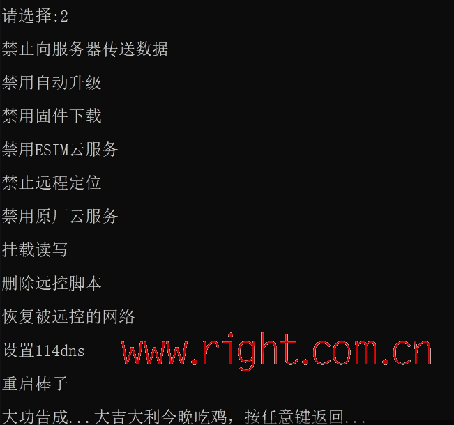

二、改串号

1、打开高级设置--其他，按键盘F12打开控制台，输入：$("*").show()

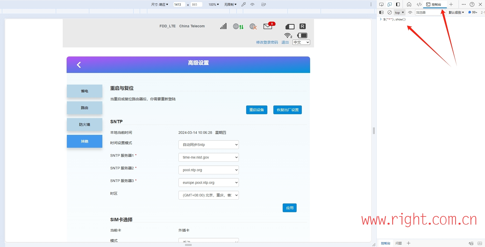

2、输入AT命令： AT+MODIMEI=串号 （如果失败，先输入AT+ZMODE=1重启再输入改串指令）重启设备   AT+CGSN查询 AT+ZMODE=1重启

影腾y1 4g-1 : 860040068904999

影腾y1 4g-2 : 860184060051480


### 5G手机插卡

### 5G随身wifi插卡

### 设备 连接路由器实现类cte设备

### 短信转发实现


# 路由器刷机

## 小米路由器 r3g 刷 x-wrt系统

> 转自:[小米路由器r3g刷机（X-Wrt） - 知乎 (zhihu.com)](https://zhuanlan.zhihu.com/p/664969920)

起因是坤大的校园网吃相变的相当难看，倒逼我们另寻出路。我得想法是使用旧手机（4g，宿舍5g信号差）+流量卡+路由器，组成一个cpe。于是我购买了小米路由器r3g，有一个usb3.0接口，这样就可以在手机开启网络共享的情况下，同时给手机充电了。由于官方固件仅支持硬盘的数据传输，我不得不给它刷入第三方系统。于是就有了这篇记录。

本人能力有限，见识短浅，刷机过程中参考了诸多大佬的教程，这里一并感谢！！！同时欢迎大佬们批评指正。

最终效果达到了我的预期（这里就不放截图了），下行60Mbps上下，上行70Mbps上下。Apex开加速器，40-50ms，英雄联盟30-40ms。

下面是刷机过程。

### 你需要：

- 卡针
- 网线
- 耐心

### 1. 刷入开发版ROM

在[MiWifi](https://zhuanlan.zhihu.com/p/664969920/[MiWiFi – 下载](https://www.miwifi.com/miwifi_download.html))官网，选择ROM，找到小米路由器3g，下载开发版的包。（用手机打开这个网站可能找不到rom包，推荐使用电脑）

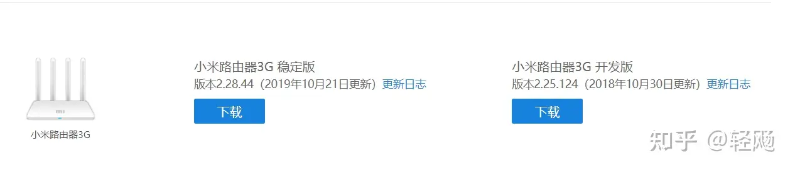

刷入：

1. 将下载好的rom复制到Fat32的u盘根目录；
2. 路由器拔掉电源，并将u盘插入USB接口；
3. 按住reset键，接通电源，等指示灯闪烁后松开reset键；
4. 过程中，指示灯黄色闪烁或者短时间黄色长亮，整个过程持续3-5分钟；
5. 刷机完成，路由器自动重启，指示灯蓝色长亮。

### 2. 刷入SSH

手机安装MiWifi，绑定小米账号。下载[SSH工具包](https://link.zhihu.com/?target=https%3A//d.miwifi.com/rom/ssh)。进去后会看到已绑定的路由器相情况，下载工具包后，请务必记住root账号的密码。

刷入：

1. 将下载好的rom复制到Fat32的u盘根目录；
2. 路由器拔掉电源，并将u盘插入USB接口；
3. 按住reset键，接通电源，等指示灯闪烁后松开reset键；
4. 等待10-30秒安装完成，路由器自动重启，指示灯蓝色长亮。

### 3. 刷入breed

[下载breed](https://link.zhihu.com/?target=https%3A//breed.hackpascal.net/)，可以使用浏览器的页面搜索工具（chrome：ctrl + F）搜索。（我推荐将下载好的breed文件重命名为`breed.bin`）

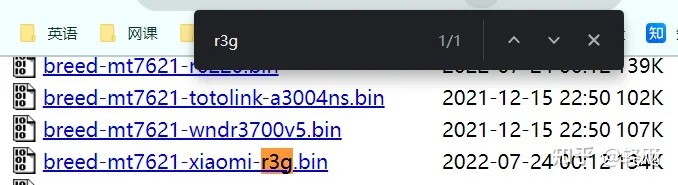

（从这里开始，请使用网线将路由器与电脑电脑连接起来）

刷入：

（我知道大家想用SFTP，但是路由器不支持）

1. [下载WinSCP](https://link.zhihu.com/?target=https%3A//winscp.net/)，并安装；
2. 新建站点，文件协议选择scp，主机名填写`192.168.31.1`或者`miwifi.com`，用户名填写root，密码是下载SSH时保存的密码。

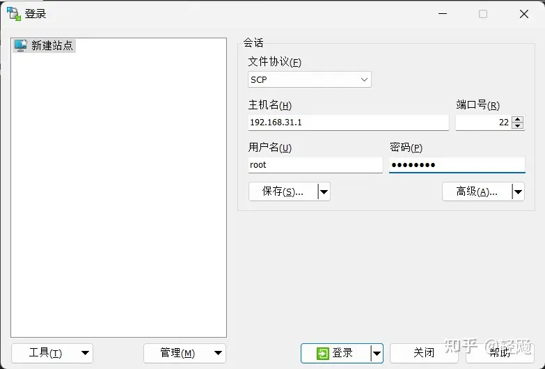

\3. 将下载好的breed文件放到路由器/tmp/下

> 连接成功呢后，文件夹路径在/root/下，双击`..`进入上一级目录，再进入`/tmp`目录下，将之前下载的breed.bin文件拖到该目录下

\4. 打开终端，输入下面的命令:

```text
注意：breed.bin是下载的breed文件，根据实际情况改
mtd -r write /tmp/breed.bin Bootloader
```

终端：


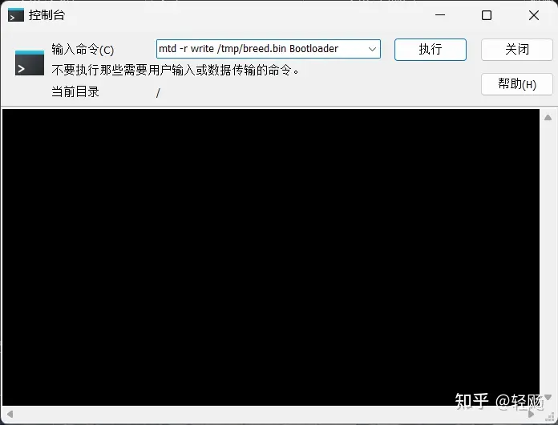

命令执行完成后，断掉路由器电源，按住reset键，插上电源，等到路由器闪烁时，松开reset键，访问192.168.1.1，可以成功进入breed页面

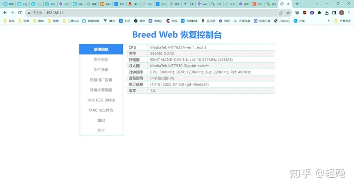

### 4. 在breed中刷入X-wrt

1. 下载对应的[X-wrt固件](https://link.zhihu.com/?target=https%3A//downloads.x-wrt.com/rom/)

> 需要下载下面的三个，可能不太好找，可以用页面搜索搜索`Xiaomi Mi Router 3G`

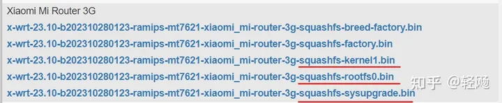

\2. 在breed中，选择固件更新

> 先选择闪存布局为`小米R3G OpenWrt`，在分别选择上一步现在的前两个文件，记得勾选**自动重启**

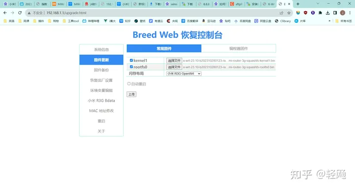

\3. 点击上传，点击更新

> 输入成功后，如果你上一步勾选了自动重启，现在你就可以访问`192.168.15.1`打开路由器后台了，如果没有勾选，请等待更新完成后手动断掉路由器电源重启。

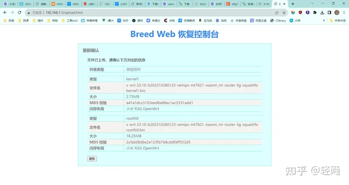

\4. 进行固件更新

> 访问`192.168.15.1`进入路由后台，账号密码都是admin。导航栏——>系统——>备份与升级

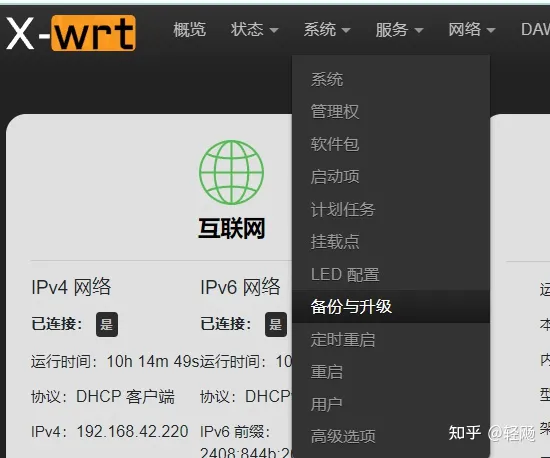

> 在“刷写新的固件”中，点击`刷写固件`，选择刚才下的固件，上传，结束后，重启

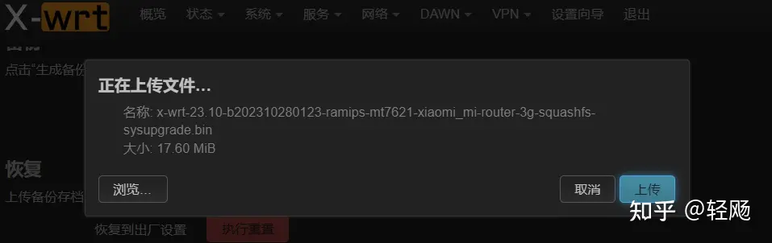


至此，刷机结束，插上网线或者手机usb网络共享就可以正常使用。
