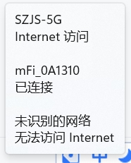
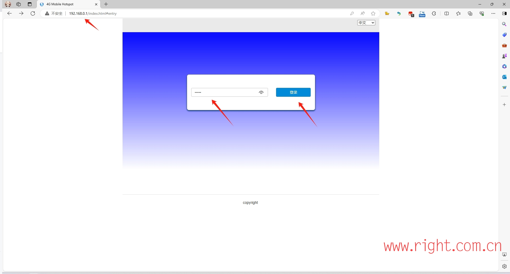
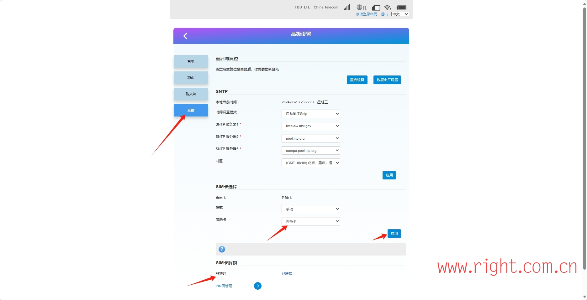
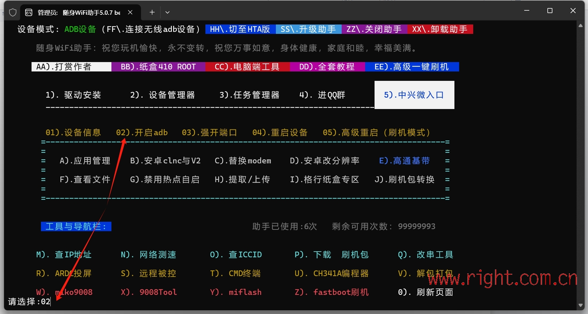
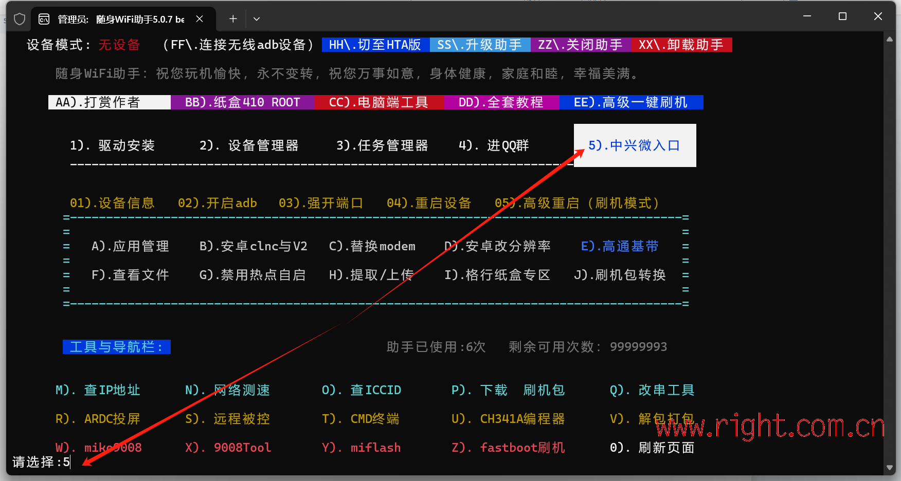
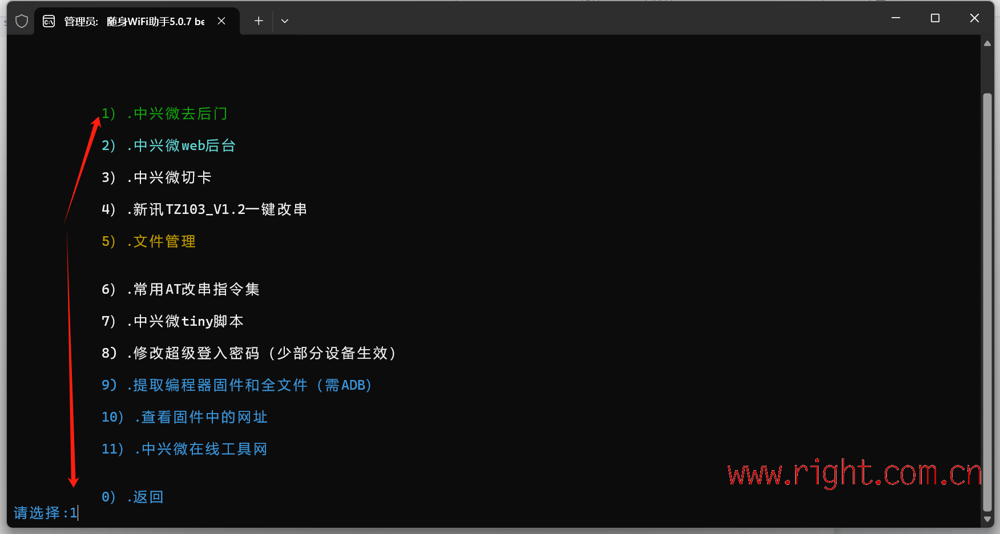
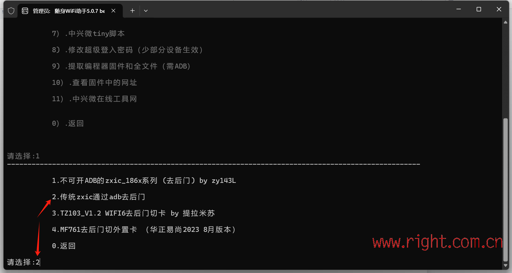
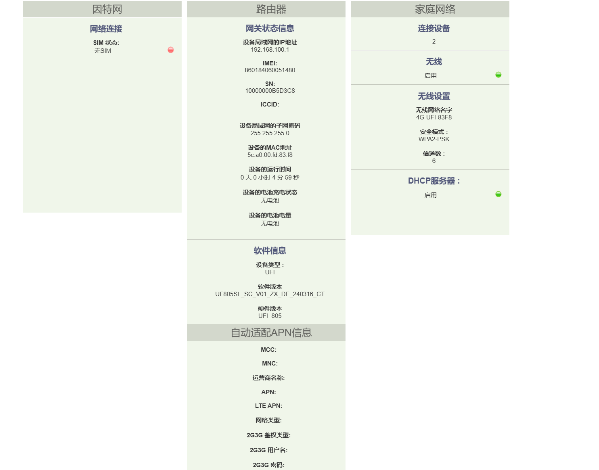
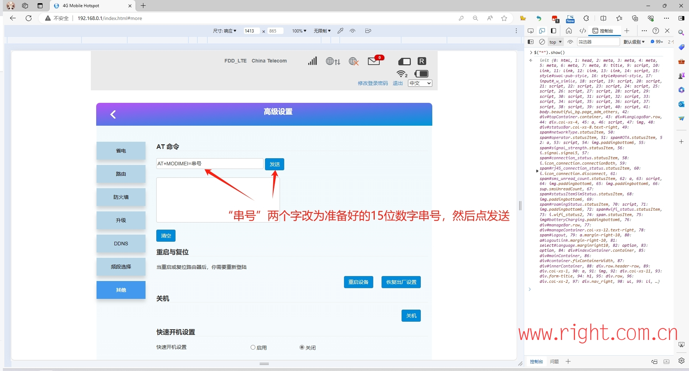

## 影腾卡 移植 纽曼4g电源机

一、切换自己的手机流量卡

1、电脑或手机连接随身WIFI的网络。

2、浏览器中输入纽曼随身WIFI的管理IP：http://192.168.0.1/，输入密码admin登陆管理后台。

3、点击高级设置--其他--SIM卡选择--启动卡--外插卡--应用--SIM卡解锁--输入解锁码：az952#

 

4、我完成切卡之后，装入自己的电信卡就可以使用了。

二、去后门

1、下载、安装随身WIFI助手软件

2、随身WIFI用数据线连接电脑

3、开启adb

4、根据提示完成ADB开启

5、选择中兴微入口

6、选择中兴微去后门

7、成功后会有大功告成的提示

二、改串号

1、打开高级设置--其他，按键盘F12打开控制台，输入：$("*").show()

2、输入AT命令： AT+MODIMEI=串号 （如果失败，先输入AT+ZMODE=1重启再输入改串指令）重启设备   AT+CGSN查询 AT+ZMODE=1重启

影腾y1 4g-1 : 860040068904999

影腾y1 4g-2 : 860184060051480

### 5G手机插卡

### 5G随身wifi插卡

### 设备 连接路由器实现类cte设备

### 短信转发实现

