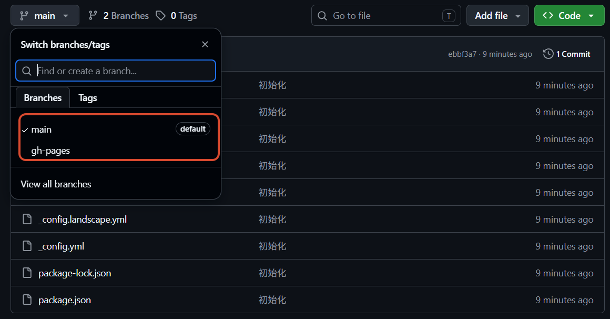
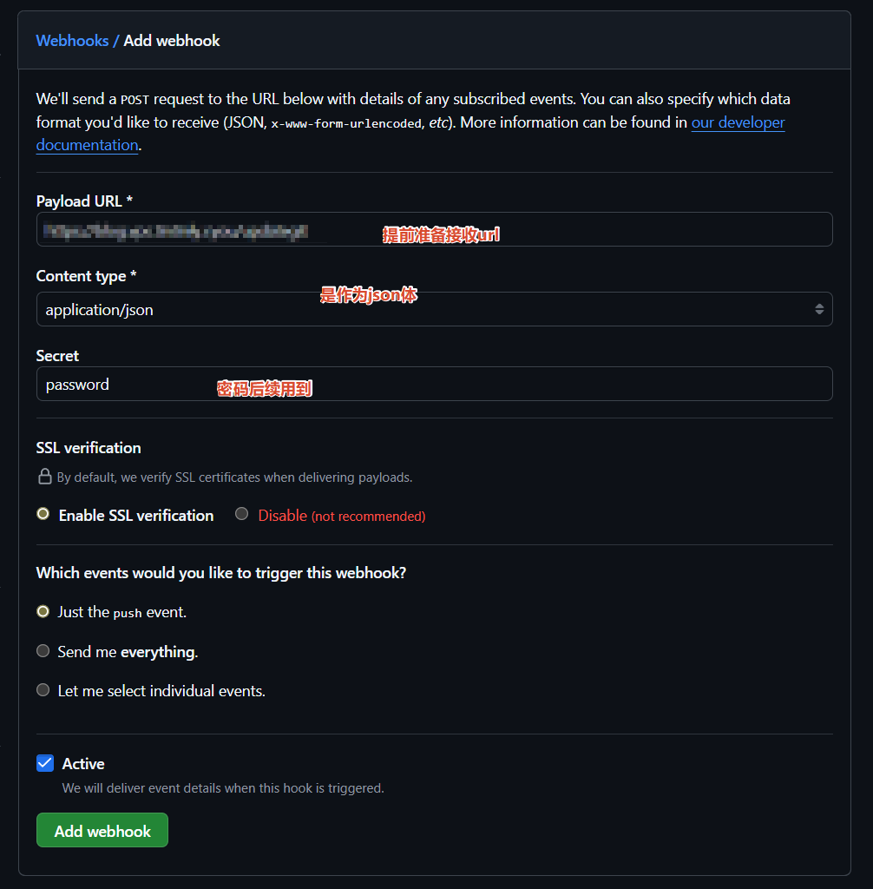
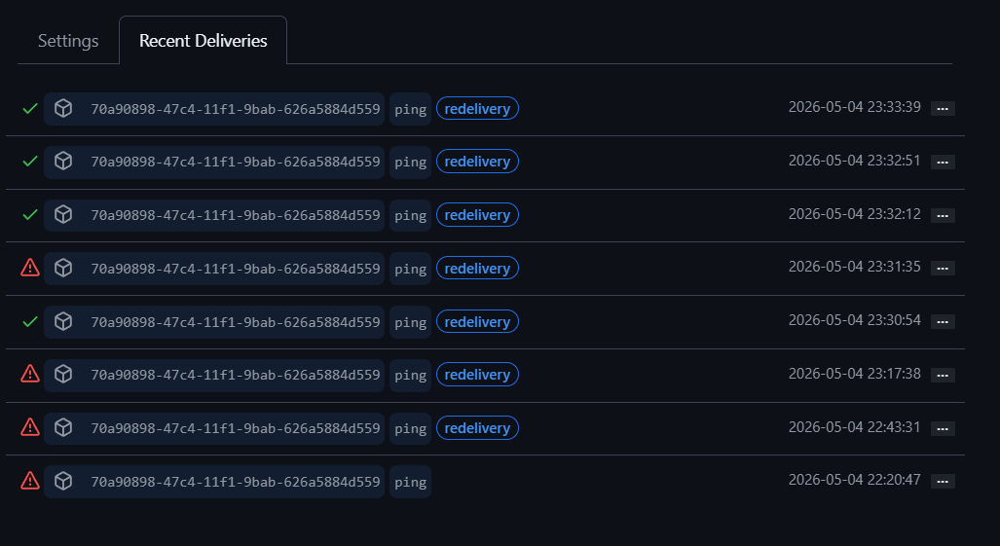
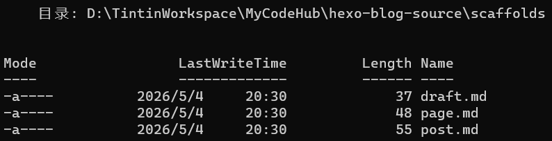
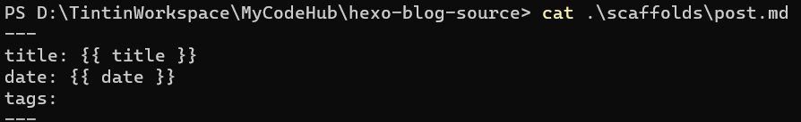

# Hexo 个人博客搭建

## 准备

需要您的机器上安装好 Hexo 的运行环境 `Node.js`，同时为了方便部署资源，下载安装好 `Git`。准备和搭建的操作一般都是在你的主力机器（我的是 windowsx 系统）上进行，因为这是你写博客的地方。我之前也曾将 Hexo 安装到服务器上，发现是多此一举，还浪费机器资源，因为服务器上只需要运行 Hexo 生成的静态页面即可。归根结底是因为自己光看别人的教程，而没有思考 Hexo 工具的本质（静态生成器）及原理。这也是恰好是我要搭建个人博客的原因，一个人不能光是输入，还需要创造输出，这对于脑力的锻炼、精神的培养都有好处。

安装 [Git](https://git-scm.com/)

安装 [Node.js — 在任何地方运行 JavaScript](https://nodejs.org/zh-cn)

安装 Hexo，请注意越新的版本需要越高版本的 Nodejs 和 npm

```bash
npm install hexo-cli -g
```

## 初始化、生成、运行

hexo 初始化

```shell
hexo init hexo-blog-source # 从  https://github.com/hexojs/hexo-starter.git 复制完整的hexo源项目
cd hexo-blog-source 
npm install # 安装依赖
```

生成静态文件并启动本地服务器

```shell
hexo clean # 清除缓存文件
hexo g # hexo generate 生成静态文件至public文件夹中
hexo s # 启动本地服务器 hexo server
```

测试，浏览器打开 http://localhost: 4000

## 目录结构

* `_config.yml`：网站的配置文件。 配置大部分的参数。
* `package.json`：应用程序的信息。EJS, Stylus 和 Markdown 渲染引擎 已默认安装。
* `scaffolds`：模版 文件夹。 当您新建文章时，Hexo 会根据 scaffold 来创建文件。
* `source` ：资源文件夹。 是存放用户资源的地方。 除 `_posts` 文件夹之外，开头命名为 `_` (下划线)的文件 / 文件夹和隐藏的文件将会被忽略。 Markdown 和 HTML 文件会被解析并放到 `public` 文件夹，而其他文件会被拷贝过去。
* `themes`： Hexo 会根据主题来生成静态页面。
* `public`：生成的所有静态文件，不属于源码一部分

## 版本管理

将源目录建立 git 仓库，并在 github 添加集中式仓库，有利于我们管理我们博客的变动版本。

源目录本身就是从 Hexo 源项目 复制而来，默认就有 `.gitignore` 文件和 `.github` 目录，说明 hexo 本身就适合基于 git 的版本管理。

```shell
# 初始化仓库
git init
# 添加暂存区
git add .
# 提交
git commit -m "初始化"
# 建议 github 分支使用 main
git branch -M main
# 添加远程仓库
git remote add origin git@github.com:tintinly/hexo-blog-website.git
# 首次推送
git push -u origin main
```

## 部署静态页面

Hexo 提供快速、简便的部署方案。[一键部署 | Hexo](https://hexo.io/zh-cn/docs/one-command-deployment)

例如 `hexo deploy` 用于将生成的静态文件远程部署到仓库、服务器中。其部署策略通过_`config.yml` 进行配置。 有效配置必须有 `type` 字段。可同时使用多个 deployer。

```yml
deploy:
  - type: git
    repo:
  - type: heroku
    repo:
```

### Git  提交静态页面

安装部署插件

```shell
npm install hexo-deployer-git --save
```

编辑 _config.yml

```yml
deploy:
  type: git
  repo: <repository url>
  branch: [branch] # 默认  gh-pages (GitHub) coding-pages (Coding.net) master (others)
  message: [message] # 默认 'Site updated: {{ now('YYYY-MM-DD HH:mm:ss') }}'
```

因为其默认的分支是 gh-pages 分支，我们恰好可以将源码放到 main 或 master 分支，而静态页面放到 gh-pages 分支。请确保 [版本管理](#版本管理) 步骤已完成，否则可能无法找到仓库。

```
hexo clean && hexo g && hexo d
```

得到的仓库结果：



通过 Git 提交静态页面到仓库分支以后，可以用于 [Github Page 静态托管](#Github Page 静态托管)，但是如果想要在云服务器运行，就需要在你的云服务器环境中通过 git 克隆或拉取静态分支至某一个文件夹，例如 `var/www/blog`，再部署到 Nginx 等 Web 服务器中，这里建议先操作一次，并尝试 [部署站点](#Nginx 部署站点)。

```shell
cd /var/www
git clone -b gh-pages git@github.com:tintinly/hexo-blog-website.git
```


### FTP & SFTP 传输静态页面

 Hexo 还提供了 FTPSync 和 SFTP 的方式，帮助你直接将静态页面传输到服务器中。下面以 SFTP 的方式为例。

安装部署插件

```shell
npm install hexo-deployer-sftp --save
```

编辑 _config.yml

```yml
deploy:
  type: sftp
  host: <host> # 远程主机的地址
  user: <user> # 使用者名称
  pass: <password> # 密码
  remotePath: [remote path] # 远程主机的根目录
  port: [port] # 端口 默认 22
  privateKey: [path/to/privateKey] # SSH 私钥的目录地址
  passphrase: [passphrase] # 私钥的可选密码
  agent: [path/to/agent/socket] # ssh套接字的目录地址 默认 $SSH_AUTH_SOCK
```

执行部署命令

```shell
hexo clean && hexo g && hexo d
```

此种方式部署没有体验过，查阅相关资料发现有的人说体验不行 [^3]。如果是这种方式不够可靠，那么我们自己利用 FTP 或 SFTP 上传 Hexo 生成的 `public` 文件夹到服务器也是一个简单有效的方式。

### 手动复制

Hexo 生成的所有文件都放在 `public` 文件夹中。 您可以将它们复制到您喜欢的地方。

### Webhook 的方式部署

Webhook 是一种事件驱动的轻量级通信，可通过 HTTP 在应用之间自动发送数据。Webhook 由特定事件触发，可自动实现 应用编程接口（API）之间的通信，并可用于激活工作流。也就是可以理解为放在按钮（API）上面的触发器（Webhook），点击按钮的工作不再是人的手指，而是某一个事件（例如 Github 的 push 事件）。

原理和 Github Pages 托管和类似，本地代码 push → Github Action 构建页面 → Gihub Page 的服务器更新，Webhook 尝试部署 Hexo 静态页面以后，本地代码 push → 远程库发送通知使服务器拉取代码 → 服务器更新。

这个方法参考了别人的博客，但是发现 node 版本过高报错，用了 ai 调整了脚本。

**Github 配置**

仓库 -> Settings -> Webhooks

这里依旧使用 nginx 转发了 webhook 请求至本地端口。



**服务器配置**

依旧是再 `var/www` 里，新建 `webhooks` 文件夹，存放脚本。

```shell
npm init -y # 初始化
npm install @octokit/webhooks
```

监听脚本 gitupdate.js，用于监听端口，接收从 Github 发送过来的 Webhook 请求，依赖于 github webhook 监听工具

```javascript
const { createNodeMiddleware, Webhooks } = require('@octokit/webhooks');

const webhooks = new Webhooks({
  secret: 'password'
});

function run_cmd(cmd, args, callback) {
  const spawn = require('child_process').spawn;
  const child = spawn(cmd, args);
  let resp = "";
  child.stdout.on('data', buffer => resp += buffer.toString());
  child.stdout.on('end', () => callback(resp));
}

webhooks.on('push', ({ payload }) => {
  console.log('Received a push event for %s to %s',
    payload.repository.name,
    payload.ref);
  run_cmd('sh', ['./deploy.sh', payload.repository.name], text => console.log(text));
});

webhooks.on('issues', ({ payload }) => {
  console.log('Received an issue event for %s action=%s: #%d %s',
    payload.repository.name,
    payload.action,
    payload.issue.number,
    payload.issue.title);
});

require('http').createServer(createNodeMiddleware(webhooks)).listen(4001, () => {
  console.log(new Date() + '我启动起来了', 4001);
});
```

部署脚本 deploy.sh，用于拉取静态分支和刷新服务器

```shell
# WEB_PATH 填写对应的要自动更新的地址 其实就是进入的那个文件夹下
WEB_PATH='/var/www/hexo-blog-website'
WEB_USER='root'
WEB_USERGROUP='root'

echo "Start deployment"
# 此步进入到上方的填写的文件夹下
cd $WEB_PATH
echo "pulling source code..."
# 执行三步拉取操作
git reset --hard origin/gh-pages
git clean -f
git pull origin gh-pages
#echo "changing permissions..."
#chown -R $WEB_USER:$WEB_USERGROUP $WEB_PATH
#echo "Finished."
```

```shell
npm test
```

如需后台运行，可使用 `pm2` 或 `nohup`：

```shell
npm install pm2 -g
pm2 start gitupdate.js --name hexoUpdate # pm2
nohup node gitupdate.js > output.log 2>&1 & # nohup
```

**测试**

重发测试或 push 代码测试



## 上线

可以使用 Github Pages 托管自己的网站，也可以使用自己的服务器部署。

### Github Page 静态托管

* 源码仓库通过 GitHub Actions 部署的方式：[在 GitHub Pages 上部署 Hexo | Hexo](https://hexo.io/zh-cn/docs/github-pages)
* 一键部署的方式：通过 `hexo deploy` 部署静态页面至 *用户名*.github.io 仓库即可

### Nginx 部署站点

* 云服务选购（VPS / 云服务器）

  我选择的是境外 vps [RackNerd - Introducing Infrastructure Stability](https://www.racknerd.com/)

* 域名选购与解析

  在腾讯云、阿里云、NameCheap、GoDaddy 等大厂商购买常用后缀的域名或性价比高的域名，在控制台中添加 A 记录或 AAAA 记录，将主域名（@）或三级域名 指向服务器公网 IP。

* HTTPS 证书申请

  通常从 Let’s Encrypt 申请免费的证书，建议使用常见的申请自动申请、续期工具（ Certbot、acme.sh）

* 配置域名、证书、根目录（应当是 `public` 或者 将 `public` 改名复制到另一个目录下）

  ```nginx
  server {
    listen 80;
    listen 443 ssl;
    server_name blog.vps.tintinly.cyou;
  
      ## 证书部署
    ssl_certificate /etc/ssl/certimate/cert.crt;
    ssl_certificate_key /etc/ssl/certimate/cert.key; 
  
      # 强制https
    if ($scheme = 'http') {
        return 301 https://$host$request_uri;
    }
  
    charset utf-8;    # 防止中文文件名乱码
  
      # 访问 http://ws.vps.tintinly.cyou 会查找文件：/var/www/static_dir/index.html
      location / {
          root /var/www/hexo-blog-website;
      }
  
      location /gitupdate {
          proxy_pass http://127.0.0.1:4001/;
      }
  }
  ```

## 后台运行

### 将 Hexo 注册为服务

创建服务文件

```shell
vim /etc/systemd/system/hexo-tintin-blog.service
```

```ini
[Unit]
Description=Hexo Tintin Blog
After=network.target

[Service]
# 替换为你的用户名
User=root
# 替换为你的 Hexo 项目目录
WorkingDirectory=/root/tintin-blog
# 设置环境变量，确保命令能找到
Environment=PATH=/root/.nvm/versions/node/v22.22.2/bin:/usr/local/sbin:/usr/local/bin:/usr/sbin:/usr/bin:/sbin:/bin
# 分别执行启动命令
ExecStart=hexo server
# 如果不行则直接写全路径
# ExecStart=/root/.nvm/versions/node/v22.22.2/bin/hexo server
Restart=always
RestartSec=100

[Install]
WantedBy=multi-user.target
```

启动服务&设置开机启动

```shell
systemctl daemon-reload # 重新加载 systemd 配置
systemctl enable hexo-tintin-blog # 重新加载 systemd 配置
systemctl start hexo-tintin-blog # 启动服务
systemctl status hexo-tintin-blog # 检查服务状态
```

### 通过 pm2 接管 hexo 的进程

```shell
npm  install -g pm2
```

在博客根目录下面创建一个 hexo_run.js

```js
//run
const { exec } = require('child_process')
exec('hexo server',(error, stdout, stderr) => {
        if(error){
                console.log('exec error: ${error}')
                return
        }
        console.log('stdout: ${stdout}');
        console.log('stderr: ${stderr}');
})
```

在博客根目录下面执行

```shell
pm2 start hexo_run.js
```

## 编写文章

Hexo 写作需要使用 Markdown，对 Markdown 不熟悉的读者可以参考：[Markdown 教程 | 菜鸟教程](https://www.runoob.com/markdown/md-tutorial.html)

创建文章前要先选定模板，在hexo中也叫做布局。hexo 默认支持三种布局（layout）：post(默认)、draft、page。

实际上，布局是一个markdown文件，它们保存在`scaffolds/`目录下，可以看到hexo自带的三种布局其实就是三个`.md`文件，每一个文件中的内容实际只包含一个Front-matter。因此，你可以在`scaffolds/`目录下修改布局或者建立新的布局，然后创建文章时使用这些布局。





创建三种布局的文章

```shell

hexo new draft <title> # 创建草稿 将在source\目录下创建_drafts目录，并生成一个<title>.md文件。

hexo new post <title> # 创建已发布文章 将在source\目录下创建_posts目录，并生成一个<title>.md文件。

hexo publish <title> # 将草稿发布 

hexo new page <title> # 页面是网站中单独的网页，不属于博客文章列表中，不会在首页中显示出来。
```

最后就可以打开这些 md 文档进行编辑了

编辑完博客，进行本地测试与部署

```shell
hexo clean 
hexo g 
hexo s # 本地测试
hexo d # 部署
```

可以查看你部署的站点是否能实时变化

## 插入图片

**全局资源**

`source` 文件夹中除了文章以外的所有文件，例如图片、CSS、JS 文件等都会复制到输出文件夹中。因此插入图片最简单的方法就是将它们放在 `source/images` 等文件夹中。 然后通过类似于 `` 的方法访问它们。

```markdown

```

**文章资源**

hexo 提供了一个资源文件管理功能，可以通过将 config.yml 文件中的 post_asset_folder 选项设为 true 来打开。

```yml
post_asset_folder: true
```

会生成这样的结构：

## 主题

从 Hexo 主题官网 [Themes | Hexo](https://hexo.io/themes/) 下载并安装你喜欢的主题

```shell
npm install --save hexo-theme-name
```

然后在 _config.yml 文件中指定对应的主题即可：

```yml
theme: hexo-theme-name
language: zh-CN
```

## 搜索引擎优化(SEO)

部署完网站之后，虽然可以直接通过 url 访问我们的网站，但是我们无法通过搜索引擎检索到我们网站的相关内容，所以我们需要进行 网站验证，网站验证主要就是为了让各大搜索引擎收录我们的网站，这样可以让更多的人通过搜索引擎找到我们的网站。

[百度搜索资源平台_共创共享鲜活搜索](https://ziyuan.baidu.com/?castk=LTE%3D)

[Welcome to Google Search Console](https://search.google.com/search-console/welcome)

# 参考资料

[文档 | Hexo](https://hexo.io/zh-cn/docs/)

[Hexo个人博客搭建及上线全流程 - 知乎](https://zhuanlan.zhihu.com/p/1908161067479183613)

[Hexo各种一键部署方式的体验 | 瓦解的生活记事](https://hin.cool/posts/hexodeployer.html#SFTP一键部署)

[利用 GitHub Actions 自动部署 Hexo 到 GitHub Pages 并通过 WebHook 安全更新服务器 | XuanRan's Blog](https://blog.xuanran.cc/2025/11/08/利用 GitHub Actions 自动部署 Hexo 到 GitHub Pages 并通过 WebHook 安全更新服务器/)

[使用webhook实现hexo的自动部署 | 一亩三分地](https://blog.wuweizhao.com/posts/使用webhook实现hexo的自动部署/)

[github管理项目 使用 webhooks 实现推送，服务器实时自动部署_webhook推送工具-CSDN博客](https://blog.csdn.net/clli_Chain/article/details/120156383)

