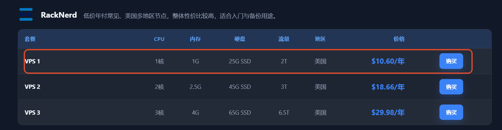

# VPS 建站指南

## VPS 服务商

VPS 优惠/评测/推荐：[科技 lion 官方网站 - KEJILION](https://kejilion.pro/)

我选择了 RackNerd 1 核 1G 一年 10 刀的极致性价比套餐，这使得我的机器资源比较吃紧，只能省着用，选择最轻量级的部署方式。



## VPS 机器信息

IP 地址 / 位置：192.3.13.50 / NewYork
内存：1 GB RAM 
CPU：1 CPU Core
操作系统：Ubuntu 20.04 LTS 64 Bit

## 重装 Debian

第一次登录上 VPS 的操作系统为 Ubuntu 24.04，而且可能会有不少预装软件，建议新装一个纯净的 Linux 发行版，如以最小化安装 Ubuntu 20.04/22.04 或 Debian 11/12。其中，Debian 将会更加精简

## 开启 Swap 区

查看是否开启

```shell
# 方法1：查看所有激活的swap设备/文件（看是否有输出）
swapon --show
# 方法2：查看内存概览，看Swap那一行的used/total
free -h
# 方法3：查看内核swap统计信息
cat /proc/swaps
```


## 开启防火墙

建议打开 systemctl，默认拒绝所有。但是好似云服务商的具有前置防火墙如安全组 (Security Group) / ACL 规则，这是位于服务器实例以外的“云上虚拟防火墙”。例如只要有安全组规则放行了 22 端口，流量就已经能进入系统，系统内部的 `firewalld` 再怎么阻止也无能为力了。

```shell
# 查看firewalld服务状态
systemctl status firewalld
# 开启
service firewalld start
# 重启
service firewalld restart
# 关闭
service firewalld stop
# 查看防火墙状态
firewall-cmd --state
# 查看防火墙规则
firewall-cmd --list-all
```

## 服务器管理

### 一体式

直接安装一体化的面板，适合新手入门，几乎包揽服务器所有模块，网站配置、运行环境、容器管理、数据库、防火墙、监控、终端等等，使用一体化面板管理服务器、网站和应用基本可以摆脱命令行。

常见的 Linux 运维管理一体化面板有：宝塔面板、1Panel、aaPanel

1Panel 安装脚本

```shell
bash -c "$(curl -sSL https://resource.fit2cloud.com/1panel/package/v2/quick_start.sh)"
```

### 组合式

如果不喜欢这类糅合了所有管理功能的面板，看起来十分的臃肿，用的不熟练容易找不到配置的位置。可以组合使用不同层面上的 web 管理工具，例如有些面板只专注于 Linux 系统管理，有些面板只做类 Nginx 的 HTTP 服务器可视化，有些面板是做 docker 容器的可视化编排和管理，这很好地体现了“单一职责”的理念。如果说你追求轻量级、视觉清新的管理方案可以采用这种方式。

以下是我的方案：Cockpit + nginx-ui + Portainer

安装 Cockpit，访问默认端口 9090，输入系统用户密码

```bash
apt install cockpit -y

# 启动服务
systemctl start cockpit
# 验证服务状态
sudo systemctl status cockpit
# 验证服务自启动
sudo systemctl is-enabled cockpit
```

安装 nginx-ui

```bash
bash -c "$(curl -L https://cloud.nginxui.com/install.sh)" @ install -r https://cloud.nginxui.com/
```


## 1panel

查看、修改账号信息

```bash
1pctl user-info # 查看账号信息
1pctl update password # 修改密码
```

服务重启

```
1pctl restart core
1pctl restart agent
1pctl restart all
```

完全卸载

```
1pctl uninstall

sudo rm -rf /usr/local/bin/1panel
sudo rm -f /etc/systemd/system/1panel.service
sudo systemctl daemon-reload
```


## 自建机场

[自建机场](../自建机场/index.md)

## 服务部署

通过面板 或 Nginx 部署静态页面

通过面板 或 Node.js 部署 SSR 页面

## 搜索引擎优化(SEO)

部署完网站之后，虽然可以直接通过 url 访问我们的网站，但是我们无法通过搜索引擎检索到我们网站的相关内容，所以我们需要进行 网站验证，网站验证主要就是为了让各大搜索引擎收录我们的网站，这样可以让更多的人通过搜索引擎找到我们的网站。

### 百度搜索

控制台：[百度搜索资源平台_共创共享鲜活搜索](https://ziyuan.baidu.com/?castk=LTE%3D)

教程：[自学呀 - 网站建设|网站 SEO|关键词排名优化|一站式服务](https://www.zixueya.com/)

1. 登录：访问官网进入平台首页，右上角登录。（若无账号需先注册）
2. 添加网站：点击【用户中心】-【站点管理】-【添加网站】，输入你的网站域名。
3. 所有权验证：

### 谷歌搜索

控制台：[Welcome to Google Search Console](https://search.google.com/search-console/welcome)

教程：

[google search console 终极教程 - 知乎](https://zhuanlan.zhihu.com/p/150718629)

[谷歌 SEO 教程：手把手教你做 SEO 优化 2025 - 知乎](https://zhuanlan.zhihu.com/p/1931270570923788163)

[谷歌 SEO 服务 | Google 优化代运营公司- 鸭老师 SEO](https://www.ylsseo.com/)
