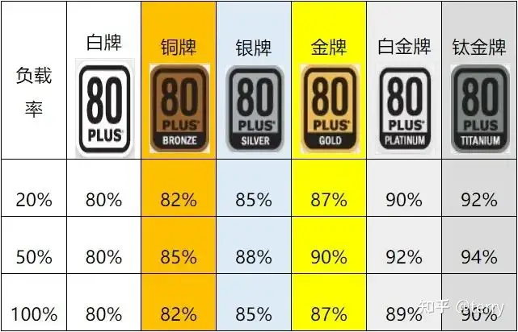
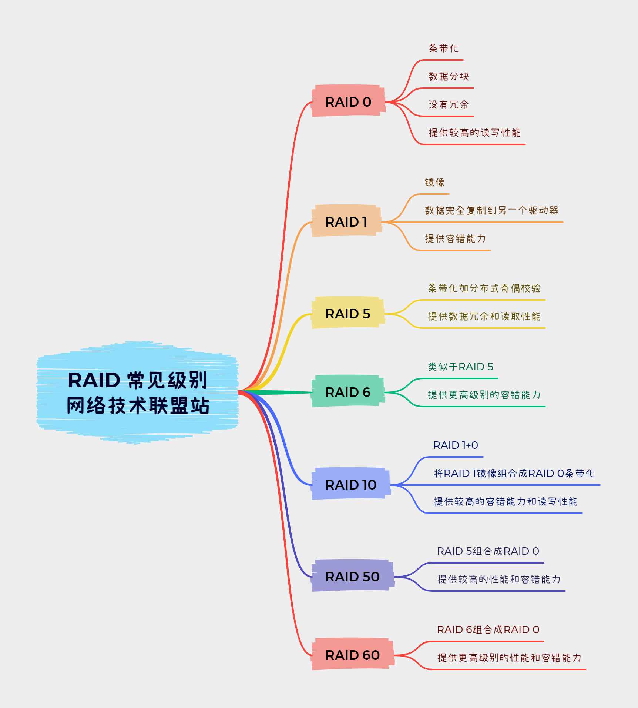
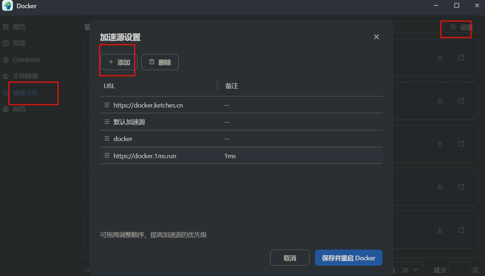
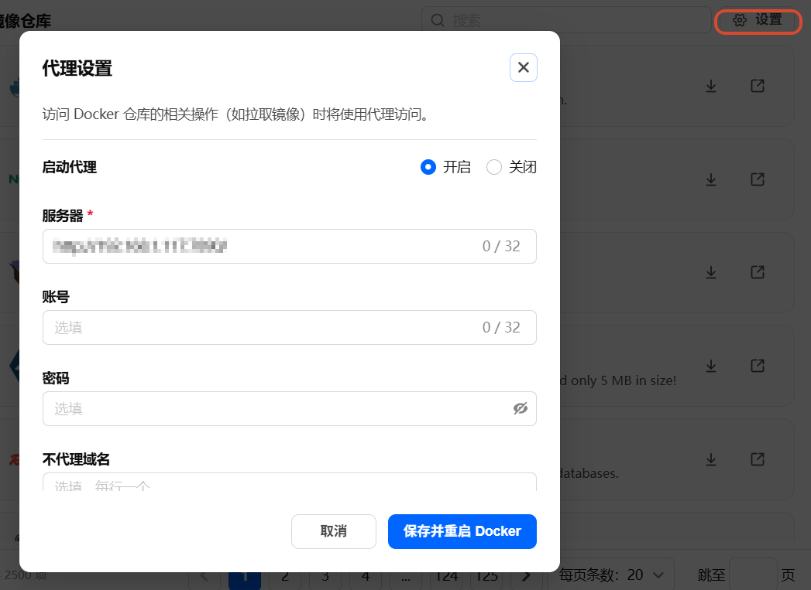
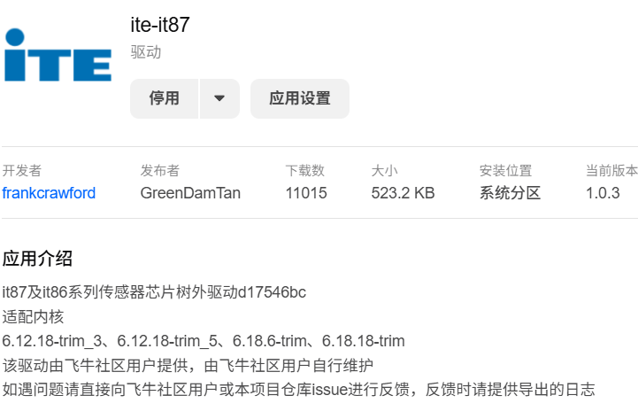
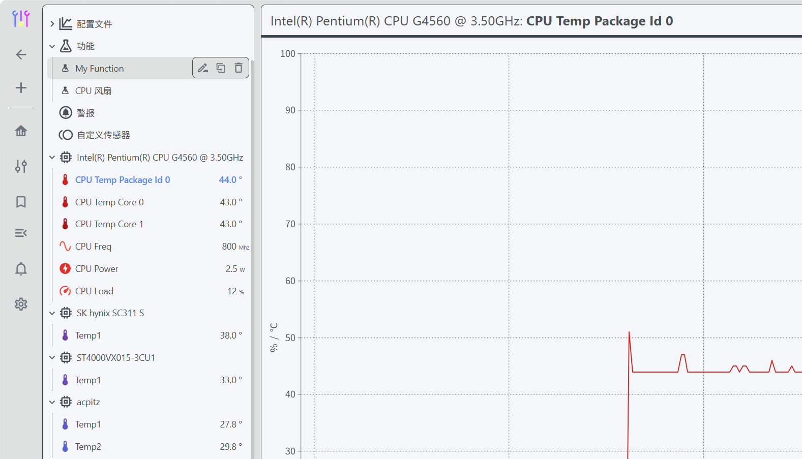
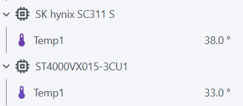
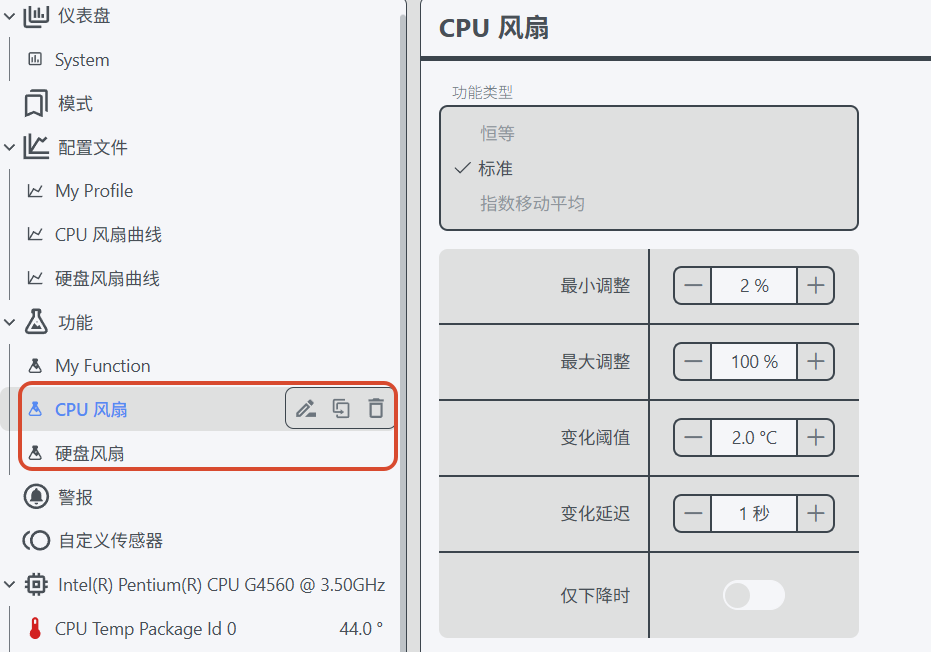
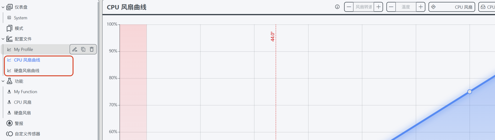
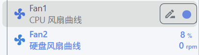

# 初始需求

## 影视中心的显示效果


支持 4K H.265/HEVC 硬件解码

## 能耗低

* 使用转换率高的电源。有 80 PLUS 认证的电源， 方便判断转换效率。



> 1000W 的电源在负载 500W 的时候刚好是负载率 50%，从表中可以看到此时白金牌转化率为 92%。
>
> 所以这个时候白金牌电源实际从电网中获得了 500W/92%= 543W 的电能。
>
> 而白牌则用掉了 625W 的电能

## 低噪音

* 配备支持 PWM 调速的风扇

## 合理的存储

* 系统与软件，配备散热性能好的一线 SSD 硬盘

* nas 存储，购买用于 nas 的红盘或者用于 24 小时监控的紫盘

* 购买传统垂直式机械硬盘，避免购买厂家为了节省成本的 5400rpm 256MB 大缓存的叠瓦盘
* 冷备份可以选用节能/大容量存储的硬盘

西部数据（Western Digital）不同颜色机械硬盘的对比：

| **颜色**   | **定位与用途**         | **转速**                    | **缓存**  | **质保期**      | **核心特点**                                                 |
| :--------- | :--------------------- | :-------------------------- | :-------- | :-------------- | :----------------------------------------------------------- |
| **黑盘**   | 高性能计算/游戏/企业级 | 7200 RPM                    | 64-256MB  | 5 年             | 高负载能力，大缓存，适合服务器、视频编辑、大型游戏；缺点是噪音较大 213。 |
| **蓝盘**   | 家用/普通存储          | 5400-7200 RPM               | 16-256MB  | 2-3 年           | 性价比高，平衡性能与静音，适合日常办公和轻度游戏；部分老款为 7200 RPM216。 |
| **绿盘**   | 节能/大容量存储        | 5400 RPM                    | 64-128MB  | 2 年             | 低功耗、低噪音，适合冷数据存储（如备份盘）；性能较差，寿命较短 915。 |
| **红盘**   | NAS/网络存储           | 5400 RPM                    | 64-256MB  | 3 年（Pro 版 5 年） | 支持 7×24 小时运行，NASware 技术优化 RAID 兼容性，适合家庭或小型企业 NAS 环境 216。 |
| **紫盘**   | 监控/安防系统          | 5400-7200 RPM（大容量型号） | 64-256MB  | 3 年             | 耐高温，支持多路视频流写入，适合 24 小时监控；缺少 RAID 优化功能 918。 |
| **金盘**   | 企业级/数据中心        | 7200 RPM                    | 128-512MB | 5 年             | 充氦技术，高可靠性（550TB/年负载率），支持 RAID，适合企业级存储和云计算 718。 |
| **企业盘** | 关键任务/服务器        | 7200 RPM                    | 128-512MB | 5 年             | 高 MTBF（250 万小时），稳定性极强，适合金融、医疗等对数据安全要求高的场景 1316。 |

## 安全性

* 配备功耗为服务器功耗两倍以上的 UPS 电源，并定期更换。UPS（Uninterruptible Power Supply），即不间断电源，是将蓄电池（多为铅酸免维护蓄电池）与主机相连接，通过主机逆变器等模块电路将直流电转换成市电（交流电）的系统设备。具有自动稳压、断电保护、智能开关机等功能，

* 数据备份方案

> 3-2-1 备份原则
>
> 3：要有 3 份数据副本
>
> 2：至少要有 2 种存储介质来存数据。实际手机、电脑等设备的数据同步到 nas 后不要删除，即是简单的实现。
>
> 1：有 1 份数据要放在异地，即将数据备份到另一个物理地点，包括异地 NAS、公有云等

根据实际需求、成本、硬盘资源调整备份方案

3 个及以上硬盘：部分硬盘组 raid1（须双数）放重要数据，如重要文档，家庭影像资料；其他硬盘不组阵列，放不重要的数据；所有数据都定期冷备份至外部硬盘；同步至个人云盘；

2 个硬盘：重要数据建共享文件夹同步；不重要的数据随意放。所有数据都定期冷备份至外部硬盘；同步至个人云盘；

1 个硬盘：定期冷备份至外部硬盘；同步至个人云盘；

## 高可用的网络

* 尝试电信联通申请公网 IP，得到动态公网 IP。通过 DDNS 得到固定的访问位置。或内网穿透

  > 在家庭或者一些特殊的网络环境中，运营商不会给提供静态 IP 地址，而是提供动态 IP 地址。DDNS，动态域名系统（Dynamic Domain Name System），它是在 DNS 的基础上发展起来的一种服务，用来解决动态 IP 地址的问题

* 联系运营商提升上传速率

# 计划硬件方案

| 组件     | 型号/推荐               | 兼容考虑               | 参考价格  |
| :------- | :---------------------- | ---------------------- | :-------- |
| CPU      | AMD Ryzen 5600G         |                        | ¥1200     |
| 主板     | 华擎 B550M-ITX（双网口） |                        | ¥800      |
| 内存     | 金士顿 32GB DDR4 3200MHz |                        | ¥600      |
| 存储     | 西数 4TB HDD×2 + 1TB SSD |                        | ¥1600     |
| 机箱     | 银欣 CS351（14 盘位）     |                        | ¥900      |
| 电源     | 全汉 MS450 + DC-ATX 模块  |                        | ¥500      |
| UPS      | 雷迪司 H1000M            | USB 通讯线占用 usb 接口*1 |           |
| **总计** |                         |                        | **¥5600** |

# 计划系统方案 

## 系统（虚拟化系统）

Proxmox Virtual Environment, 简称 PVE（基于 Linux KVM 开源）  / VMware ESXi （基于 windows）

## NAS 系统

飞牛 NAS 系统（FNOS）

# 数据安全方案

## 3-2-1 原则

企业采用 3-2-1 原则，成本高，不适用。

- 至少保留 3 份数据副本，包括原数据。
- 将备份保存到两个不同的存储设备或位置。
- 至少有一份异地备份，本地灾难后还可恢复。
- 至少有一份离线备份，即将文件备份存储在与计算机系统完全隔离的介质上。

## RAID 阵列

独立磁盘冗余阵列（RAID）是一种存储技术，通过将两个或多个硬盘驱动器（HDD）或固态硬盘（SSD）合并成一个协调的存储单元或阵列，从而创建数据丢失的故障安全机制。用来提升硬盘冗余和性能，不是备份的首要解决方案。

* raid0: 条带
* raid1: 镜像
* raid5: 奇偶校验
* raid6: 双重奇偶校验
* raid10：多个 raid1 进行条带化
* raid50：多个 raid5 进行条带化
* raid60：多个 raid6 进行条带化



## 热备份

通过 nas 系统或软件对其他盘的重要数据进行定时备份，该盘不作为使用盘。

## 冷备份

平常不通电，妥善保存，备份时通电拷贝数据。

## 云备份

加密压缩（避免和谐）后，上传大容量的百度网盘等。可使用 nas 的 cloud sync 等套件

# 实际装机配置

| 配置                                   | 渠道              | 价格                  | 备注                                                         | 功耗                                    |
| -------------------------------------- | ----------------- | --------------------- | ------------------------------------------------------------ | --------------------------------------- |
| 3T 企业级硬盘 sas 接口                   | 闲鱼              | 3 块 450                |                                                              | 8w×3  加上直通卡暂无法设置休眠          |
| 4T 希捷酷鹰硬盘                         | 京东              | 572                   |                                                              | 5w～10w                                 |
| b250m-ds3h 主板                         | 闲鱼              | 140 元                 | 本意是买 d3h 型号，但买错了导致 pcie 口不够丰富，插了显卡就不能插 sas 转换，好在需求也能勉强满足到。 |                                         |
| 长城固态 256g                           | 闲鱼              | 79 元                  | 作为飞牛 nas 系统盘                                            |                                         |
| 威刚 ddr4 2666mhz 8g                    | 闲鱼              | 2 条 99 元               |                                                              |                                         |
| G4560 cpu                              | 闲鱼              | 1＋1 备用 27 元          | 双核四线程，G610 核显满足基本的 4k 硬解，若使用虚拟机功或许换成四核心以上 | 30w～54w                                |
| amd 原配散热器                          | 闲置 intel 用不了淦 | 0 元                   |                                                              |                                         |
| 酷凛 CPU 风冷散热器                      | 京东              | 74 元                  |                                                              | 4w                                      |
| 闲置 12cm 风扇                           | 闲置              | 就一个 0 元             |                                                              |                                         |
| 12cm 风扇                               | 闲鱼              | 3 个 15 元               | 噪音很大，需优化                                             | 3w×3                                    |
| 全新长城小金刚 325w 电源                 | 京东              | 138 元                 |                                                              |                                         |
| 笨牛 b8 机箱                             | 淘宝              | 249 元                 | 无特别要求，萌生想法时正好出了这个笨牛这个品牌，第二天就下单了 |                                         |
| 各类线材（sata3 数据线、minisas 转 sata） | 拼多多            | 50 元                  |                                                              |                                         |
| 浪潮 sas2008 拓展卡                     | 闲鱼              | 79 元                  |                                                              | 12w～15w                                |
| 总计                                   |                   | 876（不计算硬盘价格） |                                                              | 启动功耗 90w～110w<br />运行功耗 70w～80w |

# Nas 使用技巧

## 飞牛应用

飞牛影视：解码、字幕、刮削等功能十分完善。通常在网页端进行管理，移动端和电视端进行观看，电脑端通常使用potplayer通过webdav协议观看

飞牛相册：暂无需求

虚拟机：可以给自己多装几台用于测试或挂软件的虚拟机

飞牛同步：适合与主力机同步一些需要频繁使用的工作区文件夹，是异地办公的得力工具。

文本编辑和 Office 预览：满足基础的文档访问和编辑体验

## 远程访问

* ipv4

  购买域名后，在 DNS 提供商中添加 NAS 机器的 A 记录即可

* 异地组网

  适合异地组内网，不需要对外公开服务的场景。如 zerotier、easytier、飞鼠组网。
  easy-tier  https://easytier.cn/guide/network/web-console.html


* frp 内网穿透
适合无公网 ip，需要对外公开服务的场景。带宽取决于代理服务器提供的性能

> frp（Fast Reverse Proxy） 是一款开源的高性能反向代理工具，它允许您在不同网络之间建立安全的通信通道，用于实现端口映射、内网穿透和远程访问等多种网络连接需求。

* ipv6+ddns
家里的电信公网 ipv6 暂不会变化，有待时间检验。因此只需要在任意域名服务商购买域名，然后在任意的云解析平台添加 AAAA 记录即可。
购买域名：https://www.spaceship.com/
cloudflare 可进行域名托管提供云解析服务，但实际检测发现电信运营商会进行域名劫持，最终会被重定向到最后一个电信 dns 服务器。
目前使用阿里云的免费 dns 解析，未出现问题。

若 ipv6 会发现变化，则可以使用飞牛官方的 ddns 或 ddns-go

> 常用记录类型
A 将域名指向一个 IPv4 地址
AAAA 将域名指向一个 IPv6 地址
CNAME 将域名指向另外一个域名

> 域名劫持
指网络攻击者通过各种技术手段非法夺取域名控制权的行为。网络攻击者通过非法篡改域名系统（DNS）的解析记录，或通过网络钓鱼或其他欺骗手段获取所有者的登录凭证，将访问该域名的用户重定向到攻击者控制的恶意网站，以窃取用户的账号密码、银行卡号等敏感信息，或者进行网络钓鱼、传播恶意软件、显示恶意广告等非法活动。
运营商的域名劫持目的无非是赚钱与节约成本

## 安全性

以下规则 适用于开启了 ipv6+ddns 域名访问的场景
若仅局域网访问，安全性本身就足够了。
* 修改管理员的用户名 和 密码 提高复杂性
* 修改门户端口  不使用   5666 5667  改为 5 位数复杂端口
* 部署 ssl 证书 强制 https 连接  取消 80 443 重定向（当然也可以在反向代理中自己设置强制 ssl）

* 应用 容器端口 设置 5 位数复杂端口
* 开启防火墙 
    允许局域网访问 避免配置时出错导致无法访问飞牛
    
    外网允许默认端口 但 禁用官方的门户端口 8000 8001
    外网根据需要开启容器的端口

## docker

为了加快 Docker 镜像的下载速度，建议将默认的镜像源更换为国内镜像源。
Docker 国内镜像源配置
https://docker.1ms.run
https://k-docker.asia
https://docker.1panel.live


或是添加代理



## SSL 证书

阿里云免费单域名证书-免费 20 个、有效期 90 天
部署 `Certimate` -免费开源的 SSL 证书托管、自动续签工具
1panel 也有类似续签功能，建议使用。

## 书签导航

## 网盘资源搜索

## 影视库及自动化

jellyseerr + jellyfin + radarr + sonarr + qbittorrent

电影分级


## 网络代理

clash + yacd

## 音乐库

navidrome + music-tag-web v1

## 风扇转速管理

Docker 安装 CoolerControl 进行温度监控与风扇控制（可联动硬盘控温）

参考链接：[飞牛安装 CoolerControl 进行风扇转速自定义(含传感器驱动安装) - 攻略分享 飞牛私有云论坛 fnOS](https://club.fnnas.com/forum.php?mod=viewthread&tid=32626)

it87 驱动可以在飞牛应用中心下载安装



Docker Compose 配置

```yaml
services:
  coolcontrol:
    container_name: coolcontrol
    image: ghcr.io/guniv/coolercontrol-docker:latest
    restart: always
    privileged: true
    network_mode: bridge
    ports:
      - 31987:11987
    volumes:
     #- /sys:/sys      # <--- 挂载 /sys 目录
      - /dev:/dev
      - ./config:/etc/coolercontrol
      - /sys/class/hwmon:/sys/class/hwmon #如果选择第一条不挂载/sys 目录，至少要挂载本条路径
```

访问监听端口进入 web 页面



硬盘温度检测及风扇联动

```shell
sudo modprobe drivetemp #加载模块
```

重启 coolercontrol 后便可看到硬盘温度



设置模块在启动时自动加载

```shell
# 在文件中添加drivetemp即可
vim /etc/modules-load.d/drivetemp.conf
```

添加功能



添加配置文件



将配置文件与风扇绑定

