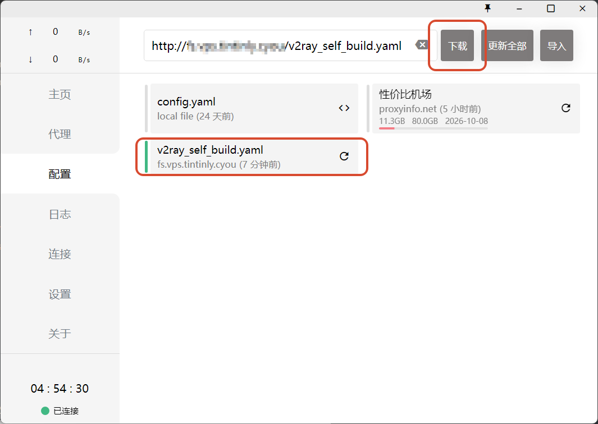

## 服务器选择

**VPS（Virtual Private Server，虚拟专用服务器）**，它就像是你租用的一台位于数据中心的电脑，你可以完全控制它，在上面安装操作系统、软件，并进行配置，通常是一台物理机用虚拟化软件（VMware、KVM、Xen）切成多个虚拟机。比起租用云服务器（多台物理机组成集群，统一调度）灵活性较低，但性价比更高。


VPS 评测来自 [科技 lion 官方网站 - KEJILION](https://kejilion.pro/)，主要考量：**便宜**。

VPS 服务商：[RackNerd - Introducing Infrastructure Stability](https://www.racknerd.com/) 

* 双 IP：无
* 硬盘：25G SSD
* 内存：1 GB RAM (Included)
* CPU：1 CPU Core (Included)
* 操作系统：Ubuntu 24.04 64 Bit
* 位置：New York
* 流量：2TB

## 环境搭建

ssh 连接服务器，根据 VPS 提供商的登录信息连接

更新系统

```shell
apt update && apt upgrade -y
```

修改 SSH 端口（可选），增加安全性

安装常用工具，如 `wget` (用于下载文件)、`curl` (用于发送 HTTP 请求)、`htop` (用于监控系统资源)。

## 代理服务端

### V2Ray

推荐 **V2Ray**，因为它功能强大、协议多样、安全性高，而且社区支持活跃。

安装教程：[V2Ray 一键搭建详细图文教程 - 233Boy](https://233boy.com/v2ray/v2ray-server/)

```shell
bash <(wget -qO- -o- https://github.com/233boy/v2ray/raw/master/install.sh)
```

安装后，输入 `v2ray` 回车，即可管理 V2Ray


### x-ui

```shell
bash <(curl -Ls https://raw.githubusercontent.com/FranzKafkaYu/x-ui/956bf85bbac978d56c0e319c5fac2d6db7df9564/install.sh) 0.3.4.4
```

### Sing-box


## 客户端

### Clash

点击 https://v2xtls.org/clash_template2.yaml 下载模板配置文件，用编辑器打开，找到 v2ray 配置块，把 server、port、uid 等信息改成你 v2ray 科学上网服务端配置。

[clash_template.yaml](assets/clash_template.yaml)

把修改好的配置文件拖到 clash 界面中，然后双击选中拖进来的配置文件(深色表示选中)

接着点击“Proxies”，进入最重要的设置：选择代理模式和使用的节点


### Sing-box CLI


## 发布订阅文件

当我更换工作环境，我必须得重新用模板配置我的机场信息。重新导入 Clash 中，而通过 Nginx 可以设置简易文件服务器，使我可以直接订阅我的配置，我只需要记住我的订阅地址。

```shell
# 安装nginx
apt install -y nginx
```

部署文件服务

```nginx
# /etc/nginx/sites-available/file-server                                                                                                                                                                                                                               
server {                                                                                                                                 
        listen 80;                                                                                                                       
        listen 443 ssl;           
    
        server_name fs.vps.tintinly.cyou;      
    
        ssl_certificate /etc/ssl/certimate/cert.crt;                                                                                     
        ssl_certificate_key /etc/ssl/certimate/cert.key;                                                                                 
        location / {                                                                                                                     
            root /var/www/resources/;
            autoindex on;
            autoindex_exact_size off;
            autoindex_localtime on;
            charset utf-8;

            #auth_basic "Please enter your username and password" | off;
            #auth_basic_user_file /var/www/tools/auth/auth_file;
    }

}
```

将配置文件写好放到 `/var/www/resources/`

从Clash订阅



# 参考链接

[^1]: [VPS搭建v2ray科学上网｜自建机场｜附各平台使用教程 - 科技小飞哥](https://www.techxiaofei.com/post/vpn/vpn/#1-windows)
