# 经验

## 使用SecureCRT实现linux和windows文件传输

### 单个文件下载&上传

1. 连接会话


2. 打开SFTP会话

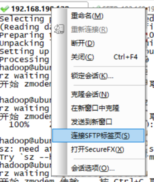

这里我们使用**lcd**命令来定位windows本地系统的一个位置,使用**lpwd**可以查看当前windows路径.
使用**cd**来定位linux的路径,**pwd**查看当前linux路径:

```
sftp  lcd F:\temp
sftp  lpwd
F:/temp
sftp  cd /opt
sftp  pwd
/opt
sftp  
```

### 批量文件下载&上传

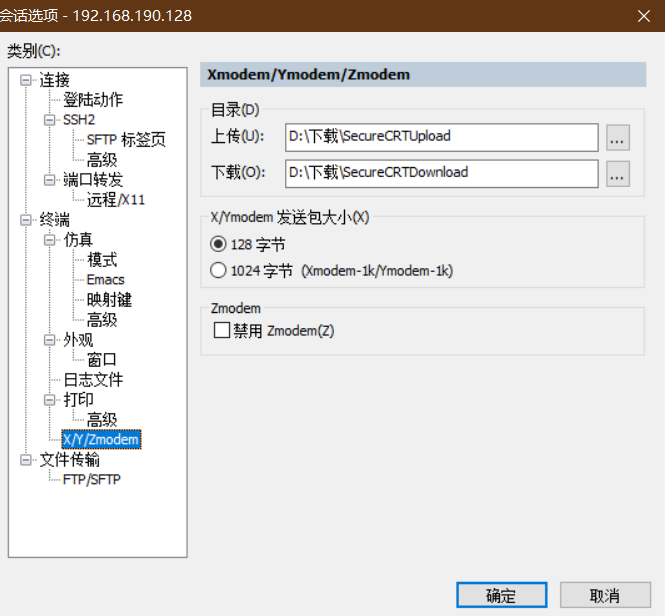

在这里,我们使用的是**sz**和**rz**,需要先下载命令:`yum install lrzsz`
使用**rz 文件名**可以弹出一个文件选择框,可以选择将对应的文件上传到linux系统中
使用**sz 文件名**同样选择对应的文件或者文件夹,将linux中的文件下载到windows中.

## Lombok插件

Lombok常用的注解有：

* @Data ：相当于@Setter + Getter + @ToString + @EqualsAndHashCode
* @Setter @Getter：作用于属性上，自动生成getter和setter方法
* @NonNull：判断是否为空,如果为空,则抛出java.lang.NullPointerException
* @Synchronized：作用在方法上，自动添加到同步机制，生成的代码并不是直接锁方法而是锁代码块
* @ToString：生成toString()方法，该注解有以下多个属性可以进一步设置：
  * callSuper：是否输出父类的toString方法，默认为false
  * includeFieldNames：是否包含字段名称，默认为true
  * exclude：排除生成tostring的字段
* @EqualsAndHashCode
* @Cleanup：用于确保已分配的资源被释放，自动帮我们调用close()方法。比如IO的连接关闭。
* @SneakyThrows
* @NoArgsConstructor：自动生成无参数构造函数。
* @AllArgsConstructor：自动生成全参数构造函数。
* @Builder
* @SuperBuilder
* @Slf4j注入日志类对象log

## git连接github失败

首先确保网络畅通，ping www.baidu.com

ping github.com 发现GitHub.com无法访问，连接超时

解决：

打开C:\Windows\System32\drivers\etc\hosts，

确实没有github.com的解析 
在文件末尾添加如下内容，并保存：

192.30.255.112  github.com git 
185.31.16.184 github.global.ssl.fastly.net 

或修改连接协议

可以尝试把https://换成 git://

## HTML中的xmlns属性

该属性为XML 命名空间（XML Namespaces）

XML 命名空间提供避免元素命名冲突的方法。

**命名冲突**

在 XML 中，元素名称是由开发者定义的，当两个不同的文档使用相同的元素名时，就会发生命名冲突。

**使用前缀来避免命名冲突**

前缀赋予了一个与某个命名空间相关联的限定名称。

```xml
<h:table></h:table> 表示表格
<f:table></f:table> 表示桌子
```

**xmlns属性**

当命名空间被定义在元素的开始标签中时，所有带有相同前缀的子元素都会与同一个命名空间相关联。

```
xmlns:namespace-prefix="namespaceURI"
```

> 用于标示命名空间的地址不会被解析器用于查找信息。其惟一的作用是赋予命名空间一个惟一的名称。不过，很多公司常常会作为指针来使用命名空间指向实际存在的网页，这个网页包含关于命名空间的信息。

**默认的命名空间**

为元素定义默认的命名空间可以让我们省去在所有的子元素中使用前缀的工作。

```
xmlns="namespaceURI"
```

## 将本地web服务映射到公网访问 

* 租用虚拟主机

* 租用服务器

* 把本地服务器映射到公网上

  * 使用命令行Localtunnel工具

    ```shell
    $ npm install localtunnel -g
    $ npm install localtunnel -g --registry=https://registry.npm.taobao.org
    $ lt --port 8081
    tunnel server offline: connect ETIMEDOUT 138.197.63.247:80, retry 1s
    tunnel server offline: connect ETIMEDOUT 138.197.63.247:80, retry 1s
    tunnel server offline: connect ETIMEDOUT 138.197.63.247:80, retry 1s
    tunnel server offline: connect ETIMEDOUT 138.197.63.247:80, retry 1s
    your url is: https://gzpmrvqixf.localtunnel.me
    
    ```

    `--port`是指定本地web服务监听的端口，我这里是`8081`。

    你可能会遇上我上面的情况，就是隧道服务*开启失败*，此时别着急，等到它*自动重新连接*就好了。

    这时候我们就可以通过`https://gzpmrvqixf.localtunnel.me`公网的形式来访问本地的项目了。

  * 使用ngrok.com网站的客户端工具[ngrok - download](https://ngrok.com/download)

    ```shell
    $ cd dir # ngrok客户端的目录
    
    # git
    $ ./ngrok.exe http 8081
    
    # 如果是windows自带的cmd环境中，要换成
    ngrok.exe http 8081
    
    ```

    这时候我们就可以通过`http://71e36e17.ngrok.io`来访问我们本地的项目了，这个也支持`https协议`。
  
    ngrok.com自定义域名，使用指定域名的好处就是以后每次开启隧道服务的时候，它生成的域名是固定的，也省得我们总是去复制。要想使用`ngrok.com`官网使用的固定域名，首先要注册账号，登录，升级服务才行
  
  * sunny ngrok自定义域名，遇到付费的服务就要*另找出路*了，幸好还有一个国产的`Sunny ngrok`服务可以用，它是中文面板，方便操作多了，而且有免费服务。[Sunny-Ngrok内网转发内网穿透 - 国内内网映射服务器](https://www.ngrok.cc/#down-client)
  
    开通隧道
  
    然后填写基本信息，填写你要绑定的端口，比如127.0.0.1:8081。具体如下：
  
    ngrok.cc开通隧道
  
    这里值得注意的是，自定义域名是独一无二的，不能跟别人的重复，所以要加上自己的特殊标识。
  
    开通成功后，找到隧道管理->找到自己所需监听的端口号的隧道id，然后复制，如下：
  
    隧道id
  
    切换到刚刚下载sunny ngrok客户端的目录里面，执行：
  
    ```bash
    $ cd dir # sunny ngrok的客户端目录
    
    # git
    $ ./sunny.exe clientid xxxxxx # 后面的xxxxxx换成你刚刚复制的隧道id
    
    # windows cmd
    sunny.exe clientid  xxxxxx
    
    ```
  
    
  
  * natapp免费隧道[NATAPP-内网穿透 基于ngrok的国内高速内网映射工具](https://natapp.cn/)
  
    一些操作步骤如下：
  
    进入[natapp官网](https://natapp.cn/)，注册登录后，选择购买隧道：
  
    然后*进入隧道管理，复制刚才开启的隧道的token值*：
  
    进入[下载链接](https://natapp.cn/)，下载客户端：
  
    最后，解压文件后，切换到`natapp文件夹`里面，执行以下命令：
  
    ```bash
    $ cd dir # natapp的客户端目录
    
    # git
    $ ./natapp.exe -authtoken=xxxxx # 后面的xxxxxx换成你刚刚复制的隧道token
    
    # windows cmd
    natapp.exe -authtoken=xxxxx
    ```
  

## RSS订阅

简单来说，RSS是一种协议，允许网站将其内容或其部分内容提供给其他网站或应用程序。通过使用RSS，可以节省宝贵的时间，并将各个站点提供的新闻和信息组织到一个中心点进行查看，也可以通过从使用RSS联合其内容的其他站点导入新闻来向你的站点添加新闻。

## NVM

```
nvm version ：查看nvm版本，version可简化为v。
 
nvm arch ：显示node是运行在32位还是64位。
 
nvm install <version> [arch] ：安装node， version是版本号也可以是latest（最新稳定版本）。可选参数arch指系统位数64/32，默认是当前系统位数。
 
nvm uninstall <version> ：卸载指定版本node。
 
nvm list [available] ：显示已安装的列表，可选参数available，显示可安装的所有版本。list可简化为ls
 
nvm use [version] [arch] ：使用指定版本node，可选参数arch可指定32/64位。这个是全局的。
 
nvm proxy [url] ：设置下载代理。不加url显示当前代理，url为none则移除代理。
 
nvm node_mirror [url] ：设置node镜像。默认https://nodejs.org/dist/。如果不写url，则使用默认url。设置后可至安装目录settings.txt文件查看。
 
nvm npm_mirror [url] ：设置npm镜像。默认https://github.com/npm/cli/archive/。如果不写url，则使用默认url。设置后可至安装目录settings.txt文件查看。
```

## Github

FastGithub

解压文件后可以在当前文件夹使用fastgithub.exe start（powershell下使用./fastgithub.exe start）命令以windows服务安装并启动。

这样每天就能在没有察觉的情况下稳定访问github了，简直不要太爽。

[dotnetcore/FastGithub: github加速神器，解决github打不开、用户头像无法加载、releases无法上传下载、git-clone、git-pull、git-push失败等问题](https://github.com/dotnetcore/FastGithub)


# 多线程

## ThreadLocal

```java
public static void main(String[] args) {

    Thread thread1 = new Thread(() -  {
        ThreadLocal<Object  threadLocal = new ThreadLocal< ();
        threadLocal.set("localValue thread1");
        System.out.println(threadLocal.get());
        threadLocal.remove();
    });

    ThreadLocal threadLocal = new ThreadLocal();
    threadLocal.set("localValue main");
    System.out.println(threadLocal.get());
    threadLocal.remove();

    thread1.start();
}
```

ThreadLocal.set()方法

```java
public void set(T value) {
    Thread t = Thread.currentThread();
    ThreadLocalMap map = getMap(t); //获取当前线程的 ThreadLocalMap变量
    if (map != null) {
        map.set(this, value);
    } else {
        createMap(t, value);
    }
}
```

Thread类的ThreadLocal.ThreadLocalMap成员变量

```java
/* ThreadLocal values pertaining to this thread. This map is maintained
 * by the ThreadLocal class. */
ThreadLocal.ThreadLocalMap threadLocals = null;

/*
 * InheritableThreadLocal values pertaining to this thread. This map is
 * maintained by the InheritableThreadLocal class.
 */
ThreadLocal.ThreadLocalMap inheritableThreadLocals = null;
```

ThreadLocalMap是类似于Map 的数据结构 。key 为当前对象 的 Thread 对象，值为 Object 对象。

# 计算机网络

## OSI与TCP/IP各层的结构与功能,都有哪些协议

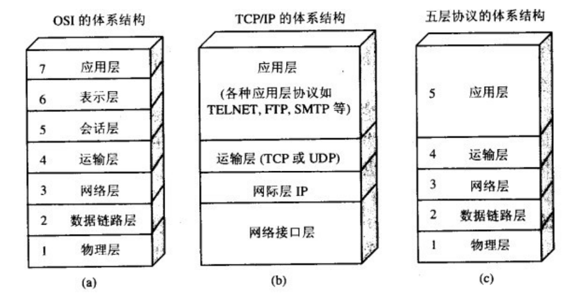

| 分层       | 功能                                                         | 协议                                                       | 数据单元 |
| ---------- | ------------------------------------------------------------ | ---------------------------------------------------------- | -------- |
| 应⽤层     | 通过应用进程间的交互完成特定网络应用                         | 域名系统[^1]DNS、万维网应用HTTP[^2]、电子邮件SMTP、SSH[^3] | 报文     |
| 运输层     | 向两台主机进程之间的通信提供通⽤的数据传输服 务，多个应⽤层进程可同时使⽤下⾯运输层的服务（复用），运输层把收到的信息分别交付上⾯应⽤层中的相应进程（分用） | 传输控制协议TCP、用户数据协议UDP                           | 分组     |
| ⽹络层     | 在 计算机⽹络中进⾏通信的两个计算机之间可能会经过很多个数据链路，也可能还要经过很多通 信⼦⽹。⽹络层的任务就是选择合适的⽹间路由和交换结点， 确保数据及时传送。 | ⽹际协议IP                                                 | IP数据报 |
| 数据链路层 | 两台主机之间的数据传输，总是在⼀段⼀段的链 路上传送的，这就需要使⽤专⻔的链路层的协议。在两个相邻节点间的链路上传送帧。每⼀帧包括数据和 必要的控制信息（如同步信息，地址信息，差错控制等）。 |                                                            | 帧       |
| 物理层     | 物理层(physical layer)的作⽤是实现相邻计算机节点之间⽐特流的透明传送，尽可能屏蔽掉具 体传输介质和物理设备的差异。 |                                                            | 比特     |

[^1]: 域名系统(Domain Name System缩写 DNS，Domain Name被译为域名)是因特⽹的⼀项核 ⼼服务，它作为可以将域名和IP地址相互映射的⼀个分布式数据库，能够使⼈更⽅便的访问 互联⽹，⽽不⽤去记住能够被机器直接读取的IP数串
[^2]: 超⽂本传输协议（HTTP，HyperText Transfer Protocol)是互联⽹上应⽤最为⼴泛的⼀种⽹ 络协议。所有的 WWW（万维⽹） ⽂件都必须遵守这个标准。设计 HTTP 最初的⽬的是为 了提供⼀种发布和接收 HTML ⻚⾯的⽅法。
[^3]: SSH（安全外壳协议，Secure Shell 的缩写）是建立在应用层基础上的安全协议。SSH 是目前较可靠，专为远程登录会话和其他网络服务提供安全性的协议，利用 SSH 协议可以有效防止远程管理过程中的信息泄露问题。简单来说，SSH就是保障你的账户安全，将你的数据加密压缩，不仅防止其他人截获你的数据，**还能加快传输速度**。如果想详细了解的话，可以看这篇文章：[详述 SSH 的原理及其应用](https://blog.csdn.net/qq_35246620/article/details/54317740)

  

## 熟知常用的端口号

| 应用程序   | FTP   | TFTP | TELNET | SMTP | DNS  | HTTP | SSH  | MYSQL | REDIS |
| ---------- | ----- | ---- | ------ | ---- | ---- | ---- | ---- | ----- | ----- |
| 熟知端口   | 21,20 | 69   | 23     | 25   | 53   | 80   | 22   | 3306  | 6379  |
| 传输层协议 | TCP   | UDP  | TCP    | TCP  | UDP  | TCP  | TCP  | TCP   |       |

## TCP三层握手

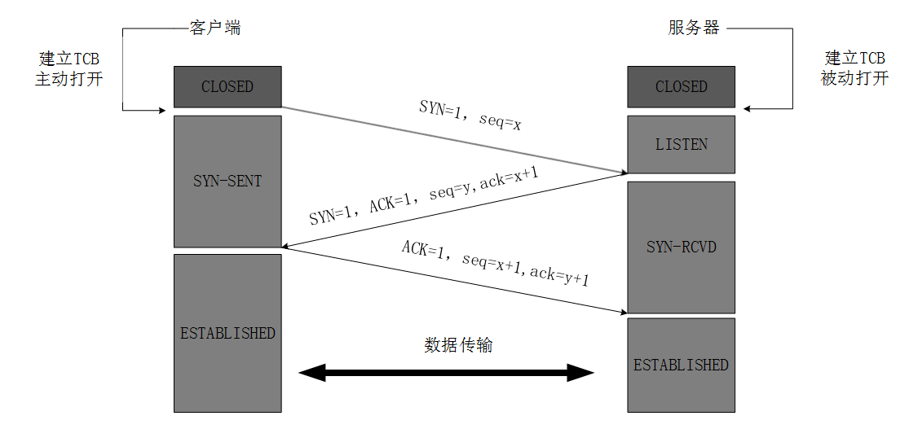

* **为什么TCP客户端最后还要发送一次确认呢？**

  采用三次握手得原因如下：假如因为网络堵塞，客户端不得不发送两次以上得连接请求以保证与服务器得连接建立，第一次连接成功建立。此时，就算服务端之后接收到了额外的连接请求报文并且回复了确认报文，客户端也不会再次发出确认。由于服务器收不到确认，就知道客户端并没有请求连接。

  因此，最后一次发送确认可以防止已经失效的连接请求报文突然又传送到了服务器，从而产生错误。

## TCP四次挥手

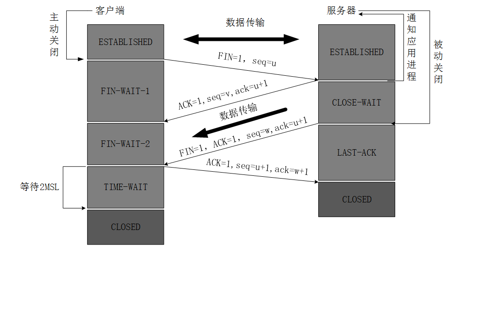

* **为什么建立连接是三次握手，关闭连接确是四次挥手呢？**

  建立连接的时候， 服务器在LISTEN状态下，收到建立连接请求的SYN报文后，把ACK和SYN放在一个报文里发送给客户端。
  而关闭连接时，服务器收到对方的FIN报文时，仅仅表示对方不再发送数据了但是还能接收数据，而自己也未必全部数据都发送给对方了，所以**己方可以立即关闭，也可以发送一些数据给对方**后，再发送FIN报文给对方来表示同意现在关闭连接，因此，己方ACK和FIN一般都会分开发送，从而导致多了一次。

## 在浏览器中输⼊url地址 -   显示主页的过程

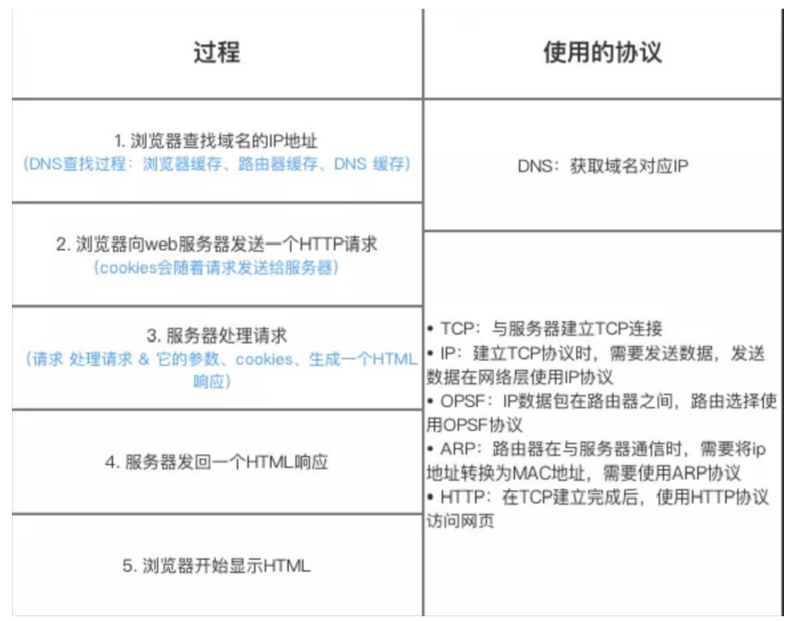

1. DNS域名解析（浏览器缓存、系统缓存、路由器缓存、DNS缓存）

   DNS缓存分为 主机递归查询本地域名服务器，本地域名服务器迭代查询 根域名服务器缓存，顶级域名服务器缓存，主域名服务器缓存。本地域名服务器地址由DHCP动态配置。

2. TCP连接

3. 发送HTTP请求（IP、OPSF、ARP）

4. 服务器处理请求并返回HTTP报文（IP、OPSF、ARP）

5. 浏览器解析渲染页面

6. 连接结束

## 浅谈认证

当一个设备（客户端）向一个设备（服务端）发送请求的时候，服务端如何判断这个客户端是谁。传统意义有两种认证方式：有状态认证、无状态认证。有状态和无状态最大的区别就是服务端会不会保存客户端的信息。

*  有状态验证（cookie - session 模型）
  * 因为客户端的信息都保存在服务端的 Session Manager 中，如果要将客户端的认证信息取消，只需要将对应的session 信息删除即可，及时响应，方便快捷。
  * 服务端**内存**保存着客户端的信息，用户量多则耗费大量内存
  * 部分设备本身不支持cookie或者禁用cookie，还有的手机浏览器也不支持cookie。
* 无状态的认证（token）  
  * 因为服务端不保留客户端的任何信息，每次只需要通过**特定的算法**进行校验，节省了大量存储空间；
  * 当客户端的token被盗用，或者需要手动封禁某个用户的时候，没办法对此token进行操作，必须等待token失效（如果在服务端维护token和用户的关系，技术可以实现，但是违背无状态的设计理念）。

# Linux

## fork

* Fork的作用是复制一个与当前进程一样的进程。新进程的所有数据（变量、环境变量、程序计数器等） 数值都和原进程一致，但是是一个全新的进程，并作为原进程的子进程
* 在Linux程序中，fork()会产生一个和父进程完全相同的子进程，但子进程在此后多会exec系统调用，出于效率考虑，Linux中引入了“**写时复制技术**”
* **一般情况父进程和子进程会共用同一段物理内存**，只有进程空间的各段的内容要发生变化时，才会将父进程的内容复制一份给子进程。

## 防火墙命令

一、iptables防火墙（需要安装防火墙sudo apt-get install firewalld命令查看插件）
1、基本操作

   ```bash
# 查看防火墙状态
service iptables status 
# 停止防火墙
service iptables stop 
# 启动防火墙
service iptables start 
# 重启防火墙
service iptables restart 
# 永久关闭防火墙
chkconfig iptables off 
# 永久关闭后重启
chkconfig iptables on　　
   ```

   2、开启80端口

   ```bash
vim /etc/sysconfig/iptables
# 加入如下代码
-A INPUT -m state --state NEW -m tcp -p tcp --dport 80 -j ACCEPT
保存退出后重启防火墙

service iptables restart
   ```

   二、firewall防火墙
   1、查看firewall服务状态

   ```bash
systemctl status firewalld
   ```

   出现Active: active (running)切高亮显示则表示是启动状态。

   出现 Active: inactive (dead)灰色表示停止，看单词也行。
   2、查看firewall的状态

   ```bash
firewall-cmd --state
   ```

   3、开启、重启、关闭、firewalld.service服务

   ```bash
# 开启
service firewalld start
# 重启
service firewalld restart
# 关闭
service firewalld stop
   ```

   4、查看防火墙规则

   ```bash
firewall-cmd --list-all
   ```

   5、查询、开放、关闭端口

   ```bash
# 查询端口是否开放
firewall-cmd --query-port=8080/tcp
# 开放80端口
firewall-cmd --zone=public --add-port=80/tcp --permanent
# 移除端口
firewall-cmd --permanent --remove-port=8080/tcp
#重启防火墙(修改配置后要重启防火墙)
firewall-cmd --reload
   ```

## 拷贝文件文本到剪贴板

apt-get install xsel

cat hello.c | xsel -b

　显示剪贴板中的数据：

　　xsel -b -oxsel -b -o

　　向剪贴板中追加数据：

　　xsel -b -a

　　覆盖剪贴板中的数据：

　　xsel -b -i

# Spring

## 组件扫描时 use-default-filters="false"的正确理解

在spring配置中

```xml
<!--开启组件扫描-- 
    <!--此处可以不设置use-default-filters 默认为true
    即使用默认的 Filter 进行包扫描，而默认的 Filter 对标有 @Component、@Repository、@Service和@Controller 的注解的类进行扫描-- 
    <context:component-scan base-package="com.tintin" use-default-filters="true" 
        <context:exclude-filter type="annotation" expression="org.springframework.stereotype.Controller"/ 
    </context:component-scan 
```

在springMVC配置中

```xml
<!--开启组件扫描 只扫描带有Controller注释的类-- 
	<!--此处设置use-default-filters="false" 搭配 include-filter 可以实现更加自由地指定哪些注解由扫描器扫描-- 
    <!--springmvc容器中的类可以引用spring ioc中的类反过来则不行-- 
    <context:component-scan base-package="com.tintin" use-default-filters="false" 
        <context:include-filter type="annotation" expression="org.springframework.stereotype.Controller"/ 
    </context:component-scan 
```

# SpringCloud

[Spring](https://so.csdn.net/so/search?q=Spring&spm=1001.2101.3001.7020) Cloud Alibaba 致力于提供分布式应用服务开发的一站式解决方案。项目包含开发分布式应用服务的必需组件，方便开发者通过 Spring Cloud 编程模型轻松使用这些组件来开发分布式应用服务。

Sentinel：把流量作为切入点，从流量控制、熔断降级、系统负载保护等多个维度保护服务的稳定性。

**Nacos：一个更易于构建云原生应用的动态服务发现、配置管理和服务管理平台。**

RocketMQ：一款开源的分布式消息系统，基于高可用分布式集群技术，提供低延时的、高可靠的消息发布与订阅服务。

Dubbo：Apache Dubbo™ 是一款高性能 Java RPC 框架。

Seata：阿里巴巴开源产品，一个易于使用的高性能微服务分布式事务解决方案。

Alibaba Cloud ACM：一款在分布式架构环境中对应用配置进行集中管理和推送的应用配置中心产品。

Alibaba Cloud OSS: 阿里云对象存储服务（Object Storage Service，简称 OSS），是阿里云提供的海量、安全、低成本、高可靠的云存储服务。您可以在任何应用、任何时间、任何地点存储和访问任意类型的数据。

Alibaba Cloud SchedulerX: 阿里中间件团队开发的一款分布式任务调度产品，提供秒级、精准、高可靠、高可用的定时（基于 Cron 表达式）任务调度服务。

Alibaba Cloud SMS: 覆盖全球的短信服务，友好、高效、智能的互联化通讯能力，帮助企业迅速搭建客户触达通道。

阿里巴巴提供的方案跟Spring官方提供的方案有一些对应关系：

Nacos = Eureka/Consule + Config + Admin

Sentinel = Hystrix + Dashboard + Turbine

Dubbo = Ribbon + Feign

RocketMQ = RabbitMQ

Schedulerx = Quartz

## Nacos

**nacos支持MySQL8吗_nacos mysql8.0修改**

提示无法连接数据库，检查配置的数据库连接确认无误。

conf/application.proporties

spring.datasource.platform=mysql

db.num=1

db.url.0=jdbc:mysql://localhost:3306/nacos_config?useUnicode=true&useJDBCCompliantTimezoneShift=true&useLegacyDatetimeCode=false&serverTimezone=UTC

db.user=root

db.password=123456

在nacos安装目录下新建plugins/mysql文件夹，并放入8.0+版本的mysql-connector-java-8.0.xx.jar，重启nacos即可。

启动时会提示更换了mysql的driver-class类。

nacos mysql8.0修改

**nacos Unable to start web server; nested exception is org.springframework.boot.web.server.WebServerE      解决  ：set MODE="cluster" 改为 set MODE="standalone"  或 startup.cmd -m standalone 启动**


# SpringBoot

## springboot项目找不到对应控制器错误

对于springboot项目，新增的包文件需要放在启动类的同级包下。

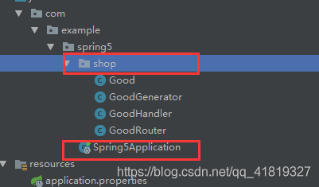

# Hadoop运行环境配置

## 服务器配置

安装CentOS-7.5-1804

创建服务器hadoop100

设置子网ip和网关

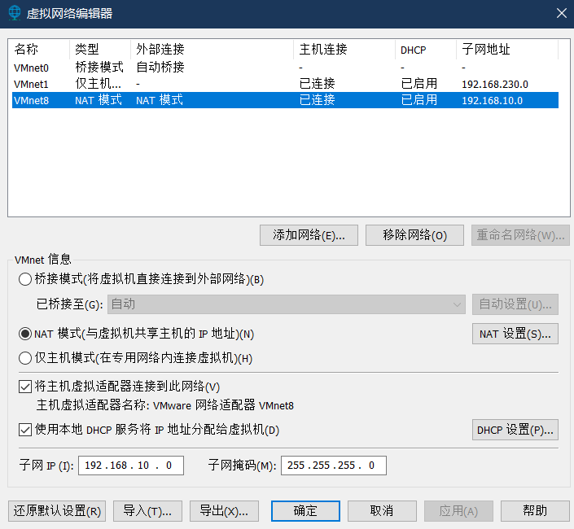

设置VMnet8的连接属性

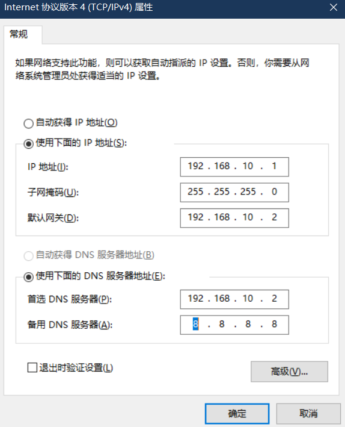

设置ip获取为静态方式（防止ip发生改变）

```bash
[root@hadoop100 tintin]# vim /etc/sysconfig/network-scripts/ifcfg-ens33 
```


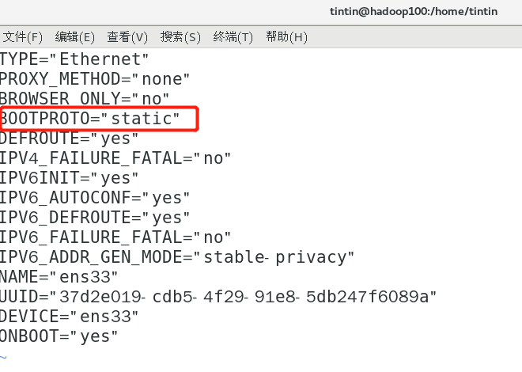

配置ip地址、网关、域名解析器


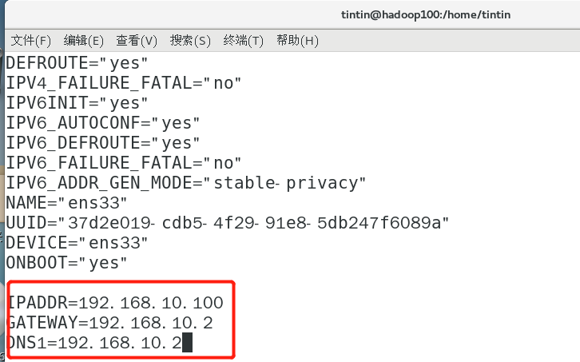

配置主机名称

```bash
[root@hadoop100 tintin]# vim /etc/hostname 
```

配置主机名称映射

```bash
[root@hadoop100 tintin]# vim /etc/hosts
```

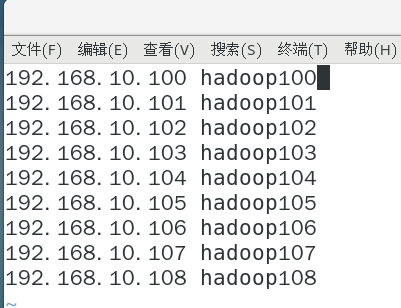

验证

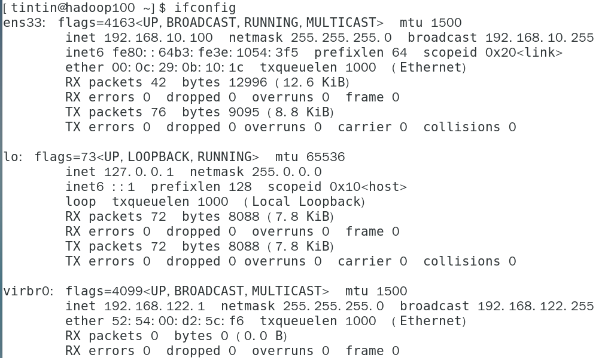

## xshell远程访问（xftp传输文件）

win10主机再host文件中添加域名映射

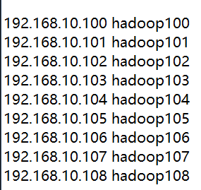

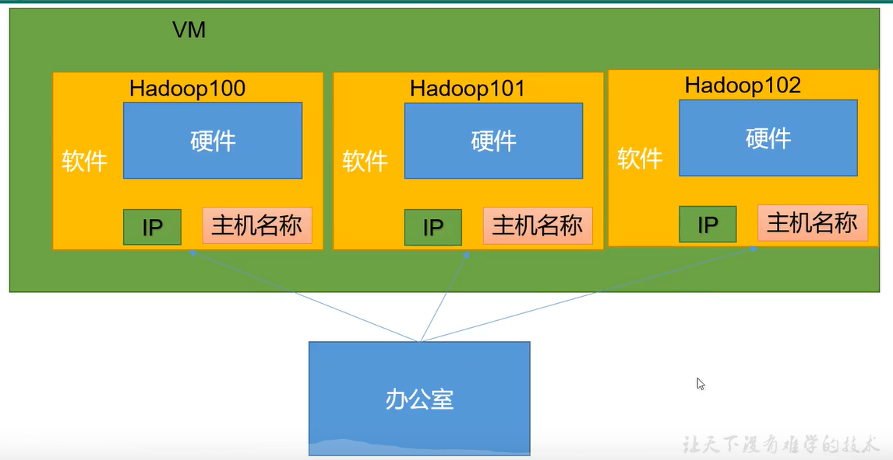

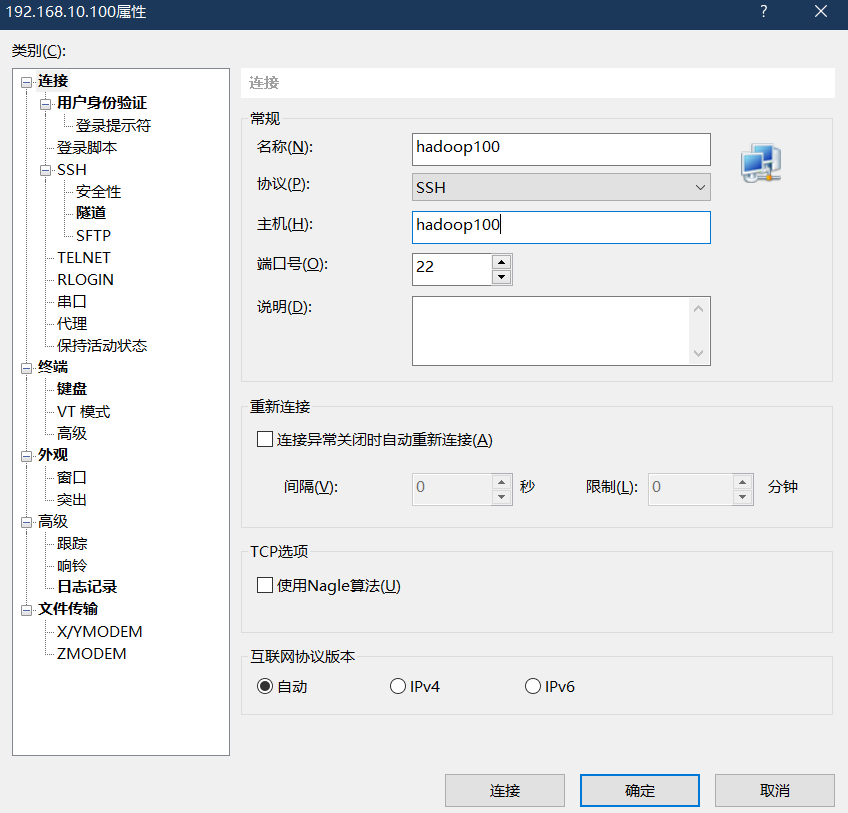

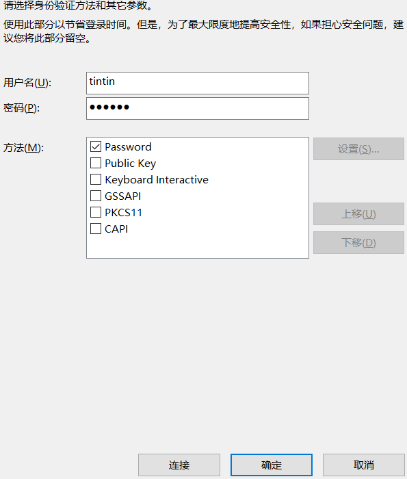

## 模板虚拟机环境准备

### 软件准备

```bash
[root@hadoop100 tintin]# yum install -y epel-release

```

   Extra Packages for Enterprise Linuⅸx是为“红帽系”的操作系统提供额外的软件包,适用于RHEL、 Centos和 Scientific linux。相当于是一个软件仓库,大多数rpm包在官方repository中是找不到的)

### 关闭防火墙

```bash
[root@hadoop100 tintin]# systemctl status firewalld
● firewalld.service - firewalld - dynamic firewall daemon
   Loaded: loaded (/usr/lib/systemd/system/firewalld.service; enabled; vendor preset: enabled)
   Active: active (running) since 一 2021-11-22 17:26:25 CST; 2h 20min ago
     Docs: man:firewalld(1)
 Main PID: 761 (firewalld)
    Tasks: 2
   CGroup: /system.slice/firewalld.service
           └─761 /usr/bin/python -Es /usr/sbin/firewalld --nofork --nopid

11月 22 17:26:22 hadoop100 systemd[1]: Starting firewalld - dynamic firewall daemon...
11月 22 17:26:25 hadoop100 systemd[1]: Started firewalld - dynamic firewall daemon.
[root@hadoop100 tintin]# systemctl stop firewalld
[root@hadoop100 tintin]# systemctl status firewalld
● firewalld.service - firewalld - dynamic firewall daemon
   Loaded: loaded (/usr/lib/systemd/system/firewalld.service; enabled; vendor preset: enabled)
   Active: inactive (dead) since 一 2021-11-22 19:47:05 CST; 5s ago
     Docs: man:firewalld(1)
  Process: 761 ExecStart=/usr/sbin/firewalld --nofork --nopid $FIREWALLD_ARGS (code=exited, status=0/SUCCESS)
 Main PID: 761 (code=exited, status=0/SUCCESS)

11月 22 17:26:22 hadoop100 systemd[1]: Starting firewalld - dynamic firewall daemon...
11月 22 17:26:25 hadoop100 systemd[1]: Started firewalld - dynamic firewall daemon.
11月 22 19:46:59 hadoop100 systemd[1]: Stopping firewalld - dynamic firewall daemon...
11月 22 19:47:05 hadoop100 systemd[1]: Stopped firewalld - dynamic firewall daemon.

```

### 配置用户具有root权限

```bash
[root@hadoop100 tintin]# vim /etc/sudoers

```

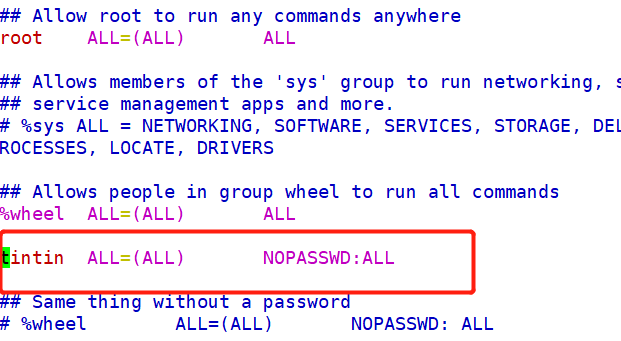

   注意: atguigu这一行不要直接放到root行下面,因为所有用户都属于whel组,你先配置了 atgulgu具有免密功能,但是程序执行到%whel行时,该功能又被覆盖回需要密码。所以 atguigu要放到%whel这行下面。

### 卸载原有jdk

```bash
[tintin@hadoop100 opt]$ sudo rpm -qa | grep -i java
python-javapackages-3.4.1-11.el7.noarch
java-1.8.0-openjdk-headless-1.8.0.161-2.b14.el7.x86_64
tzdata-java-2018c-1.el7.noarch
java-1.7.0-openjdk-1.7.0.171-2.6.13.2.el7.x86_64
java-1.8.0-openjdk-1.8.0.161-2.b14.el7.x86_64
javapackages-tools-3.4.1-11.el7.noarch
java-1.7.0-openjdk-headless-1.7.0.171-2.6.13.2.el7.x86_64

[root@hadoop100 opt]# sudo rpm -qa | grep -i java | xargs -n1 rpm -e --nodeps

```

rpm-qa:查询所安装的所有rpm软件包←
grep-i:忽略大小写
xargs -nl:表示每次只传递一个参数
rpm-e- nodes:强制卸载软件

## 克隆三台虚拟机

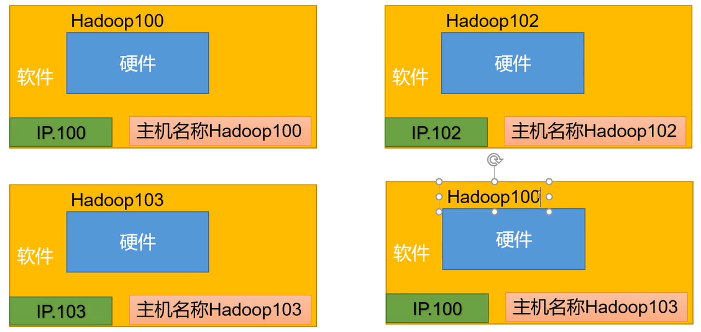

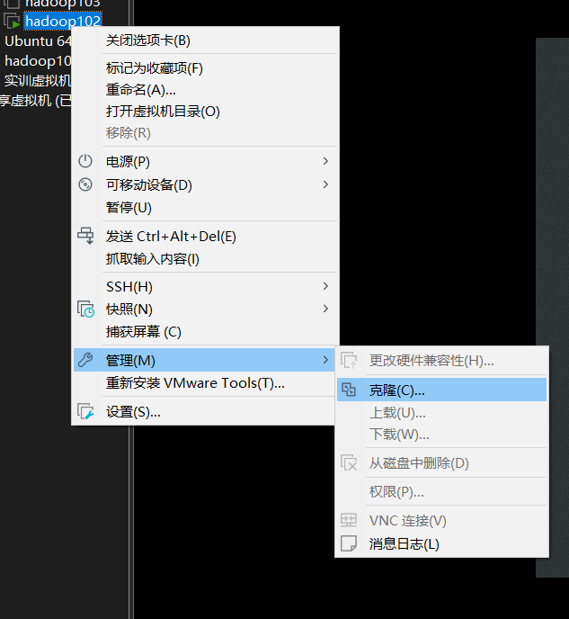

配置三部克隆机器并连接

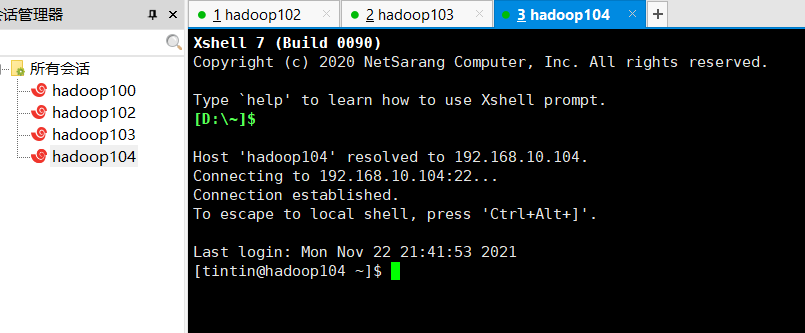

## 安装JDK

```bash
[tintin@hadoop102 module]$ cd /etc/profile.d
[tintin@hadoop102 profile.d]$ sudo vim my_env.sh


#JAVA_HOME
export JAVA_HOME=/opt/module/jdk1.8.0_311
export PATH=$PATH:$JAVA_HOME/bin

[tintin@hadoop102 profile.d]$ source /etc/profile

```

## 安装Hadoop

```bash
[tintin@hadoop102 module]$ cd /etc/profile.d
[tintin@hadoop102 profile.d]$ sudo vim my_env.sh

#HADOOP_HOME
export HADOOP_HOME=/opt/module/hadoop-3.3.1
export PATH=$PATH:$HADOOP_HOME/bin
export PATH=$PATH:$HADOOP_HOME/sbin

[tintin@hadoop102 profile.d]$ source /etc/profile

```

## hadoop运行模式

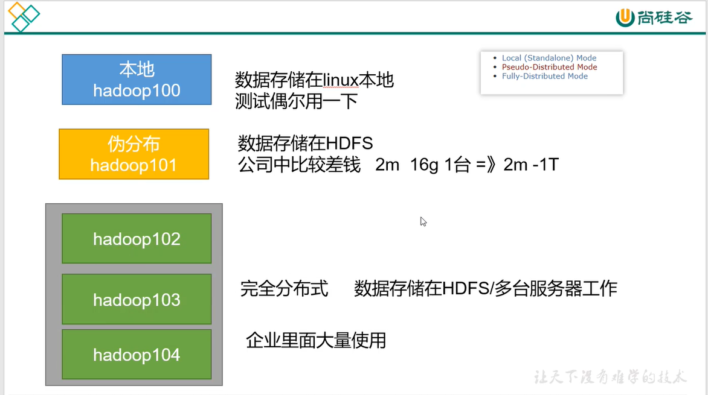

## 集群分发脚本xsync

### scp远程拷贝


###　rsync远程同步


### xsync集群分发脚本


```bash
[tintin@hadoop102 module]$ echo $PATH
/usr/local/bin:/usr/bin:/usr/local/sbin:/usr/sbin:/home/tintin/.local/bin:/home/tintin/bin:/opt/module/jdk1.8.0_311/bin:/opt/module/jdk1.8.0_311/bin:/opt/module/hadoop-3.3.1/bin:/opt/module/hadoop-3.3.1/sbin
[tintin@hadoop102 ~]$ pwd
/home/tintin
[tintin@hadoop102 ~]$ mkdir bin
[tintin@hadoop102 ~]$ vim xsync

#!/bin/bash
#1. 判断参数个数
if [ $# -lt 1 ]
then
 echo Not Enough Arguement!
 exit;
fi
#2. 遍历集群所有机器
for host in hadoop102 hadoop103 hadoop104
do
 echo ==================== $host ====================
 #3. 遍历所有目录，挨个发送
 for file in $@
 do
 #4. 判断文件是否存在
 if [ -e $file ]
 then
 #5. 获取父目录
 pdir=$(cd -P $(dirname $file); pwd)
 #6. 获取当前文件的名称
 fname=$(basename $file)
 ssh $host mkdir -p $pdir
 rsync -av $pdir/$fname $host:$pdir
 else
 echo $file does not exists!
 fi
 done
done

#分发
[tintin@hadoop102 ~]$ sudo ~/bin/xsync /etc/profile.d/my_env.sh
[tintin@hadoop103 ~]$ source /etc/profile
[tintin@hadoop104 ~]$ source /etc/profile
```

## ssh免密配置


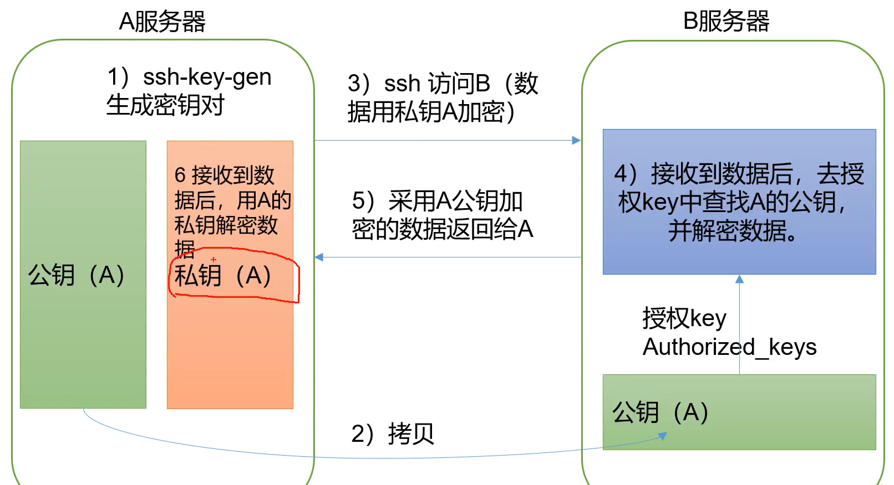

```bash
# 生成rsa密钥和公钥
[tintin@hadoop102 ~]$ ssh-keygen -t rsa

#拷贝公钥到其他服务器
[tintin@hadoop102 ~]$ ssh-copy-id hadoop103
[tintin@hadoop102 ~]$ ssh-copy-id hadoop104
[tintin@hadoop102 ~]$ ssh-copy-id hadoop102
```


   # MySQL

## MySQL授予远程连接的权限

在我们使用mysql数据库时，有时我们的程序与数据库不在同一机器上，这时我们需要远程访问数据库。缺省状态下，mysql的用户没有远程访问的权限。

* 改表法

  ```sql
  USE mysql;
  SELECT HOST,USER FROM USER;
  UPDATE USER SET HOST = '%' WHERE USER = 'root';
  FLUSH PRIVILEGES; # 刷新权限
  ```

* 授权法

```shell
C:\Users\82129>mysql -u root -ptintin
mysql>GRANT ALL PRIVILEGES ON *.* TO 'root'@'%'WITH GRANT OPTION
mysql>FLUSH PRIVILEGES
mysql>EXIT
```

场景，mysql8.0.17修改mysql用户权限，开启所有ip可访问
使用：`GRANT ALL PRIVILEGES ON *.* TO 'root'@'%' IDENTIFIED BY '密码' WITH GRANT OPTION;`
报错，原因是要先创建用户再进行赋权，不能同时进行，

解决：修正后的语句：分开三次执行

```sql
#创建账户
create user 'root'@'localhost' identified by  'password'

#赋予权限，with grant option这个选项表示该用户可以将自己拥有的权限授权给别人
grant all privileges on *.* to 'root'@'1ocalhost' with grant option

#改密码&授权超用户，flush privileges 命令本质上的作用是将当前user和privilige表中的用户信息/权限设置从mysql库(MySQL数据库的内置库)中提取到内存里
flush privileges;
```

## 修改密码

第一次修改密码

```
 ALTER USER USER() IDENTIFIED BY 'root';
```

5.7版本

```
set password for username @localhost = password(newpwd);
```


# IDEA

## Run DashBoard面板

workspace.xml

```xml
  <component name="RunDashboard">
    <option name="configurationTypes">
      <set>
        <option value="SpringBootApplicationConfigurationType" />
      </set>
    </option>
  </component>

```

## 打开idea代码全部报红

点击File,选择Invalidate Caches

点击Invalidate and Restart 

# edge浏览器插件推荐

## 广告拦截

AdGuard广告拦截器

uBlock Origin

## 阅读

Dark Reader 夜间阅读切换

OneTab  一键收集标签页

## 下载

IDM Integration Module

猫抓 cat-catch

## 脚本

复改猴 tempermokey

* 网页限制解除(改)
* CSDNGreener
* TimerHooker

## 媒体

PotPlayer YouTube Shortcut, Open.    复制链接到PotPlayer 

Open in VLC"M media player   复制链接到 VLC

## 翻译

沙拉查词

## 修改代理

User-Agent Switcher and Manager
