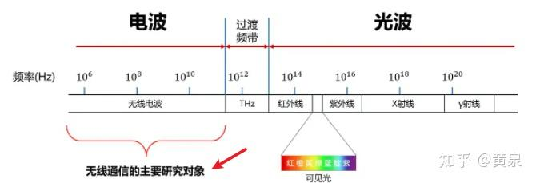
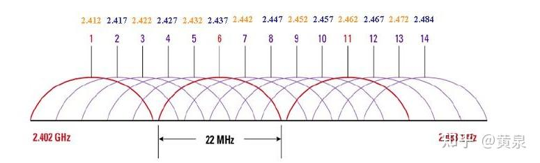
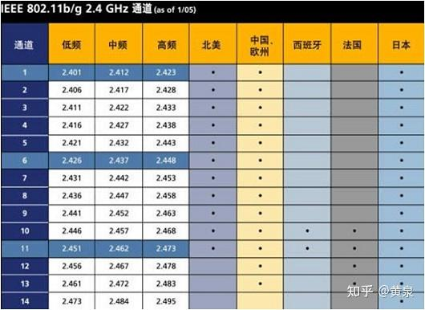
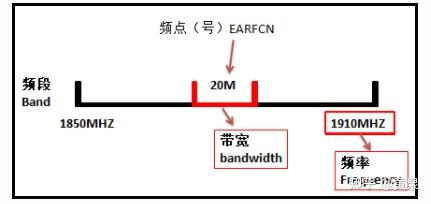
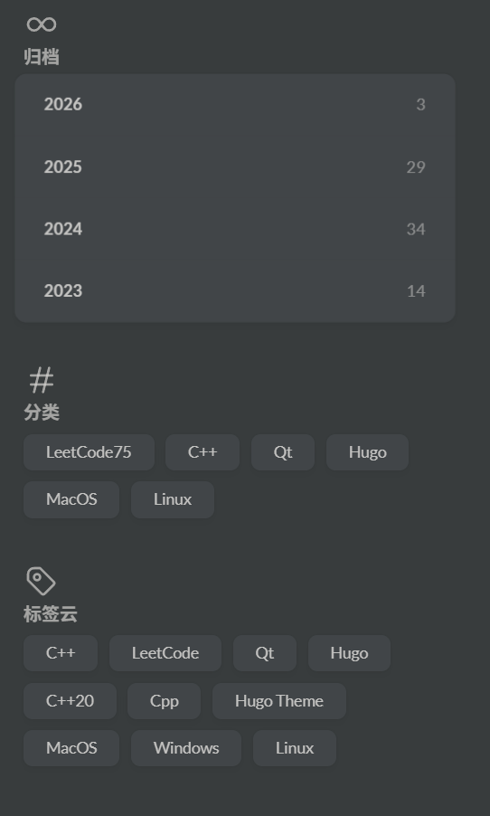
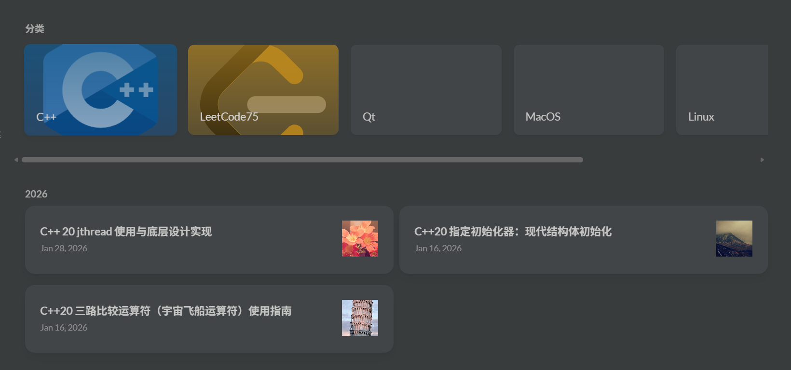
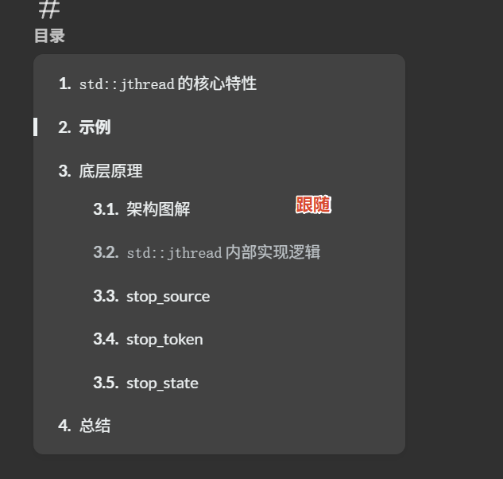
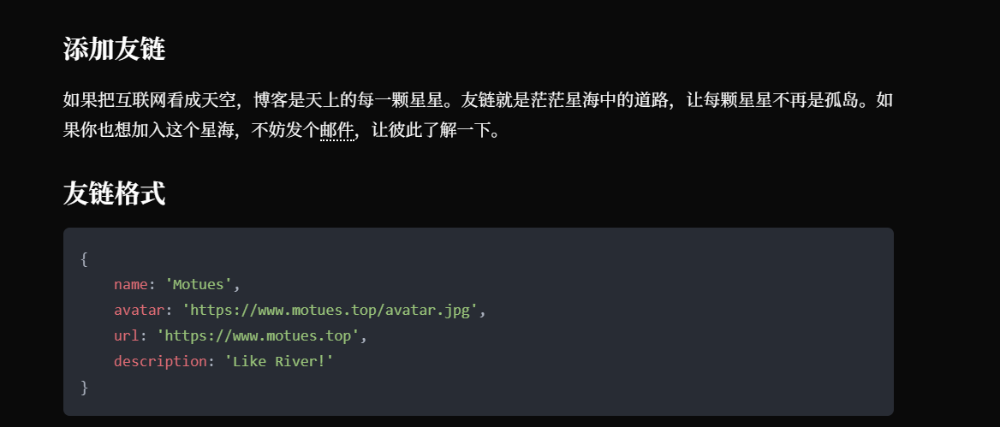
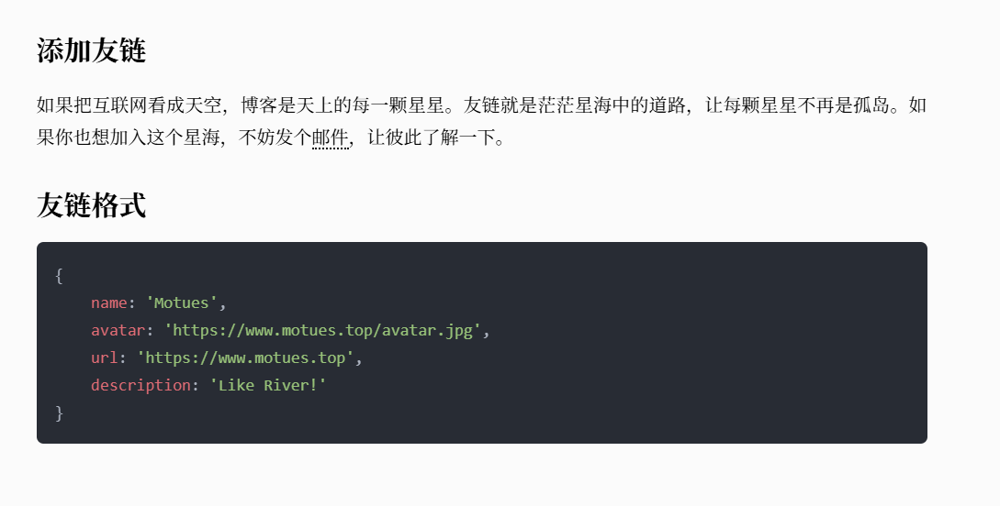
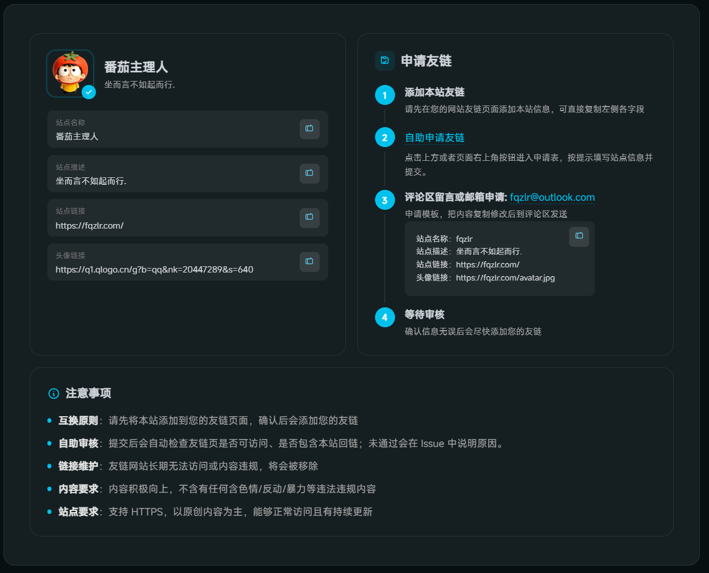

**用于积累书籍、安利、灵感、名言**

**用于随时且及时记录一些尚暂无分类归档的问题或知识**

**用于记录一些由 AI 助手、短视频、短文章产生的零星信息**

# 书籍

## 编程类

### 汇总

[EbookFoundation/free-programming-books: :books: Freely available programming books](https://github.com/EbookFoundation/free-programming-books)

[justjavac/free-programming-books-zh_CN: :books: 免费的计算机编程类中文书籍，欢迎投稿](https://github.com/justjavac/free-programming-books-zh_CN)

### Java多线程

[RedSpider1/concurrent: 这是RedSpider社区成员原创与维护的Java多线程系列文章。](https://github.com/RedSpider1/concurrent)

# 未分类

## 历法

> 在中国阴阳理念里，月为阴，日为阳，即月为太阴，阳为太阳。

### 阳历

以地球绕太阳公转周期为基础的历法，全称太阳历。地球绕太阳公转一圈的时间，约为 365.242 天，称为回归年，阳历就是以回归年为基本单位。太阳历本身就是人们观察四季变化后的产物，有利于指导农耕和生活。

> 实际上一回归年并不严格等于地球绕太阳公转的周期（365.256 天），这与地轴的旋转有关。

### 公历

公历就是太阳历中的一种，指现行的格里高利历，民间俗称阳历。公历也以回归年为基本单位，将一年划分为十二个月（这个“month”与月球无大关系），除 2 月以外的月份区分大小月，大月 31 天，小月 30 天，2 月在平年为 28 天，闰年为 29 天，如此，平年 365 天，闰年则有 366 天。

闰年是为了协调回归年的小数而诞生，为了精确，格里历规定 **非世纪年四年一闰，世纪年四百年一闰**。

### 阴历

以月相变化为基础的历法，全称太阴历。

人们通过观察月亮阴晴圆缺的变化，计算出 **月相的变化** 的平均周期约为 29.53059 天，这个周期称为 **朔望月**，又称太阴月或回归月。阴历就是以朔望月为基本单位编制而成。

> 月相变化与月球公转密切相关，但不严格相等（还与地球绕太阳的公转有关），月球绕地球公转一周为 27.32 天，称为恒星月。

朔望月天象周期小数和历法纪日整数之间必然产余数，制历便需要协调，于是便有了我们看到的 **大月 30 天，小月 29 天**。

由于月的周期过短，不利于对长时间段的把握，世界上使用太阴历法（如伊斯兰历）的文明，也给太阴历法制定了一个 12 个月的大周期（约 354 天），即太阴历年。但是太阴历年比阳历回归年少了 11 天，因此伊斯兰教国家的过年没有规律，可以发生在中国农历以及现行西历的任何一个月，譬如今年还在冬天过年，16 年后就要在夏天过年了。

### 农历

中国现行的传统历法，属于阴阳合历，因其始于夏朝，故又称“夏历”。也就是说农历既参考了太阳历的回归年，又融入了月相变化的周期。农历作为特殊的阴阳历，既能反映季节、农时和物候特征，又能体现月相变化和潮汐大小等自然现象。

**农历月**

农历月也以月亮的盈亏周期（即“朔望月”）为基础，分为大月（30 天）和小月（29 天）。

> 朔，指夜空完全不能看到月亮的时刻；望，指的是夜空看到的是满月的时刻。

农历上规定朔出现的那天是初一，由于月份天数的计算方法的误差和月相的周期的变化(29.27-29.83 天之间)，因此望出现的时间可能是十五或者十六。

> 确定每月初一（朔日）的方法有“平朔法”和“定朔法”，两个方法可以帮助决定哪些月份是大月 30 天，哪些月份是小月 29 天。

**二十四节气**

太阳周年运动轨迹划分为 24 等份，每 15° 为 1 等份，每 1 等份为一个节气，始于立春，终于大寒。逢奇为节（节令）和逢偶为气（中气）。

它是根据太阳在黄道（地球绕太阳公转的轨道）上的位置来划分的，因此很好了体现了农历“阳”的部分。

> 现代以春分为起点，因为太阳一年中第一次直射赤道。

| 季节   | 节气     | 农历月份 | 分类 | 黄道位置 | 含义                               |
| :----- | :------- | :------- | :--- | :------- | :--------------------------------- |
| **春** | **立春** | 正月     | 节令 | 315°     | 春季开始，东风解冻，万物复苏       |
|        | **雨水** | 正月     | 中气 | 330°     | 降雨开始，雨量渐增                 |
|        | **惊蛰** | 二月     | 节令 | 345°     | 春雷乍动，蛰虫惊醒，开始春耕       |
|        | **春分** | 二月     | 中气 | **0°**   | 昼夜平分，阴阳平衡                 |
|        | **清明** | 三月     | 节令 | 15°      | 天气清澈明朗，万物皆显（祭祀踏青） |
|        | **谷雨** | 三月     | 中气 | 30°      | 雨生百谷，利于农作物生长           |
|        |          |          |      |          |                                    |
| **夏** | **立夏** | 四月     | 节令 | 45°      | 夏季开始，万物生长旺盛             |
|        | **小满** | 四月     | 中气 | 60°      | 麦类灌浆，籽粒饱满但未成熟         |
|        | **芒种** | 五月     | 节令 | 75°      | 有芒作物成熟抢收，秋熟作物播种     |
|        | **夏至** | 五月     | 中气 | 90°      | 日长至极，阳极阴生                 |
|        | **小暑** | 六月     | 节令 | 105°     | 天气开始炎热，但未达极点           |
|        | **大暑** | 六月     | 中气 | 120°     | 一年中最热的时期                   |
|        |          |          |      |          |                                    |
| **秋** | **立秋** | 七月     | 节令 | 135°     | 秋季开始，暑去凉来                 |
|        | **处暑** | 七月     | 中气 | 150°     | 暑气至此而止，气温下降             |
|        | **白露** | 八月     | 节令 | 165°     | 天气转凉，露水凝结                 |
|        | **秋分** | 八月     | 中气 | 180°     | 昼夜平分，阴气渐盛                 |
|        | **寒露** | 九月     | 节令 | 195°     | 露水已寒，气温更低                 |
|        | **霜降** | 九月     | 中气 | 210°     | 开始降霜，草木黄落                 |
|        |          |          |      |          |                                    |
| **冬** | **立冬** | 十月     | 节令 | 225°     | 冬季开始，万物收藏                 |
|        | **小雪** | 十月     | 中气 | 240°     | 开始降雪，雪量尚小                 |
|        | **大雪** | 十一月   | 节令 | 255°     | 雪量增大，积雪可能                 |
|        | **冬至** | 十一月   | 中气 | 270°     | 日短至极，阴极阳生（数九开始）     |
|        | **小寒** | 十二月   | 节令 | 285°     | 天气寒冷，但未达极点               |
|        | **大寒** | 十二月   | 中气 | 300°     | 一年中最冷的时期                   |

**农历年**

通过置闰使得原先只有 354 天的 12 个朔望月基本符合四季更替的周期，也就是在某一年里增加一个“闰月”以补足与回归年的误差。

古人计算得出了 **十九年七闰**，即 19 年设置 7 个闰年（增加一个闰月），让这 19 年的总天数与 19 个公历年的总天数基本持平。

具体哪一年需要置闰以追赶太阳历，采用的方法是：**无中气则置闰**。

由于一个朔望月的长度比两个节令的间隔（约 30.5 天）要短一些，随着时间的推移，就会出现某一个农历月份里面，只有“节令”，而没有“中气”的情况。当这种情况发生时，这个月份就不算独立的一个月，而是被定为上一个月的闰月（例如闰四月、闰五月等）。

> 举一个例子，2025 年的农历六月廿八为中气“大暑”，足够接近下一个朔望月，使得下一个朔望月只有节令“立秋”，而中气“处暑”被挤到了下下个月初一，因此下一个月就不能成为七月，而是变成了闰六月，也就是增加一个“闰月”。

综上，一个农历年，如果是平年，有 353、354 或 355 天；如果是闰年，则有 383、384 或 385 天。

### “Lunar New Year” 的争议

“Lunar New Year”韩国等国家在网络上推行的，对农历新年的一种叫法。

严格来说，这指的是阴历新年，如伊斯兰历新年，应该只按月亮的周期计算，而不添加闰月来与回归年重合，其新年时间并不和农历新年重合。而农历新年，通过置润的方式使得时间保持在冬末春初。因此，从学术上讲，农历新年应该叫做 "Lunisolar New Year "，或者取农历的起源国 "Chinese New Year" 更为准确。 

在韩国的语境里是为了“去中国化”，向国际强调此非中国传来，而是本国的传统节日。在西方国家的语境里可能是为了涵盖了整个受汉文化圈影响的地区。在中国的语境上，这样的表述削弱了农历新年的传统根源性。

### 参考资料

[农历（中国现行的传统历法）_百度百科](https://baike.baidu.com/item/农历/67925)

## Wi-Fi

### Wi-FI 是什么

Wi-Fi（Wireless Fidelity，无线保真）是一种基于 IEEE 802.11 系列标准的无线局域网（WLAN）技术，它允许电子设备（如手机、电脑、平板、智能家居设备等）通过无线信号（主要是 2.4GHz 和 5GHz 频段）连接到网络并传输数据，无需依赖物理线缆（如网线）。

> Wi-Fi”常被写成“WiFi”或“Wifi”，但是它们并没有被 Wi-Fi 联盟认可。

通常需要一个无线路由器（或无线接入点 AP）作为信号发射源，路由器通过有线方式（如宽带、光纤）连接到互联网，再将网络信号转化为无线信号广播出去，设备（如手机）通过内置的 WiFi 模块接收信号，经过密码验证（若加密）后建立连接，实现上网功能。

### Wi-FI 标准

| WiFi 版本   | WiFi 标准        | 发布时间 | 最高速率       | 工作频段           | 信道带宽                            |
| ----------- | ---------------- | -------- | -------------- | ------------------ | ----------------------------------- |
| WiFi 7      | IEEE 802.11be    | 2022 年   | 46 Gbps        | 2.4GHz，5GHz，6GHz | 20MHz, 40MHz, 80MHz, 160MHz, 320MHz |
| Wi-Fi 6E    | 802.11ax (扩展)  | 2020 年   | 9.6 Gbps       | 2.4GHz，5GHz，6GHz | 20MHz, 40MHz, 80MHz, 160MHz         |
| WiFi 6      | IEEE 802.11ax    | 2019 年  | 9.6 Gbps       | 2.4GHz 或 5GHz     | 20MHz, 40MHz, 80MHz, 160MHz         |
| WiFi 5      | IEEE 802.11ac    | 2014 年  | 3.5 Gbps       | 5GHz               | 20MHz, 40MHz, 80MHz, 160MHz         |
| WiFi 4      | IEEE 802.11n     | 2009 年  | 600 Mbps       | 2.4GHz 或 5GHz     | 20MHz, 40MHz                        |
| Wi-Fi 1/2/3 | IEEE 802.11b/a/g | 2003 年  | 2Mbps ~ 54Mbps | 2.4GHz             | 20MHz                               |

### 频段

频段：是指一个连续电磁波的频率范围。无线通信使用的是电磁波，既然是波，那就有频率，通过将电磁波的频率划分为不同的范围（分段），即是频段。

> 频段可以理解为不同类型的道路网络（2.4GHz——国道/省道、5GHz——高速公路）。

$波长=波速 * 周期=波速/频率$，所以频率越高，波长越短。正是由于 2.4GHz 的频率较低，所以波长更长，更容易绕过障碍物继续传播。

### 信道

信道就是在频段基础上的更进一步的划分，目的是为了避免很多个设备之间的竞争，Wi-Fi 频段被划分为 14 个信道。

> 信道可以理解为路上划分成多条并行的车道，规定每个车辆只能在其中一条车道上行驶。

信道越多，那每个信道的宽度就很窄了，信道里边终端的冲突概率就变得更大了，如果想要避免或是减少冲突，那么则需要花费更多的时间来监测冲突，有问题的情况下，还需要重发数据包，那么速度肯定也提不上去。因此，虽然要避免冲突，但是划分过多信道也会影响传输性能。

假设一个路由器接入几十或上百个终端设备，14 个信道也不够用，其实是把所在信道的频率范围再细分进行复用。因为频率的范围不能分太细，分太细，信道内的终端发送信号时冲突的概率就变大了，需要消耗更多的时间来检测冲突、进行重发，速度自然就上不去了。

### 信道带宽

一个信道中最大频率与最小频率的差，就叫做信道带宽，这个值体现了信道覆盖的频率范围的大小。

> 信道带宽可以理解车道的宽度或车道捆扎数量。20 MHz：一条标准车道，车流稳定但速度有限。40/80/160 MHz：将2条、4条、8条标准车道并在一起的超宽车道，可以让更多车并排高速行驶。

### 传输速率

传输速率在这里指的是数据传输的快慢，单位是每秒比特（bit/s）或每秒字节（Byte/s）。影响它因素很多，主要是信道带宽和频率。带宽越大，传输速率越大。频率越高，传输速率越高。

> 可以理解为车速/每秒通车数（传输速率）受到道路类型（频段）、车道数量（带宽）、同行车辆数量（信道拥堵情况）等因素综合影响。理想状况下，高速公路+车道宽度（高频段+大信道带宽）使得车速越快。

另外，还有一些另外的技术来提供传输速率，例如正交频分复用、MIMO等。

### 参考资料

[WIFI 中的频段、信道、信道带宽、传输速率的理解 - 知乎](https://zhuanlan.zhihu.com/p/357339416)

# 术语积累

## 职场相关

### 外包公司

首先，外包的形式通常有两种，一种是派遣，一种是项目外包。

派遣指的是把你派到对应的用工单位打“短工”，不与这些短期员工建立正式的劳务关系，一旦项目结束，就不用再留这些员工了，这些“短工”所处的公司是人力外包公司；另一种是项目外包，是为企业本身不具备某项专业能力（比如财务、技术、设计等）提供解决方案，作为这个外包项目的成员，为解决这个项目需求，提供技术服务。这个项目结束后，作为项目外包公司的员工，会不断地去服务一个又一个项目。

大部分情况下，互联网的外包公司并非单纯的人力外包公司，而是 **专门承接其他公司（称为“甲方”或“发包方”）的业务，并为此提供人员或服务的公司**，这类公司往往只有项目而没有产品，盈利的来源一般是开发期间的人员工时费，属于 **供应商/承包方**。

甲方则是 有工作需求，但不想自己招人的公司，属于（客户/发包方）。比如一家银行、一个大厂的某个部门。

作为外包公司的员工，与外包公司签劳动合同，但实际在甲方场地工作，或者为甲方项目服务的人，在外包公司工作的时的待遇情况是相对不受重视的，常被甲方人员称为 **外派**。

> 也有一些公司虽然是软件服务供应商或解决方案提供商，但具有自主知识产权和核心产品，先有产品而后划分项目，赚的是软件销售费和维护费，并非常说的外包公司。只是其具有 To B 的商业模式，使得部分员工需要参与客制化与二次开发，比起 To C 的公司更需要参与实施与交付，因此这类公司可能会有很多 **驻场开发**、**项目实施人员**、**驻场运维**。

### 软考

软考是 **计算机技术与软件专业技术资格（水平）考试** 的简称，是由国家人力资源和社会保障部、工业和信息化部领导下的 **国家级考试**，其目对全国计算机与软件专业技术人员进行职业资格、专业技术资格认定和专业技术水平测试。

用处：积分落户、进入系统集成企业、以考代评、企业投标

## 互联网相关

### 云计算

定义：美国国家标准与技术研究院（NIST）定义：云计算是一种模型，它可以实现 **随时随地、便捷地**、**随需应变地** 从可配置计算资源共享池中获取所需的资源（例如，网络、服务器、存储、应用、及服务），**资源能够快速供应并释放**，**使管理资源的工作量和与服务提供商的交互减小到最低限度。**

云计算服务模式主要分为三类：IaaS（基础设施即服务）、PaaS（平台即服务）和 SaaS（软件即服务）。

**IaaS（基础设施即服务）**

Infrastructure as a Service：基础设施即服务

IaaS 是云服务的最底层，提供 **虚拟化的计算资源**。用户相当于租用了一台 "裸机" 服务器（包括计算、存储、网络等基础设施），需要自行安装操作系统、中间件和应用程序。它提供了最大的灵活性和控制权，适合需要定制化环境、进行高性能计算或处理敏感数据的企业。

**PaaS（平台即服务）**

Platform as a Service：平台即服务

PaaS 在 IaaS 之上构建，提供了一个 **完整的应用开发与部署环境**。服务商管理服务器、存储、网络、操作系统和开发工具（如数据库、运行时环境），开发者只需专注于编写和运行自己的应用程序代码。这种模式极大地提高了开发效率，适合软件开发团队和希望快速构建、测试、部署应用的企业。

**SaaS（软件即服务）**

Software as a Service：软件即服务

SaaS 是云服务的顶层，提供通过互联网访问的 **完整应用程序**。用户无需管理任何底层设施，通过浏览器或客户端即可直接使用软件。常见的办公协作工具、客户关系管理系统、企业资源规划软件等都属于此类。它的优点是开箱即用、无需维护，适合绝大多数终端用户和追求运营效率的企业。

在 SaaS 平台模式下，用户不再需要购买和维护软件的整个基础架构，而是通过订阅的方式获得对云端软件的访问权限。SaaS 平台提供商负责软件的部署、维护和安全性等方面的工作，用户只需要通过网络浏览器或专用应用程序就可以方便地访问和使用软件。收费模式一般是按年收费。

### OLAP

一种专门用来“分析”数据的工具。能从多个角度（比如时间维度看趋势、地区维度看分布、产品线维度看表现）快速、灵活且一致地查看数据，帮你找出背后的规律和隐藏的问题。如 **FineBI** 就是一款支持 OLAP 分析的企业级一站式 BI 数据分析与处理平台。

- **OLTP（On-Line TransactionProcessing）**：联机事务处理，管日常操作，比如你淘宝下单、银行转账。特点就是 **快进快出，保证事务别出错**。
- **OLAP（On-Line Analytical Processing）**：联机分析处理，管事后分析，比如看全年哪个商品卖得最好、哪个地区增长快。特点就是 **多维度、深挖历史数据**。

都是主要应用于银行、零售和电子商务等行业。

**CRM**

CRM（客户关系管理）：是通过技术手段整合客户数据、优化客户互动流程，最终实现“客户价值最大化”的数字化系统。

其核心目标是：**客户数据整合**、**客户服务优化**、**客服流程追踪**、**客户价值挖掘**

### VPS

VPS（Virtual Private Server）

**与云服务器的区别**

在互联网应用和服务器托管方面扮演着重要的角色。尽管它们都提供了类似的功能，但在某些方面存在一些区别：

* 架构：VPS 通常是一台物理机用虚拟化软件（VMware、KVM、Xen）切成多个虚拟机；而云服务器是多台物理机组成集群，统一调度。
* 调度便利度：宿主机出问题，你的 VPS 就挂了，想加 CPU、内存，必须停机或迁移新的 VPS；而云服务器隐藏了应用运行的物理环境，无感切换，资源池是共享的，只要集群里还有资源就能加。
* 计费模式：通常按月/年付费，配置固定，价格较便宜。支持按小时甚至按秒计费，价格较贵但好在可靠性和灵活性。

**什么情况用 VPS**

预算有限，搭建个人博客、小网站。

固定使用资源，不需要频繁调整。

适合技术学习，Linux 、部署项目等。

> 云服务器通常为企业使用

## 建站相关

### SEO

SEO  （Search Engine Optimization，搜索引擎优化），就是通过一系列技术和内容手段，让你的网站在搜索引擎（如 Google、百度、必应）的搜索结果中排名更靠前，从而获得更多免费流量的过程。

SEO 主要工作：

- 关键词研究：找到用户真正会搜索的那些词或短语。
- 网站内容优化：生产高质量、对用户有用的文章、视频等，并自然融入关键词。
- 网站结构优化：让网站加载速度快、手机浏览体验好、导航清晰、链接没有错误。
- 外部链接建设：争取其他高质量网站链接到你的网站。

## AI 相关

### 氛围编程

Vibe Coding（氛围式编程）是一种革命性的软件开发方法，由 *Andrej Karpathy* ——OpenAI 的联合创始人、前特斯拉 AI 负责人，在 2025 年初提出并推广。这种方法让开发者利用大型语言模型（LLMs）通过自然语言描述来生成代码，从而改变了程序员的角色——从手动编写代码转变为引导和优化 AI 生成的解决方案。

2026 年 2 月，氛围编程概念提出者安德烈·卡帕西发文表示，氛围编程应被“智能体工程（Agentic Engineering）”所替代 。

相比传统编程，开发者需要亲力亲为，掌握大量编程语言、算法、数据结构及框架，Vibe Coding 的开发者只需要会描述需求，告诉 AI 你想要的工程模样，"大语言模型"（LLM）就能理解你，然后生成对应的代码。

# 软件技巧

## IDEA

### 调试技巧

**断点处添加 log**

> 很多程序员在调试代码时都喜欢 print 一些内容，这样看起来更直观，print 完之后又很容易忘记删除掉这些没用的内容。

在正常加断点的地方使用快捷键 Shift + 鼠标左键

**字段断点**

> 类中的某个字段的值到底是在哪里改变的，你要一点点追踪调用栈，逐步排查，稍不留神，就可能有遗漏

在字段定义处鼠标左键添加断点

鼠标右键在弹框中勾选上 `Field access` 和 `Field modification` 两个选项

**异常断点**

> 洗碗代码停在抛出异常之前查看当时的变量信息

**方法断点**

> 一个接口的方法可能被多个子类实现，当运行时，需要查看调用栈逐步定位实现类

鼠标左键在方法处点击断点，断点上鼠标右键

### 常用插件

* IDE Eval Reset——无限试用
* 中文语言包
* BinEd——解读类 Class 二进制文件
* lombok——节省代码
* CheckStyle-IDEA——代码规范检查

## VS Code

- Git Graph——可视化git diff比较历史文件与当前文件

# 灵感

## 个人建站资料

名称：丁丁 tintinly

域名：tintinly.top

头像：

博客站名：丁丁的小破城 / Shabby Little Tintin Town

## 博客建站

**需求**

搭建一个个人（技术）博客

- 基本页面：

  - 首页：个人头像与介绍、最新或置顶文章

  - 归档：时间线形式展示文章、通过标签跳转文章分类

  - 友链：卡片式展示友链

  - 关于：个人详细介绍

- 右上角功能：搜索、切换日夜模式、切换中英功能

- 底部：系统稳定运行时长、技术栈、访问量和访客数、备案

- UI ：要求切换页面流畅、现代化的UI风格

**参考**

[Vincent Qiao - CTO & Entrepreneur](https://www.vincentqiao.com/)

[saicaca/fuwari: ✨A static blog template built with Astro.](https://github.com/saicaca/fuwari)

[Firefly 博客搭建教程 - Fqzlr](https://fqzlr.com/posts/firefly-set/windows-firefly/)

[【开源】一个fuwari风格的高颜值全栈博客!使用vue和elysia构建，bun运行环境。支持docker部署!_哔哩哔哩_bilibili](https://www.bilibili.com/video/BV1zG5e6AEiC/)

[阿叶Ayeez的博客~](https://blog.ayeez.cn/)

[【Astro】开源博客主题 Frosti 的二次开发 - 优雅Q弹_哔哩哔哩_bilibili](https://www.bilibili.com/video/BV1eYAfz1EuK/?p=1)

[XingHuiSamaの宝藏之地](https://www.xinghuisama.top/)

[鬼哥的空间 — Gui Ge's Space](https://luoli523.github.io/)

[青岩码农兜底日记 | Claude Code · AI 工具 · LLM 实战](https://blog.deepai.wiki/)

[Starhiroの小站](https://boke.hiromu.top/)

[Fqzlr - fqzlrの博客](https://fqzlr.com/)

[星轨手札 - 德国留学、日本旅行与技术折腾记录](https://yuulog.org/)

[Zyyo](https://zyyo.net/)

**截图**

首页整体

个人卡片布局

文章归档、分类标签布局

归档布局

文章卡片

下滑处理

阅读工具栏

文章目录

文章纸张形式

友链

## 个人页建站

**参考**

[Motues - 记录生活](https://www.motues.top/)

[路人甲 · Passer-by](https://passer-by.com/)

[Andy Hsu — Full Stack Developer](https://nn.ci/)

[xhofe (Andy Hsu)](https://github.com/Xhofe)

[Zyyo](https://zyyo.cc/)

[Diu](https://ddiu.io/)

# 英语词汇累积

> 记载词汇多与编程、互联网、计算机相关

dialog [ˈdaɪəˌlɔɡ] 

- v.对话；用对话表达
- n.问答；(小说中的)对白；对话体
- 网络对话框；对话方块；对话盒

# 待办

## 个人博客项目

### 增加友链如何添加的说明

### 增加文章分类字段

- 增加文章分类字段并维护示例文章的分类
- 增加归档的分类分组卡片如下
- 完善归档的点击分类的跳转（通过路由的方式可以查看对应分类或标签的文章）
- 增加首页文章、文章详情的分类字段显示

[友链 - Fqzlr](https://fqzlr.com/friends/)

### 增加文章版权所有标识

[全屏壁纸配置 | Mizuki Next Theme](https://docs.mizuki.mysqil.com/Basic-Layout/layout/fullscreen/#_5-透明度-opacity)

[Cloudflare Workers 部署 Cloudflare‑ImgBed 图床完整教程 - Fqzlr](https://fqzlr.com/posts/blog/img-bed/)

[更新指南和版本记录 - Momo](https://momo.motues.top/blog/intro/release/)

### 增加文章上下页功能

[更新指南和版本记录 - Momo](https://momo.motues.top/blog/intro/release/)

# 名言

往者不可谏，来者犹可追。——《论语·微子》

The best time to plant a tree was 20 years ago. The second best time is now.
