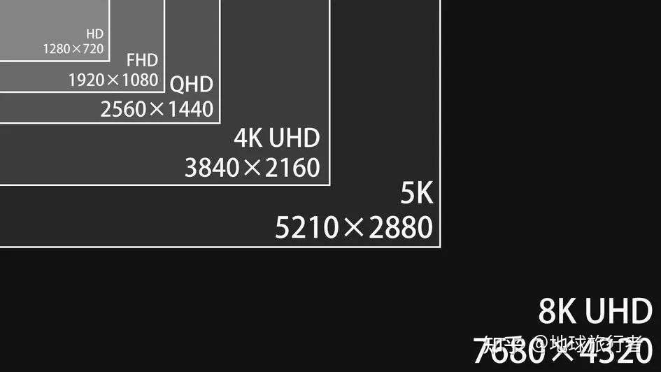

## 分辨率——画面精细度

P：表示的是“视频像素的总行数”

K：表示的是“视频像素的总列数×1024”。实际上是由DCI定义的一个**电影规范**，即2048×1080（2K） , 4096×2160（4K）

MP：像素总数，行像素和列像素相乘的结果

尺寸：显示器对角线长度，常见单位为英寸。常见尺寸有19英寸、22英寸、23.5英寸、27英寸、32英寸。

比例：宽高比例。当前流行电视图像传播的比例标准16:9。往前还有16:10、4:3。

| 常见的分辨率（像素）（16:9） | 水平分辨率 | 垂直分辨率 | 常见/混淆叫法 | 清晰度叫法         | 意义                    |
| ---------------------------- | ---------- | ---------- | ------------- | ------------------ | ----------------------- |
| 1280x720                     | 约1K       | 720P       | 720P          | HD（高清）         |                         |
| 1920x1080                    | 约2K       | 1080P      | 1080p         | FHD（全高清）      |                         |
| 2560x1440                    | 约2.5K     | 1440P      | 2K            | QHD（四倍高清）    | 像素刚好是高清的4倍     |
| 3840×2160                    | 约4K       | 2160P      | 4K            | 4K-UHD（4K超高清） | 像素刚好是全高清的4倍   |
| 7680×4320                    | 约8K       | 4320P      | 8K            | 8K-UHD（8K超高清） | 像素刚好是4K超高清的4倍 |

| 数字电影标准 | 水平分辨率 | 垂直分辨率 |
| ------------ | ---------- | ---------- |
| 2048×1080    | 2K         | 1080P      |
| 4096×2160    | 4K         | 2160P      |
| 8192×4320    | 8K         | 4320P      |

## 刷新率——画面流畅度

- 60Hz：适合日常办公、影音娱乐等场景。
- 144Hz：为游戏玩家提供更流畅的体验，特别适合竞技游戏。
- 240Hz：极致的高刷新率，适合追求极端流畅体验的电竞玩家。
