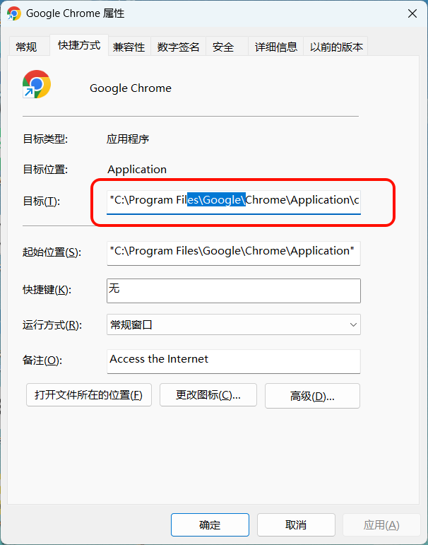
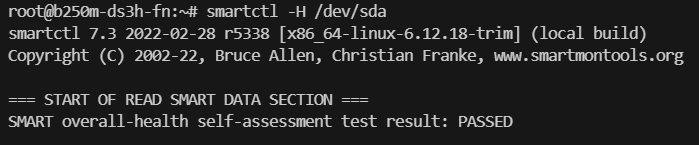
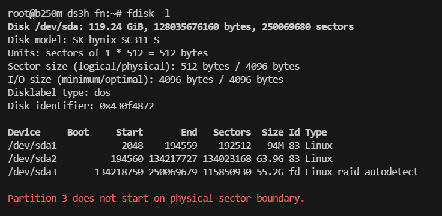
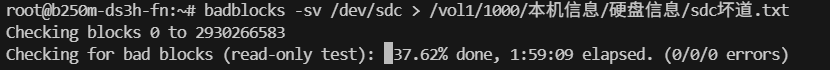

**随记用于及时记录一些尚无法分类归档的问题或知识**


## 分辨率——画面精细度

P：表示的是“视频像素的总行数”

K：表示的是“视频像素的总列数×1024”。实际上是由DCI定义的一个**电影规范**，即2048×1080（2K） , 4096×2160（4K）

MP：像素总数，行像素和列像素相乘的结果

尺寸：显示器对角线长度，常见单位为英寸。常见尺寸有19英寸、22英寸、23.5英寸、27英寸、32英寸。

比例：宽高比例。当前流行电视图像传播的比例标准16:9。往前还有16:10、4:3。

| 常见的分辨率（像素）（16:9） | 水平分辨率 | 垂直分辨率 | 常见/混淆叫法 | 清晰度叫法         | 意义                    |
| ---------------------------- | ---------- | ---------- | ------------- | ------------------ | ----------------------- |
| 1280x720                     | 约1K       | 720P       | 720P          | HD（高清）         |                         |
| 1920x1080                    | 约2K       | 1080P      | 1080p         | FHD（全高清）      |                         |
| 2560x1440                    | 约2.5K     | 1440P      | 2K            | QHD（四倍高清）    | 像素刚好是高清的4倍     |
| 3840×2160                    | 约4K       | 2160P      | 4K            | 4K-UHD（4K超高清） | 像素刚好是全高清的4倍   |
| 7680×4320                    | 约8K       | 4320P      | 8K            | 8K-UHD（8K超高清） | 像素刚好是4K超高清的4倍 |

| 数字电影标准 | 水平分辨率 | 垂直分辨率 |
| ------------ | ---------- | ---------- |
| 2048×1080    | 2K         | 1080P      |
| 4096×2160    | 4K         | 2160P      |
| 8192×4320    | 8K         | 4320P      |


## 刷新率——画面流畅度

- 60Hz：适合日常办公、影音娱乐等场景。
- 144Hz：为游戏玩家提供更流畅的体验，特别适合竞技游戏。
- 240Hz：极致的高刷新率，适合追求极端流畅体验的电竞玩家。

## Chrome 139+无法安装老旧扩展问题

2025 年 6 月起，Chrome 139 版分支将彻底移除对 Manifest V2 扩展的支持。由于Chrome强制推行 Manifest V3，会导致139版本会显示 这些扩展程序不再受支持的报错；那么如何解决这个问题呢？ 受影响的插件有 Tampermonkey 、 uBlock Origin 等。


解决方法1：

```
chrome://flags/*#extension-manifest-v2-deprecation-warning*  设置为[Disabled] 

chrome://flags/*#extension-manifest-v2-deprecation-disabled*  设置为[Disabled] 

chrome://flags/*#extension-manifest-v2-deprecation-unsupported*  设置为[Disabled] 

chrome://flags/*#allow-legacy-mv2-extensions*  设置为[Enabled]
```

解决方法2：更换edge

## Chrome 142+无法安装老旧扩展问题

软件属性添加启动参数 --disable-features=ExtensionManifestV2Unsupported,ExtensionManifestV2Disabled



## Windows本地用户空白密码不允许远程登陆问题


解决：win+r运行secpol.msc本地安全策略，依次选择**安全设置**->**本地策略 -> 安全选项**，在右侧选中**帐户: 使用空白密码的本地帐户只允许进行控制台登录**双击进行编辑禁用


## Linux扫描硬盘坏道

```shell
##### 使用以下命令安装smartmontools #####
$ sudo apt-get install smartmontools
```

```shell
##### 查看它的帮助 #####
$ man smartctl
$ smartctl -h
```

```shell
##### 查看整体健康自我评估 #####
# 参数 -H 或 --health
$ smartctl -H /dev/sda
```



```shell
##### 显示你的所有磁盘或闪存的信息以及它们的分区信息 #####
$ fdisk -l
```



```shell
##### 查你的 Linux 硬盘上的坏道/坏块 #####
#### -n 指定非破坏性读写模式，意味更长时间，默认非破坏性读写模式， -s 显示进度 -v 详细模式
$ sudo badblocks -nsv /dev/sda > badsectors.txt  
```



## NAS配置选择

先说明需求点：4盘位、占用空间小、低功耗、静音、Docker、虚拟机

### 机箱

先确定机箱的规格，也决定了主板/电源/散热的尺寸规格和其他硬件的扩展性，便于后续的硬件配置选型。

### CPU

**嵌入式CPU**

常见工控板或者一体板，主板和CPU固定死的

1. N100或N95。N95是更新架构，与N100配置相似，但是功耗高9W，便宜80左右目前300上下
2. 赛扬N5、J4系列。J4125,N5095，N5105,N5000。这个价位在200上下，高于300直接忽略，上N95。
3. J1900，J3610是13年产物，已经不推荐，理由是性能和对一些虚拟化的支持都已经淘汰，而且现在价格差距不大。

**桌面端低压CPU**

T结尾的低压CPU，G4560T，8100T

**笔记本CPU**

U结尾的低压CPU，8365U，这类型的CPU和板子也是嵌在一起的，然后能耗很低

### 电源

瓦数初步计算

主板：3W，带灯则5W

CPU：嵌入式或笔记本级15W，桌面级cpu40W

CPU风扇：2W

单条内存条：3W

单个固态硬盘：2W

单个风扇：5W

单个硬盘：8W，峰值12w

合计：轻配置功耗约40W，满配置功耗约108W

确保其电源输出功率至少能够满足 NAS 最大功耗的 1.5 倍

电源的负载率为50%时效率最高

选择80 PLUS认证更好的电源也能省电

结论：根据机箱大小，选用1u或sfx或atx的大品牌电源的200W电源

### 硬盘

为了静音，一般不要选择7200转的高性能硬盘，尽量用5400转或者其它低转速机械硬盘挂载。
