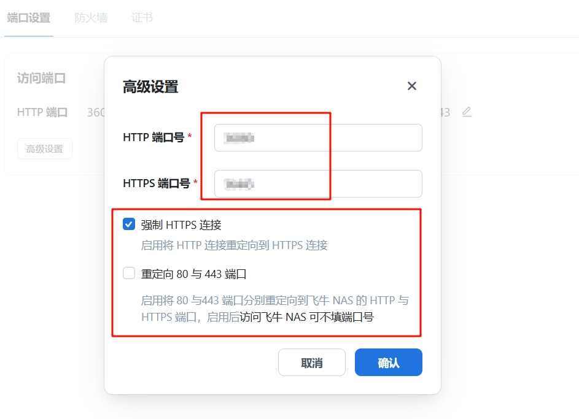

## 前言
本笔记用于记录搭建飞牛nas过程中遇到的问题以及经验记录。
推荐教程：https://fnnas.wiki/

### 需求
做一个数据存储、影音娱乐的家庭服务器

### 硬件配置
机箱 笨牛B8：无特别要求，萌生想法时正好出了这个笨牛这个品牌，第二天就下单了。
主板 B250M-ds3h：本意是买d3h型号，但买错了导致pcie口不够丰富，好在需求也能勉强满足到。
CPU G4560：双核四线程，G610核显满足基本的4k硬解，若使用虚拟机功或许换成四核心以上
内存 8GB+8GB 2400MHz ddr4
固态硬盘 256G：作为飞牛nas系统盘
> 使用了非静音风扇噪音很大，需优化

## docker
为了加快Docker镜像的下载速度，建议将默认的镜像源更换为国内镜像源。
Docker国内镜像源配置
https://docker.1ms.run
https://k-docker.asia
https://docker.1panel.live


## 应用推荐

## 资源推荐

## 飞牛切换至 Root 权限

1. 启用 SSH 服务
2. ssh终端 为 root 设置密码
```shell
sudo passwd root
```
3. 编辑 SSH 配置文件以允许 root 登录
```shell
sudo nano /etc/ssh/sshd_config
PermitRootLogin no
```
4. 重启 SSH 服务
```shell
sudo service sshd restart
```

## nas远程访问方式

### 异地组网
适合异地组内网，不需要对外公开服务的场景。如zerotier、easytier、飞鼠组网。
easy-tier  https://easytier.cn/guide/network/web-console.html


### frp内网穿透
适合无公网ip，需要对外公开服务的场景。带宽取决于代理服务器提供的性能

frp（Fast Reverse Proxy） 是一款开源的高性能反向代理工具，它允许您在不同网络之间建立安全的通信通道，用于实现端口映射、内网穿透和远程访问等多种网络连接需求。

### ipv6+ddns
家里的电信公网ipv6暂不会变化，有待时间检验。因此只需要在任意域名服务商购买域名，然后在任意的云解析平台添加AAAA记录即可。
购买域名：https://www.spaceship.com/
cloudflare可进行域名托管提供云解析服务，但实际检测发现电信运营商会进行域名劫持，最终会被重定向到最后一个电信dns服务器。
目前使用阿里云的免费dns解析，未出现问题。

若ipv6会发现变化，则可以使用飞牛官方的ddns或ddns-go

> 常用记录类型
A 将域名指向一个IPv4地址
AAAA 将域名指向一个IPv6地址
CNAME 将域名指向另外一个域名

> 域名劫持
指网络攻击者通过各种技术手段非法夺取域名控制权的行为。网络攻击者通过非法篡改域名系统（DNS）的解析记录，或通过网络钓鱼或其他欺骗手段获取所有者的登录凭证，将访问该域名的用户重定向到攻击者控制的恶意网站，以窃取用户的账号密码、银行卡号等敏感信息，或者进行网络钓鱼、传播恶意软件、显示恶意广告等非法活动。
运营商的域名劫持目的无非是赚钱与节约成本

## SSL证书
阿里云免费单域名证书-免费20个、有效期90天
部署`Certimate` -免费开源的 SSL 证书托管、自动续签工具
1panel也有类似续签功能，建议使用。


## 安全性
以下规则 适用于开启了ipv6+ddns域名访问的场景
若仅局域网访问，安全性本身就足够了。
* 修改管理员的用户名 和 密码 提高复杂性
* 修改门户端口  不使用   5666 5667  改为5位数复杂端口
* 部署ssl证书 强制https连接  取消80 443重定向

* 应用 容器端口 设置5位数复杂端口
* 开启防火墙 
    允许局域网访问 避免配置时出错导致无法访问飞牛
    
    外网允许默认端口 但 禁用官方的门户端口 8000 8001
    外网根据需要开启容器的端口